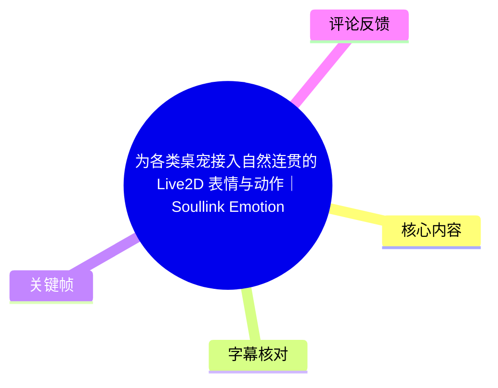
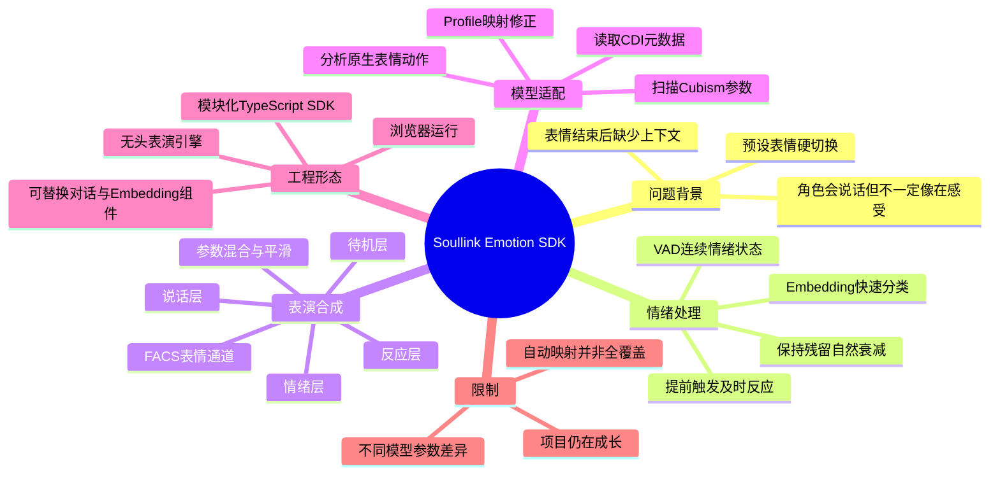
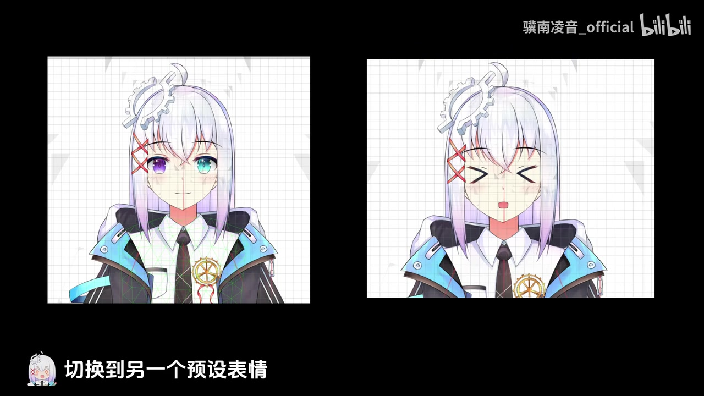
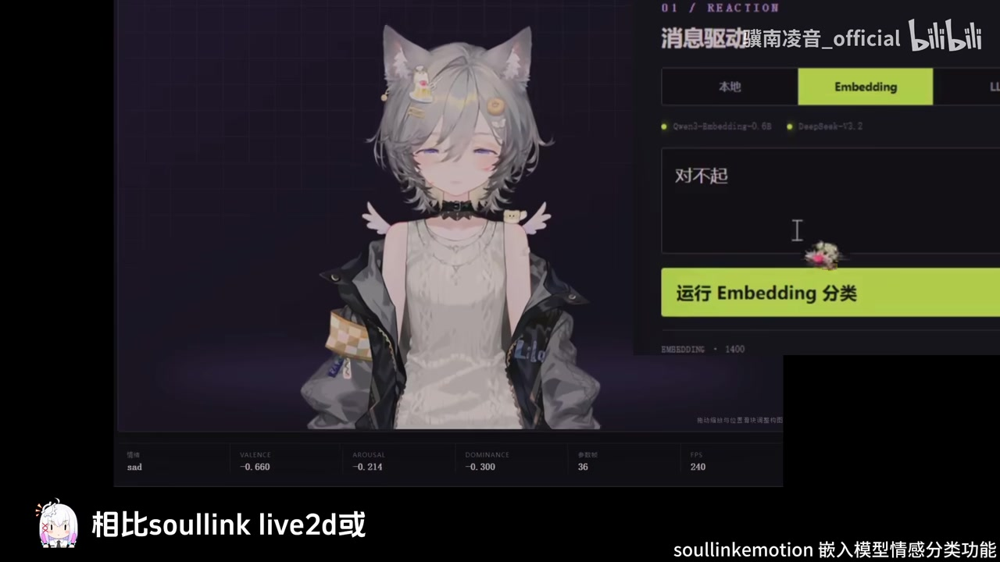
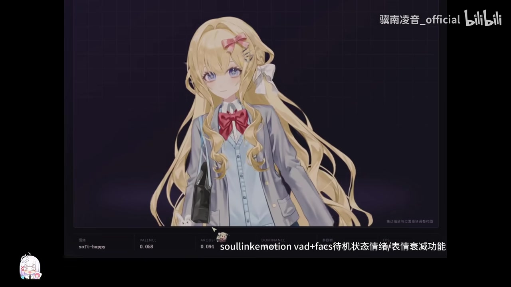

# 为各类桌宠接入自然连贯的 Live2D 表情与动作｜Soullink Emotion SDK 技术演示

> 来源：[Bilibili 视频](https://www.bilibili.com/video/BV1MXKi6NEbR)<br>
> UP 主：骥南凌音_official｜视频时长：04:38｜分辨率：2560×1440<br>
> 项目状态：视频简介称项目已在 GitHub 开源，仓库标识为 `nanlingyin/soullink-emotion-sdk`；视频同时明确说明项目“仍在不断成长”。

## 小结

视频介绍了 **Soullink Emotion（字幕中也写作 Soul Link Emotion / Solink）**：一套面向 Live2D 数字角色的实时情绪表演 SDK。它试图解决常见 L2D 数字人“在预设表情之间硬切换、话一结束便回到无上下文初始状态”的问题，将角色表现从单张表情切换，转为具有状态延续的实时表演。

其关键方法是：先用 **Embedding 分类**快速判定输入消息表达的情绪与语义，以便在完整对话回复与语音生成前就触发抬头、睁眼、微笑等及时反应；随后不把分类结果直接当作开关，而是更新由 **VAD（Valence、Arousal、Dominance，即愉悦度、唤醒度、支配度）**描述的内部情绪状态。情绪在事件结束后会经历保持、残留与自然衰减，逐步回归角色的情绪基线。

在渲染控制侧，VAD 状态继续影响 FACS 表情通道与动作系统；待机、情绪、反应、说话等表演层实时混合，经参数混合与平滑处理后，输出当前帧的 Live2D 参数。视频的核心观点是：自然感不应只依赖一次性“选中某个表情”，而应来自**低延迟反应、连续状态与多层动作混合**。

SDK 的另一个重点是模型泛化。由于不同 Live2D 模型的 Cubism 参数命名、参数范围和可控制能力各异，Soullink 会扫描 Cubism 参数、CDI 元数据、原生表情与动作文件来生成模型 Profile；对无法自动确认的参数，开发者可使用内置 LLM 辅助生成映射，或手动检查覆盖率、扫描参数范围并实时修正映射。

它适合为桌宠、AI 陪伴、数字人或浏览器内 Live2D 角色接入情绪表现的开发者。使用前需注意：视频没有公开 VAD 的数值范围、衰减曲线、Embedding 模型精度、端到端延迟、模型 Profile 格式或 API 调用示例，因此这些工程效果与性能边界不能仅凭演示确认；兼容性仍需要按各模型实际参数进行验证和修正。

## 思维导图





## 目录

- [背景：从预设表情切换到连续表演](#背景从预设表情切换到连续表演0022)
- [实时情绪响应：Embedding 先行](#实时情绪响应embedding-先行0106)
- [连续情绪状态：VAD 与自然衰减](#连续情绪状态vad-与自然衰减0129)
- [多层表演合成：FACS、动作与参数平滑](#多层表演合成facs动作与参数平滑0154)
- [模型泛化：扫描 Profile 并修正映射](#模型泛化扫描-profile-并修正映射0240)
- [模块化 SDK 与接入方式](#模块化-sdk-与接入方式0315)
- [实践步骤、安装与适用边界](#实践步骤安装与适用边界)
- [结论、限制与时效性](#结论限制与时效性0410)
- [字幕比对](#字幕比对)
- [评论分析](#评论分析)
- [处理记录](#处理记录)

## 背景：从预设表情切换到连续表演 [00:22](https://www.bilibili.com/video/BV1MXKi6NEbR?t=22)

视频先指出当前 L2D 数字人已有理解文字、生成语音的能力，但角色表现仍常是“一个预设表情切到另一个预设表情”。作者认为这种方式的问题不只是表情数量不足，而是缺少情绪的上下文与时间连续性：

1. 角色即使能说话，也未必呈现出“正在感受”的效果。
2. 一句话结束时，表情可能立即消失。
3. 角色会回到缺乏前文影响的初始状态，导致视觉表现与对话过程脱节。

Soullink Emotion 被定义为面向 Live2D 数字角色的**实时情绪表演 SDK**。按照视频描述，它持续维护角色的内部情绪状态，并将状态映射到表情、视线、头部、身体和说话动作。因此其目标不是判断“此刻该开心还是难过”后播放一个固定动作，而是使角色输出一段连续的表演。



> 图：画面并列展示同一 Live2D 角色的两种预设表情，并标注“切换到另一个预设表情”。这直接对应视频批评的传统控制模式：离散表情状态之间的切换，难以天然表达情绪积累和余韵。

视频开头还致谢了 **Zaxpris 的 LiveStudio 项目**提供新思路。此处名称以关键帧画面中出现的 “Zaxpris” 为准；本次 ASR 将其识别为 “Zack Pryce”，存在音译/专名识别偏差。

## 实时情绪响应：Embedding 先行 [01:06](https://www.bilibili.com/video/BV1MXKi6NEbR?t=66)

视频给出的消息处理顺序如下：

1. 一条消息进入系统。
2. Soullink 通过 **Embedding 模型**快速判断消息表达的情绪和语义。
3. Embedding 分类优先驱动即时反应。
4. 角色可以先完成抬头、睁眼或微笑等动作。
5. 同时，系统继续等待回复文本与语音生成。
6. 后续结果再与持续情绪状态、说话动作等共同参与表演。

作者将这种方案与“每次都等待大型语言模型完成整轮推理后再生成动作”的方案对比。视频的论点是，Embedding 分类可先触发反应，从而减少用户输入到角色视觉反馈之间的等待感。

这里的“快”是架构层面的相对描述：视频没有提供 Embedding 推理耗时、LLM 耗时、设备配置、并发条件或端到端延迟数据，不能将其解读为已经量化验证的性能结论。



> 图：画面右侧显示“消息驱动”界面、输入文本“对不起”和“运行 Embedding 分类”按钮；底部显示 Valence、Arousal、Dominance 数值与 FPS。该帧说明 Embedding 在此系统中承担输入消息的快速分类入口，而非只用于离线分析。

## 连续情绪状态：VAD 与自然衰减 [01:29](https://www.bilibili.com/video/BV1MXKi6NEbR?t=89)

视频明确表示，Embedding 的识别结果**不会直接变成一个开关**。Soullink 使用 VAD 维度描述角色当前情绪：

| 维度 | 视频中文说明 | 在系统中的角色 |
| --- | --- | --- |
| Valence | 愉悦度 | 构成当前内部情绪状态 |
| Arousal | 唤醒度 | 构成当前内部情绪状态 |
| Dominance | 支配度 | 构成当前内部情绪状态 |

根据视频叙述，新事件会改变情绪目标，使当前情绪状态向目标状态改变；事件结束后，情绪不会瞬间归零，而是经过：

- **保持**：短时间维持事件造成的状态；
- **残留**：情绪不会与触发事件同步消失；
- **自然衰减**：逐渐回到角色自身的情绪基线。

这套状态机式思路的价值在于，角色不会将每句话视为相互独立的输入。比如，视频提出的理想效果是：喜悦逐渐平静、难过逐渐消散时，细微情绪仍留在目光、语气和动作中。



> 图：演示界面底部可见 `VALENCE`、`AROUSAL`、`DOMINANCE` 三项状态读数，画面字幕提到“vad+facs 待机状态情绪/表情衰减功能”。它为“连续状态而非开关”的描述提供了可视化佐证。

需要区分的是：视频说明了状态变化的原则，但未披露 VAD 向量的精确定义、目标更新公式、保持时间、衰减函数、基线初始化方式，也没有说明多事件冲突时的优先级策略。因此，这些部分不能从演示反推出具体算法参数。

## 多层表演合成：FACS、动作与参数平滑 [01:54](https://www.bilibili.com/video/BV1MXKi6NEbR?t=114)

VAD 状态会进一步影响 **FACS 表情通道**和动作系统。视频强调，眉眼、嘴形、视线、头部与身体不再由单一固定动画统一控制，而是由多个表演层实时混合：

| 表演层 | 视频说明 | 作用 |
| --- | --- | --- |
| 待机层 | 维持呼吸、眨眼、细微晃动 | 让角色即使没有新输入仍保持生命感 |
| 情绪层 | 表现角色当前心理状态 | 将持续的 VAD 状态投射到表现 |
| 反应层 | 负责瞬间的惊讶、害羞、关切等 | 处理事件触发的短时反馈 |
| 说话层 | 处理发声期间的口型和动作 | 与语音/说话时段对齐 |

最终，所有状态经过**参数混合与平滑处理**，形成当前这一帧的 Live2D 参数。该过程可概括为：

```text
消息输入
  → Embedding 情绪与语义判断
  → 更新 VAD 情绪目标与当前状态
  → 驱动 FACS 与各表演层
  → 待机层 + 情绪层 + 反应层 + 说话层实时混合
  → 参数平滑
  → 输出当前帧 Live2D 参数
```

视频用“多个表演层实时混合”说明其解决的是协调问题：例如嘴型不能因为说话而完全抹掉情绪层的眉眼变化，瞬时反应也不应永久覆盖待机状态。至于各层权重、优先级、混合方式是否为加权叠加或状态覆盖，视频没有公开，不能补充推定。

## 模型泛化：扫描 Profile 并修正映射 [02:40](https://www.bilibili.com/video/BV1MXKi6NEbR?t=160)

作者将模型泛用性称为一大难关。原因是不同 Live2D 模型的：

- 参数命名不同；
- 具备的可控能力不同；
- 参数的可用范围不同；
- 内置表情和动作文件不同。

为解决这一问题，视频称 Soullink 可扫描下列材料并生成对应的模型 Profile：

1. **Cubism 参数**；
2. **CDI 元数据**；
3. **原生表情文件**；
4. **原生动作文件**。

对自动扫描无法确认的参数，视频提供两条人工介入路径：

1. 使用包体内置 LLM 生成辅助映射；
2. 手动检查覆盖率、扫描参数范围，并实时修正映射。

由此，同一套情绪与表演逻辑可适配不同 Live2D 角色，并控制其各自独特的动作参数。这里的“可适配”应理解为视频介绍的设计目标与工作流，不代表所有 Cubism 模型均可零配置接入：作者已明确保留了映射检查、范围扫描和手动修正环节，说明自动确认存在边界。

视频简介列出的展示模型包括：

- LilyaBEE；
- shizuku；
- hiyori；
- blondegirl by spiritnestai；
- LynngNAN。

这些是演示所涉及模型名单，视频未逐个说明其 Profile 生成成功率、可控制参数数量或适配差异。

## 模块化 SDK 与接入方式 [03:15](https://www.bilibili.com/video/BV1MXKi6NEbR?t=195)

Soullink 采用模块化的 **TypeScript SDK** 架构。视频称以下部分可以独立替换：

- 对话模型；
- Embedding；
- Live2D；
- 渲染；
- 用户界面。

此外，系统也加入“前代的 LLM 动作规划和连贯动作生成”。视频没有展开“前代”方案与当前 Embedding/VAD 管线的确切调用关系，因此只能确认它们被纳入系统，而不能断言具体何时触发、是否必需或能否完全替换。

部署形态方面，作者给出两种方向：

1. **在浏览器中运行**；
2. 作为**无头表演引擎**，接入已有数字人应用。

视频简介给出的快速安装命令为：

```bash
npm install @soullink-emotion/sdk
```

该命令仅说明 npm 包名与安装入口。素材未提供版本号、Node.js 版本、peer dependencies、导入语句、初始化配置或可运行示例，实际接入时应以仓库文档为准。

## 实践步骤、安装与适用边界

结合视频明确展示的流程，可将接入和调试过程整理为以下步骤；其中“检查与修正映射”是视频明确提出的必要环节，而非可省略的后处理。

### 1. 安装 SDK

```bash
npm install @soullink-emotion/sdk
```

视频简介称项目已经开源，并给出 GitHub 仓库标识 `nanlingyin/soullink-emotion-sdk`。在项目有持续迭代的前提下，应优先查阅仓库当前 README、版本发布记录和 API 文档。

### 2. 准备目标 Live2D 模型资产

需要由 SDK 处理的视频明确提到的资产包括：

- Cubism 参数；
- CDI 元数据；
- 原生表情文件；
- 原生动作文件。

这些输入用于生成模型 Profile。若缺少其中部分文件，视频没有说明 SDK 的降级行为或报错机制，不能假设系统必能完整适配。

### 3. 生成并审查模型 Profile

先由系统扫描模型资产，生成对应 Profile。随后检查自动映射质量，重点包括：

- 参数覆盖率；
- 参数可控范围；
- 自动确认失败的参数；
- 与表情、动作相关的映射正确性。

### 4. 对不确定映射进行修正

视频给出两种方式：

- 利用包体内置 LLM 辅助生成映射；
- 手动扫描参数范围，并实时修正映射。

这一步是让统一情绪逻辑适配不同模型的关键。尤其是模型使用非标准参数命名、参数正负方向与预期相反，或缺少某种表情通道时，更应通过实际预览验证，而不能只依赖自动结果。

### 5. 配置消息到表演的实时链路

按视频逻辑，运行时链路应至少具备：

1. 消息输入；
2. Embedding 情绪与语义分类；
3. VAD 状态更新；
4. FACS 与多表演层驱动；
5. Live2D 参数混合与平滑；
6. 渲染输出或无头引擎输出。

如果业务已存在对话模型和语音链路，Embedding 的作用是尽早触发视觉反应，不必等待整轮 LLM 回复完成。该设计更适用于强调即时回应感的陪伴角色和桌宠场景。

### 6. 根据应用形态接入渲染端

- **浏览器场景**：将 SDK 与 Live2D 渲染和 UI 组合。
- **现有数字人系统**：以无头表演引擎方式接入，将输出的表演参数交给既有渲染或应用管线。

视频没有展示具体接口、传输协议或进程通信模式，因此浏览器和无头模式的实际集成方式仍需以项目文档确认。

## 结论、限制与时效性 [04:10](https://www.bilibili.com/video/BV1MXKi6NEbR?t=250)

视频最终希望数字角色不只是能回答问题，也能理解“为什么一件事值得开心”，并在情绪过去后保留余韵。就方法论而言，Soullink Emotion 的可迁移经验有三点：

1. **把反应和完整回复解耦**：用较快的分类模块抢先提供视觉反馈，减少角色“等待时完全静止”的感觉。
2. **把情绪表示为连续状态**：事件结束后保留并衰减情绪，比表情开关式控制更适合塑造陪伴感。
3. **把角色表现拆分为可混合层**：待机、情绪、反应、说话分层，可减少单个固定动作对其他表现通道的完全覆盖。

但视频也留下了明确限制：

- 不同模型的参数命名与能力不一致，泛化适配需要 Profile 和映射修正；
- 自动扫描并非完全可靠，否则无需内置 LLM 辅助和手动检查；
- 未公开算法细节、模型评估指标、延迟数据和 API 示例；
- 演示展示的是功能与设计方向，并未构成跨模型、跨设备或长时间运行稳定性的全面测试；
- 作者明确表示项目仍在成长，接口、文档、包版本及兼容范围都可能变化。

时效性方面，视频元数据显示发布于 2026-07-19（UTC+8 换算），本次素材抓取时间为 2026-07-21。简介中的开源状态、仓库内容、npm 包可用性和安装方式均应视为该时间点附近的信息快照；后续实践应以仓库实时文档为准。

## 字幕比对

| 字幕来源 | 完整性 | 专有名词 | 时间轴 | 主要问题 |
| --- | --- | --- | --- | --- |
| Bilibili 站内字幕 `p01-ai-zh.srt` | 与本视频不匹配 | 大量为汽车、纽北、Taycan 等内容，与视频主题冲突 | 有完整毫秒时间轴，但总长约 04:49，超过视频 04:38 | 明显属于其他汽车视频字幕，不可作为内容依据 |
| 本次 ASR 字幕 | 较完整：45 段、语音覆盖约 237.44 秒、覆盖率 85.57% | 基本识别到 Live2D、Embedding、VAD、FACS、Cubism、TypeScript 等 | 有毫秒级分段；首段 00:00:00.080，末段 00:04:31.680 | 个别专名与术语有误识别，如 “Zack Pryce”“Solink”“领设”“译音”等 |

本次 ASR 诊断结果显示：音频时长约 **277.48 秒**、语言识别为中文（置信度约 **0.989**）、使用 `medium` 模型、CUDA/float16 推理；诊断中**未标记 `noAudioStream=true`**，因此源视频存在可识别音轨，并非无音轨视频。

最终以**本次 ASR 时间轴与内容**作为正文主依据，原因是它与视频标题、简介、关键帧中出现的 Live2D 演示界面一致；站内字幕虽带时间轴，但内容是无关的电动车试驾对话，已排除。

经关键帧和上下文校正的重点词语如下：

| ASR 结果 | 正文采用 | 校正依据 |
| --- | --- | --- |
| Zack Pryce | Zaxpris | 开头关键帧画面显示 “Zaxpris”，视频简介致谢 `@Zaxpris` |
| Soul Link / Solink | Soullink Emotion | 视频标题、简介 npm 包名和 GitHub 仓库标识均采用 Soullink 形式 |
| 领设表情 | 预设表情 | 与画面字幕“切换到另一个预设表情”及上下文一致 |
| 处生成语音 | 生成语音 | 语义与上下文校正 |
| 情续、情绩等 | 情绪 | ASR 同音/字符误识别 |
| 参述、参素 | 参数 | Cubism/Live2D 技术上下文校正 |
| Profi | Profile | 后文“模型 Profile”语境与 ASR 发音共同支持 |
| 译音生成 | 语音生成 | 视频讨论回复文本与语音链路，且前文已提到生成语音 |

## 评论分析

以下仅处理本次可获取的热评前三条。评论是用户反馈，不作为功能事实或性能结论。

1. **undefined_xxy（5 赞）**：“凌音佬好强[打call][打call][打call]”  
   - 观点：对作者技术展示表达积极认可。  
   - 补充信息：无具体技术内容。  
   - 可信度与边界：属于主观赞赏，不能据此验证 SDK 的实现质量或稳定性。

2. **timmm_（3 赞）**：“牛逼”  
   - 观点：对演示持强烈正面评价。  
   - 补充信息：未说明认可的是情绪效果、模型适配还是工程结构。  
   - 可信度与边界：仅反映该用户的即时观感，无可核验技术细节。

3. **LitopStudio（2 赞）**：“好！立即使用[doge] 节省 token 了”  
   - 观点：认为 Embedding 先行的方案可能减少 LLM 调用或 Token 消耗。  
   - 补充信息：这与视频“Embedding 分类优先触发及时反应、无需每次等待大模型整轮推理”的思路相关。  
   - 可信度与边界：视频没有提供 Token 用量、调用策略或成本对比。Embedding 分类是否实际减少 Token，取决于应用是否因此减少、缩短或替代 LLM 调用；不能将该评论视为已验证的成本结论。

## 处理记录

- Worker ID：`worker-mrj0www4-e8d79408`
- 模型：`gpt-5.6-terra`
- 使用素材与工具产物：视频元数据、视频简介、关键帧目录、音频 ASR 结果与 SRT、站内字幕 SRT、热评 JSON；ASR 诊断显示使用 `medium` 模型、CUDA、float16。
- 字幕选择：检查了站内字幕与本次 ASR。站内字幕内容为无关汽车视频，故未采用；以带毫秒时间轴的本次 ASR 为主体，并用标题、简介和关键帧校正专名与少量术语。
- 关键帧选择依据：
  - `frames/frame-002.jpg`：直观展示“预设表情切换”，对应视频提出的问题；
  - `frames/frame-003.jpg`：画面可见 VAD 状态读数及待机情绪/表情衰减说明，支持连续情绪状态部分；
  - `frames/frame-004.jpg`：包含消息输入、“运行 Embedding 分类”与 VAD 数值，支持低延迟分类入口部分。
- 缓存清理：提供的素材清单未包含缓存清理日志或清理结果，无法确认是否执行缓存清理；未将其编造成已完成。
- 未解决问题：
  - 未提供 SDK API、版本号、Profile 文件格式、VAD 衰减参数与性能测试数据；
  - 未提供全部关键帧的实际画面内容，故仅引用已提供且可核对的关键帧；
  - 项目处于持续成长状态，当前仓库、npm 包和文档内容可能已变化。
