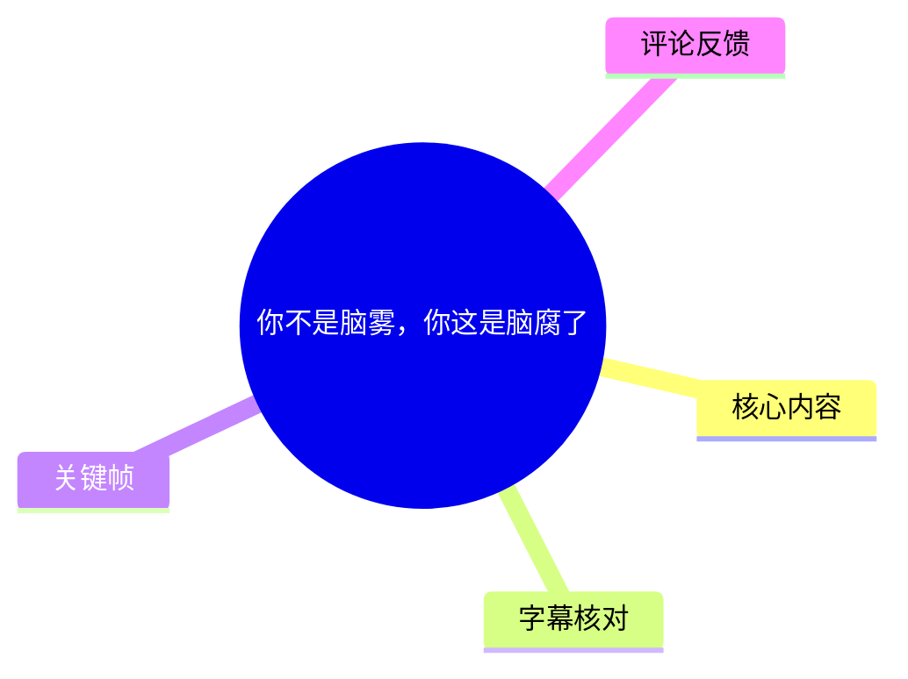
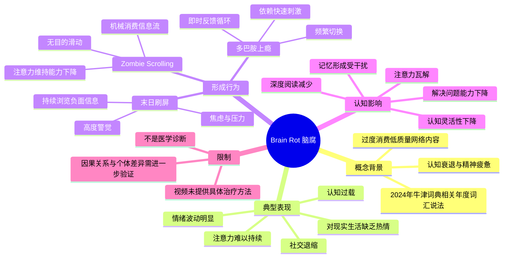
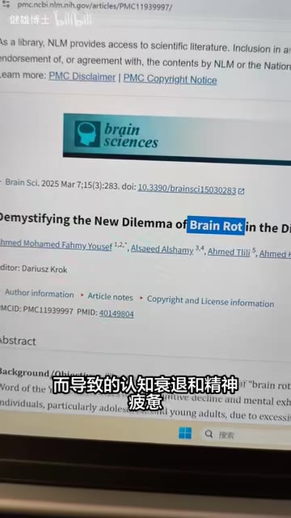
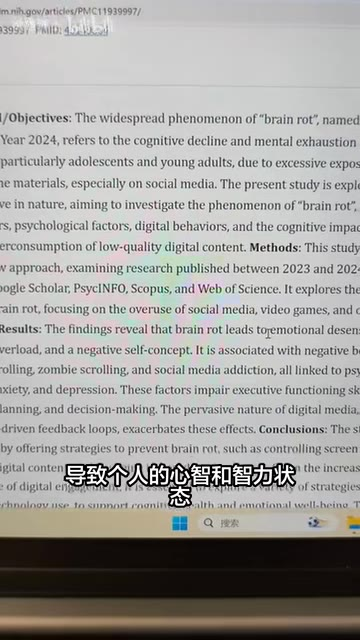
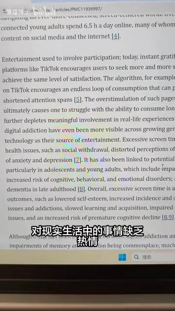
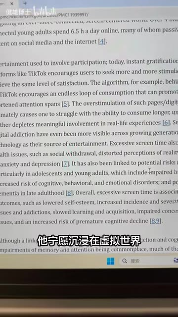

# 你不是脑雾，你这是脑腐了

> 来源：[Bilibili 视频](https://www.bilibili.com/video/BV1DMTY6hE6x) 
> UP 主：健雄博士 | 发布时间：2026-07-01 | 视频时长：136 秒 | 收藏时间：2026-07-28

## 小结

视频讨论的核心概念是 **Brain Rot**，中文可译作“脑腐”或“脑腐化”。视频将其描述为：由于过度消费低质量、碎片化的网络内容，尤其是社交媒体和短视频，导致个人出现认知衰退与精神疲惫的一种状态。

视频列出四类典型表现：注意力难以维持、对现实生活缺乏热情且情绪波动明显、感觉被海量信息压垮，以及更愿意沉浸于虚拟世界而减少现实社交。

视频进一步把形成机制归纳为三类数字行为：末日刷屏（Doom Scrolling）、无目的的机械刷信息流（视频中称为 Zombie Scrolling；本次 ASR 多次识别为“Zombie Schooling”），以及对即时刺激和反馈的依赖，即视频所称的“多巴胺上瘾”。

在认知影响方面，视频重点讲述三种可能的损害：持续通知和快速切换干扰记忆形成；短视频和碎片信息使注意力更加容易被打断；依赖数字工具快速获得答案，可能减少主动思考，从而影响解决问题和应对新挑战的能力。

需要注意的是，视频提供的是科普性解释，不是医学诊断。素材没有给出完整的临床诊断标准、干预方案、实验数据或个人恢复步骤，因此不能仅凭这些表现判断某人患有某种精神或神经系统疾病。

## 思维导图

## 目录

- [概念背景与视频讨论的问题](#概念背景与视频讨论的问题)
- [四类典型表现](#四类典型表现)
- [三种数字行为与形成机制](#三种数字行为与形成机制)
- [三类认知功能影响](#三类认知功能影响)
- [方法与实践边界](#方法与实践边界)
- [结论、限制与时效性](#结论限制与时效性)
- [字幕比对](#字幕比对)
- [关键帧说明](#关键帧说明)
- [评论分析](#评论分析)
- [处理记录](#处理记录)

## 概念背景与视频讨论的问题 [00:30](https://www.bilibili.com/video/BV1DMTY6hE6x?t=30)

视频从“Brain Rot”这一英文词汇切入，称其与 2024 年牛津词典年度词汇有关。由于本次 ASR 将该词识别成了“Brain World”“脑腑”“脑虎”等形式，而关键帧中的论文页面清楚出现了 **Brain Rot**，因此正文采用“Brain Rot”，中文暂译为“脑腐”。

视频对这一概念的定义是：人长期沉浸在社交媒体、短视频等碎片化、低价值数字内容中，可能出现心智和智力状态退化的感觉。这里的“脑腐”是一个网络文化和科普语境中的描述性概念，素材没有把它作为正式医学疾病或临床诊断名称处理。

关键帧还展示了英文论文页面，画面可读到标题包含 **“Demystifying the New Dilemma of Brain Rot …”**，页面标注为 *Brain Sciences*，并显示 2025 年 3 月 7 日、15(3):283 以及 DOI `10.3390/brainsci15030283` 等信息。这些画面说明视频试图借助论文背景解释这一网络现象，但素材中没有提供完整论文内容或对其研究方法、样本和结论的逐项讲解。

> 图：关键帧展示了与 Brain Rot 相关的英文论文页面，有助于核对专有名词及视频讨论的研究背景；正文中的论文信息仅依据画面可见内容记录。

## 四类典型表现 [00:30](https://www.bilibili.com/video/BV1DMTY6hE6x?t=30)

视频在约 00:30 开始集中列举四类表现。由于 ASR 的第一个分段时间只有 0.44 秒，却承载了大量文字，具体句子边界并不可靠；本节时间点采用该 SRT 分段的真实起始时间，而不是根据句子顺序重新推测。

### 1. 注意力难以维持

视频称，相关状态可能表现为难以长时间专注于阅读、工作和深度思考。这里强调的是持续性注意和深度投入困难，而不是短时间分心一次就可以得出结论。

### 2. 情绪钝化与波动

视频称，个体可能对现实生活中的事情缺乏热情，同时出现较明显的情绪波动。原始 ASR 中“情绪顿化”等词应结合上下文理解为“情绪钝化”或情感反应变弱，但视频同时又提到情绪波动较大，二者在素材中并列出现，不能简单合并为单一的临床症状。

### 3. 认知过载

视频把“每天被海量信息塞满、无法有效处理”归为认知过载。该表述强调信息输入量和处理能力之间的不匹配：信息不断进入，但个人难以筛选、整合或形成稳定判断。

### 4. 社交退缩

视频称，个体可能更愿意沉浸在虚拟世界中，而不愿参加现实社交。这里是视频对行为倾向的概括，并没有给出具体社交时长、频率或诊断阈值。

## 三种数字行为与形成机制 [00:55](https://www.bilibili.com/video/BV1DMTY6hE6x?t=55)

### 末日刷屏（Doom Scrolling） [00:55](https://www.bilibili.com/video/BV1DMTY6hE6x?t=55)

视频把 Doom Scrolling 解释为一种强迫性、无休止地浏览社交媒体或新闻网站中负面、令人分心的信息的行为。

视频给出的机制链条是：

1. 持续浏览负面信息；
2. 获得一种“自己正在与世界同步”的错觉；
3. 过量接触负面内容使人处于高度警觉状态；
4. 焦虑和压力增加；
5. 最终出现认知疲劳。

这里的“与世界同步”是视频对主观体验的描述，并不是素材提供的客观测量指标。视频也没有给出每天浏览多久会构成 Doom Scrolling 的具体参数。

> 图：该关键帧可用于观察视频展示的论文正文，帮助理解其所引用的背景材料；画面内容不等同于视频已经完整验证的因果结论。

### Zombie Scrolling：无目的的机械刷信息流 [01:19](https://www.bilibili.com/video/BV1DMTY6hE6x?t=79)

ASR 将这一术语识别成了“Zombie Schooling”，但从语义和上下文看，视频讨论的是 **Zombie Scrolling**，即“僵尸式刷屏”或“僵尸刷信息流”。

视频将其定义为：

- 漫无目的地滑动；
- 不清楚自己究竟在看什么具体内容；
- 机械、被动地消费信息流；
- 持续进行，却缺少明确目标。

视频认为，这种行为会削弱大脑维持注意力的能力，并使人逐渐与现实世界产生疏离感。需要区分的是，视频是在描述一种使用行为和可能影响，没有给出可操作的测量量表，也没有说明所有无目的滑动都会产生同样后果。

### 对即时刺激和反馈的依赖 [01:19](https://www.bilibili.com/video/BV1DMTY6hE6x?t=79)

视频随后提到“多巴胺上瘾”，并将其作为数字内容持续刺激的一部分。素材没有提供具体神经递质实验、剂量、时间阈值或医学诊断标准，因此这里应理解为视频对“不断寻求即时刺激和反馈”的通俗化表达，不应直接等同于临床意义上的成瘾诊断。

结合视频前后文，这一机制包括：

- 通知不断出现；
- 内容快速切换；
- 反馈即时到达；
- 用户逐渐习惯快速、低延迟的刺激；
- 对需要等待、阅读和深入思考的活动耐受度下降。

## 三类认知功能影响 [01:19](https://www.bilibili.com/video/BV1DMTY6hE6x?t=79)

### 1. 记忆形成受到干扰 [01:19](https://www.bilibili.com/video/BV1DMTY6hE6x?t=79)

视频称，持续通知和快速切换会干扰大脑把短期记忆转化为长期记忆的过程，并将结果概括为“记忆扭曲”。

视频表达的逻辑是：

> 通知与任务切换增加 → 注意和编码过程被打断 → 信息更难稳定保留 → 记忆质量下降或出现偏差。

素材没有给出具体实验设计，也没有说明这种影响在不同年龄、睡眠状态、任务类型或使用时长下的差异，因此不能据此推导出固定的记忆损害程度。

### 2. 注意力瓦解与浮躁的注意模式 [01:43](https://www.bilibili.com/video/BV1DMTY6hE6x?t=103)

视频认为，短视频和碎片化信息创造了“快速摄入”的环境。长期习惯快速切换后，个体可能不再愿意进行深入阅读，也较难进行持续、完整的专注。

视频将其进一步概括为：

- 阅读耐心下降；
- 深度专注减少；
- 注意力更容易被外界信息打断；
- 大脑逐渐适应快速、碎片化的注意模式；
- 整体体验变得更加浮躁。

这里的“注意力瓦解”和“浮躁注意力”是视频的概括性说法，不是素材中给出的标准化神经心理学指标。

> 图：关键帧展示了视频引用页面中讨论即时刺激、数字媒体使用与现实生活参与的段落，有助于理解“碎片化消费—现实参与减少”的论述背景。

### 3. 解决问题能力和认知灵活性下降 [01:43](https://www.bilibili.com/video/BV1DMTY6hE6x?t=103)

视频称，当人习惯从数字工具中迅速获取现成答案时，可能减少主动思考和自行拆解问题的机会。

它给出的影响链条是：

1. 遇到问题时优先搜索或调用即时答案；
2. 减少独立分析、推理和尝试；
3. 更倾向于选择快速解决方案；
4. 深入分析能力和认知灵活性下降；
5. 面对新挑战时的适应能力受到影响。

视频最后强调，人们可能会选择“快速解答”而不是“深入分析”。但素材没有给出具体工具使用条件、问题类型或对照实验，因而只能将其记录为视频提出的风险机制，而不能视作对每位数字工具使用者都成立的确定结论。

> 图：该关键帧用于补充视频画面中关于认知、行为和情绪影响的论文背景。它适合与“注意力、现实参与和问题解决”部分对照阅读，但不能替代原论文的完整方法和数据。

## 方法与实践边界 [02:07](https://www.bilibili.com/video/BV1DMTY6hE6x?t=127)

视频主要进行概念解释和风险提示，没有提供一套完整的恢复或干预步骤，也没有给出以下可执行参数：

- 每日屏幕使用时长上限；
- 社交媒体使用频率；
- 戒断或减少使用的周期；
- 睡眠、运动和现实社交的具体目标；
- 如何评估注意力是否恢复；
- 何时应寻求专业帮助。

因此，不能把视频内容整理成“照做即可逆转脑腐”的操作方案。若要将视频观点转化为一般性的自我观察，可以记录以下现象，但这些记录不构成诊断：

1. 是否在没有明确目的时反复打开信息流；
2. 是否频繁被通知和短内容打断；
3. 是否难以完成一段连续阅读或工作；
4. 是否因持续浏览负面信息而感到焦虑或疲惫；
5. 是否明显减少现实生活中的活动和社交；
6. 是否在遇到问题时立即寻找现成答案，而不再尝试分析。

如果注意力、情绪、睡眠、学习工作或社交功能持续受到影响，素材本身没有提供医疗建议；是否需要咨询专业人员，不能仅依据本视频或评论判断。

## 结论、限制与时效性 [02:07](https://www.bilibili.com/video/BV1DMTY6hE6x?t=127)

### 可迁移的经验

视频最具可迁移性的经验，是把“内容消费”拆成不同类型，而不是只用“看手机时间长短”衡量影响：

- 有明确目的的使用，与无意识滑动不同；
- 普通信息浏览，与反复接触负面新闻不同；
- 单一任务的连续投入，与通知驱动的频繁切换不同；
- 主动学习和解决问题，与被动接受即时答案不同。

这种区分有助于观察数字行为究竟如何影响注意、情绪和现实生活参与。

### 主要限制

1. **不是医学诊断**：Brain Rot 是视频和网络文化语境中的概念，不能替代抑郁、焦虑、注意缺陷或其他疾病的专业评估。
2. **因果关系未在视频中完整证明**：视频提出数字行为可能导致认知和情绪问题，但没有在口述中展示完整样本、对照组、效应量或长期追踪数据。
3. **个体差异很大**：年龄、睡眠、压力、既有心理状态、工作性质和使用内容都会影响体验。
4. **没有恢复方案**：视频没有给出经过验证的“可逆性”结论，也没有提供具体干预步骤和时间表。
5. **论文信息需回看原文**：关键帧展示了论文页面和摘要、正文片段，但本次素材没有完整提供论文全文，不能仅凭画面概括论文全部研究结论。

### 时效性

视频发布时间元数据显示为 **2026-07-01**，本次素材抓取时间为 **2026-08-04**。视频提到的 2024 年词汇背景和画面中标注的 2025 年论文属于既有信息；相关网络行为、平台推荐机制和研究结论可能继续变化。本文只整理视频及所给素材，不对抓取时间之后的新研究或平台规则作补充判断。

## 字幕比对

| 字幕来源 | 完整性 | 专有名词 | 时间轴 | 主要问题 |
| --- | --- | --- | --- | --- |
| Bilibili 站内字幕 | 未提供 | 无法核对 | 无 | 素材清单明确写明未提供可用站内字幕 |
| 本次 ASR 字幕 | 有时间戳，覆盖 105.24 秒；总音频约 135.79 秒，语音覆盖率约 77.5% | 部分错误 | 可用，分段从 00:30.400 至 02:15.640 | 术语、同音词和句内分段存在明显识别错误 |

最终采用本次 ASR 的真实时间戳作为时间轴依据，并结合上下文和关键帧对明显术语进行有限校正：

- `Brain World` → **Brain Rot**：关键帧论文页面出现 “Brain Rot”；
- “Zombie Schooling” → **Zombie Scrolling**：结合“无意识滑动信息流”的定义校正；
- “脑腑”“脑虎”“脑辅”等 → **脑腐/Brain Rot**：根据英文术语和上下文校正；
- “主体涣散”按语义整理为注意力难以持续；
- “情绪顿化”保留为视频所述的情绪钝化/现实热情降低相关表现；
- “认知功能受捕”等 ASR 错词按上下文整理为认知功能受损；
- “短期记忱转化为长期记役”等按语义整理为短期记忆向长期记忆转化过程受到干扰。

ASR 诊断信息显示：

- 识别语言：中文；
- 语言概率：0.99755859375；
- ASR 模型：`large-v3-turbo`；
- 音频时长：135.7903125 秒；
- 语音覆盖率：77.5%；
- 首段语音：00:30.400；
- 最后语音：02:15.640；
- 未标记 `noAudioStream=true`，因此本次按存在音轨处理；
- 站内字幕缺失，无法进行逐字的站内字幕—ASR 对照，只能以 ASR 时间戳和关键帧进行校正。

## 关键帧说明

本次正文选用的关键帧均来自提供的相对路径。关键帧的主要价值是核对视频实际展示的论文标题、期刊页面和英文术语，弥补站内字幕缺失以及 ASR 专有名词识别错误的问题。

- `frames/frame-001.jpg`：展示 Brain Rot 相关论文页面，适合核对核心术语和论文背景。
- `frames/frame-002.jpg`：展示论文正文中关于数字媒体、注意力和心理影响的内容，适合辅助理解末日刷屏与认知疲劳的关联。
- `frames/frame-003.jpg`：展示与即时刺激、现实生活参与和数字媒体影响相关的正文段落，适合对应现实兴趣下降和社交退缩的讨论。
- `frames/frame-004.jpg`：展示关于认知、行为和情绪影响的论文段落，适合对应视频后半段的认知功能影响部分。

关键帧只作为画面证据和术语校正依据，不替代论文全文，也不意味着画面中的全部英文内容都已被完整翻译或验证。

## 评论分析

以下仅分析可获取的热评前三条，不将评论观点视为已经验证的事实。

### 1. “小脑腐[笑哭]”——EQUU弦断邂逅的古街，622 赞

这条评论用“脑腐”的谐音或变体进行玩笑式回应，主要作用是调侃标题和概念，没有提供额外事实、方法或证据。其可信度不适用于事实判断。

### 2. “up这是可逆的嘛 具体有什么方法能让其可逆”——yw搬运工，150 赞

这条评论提出了视频没有回答的关键问题：相关状态是否可逆，以及具体应如何改善。它反映出观众希望获得可操作干预方案，但评论本身没有给出答案，也不能证明“可逆”或“不可逆”。

结合视频内容，只能确认视频讲述了可能的形成机制和认知影响，没有提供恢复周期、操作步骤或临床依据。若现实中的注意力、情绪或社交功能持续受影响，应通过专业评估判断原因。

### 3. “少玩手机多运动，专注现实情况就会好起来，还有少熬夜”——少女梦娅的太阳果酒，74 赞

这条评论提出减少手机使用、增加运动、关注现实生活和避免熬夜等建议。这些建议与视频对过度数字消费、现实参与减少和认知疲劳的讨论方向一致，但评论没有提供具体执行参数，也没有在本素材中得到验证。因此，它可以作为一般性的生活方式建议看待，不能当作针对 Brain Rot 的确定治疗方案。

## 处理记录

- Worker ID：`worker-mrj0wbly-5dc4e50c`
- 调用工具与模型：本次 ASR 使用 `large-v3-turbo`；知识整理模型为 `gpt-5.6-terra`
- 使用的应用工具：视频元数据、ASR 音频识别、ASR SRT/JSON 时间戳、关键帧画面、热评前三条
- 字幕选择：未提供可用 Bilibili 站内字幕；检查并采用本次 ASR 字幕的真实时间戳，同时根据关键帧和上下文校正明显专有名词
- 关键帧选择依据：选择展示 Brain Rot 论文标题、论文正文以及认知和情绪影响段落的关键帧，用于术语核对和画面证据补充
- 时间轴依据：优先采用 ASR SRT 中的真实分段起止时间；主要节点为 00:30.400、00:55.180、01:19.180、01:43.340、02:07.480
- ASR 质量记录：中文识别概率 0.99755859375，语音覆盖率约 77.5%；存在明显同音词、英文术语和句内切分错误
- 评论范围：仅处理接口返回的热评前三条
- 清理缓存：素材清单未提供额外缓存清理结果；不能据此声称已完成缓存删除
- 未解决问题：缺少站内字幕；ASR 首个分段时间异常且文本过长；视频未给出具体恢复方法、参数或临床证据；关键帧只展示论文页面片段，无法替代对论文全文的核验
