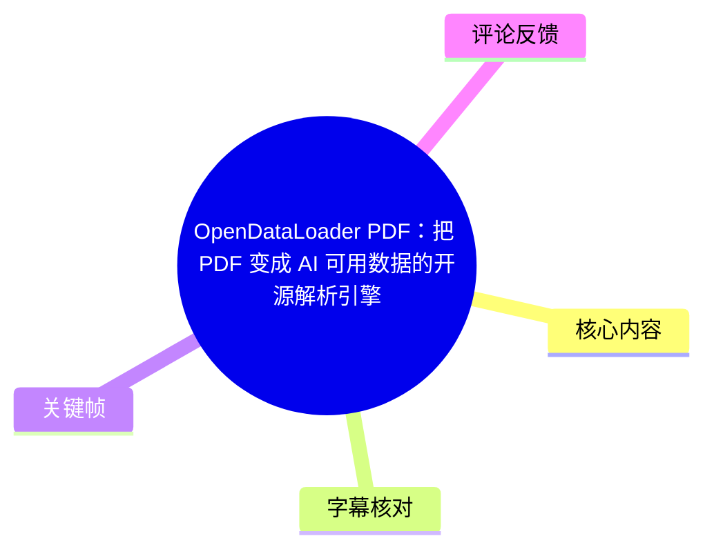
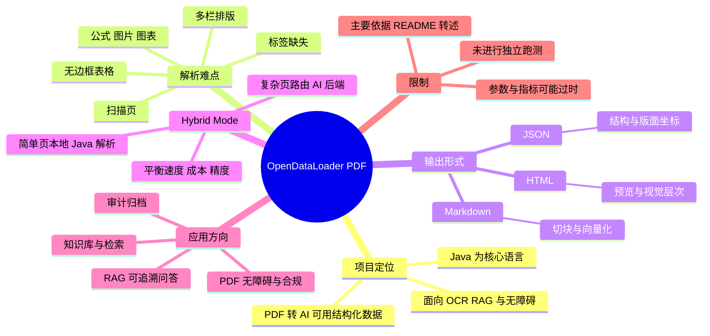
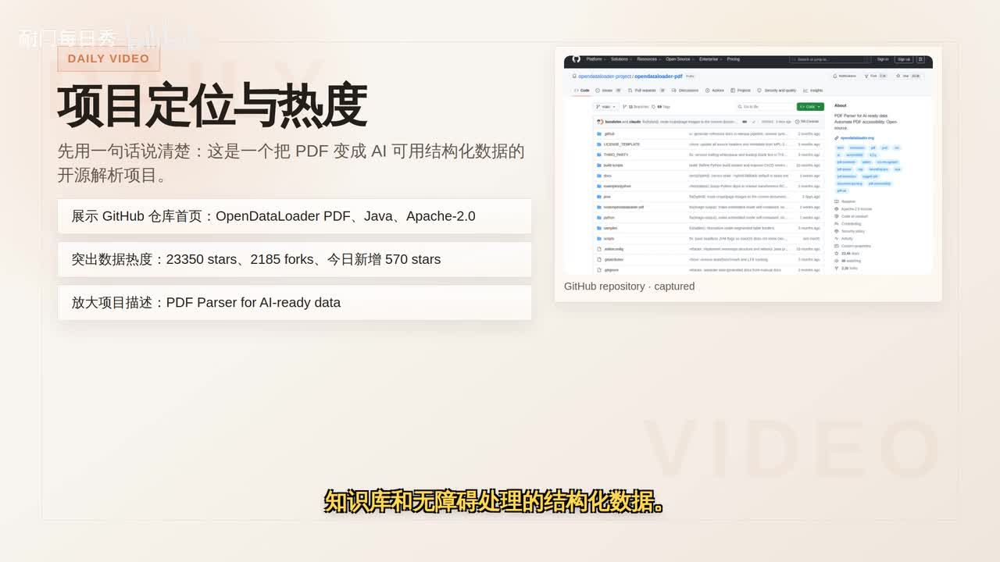

# OpenDataLoader PDF：把 PDF 变成 AI 可用数据的开源解析引擎

> 来源：[Bilibili 视频](https://www.bilibili.com/video/BV1WU7o6mEE3)  
> UP 主：耐门每日秀｜视频时长：06:42｜合集：AIcode  
> 视频定位：介绍开源项目 **OpenDataLoader PDF**，重点讨论其面向 AI 数据准备的 PDF 结构化解析、混合处理模式、OCR、RAG 输出及无障碍合规方向。

## 小结

视频介绍的 OpenDataLoader PDF 是一个以 Java 为核心的开源 PDF 解析项目。UP 主将其概括为：把传统 PDF 转成可供 AI 搜索、知识库、RAG 和无障碍流程使用的结构化数据，而不是只抽取一段纯文本。

其核心价值在于识别和保留页面结构。视频称该项目可输出 Markdown、JSON 与 HTML；其中 JSON 可携带 `Bounding Boxes`（版面坐标），因此下游系统不仅能获得文本，还可定位文本、表格或引用证据位于哪一页、页面的哪个区域。

视频重点介绍了 **Hybrid Mode（混合模式）**：简单页面优先走本地 Java 解析，复杂页面——如表格、扫描件、公式、图表——再路由到 AI 后端。该设计意在平衡处理速度、成本与复杂页面的理解精度。视频转述 README 称，简单页速度约为 **0.02 秒/页**。

面向应用，Markdown 适合切块与向量化，JSON 适合证据引用、原页回显和前端高亮，HTML 适合网页预览或审阅系统保留视觉层次。视频也将项目放入 OCR、企业检索、论文解析、合同审阅、文档归档以及 PDF 无障碍处理等场景中理解。

需要严格区分：视频内的 Star 数、基准分数、榜单排名、OCR 语言覆盖、扫描件处理能力以及企业合规工作流，主要是对 GitHub 仓库和 README 的转述，并非本视频进行了独立压测或生产验证。此类项目数据与接口会随仓库版本变化，应以实际版本文档、许可证和测试结果复核。

## 思维导图

## 目录

- [项目定位、热度与适用对象](#项目定位热度与适用对象-0033)
- [为什么 PDF 结构化解析困难](#为什么-pdf-结构化解析困难-0123)
- [三类输出：文本、结构与坐标](#三类输出文本结构与坐标-0034)
- [Hybrid Mode：本地解析与 AI 后端协作](#hybrid-mode本地解析与-ai-后端协作-0147)
- [基准、OCR 与扫描文档能力](#基准ocr-与扫描文档能力-0235)
- [RAG、审阅与前端应用接口](#rag审阅与前端应用接口-0324)
- [上手条件与视频所述流程](#上手条件与视频所述流程-0412)
- [无障碍与合规方向](#无障碍与合规方向-0500)
- [结论、限制与时效性](#结论限制与时效性-0542)
- [字幕比对](#字幕比对)
- [评论分析](#评论分析)
- [处理记录](#处理记录)

## [项目定位、热度与适用对象](https://www.bilibili.com/video/BV1WU7o6mEE3?t=33) [00:33]

视频开场将 OpenDataLoader PDF 定义为一个“把 PDF 变成 AI 可用结构化数据”的开源解析引擎。这里的“AI 可用”并非单纯指把 PDF 中的字符导出，而是让下游系统能够进一步利用文档的结构、页面位置和视觉层次。

UP 主提到项目以 **Java** 为核心语言，受众横跨文档处理、OCR、RAG 与企业合规。画面中展示的是 GitHub 仓库信息，并给出当时截图中的数据：

- 项目：`OpenDataLoader PDF`
- 核心语言：Java
- 许可证：Apache-2.0
- 截图数据：**23,350 Stars**、**2,185 Forks**、当日新增 **570 Stars**
- 仓库描述：`PDF Parser for AI-ready data`

视频口播采用“超过 23,000 Stars、单日增长数百 Star”的概括。上述数字是视频截图时的仓库快照，不能视作当前实时数据。

> 图：关键帧展示项目定位、GitHub 仓库页面及视频截取的 Star/Fork 数据。它为“AI-ready data”、Java 与 Apache-2.0 等基础信息提供了画面佐证，也提示热度数据具有截图时效性。

适合优先关注该项目的人群包括：

1. 需要将企业 PDF、论文、合同、报告导入知识库的开发者；
2. 需要建立带来源页码、位置证据的 RAG 问答系统的团队；
3. 需要处理扫描归档、票据、报表等非数字原生文档的场景；
4. 关注 PDF/UA、Tagged PDF、欧洲无障碍法案（EAA）等无障碍与合规工作的组织。

## [为什么 PDF 结构化解析困难](https://www.bilibili.com/video/BV1WU7o6mEE3?t=83) [01:23]

视频指出，PDF 的根本难点不在于“大模型能否读文字”，而在于 PDF 不是天然为机器语义理解设计的格式。普通文本提取容易得到字符，却不一定能还原阅读顺序、段落关系、表格单元格边界和证据所在位置。

视频列举的典型复杂元素包括：

- 多栏排版；
- 扫描页；
- 无边框表格；
- 公式；
- 图片与图表；
- 固定版式内容；
- 缺失标签的 PDF。

这些问题会直接影响知识库与 RAG 的质量。例如，若多栏论文被按横向坐标错误拼接，文本顺序便会混乱；若表格仅提取为线性文本，行列对应关系可能丢失；若无法保存页码及坐标，回答系统即使给出了正确答案，也难以将证据准确回显给用户。

> 图：关键帧列出了多栏论文、表格、扫描页、图表和公式等复杂 PDF 情形，并强调“表格错位、段落顺序混乱、扫描件无文本层”等问题。这有助于理解为何普通文本提取不足以支撑可靠的文档 AI 流程。

视频给出的解决思路是：在把文档交给模型前，尽可能还原复杂的版面与语义结构。换言之，PDF 解析层是模型之前的数据准备层，而不是一个可有可无的文件转换步骤。

## [三类输出：文本、结构与坐标](https://www.bilibili.com/video/BV1WU7o6mEE3?t=34) [00:34]

视频称 OpenDataLoader PDF 的主要输出包括 Markdown、JSON 和 HTML。三者面向不同的下游需求：

| 输出格式 | 视频所述保留能力 | 更适合的下游任务 |
| --- | --- | --- |
| Markdown | 面向文本内容与文档层次 | 切块、Embedding、知识库导入 |
| JSON | 结构信息与 Bounding Boxes（版面坐标） | 证据引用、页码回显、前端区域高亮、溯源 |
| HTML | 文档视觉结构与展示层次 | 网页预览、审阅系统、保留布局的呈现 |

`Bounding Boxes` 是视频强调的关键概念，意为文本、表格或其他元素在页面中的坐标范围。它使系统能够回答“内容是什么”的同时，进一步回答“这段内容来自哪里”。

对于 RAG，这种差异尤其重要：

- **仅有文本**：适合最基础的检索和生成，但来源呈现能力有限。
- **文本 + 结构**：有助于避免标题、正文、表格混杂，提升切块质量。
- **文本 + 结构 + 坐标**：可用于点击跳转原页、标亮原文证据、审阅回答依据，并增强文档溯源体验。

> 图：关键帧直接列出 Markdown、JSON 和 HTML 三类输出，以及它们分别对应的切块/Embedding、结构与 bounding boxes、网页预览与视觉层次等用途，是理解下游接口分工的核心画面证据。

## [Hybrid Mode：本地解析与 AI 后端协作](https://www.bilibili.com/video/BV1WU7o6mEE3?t=107) [01:47]

视频将 **Hybrid Mode** 作为项目的一项主要亮点。其描述为“本地 Java 解析 + AI 后端”的组合：

1. **简单页面**：直接使用本地解析路径，以速度和成本效率为优先；
2. **复杂页面**：检测到表格、扫描件、公式、图表等情况时，自动路由到 AI 后端；
3. **整体目标**：避免将所有页面一律交给 AI，从而在速度、成本与精度间进行动态平衡。

视频转述 README 称，简单页面的本地处理速度可快至约 **0.02 秒/页**。这一数值属于项目资料中的性能表述，实际耗时仍可能受硬件、PDF 类型、页数、是否启用 OCR、AI 后端配置及网络环境影响。

视频认为，这种分流架构比“单一路径”更贴近真实业务：简单的数字原生 PDF 没必要承担昂贵的 AI 处理成本；而困难页面如果只依赖传统解析，又容易在表格、扫描图像或复杂布局上失效。

**可迁移的工程经验**：文档处理管线应按页面复杂度分级，而非按“整个文件”一刀切。实践中可以记录每页所走的处理路径、置信度、耗时和失败原因，以便控制成本并支持人工复核。

## [基准、OCR 与扫描文档能力](https://www.bilibili.com/video/BV1WU7o6mEE3?t=155) [02:35]

视频对 README 中的复杂 PDF 基准表现进行了转述：

- 整体基准成绩：**0.907**
- 表格准确率：**0.928**
- 项目宣称：在相关 Benchmark 中排名第一

UP 主同时明确提醒：这些信息是基于 GitHub 仓库和 README 的解读，**不是本视频的实际跑测结论**。因此，不宜直接将其等同于特定企业数据集、中文扫描件、合同表格或实际生产环境中的效果承诺。

随后视频转向 OCR 与扫描文档能力。其所述能力包括：

- Hybrid Mode 下支持内置 OCR；
- 覆盖 **80 多种语言**；
- README 提到可处理 **300 DPI 以上**、质量较差的扫描件；
- 目标覆盖纸质归档、历史文档、票据、报表等现实世界数据源。

这里需注意两个边界：

1. “支持处理”不等于任何质量的扫描件都能得到可用结果。模糊、倾斜、低对比度、手写、盖章遮挡、极端表格样式仍可能显著影响解析。
2. 视频没有提供具体测试 PDF、测试集构成、指标定义、推理成本或可复现实验步骤，因此不能据此判断不同方案之间的绝对优劣。

## [RAG、审阅与前端应用接口](https://www.bilibili.com/video/BV1WU7o6mEE3?t=204) [03:24]

从应用链路看，视频不是把 OpenDataLoader PDF 描述成一个孤立的“格式转换器”，而是作为文档 AI 基础设施的一层：它向后续检索、向量化、引用展示、审阅和合规流程提供不同粒度的数据接口。

可以按视频信息整理为以下链路：

1. **输入 PDF**：可能是数字原生文档、扫描归档、论文、合同、票据或报表；
2. **页面与结构解析**：识别文本、布局、表格、公式、图片、图表等复杂元素；
3. **按复杂度处理**：简单页走本地 Java 路径，复杂页使用 Hybrid Mode 的 AI 后端；
4. **导出结果**：
   - Markdown：供文本切块、Embedding 与知识库导入；
   - JSON：供保存结构、坐标、页级来源与高亮信息；
   - HTML：供预览、审阅和视觉层次呈现；
5. **下游系统消费**：RAG 问答、企业检索、合同审阅、证据引用、归档及无障碍处理。

视频特别提到 JSON 对“证据引用、页面回显和前端高亮”的意义。对于高风险问答、合规审阅或科研资料查询，答案可追溯性通常比单纯生成流畅答案更重要。工程实现时，应将解析得到的页码、元素标识和坐标与向量索引中的 chunk 元数据一起持久化，避免召回文本后丢失来源映射。

## [上手条件与视频所述流程](https://www.bilibili.com/video/BV1WU7o6mEE3?t=252) [04:12]

视频根据 README 概述了快速开始的前置条件：

- Java：**Java 11+**
- Python：**Python 3.10+**
- 基础安装入口：通过 `pip` 安装 OpenDataLoader PDF
- Hybrid Mode：安装带 Hybrid 扩展的版本，启动本地后端服务，再用另一个终端执行 PDF 处理任务

视频 ASR 将示例服务端口识别为“**502 端口**”，但未提供清晰可核验的命令行文本，且站内字幕缺失，不能据此保证端口号或包名准确无误。实际部署时应以目标仓库当前 README、发布包说明和配置文件为准。

基于视频可确认的流程，建议按以下顺序实践：

1. **确认运行环境**：准备 Java 11+ 与 Python 3.10+；
2. **明确文档类型**：先区分数字原生 PDF 与扫描型 PDF，并抽样检查是否存在表格、公式和多栏布局；
3. **选择处理模式**：普通页面可尝试基础本地解析；复杂页、扫描页或需较高表格保真度时考虑 Hybrid Mode；
4. **启动所需后端**：Hybrid Mode 需要额外本地后端服务，具体地址、端口与模型配置以官方版本文档为准；
5. **按下游目标选择输出**：
   - 知识库切块优先考虑 Markdown；
   - 需要坐标和引用时保留 JSON；
   - 需要浏览/审阅时输出 HTML；
6. **抽样验收**：至少检查阅读顺序、标题层级、表格行列、页码来源、OCR 文本和坐标高亮是否一致；
7. **再接入 RAG**：确认结构质量后再进行切块、向量化和检索评估，避免把解析错误放大到回答阶段。

视频强调，尽管仓库核心语言为 Java，但项目通过命令行和 Python 生态入口降低了 AI 开发者的调用门槛。是否足以满足特定语言、操作系统、离线部署或企业网络条件，视频未展开，需要自行验证。

## [无障碍与合规方向](https://www.bilibili.com/video/BV1WU7o6mEE3?t=300) [05:00]

除 AI 数据提取外，视频还强调项目面向企业与政企场景的 PDF 无障碍和合规自动化方向。视频提及的关键词包括：

- Accessibility；
- PDF/UA；
- Tagged PDF；
- EAA（欧洲无障碍法案）。

这里的逻辑是：一个可访问 PDF 不只是“内容能被提取”，还应具备可供辅助技术理解的结构，例如合理的文档标签、阅读顺序和元素语义。视频提到 README 涉及从审计、自动打标到后续流程的能力构想。

对需要满足 EAA 或 PDF/UA 标准的组织而言，视频认为这类能力的价值可能高于单纯 OCR：OCR 解决“看见文字”，无障碍结构与合规流程则进一步处理“辅助技术能否正确理解和访问文档”。

但应避免过度推断：视频并没有展示具体的合规审计报告、自动修复前后对比、标准覆盖范围或第三方认证结果。因此，涉及法规符合性的项目仍应按照适用法域、组织内部标准及专业审计要求单独验证。

## [结论、限制与时效性](https://www.bilibili.com/video/BV1WU7o6mEE3?t=342) [05:42]

视频最终将 OpenDataLoader PDF 总结为一个统一处理多类问题的框架：

1. 普通 PDF 的结构化解析；
2. 扫描件与 OCR；
3. 复杂表格、公式、图表等高难页面；
4. 面向 RAG 的结构化输出；
5. 无障碍与合规自动化处理。

从视频内容看，它更接近“AI 文档基础设施”的一层，而非仅导出纯文本的小工具。其差异化方向在于：既关注文本，也尝试保留结构、坐标、视觉呈现和可访问性所需的信息。

### 采用时应重点验证

- 你的实际 PDF 中，多栏、表格、公式、扫描件分别占多少比例；
- Markdown 的阅读顺序是否正确；
- JSON 坐标与原页元素是否对齐；
- 表格结构是否能满足后续业务；
- OCR 在目标语言、字体、分辨率与噪声条件下的可用性；
- Hybrid Mode 的本地资源、后端服务、隐私边界、耗时与成本；
- 无障碍输出是否真正满足组织所需标准，而不是仅具备相关标签或功能描述。

### 时效性说明

本视频发布元数据对应 2026 年 6 月，素材抓取于 2026 年 7 月。GitHub Star/Fork、当日增长、README 性能指标、包安装方式、模型后端和端口配置都可能已经变化。视频未进行全面线上产品实测，因而其中的 Benchmark 排名、复杂场景精度及企业工作流能力，均应理解为项目公开资料中的主张，而非独立验证结论。

## 字幕比对

| 字幕来源 | 完整性 | 专有名词 | 时间轴 | 主要问题 |
| --- | --- | --- | --- | --- |
| Bilibili 站内字幕 | 未提供可用字幕 | 无法评估 | 无法评估 | 本次素材中没有可使用的站内字幕文件 |
| 本次 ASR 字幕 | 较完整；覆盖 33.1 秒至 400.7 秒，语音覆盖约 91.2% | 部分存在误识别或截断 | 有逐段真实时间戳，可用于章节链接 | 中英混排词、技术词与个别数字识别不稳定，如“RAC”“扫瞄键”“AAI”“502”等 |

本次素材的 ASR 诊断显示：音频时长约 401.05 秒、识别语言为中文、置信度约 0.9985，存在时间戳；**未标记 `noAudioStream=true`**，因此可确认源视频具备音轨，本次 ASR 不是因无音轨而生成的替代文本。

最终正文以 **本次 ASR 的时间戳** 作为章节时间轴依据，并结合关键帧中的可见文字进行术语校正或保守表述：

- `Open Data Loader PDF` 统一写作 **OpenDataLoader PDF**，与标题和画面中的项目名一致；
- `RAC` 按上下文校正为 **RAG**；
- `扫瞄键`、`扫描键` 按语义统一为 **扫描件**；
- `AAI 数据提取` 按上下文理解为 **AI 数据提取**；
- 画面明确展示 `Markdown`、`JSON`、`HTML` 与 `bounding boxes`；
- 对 ASR 识别出的“502 端口”不作确定性配置结论，保留为“ASR 所述、待官方文档验证”。

## 评论分析

仅处理本次可获取的热评前三条；三条评论均无点赞数，且未提供项目使用经验、技术纠错或外部来源，不能作为事实验证依据。

1. **bili_50349872485**：「爱看，UP加油！」  
   - 观点：对视频内容表达支持。  
   - 补充信息：无。  
   - 可信度与争议：属于情感反馈，不涉及项目能力或技术事实。

2. **bili_50349872485**：「好用心的视频！」  
   - 观点：认为视频制作较用心。  
   - 补充信息：无。  
   - 可信度与争议：评价对象是视频呈现，不构成对 OpenDataLoader PDF 性能、功能或可用性的验证。

3. **往幸福出发吧**：「优秀啊」  
   - 观点：总体肯定。  
   - 补充信息：无。  
   - 可信度与争议：未说明具体认可的是项目、讲解还是实际使用体验，信息量有限。

## 处理记录

- Worker ID：worker-mrj0wbly-5dc4e50c
- 模型：gpt-5.6-terra
- 使用素材与工具结果：视频元数据、关键帧、ASR 识别结果（`medium`，CUDA，float16）、ASR SRT 时间轴、热评 JSON。
- 字幕选择：站内字幕未提供可用文件；已检查本次 ASR，采用其 SRT 的真实起止时间制作章节链接，并结合关键帧校正明显术语误识别。
- 关键帧选择依据：
  - `frames/frame-001.jpg`：展示项目定位、仓库页面、语言/许可证与热度快照；
  - `frames/frame-002.jpg`：展示复杂 PDF 的典型难点；
  - `frames/frame-004.jpg`：展示 Markdown、JSON、HTML 三类输出及其应用方向。
- 关键帧使用说明：仅引用所给相对路径；图片用于佐证画面中明确可见的信息，不据此延伸未展示的产品能力。
- 缓存清理：素材中未提供可验证的缓存清理执行记录；本文未声称已执行缓存清理。
- 未解决问题：
  - 未提供项目仓库链接、当前 README 原文或可执行安装命令，无法独立核验包名、Hybrid 扩展名、服务端口及最新接口；
  - 性能分数、Benchmark 排名、OCR 语言数与扫描件质量要求均来自视频转述，未做独立复现；
  - 视频未展示实际 PDF 输入输出样例，无法评价真实表格、公式、多栏和中文扫描件的解析质量。
