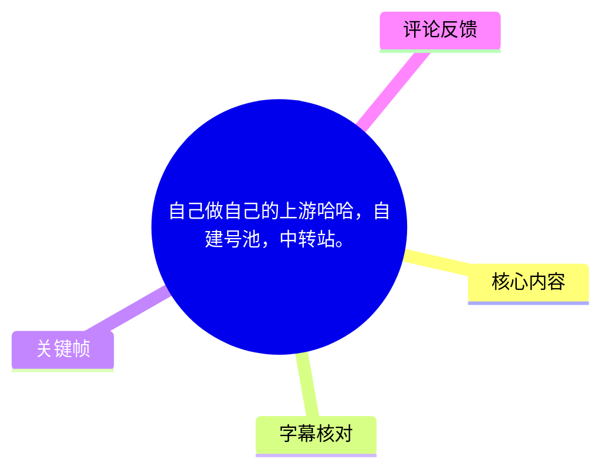
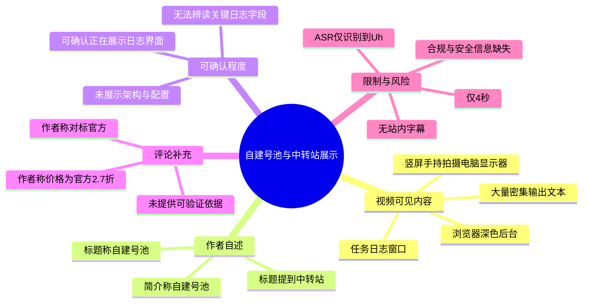
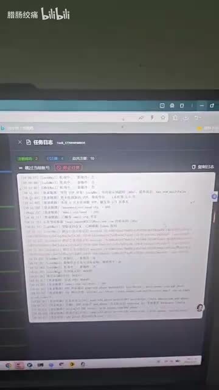
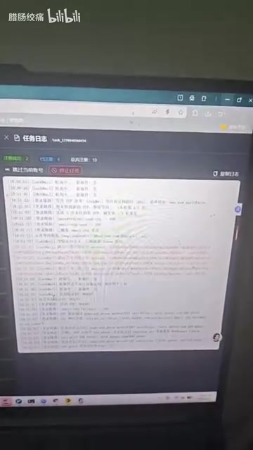

# 自己做自己的上游哈哈，自建号池，中转站。

> 来源：[Bilibili 视频](https://www.bilibili.com/video/BV15T5q6PEm4) 
> UP 主：腊肠绞痛｜发布时间：2026-05-15｜视频时长：4 秒｜分辨率：1080 × 1920（竖屏）  
> 视频简介：`自建号池，觉对纯血`  
> 抓取时数据：119 播放、5 点赞、3 收藏、2 回复、0 弹幕（抓取于 2026-07-16）。

## 小结

这是一段仅 4 秒的电脑屏幕实拍。画面主体是浏览器中的深色后台页面，中央打开了一个白底、密集文本的日志/输出窗口；可辨识的界面标题为“任务日志”。标题、简介和热评共同指向“自建号池”“中转站”这一主题，但视频本身没有展示可稳定辨读的配置项、接口、账号来源、搭建命令或操作结果。

视频能确认的技术信息很有限：UP 主正在展示某个任务运行或日志查看界面，画面中存在大量按行排列的输出记录。这最多说明其试图以运行日志作为“自建号池/中转站”正在工作的展示证据；不能据此确认实际采用的系统、协议、供应商、账号类型、并发量、成功率或合规性。

可迁移的展示经验是：若要证明自动化服务或中转系统的运行状态，应提供可读的关键字段，例如任务名称、输入来源、成功/失败统计、错误码、时间范围及脱敏后的配置摘要。本片采用手持拍屏且时长极短，日志文字失焦，证据可读性不足。

视频不存在可提炼的完整操作步骤，也没有新闻事件、版本更新或可核验的外部公告。标题与简介中的“自建号池”“中转站”属于作者自述；热评中的价格信息也只是作者评论中的营销性陈述，均不应直接当作已经验证的技术或商业事实。

时效上，视频发布于 2026-05-15，抓取于 2026-07-16；即使其所展示的服务当时可用，账号资源、价格、平台规则和接口状态均可能已发生变化。涉及账号池、转发/中转、批量任务的实践还可能受到服务条款、数据安全和当地法律限制，应在合法授权与最小权限前提下评估。

## 思维导图

## 目录

- [素材范围与时效性](#素材范围与时效性-0000)
- [画面演示：任务日志界面](#画面演示任务日志界面-0000)
- [主题、技术信息与证据边界](#主题技术信息与证据边界-0000)
- [可提炼的实践建议](#可提炼的实践建议-0000)
- [参数、限制与风险](#参数限制与风险-0000)
- [字幕比对](#字幕比对)
- [评论分析](#评论分析)
- [处理记录](#处理记录)

## 素材范围与时效性 [00:00](https://www.bilibili.com/video/BV15T5q6PEm4?t=0)

本片总时长为 4 秒；音频实际分析时长为 3.761625 秒。现有 ASR 的唯一带时间戳语音片段位于 **00:00.000—00:00.680**，内容为“Uh...”。因此，正文中所有视频时间定位均只能可靠地指向 00:00，不能依据文字叙述擅自切分出后续秒点。

可用素材包括：

| 类别 | 可用情况 | 可确认内容 |
| --- | --- | --- |
| 视频画面 | 可用 | 8 张关键帧，均为同一短片内的电脑屏幕拍摄画面。 |
| 站内字幕 | 不可用 | 素材明确标注“未提供可用站内字幕”。 |
| 本次 ASR | 可用但极不完整 | 英语识别置信语言概率 0.6572；仅识别出“Uh...”，覆盖约 0.68 秒、18.08% 音频时长。 |
| 视频简介 | 可用 | 作者写有“自建号池，觉对纯血”。原文照录，不对“觉对纯血”的具体含义作扩展解释。 |
| 热评 | 可用 1 条 | 为 UP 主本人补充的价格与定位说法。 |

本视频不包含可独立核验的新闻资讯。标题、简介和评论所述服务定位与价格，都应视为发布者在 2026-05-15 前后作出的陈述，而非平台、官方服务方或第三方验证结论。

## 画面演示：任务日志界面 [00:00](https://www.bilibili.com/video/BV15T5q6PEm4?t=0)

画面显示一台电脑显示器上的浏览器窗口。浏览器下方是深色应用页面，中间覆盖或嵌入一块白色的日志文本区域；左上方可见“任务日志”字样。日志区域内有多行文本，但受拍摄距离、屏幕反光、清晰度和压缩影响，绝大多数具体内容无法可靠辨认。

> 图：`frame-001.jpg` 展示了短片开头的整体界面构图，包括浏览器、深色后台和居中的白色日志窗口。其价值在于证明视频确实在展示一个日志/输出类界面，而不是仅有标题文字；但日志行内容不可作为可引用的配置或执行结果。

> 图：`frame-004.jpg` 延续展示同一日志窗口。该帧可用于比对短片不是静态封面：窗口内确有大量按行排列的信息；但由于文字仍然不可读，不能从中提取任务名称、账号数量、请求地址、状态码或业务参数。

从画面可稳妥记录的只有以下层级：

1. **界面形态**：存在任务日志/输出窗口。
2. **展示意图**：作者可能意在用持续输出的日志来展示某项任务或服务的运行状态。
3. **不可确认部分**：日志对应的是“号池”、中转、其他自动化任务，还是演示数据；画面无法提供足够证据。
4. **不可恢复部分**：日志中可能存在的 URL、密钥、账号、端口、代理地址或命令均不清晰，不应猜测、补全或传播。

## 主题、技术信息与证据边界 [00:00](https://www.bilibili.com/video/BV15T5q6PEm4?t=0)

### 标题与简介中的主题

作者标题为“自己做自己的上游哈哈，自建号池，中转站。”，简介为“自建号池，觉对纯血”。就文字本身而言，作者将内容定位为：

- “自建号池”；
- “中转站”；
- “自己做自己的上游”。

这些词语没有在音频或可读画面中得到定义。视频没有说明“号”具体指何种账号、凭据或资源，也没有公开其来源、管理方式、授权状况、生命周期管理策略或实际用途。

### 画面所能支持的技术结论

可支持的结论仅为：某个浏览器环境中的“任务日志”界面正在被拍摄，页面中有密集的行式输出。

不能支持的结论包括：

- 不能确认该后台是否为作者自研；
- 不能确认是否真的已构成账号池；
- 不能确认中转链路、协议、API 或网络拓扑；
- 不能确认日志代表真实生产环境；
- 不能确认任务执行成功；
- 不能确认性能指标，如吞吐、延迟、并发、稳定性和成功率；
- 不能确认服务是否“纯血”、是否与“官方”存在同等功能关系。

### 与“中转站”相关的必要前置认识

“中转站”在不同技术语境中可能指请求转发、资源代理、消息路由或统一服务入口。但本片未说明其技术语境，故不能将其等同于任一具体架构。若实际系统涉及账号、身份凭据或第三方服务访问，至少应额外明确：

- 资源是否来自合法授权渠道；
- 是否保存令牌、Cookie、密码或个人信息；
- 是否对敏感字段加密、脱敏和审计；
- 是否有速率限制、访问控制、异常处理与撤销机制；
- 是否符合目标平台服务条款及适用法律。

上述项目是对同类系统的通用风险提示，不是对视频中已实现功能的描述。

## 可提炼的实践建议 [00:00](https://www.bilibili.com/video/BV15T5q6PEm4?t=0)

视频没有给出可复现的搭建步骤，以下内容仅根据其“展示任务日志”的形式，整理为更可验证的演示与记录方法，不代表原作者已经采用。

### 1. 先界定系统对象与边界

在展示“号池”或“中转”服务前，应明确说明资源对象是什么、是否已获授权，以及系统负责什么、不负责什么。例如应区分：

- 资源登记与资源实际使用；
- 请求转发与身份认证；
- 测试环境与生产环境；
- 作者自建组件与第三方依赖。

这能避免标题概念宽泛而导致观看者误解功能范围。

### 2. 用结构化状态替代不可读日志

手持拍摄密集日志，难以证明系统是否正常。更适合展示的信息包括：

| 建议展示项 | 作用 | 敏感信息处理 |
| --- | --- | --- |
| 任务开始/结束时间 | 证明执行时段 | 可保留到秒，避免暴露用户时区信息。 |
| 总任务数、成功数、失败数 | 提供结果概览 | 不展示具体账号或资源标识。 |
| 失败原因分类 | 判断系统稳定性 | 对 URL、令牌、路径进行脱敏。 |
| 请求耗时分位数 | 说明性能而非仅展示“在跑” | 不披露可被利用的内网拓扑。 |
| 资源状态变化 | 说明池的生命周期管理 | 使用匿名 ID 或聚合数值。 |

### 3. 对日志进行脱敏并保留审计线索

如果确需展示日志，应避免将账号、密码、Token、Cookie、API Key、手机号、邮箱、IP 地址、内部域名和文件路径直接暴露在视频中。可保留时间、模块名、状态等级和匿名任务 ID，以便观众判断任务流程而不会泄露敏感信息。

### 4. 提供可核验但不过度暴露的结果

短视频可在结束页展示一项脱敏后的汇总，例如运行时长、任务总数与错误数，并同时说明测试条件。相比仅展示滚动文字，这种方式更便于审阅，也更能区分“后台正在运行”与“业务目标已实现”。

## 参数、限制与风险 [00:00](https://www.bilibili.com/video/BV15T5q6PEm4?t=0)

### 已知参数

| 参数 | 值 | 来源与说明 |
| --- | ---: | --- |
| 视频时长 | 4 秒 | 视频元数据。 |
| 视频分辨率 | 1080 × 1920 | 视频元数据，竖屏。 |
| 音频分析时长 | 3.761625 秒 | ASR 诊断。 |
| ASR 语音片段 | 00:00.000—00:00.680 | SRT 原始时间轴。 |
| ASR 文本 | `Uh...` | 本次 ASR 原文。 |
| ASR 语言判断 | 英语，概率 0.6572265625 | 自动识别结果；不代表视频主题语言。 |
| ASR 语音覆盖率 | 18.08% | 0.68 秒语音 / 3.761625 秒音频。 |
| 可获取热评数 | 1 条 | 请求上限为 3 条，实际仅返回 1 条。 |

### 未公开或无法辨读的关键参数

以下参数在视频、简介、字幕和热评中均未被可靠提供：

- 账号池容量、账号类型、资源来源与淘汰规则；
- 中转服务的域名、接口、协议、端口和鉴权方式；
- 部署方式、运行环境、数据库、队列或缓存组件；
- 请求并发、速率限制、延迟、成功率和错误率；
- 价格适用范围、计价单位、支付方式和售后边界；
- “官方”的具体对象，以及“2.7 折”的比较口径。

### 风险与适用限制

1. **证据不足**：仅凭模糊日志窗口，无法审计系统功能、性能或安全性。
2. **安全风险**：账号池和中转系统若处理第三方凭据，可能引入凭据泄露、越权、滥用和供应链风险。
3. **合规风险**：对账号、身份凭据或平台服务的自动化管理与转发，可能触及平台规则、授权范围及法律要求；本片没有给出合规说明。
4. **商业信息不可验证**：价格与“对标官方”仅来自作者自身热评，缺少产品说明、服务条款和第三方证据。
5. **时效风险**：视频与评论反映的是发布时点附近的信息，后续价格、服务状态和相关规则均可能变化。

## 字幕比对

| 字幕来源 | 完整性 | 专有名词 | 时间轴 | 主要问题 |
| --- | --- | --- | --- | --- |
| Bilibili 站内字幕 | 不可用 | 无法评估 | 无可用分段 | 素材明确未提供可用站内字幕。 |
| 本次 ASR 字幕 | 极低，仅 1 条 | 未识别出“号池”“中转站”等主题词 | 可用，00:00.000—00:00.680 | 仅识别为“Uh...”，语音覆盖率 18.08%，无法承载内容转录。 |

本次 ASR 已被检查：使用 `medium` 模型、自动语言检测，结果判定语言为英语（概率约 0.657），输出唯一片段为：

> `00:00:00,000 --> 00:00:00,680`  
> `Uh...`

ASR 诊断中**没有** `noAudioStream=true` 标记，因此不能称源视频“没有音轨”；实际情况是源音频可被处理，但可识别语音极少，且没有形成与画面主题相对应的有效转录。

最终不采用 ASR 文本来解释视频技术内容，也无法采用站内字幕。主题判断仅保留三类可追溯证据：

1. 视频标题中的“自建号池，中转站”；
2. 视频简介中的“自建号池，觉对纯血”；
3. 关键帧中可见的“任务日志”界面和密集输出形态。

“号池”“中转站”“对标官方”“2.7 折”等词均未在清晰画面文字或 ASR 中得到补充定义，未作词义校正或技术补全。

## 评论分析

仅获取到 1 条热评，低于“热评前三条”的请求上限；没有可获取的第 2、3 条评论，因此不补写或推测。

### 热评 1：作者关于价格与定位的补充

- **评论者**：腊肠绞痛（UP 主本人）
- **点赞数**：0
- **评论原文**：`对标官方，官方价格的2.7折，计价公开透明[打call]`
- **观点概括**：评论者将其服务定位为“对标官方”，并声称价格为“官方价格的 2.7 折”，计价方式公开透明。
- **补充价值**：这条评论补充了视频标题和简介中未出现的商业定位与价格说法。
- **可信度与限制**：该信息来自服务发布者本人，且没有给出“官方”所指对象、原价、比较时间、计价单位、服务范围或公开价目链接。因此它可作为作者的自我陈述记录，不能视作已验证的价格事实，也不能据此判断性价比、稳定性或服务合规性。
- **争议点**：“对标官方”的功能、质量、授权与保障是否等同，视频和评论均未提供证据；“2.7 折”也缺乏可复算的比较基准。

## 处理记录

- **Worker ID**：`worker-mrj0wbly-5dc4e50c`
- **整理模型**：`gpt-5.6-terra`
- **ASR 模型与运行参数**：`medium`；自动语言识别；CUDA；`float16`；分析音频时长 3.761625 秒。
- **使用的素材/工具产物**：视频元数据、视频简介与统计信息、`asr/transcript.srt`、ASR 覆盖诊断、8 张关键帧、热评抓取结果；未获得可用站内字幕。
- **字幕选择**：站内字幕不可用；本次 ASR 已检查但仅有“Uh...”一条，无法作为正文转录来源。正文以标题、简介、热评和多模态关键帧可见内容为依据，并明确区分作者陈述与可确认事实。
- **关键帧选择依据**：选用 `frames/frame-001.jpg` 展示整体浏览器与任务日志界面，选用 `frames/frame-004.jpg` 展示同一窗口中的密集行式输出；两帧均能支撑“正在展示日志界面”的描述，但不将模糊文字当作可读参数。
- **缓存清理**：提供的素材记录未包含缓存清理执行结果；本整理不虚构已清理状态。
- **未解决问题**：无法辨读日志具体内容；无法确认系统架构、账号资源属性、实际运行结果及价格比较口径；无可用站内字幕，ASR 也不足以恢复口述信息。
