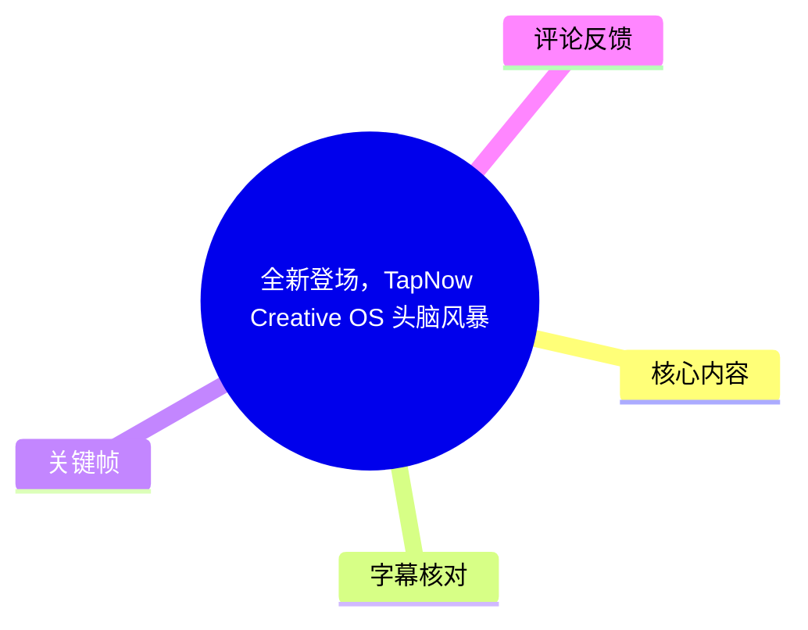
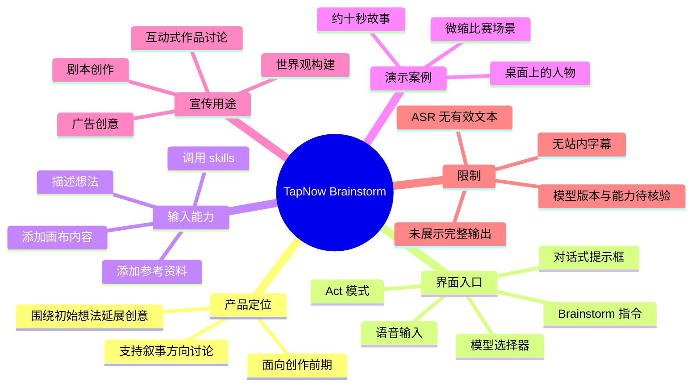
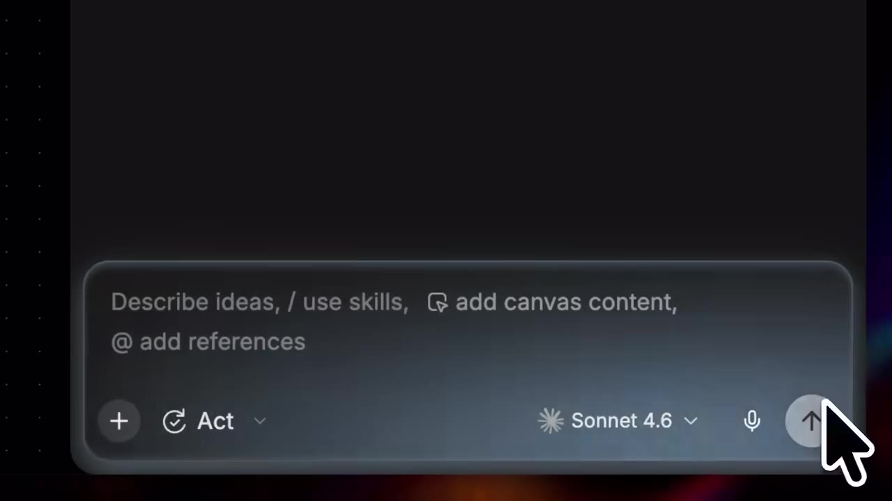
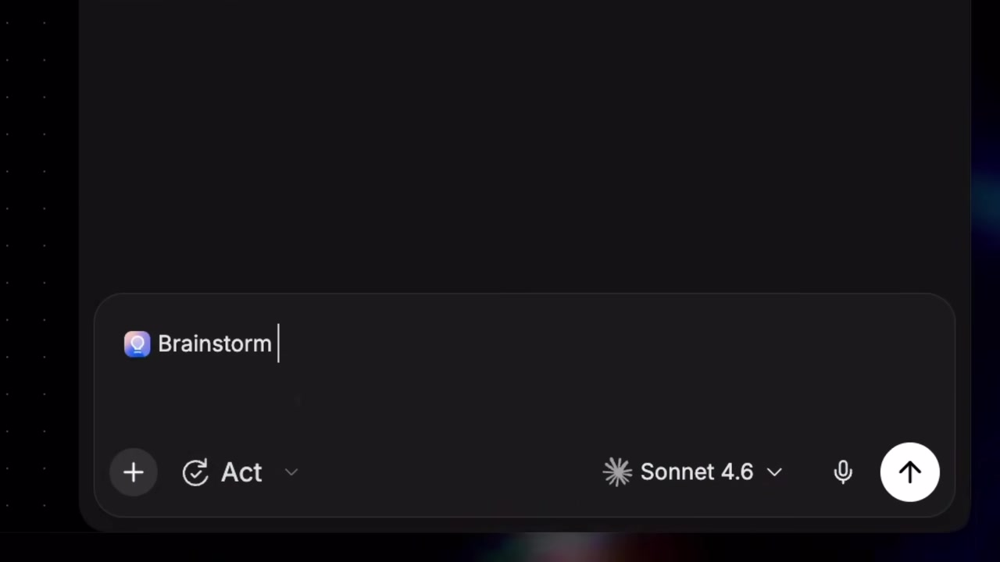

# 全新登场，TapNow Creative OS 头脑风暴

> 来源：[Bilibili 视频](https://www.bilibili.com/video/BV1UqKE6HEDi) 
> UP 主：TapNow｜视频时长：47 秒｜分辨率：3840 × 2160｜合集：AIcode  
> 注：素材未提供可用的站内 SRT，也未提供关键帧对应的精确秒数；下文时间轴统一链接至视频起点，不将画面出现顺序伪装为精确时间。

## 小结

这是一支介绍 **TapNow Creative OS「头脑风暴（Brainstorm）」模式**的短宣传演示。视频及简介的核心主张是：创作者可围绕一个初始想法，让 Agent 延展创意主题与叙事方向，并将前期的世界观构建、剧本创作及互动式作品讨论串联起来。

从画面可确认，该功能以对话式输入框作为入口。界面支持直接描述想法、调用 skills、添加画布内容（canvas content）以及添加参考资料（references）；演示中还可见 `Act` 模式入口、语音输入按钮和模型选择器，选择器当前显示为 `Sonnet 4.6`。

演示给出的具体输入案例是：希望创作一个“人物趴在桌面上，面前是一些微缩比赛场景”的故事，时长约十秒。该例说明产品定位并非只生成一句灵感，而是试图把一个视觉/叙事种子转为可继续讨论的创作任务。

视频简介进一步宣称，该模式可用于宏大世界观构建和广告创意挖掘，并能缩减剧本撰写的耗时与成本。这些属于发布方的产品宣传与能力声明；由于本次素材没有可用语音转写、也没有展示完整输出结果，不能据此验证实际生成质量、稳定性、模型版本、价格、上下文长度或最终可交付格式。

适合阅读本文的人群包括：需要整理故事方向、短片概念、广告创意或互动作品思路的创作者，以及想快速了解 TapNow Creative OS 交互入口的 AI 工具使用者。若计划实际采用，应以产品当前网页、模型说明、计费页和试用结果为准。

## 思维导图

## 目录

- [视频定位与可确认信息](#视频定位与可确认信息)
- [界面与功能入口](#界面与功能入口)
- [演示提示词与创作流程](#演示提示词与创作流程)
- [适用场景、限制与时效性](#适用场景限制与时效性)
- [字幕比对](#字幕比对)
- [评论分析](#评论分析)
- [处理记录](#处理记录)

## [视频定位与可确认信息](https://www.bilibili.com/video/BV1UqKE6HEDi?t=0)

视频开场画面写有 **“TapNow Brainstorm”**，并配有中文画面字幕“TapNow 头脑风暴”。结合标题“全新登场，TapNow Creative OS 头脑风暴”，可确认本片是在介绍 TapNow Creative OS 中名为 Brainstorm 的功能或模式。

> 图：画面直接呈现 “TapNow Brainstorm” 及“TapNow 头脑风暴”文字，是确认本片主题与产品命名的最直接视觉证据。

发布方在视频简介中给出的能力范围包括：

1. 围绕用户想法延展“无限的创意主题与叙事方向”；
2. 完善从世界观搭建到剧本创作的流程；
3. 基于剧本讨论生成互动式作品；
4. 用于世界观构建或广告创意挖掘；
5. 帮助减少创作前期卡点，以及剧本撰写的时间与成本。

其中，“无限”“全面赋能”“大幅缩减”等措辞为营销性表述，不应等同于可量化、已独立验证的性能结论。视频时长仅 47 秒，也没有展示完整的多轮工作流、生成结果、编辑过程或导出结果。

## [界面与功能入口](https://www.bilibili.com/video/BV1UqKE6HEDi?t=0)

演示界面的输入框占据主要位置，默认提示文本为：

> `Describe ideas, / use skills, [画布图标] add canvas content, @ add references`

从可见文字可整理出四类输入/上下文组织方式：

| 可见入口 | 画面中的原文 | 可确认含义 | 未能确认的部分 |
| --- | --- | --- | --- |
| 自然语言输入 | `Describe ideas` | 可以直接用文字描述创作想法 | 输入语言范围、提示词长度限制 |
| Skills | `/ use skills` | 支持通过 `/` 调用某类 skills | 技能清单、具体能力与权限 |
| 画布内容 | `add canvas content` | 可将画布内容加入当前上下文 | 画布格式、内容上限、引用方式 |
| 参考资料 | `@ add references` | 可添加参考资料 | 支持的文件格式、链接/素材类型及版权处理 |

> 图：该帧清楚展示输入框的四项引导语，以及底部的 `Act`、`Sonnet 4.6`、麦克风和发送按钮；它说明 Brainstorm 采用的是围绕上下文组织的对话式交互，而非只有固定表单。

界面底部还可见以下控制项：

- **`Act`**：以图标和下拉箭头呈现，表明存在名为 Act 的模式或菜单项，但视频未展开菜单，无法确认它与 Brainstorm 的精确关系。
- **`Sonnet 4.6`**：模型选择位置显示这一名称，并带有下拉箭头。仅能确认演示画面显示此标签；不能据此确认实际底层模型供应商、官方版本号、路由规则、可用地区或所有用户均可选择该模型。
- **麦克风图标**：说明界面提供语音输入入口，但视频未展示录音、识别或语言设置过程。
- **发送箭头**：用于提交当前输入。

## [演示提示词与创作流程](https://www.bilibili.com/video/BV1UqKE6HEDi?t=0)

画面先在输入框中键入 **`💡 Brainstorm`**，表明用户可将“Brainstorm”作为当前创作任务的显式指令或模式名称。

> 图：该帧展示 `💡 Brainstorm` 已被填入输入区，且仍可见 `Act` 与 `Sonnet 4.6` 控制项。它为“头脑风暴通过对话输入触发”的判断提供画面依据。

随后，界面中出现的英文请求为：

> `💡 Brainstorm I want to create a story about a character lying on a table with miniature game scenes in front of them, about ten seconds long.`

画面底部的中文字幕对应为：

> 我想创作一个人物趴在桌面上，面前是一些微缩比赛场景的故事，时长大概十秒。

> 图：画面完整保留了英文提示词及其中文画面字幕，是视频中唯一可直接核对的具体创作案例。其价值在于明确了输入同时包含主体、空间关系、视觉元素与目标时长四类约束。

### 可复用的输入拆解

虽然视频没有展示 Agent 的最终回复，但这个案例本身提供了一种较清晰的创意简报写法，可拆为：

1. **创作意图**：创作一个故事，而非单张图或单句文案。
2. **主体**：一个人物。
3. **构图/动作**：人物趴在桌面上。
4. **场景元素**：人物面前有微缩比赛场景。
5. **时长约束**：约十秒。

若将其迁移到实际创作，可在此基础上补足角色动机、情绪、镜头语言、比赛类型、结尾反转、受众、平台比例与禁用元素。但这些补充项是本文基于常见创作简报结构提出的实践建议，并非视频已展示的固定字段或产品要求。

### 视频可支持的操作顺序

基于画面和简介，可谨慎整理出如下流程：

1. 进入 TapNow Creative OS 的对话式输入界面。
2. 选择或键入 `Brainstorm`。
3. 输入初始创意，并尽量写明内容主体、画面关系与时间尺度。
4. 需要时通过 `/` 添加 skills、通过画布入口加入已有内容、用 `@` 加入参考资料。
5. 提交给 Agent，围绕创意继续讨论叙事方向或剧本。

第 4 步中的素材类型及第 5 步的具体输出形态均未在视频中演示，不能扩展为“必然支持文档、图片、视频或网页链接”等未经证明的结论。

## [适用场景、限制与时效性](https://www.bilibili.com/video/BV1UqKE6HEDi?t=0)

### 适用场景

按发布方简介，Brainstorm 的目标场景主要是创作前期：

- **世界观构建**：将一个设定继续扩写为主题、角色关系或故事方向；
- **剧本创作**：从灵感到剧本讨论的衔接；
- **广告创意挖掘**：围绕品牌或传播目标寻找概念方向；
- **互动式作品讨论**：基于剧本进一步讨论互动作品的生成可能性。

短视频案例尤其适合用于说明“一个明确视觉概念 + 时长要求”的输入方式：用户不必先写完整剧本，也可以从一幅画面或一个瞬间出发。

### 关键限制

1. **没有展示输出**：画面停留在提交请求与 “Thinking” 状态附近，未展示 Brainstorm 实际返回的主题、分镜、剧本或互动作品内容。因此，输出质量与完成度无法评价。
2. **参数信息不足**：未公开最大上下文、上下文保留策略、生成次数限制、并发限制、付费方式、导出格式和版权条款。
3. **模型信息不足**：界面显示 `Sonnet 4.6`，但没有给出模型厂商、正式版本说明、调用方式或版本可用性；不能仅凭 UI 标签判断服务链路。
4. **素材能力未实证**：界面出现画布与参考资料入口，但未演示可添加的资料种类、解析效果和引用准确性。
5. **音频转写无法补强内容**：本次 ASR 没有识别到任何有效语音段落，正文不能通过旁白补充画面外信息。

### 时效性

本视频元数据显示发布时间为 **2026-07-17 23:18:50 UTC**，抓取时间为 **2026-07-21**。AI 工具的模型列表、UI、可用功能、价格、地区政策及产品链接均可能快速调整。

因此，本文中的“Sonnet 4.6”“Act”“Brainstorm”等描述，仅对应本次视频画面与抓取时可见信息。实际使用前应前往发布方简介提供的 `https://app.tapnow.ai/home`，核查当前产品页面、服务条款、模型标识与计费信息。

## 字幕比对

| 字幕来源 | 完整性 | 专有名词 | 时间轴 | 主要问题 |
| --- | --- | --- | --- | --- |
| Bilibili 站内字幕 | 未提供可用字幕 | 无从核验 | 无 | 素材明确标记为“未提供可用站内字幕” |
| 本次 ASR 字幕 | 空 | 未识别出任何专有名词 | ASR 具备时间戳能力，但无分段 | `segments` 为空，语音覆盖率为 0；诊断提示未识别到语音段落 |

本次 ASR 使用 `medium` 模型、自动语言识别，检测语言为英语，语言置信度为 `0.541015625`；音频时长为 `46.300625` 秒，识别结果为空，未产生任何可引用的时间轴字幕。

诊断信息**没有**标记 `noAudioStream=true`。素材目录中也存在 `audio/audio.wav`，因此不能将该情况表述为“源视频没有音轨”，更不能把空 ASR 当成工具故障的确定结论。能够如实确认的是：本次识别没有获得可用语音文本，可能与无旁白、音乐/音效主导、音轨内容不适合当前识别配置等因素有关，但现有素材不足以区分。

最终正文采用以下证据优先级：

1. 视频元数据中的标题、简介和时长；
2. 关键帧中可直接辨认的英文 UI 文本及内嵌中文字幕；
3. 空 ASR 的诊断结果，用于明确转写覆盖边界。

通过画面校正并保留的关键术语包括：`TapNow Brainstorm`、`Brainstorm`、`Act`、`Sonnet 4.6`、`Describe ideas`、`use skills`、`add canvas content`、`add references`。其中 `Sonnet 4.6` 仅按画面原样记录，不对其真实性或底层来源作额外推断。

## 评论分析

仅分析本次可获取的热评前三条；评论代表个体体验或质疑，不作为已经验证的产品事实。

| 热评 | 点赞 | 观点与补充 | 可信度与争议 |
| --- | ---: | --- | --- |
| Limmmmnnn：“模型只有厂家不显示版本号，一律中转站成色[doge]” | 8 | 认为若只显示模型厂商而不展示版本号，服务可能具有“中转站”特征。 | 属于带调侃语气的经验判断，未提供证据。值得注意的是，本片画面实际显示了 `Sonnet 4.6` 标签，但仍未提供可独立核验的官方模型说明。 |
| 饼菜单子oo：“使用下来总体感觉，还是得要切换着用，每个ai擅长的都不太一样[吃瓜]” | 27 | 分享多工具协作的使用感受：不同 AI 各有擅长领域，建议切换使用。 | 这是合理的个人工作流建议，但没有说明具体任务、工具版本、评测标准或成本，不能外推为 TapNow 的性能结论。 |
| -----_--_------：“你这sonnet和opus真的假的[藏狐]” | 24 | 对界面中展示的 Sonnet、Opus 类模型名称是否真实可用提出质疑。 | 该质疑与视频证据边界一致：画面只能证明显示了模型标签，不能证明后端实际调用、模型版本、路由方式或输出质量。 |

评论区的共同关注点集中在**模型标识透明度**与**不同 AI 的实际能力差异**。对使用者而言，较稳妥的做法是：将关键任务分别用可核对版本、价格和隐私条款的工具做小样测试，而非仅依据 UI 名称或宣传视频作决策。

## 处理记录

- Worker ID：`worker-mrj0www4-e8d79408`
- 模型：`gpt-5.6-terra`
- 调用工具与素材：视频元数据、关键帧清单与画面、多模态画面理解、ASR 诊断结果、热评数据。
- ASR 检查：已检查本次 ASR。ASR 模型为 `medium`，CUDA / `float16`，自动语言检测结果为英语，未识别到任何语音分段；未见 `noAudioStream=true` 标记。
- 字幕选择：站内无可用字幕；本次 ASR 为空。正文以元数据描述和关键帧可见文字为主，并明确标记不能由字幕确认的内容。
- 时间轴依据：没有可用站内 SRT 分段，也没有 ASR 分段时间戳；各正文章节使用 `t=0` 视频起点链接，避免捏造具体画面秒数。
- 关键帧选择依据：选用 `frame-001` 至 `frame-004`，分别对应产品名称、输入框能力提示、Brainstorm 指令和完整示例请求；这些画面直接支撑正文中最关键的可验证信息。
- 缓存清理：未提供缓存清理执行日志；无法确认是否已清理，故不虚构清理结果。
- 未解决问题：未能确认实际语音内容、Brainstorm 的完整输出、模型后端与版本真实性、技能/参考资料支持范围、订阅或计费方式，以及画面精确出现秒数。
