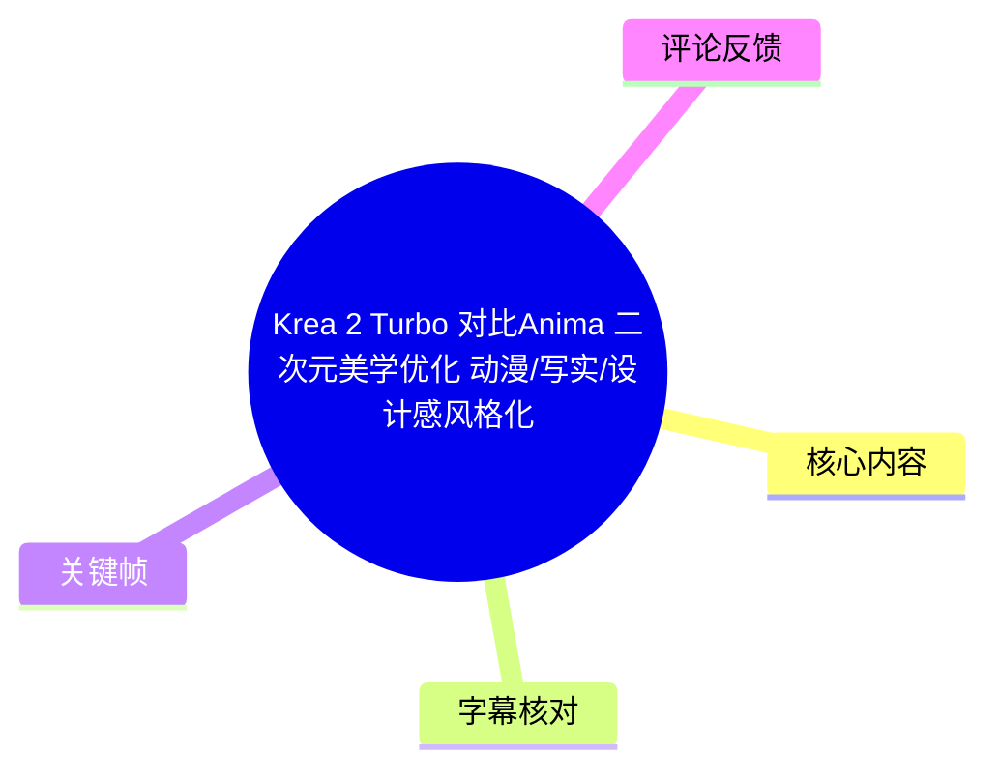
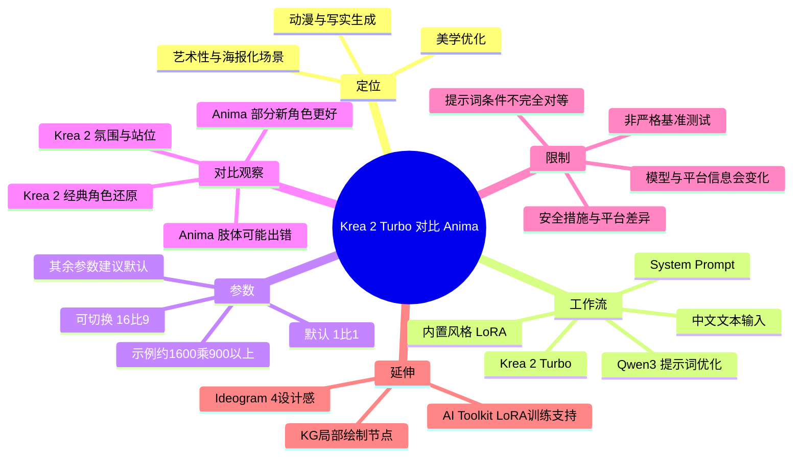
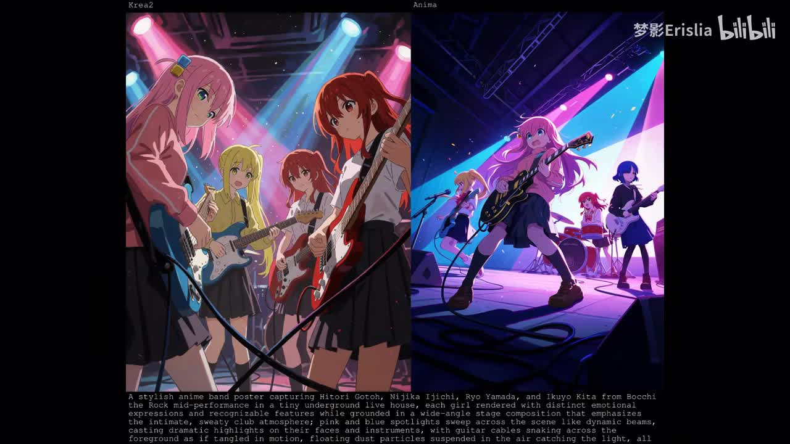
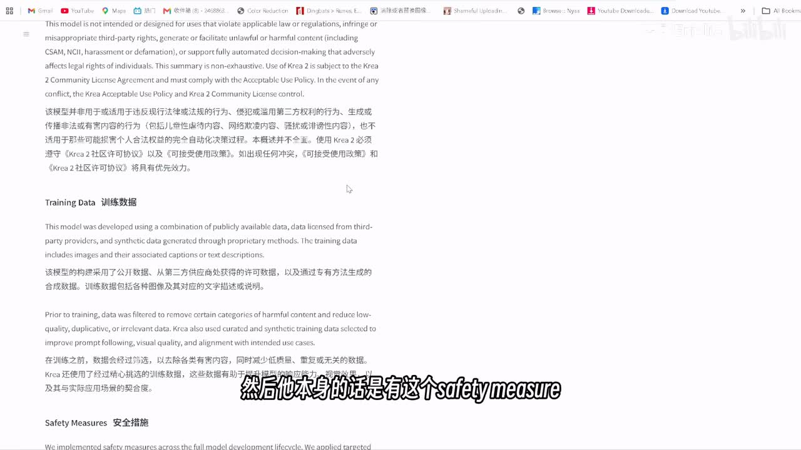
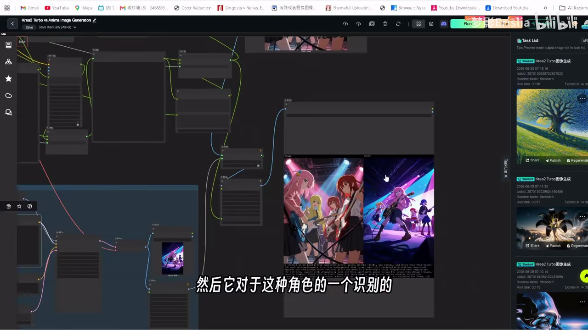
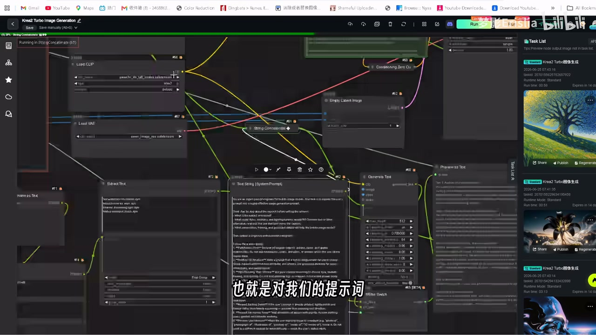

# Krea 2 Turbo 对比Anima 二次元美学优化 动漫/写实/设计感风格化

> 来源：[Bilibili 视频](https://www.bilibili.com/video/BV1un7v6tEsq) 
> UP 主：梦影Erislia｜时长：06:25｜合集：AIcode  
> 本文仅整理视频、元数据、字幕、关键帧与可获取热评中的信息；模型能力、训练数据与平台权益均应以其后续官方页面为准。

## 小结

视频围绕 **Krea 2 Turbo** 的图像生成特性展开，并在同一工作流中与 **Anima** 做了二次元案例对照。作者的核心判断是：Krea 2 Turbo 的突出优势在于“美学优化”带来的海报设计感、氛围塑造、角色站位与部分经典动画角色还原；它尤其适合艺术性、史诗感较强的场景。

工作流层面，视频使用 Krea 2 Turbo，并通过 **Qwen3 + System Prompt** 将用户输入提示词改写为适合 Krea 2 的格式。作者演示了中文输入、提示词优化开关、内置风格 LoRA、画幅设置等位置；默认画幅为 1:1，示例中可切换为 16:9，分辨率示例为约 **1600 × 900 以上**。除这些项目外，作者建议其余参数不改动后直接运行。

对比并非严格的模型基准测试。视频明确承认，Anima 在该对比中使用的是较普通、未做特定风格处理和提示词优化的提示词；而 Krea 2 接收的是经工作流优化后的提示词。因此，画面优劣只能说明这一套提示词与工作流配置下的效果，不能直接推导出两模型在所有任务上的绝对强弱。

角色表现方面，作者认为 Krea 2 对《海贼王》及明日香等部分既有动画作品角色的原作色彩、质感还原较好，多角色一致性也较突出；但对于《孤独摇滚！》等较新的角色案例，Krea 2 出现问题，Anima 反而还原得更好。若目标更偏真人感或可局部手绘控制的设计感，作者建议考虑此前介绍过的 **Ideogram 4** 及其 KG 节点方案。

视频还提到 Krea 2 具有安全措施；作者称本地环境可安装 `ComfyUI-ConditioningKrea2Rebalance` 相关节点，而 RH 平台环境未提供。该部分涉及绕开模型初始审核的表述，本文仅记录其存在与平台差异，不将其整理为规避安全措施的操作方法。

时效上，视频发布于 2026-06-24，涉及 RunningHub 点数、新用户邀请码、AI Toolkit 镜像更新计划、模型版本和节点兼容性等内容均可能变化；应在使用前访问视频简介所列的 Krea、Hugging Face、GitHub 与平台页面复核。

## 思维导图

## 目录

- [背景、定位与时效性](#背景定位与时效性)
- [模型组成、安全措施与适用边界](#模型组成安全措施与适用边界)
- [官方工作流与提示词优化](#官方工作流与提示词优化)
- [运行设置：LoRA、画幅与分辨率](#运行设置lora画幅与分辨率)
- [Krea 2 Turbo 与 Anima 的案例比较](#krea-2-turbo-与-anima-的案例比较)
- [角色还原、多角色一致性与风格选择](#角色还原多角色一致性与风格选择)
- [训练资料、LoRA 与后续信息](#训练资料lora-与后续信息)
- [实践步骤与使用建议](#实践步骤与使用建议)
- [结论与限制](#结论与限制)
- [字幕比对](#字幕比对)
- [评论分析](#评论分析)
- [处理记录](#处理记录)

## 背景、定位与时效性

### [视频讨论的问题与模型定位（00:00）](https://www.bilibili.com/video/BV1un7v6tEsq?t=0)

作者将 Krea 2 Turbo 定位为一个强调视觉美学的图像模型，适用范围包括动漫风格和相对写实的图像，但视频展示重点明显放在二次元、角色海报、舞台感与艺术场景上。

作者的主要经验性评价包括：

- Krea 2 的“美学优化”会使生成结果具有较强的美术完成度。
- 在海报设计、人物站位、灯光氛围和“史诗感”场景中，其优势较明显。
- 模型本身有一定偏 3D 的倾向；若需明确二维赛璐璐方向，应在风格描述中主动指定。
- 这不是单纯比较“能否认出角色”，而是比较模型对角色、构图、氛围与画面设计的综合响应。

> 图：关键帧将 Krea 2 与 Anima 的同题材舞台乐队图并列展示，底部可见较长英文提示词。它直接对应视频的比较主题，也说明该视频采用的是视觉案例观察，而非只以文字参数论证模型能力。

### 时效说明

视频元数据的发布时间为 2026-06-24。下列信息具有明显时效性：

- Krea 2 Turbo 的版本、权重、许可协议与技术报告内容；
- RunningHub（RH）工作流可用性、邀请奖励和每日登录点数；
- `ComfyUI-ConditioningKrea2Rebalance` 节点的维护状态与兼容性；
- AI Toolkit 对 Krea 2 LoRA 训练的实际支持范围；
- 模型在平台端与本地端的安全策略差异。

因此，本文保留作者当时的描述，但不将其视为当前仍有效的产品承诺。

## 模型组成、安全措施与适用边界

### [Turbo 版本、常规版本与安全措施（00:24）](https://www.bilibili.com/video/BV1un7v6tEsq?t=24)

作者将 Krea 2 说明为包含常规版本与 Turbo 版本，并建议实际出图优先使用 **Turbo**：常规版本明显更慢，作者将其主要用途描述为 LoRA 训练相关用途。这里的“主要用途”是视频作者的使用判断，并非本模型官方功能定义。

视频还指出模型有安全措施。作者展示官方页面中的 “Safety Measures / 安全措施”内容，并称：

- 若试图生成 NSFW 内容，工作流层面会涉及一个额外节点；
- 本地使用环境可安装名为 `ComfyUI-ConditioningKrea2Rebalance` 的项目；
- RH 环境没有该节点；
- 作者将该节点描述为可对 Krea 的初始审核层进行处理。

> 图：关键帧展示浏览器中的 Krea 相关说明页面，页面可见 “Training Data / 训练数据” 与 “Safety Measures / 安全措施”标题。该画面是视频安全措施论述的来源背景，而非对节点效果的独立验证。

### 使用边界

视频没有提供安全策略的完整技术说明、许可适用范围或节点效果验证，也没有提供在不同模型版本、不同平台上的一致性测试。因此可确认的是作者提到“存在安全措施与本地/平台节点差异”；不能据此确认具体审核机制、绕过效果或合规性。

对于涉及违法、有害、侵权或违反平台规则的内容，应遵守模型许可、平台规则及适用法律，不应把视频中的相关表述理解为可执行的规避指南。

## 官方工作流与提示词优化

### [工作流结构与 Qwen3 提示词改写（01:10）](https://www.bilibili.com/video/BV1un7v6tEsq?t=70)

作者随后展示 Krea 2 的官方工作流，并将注意力集中在文本输入与提示词处理区域。视频描述的流程为：

1. 在文本输入处填写提示词，可直接使用中文。
2. 示例输入类似“美丽拉车员美少女、史诗感”一类的自然语言描述；字幕对该句识别不稳定，无法可靠还原逐字原文。
3. 工作流使用 Krea 2 Turbo 模型。
4. 通过 Qwen3 与 System Prompt 对用户提示词进行一层优化。
5. 优化器产出更符合 Krea 2 格式的提示词，以改善模型对美学意图的理解和最终生成效果。
6. 用户可以选择不启用这层提示词优化。

作者提到工作流中存在与提示词优化相关的开关，ASR 将其识别为类似 `reform prompts` 的名称，站内字幕则转写为 `REFPANTS`，两者均不能作为可靠的精确节点名。能够确认的是：该选项控制是否将输入提示词交由优化链路改写；作者还提到可改为 `Force` 一类状态。

> 图：关键帧显示 RH 的节点工作流画布和右侧任务列表，中部预览区并列显示两张生成图。该图用于理解“在同一画布中连接 Krea 2 与对比输出”的工作方式，以及视频案例的实际运行环境。

### [System Prompt 与参数区域（01:38）](https://www.bilibili.com/video/BV1un7v6tEsq?t=98)

视频在节点画布中放大了 System Prompt、文本生成和模型参数区。作者说明，System Prompt 的作用不是直接替代用户描述，而是让 Qwen3 将用户的自然语言请求整理成适配 Krea 2 的提示词结构。

> 图：关键帧展示节点画布中的 “Text String (System Prompt)” 区域及其与下游节点的连接。它有助于区分“原始提示词输入”和“经大模型格式化后的提示词输出”，也是理解后续对比公平性的重要证据。

### 对比条件的重要影响

作者在后段明确表示：用于 Krea 2 的提示词经过上述工作流优化，而 Anima 一侧使用较普通的提示词，没有附加特定风格词，也没有使用同等的提示词优化。故该工作流的提示词改写既是 Krea 2 体验的一部分，也是两模型对照中最重要的变量之一。

## 运行设置：LoRA、画幅与分辨率

### [内置风格 LoRA 与二维风格控制（02:05）](https://www.bilibili.com/video/BV1un7v6tEsq?t=125)

作者称 Krea 2 内置多个 LoRA，口述中先说“三个”、随后又修正为“四个”。视频只明确展示其中带有类似 “Pasta” 和暗色笔刷风格的项目，其他准确名称未能从素材中可靠辨认。

作者给出的使用建议是：

- 这些 LoRA 用于特定风格；
- 默认状态下没有开启；
- 是否需要启用取决于目标画风；
- Krea 2 原生输出略偏 3D；
- 若想要 2D 赛璐璐等方向，需要在风格描述中明确指定。

这意味着 LoRA 不是视频所示默认工作流的必选项，而是定向强化画风的可选层。视频没有给出每个 LoRA 的权重、触发词、授权范围或横向效果对照，因而不能从本素材推导推荐权重。

### [画幅、分辨率与直接运行（02:32）](https://www.bilibili.com/video/BV1un7v6tEsq?t=152)

作者指出可在工作流中修改图片宽高比：

| 项目 | 视频中的说明 |
| --- | --- |
| 默认画幅 | 1:1 |
| 示例可选画幅 | 16:9 |
| 示例分辨率档位 | 1.5K |
| 作者换算的宽度 | 约 1600 |
| 高度 | 900 多像素 |
| 其他参数 | 作者建议不改动，直接运行 |

“1600 × 900 多”的说法是作者对 1.5K 档位、16:9 输出的口头换算，并未在素材中展示精确的最终长宽数字或所有采样参数。因此，实践中应以工作流界面实际字段、显存容量和输出需求为准。

作者还提到 RH 注册使用邀请码可获得 1000 点、每日登录可获得 100 点。这属于视频发布时的平台活动信息，不保证现在依旧有效。

## Krea 2 Turbo 与 Anima 的案例比较

### [比较前提：提示词不完全等价（02:55）](https://www.bilibili.com/video/BV1un7v6tEsq?t=175)

作者解释 Anima 在视频中“看起来稍差”的重要原因：Anima 对提示词有一定要求，而本次演示没有为它使用特定风格词或提示词优化。相对地，Krea 2 的提示词经过 Qwen3 + System Prompt 处理。

因此，视频比较应理解为：

- **Krea 2 Turbo + 官方提示词优化工作流**
- 对比
- **Anima + 普通、未做专门优化的提示词**

而不应理解为在完全相同、等长度、等语义密度、等风格约束提示词下的控制变量测试。

作者仍强调 Anima 本身“也很厉害”，并非否定 Anima 的整体能力。这一表述与后续《孤独摇滚！》角色还原案例相互呼应：不同角色、风格和提示词条件下，结果可能反转。

### [海报感、角色站位与《海贼王》案例（03:16）](https://www.bilibili.com/video/BV1un7v6tEsq?t=196)

在作者的观察中，Krea 2 Turbo 的优势集中于以下视觉维度：

- 更强的风格设计与画面气氛；
- 人物站位与场景调度更有张力；
- 艺术性和史诗感较突出；
- 海报类画面有较强的整体美学完成度。

作者以《海贼王》相关案例说明：在使用相近提示词的情况下，Anima 一侧更容易出现肢体问题，而 Krea 2 一侧没有出现同类问题。需要注意，这只是视频中展示的个案，不足以证明 Krea 2 在所有人物姿态、所有角色或所有随机种子下都优于 Anima。

## 角色还原、多角色一致性与风格选择

### [经典角色、多人构图与新角色案例（03:48）](https://www.bilibili.com/video/BV1un7v6tEsq?t=228)

作者认为，Krea 2 对一些已有动画作品角色倾向于还原原作番剧的颜色与质感，而非把角色统一套入常见的“二次元优化模型”式插画风格。

视频中的案例判断包括：

| 案例方向 | 作者观察 |
| --- | --- |
| 明日香等经典角色 | Krea 2 更倾向于保留动画原作的色彩、质感与观感 |
| 明日香与绫波丽在列车内 | 作者称只需直接描述人物与场景，已可获得接近目标的效果 |
| 《美少女战士》五名角色 | 作者认为多角色一致性较好，五人基本被还原 |
| 《孤独摇滚！》角色 | Krea 2 出现一定问题，Anima 的还原更好 |
| 史诗感、氛围化场景 | Krea 2 是作者更推荐的方向 |

这里的“还原”是作者对生成图与原作印象的主观比较，并没有提供版权角色数据集指标、相似度量化方法或多轮随机种子统计。实际使用时，角色名称、服装描述、镜头语言、风格约束与模型安全策略都会显著影响结果。

### [写实与设计感：Ideogram 4 的补充定位（04:55）](https://www.bilibili.com/video/BV1un7v6tEsq?t=295)

作者没有把 Krea 2 描述为所有任务的替代品。若用户目标偏向：

- 更接近真人的效果；
- 更强调设计感的画面；
- 需要手动划定、绘制或控制区域；

作者建议考虑此前分享的 **Ideogram 4**，并称其有专门的 KG 节点，可手动绘制区域，从而有利于设计感控制。

视频没有展开 Ideogram 4 的具体工作流、KG 节点全名、参数或与 Krea 2 的同题材对照，因此这里只能将其记为作者提出的替代方向，不能据此形成完整操作教程。

## 训练资料、LoRA 与后续信息

### [技术报告、数据描述与 AI Toolkit 计划（05:27）](https://www.bilibili.com/video/BV1un7v6tEsq?t=327)

作者提到 Krea 团队发布了技术报告，内容涉及模型训练及对风格化的描述。视频将其概括为：

- 训练中对数据集进行了筛选；
- 作者称训练未使用 AI 生成图像，以避免明显的“AI 合成感”；
- 具体细节建议观众自行阅读技术报告。

需要区分：这是视频对技术报告的转述。关键帧中的官方页面可见“训练数据”章节，且其文字提到公开数据、第三方授权数据与通过专有方法生成的合成数据；这与“未使用 AI 生成图像”的口头概括在“合成数据”的定义上可能需要阅读官方技术报告原文才能精确厘清。仅凭当前素材，不能进一步判断合成数据是否等同于 AI 生成图像、其占比或具体来源。

作者还称 **AI Toolkit** 已支持 LoRA 训练，之后会更新镜像，使观众能够训练 LoRA。由于这属于未来更新计划，视频未展示已完成的镜像、安装步骤或训练结果，需视为待后续验证的信息。

## 实践步骤与使用建议

### [按视频流程复现基础出图（01:10）](https://www.bilibili.com/video/BV1un7v6tEsq?t=70)

以下是对视频已展示流程的保守整理，不补充素材之外的节点、权重或命令。

1. **选择运行环境**
   - 本地环境：根据作者说法，需要将模型放入相应位置；视频未给出准确目录。
   - RH 环境：可使用视频简介提供的 Krea 2 试玩工作流或 Krea 2 vs Anima 工作流链接。
   - 平台点数及邀请奖励应在页面上重新确认。

2. **选择 Krea 2 Turbo**
   - 作者建议以 Turbo 作为常规出图版本。
   - 不应从该视频直接推断常规版本不能用于出图；视频仅说明其速度较慢且作者认为其更多服务于 LoRA 训练相关用途。

3. **输入提示词**
   - 可输入中文自然语言描述。
   - 若目标为二维动画画风，应额外明确 2D、赛璐璐等方向，以抵消作者所称的轻微 3D 倾向。
   - 若目标是海报化、氛围化或史诗感画面，可在主体、场景、站位、灯光和整体情绪上提供更明确描述。

4. **决定是否启用提示词优化**
   - 使用工作流中的 Qwen3 + System Prompt 优化链路，可让原始输入转化为适配 Krea 2 的格式。
   - 如需做模型间公平比较，应尽量让两边使用语义等价、长度相近、风格约束相近的提示词；否则结果包含“模型 + 提示词优化器”的联合效果。

5. **按目标决定是否启用内置 LoRA**
   - 默认可不启用。
   - 当需要视频中展示的特定风格，如暗色笔刷等，再针对性选择；素材未提供可靠的 LoRA 名称、权重和触发词。

6. **设置画幅与输出尺寸**
   - 默认使用 1:1。
   - 横向画面可改为 16:9。
   - 视频示例采用 1.5K 档，作者口述其约为 1600 宽、900 多高。
   - 其余参数按作者建议保持不动后运行；但若出现显存、速度或构图问题，仍应以实际平台参数说明为准。

7. **用任务匹配模型，而非只看单次对比**
   - 侧重海报感、氛围、经典动画质感或多人一致性：可优先测试 Krea 2 Turbo。
   - 某些现代二次元角色的精确还原：可同时测试 Anima。
   - 偏真人、区域可控或强设计排版：作者建议另行尝试 Ideogram 4 的相关方案。

## 结论与限制

### [结论与适用范围（06:02）](https://www.bilibili.com/video/BV1un7v6tEsq?t=362)

视频提供的可迁移经验不是“Krea 2 必然胜过 Anima”，而是：**模型选择、提示词改写、风格约束与目标画面类型必须一起考虑。**

Krea 2 Turbo 在本视频工作流下的主要价值是美学导向：对于人物站位、舞台光影、海报化构图、动画原作色彩感和史诗氛围，作者给出了较高评价。Anima 并未被否定，它在部分新角色还原上表现更好，且作者也承认其本身很强。

本视频的关键限制如下：

1. **比较条件不对称**：Krea 2 使用 Qwen3 优化后的格式化提示词，Anima 使用普通提示词，不能视为严格公平的模型测试。
2. **缺少量化指标**：没有生成次数、随机种子、失败率、速度、显存、成本、角色相似度或肢体正确率统计。
3. **LoRA 信息不完整**：内置 LoRA 数量口述存在“三个/四个”的修正，名称、权重和效果边界未完整展示。
4. **参数信息有限**：仅展示了画幅、约 1.5K 的尺寸说明及“其余不动”的经验，不足以形成完整的本地部署或调参手册。
5. **安全相关内容不可操作化**：视频提到本地节点与平台限制，但没有也不应将其延伸为规避安全策略的教程。
6. **平台与产品信息易变**：链接、积分、模型权重、训练支持和许可条件需要重新核验。

## 字幕比对

### [站内字幕与本次 ASR 的质量比较（00:00）](https://www.bilibili.com/video/BV1un7v6tEsq?t=0)

本次任务已执行 ASR。站内字幕与 ASR 都存在明显的专有名词错误和中英混杂识别问题，因此采用“**以本次 ASR 的中文语义为主，结合站内字幕、视频元数据、简介链接、关键帧与上下文人工校正**”的整理策略。

| 字幕来源 | 完整性 | 专有名词 | 时间轴 | 主要问题 |
| --- | --- | --- | --- | --- |
| Bilibili 站内字幕 | 覆盖基本完整 | 较差 | 未提供逐句时间戳 | 字幕为阿拉伯语转写/翻译，与原视频中文语音不一致；Krea 2、Qwen3、LoRA、节点名等有音译和拼写偏差。 |
| 本次 ASR 字幕 | 覆盖基本完整 | 中等偏低 | 未提供逐句时间戳 | 保留中文语义，但同音误识较多，如将 Krea 2 识别为“Carry/Carrier/Carrot 2”，将 Qwen3 识别为“千问山/请问三”，部分句子断裂。 |

### 关键校正说明

| 素材中的不稳定转写 | 本文采用写法 | 校正依据 |
| --- | --- | --- |
| Carry / Carrier / Carrot 2 | Krea 2 / Krea 2 Turbo | 视频标题、简介中的 Hugging Face 链接 `krea/Krea-2-Turbo`、关键帧顶部对比标签。 |
| 千问山 / 请问三 | Qwen3 | 视频口述上下文为大模型提示词优化，简介及常用模型命名支持该校正。 |
| 劳拉 / 楼 / 榴莲 | LoRA | AI 绘画工作流上下文与视频口述。 |
| Carrier2Rebalance | `ComfyUI-ConditioningKrea2Rebalance` | 视频简介给出的 GitHub 链接。 |
| R7 | RH / RunningHub | 视频简介提供 RunningHub 工作流和官网链接。 |
| ideal green 4 | Ideogram 4 | 上下文为作者此前介绍的图像生成产品；ASR 音译误识。 |
| KG 节点 | KG 节点 | 视频只说“KG 节点”，未提供全称，故保留原称呼而不擅自扩写。 |

站内字幕中关于“未使用 AI 生成图像”的内容与关键帧官方训练数据说明中的“合成数据”措辞存在潜在语义差异。本文保留视频作者的说法，同时标出需查阅技术报告原文才能澄清的部分，避免将不充分信息定论化。

## 评论分析

### [可获取热评前三条（06:15）](https://www.bilibili.com/video/BV1un7v6tEsq?t=375)

以下仅处理任务提供的热评前三条；评论是用户观点，不作为已验证事实。

1. **自尽兴｜29 赞**
   - 观点：认为 Krea 2 与 Anima 的比较“实属耍流氓”，理由是其所称 Krea 2 模型体积为 24.8G、Anima 为 3.9G，建议至少与 `z_image bf16` 比较。
   - 补充价值：指出了模型规模/文件体积与比较对象选择可能影响结论，呼应了正文中“比较不完全对等”的问题。
   - 可信度与限制：评论未提供模型文件来源、精度格式、显存占用、推理速度或统一测试条件；“24.8G / 3.9G”仅能作为待核验线索，不能据此确认模型优劣或比较必然无效。

2. **红星终将照耀世界｜11 赞**
   - 观点：预测 Anima 在较长时间内仍会是二次元生图模型主流，理由是其较均衡，尤其速度快。
   - 补充价值：从实际生产角度补充了“速度”这一视频未量化的决策维度。
   - 可信度与限制：这是对未来市场与模型生态的判断，视频素材没有提供推理速度、硬件、批量吞吐或用户规模数据，无法验证“主流地位”或“速度快”的比较范围。

3. **海之涯天之角达人｜19 赞**
   - 观点：认为 Anima 的手脚问题对后期修图要求很高；局部重绘配合 Photoshop 修复时容易产生拼接感。
   - 补充价值：将视频中作者提到的 Anima 肢体错误延伸到后期工作流成本，提醒用户不能只看首张图的整体观感。
   - 可信度与限制：这是个人使用体验。不同提示词、姿势、分辨率、重绘遮罩、模型版本及后期技能都会影响修复难度，不能概括为 Anima 的稳定结论。

## 处理记录

- **Worker ID**：worker-mrj0www4-e8d79408
- **模型**：gpt-5.6-terra
- **素材与工具记录**：基于任务提供的视频元数据、视频简介、站内字幕、本次 ASR 字幕、关键帧清单、可获取热评 JSON 及素材采集输出目录进行整理；未提供可执行工具调用日志或额外的网页检索结果。
- **字幕选择**：本次 ASR 已执行；因站内字幕为阿拉伯语转写/翻译且专有名词偏差较大，正文以 ASR 中文语义为主，并用标题、简介链接、关键帧和上下文校正 Krea 2、Qwen3、RunningHub、LoRA、Ideogram 4 等名称。
- **关键帧选择依据**：
  - `frames/frame-001.jpg`：展示 Krea 2 与 Anima 并排成图，是比较主题的核心视觉证据；
  - `frames/frame-002.jpg`：展示训练数据与安全措施页面，支撑安全与训练资料讨论；
  - `frames/frame-003.jpg`：展示 RH 工作流画布、生成预览与任务列表，说明实际工作环境；
  - `frames/frame-004.jpg`：展示 System Prompt 和文本生成相关节点，支撑提示词优化流程说明。
- **缓存清理**：素材清单仅表明采集任务完成，未提供缓存清理执行记录；本文不虚构已清理结果。
- **未解决问题**：
  - 未提供逐句时间戳字幕，章节时间轴为根据视频叙述顺序与总时长定位的近似入口；
  - 未提供完整节点工作流文件、模型参数、LoRA 权重及随机种子，无法复现实验或进行量化比较；
  - “训练未使用 AI 生成图像”与官方页面所见“合成数据”措辞的精确定义需要查阅 Krea 技术报告原文；
  - 平台奖励、工作流可用性、AI Toolkit 镜像更新与模型许可状态均需实时复核。
