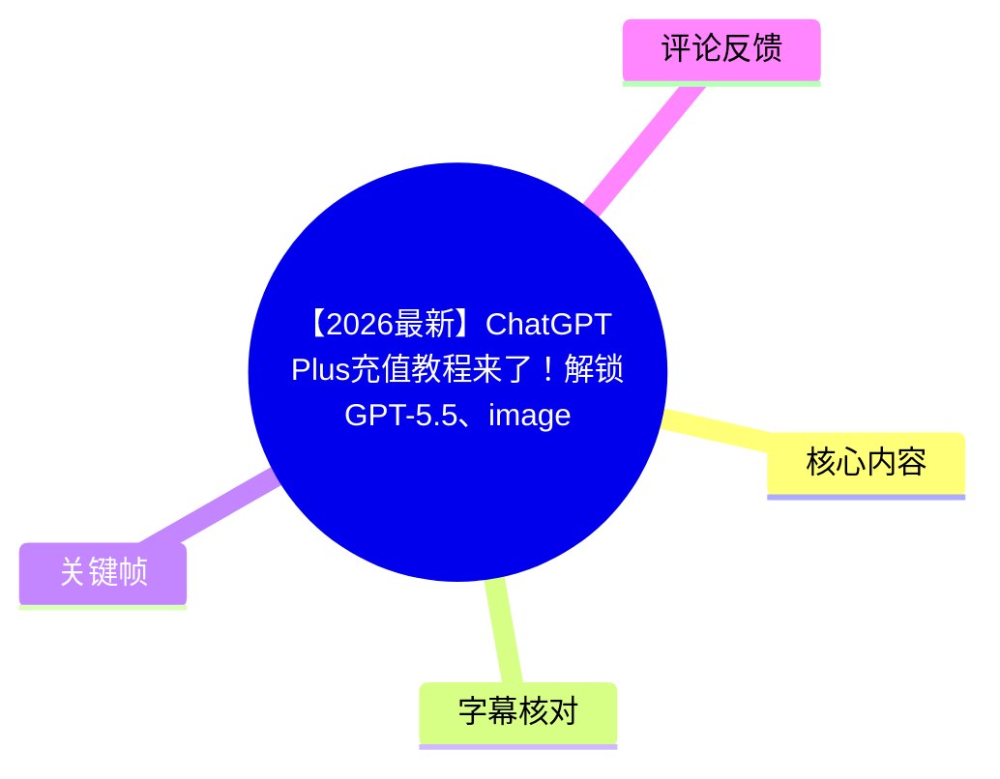
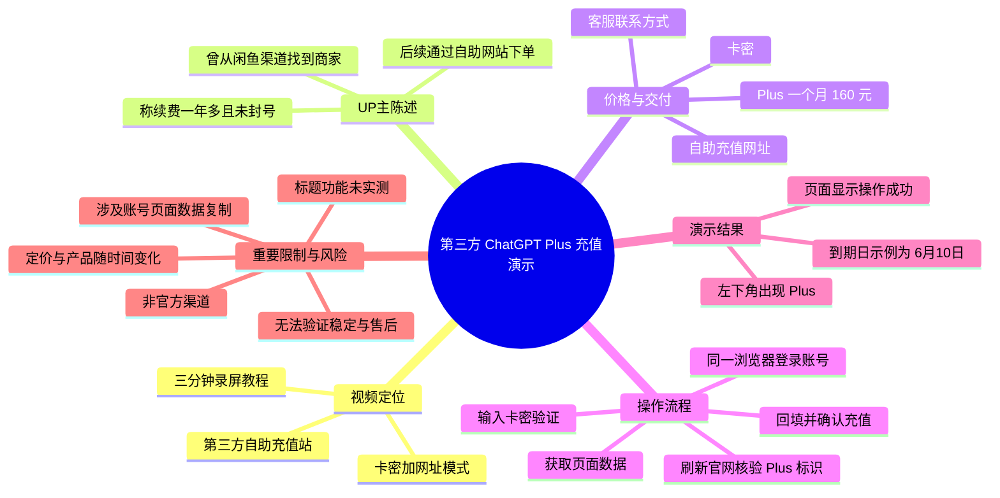
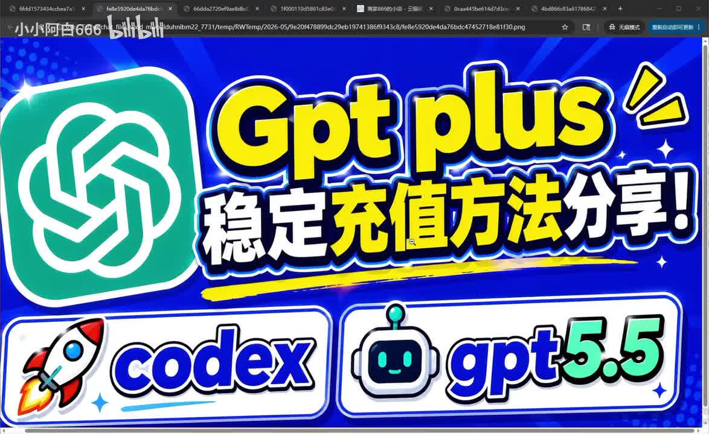
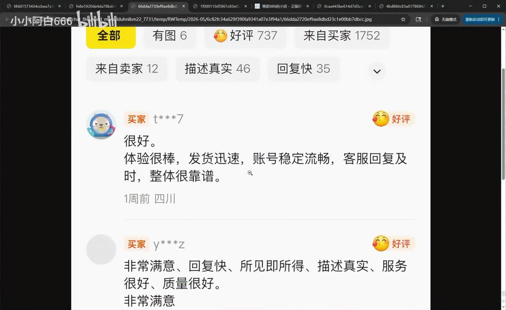
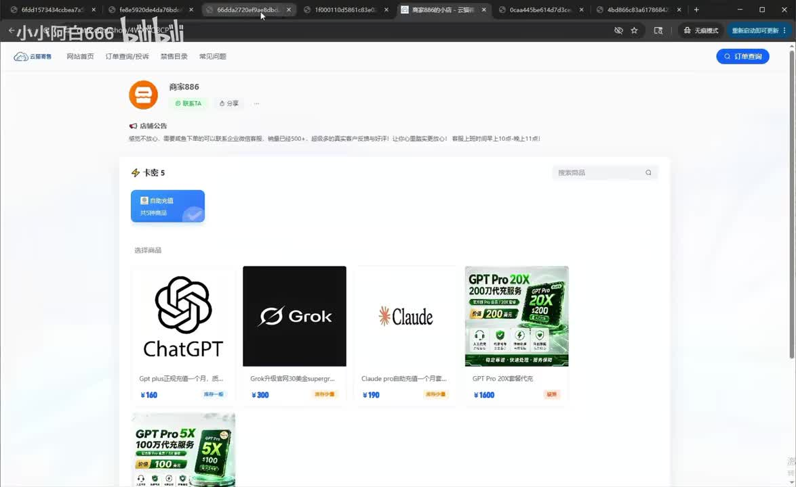
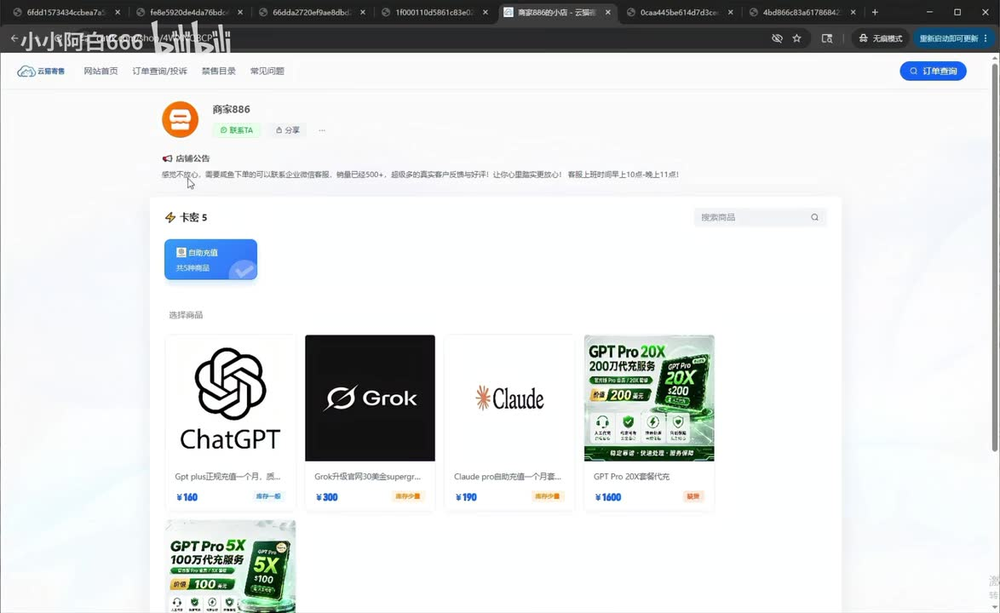

# 【2026最新】ChatGPT Plus充值教程来了！解锁GPT-5.5、image-2、Codex，全程录屏教学 gptpro如何充值3分钟学会

> 来源：[Bilibili 视频](https://www.bilibili.com/video/BV179VN6UEDF) 
> UP 主：小小阿白666｜视频时长：03:05｜分类：AIcode 
> 视频简介中给出了一个第三方网站地址；该地址并非 OpenAI 官方支付页面。

## 小结

视频展示的是一种**经由第三方自助充值站购买卡密，再为 ChatGPT 账号开通 Plus 的流程**。UP 主称该渠道来自闲鱼商家，后来改为在商家自助网站下单；下单后会收到卡密、自助充值网址和客服联系方式。

视频给出的价格信息为：ChatGPT Plus “充值一个月”价格为 **160 元**，并宣称“稳定质保一个月、包售后”。这是视频内商家的销售口径，不是 OpenAI 官方定价，也没有独立证据能够验证“稳定”“不封号”或售后承诺。

操作重点在于：在第三方页面验证卡密后，用户需在**同一浏览器**登录自己的 ChatGPT 账号，获取网页跳转后的页面数据，并将“页面里的内容全部复制”回填至第三方充值页，最后确认充值。该步骤涉及账号会话与页面数据，具有显著的账号接管、会话泄露、违反平台条款或资金损失风险；视频没有说明数据的具体内容、传输范围、第三方处理方式或官方授权关系。

UP 主以浏览器左下角出现 “PLUS” 标识、账户设置页显示到期日为 6 月 10 日为例，说明其账号已开通一个月。该演示只能证明视频录制时该页面的显示结果，不能据此证明该渠道的长期安全性、适用性或官方合规性。

标题提到 “GPT-5.5、image-2、Codex”，但 ASR 与所给关键帧中**未见对这些具体功能的实测、版本说明、能力边界或开通条件演示**。应将其视为标题宣传信息，不能据此确认 Plus 必然包含这些能力。

适合阅读者：希望理解视频所述第三方充值流程及其风险点的用户。若只是需要订阅服务，应优先核验官方支持地区、官方订阅页、账户条款与支付方式；不要向不明第三方提交密码、验证码、Cookie、会话令牌或完整跳转页数据。

## 思维导图

## 目录

- [背景、渠道与价格口径](#背景渠道与价格口径)
- [自助充值操作演示](#自助充值操作演示)
- [到账核验与产品扩展说法](#到账核验与产品扩展说法)
- [风险、限制与时效性](#风险限制与时效性)
- [字幕比对](#字幕比对)
- [评论分析](#评论分析)
- [处理记录](#处理记录)

## 背景、渠道与价格口径 [00:00](https://www.bilibili.com/video/BV179VN6UEDF?t=0)

### 视频的渠道来源与可靠性主张 [00:00](https://www.bilibili.com/video/BV179VN6UEDF?t=0)

UP 主开场称将介绍“充值 GP PLUS”的方法，强调全程约三分钟。ASR 中的 “GP PLUS” 结合标题和画面语境校正为 **ChatGPT Plus**；这是 ASR 对英文产品名的常见误识别，并非视频另有“GP”产品。

其渠道说明可归纳为：

1. UP 主称自己先前在闲鱼上发现该商家；
2. 其选择依据是商家“好评销量非常高”，并称“感觉比较靠谱”；
3. UP 主称下单后又陆续续费了一年多；
4. UP 主进一步声称该渠道“稳定安全”“从来没有封过号”；
5. 当前则推荐通过商家的自助充值网址下单，理由是可自动发货；
6. 若要通过闲鱼下单，视频称可在第三方网站内联系其客服索要闲鱼链接。

上述内容均为**UP 主个人经验与商家宣传的转述**。视频没有提供可供独立复核的订单记录、官方授权信息、服务条款、资金托管机制、账号异常处理协议或长期样本数据。因此，不能将“未封号”“稳定安全”等陈述视作已经验证的事实。

> 图：该画面直接呈现视频的核心宣传语和标题中的能力关键词。它有助于识别本视频的营销定位，但不构成对 GPT-5.5、Codex 或其他功能可用性的技术证明。

### 商家页面、评价与价格 [00:24](https://www.bilibili.com/video/BV179VN6UEDF?t=24)

UP 主在 00:24—01:07 的语音中给出以下交易信息：

| 项目 | 视频内说法 | 证据性质与注意点 |
| --- | --- | --- |
| 下单入口 | 第三方自助充值网址；视频简介也提供了网址 | 非官方页面，需自行核验域名、主体和隐私政策。 |
| ChatGPT Plus 价格 | 一个月 160 元 | 为视频录制时商家报价，不等于官方价格或未来价格。 |
| 服务承诺 | “稳定质保一个月、包售后” | 商家承诺，视频未展示具体售后条款。 |
| 下单交付 | 卡密、自助充值网址、专属客服微信 | 表明这不是用户直接在官方账户内完成的标准订阅流程。 |
| 长期使用 | 建议长期续费者添加客服 | 会增加对单一第三方渠道及客服的依赖。 |

画面中出现商家评价列表，并可见“好评 737”等页面数字以及若干买家评价内容。评价可以反映该页面展示的反馈数量，但视频没有展示评价平台的完整身份验证、差评情况、时间分布或与 ChatGPT Plus 商品对应关系，不能仅凭该截图推断服务可靠性。

> 图：该关键帧对应 UP 主以高好评和销量作为选购依据的论述，能帮助区分“页面展示的评价”与“独立验证后的可靠性结论”。

随后展示的第三方商品页可见 ChatGPT、Grok、Claude、GPT Pro 等商品卡片；其中 ChatGPT 商品卡显示 **¥160**，与口述的 Plus 一个月价格一致。该画面说明该站同时销售多个第三方 AI 服务相关商品，但不说明这些服务与各厂商之间的授权关系。

> 图：商品列表是核对视频所述“卡密＋网址”销售模式和 ¥160 标价的重要视觉依据；同时也表明交易发生在第三方聚合商店而非 ChatGPT 官方订阅界面。

## 自助充值操作演示 [01:09](https://www.bilibili.com/video/BV179VN6UEDF?t=69)

### 视频展示的实际步骤 [01:09](https://www.bilibili.com/video/BV179VN6UEDF?t=69)

以下为视频中按顺序出现的操作，不代表推荐做法：

1. **获得交付信息**：完成下单后，取得第三方网站地址和卡密。
2. **打开第三方充值页**：UP 主称手机浏览器、电脑浏览器均可使用。
3. **输入卡密并验证**：在页面中填入卡密，点击“立即验证”。
4. **提交充值信息**：页面要求提交充值信息；UP 主点击“登录账号”与“前往登录”。
5. **在同一浏览器登录 ChatGPT**：若尚未登录，视频要求在同一浏览器中登录自己的 ChatGPT 账号；若已经登录，则点击类似“已登录获取数据”的按钮。
6. **复制跳转页面内容**：视频称跳转后要将“这个页面里面的给它全部复制下来”，再粘贴回第三方页面。
7. **开始并确认充值**：点击“开始充值”，在弹窗中确认是自己的账号后，点击“确认充值”。

ASR 在此处存在多处汉字误识别，例如“同一流量性”“获得数损”等；结合连续语义，较可靠的整理为“同一浏览器登录账号”“获取数据”。但是，视频没有清楚解释所谓“数据”的技术含义，也没有展示其字段边界，因此不能据此断言它只包含何种信息。

### 关键安全边界：不要轻率复制账号页面数据 [01:24](https://www.bilibili.com/video/BV179VN6UEDF?t=84)

本段最值得注意的不是按钮名称，而是视频要求将登录后的跳转页面内容“全部复制”至第三方站点。此类信息可能包含账户标识、临时授权参数、会话相关数据或其他可用于访问账号的内容；仅凭视频无法确认实际包含哪些字段。

因此，应至少把握以下边界：

- **不要向第三方提供密码、短信验证码、邮箱验证码、身份验证器代码或恢复码。**
- 不要复制或上传浏览器 Cookie、访问令牌、请求头、完整网页源代码、跳转链接参数或开发者工具中的网络数据。
- 即使页面显示“已登录”，也不应假定第三方获取数据的方式得到官方授权。
- 如已执行过类似操作，应及时检查账户会话、已登录设备、订阅状态、付款记录和安全设置；若发现异常，应通过官方账户支持渠道处理。
- 视频未展示第三方网站如何保存、使用或删除这些数据，也未说明充值失败、退款、续费争议或账号受限时的责任划分。

这里的风险提示是根据视频所示“登录—获取数据—复制全部页面内容—回填第三方”流程作出的审慎判断，不等同于对该网站实际行为的技术取证结论。

## 到账核验与产品扩展说法 [01:59](https://www.bilibili.com/video/BV179VN6UEDF?t=119)

### 视频中的到账判断方法 [01:59](https://www.bilibili.com/video/BV179VN6UEDF?t=119)

在约 9.67 秒的无语音间隔后，UP 主表示第三方页面显示“操作成功，GPT 账号已经激活”。其随后回到 ChatGPT 官网并刷新页面，以两个现象判断到账：

1. 页面左下角出现 **PLUS** 标识；
2. 在头像—设置—账户位置查看到订阅到期日期。

视频内的日期示例为：当天是 **5 月 10 日**，页面显示 **6 月 10 日到期**，UP 主据此称正好开通一个月。

这是一种针对视频演示账号的表面核验方式。它能够确认当时页面呈现的账户状态，却无法回答以下问题：订阅来源是否合法、是否会被撤销、续费是否自动、能否退款、是否存在地区或账户限制，以及第三方是否保留了用户会话信息。

### Plus、Pro 与其他商品的说法 [02:23](https://www.bilibili.com/video/BV179VN6UEDF?t=143)

视频尾段继续推广第三方商店的其他商品：

- 若 Plus 不够使用，可升级 “GPT Pro”；
- 语音称有 “100 美金、200 美金一个月”的选项；
- 商店中还有 Grok、Claude，以及 ASR 识别为“谷歌的 Jimny”的商品；结合上下文，该词更可能是 **Gemini**，但视频未展示足以完全确认的清晰文字；
- UP 主称这些服务也可自助下单，形式同样是“卡密加网址”；
- 有问题可通过页面中的企业客服微信咨询。

需要特别区分：

- **视频确实展示/口述的内容**：第三方商店销售多类 AI 服务商品，并使用卡密与网址模式。
- **不能由视频推出的内容**：这些商品由各服务官方授权、所有套餐均可稳定开通、任何地区和账户均可使用，或其功能等同于官方订阅。
- **标题未被正文验证的内容**：标题中的 GPT-5.5、image-2、Codex 没有对应功能展示、版本页、模型选择页或官方说明；不能将其认定为视频已实测的 Plus 权益。

> 图：该画面支持视频后段“还有其他 AI 服务商品”的表述，也提示读者该流程是第三方店铺的统一销售模式，而非单一 ChatGPT 官方订阅教程。

## 风险、限制与时效性 [02:47](https://www.bilibili.com/video/BV179VN6UEDF?t=167)

### 适用限制

视频未说明以下关键前提，因而无法据此判断流程是否适用于特定用户：

- ChatGPT 账户所属地区、注册方式及当前订阅状态；
- 是否允许已有订阅、团队/企业账户或受限账户使用；
- 账户是否需要绑定特定支付资料；
- 卡密失效、支付失败、重复充值、套餐冲突时的处理规则；
- 第三方服务的退款机制、客服响应标准和隐私数据保留期限；
- 该方式是否符合 ChatGPT/OpenAI 的最新条款及账户安全要求。

### 时效性判断

本视频时长 185 秒，元数据发布时间为 2026 年 5 月；抓取时间为 2026 年 7 月。视频中“160 元/月”、示例到期日期、商品库存、页面入口、客服入口及可充值的产品类别均可能随时变化。

此外，订阅套餐、模型命名、价格、地区支持与功能开放状态会由服务提供方调整。尤其是标题中的“GPT-5.5”“image-2”等名称，视频素材未提供官方公告或产品页佐证，不能作为当前可用功能清单。

### 可迁移的经验

从视频本身能抽取的、相对中性的经验只有两点：

1. 对订阅是否生效，应查看账户内明确的套餐标识和到期信息，而不是只以第三方页面“成功”提示作为依据。
2. 对涉及账号登录与外部网站数据提交的流程，应优先明确数据类型、授权范围和撤销方式；无法明确时，保守做法是不要继续提交。

但这两点不改变本视频渠道属于第三方、且存在会话数据暴露风险的事实。

## 字幕比对

| 字幕来源 | 完整性 | 专有名词 | 时间轴 | 主要问题 |
| --- | --- | --- | --- | --- |
| Bilibili 站内字幕 | 未提供可用字幕，无法比较文本内容 | 无法评估 | 无法评估 | 素材明确标注“未提供可用站内字幕”。 |
| 本次 ASR 字幕 | 较完整：9 段、语音覆盖约 168.59 秒，占视频约 91.62% | 存在明显误识别 | 可用：含 SRT 精确起止时间 | “GP PLUS”“网纸”“罐子”“Jimny”等词存在识别偏差；01:49.520—01:59.190 有约 9.67 秒无语音间隔。 |

最终采用**本次 ASR 的 SRT 时间轴**作为章节定位依据，因为站内无可用字幕。ASR 使用 `medium` 模型识别中文，语言置信度约为 `0.9971`，带有时间戳；诊断中**没有** `noAudioStream=true` 标记，且音频语音覆盖率较高，因此该视频并非无音轨素材。

结合标题、上下文与关键帧，对以下词语作了谨慎校正或标注：

| ASR 原文/近似词 | 整理后的表达 | 校正依据 |
| --- | --- | --- |
| GP PLUS | ChatGPT Plus | 标题、画面中的 ChatGPT 标志与全程语境。 |
| 网纸、罐子 | 网址 | 上下文为“自助充值网址”“视频简介”。 |
| 闲鱼 | 闲鱼 | ASR 基本可辨，语义与商家来源说明一致。 |
| 同一流量性 | 同一浏览器 | 前后文均为浏览器登录与获取数据流程。 |
| Jimny | Gemini（存疑） | 语义上与“谷歌的”相连，但所给材料没有足够清晰的文字特写，因此保留存疑。 |
| HRAMS 到期日期 | 账户内的到期日期 | 该处 ASR 失真较严重；根据上下文仅作功能性概括，不扩展具体菜单名。 |

## 评论分析

本次仅获取到 2 条热评，少于“热评前三条”的上限；以下仅分析可获得内容，不将评论视为已验证事实。

1. **“稳着用AI”｜获赞 2**  
   评论称“B站算法推流有问题。说真话，靠谱的反而不推。”其关注点是平台推荐机制，而不是视频所示充值方法本身。该评论没有提供交易经历、渠道核验材料或安全信息，不能用于支持第三方服务可靠性。

2. **“金铂中心”｜获赞 2**  
   评论讨论 AI 在各类实验室、范式设计和工程发展中的广泛潜力，属于对 AI 宏观发展的表达，与本视频的 ChatGPT Plus 充值流程、价格、账号安全或渠道评价没有直接关联，也未提供可用于核验的视频补充信息。

3. **第三条热评**  
   素材未提供，无法分析。

## 处理记录

- Worker ID：`worker-mrj0www4-e8d79408`
- 生成模型：`gpt-5.6-terra`
- 调用工具与模型：素材编排系统提供的视频元数据、音频提取结果、关键帧、ASR 结果、SRT 时间轴与热评数据；ASR 模型为 `medium`，设备为 `cuda`，计算类型为 `float16`。
- 使用的应用工具：视频素材清单解析、ASR 时间轴读取、关键帧多模态核对、元数据读取、评论 JSON 读取。
- 字幕选择：站内字幕未提供可用内容；检查本次 ASR 后，采用 `asr/transcript.srt` 的 9 个带时间戳分段作为时间轴依据，并对明显专名误识别进行上下文校正或保留存疑。
- 关键帧选择依据：选取 `frames/frame-001.jpg` 说明标题宣传主题；`frames/frame-002.jpg` 对应商家好评展示；`frames/frame-003.jpg` 与 `frames/frame-004.jpg` 对应第三方商品目录及 ¥160 标价、多服务销售模式。图片仅用于支持可见页面信息，不用于证明商家安全性或官方授权。
- 缓存清理：素材中未提供缓存清理执行记录；为避免编造，无法确认是否完成缓存清理。
- 未解决问题：
  - 无可用站内字幕，无法进行逐句交叉验证；
  - 视频未展示第三方页面提交数据的具体字段，无法判断其是否包含会话或授权敏感信息；
  - 无法根据视频确认商家资质、官方授权、服务条款、退款机制与长期稳定性；
  - 标题所称 GPT-5.5、image-2、Codex 未在正文中实测或举证；
  - 热评仅获取 2 条。
