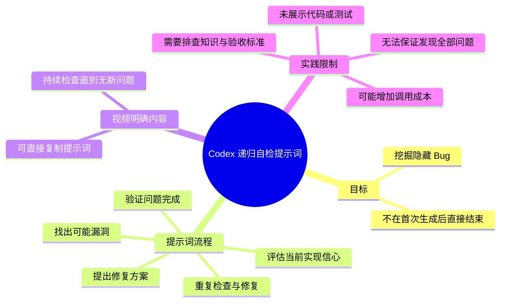

# Codex 有个特别有意思的提示词。很多隐藏 Bug，就是这么被挖出来的。

> 来源：[Bilibili 视频](https://www.bilibili.com/video/BV1mEKB6KE4o)  
> UP 主：AI元博士｜发布时间：2026-07-19｜视频时长：12 秒｜合集：AIcode  
> 视频为 1080 × 1440 的竖版短视频。

## 小结

视频以一张静态文字卡片介绍一个面向 AI 编程助手的“递归自检”提示词：要求模型先判断自己是否对当前实现“100% 有信心”；若没有，就找出所有可能漏洞、提出修复方案，并重复检查与修复过程，直到“所有问题都验证完成”。

核心思想不是让 AI 在第一次生成代码后直接宣布完成，而是通过连续的“怀疑—排查—修复—再验证”循环，主动暴露隐藏 Bug。视频标题和画面均将该方法与 Codex 关联，且元数据描述进一步称，Codex 会继续检查、继续修复，直到找不到新的问题。

该内容适合把 AI 用于代码实现、代码审查或缺陷排查的开发者参考。它提供的是一个提示词策略，而非已展示的实际代码案例、测试过程或缺陷修复结果；因此，不能据此推断该提示词能够穷尽所有漏洞，或保证代码正确。

视频未展示项目语言、运行环境、测试命令、漏洞分类、验收标准、上下文长度、调用成本与最大循环次数等技术参数。热评也指出：如果没有明确排查方法与设计知识，模型可能停留在表面症状并堆叠兜底逻辑；反复自检还可能增加推理或调用成本。

该视频发布于 2026-07-19。提示词文本是视频内的明确内容，但 Codex 的实际产品能力、模型版本、可用上下文、定价和行为会随产品迭代变化，使用时应以当前工具版本及实际测试结果为准。

## 思维导图

## 目录

- [视频内容与问题背景](#视频内容与问题背景)
- [核心提示词：递归式漏洞排查](#核心提示词递归式漏洞排查)
- [可迁移的实践流程](#可迁移的实践流程)
- [技术限制与时效性](#技术限制与时效性)
- [关键帧说明](#关键帧说明)
- [字幕比对](#字幕比对)
- [评论分析](#评论分析)
- [处理记录](#处理记录)

## [视频内容与问题背景](https://www.bilibili.com/video/BV1mEKB6KE4o?t=0)

视频全长仅 12 秒，给出的关键帧画面均为同一张以青绿色背景衬托的黑色消息卡片。卡片正文直接说明：Codex 有一个“特别有意思的提示词”，并称“很多隐藏 Bug，就是这么被挖出来的”。

画面并未录制 Codex 的实际操作界面，也没有展示代码、报错、测试用例、终端输出或修复前后对比。因此，本视频的知识载体是**画面中展示的提示词文本**，不是一个可复现的工程演示。

视频所指向的问题是：AI 编程助手在完成一轮代码生成后，可能过早地给出“完成了”的结论。视频倡议以一个追问式指令改变这一行为，让模型继续审视实现中尚未被发现的风险。

> 图：该关键帧完整呈现视频的标题、可复制提示词和“持续检查”的结论。由于视频素材中未提供代码演示，这张卡片是核对原始方法文本的主要依据。

## [核心提示词：递归式漏洞排查](https://www.bilibili.com/video/BV1mEKB6KE4o?t=0)

画面中给出的可复制提示词如下：

> 你对当前实现 100% 有信心吗？如果没有，请找出所有可能的漏洞，提出修复方案，然后重复这个过程，直到所有问题都验证完成。

元数据描述与画面下方文字补充的意图是：很多 AI 写完代码就说“完成了”；应继续怀疑自己、继续检查、继续修复，直到找不到新的问题为止。

### 提示词的步骤拆解

1. **要求模型评估当前实现的信心**  
   提示词以“100% 有信心吗？”开场，意在阻止模型直接以完成状态收尾，并使其重新审视自身刚生成或修改的实现。

2. **寻找可能漏洞**  
   当模型不能确认“100% 有信心”时，要求其找出“所有可能的漏洞”。视频没有定义“漏洞”的具体范围；在实际工程中，这可能涉及逻辑错误、边界条件、异常处理、权限控制、数据一致性、并发、性能或兼容性等不同方向，但这些分类并非视频逐项列出。

3. **提出修复方案**  
   视频要求模型对所识别问题给出修复方案。画面未要求必须直接改代码，也未规定输出格式、变更范围或是否需附带测试。

4. **重复循环**  
   修复后不立即结束，而是把“检查—发现问题—提出修复”再次执行。这里的“重复”是该提示词最关键的设计：将一次性生成转为多轮自检。

5. **以验证完成作为停止条件**  
   原文的停止表达是“直到所有问题都验证完成”，画面另写“直到找不到新的问题为止”。两者都强调不应只提出修复建议，还应进行验证；但视频没有给出“验证完成”的可操作定义或判定工具。

### 视频中可确认与不可确认的边界

| 项目 | 可由视频画面或元数据确认 | 视频未提供的信息 |
| --- | --- | --- |
| 提示词原文 | 已展示，可直接复制 | 无 |
| 目标 | 挖掘隐藏 Bug、持续自检 | Bug 发现率或正确率 |
| 执行方式 | 反复找问题、修复、验证 | 最大轮数、停止阈值 |
| 工具关联 | 标题与画面提到 Codex | 具体 Codex 版本、模型配置 |
| 工程验证 | 提示词要求“验证完成” | 测试框架、命令、测试结果 |
| 成本与性能 | 未说明 | token 消耗、耗时、调用费用 |

## [可迁移的实践流程](https://www.bilibili.com/video/BV1mEKB6KE4o?t=0)

视频没有提供命令、代码或工具参数，以下流程是对其明确提示词结构的整理，旨在帮助理解其使用顺序；其中的工程化补充应视为实践建议，而不是视频已展示的操作结果。

### 1. 先提供待审查对象

将“当前实现”明确交给模型，例如某段代码、一次提交的 diff、接口契约、错误日志或测试失败信息。视频本身没有说明输入范围；若范围不清晰，模型对“当前实现”的理解也会不稳定。

### 2. 使用视频原文发起自检

可直接使用视频给出的文本：

> 你对当前实现 100% 有信心吗？如果没有，请找出所有可能的漏洞，提出修复方案，然后重复这个过程，直到所有问题都验证完成。

为了避免把模型的主观自信当作证据，实际使用时应关注其列出的具体风险、修复内容与验证依据，而不是只看“有信心”或“完成”的结论。

### 3. 将“验证”落实为可检查的证据

视频要求验证，但没有规定验证方法。工程实践中，至少应要求模型说明：

- 每个问题对应的触发条件；
- 修复影响的文件或逻辑；
- 修复后应覆盖的正向、反向和边界场景；
- 是否存在尚未验证的假设；
- 哪些结论只能通过真实运行、测试或人工审查确认。

这些补充能把“继续检查”从泛泛追问转化为可复核的工作项，但它们属于对视频方法的工程化扩展。

### 4. 设置人为停止与审查机制

视频的停止描述是“所有问题都验证完成”或“找不到新的问题”。在真实系统中，“找不到新问题”不等于“没有问题”，而无限循环也可能导致成本失控。应由开发者设置外部边界，例如限定审查轮次、限定代码范围、要求每轮输出新增发现，并在关键修改后执行独立测试或人工复核。

> 图：该帧再次清晰呈现“然后重复这个过程，直到所有问题都验证完成”以及“会继续检查，直到找不到新的问题为止”的文字。它说明视频方法的重点是循环式复查，而不是单轮回答。

## [技术限制与时效性](https://www.bilibili.com/video/BV1mEKB6KE4o?t=0)

### 方法边界

- **没有全覆盖保证**：提示词要求“找出所有可能的漏洞”，但视频没有提供证明表明模型能发现全部问题。模型遗漏问题、误判问题或编造风险仍然可能发生。
- **“100% 有信心”是引导语，不是质量度量**：模型表述的信心不能替代自动化测试、静态分析、集成测试、安全审计或线上观测。
- **验证标准不明确**：视频使用“验证完成”作为结束条件，却未说明测试环境、验收标准或证据类型。若没有外部标准，模型可能自行宣布验证完成。
- **没有展示修复质量**：素材没有任何代码修复案例，无法判断模型会做最小化修复、正确重构，还是引入回归。
- **存在成本风险**：每增加一轮“继续检查”都可能增加上下文长度、推理时间和调用成本。热评中“20x pro都不够你烧的”是对成本的调侃，不能当作量化结论，但指出了反复调用的现实顾虑。
- **需要人的工程判断**：评论区提出，缺少排查思路或合适设计模式时，模型可能只识别表面现象并加入大量兜底逻辑。这是评论者观点，未被视频实证，但与提示词缺少领域约束的局限相一致。

### 时效性

视频发布日期为 2026-07-19，素材中将方法指向 Codex。视频并未给出 Codex 的版本号、产品界面、模型名称、系统提示词、上下文窗口或资费信息，因此不能从本视频推导当前版本行为。未来使用时，应重新确认：

1. Codex 或所选 AI 编程工具是否支持所需的多轮上下文；
2. 工具当前的模型能力、调用限制与费用；
3. 团队是否有可执行的测试、代码审查和回滚机制；
4. 涉及敏感代码时，是否符合数据权限与安全规范。

## [关键帧说明](https://www.bilibili.com/video/BV1mEKB6KE4o?t=0)

给定素材列出 `frame-001.jpg` 至 `frame-012.jpg` 共 12 张关键帧。所提供的画面预览显示为同一静态文字卡片，未见随时间变化的代码界面、演示步骤或额外参数。

| 关键帧 | 正文用途 | 选择价值 |
| --- | --- | --- |
| `frames/frame-001.jpg` | 核对标题、提示词原文与主题 | 画面完整且文字清楚，是提取原始方法的直接证据。 |
| `frames/frame-012.jpg` | 说明循环检查与停止条件 | 清晰保留“重复这个过程”“验证完成”“找不到新的问题为止”等核心句。 |

由于这些画面没有显示执行过程，关键帧只能支持“视频展示了什么文字”，不能支持“该提示词已经在某个项目中挖出某个特定 Bug”之类的进一步结论。

## [字幕比对](https://www.bilibili.com/video/BV1mEKB6KE4o?t=0)

| 字幕来源 | 完整性 | 专有名词 | 时间轴 | 主要问题 |
| --- | --- | --- | --- | --- |
| Bilibili 站内字幕 | 不可用 | 无法核对 | 无可用 SRT 分段 | 素材明确说明“未提供可用站内字幕”。 |
| 本次 ASR 字幕 | 为空 | 未识别 | ASR 虽标记 `asrHasTimestamps=true`，但无任何分段 | `large-v3-turbo` 自动判定语言为英语（概率约 0.6006），识别结果 `segments` 为空；诊断显示语音时长为 0 秒、覆盖率为 0。 |

本次 ASR 已检查，结果为空。诊断警告为“未识别到语音分段，请确认源文件是否含有可听语音并使用正确音轨重试”。该诊断**没有**标记 `noAudioStream=true`，因此不能据此断言源视频没有音轨；只能如实记录为：当前 ASR 未识别出可用语音内容。

最终未采用站内字幕或 ASR 文本，而是依据以下可见画面文字和视频元数据描述整理：

- 专有名词：`Codex`；
- 技术词：`Bug`；
- 提示词中的“100% 有信心”“所有可能的漏洞”“修复方案”“重复这个过程”“验证完成”；
- 画面补充结论：“会继续检查，直到找不到新的问题为止”。

所有正文时间轴均链接至 `t=0`：素材未提供可用站内 SRT，也没有 ASR 的起止分段；且已提供关键帧所示内容为贯穿视频的静态文字卡片，无法从文字顺序推测更细粒度的真实出现时间。

## [评论分析](https://www.bilibili.com/video/BV1mEKB6KE4o?t=0)

以下仅处理可获取热评前三条。评论是用户观点，不构成对视频方法有效性的验证。

1. **ZzzZ_Official（32 赞）**：  
   > “20x pro都不够你烧的[笑哭]”  
   这是一条调侃，关注点是反复循环检查可能消耗大量 AI 调用额度或成本。评论未给出价格、轮数、模型或实测数据，因此只能将其视为成本风险提醒，不能量化为实际开销。

2. **python9870（11 赞）**：  
   > “漏洞修好了，功能也不能用了[doge]”  
   评论指出另一类风险：修复 Bug 可能破坏原有功能，即产生回归问题。这与视频未展示测试与验收流程的限制有关；但评论没有列出具体项目或案例，不能作为该提示词必然导致回归的证据。

3. **_凌晨_（5 赞）**：  
   > “没用的，除非你清楚知道要怎么排查，某类问题应该用什么设计模式实现，否则codex只会一直给你找到各种表面现象然后加一堆兜底逻辑”  
   该评论认为单靠泛化追问不足以完成高质量排查：使用者还需了解检查路径与适用设计模式，否则模型可能停留于表面现象，甚至以过多兜底逻辑处理问题。此观点补充了视频未覆盖的前置条件——领域知识、问题分类能力与架构判断——但仍属于个人经验判断，未附可验证示例。

## [处理记录](https://www.bilibili.com/video/BV1mEKB6KE4o?t=0)

- **Worker ID**：`worker-mrj0wbly-5dc4e50c`
- **整理模型**：`gpt-5.6-terra`
- **ASR 模型与运行参数**：`large-v3-turbo`；语言自动检测；检测语言为英语、概率 `0.6005859375`；设备 `cuda`；计算类型 `int8_float16`。
- **使用的素材与工具输出**：视频元数据、封面、`merged.mp4`、`audio/audio.wav`、关键帧目录 `frames/`、ASR 输出目录 `asr/`、评论文件 `comments/comments.json`、字幕目录 `subtitles/`。
- **字幕选择**：站内字幕未提供可用内容；本次 ASR 已检查但无分段、无文本，故不采用任何字幕文本。正文基于关键帧可见文字与视频元数据描述，并明确标记其证据边界。
- **关键帧选择依据**：选择 `frames/frame-001.jpg` 与 `frames/frame-012.jpg`，因为两者清晰展示完整提示词及循环检查结论。提供的画面未显示代码或动态操作，故未将关键帧解释为产品实操证明。
- **时间轴依据**：无站内 SRT 起止时间、无 ASR 识别分段；视频总时长为 11.9815 秒，关键帧内容为静态文字卡片，因此正文时间轴统一锚定真实视频起点 `t=0`，未按文字顺序臆测细分时间。
- **评论范围**：仅使用可获取热评前三条，分别为 32 赞、11 赞和 5 赞的评论。
- **缓存清理**：素材未提供缓存清理执行日志，无法确认是否已清理；不作已清理的声明。
- **未解决问题**：无法从现有素材确认音轨实际内容、ASR 空结果的具体原因、提示词在真实代码库中的效果、循环次数、成本、验证标准，以及 Codex 的具体版本与配置。

## 评论分析

- 热评 1：20x pro都不够你烧的[笑哭]
- 热评 2：漏洞修好了，功能也不能用了[doge]
- 热评 3：没用的，除非你清楚知道要怎么排查，某类问题应该用什么设计模式实现，否则codex只会一直给你找到各种表面现象然后加一堆兜底逻辑

以上内容是观众反馈摘录，只用于补充理解视频反响，不作为正文事实依据。
