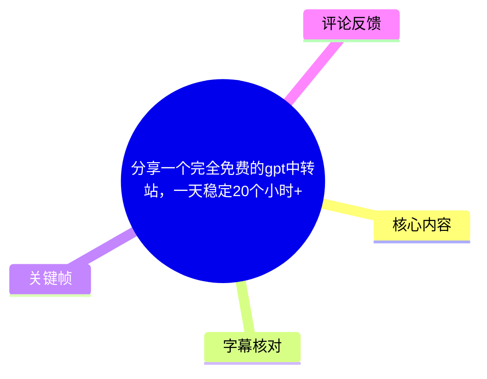
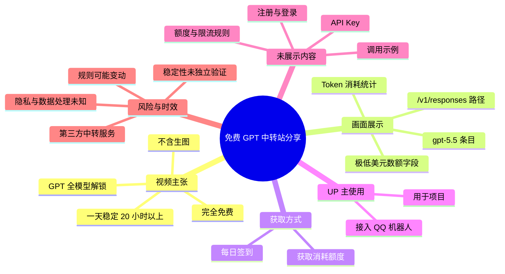
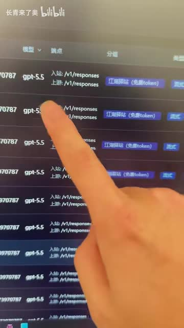
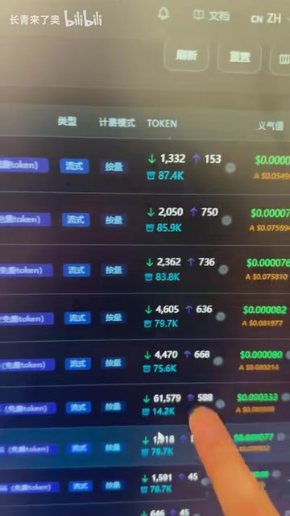
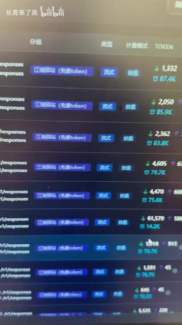
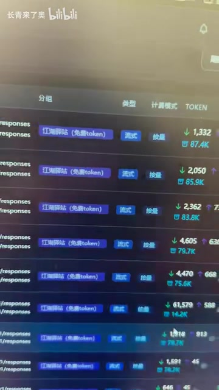

# 分享一个完全免费的gpt中转站，一天稳定20个小时+

> 来源：[Bilibili 视频](https://www.bilibili.com/video/BV18W7D66EVg) 
> UP 主：长青来了奥｜视频时长：36 秒｜合集：AIcode  
> 视频简介给出的地址：`https://api.ranmeng.icu/`

## 小结

视频分享了一个被 UP 主称为“完全免费”的 GPT 中转/API 服务，并在标题中宣称其“一天稳定 20 个小时+”。视频画面主要展示该服务的模型/接口列表、Token 消耗数据，以及以极低美元数额显示的费用或计量字段。

根据视频简介，UP 主称该服务“gpt 全模型解锁，除生图”，并表示自己已将其用于“一点项目”，还接入了 QQ 机器人。视频口述进一步提到可通过“每天签到”获取可消耗的额度；不过，视频没有展示注册、登录、签到入口、API Key 创建、调用代码或实际请求响应过程。

应将“完全免费”“全模型解锁”“稳定 20 小时+”视为 UP 主在标题、简介和口述中的宣传性陈述，而非本材料已经独立验证的服务能力。画面中虽可见类似 `gpt-5.5`、`/v1/responses` 的条目及 Token 统计，但不足以证明模型真实来源、可用范围、长期稳定性、隐私处理方式或价格规则。

该视频发布信息对应 2026 年 6 月，且内容指向第三方中转服务。此类服务的域名可访问性、额度、模型路由、速率限制、签到规则与数据政策均可能随时变化；实际接入前应自行核验服务条款、隐私政策、接口文档与费用页面，避免发送敏感业务数据。

适合希望快速了解第三方 AI 中转服务展示界面、并需要建立风险核验清单的读者；不适合作为可直接投入生产环境的接入教程。

## 思维导图

## 目录

- [背景与信息边界](#背景与信息边界0000)
- [服务主张与画面证据](#服务主张与画面证据0000)
- [Token 与接口列表展示](#token-与接口列表展示0000)
- [可确认的使用步骤](#可确认的使用步骤0000)
- [参数、限制与风险核验](#参数限制与风险核验0000)
- [结论与时效性](#结论与时效性0000)
- [字幕比对](#字幕比对)
- [评论分析](#评论分析)
- [处理记录](#处理记录)

## 背景与信息边界[00:00](https://www.bilibili.com/video/BV18W7D66EVg?t=0)

这是一个时长 36 秒的快速分享视频，而非完整部署或 API 开发教程。ASR 时间轴仅提供一个连续语音段，覆盖 **00:00.000—00:33.230**，因此本笔记仅能把视频主体内容定位到 00:00 开始，不能依据文字出现顺序虚构更细的分段时间。

视频标题为“分享一个完全免费的gpt中转站，一天稳定20个小时+”；简介进一步给出了服务地址，并补充以下原始主张：

- 地址：`https://api.ranmeng.icu/`
- “gpt 全模型解锁除生图”
- UP 主“目前用它做一点项目”
- 已“接入了 qq 机器人”
- 可通过“一键三连”联系 UP 主“领一下”，但“领”的具体对象、方式和条件均未说明。

本视频没有新闻事件、官方公告、版本发布说明或第三方测评材料。因此，不能将其视为某模型厂商或服务商的官方新闻；它本质上是个人对第三方服务的短视频推荐。

## 服务主张与画面证据[00:00](https://www.bilibili.com/video/BV18W7D66EVg?t=0)

### 免费、模型范围与稳定性

视频口述的可辨识信息包括：

1. 分享“一个完全免费的中转站”；
2. 提到 GPT 相关服务；
3. 指向 Token 的消耗；
4. 提到“免费的分组”及其消耗；
5. 称每日签到可以获取某种“消耗”额度；
6. 再次强调“完全免费”。

标题中补充了“一天稳定 20 个小时+”，简介中则称“gpt 全模型解锁除生图”。这些均应明确标记为 **UP 主陈述**：

| 陈述 | 来源 | 材料可支持的程度 |
| --- | --- | --- |
| 服务为“完全免费” | 标题、口述、简介 | 仅能确认 UP 主如此宣传；未见完整计费、额度或条款页面 |
| 一天稳定 20 小时以上 | 标题 | 未提供连续可用性测试、监控记录或时间范围 |
| GPT 全模型解锁 | 简介 | 画面仅能看到部分列表，不能据此确认“全模型” |
| 不支持生图 | 简介 | 视频未展示图像生成页面或报错说明 |
| 每日签到可获得额度 | 口述 | 未展示签到入口、到账量、周期、上限或失效条件 |
| 已用于项目并接入 QQ 机器人 | 简介 | 属于 UP 主使用经验，未展示项目配置或运行结果 |

> 图：关键帧中可见深色后台列表、疑似 `gpt-5.5` 的模型文字，以及多行类似 `/v1/responses` 的接口路径。它能说明视频确实在展示一个 API/中转管理界面，但不能单独证明底层模型、提供方或调用质量。

### 画面中可见的接口线索

关键帧中反复出现类似 `/v1/responses` 的路径。该命名与 OpenAI 风格的 Responses API 路径相近，但视频未展示完整 Base URL、请求头、认证方式、请求体或响应内容。因此可以记录为：

- **画面可见线索**：存在类似 `/v1/responses` 的接口路径；
- **不能确认的内容**：是否完全兼容某一官方 API、是否支持流式响应、工具调用、结构化输出、视觉输入或多轮上下文；
- **实践含义**：若计划接入现有程序，应先以服务实际文档和测试请求为准，不能仅凭路径名称假定兼容性。

## Token 与接口列表展示[00:00](https://www.bilibili.com/video/BV18W7D66EVg?t=0)

视频将镜头对准列表中的 Token 字段与绿色美元数额。画面可辨认出多行数字，例如 `1,332`、`2,050`、`2,362`、`4,605`、`4,470`、`61,579` 等；其旁还出现如 `87.4K`、`85.9K`、`83.8K`、`79.7K`、`75.6K`、`142K` 等计数。由于画面倾斜、清晰度有限且字段说明不完整，不能确定这些数值分别是单次调用 Token、累计 Token、输入/输出 Token，还是其他后台统计指标。

> 图：画面聚焦列表的 `TOKEN` 列及右侧绿色美元数额，手指指向其中一行较高的数值。该图的价值在于保留了视频展示“Token 消耗/费用”主题的直接证据，同时也显示字段标签不足以支持精确计费结论。

画面还可见右侧以 `$0.0000...` 开头的绿色数值。对此应作保守解释：

- 视频确实展示了接近零的美元格式数值；
- 不能据此断言实际调用成本为零；
- 无法确认该数值是单价、单次费用、内部成本、余额扣减、统计展示或测试环境数据；
- 即使某一时段显示为零或极低，也不代表日后仍保持相同规则。

> 图：关键帧展示多行模型/接口记录、分组样式标签和 Token 数字。它有助于理解 UP 主所说的“分组”和“Token 消耗”对应的是后台列表信息，而不是完整的操作流程或文档页面。

## 可确认的使用步骤[00:00](https://www.bilibili.com/video/BV18W7D66EVg?t=0)

视频并未给出可复现的完整教程。以下仅整理素材中可以确认的最小流程，不补造注册、接口参数或代码：

1. **访问视频简介给出的地址**：`https://api.ranmeng.icu/`。  
   视频未展示该地址在记录时是否可访问，也未展示是否需要注册。

2. **查看服务中的模型、接口或 Token 信息**。  
   视频画面中存在模型/路径列表及 Token、金额样式字段；具体菜单路径未展示。

3. **按 UP 主口述进行每日签到**。  
   口述称每日签到可获取可消耗额度，但没有给出签到位置、单日额度、补签规则、有效期、兑换关系或失败处理。

4. **若要用于项目或 QQ 机器人，先完成接口兼容性验证**。  
   UP 主简介称其已用于项目并接入 QQ 机器人，但没有披露所用 SDK、机器人框架、鉴权信息、回调配置或部署环境。因此这一步是其使用结果的描述，不构成可直接复现的技术步骤。

### 视频未提供、接入前必须自行确认的配置项

| 配置或参数 | 视频是否展示 | 结论 |
| --- | --- | --- |
| API Base URL | 仅简介给出站点地址 | 未确认是否即为实际 API Base URL |
| API Key 获取方式 | 否 | 未知 |
| 模型 ID 完整列表 | 否 | 仅画面模糊可见疑似 `gpt-5.5` |
| 认证请求头 | 否 | 未知 |
| 请求格式与必填字段 | 否 | 未知 |
| 上下文窗口/最大输出 | 否 | 未知 |
| RPM、TPM、并发限制 | 否 | 未知 |
| 每日签到额度 | 否 | 未知 |
| 余额清零/过期规则 | 否 | 未知 |
| 错误码、故障转移与服务等级协议 | 否 | 未知 |
| QQ 机器人实现方式 | 否 | 未知 |

## 参数、限制与风险核验[00:00](https://www.bilibili.com/video/BV18W7D66EVg?t=0)

### 已出现的技术名词与参数线索

| 项目 | 素材中的依据 | 可得结论 |
| --- | --- | --- |
| GPT | 视频标题、简介、画面 | 视频主题为 GPT 相关中转服务 |
| `gpt-5.5` | 关键帧可见的疑似模型文本 | 仅能记录为画面显示的条目；不能验证真实模型身份或能力 |
| `/v1/responses` | 关键帧可见路径 | 可能是接口路径；未证实兼容性和调用规范 |
| Token | 口述及画面 `TOKEN` 列 | 服务界面展示了 Token 计量/统计 |
| `$0.0000...` | 画面绿色数值 | 显示极低美元格式数值；字段语义和实际收费未知 |
| 每日签到 | 口述 | UP 主称签到可获得额度；规则未展示 |
| 生图 | 简介“除生图” | UP 主称不包含图像生成功能 |

> 图：该帧同时保留模型/路径列表、分组标签、Token 计数与右侧绿色金额字段，适合作为“视频展示的是后台计量信息，而非完整可验证价格表”的视觉依据。

### 使用第三方中转服务时的限制与风险

以下不是视频已经证实的问题，而是基于其“第三方中转站”定位、且视频未提供相关说明时，应在使用前完成的核验项：

- **隐私与数据安全**：视频没有展示隐私政策、日志保留周期、请求内容是否被记录、是否用于训练、管理员可见范围或数据删除机制。不要提交账号凭据、身份证明、客户数据、源代码、商业机密或未脱敏对话。
- **密钥管理**：如服务提供 API Key，应为不同项目创建独立密钥并设置最小权限；若无法限制权限或撤销密钥，应避免用于高风险环境。
- **模型真实性**：模型名称可能是路由标签而非原厂直连证明。应使用固定测试集验证输出质量、上下文长度、函数/工具调用行为和限流情况。
- **可用性**：标题中“稳定 20 个小时+”没有说明测试周期、地区、请求量、故障标准或余下时段的状态，不能替代监控数据和容灾策略。
- **额度与费用**：即使当前界面显示极低数额或存在免费签到，也需确认超额后的处理、价格调整、封禁条件、退款和余额有效期。
- **合规与授权**：服务是否具备对外转售、代理或路由模型能力的授权，视频未涉及；生产使用者应自行评估所在组织的合规要求。
- **服务连续性**：第三方域名、账号体系、签到活动和模型列表均可能调整或停止。对业务关键路径应准备官方渠道或其他合规供应商作为备用。

## 结论与时效性[00:00](https://www.bilibili.com/video/BV18W7D66EVg?t=0)

视频的核心信息是：UP 主推荐一个地址为 `api.ranmeng.icu` 的第三方 GPT 中转服务，声称可通过每日签到获得使用额度，界面展示了模型/接口记录、Token 统计及低额美元格式数值；简介称其不包含生图，并被 UP 主用于项目和 QQ 机器人。

可迁移的经验不是“直接相信免费中转站”，而是将短视频中的服务推荐拆解为可验证的项目：**接口可用性、模型真实性、额度规则、速率限制、数据处理、账号安全与业务容灾**。在这些内容未被文档、实际测试或正式条款证实前，不应把标题或简介中的承诺等同于稳定的技术保证。

时效性上，本视频元数据对应 2026 年 6 月，服务状态可能已改变。本文不对该域名当前是否可访问、是否仍免费、是否仍提供相同模型或是否仍可签到作出判断。

## 字幕比对

| 字幕来源 | 完整性 | 专有名词 | 时间轴 | 主要问题 |
| --- | --- | --- | --- | --- |
| Bilibili 站内字幕 | 未提供可用字幕 | 无法评估 | 无法使用 | 素材记录显示字幕工具因 `Invalid URL` 退出，未获得站内字幕文本 |
| 本次 ASR 字幕 | 覆盖较高：1 段，约 33.23 秒语音 / 35.11 秒音频 | 识别较差 | 可用：`00:00:00.000—00:00:33.230` | 将“中转站”识别为“中展站”，将 GPT 等词识别为“Gbd”，Token、消耗、分组等部分存在错字和数字噪声 |

本次 ASR 已检查：识别语言为中文，置信概率 `0.99609375`，模型为 `medium`，语音覆盖率为 `0.9463`，无大段静音间隙警告。素材中**没有** `noAudioStream=true` 标记；相反，已提供 `audio/audio.wav` 和带时间戳的 ASR 结果，说明源视频存在可供识别的音轨。

最终采用策略为：以 **ASR 的唯一真实时间段** 作为时间轴依据，以视频标题、简介和关键帧对明显错识别进行有限校正，不凭空补足未展示的操作细节。主要校正如下：

| ASR 原文或问题 | 校正依据 | 本文处理 |
| --- | --- | --- |
| “中展站” | 视频标题中的“中转站” | 记为“中转站” |
| “Gbd” | 标题、简介中的 GPT | 记为“GPT” |
| “消耳”等错字 | 上下文反复提及 Token 消耗 | 仅概括为“消耗额度/Token 消耗”，不推导具体数值 |
| “完全兴奋” | 语义不通，且上下文为免费宣传 | 不作为事实引用，改用标题/简介中的“完全免费”并注明来源 |
| 画面中的模型、路径 | 关键帧能见疑似 `gpt-5.5`、`/v1/responses` | 使用“疑似/类似”表述，不确认真实性与兼容性 |

## 评论分析

仅获取到 2 条热评，少于“热评前三条”的上限；因此只分析可获得的两条，不补造第三条。

1. **用大脑去研究大脑**（9 赞）  
   评论称“有 0.06 倍的 gptpuls 还一直稳，感觉价格都差不多”。其中“gptpuls”的具体含义、比较基准与“0.06 倍”的计量方式均不清楚，可能是在讨论某种价格或倍率。该评论提供了“价格并非绝对为零、且可能与其他服务相近”的个人观感，但没有订单、计费截图、测试条件或时间范围，不能作为价格结论。

2. **武鸣室率阁**（7 赞）  
   评论提出隐私与成本质疑：担心聊天内容被打包出售，并认为中转站存在人力管理成本，因此“怎么可能免费”。这条评论没有提供该站确实出售数据的证据，不能据此指控服务存在数据交易；但其指出了第三方中转服务应重点核验的两项问题——数据处理政策与免费模式的可持续性。该质疑与视频未展示隐私条款、成本来源的事实相互呼应，具有风险提示价值。

## 处理记录

- Worker ID：`worker-mrj0wbly-5dc4e50c`
- 模型：`gpt-5.6-terra`
- ASR 模型与运行参数：`medium` / CUDA / `float16`；识别语言为中文，自动语言检测。
- 使用的素材与工具产物：视频元数据、视频简介、`asr/transcript.srt`、`asr/asr-result.json`、关键帧目录 `frames/`、热评文件 `comments/comments.json`。
- 字幕选择：未获得可用 Bilibili 站内字幕；已检查本次 ASR，采用其唯一的真实 SRT 时间段 `00:00:00,000 --> 00:00:33,230` 作为时间轴基础，并用标题、简介及画面校正明显错词。
- 站内字幕获取情况：素材警告记录为 `subtitles: Tool process exited with code 1`，原因是 `Invalid URL`；因此不存在可供比较的站内字幕文本。
- 关键帧选择依据：选用 `frames/frame-001.jpg` 展示疑似模型与接口路径，`frames/frame-002.jpg` 展示分组和列表，`frames/frame-003.jpg`、`frames/frame-004.jpg` 展示 Token 与美元格式字段；这些帧直接对应视频的主要可见信息。未将关键帧中的模糊文字扩展为未经验证的技术事实。
- 评论处理：按“仅处理可获取热评前三条”执行；实际仅获取 2 条，未虚构缺失评论。
- 缓存清理：提供的素材未包含缓存清理日志或结果，无法确认是否执行清理。
- 未解决问题：服务当前可访问性、注册和 API Key 流程、接口文档、模型真实来源、完整模型列表、签到额度、限流规则、计费规则、隐私政策、日志留存与 QQ 机器人接入方式均未在视频中展示。
