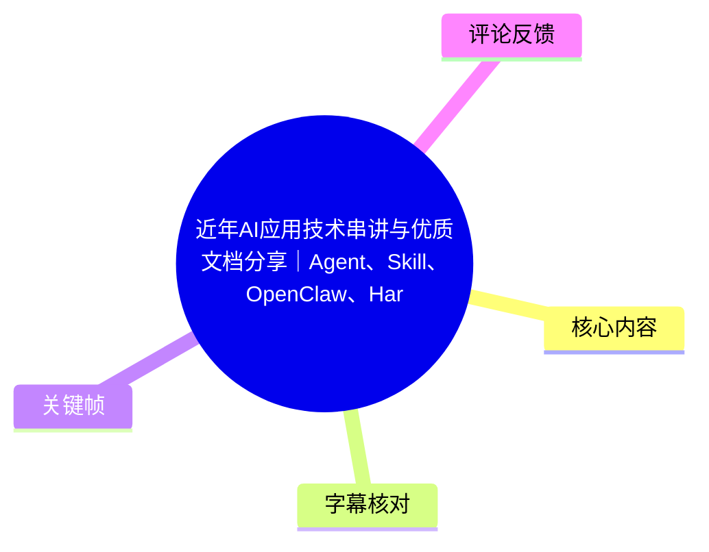
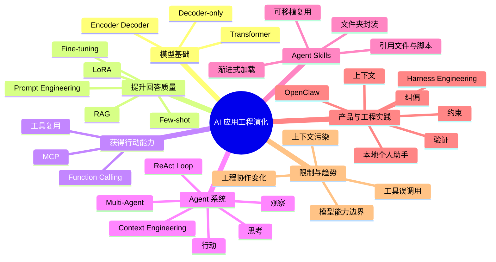
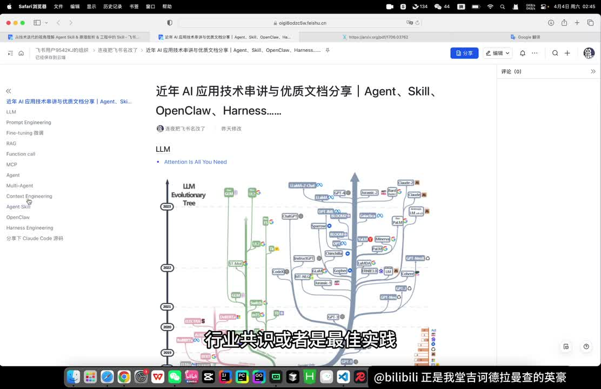
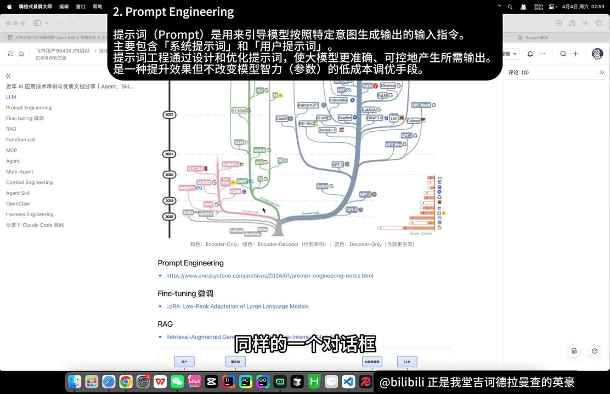
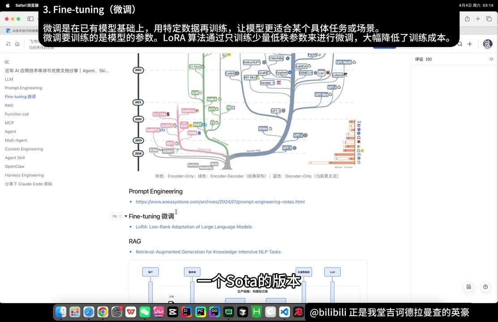
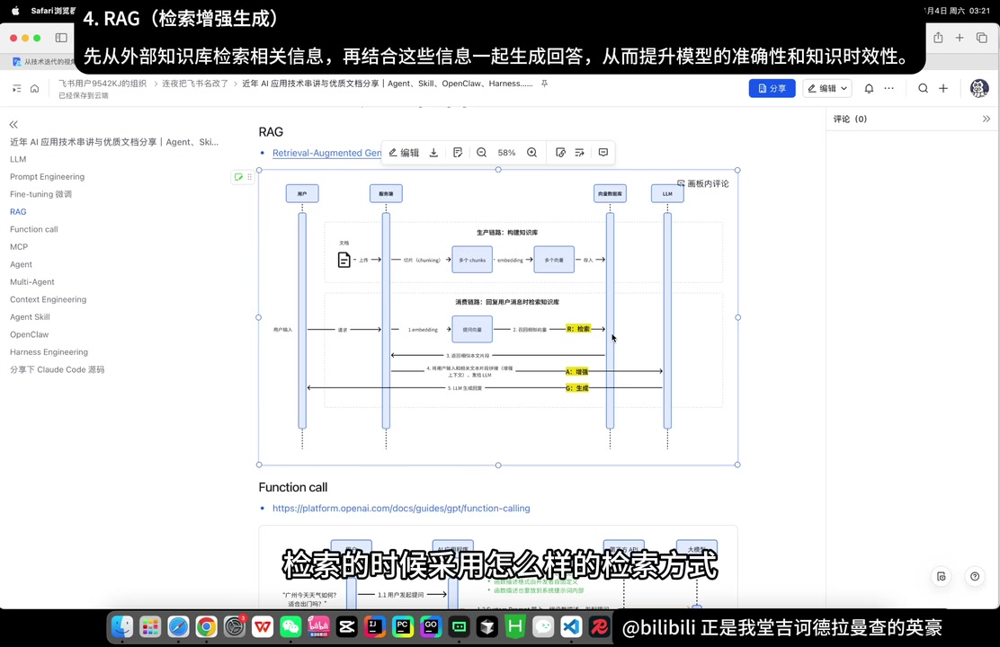

# 近年AI应用技术串讲与优质文档分享｜Agent、Skill、OpenClaw、Harness……

> 来源：[Bilibili 视频](https://www.bilibili.com/video/BV1zSDMBUE5o)  
> UP 主：堂吉诃德拉曼查的英豪｜时长：33:45｜定位：面向工程开发者的 AI 应用技术脉络串讲与文档导读  
> 视频简介提供的文档链接：[飞书知识库](https://oigi8odzc5w.feishu.cn/wiki/WBMfwiNkfi6uNFkRtXdcavDzn0e?from=from_copylink)

## 小结

这期视频以“问题如何推动工程方案演化”为主线，回顾了从 Transformer、聊天机器人和提示词工程，到微调、RAG、Function Calling、MCP、Agent、Multi-Agent、上下文工程、Agent Skills、OpenClaw 与 Harness Engineering 的技术链路。重点不在逐项给出实现代码，而在解释每种方案出现前的痛点、解决了什么、又留下什么限制。

视频的核心工程观点是：模型能力与应用工程相互影响。提示词工程主要优化输入表达；微调通过训练改变模型参数但成本和迭代周期较高；RAG 通过检索私有知识增强上下文，轻量却不直接提升模型本身能力；Function Calling 和 MCP 让模型能间接操作工具；Agent 则将“思考—行动—观察”组成循环，从一次性问答扩展为面向任务的执行过程。

对于 Agent 架构，视频明确反对为复杂而复杂地堆叠 Multi-Agent。应优先判断是否确有上下文污染、可并行任务、工具决策困难等问题；子 Agent 的划分更适合按上下文边界，而不是机械按“写代码、测试、Review”等职能划分，否则协调与交接会消耗大量 token。

视频将 Agent Skills 视为两个问题的回应：一是以文件系统实现按需加载，缓解上下文膨胀；二是把提示词、引用资料、脚本、静态资源等封装为文件夹，提高 Agent 的分发和复用便利性。其介绍以 Claude Code 等本地 Coding Agent 的加载过程为例，强调“先加载名称和描述，匹配后再激活完整 Skill，再按需读取引用文件或执行脚本”的渐进式过程。

在近期工具观察中，UP 主认为 OpenClaw 的出圈重点偏向产品入口、交互与个人助手体验，而非某一项颠覆性底层技术；技术学习上可关注其上下文与记忆管理。对于 Harness Engineering，视频强调人在更强 Agent 时代的职责将转向：约束边界、补足任务上下文、建立验证机制和错误纠偏闭环，而不是逐行指定代码改动。

本视频涉及的 MCP、Agent Skills、OpenClaw、Harness Engineering 均属于快速演进的生态与概念。视频中关于协议时间、产品状态、引用文章案例及项目代码量等，反映的是视频制作时的说法，应在实际选型前回到官方文档、仓库与最新版本核验。

## 思维导图





## 目录

- [技术演化视角与模型基础](#技术演化视角与模型基础)
- [从提示词到微调与 RAG](#从提示词到微调与-rag)
- [Function Calling、MCP 与工具复用](#function-callingmcp-与工具复用)
- [Agent Loop 与 Multi-Agent 的取舍](#agent-loop-与-multi-agent-的取舍)
- [上下文工程：管理而非堆叠信息](#上下文工程管理而非堆叠信息)
- [Agent Skills：渐进加载与可移植封装](#agent-skills渐进加载与可移植封装)
- [OpenClaw：个人 AI 助手的产品入口](#openclaw个人-ai-助手的产品入口)
- [Harness Engineering：为长期运行的 Agent 建护栏](#harness-engineering为长期运行的-agent-建护栏)
- [实践路线、限制与时效性](#实践路线限制与时效性)
- [字幕比对](#字幕比对)
- [评论分析](#评论分析)
- [处理记录](#处理记录)

## [技术演化视角与模型基础](https://www.bilibili.com/video/BV1zSDMBUE5o?t=1)

### [以“前因后果”理解 AI 应用技术](https://www.bilibili.com/video/BV1zSDMBUE5o?t=1)

UP 主开场说明，本期面向工程同学及所有对 AI 感兴趣的观众，集中梳理近年 AI 应用技术中的关键节点，包括 Agent、Agent Skills、OpenClaw 与 Harness Engineering，并同步分享个人认为值得阅读的文档。

其方法论不是追逐名词本身，而是回到技术出现时的约束条件：

1. 当时从业者想完成什么任务；
2. 原有方案遇到了什么问题；
3. 新方案为什么成为标准、协议、共识或实践；
4. 它带来了什么收益，又遗留了哪些新限制；
5. 后续方案如何继续填补这些限制。

视频还强调，工程侧的技术决策会受到模型能力、算法发展与前沿动态影响。例如耗时、效果、上下文容量、工具选择等工程问题，不能完全脱离模型原理理解。



> 图：画面展示飞书文档的目录，包括 LLM、Prompt Engineering、Fine-tuning、RAG、Function Call、MCP、Agent、Multi-Agent、Context Engineering、Agent Skill、OpenClaw、Harness Engineering 等条目，并以模型演化图作为背景。这张图直观说明视频采用的是“技术脉络串讲”而不是孤立介绍单一工具。

### [Transformer、Encoder/Decoder 与 Decoder-only](https://www.bilibili.com/video/BV1zSDMBUE5o?t=121)

视频从 Google 于 2017 年发表的《Attention Is All You Need》讲起，将其定位为大模型时代的重要基础。UP 主指出，该论文提出的 Transformer 架构至今仍是市场上大量模型的基础。

视频对结构作了简化解释：

- **Encoder（编码器）**：类似“阅读者”，将用户输入转换为机器可处理的数学表示。
- **Decoder（解码器）**：类似“写作者”，基于理解生成输出。
- **Decoder-only（仅解码器）**：视频提到 OpenAI 在 2018 年 GPT-1 的方向中采用这一思路，后续大量生成式模型延续了该路线。

这里的解释用于建立应用工程的前置背景：后续提示词、上下文管理、RAG 与 Agent 的许多问题，本质上都与模型输入上下文及其生成机制有关。

## [从提示词到微调与 RAG](https://www.bilibili.com/video/BV1zSDMBUE5o?t=228)

### [Prompt Engineering：改善输入，不等于改变模型能力](https://www.bilibili.com/video/BV1zSDMBUE5o?t=228)

在 Chatbot 成为人与大模型的早期主要交互形式后，同一模型与同一对话框为何会产生质量不同的结果，视频将其归因到提示词工程。

视频中的关键点：

- Prompt 是引导模型按特定意图生成输出的输入指令。
- 提示词工程不仅是“语言艺术”，也包含技术手段与格式约束。
- **Few-shot（小样本提示）**是典型方法：在提示中放入少量标准答案示例，以提升输出质量，并约束模型按预期格式返回。
- 提示词工程的边界在于：它主要改善输入质量，并不修改模型参数，也受限于上下文窗口容量。



> 图：画面顶部给出提示词工程的定义，并在文档中展示 Prompt Engineering、Fine-tuning、RAG 的连续目录。其价值在于把“提示词是输入侧优化”与后续“训练、检索、工具调用”的不同层次区分开来。

### [Fine-tuning 与 LoRA：改变参数的能力定制](https://www.bilibili.com/video/BV1zSDMBUE5o?t=277)

当需要让模型理解训练阶段未覆盖的垂直知识，或提升某方面的专项性能时，视频转向微调（Fine-tuning）。

视频提到的要点：

- 微调是在已有模型基础上，使用特定数据继续训练，使模型适应具体任务或场景。
- 2021 年 LoRA（Low-Rank Adaptation）论文的重要意义之一，是降低微调的算力成本，使小团队也更有条件尝试微调。
- 微调并非任何场景下的理想解，现实落地会受到 GPU、训练资源、数据准备、数据清洗、训练执行与人力投入等影响。
- 微调周期可能较长；与此同时，基座模型更新速度很快。视频提出一种常见风险：旧版基座模型的微调尚未完成，新一代模型可能已在目标垂类和通用能力上取得更好表现。



> 图：画面给出“微调是在已有模型基础上，用特定数据再训练”的说明，并标出 LoRA 的低秩参数更新思路。它有助于理解视频对微调收益与成本并存的判断。

### [RAG：私有知识接入的轻量路径](https://www.bilibili.com/video/BV1zSDMBUE5o?t=398)

视频将 RAG（Retrieval-Augmented Generation，检索增强生成）与微调明确区分：两者并非同一技术，虽然在“让模型使用预训练阶段未获得的私有知识”这一需求上存在部分重叠。

#### RAG 的两条链路

**1. 生产链路**

1. 创建知识库；
2. 将私有文档切片；
3. 将文档片段向量化；
4. 写入向量数据库。

**2. 消费链路**

1. 用户提交问题；
2. 服务端对用户请求进行 Embedding，转为向量；
3. 在向量数据库中检索相关文本片段；
4. 将用户输入与检索结果拼接，增强模型上下文；
5. 将增强后的上下文发送给模型；
6. 模型基于问题与参考资料生成回答。

视频将这一过程概括为：**检索（Retrieve）—增强（Augment）—生成（Generate）**。

#### RAG 的收益与限制

| 维度 | 视频中的说明 |
| --- | --- |
| 减少幻觉 | 回答可带入相对真实可信的参考信息，甚至标明来源，从而降低幻觉现象。 |
| 私有知识 | 可用于接入模型预训练中没有包含的内部文档或领域资料。 |
| 成本与速度 | 相比微调，RAG 更轻量、成本更低、落地更快。 |
| 不改变模型 | RAG 不修改模型参数，也不直接让模型“变聪明”。 |
| 工程复杂度 | 切片策略、多模态资料入库、Embedding 模型、检索策略、低相似度请求处理等都会影响实际效果。 |



> 图：画面展示 RAG 流程：文档切片、向量化与向量库构成生产链路；用户问题经 Embedding、检索、上下文增强后交给 LLM 生成回复。该图直接对应视频对 RAG 步骤的讲解。

## [Function Calling、MCP 与工具复用](https://www.bilibili.com/video/BV1zSDMBUE5o?t=549)

### [Function Calling：模型负责表达，服务端负责执行](https://www.bilibili.com/video/BV1zSDMBUE5o?t=573)

微调和 RAG 的目标主要是让模型“回答得更好”；但纯 Chatbot 仍然只能对话，不能完成外部操作。视频以 Function Calling 解释模型如何获得间接的“动手能力”。

视频描述的基本执行过程如下：

1. 用户提交问题；
2. 在提示词或接口规范中约束模型输出规定格式的调用指令；
3. 调用指令可采用 JSON 形式，包含函数名和参数；
4. 服务端反序列化、解析该 JSON；
5. 服务端实际执行对应函数或工具；
6. 将工具执行结果再发送给模型；
7. 模型根据结果生成面向用户的后续回答。

关键边界是：模型不是直接执行函数，而是生成结构化的调用意图；服务端承担解析、权限、执行与结果回传职责。因此工具调用的安全性、参数校验、权限控制和失败处理，不能仅依赖模型输出。

### [MCP：为工具共享建立协议层](https://www.bilibili.com/video/BV1zSDMBUE5o?t=670)

视频解释，多个团队可能反复建设相似能力，例如查询日志、异常归因、指标告警等。为了减少重复开发、共享可供 Function Calling 使用的工具，出现了 MCP。

视频将 MCP 称为 **Model Context Protocol（模型上下文协议）**，并提到其由 Anthropic 在 2024 年 11 月提出。其核心并不在于替代工具本身，而在于通过共同协议实现互操作：

- 工具开发者依据协议开发可调用工具；
- 已适配协议的 AI 应用可接入这些工具；
- 企业可通过内部 MCP Hub 等方式复用工具能力；
- 工具开发者与 AI 应用开发者都减少重复集成成本。

> 注意：ASR 将 MCP 误识别为“Model Contacts Protocol”，结合视频上下文与通行术语，应校正为 **Model Context Protocol**。视频中的 MCP 提出时间属于时效信息，实际协议版本、生态兼容性和实现方式应以官方文档为准。

## [Agent Loop 与 Multi-Agent 的取舍](https://www.bilibili.com/video/BV1zSDMBUE5o?t=743)

### [Agent：思考、行动、观察的循环](https://www.bilibili.com/video/BV1zSDMBUE5o?t=767)

视频认为，仅支持外部工具调用仍不足以使 AI 像同事或实习生一样自行完成目标。人类接到任务后，通常会根据目标制定计划、调用资源、观察执行结果、处理报错并继续调整；Agent 试图模拟的正是这个与环境交互的循环。

视频将其概括为经典的 **Agent Loop**：

```text
目标 / 输入
   ↓
Thinking：思考与规划
   ↓
Action：调用工具、执行操作
   ↓
Observation：读取结果、错误与环境反馈
   ↓
判断是否完成；未完成则回到 Thinking
```

视频以排障为例：

1. Agent 根据目标列出排查计划；
2. 调用已注册的 Function Calling 或 MCP 工具，例如读取告警与日志；
3. 将工具返回数据重新提供给 Agent 主模型；
4. 主模型观察当前证据，决定是否调用另一工具深入排查；
5. 若判断已定位问题，循环结束；若信息不足，则继续下一轮。

UP 主推荐 ReAct Agent 相关论文，认为后续不同 Agent 设计模式、多 Agent 架构等都可以追溯到“推理/思考 + 行动 + 观察”的基本模式。视频还提到 Agent 在后续实践中大致可见偏重规划与偏重反思两类方向。

### [Multi-Agent：只在必要时拆分](https://www.bilibili.com/video/BV1zSDMBUE5o?t=966)

视频解释 Multi-Agent 兴起的背景：早期模型能力与上下文窗口更受限制，过多、过杂的信息会让模型出现注意力分散；当单个 Agent 挂载数十甚至上百工具时，也可能难以准确选择工具。

但 UP 主特别强调，Multi-Agent 并不天然优于单 Agent。其转述 Anthropic 文章的结论是：曾有团队投入数月构建复杂 Multi-Agent 系统，最终退回单 Agent，并通过优化提示词、工具描述等手段取得更好效果。

视频给出的适用条件包括：

| 适用情形 | 采用 Multi-Agent 的理由 |
| --- | --- |
| 上下文爆炸或上下文污染 | 通过不同子 Agent 隔离信息，减轻模型能力下降。 |
| 任务可并行 | 以多个子任务并行执行来缩短耗时。 |
| 拆分可改善工具决策或聚焦度 | 缩小每个 Agent 的工具与任务范围，降低误调用。 |

#### 不推荐的拆分方式

视频将“一个 Agent 读代码、一个写代码、一个 Review”称为经典 bad case，提醒不要照搬。原因是按职能拆分时，各 Agent 需要大量 token 相互解释背景与工作结果，协调成本可能高于实际执行成本。

更合理的原则是：**按上下文隔离边界拆分**。

- 谁掌握特定信息，谁尽量负责该信息域内的任务到底；
- 只有当不同任务真正依赖完全不同的背景知识和上下文时，再考虑分为不同子 Agent；
- 多 Agent 的代价不仅是调用次数增加，还包括上下文传递、状态同步、决策冲突与调试复杂度。

## [上下文工程：管理而非堆叠信息](https://www.bilibili.com/video/BV1zSDMBUE5o?t=1160)

视频将 Context Engineering（上下文工程）描述为 Agent 实践中的重要问题：Agent 循环会持续产生大量可能相关的数据，例如：

- 系统提示词；
- 用户提示词；
- 历史对话；
- 工具描述；
- 每轮工具调用与工具返回；
- 状态信息；
- RAG 检索出的资料。

上下文工程的任务不是把所有信息塞进下一轮模型调用，而是对信息进行筛选、提炼和组织，精准放入有限的上下文窗口，以争取更好的结果。

### 为什么不能全量塞入上下文？

视频给出两类原因：

1. **容量约束**：上下文窗口并非无限。例如单次日志返回就可能达到数万 token，多次返回后可能直接超过模型可接受范围，因此需要压缩和裁剪。
2. **效果约束**：视频从 Transformer 自注意力机制角度解释，输入 token 增多会分散有限注意力；上下文过长时，模型更难聚焦关键内容。冗余上下文会干扰注意力，有毒或错误上下文则可能误导决策。

视频引用 LangChain 的材料，并将上下文管理概括为四项：

| 管理动作 | 视频中的含义 |
| --- | --- |
| 写入上下文 | 将需要持续保留的状态、结果和记忆写入可管理位置。 |
| 选择上下文 | 从大量候选信息中挑选当前任务真正需要的内容。 |
| 压缩上下文 | 对长日志、历史内容等进行摘要、裁剪或结构化提炼。 |
| 隔离上下文 | 通过任务边界或 Agent 边界防止不相关信息相互污染。 |

> 注意：ASR 多处将 LangChain 识别为“LongChain”，应依据通行项目名校正为 **LangChain**。视频未展开其具体 API、压缩算法或 token 阈值，实际实现需另查引用文档。

## [Agent Skills：渐进加载与可移植封装](https://www.bilibili.com/video/BV1zSDMBUE5o?t=1304)

### [Skill 要解决的两个工程问题](https://www.bilibili.com/video/BV1zSDMBUE5o?t=1304)

视频回到 Agent Skills，首先从未解决问题切入。

**问题一：上下文爆炸。**  
如果所有提示词、规则和资料都在用户请求到来时一次性加载，容易挤占上下文。视频介绍的亮点是基于文件系统的“渐进式加载”：不同提示词按类别存放为文件，仅在需要时被拉入上下文。Agent 可先查看文件结构，再逐层决定读取哪部分信息；视频将其理解为一种 Agentic Search。

**问题二：Agent 的迁移与复用。**  
MCP 主要解决工具能力的复用，但一个完整 Agent 通常还包含提示词、逻辑、引用资料、工具配置与脚本。没有统一封装时：

- 工程团队在不同 Agent 框架中接入现成 Agent，可能需要改写代码、重新配置 MCP 工具、迁移提示词；
- 非专业用户即使通过低代码平台搭建 Agent，也要手动复制提示词、重新配置工具；
- 这使得一个 Agent 的传播、部署和复用成本较高。

视频提出的 Skill 思路是将一个 Agent 需要的内容打包进文件夹；即使不了解 AI 的用户，也可以将文件夹通过常见文件传输方式分享，在合适目录解压后供本地 Coding Agent 使用。

### [Skill 的文件结构与运行过程](https://www.bilibili.com/video/BV1zSDMBUE5o?t=1450)

视频称 Agent Skill 是 Anthropic 提出的概念，并将每个 Skill 解释为一个文件夹。最关键文件是 **`SKILL.md`**（ASR 误识别为 `skilled.md`），其内容类似系统提示词或操作规范，可定义：

- Skill 的名称与描述；
- Skill 能做什么；
- 执行步骤或行为规则；
- 何时读取引用文件；
- 何时使用静态资源；
- 何时执行脚本。

视频描述的加载与执行顺序为：

1. 从网络或其他来源下载多个 Skill 文件夹；
2. 将它们放入本地指定目录；
3. Claude Code 或其他本地 Coding Agent 扫描该目录；
4. Agent 启动时，读取各可用 Skill 的**名称和描述**并放入主模型系统提示词；
5. 用户在终端或对话框提出需求；
6. 主模型根据请求判断是否与某个 Skill 高度匹配；
7. 若匹配，则**激活**该 Skill，即加载该文件夹中的完整 `SKILL.md`；
8. 任务执行中，如 `SKILL.md` 要求查阅 `references` 内资料，则按需读取对应文件；
9. 如规则要求执行 `scripts` 内脚本，则在 Sandbox 中执行脚本；
10. Agent 使用脚本返回结果继续完成任务。

可将其简化为：

```text
启动时：Skill 名称 + 描述
    ↓
用户请求匹配
    ↓
激活时：完整 SKILL.md
    ↓
任务运行时：按需读取 references / 执行 scripts / 使用资源
```

视频没有深入比较 Skills、Subagent、MCP 的完整协议差异，仅明确表示会留待后续内容展开。因此，不能据本视频将 Skill 简化为 MCP 的替代品：两者在视频中的定位分别偏向“完整能力封装与渐进加载”和“工具调用协议及共享”。

## [OpenClaw：个人 AI 助手的产品入口](https://www.bilibili.com/video/BV1zSDMBUE5o?t=1618)

视频将 OpenClaw 形容为运行在个人电脑本地的个人 AI 助手，类比 Siri 一类助手体验。UP 主的判断是，其值得关注之处主要在产品、理念和交互入口，而不一定是单项底层技术的重大创新。

视频提到的体验特点：

- 可通过飞书等较贴近日常工作的入口与 Agent 交互；
- Agent 可操作用户自己的电脑；
- 可处理部分私人或个人工作任务；
- 对此前较少接触 Agent 的其他行业用户而言，这种可操作电脑的助手体验具有新鲜感，因此形成“出圈”。

技术学习方面，UP 主建议关注其**上下文管理与记忆管理**相关代码；但也提醒 OpenClaw 代码量很大，阅读门槛较高。视频还推荐一个名为 **nano board** 的项目，称其以约 1% 的代码实现了 90% 以上功能，核心代码只有数千行，可作为理解 Mini OpenClaw 基本原理的切入点。

> 上述 OpenClaw、nano board 的能力比例和代码规模均来自视频转述，未在本素材中附带仓库链接或版本信息，不应直接视作独立验证结论。

## [Harness Engineering：为长期运行的 Agent 建护栏](https://www.bilibili.com/video/BV1zSDMBUE5o?t=1690)

视频最后讨论 Harness Engineering（驾驭工程）。ASR 将该词多次识别为“Honest engineering”“Hardness 工程”等；依据标题、后文英文拼写与技术语境，此处统一校正为 **Harness Engineering**。

### [为什么需要 Harness？](https://www.bilibili.com/video/BV1zSDMBUE5o?t=1690)

视频的现实问题是：即使已有 RAG、工具调用、Agent 等能力，仍很难做到“晚上把需求交给 Agent，运行 8 小时代码，第二天只验收结果”。若缺少约束，Agent 可能在长链路执行中不断偏离目标。视频用“脱缰野马”比喻这种失控风险。

UP 主引用 OpenAI 文章中的案例，称 OpenAI 通过人类掌舵智能体，在数周内交付了一个约百万行代码的项目，且代码基本由 AI 编写。该案例在视频中用于说明：工程师角色可能从逐行实现转向设计约束、上下文和验证系统。

### [Harness Engineering 的四项要求](https://www.bilibili.com/video/BV1zSDMBUE5o?t=1763)

视频将驾驭 Agent 的工作归纳为四个方面：

1. **明确约束与边界**  
   说明 Agent 能做什么、不能做什么、必须遵循哪些规则、可以修改的范围在哪里。  
   这对应权限边界、代码改动范围、依赖限制与任务目标约束。

2. **提供完整而相关的上下文**  
   向 Agent 提供项目迭代背景、完整需求文档、代码架构概览等。  
   视频强调，AI 出错并不总是模型“不聪明”，也可能是缺少人类开发者同样需要的历史背景和上下文。

3. **建立验证机制**  
   需要验证 Agent 是否真正完成任务。例如：
   - 每完成一个接口，要求 Agent 编写并运行符合预期的单元测试；
   - 将代码推送至流水线部署，检查是否存在编译错误或其他失败。

4. **建立纠偏与自我修复循环**  
   系统应能在 Agent 出错时尽早反馈错误，让 Agent 修正并回到正确路径。  
   这意味着错误信息、测试结果、构建日志与部署反馈都应成为可用的 Agent 观察信号。

### [AI-Friendly 工程环境](https://www.bilibili.com/video/BV1zSDMBUE5o?t=1860)

视频强调可读性的重要性。对于历史包袱重、逻辑不透明的“史山代码”，即使是人类开发者也可能必须询问原作者才能理解当时的设计背景；因此不能期待 AI 在没有额外信息的情况下稳定完成修改。

可迁移的工程经验是：

- 提升代码、接口和系统行为的可解释性；
- 保留架构说明、需求背景与关键决策记录；
- 将测试、构建、部署、告警等反馈接入可验证闭环；
- 让 Agent 在明确边界内执行，而非把模糊目标交给其无限自主运行；
- 改变人与 AI 的协作模式，发挥 Agent 的效率优势。

## [实践路线、限制与时效性](https://www.bilibili.com/video/BV1zSDMBUE5o?t=1908)

### 建议的学习与落地顺序

依据视频的叙述，可将学习路线整理为：

1. 理解 Transformer、Decoder-only 等模型基础，知道上下文与生成能力的来源；
2. 掌握 Prompt Engineering，学习如何用 Few-shot、格式约束改善输入；
3. 区分 Fine-tuning 与 RAG：
   - 需要改变专项模型行为时评估微调；
   - 需要接入私有知识、快速迭代时评估 RAG；
4. 使用 Function Calling 将模型输出连接到可控的服务端工具；
5. 用 MCP 降低跨应用、跨团队的工具接入与复用成本；
6. 以 ReAct Loop 理解 Agent 的计划、执行和观察；
7. 在明确需求下才引入 Multi-Agent，并按上下文边界拆分；
8. 把上下文工程作为 Agent 稳定性的基础能力；
9. 用 Skills 封装可复用任务能力，并采用按需加载；
10. 为长时任务建设 Harness：边界、上下文、验证、纠偏缺一不可。

### 视频的行业判断

视频末尾对行业影响持相对辩证的看法：

- AI 发展可能造成部分岗位或工作量收缩；
- AI 应用落地、提效建设仍需要投入人力，并会持续一段时间；
- 当代码生产成本下降，过去因成本而未被满足的需求可能被激活；
- 计算机行业只是起点，AI 在其他行业的应用可能推进更慢，因为不同领域对自我变革和工具掌握程度不同；
- 掌握技术的人在该阶段可能拥有更多可做的事情和机会。

这些内容属于 UP 主的趋势判断，而非可由视频素材独立证明的预测。

### 主要限制

| 主题 | 限制或风险 |
| --- | --- |
| Prompt Engineering | 不能改变模型参数，受上下文窗口限制。 |
| Fine-tuning | 有 GPU、数据、人力、训练周期与基座模型快速更新的成本风险。 |
| RAG | 不直接提升模型能力；检索、切片、多模态入库与低相似度处理均有工程难度。 |
| Function Calling | 模型输出仅是调用意图，执行层仍需严格参数校验、权限与错误处理。 |
| MCP | 协议降低集成摩擦，但不自动解决工具质量、鉴权、安全与生态兼容问题。 |
| Multi-Agent | 可能引入协调、上下文传递、token 消耗与调试复杂度，不应默认采用。 |
| Skills | 视频仅给出概念与加载流程，未给出跨平台兼容性、签名、权限隔离等完整工程细节。 |
| OpenClaw | 视频主要为体验与代码阅读建议，未展开安全模型、数据权限或运行环境限制。 |
| Harness Engineering | 需要测试、CI/CD、日志、可观测性和项目文档等工程基础设施支撑。 |

### 时效性说明

- 视频元数据的发布时间换算为 2026-04-04，但时区未标注；素材抓取时间为 2026-07-16。
- MCP 的提出时间、Agent Skills 的产品支持范围、OpenClaw/Nano board 的项目状态、OpenAI 案例等均可能在视频发布后变化。
- 视频中部分英文专有名词存在 ASR 误识别，本文已按语境校正，但未将未提供链接或原文的说法扩展为额外事实。
- 实际技术选型应复核对应论文、官方文档、仓库 README、版本发布说明与安全文档。

## 字幕比对

| 字幕来源 | 完整性 | 专有名词 | 时间轴 | 主要问题 |
| --- | --- | --- | --- | --- |
| Bilibili 站内字幕 | 未提供可用字幕；素材处理日志显示字幕工具因 `Invalid URL` 未获取成功 | 无法评估 | 无法使用 | 没有可供比对的站内 SRT/字幕文本。 |
| 本次 ASR 字幕 | 高：86 段，语音覆盖约 2012.89 秒，覆盖率 0.9945，首段 1.2 秒、末段 2023.24 秒 | 存在较多英文术语与个别中文词误识别 | 可用：提供毫秒级 SRT 起止时间，本文时间轴均据此换算 | 如 “Hardness/Honest” 应为 Harness、“Function Code”应为 Function Calling、“Model Contacts”应为 Model Context Protocol、“Cloud”应为 Claude、“LongChain”应为 LangChain、“skilled.md”应为 `SKILL.md`。 |

### 最终字幕选择

本文采用**本次 ASR 的时间轴**作为正文定位依据，因为未提供可用站内字幕，且 ASR 具备完整 SRT 分段与较高语音覆盖率。

本次 ASR 诊断未标记 `noAudioStream=true`：源视频存在可识别音轨，ASR 不是工具失败。站内字幕获取失败仅影响站内字幕比对，不影响使用音频 ASR 的时间定位。

### 结合画面与上下文校正的重点词语

- `Hardness engineering` / `Honest engineering` → **Harness Engineering**
- `Function Code` → **Function Calling**
- `Model Contacts Protocol` → **Model Context Protocol（MCP）**
- `Cloud Code` / `cloud code` → **Claude Code**
- `LongChain` → **LangChain**
- `Laura` → **LoRA**
- `skilled.md` → **`SKILL.md`**
- `ncp` → 语境中应为 **MCP**
- `series` → 语境中是对个人助手的类比，疑似 **Siri**

## 评论分析

仅处理到可获取热评前两条；素材中没有第三条可用热评，因此不补写或推测第三条内容。

### 1. 文剑丶水又二一：对技术迭代速度的感受

> “很难想象这些是三年内走过的路。让我感觉人类改变世界的速度是多么快。”  
> 点赞：204

这条评论呼应视频的时间线叙事：从模型基础、RAG、工具调用到 Agent 和 Harness 的连续演进，使观众感受到技术概念密集更新。它表达的是个人感受，没有提供额外可验证的技术事实，但反映了视频“以技术史串联工程实践”的传播效果。

### 2. 843221：工程扩展是否存在能力上限

> “感觉目前仅仅是通过引入工具调用等工程能力把原来的chatbot拓展成能完成任务的agent，但是模型的推理能力并没有提升。我感觉这样的工程优化是有尽头的，并不能达到AGI的水平，最后大家还是要倒回去提升基座模型的能力或者研发新的架构的…”  
> 点赞：148

该评论提出了一个重要区分：**工具调用、工作流与 Agent 工程的增强，不必然等同于基座模型推理能力提升**。这与视频中“RAG 不改变参数、不让模型本身变聪明”“工程发展与模型能力提升紧密相关”的表述具有对应关系。

但评论中“工程优化无法达到 AGI”“最终必然回到新架构”的结论属于评论者观点和预测，不是本视频或素材能够独立验证的事实。视频本身更强调工程与模型共同演进，而没有对 AGI 路径作出确定结论。

## 处理记录

- Worker ID：`worker-mrj0wbly-5dc4e50c`
- 模型：`gpt-5.6-terra`
- 使用素材与工具结果：
  - 视频元数据与统计信息；
  - 本次音频 ASR 结果：`medium` 模型、中文识别、CUDA、`float16`；
  - ASR SRT：`asr/transcript.srt`；
  - ASR 分段诊断：86 段、语音覆盖率约 0.9945；
  - 可获取热评数据：`comments/comments.json`，实际仅含两条；
  - 关键帧：使用提供的 `frames/frame-001.jpg` 至 `frames/frame-004.jpg`。
- 字幕选择：
  - 检查了站内字幕与本次 ASR；
  - 站内字幕未提供可用文本，且素材日志记录字幕工具报错 `Invalid URL`；
  - 采用本次 ASR 的毫秒级 SRT 时间段制作所有时间轴链接；
  - 未发现 `noAudioStream=true` 标记，按“视频有音轨”处理。
- 关键帧选择依据：
  - `frame-001.jpg`：总目录与模型演化树，适合说明全片框架；
  - `frame-002.jpg`：提示词工程定义，适合区分输入优化与其他方案；
  - `frame-003.jpg`：微调、LoRA、RAG 相邻内容，适合说明能力定制与知识接入；
  - `frame-004.jpg`：RAG 生产/消费链路图，直接对应核心步骤。
- 专有名词处理：
  - 保留 ASR 时间信息；
  - 对明显音译或英文识别错误，依据视频标题、画面文字与上下文作最小必要校正；
  - 未为视频未给出的实现细节、代码、参数或外部文档内容补充推测。
- 缓存清理：
  - 素材未提供缓存清理执行记录；本文不声称已执行缓存清理。
- 未解决问题：
  - 未获取站内字幕，无法做逐句站内字幕对照；
  - 未提供全部关键帧实际画面内容，仅对所给且适合正文的前四帧进行引用；
  - 视频提及的若干论文、文章、项目和官方链接未在素材中完整列出，未对其进行外部版本核验。
