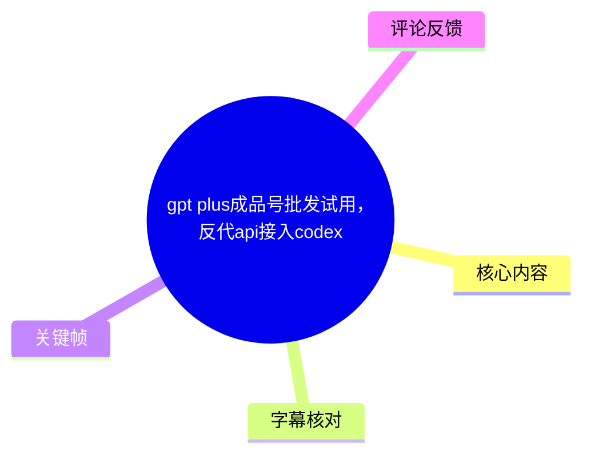
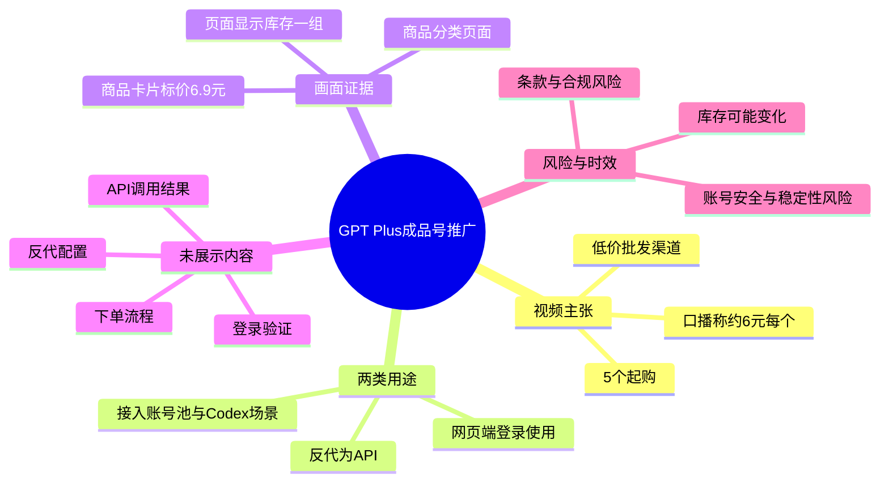
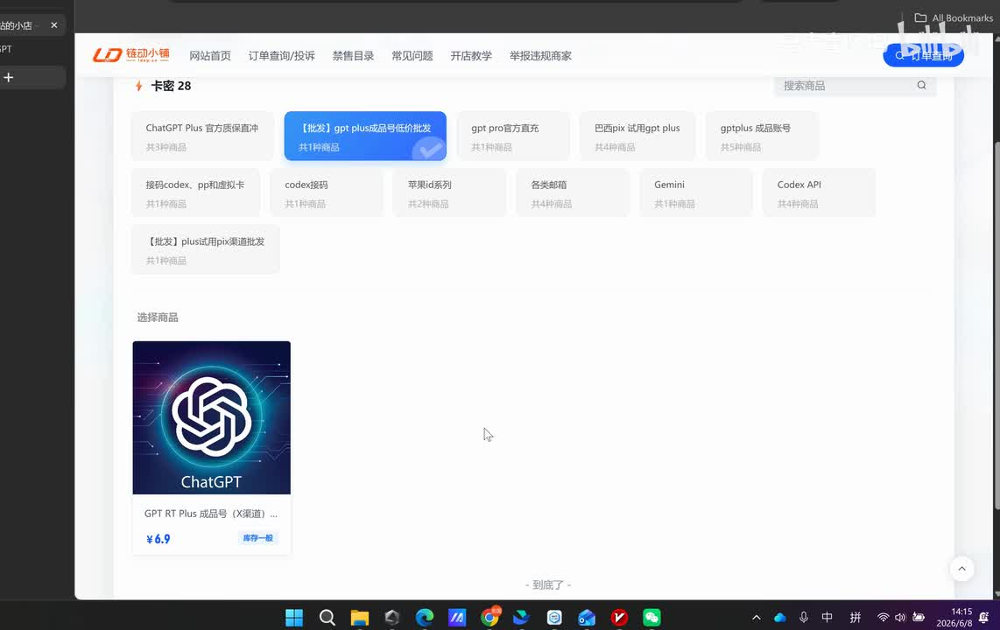

# gpt plus成品号批发试用，反代api接入codex

> 来源：[Bilibili 视频](https://www.bilibili.com/video/BV1MkEM6HEUT) 
> UP 主：是大宝贝吗｜发布时间：2026-06-08｜视频时长：00:47 
> 标签：gpt plus试用、gpt plus成品号、codex api、GPT充值方法

## 小结

视频是一则面向“GPT Plus 成品号”采购及使用场景的推广说明。UP 主称其分享了一个低价批发渠道，并口述单个账号的批发价“低至 6 元左右”、但需要 **5 个起购**。

视频给出的用途有两个：其一，作为 Plus 账号在网页端登录使用；其二，将账号“反代”为 API 后接入账号池，并用于 Codex 相关使用场景。视频没有展示账号购买、登录、反向代理部署、API 配置或 Codex 调用的具体操作过程。

画面展示的是一个商品/分类页面：选中分类为“【批发】gpt plus成品号低价批发”，页面中可见 ChatGPT 图标商品卡片，标价为 **¥6.9**。这与口播“6 元左右”大致相符，但二者并非完全相同；应以实际下单页、库存、套餐和售后规则为准。

该内容更适合需要辨识视频所称渠道、价格主张和用途范围的读者，不应将其视为官方 OpenAI 产品接入教程。购买、共享、转售账号，或利用第三方账号经反向代理提供服务，均可能触及平台服务条款、账号安全、隐私、稳定性及合规风险。

时效性很强：商品库存、价格、最低起购量、账号可用性及相关平台规则都可能随时变化。可获取热评中已有“没货了”的反馈，表明视频所述供给状态至少曾出现变化；该评论不是对当前库存的实时验证。

## 思维导图

## 目录

- [视频定位、价格与起购限制](#视频定位价格与起购限制)
- [画面中的商品页信息](#画面中的商品页信息)
- [视频所述的两类使用方式](#视频所述的两类使用方式)
- [可执行信息与未展示环节](#可执行信息与未展示环节)
- [结论、风险与时效性](#结论风险与时效性)
- [字幕比对](#字幕比对)
- [评论分析](#评论分析)
- [处理记录](#处理记录)

## 视频定位、价格与起购限制 [00:00:00](https://www.bilibili.com/video/BV1MkEM6HEUT?t=0)

ASR 的第一段从 **00:00:00.660 至 00:00:25.040**。UP 主开场称，本期内容主要分享“GPT Plus 成品号低价批发渠道”。这里的“渠道”是视频作者的推广性表述，视频本身未提供可独立核验的供货资质、账号来源或服务保障说明。

口播中出现的关键商业参数如下：

| 项目 | 视频口播内容 | 可确认范围 |
| --- | --- | --- |
| 商品类型 | GPT Plus 成品号 | 视频标题、口播和画面均指向此类商品 |
| 单价 | “低至 6 元左右” | 属于 UP 主口述的价格主张 |
| 最低采购量 | 5 个起购 | ASR 明确识别到的限制条件 |
| 页面可见价格 | ¥6.9 | 来自关键帧中的商品卡片 |
| 相关链接 | 放在评论区置顶 | 视频口播称会提供；给定素材未包含置顶链接内容 |

“低至 6 元左右”与画面卡片的 **¥6.9** 可以同时记录，但不能据此推导固定成交价。可能影响实际价格的因素包括商品规格、库存、起购数量、购买时点及页面更新；视频没有逐项解释。

## 画面中的商品页信息 [00:00:00](https://www.bilibili.com/video/BV1MkEM6HEUT?t=0)

视频画面为桌面浏览器中的商品页面。可见已选中的分类文字为“【批发】gpt plus成品号低价批发”，页面还展示了“ChatGPT Plus 官方保障…、gpt pro官方直充、巴西pix 试用gpt plus、gptplus 成品账号、接码codex、codex接码、Gemini、Codex API”等其他分类标签。分类标签仅说明页面陈列范围，不能证明这些商品与 OpenAI 或其他服务提供方存在官方授权关系。

页面下方商品卡片使用 ChatGPT 图标，卡片标题可辨识为“GPT RT Plus 成品号（渠道）…”（尾部被截断），标价为 **¥6.9**，右侧状态显示“库存一组”。视频没有展示点击商品后的详情页、账号交付形式、有效期、售后条款或付款结果。

> 图：关键帧展示了视频中唯一持续可见的商品分类页面、被选中的“GPT Plus 成品号低价批发”分类，以及标价 ¥6.9 的 ChatGPT 图标商品卡片。它可用于核对口播中的价格与“批发”定位，但不能据此验证账号来源、实际可用性或官方属性。

## 视频所述的两类使用方式 [00:00:25](https://www.bilibili.com/video/BV1MkEM6HEUT?t=25)

ASR 第二段覆盖 **00:00:25.040 至 00:00:44.810**。UP 主将这类账号的用途概括为两项。

### 1. 网页端作为 Plus 账号登录 [00:00:00](https://www.bilibili.com/video/BV1MkEM6HEUT?t=0)

口播称，第一个用途是“当做一个 Plus 账号在网页端进行一个登录……使用”。ASR 将产品名称识别为“GPD”，但结合视频标题“gpt plus成品号”、画面中的 ChatGPT/GPT Plus 字样，应校正为 **GPT Plus**。

视频未展示以下关键验证环节：

- 账号是否能成功登录；
- Plus 权益是否在登录后实际存在；
- 账号的注册地区、绑定方式、交付方式和使用期限；
- 是否存在多人共享、异地登录限制、二次验证或账号找回风险；
- 出现封禁、失效或权益变化后的售后处理方式。

因此，视频仅提出了“网页端登录”的用途主张，未构成实际可用性的演示证据。

### 2. 经反向代理作为 API 使用 [00:00:25](https://www.bilibili.com/video/BV1MkEM6HEUT?t=25)

UP 主口述的第二个用途是将账号“反带为一个 API 接入到我们的账号池里边”，并称“接入 GODAS 直接去当做一个 API 去使用”。其中“反带”较可能是 ASR 对“反代”的误识别；标题中明确使用“反代 API 接入 codex”，画面也有“Codex API”分类，故正文采用 **“反代”** 这一术语。

至于 ASR 中的“GODAS”，给定画面、标题和字幕均没有提供足够证据证明其具体指代；不能将其直接等同于某一软件、服务或 Codex 客户端。视频标题出现“codex”，但口播并未展示具体接入对象或成功调用界面。

视频所称流程可概括为：

1. 获取多个 GPT Plus 成品号；
2. 将这些账号置入“账号池”；
3. 通过“反代”方式对外作为 API 使用；
4. 面向标题所称的 Codex 相关场景使用。

不过，这只是视频表述的概念链路，并不是可复现教程。视频没有给出代理地址、认证方式、模型映射、请求格式、速率限制、故障转移策略、日志保护、费用结构或调用结果，因而不能补写为具体部署步骤。

## 可执行信息与未展示环节 [00:00:25](https://www.bilibili.com/video/BV1MkEM6HEUT?t=25)

### 视频实际提供的信息

- 采购对象：UP 主称为 GPT Plus 成品号；
- 价格主张：单个低至约 6 元，页面可见价格为 ¥6.9；
- 起购门槛：5 个；
- 使用设想：网页端登录，或接入账号池后经反代作为 API 使用；
- 获取方式：UP 主称相关链接会放在评论区置顶，并称可进群咨询。

### 视频没有提供、因而不能从中得出的信息

| 未展示事项 | 不能得出的结论 |
| --- | --- |
| 商品详情及交付页 | 无法确认账号数量、地区、有效期、是否独享或交付规则 |
| 登录与订阅页面 | 无法确认 Plus 权益、模型权限或登录稳定性 |
| 反代服务的配置界面 | 无法确认技术实现、接口兼容性或安全性 |
| Codex 调用页面或日志 | 无法确认“接入 Codex”已经成功 |
| 服务条款或授权文件 | 无法确认账号转售、共享和 API 化使用是否被允许 |
| 售后与退款规则 | 无法确认失效后的处理机制 |

### 使用前应独立核验的边界

对于涉及第三方账号、共享账号或账号池反向代理的方案，至少应独立核验：

- 账号来源是否合规，是否获得账号持有人和服务提供方的明确授权；
- 是否符合相关平台的服务条款、地区规则和组织内部安全规范；
- 是否会将提示词、代码、访问令牌或个人信息暴露给卖家、代理运营者或其他账号使用者；
- 是否存在账号被回收、改密、触发验证、限流或封禁的可能；
- 当代理服务停止、账号失效或供应商缺货时，是否有可验证的迁移与退出方案。

这些是风险提示，不是对视频所述方案可行性、合规性或安全性的认可。

## 结论、风险与时效性 [00:00:25](https://www.bilibili.com/video/BV1MkEM6HEUT?t=25)

视频的核心信息是一个商业推广主张：以 5 个起购的方式批发 GPT Plus 成品号，口播价格约为每个 6 元，画面可见价格为 ¥6.9；作者声称账号可用于网页端登录，或经反代纳入账号池并作为 API 使用。

需要区分三类信息：

1. **画面和字幕可直接支持的内容**：商品分类名称、¥6.9 的可见标价、口播的约 6 元价格、5 个起购、网页端登录与反代 API 的用途说法。
2. **作者未证明的内容**：账号是否稳定、是否具备对应权益、反代是否可用、是否能实际接入 Codex、相关链接是否仍可访问。
3. **不能由视频保证的内容**：官方授权、账号来源合法性、账号转售与共享的合规性、隐私保护、长期供应与售后。

时效方面，视频元数据显示发布时间为 **2026-06-08**，素材抓取时间为 **2026-07-15**。价格、库存和页面内容均属于易变信息。热评中“没货了”进一步提示库存可能已经变化，但该评论没有附带商品链接、时间状态或订单凭证，不能替代实时核验。

## 字幕比对

| 字幕来源 | 完整性 | 专有名词 | 时间轴 | 主要问题 |
| --- | --- | --- | --- | --- |
| Bilibili 站内字幕 | 不可用 | 无法评估 | 无法评估 | 素材明确说明“未提供可用站内字幕”；字幕抓取过程报 `Invalid URL`。 |
| 本次 ASR 字幕 | 较高；2 段覆盖 00:00:00.660—00:00:44.810 | 存在误识别 | 可用；带精确起止时间 | 将“GPT”识别为“GPD”，将“反代”识别为“反带”，将疑似特定产品/工具名识别为“GODAS”。 |

本次 ASR 使用 `medium` 模型，识别语言为中文，语言置信度为 `0.9970703125`；音频时长约 **46.09 秒**，有语音覆盖约 **44.15 秒**，覆盖率约 **95.79%**，无明显大间隔。诊断中**未标记** `noAudioStream=true`，因此可以确认源素材存在可供识别的音频流，并非无音轨视频。

最终以 **本次带时间轴 ASR** 为正文时间定位依据，并结合标题和关键帧进行有限校正：

- `GPD PLUS`：校正为 **GPT Plus**。依据是标题、商品分类和商品卡片均指向 GPT/ChatGPT。
- `反带`：校正为 **反代**。依据是标题中的“反代api”。
- `GODAS`：保留为 ASR 的不确定识别，不扩展为具体工具名称。标题虽出现 Codex，但不足以证明口播中的该词就是 Codex。
- “相关链接放在评论区置顶”：这是口播内容；给定评论数据中未提供置顶评论或链接，无法核验。

## 评论分析

仅获取到 2 条热评，未达到“前三条”的数量；以下仅分析可获取内容，且不将评论视为已验证事实。

1. **乐乐劫2026｜2 赞｜“没货了”**  
   - 观点：评论者称商品已经无货。  
   - 补充价值：提示视频所述供给可能不是持续有效状态，与“库存和价格实时变化”的风险判断一致。  
   - 可信度边界：未提供截图、订单记录、具体商品页或评论对应时间点，不能确认当前库存，也不能确认指向哪一个具体商品。

2. **吉野十四松｜1 赞｜“已三连 给个试用号爽爽呗[喜欢]”**  
   - 观点：评论者表达希望获得试用号。  
   - 补充价值：反映部分观众关注低门槛试用或体验需求。  
   - 可信度边界：这是互动请求，不包含账号质量、价格、可用性或售后方面的事实信息，也未显示 UP 主是否回应。

## 处理记录

- Worker ID：`worker-mrj0wjed-b0c290ad`
- 模型：`gpt-5.6-terra`
- ASR 模型：`medium`，中文识别，CUDA / `float16`
- 使用的素材与工具产物：视频元数据、`audio/audio.wav`、`asr/transcript.srt`、`asr/asr-result.json`、关键帧目录 `frames/`、热评数据 `comments/comments.json`。
- 字幕选择：站内字幕不可用，已检查本次 ASR 结果；采用 ASR SRT 的两个真实时间段作为时间轴依据，并以标题和画面校正明显术语误识别。
- 关键帧选择依据：选用 `frames/frame-001.jpg`，因为其中直接呈现了被选中的批发分类、ChatGPT 图标商品卡片、¥6.9 标价及库存提示，能够支撑正文对画面信息的描述；未把画面未展示的购买、交付或 API 流程当作事实。
- 评论范围：按要求仅处理可获取热评前三条；实际仅获取 2 条，均已列出。
- 缓存清理：提供的素材与日志中没有缓存清理执行记录，无法确认是否已清理；本整理未获得可操作的缓存目录或清理回执。
- 未解决问题：无法核验置顶链接、当前库存、账号来源、账号权益、售后规则、反代实现方式、API 兼容性，以及标题所称 Codex 接入是否实际成功。
