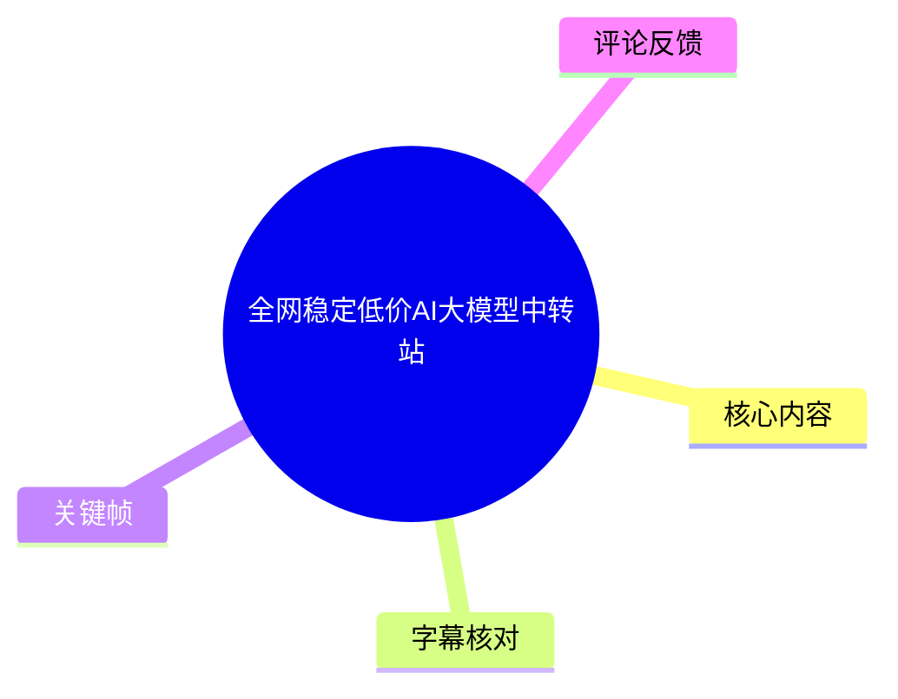
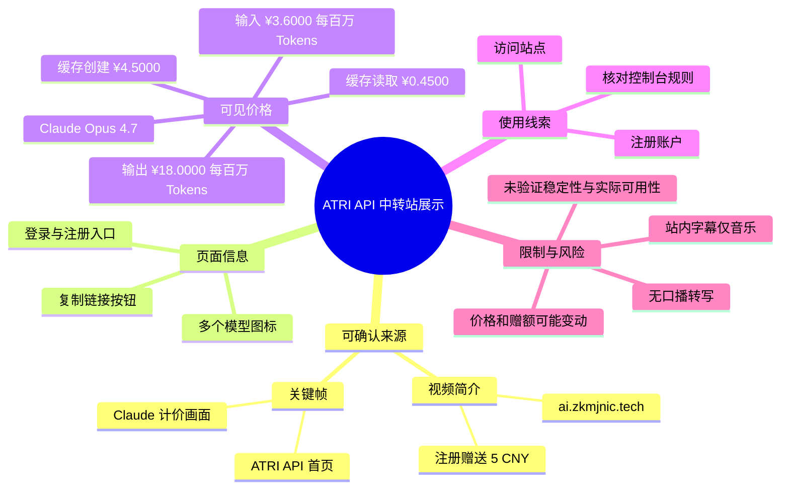
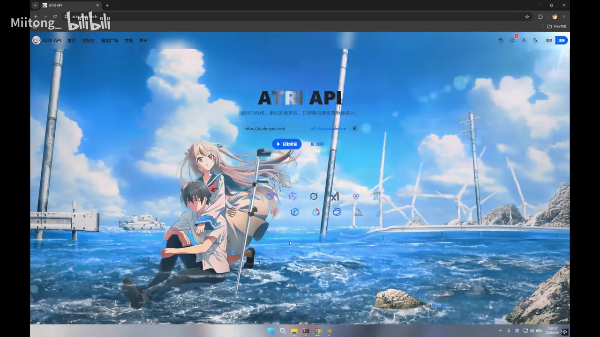
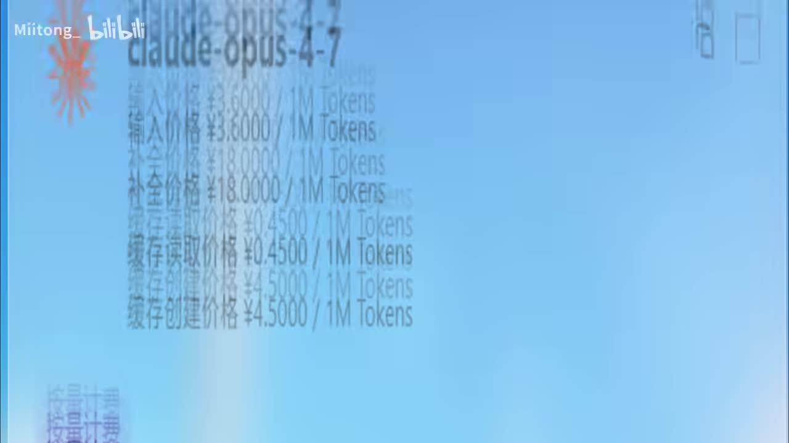
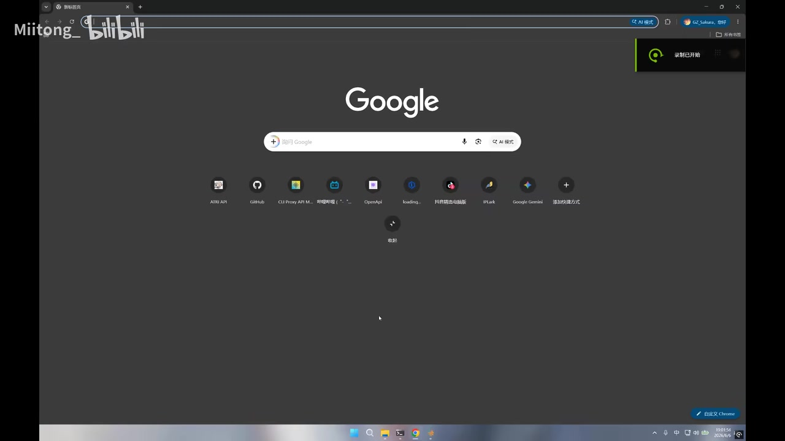

# 全网稳定低价AI大模型中转站

> 来源：[Bilibili 视频](https://www.bilibili.com/video/BV1oAEn6iEef) 
> UP 主：StarainClient｜视频时长：78 秒｜分辨率：1920×1080  
> 视频简介提供站点：`ai.zkmjnic.tech`，并称注册赠送 `5 CNY` 额度；交流群号码为 `1060176782`、`570130449`。

## 小结

视频以音乐和屏幕录制画面展示名为 **ATRI API** 的 AI 大模型中转/API 服务页面。可从画面确认其首页域名为 `ai.zkmjnic.tech`，页面主标题为“ATRI API”，右上角有“登录”“注册”入口；简介也给出了相同站点地址。

宣传重点是“稳定、低价”的大模型中转服务。画面中出现 `claude-opus-4-7` 的计价信息：输入价格为 **¥3.6000 / 1M Tokens**、输出价格为 **¥18.0000 / 1M Tokens**、缓存读取价格为 **¥0.4500 / 1M Tokens**、缓存创建价格为 **¥4.5000 / 1M Tokens**。这些价格是视频画面中展示的宣传信息，不等同于对实际计费、可用性或模型来源的独立验证。

视频没有可识别的口播内容。本次 ASR 未识别出任何语音片段；Bilibili 站内字幕也仅从 00:36.880 起标为“♪ 音乐 ♪”。因此，本文以视频简介、站内音乐时间轴和可见关键帧为主要证据，不补写画面未展示的 API 调用、支付方式、模型列表、限流规则或稳定性指标。

对准备尝试该服务的读者，视频能够提供的直接操作线索仅包括：访问所给域名、使用页面中的注册入口，以及注意简介所称的 5 CNY 注册赠额。是否需要实名、充值方式、密钥获取方式、模型实际版本、上下文限制和数据处理政策，均未在现有素材中得到确认。

该内容具有明显时效性：域名可访问性、赠送额度、模型名称、单价、供给渠道及服务状态都可能变化。尤其是“稳定”“低价”属于发布者的宣传判断，应在实际使用前以站点当期公告、控制台计费页和小额测试结果复核。

## 思维导图

## 目录

- [素材范围与时间轴证据](#素材范围与时间轴证据)
- [站点首页与入口画面](#站点首页与入口画面)
- [可见模型价格信息](#可见模型价格信息)
- [可执行步骤与核验清单](#可执行步骤与核验清单)
- [技术信息、参数与未披露项](#技术信息参数与未披露项)
- [结论、限制与时效性](#结论限制与时效性)
- [字幕比对](#字幕比对)
- [评论分析](#评论分析)
- [处理记录](#处理记录)

## 素材范围与时间轴证据 [00:00:36](https://www.bilibili.com/video/BV1oAEn6iEef?t=36)

站内 SRT 在 **00:00:36.880—00:01:17.220** 的 16 个分段中均标注为“♪ 音乐 ♪”，未提供可用于转录内容的文字字幕。本次 ASR 结果同样为空，没有识别到语音片段。

因此，可直接使用的真实时间轴仅能确认：视频后半段至少存在音乐字幕覆盖；不能依据画面出现顺序，为首页、价格页或人物画面虚构精确起止时间。视频元数据显示总时长为 78 秒，而提取音频的诊断时长为 77.3456875 秒，两者存在约 0.65 秒的容器/提取时长差异，不影响“无可用语音转写”的结论。

视频的画面信息主要包括：

1. 浏览器新标签页与录屏开始提示；
2. ATRI API 网站首页；
3. 一张 `claude-opus-4-7` 的价格信息画面；
4. 一段人物镜面自拍素材；
5. 配乐及风格化剪辑。

其中，人物镜面自拍和背景音乐未提供与 API 服务功能有关的可验证技术信息，故不将其作为产品能力的证据。

## 站点首页与入口画面 [00:00:36](https://www.bilibili.com/video/BV1oAEn6iEef?t=36)

关键帧可见浏览器访问了 `ai.zkmjnic.tech`，站点首页标题为 **ATRI API**。页面顶部导航中可见“首页”“控制台”“模型广场”“文档”“关于”等文字；右上区域可见“登录”“注册”。

> 图：该帧展示了 ATRI API 首页、地址栏中的站点域名以及右上角的登录/注册入口。它是确认视频实际展示对象与简介站点一致的核心视觉证据；但页面上的细小宣传语和模型图标无法据此推导完整的模型清单或服务协议。

页面中央可见一处站点地址及复制按钮，意味着该服务至少以可复制的站点/API 地址作为入口展示。不过，画面没有展示复制后得到的具体 Base URL、API Key、接口格式、鉴权 Header 或 SDK 示例；不能据此直接判断它是否兼容 OpenAI API、Anthropic API 或其他协议。

简介中提到“注册赠送 5CNY 额度”。这是 UP 主在视频说明区作出的信息补充，与首页存在“注册”入口相互呼应，但赠额发放条件、有效期、是否需要绑定支付方式以及可适用模型均未展示。

## 可见模型价格信息 [00:00:36](https://www.bilibili.com/video/BV1oAEn6iEef?t=36)

画面中可辨认的价格卡片标题为 **`claude-opus-4-7`**。卡片展示的单位是 **每 1M Tokens（100 万 Tokens）**，可读到以下项目：

| 计费项目 | 画面可见价格 | 单位 |
| --- | ---: | --- |
| 输入价格 | ¥3.6000 | / 1M Tokens |
| 输出价格 | ¥18.0000 | / 1M Tokens |
| 缓存读取价格 | ¥0.4500 | / 1M Tokens |
| 缓存创建价格 | ¥4.5000 | / 1M Tokens |

> 图：该帧直接呈现 `claude-opus-4-7` 名称及输入、输出、缓存读取、缓存创建四项按百万 Token 计的价格，是本文参数表的唯一视觉依据。画面存在压缩和虚焦，保留至四位小数的价格以截图可读文字为准。

### 价格字段的实际含义边界

视频画面将输入、输出与缓存相关用量拆分计价，这说明其计费展示至少区分了不同 Token 类型；但视频未解释“缓存读取”“缓存创建”何时触发，亦未说明是否由用户控制、是否与特定 API 参数绑定。

对成本估算而言，可以将画面中的数值理解为**服务方当时展示的单位价格**，而非最终账单承诺。若某次请求没有缓存命中，则不能仅以缓存读取价计算；若服务的实际模型映射、Token 统计规则或账单精度发生变化，截图价格也不能替代控制台实时价格。

视频未展示以下重要参数：

- 模型的实际供应方、区域或路由策略；
- 是否为官方模型标识、镜像名称或平台别名；
- 最大上下文长度、最大输出长度与并发限制；
- 请求/响应速度、TTFT、成功率及 SLA；
- 人民币余额换算规则、充值门槛、退款政策与账单示例；
- 数据是否留存、日志保存期限及隐私条款；
- 缓存计费的触发条件和失效规则。

## 可执行步骤与核验清单 [00:00:36](https://www.bilibili.com/video/BV1oAEn6iEef?t=36)

视频未演示从注册到调用 API 的完整流程，以下步骤仅整理自简介和首页中已出现的入口，不将未出现的操作描述为视频教程。

1. **访问站点**：使用视频简介给出的 `ai.zkmjnic.tech`。  
   画面地址栏与简介信息一致，可作为访问目标的交叉依据。

2. **进入注册入口**：首页右上角可见“注册”。  
   视频简介称注册赠送 5 CNY 额度，但未展示注册表单、验证要求或到账页面。

3. **登录后查看控制台**：首页导航可见“控制台”。  
   应在控制台内确认当前可用模型、单价、余额、密钥管理、限流与账单条目；视频没有展示控制台内容，不能假定一定存在某项具体设置。

4. **用小额请求验证服务**：在充值或迁移工作负载前，建议以非敏感测试提示词核验模型返回、单位扣费和响应稳定性。  
   这是基于中转服务使用风险提出的审慎建议，不是视频中演示的步骤。

5. **核对隐私与合规信息**：如请求中包含源代码、业务数据或个人信息，应在发送前确认站点的隐私政策、日志与数据保留说明。  
   视频与简介均未提供相关条款，不能据此判定数据是否安全或是否被用于训练。

> 图：该帧展示浏览器环境与录屏状态，说明视频采用屏幕录制方式进入网站演示。其价值在于帮助区分“站点实操画面”和后续的配乐/素材剪辑；它不包含 API 调用参数或运行结果。

## 技术信息、参数与未披露项 [00:00:36](https://www.bilibili.com/video/BV1oAEn6iEef?t=36)

### 已展示的技术线索

- 服务页面名称：**ATRI API**；
- 站点域名：`ai.zkmjnic.tech`；
- 页面导航含“控制台”“模型广场”“文档”等入口；
- 至少展示了一项名为 `claude-opus-4-7` 的模型计费卡；
- 计量粒度为 **1M Tokens**；
- 价格类别包括输入、输出、缓存读取、缓存创建。

这些信息足以说明视频在推广一个具有模型价格展示页的 AI API 站点，但不足以证明其后端架构、协议兼容性、转发链路或模型真实性。

### 不应从视频中推断的内容

“中转站”是标题和标签中的表述，通常可指代在用户与模型服务之间提供统一访问或转发能力的服务形态；但本视频没有展示请求报文、系统架构或上游渠道。因此，不能确认：

- 是否使用统一的 OpenAI 兼容接口；
- 是否支持流式响应、函数调用、视觉输入或工具调用；
- 是否支持 SDK、CLI 或第三方客户端；
- 是否提供模型回退、负载均衡或故障切换；
- “稳定”是否有可量化的成功率、延迟或 SLA 依据。

> 图：该帧是视频中的人物素材，与网站操作和计费参数没有直接关联。保留它的原因是如实反映视频包含非技术剪辑内容，同时避免将其误读为服务功能演示或用户评价。

## 结论、限制与时效性 [00:00:36](https://www.bilibili.com/video/BV1oAEn6iEef?t=36)

这是一条时长较短的服务展示视频：它给出了 ATRI API 的站点线索、注册入口、简介中的 5 CNY 注册赠额，以及 `claude-opus-4-7` 的四项按百万 Token 计的画面价格。对寻找模型 API 聚合/中转服务的读者而言，最有价值的是这些可复核的入口与计价字段。

但视频并未构成完整技术教程或服务评测。它没有提供 API 文档内容、调用示例、密钥创建过程、模型实际响应、稳定性压测、隐私策略或售后规则；标题中的“全网稳定低价”是宣传性表述，不能直接视为横向市场比较或性能结论。

使用此类服务前应特别注意：

- **价格时效性**：截图单价和赠额可能随时调整；
- **模型一致性**：页面模型名不必然足以证明实际版本、上游或能力边界；
- **账单风险**：输入、输出、缓存读取和缓存创建可能分别计费；
- **数据风险**：视频未说明数据保留与处理规则，敏感数据不应在未核验政策前提交；
- **可用性风险**：没有压测、SLA 或长期运行证据，不能由短视频画面推导稳定性。

## 字幕比对 [00:00:36](https://www.bilibili.com/video/BV1oAEn6iEef?t=36)

| 字幕来源 | 完整性 | 专有名词 | 时间轴 | 主要问题 |
| --- | --- | --- | --- | --- |
| Bilibili 站内字幕 `p01-ai-zh.srt` | 极低：仅含 16 段“♪ 音乐 ♪” | 未提供任何模型、站点或技术名词 | 有效：覆盖 00:36.880—01:17.220，但中间有若干间隔 | 只能证明配乐存在，无法转写画面内容 |
| 本次 ASR（medium） | 空：0 个语音分段、语音覆盖率 0 | 无 | 无可用文本时间轴 | 自动检测语言为英语（置信度 0.5410），但未识别到语音；诊断提示未识别语音片段 |

本次 ASR 已检查，结果为空。诊断中**没有** `noAudioStream=true` 标记，且素材中存在 `audio/audio.wav`、音频时长为 77.3456875 秒；因此不能称源视频没有音轨。更符合素材的表述是：音轨存在，但 ASR 未识别到可转写语音，站内字幕也将后段标为音乐。

最终不采用任一字幕作为正文语言内容来源，而采用以下证据层级：

1. **视频简介**：站点、交流群及“注册赠送 5CNY 额度”；
2. **关键帧画面**：ATRI API 名称、域名、导航、登录/注册入口与价格卡片；
3. **站内 SRT**：仅用于可靠标注音乐段的时间轴。

通过关键帧校正并保留的关键文字包括：`ATRI API`、`ai.zkmjnic.tech`、`claude-opus-4-7`、`1M Tokens`。除这些可见文字外，未对模糊小字进行扩写或猜测。

## 评论分析 [00:00:36](https://www.bilibili.com/video/BV1oAEn6iEef?t=36)

本次仅获取到 2 条热评，少于“热评前三条”的上限；不存在可获取的第 3 条评论，故不补充推测性内容。

1. **你男的女的男的你说你**（6 赞）：“这个bgm让所有黑客人都来了”  
   - 观点：评论聚焦视频配乐营造出的“黑客”氛围。  
   - 补充价值：与站内字幕反复标注“♪ 音乐 ♪”相吻合，侧面反映配乐是视频体验中的显著元素。  
   - 可信度边界：这是审美化调侃，不涉及站点价格、稳定性或安全性的事实证明。

2. **kboxcbh1337**（2 赞）：“zkm破甲中…”  
   - 观点：使用“破甲中”的网络化表达，可能是在调侃或评价与 `zkm` 相关的站点/名称。  
   - 补充价值：没有给出具体故障、费用、测试结果或可复核证据。  
   - 可信度边界：语义过于简略，不能据此推断服务存在问题，也不能作为产品评价依据。

## 处理记录 [00:00:36](https://www.bilibili.com/video/BV1oAEn6iEef?t=36)

- Worker ID：`worker-mrj0wjed-b0c290ad`
- 生成模型：`gpt-5.6-terra`
- ASR 模型：`medium`（CUDA、`float16`、自动语言检测）
- 使用的素材与工具产物：视频元数据、`audio/audio.wav`、`asr/asr-result.json`、站内字幕 `p01-ai-zh.srt`、关键帧目录 `frames/`、热评数据 `comments/comments.json`。
- 字幕选择：未将站内字幕或本次 ASR 用作内容转写。站内字幕仅保留为音乐段时间轴证据；ASR 为空，未发现 `noAudioStream=true` 标记。
- 关键帧选择依据：
  - `frames/frame-004.jpg`：展示 ATRI API 首页、域名及登录/注册入口；
  - `frames/frame-001.jpg`：展示 `claude-opus-4-7` 的输入、输出和缓存计价；
  - `frames/frame-003.jpg`：展示浏览器录屏场景；
  - `frames/frame-002.jpg`：记录与技术信息无直接关系的人物剪辑内容，避免遗漏视频构成。
- 时间轴依据：仅使用站内 SRT 明确给出的 00:36.880 起音乐段，链接秒数取整为 `t=36`；未根据文字或关键帧排序虚构其他时间点。
- 缓存清理：未提供缓存清理执行记录，无法确认是否已清理；不作已清理声明。
- 未解决问题：未能从现有素材确认 API 协议、密钥获取方式、模型完整列表、实际服务质量、隐私政策、支付规则、限流和实时价格。

## 评论分析

- 热评 1：这个bgm让所有黑客人都来了
- 热评 2：zkm破甲中…

以上内容是观众反馈摘录，只用于补充理解视频反响，不作为正文事实依据。
