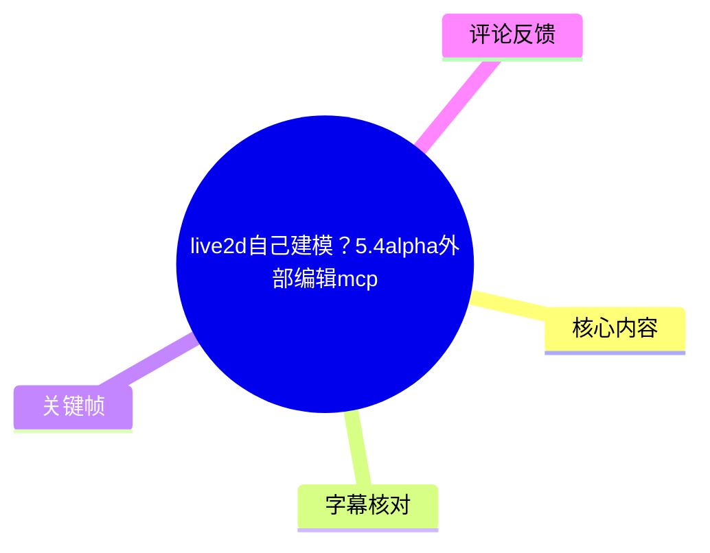
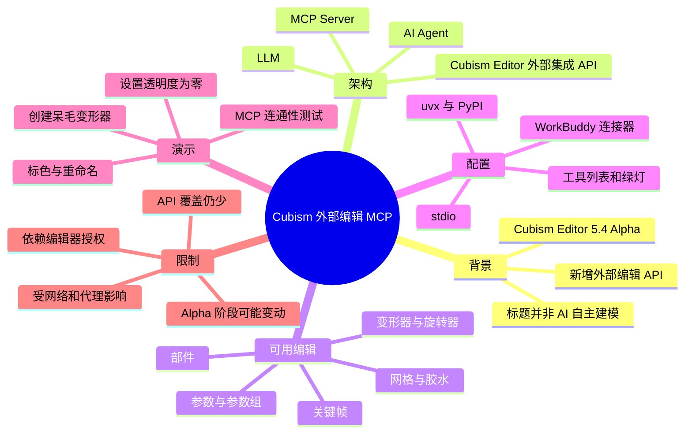
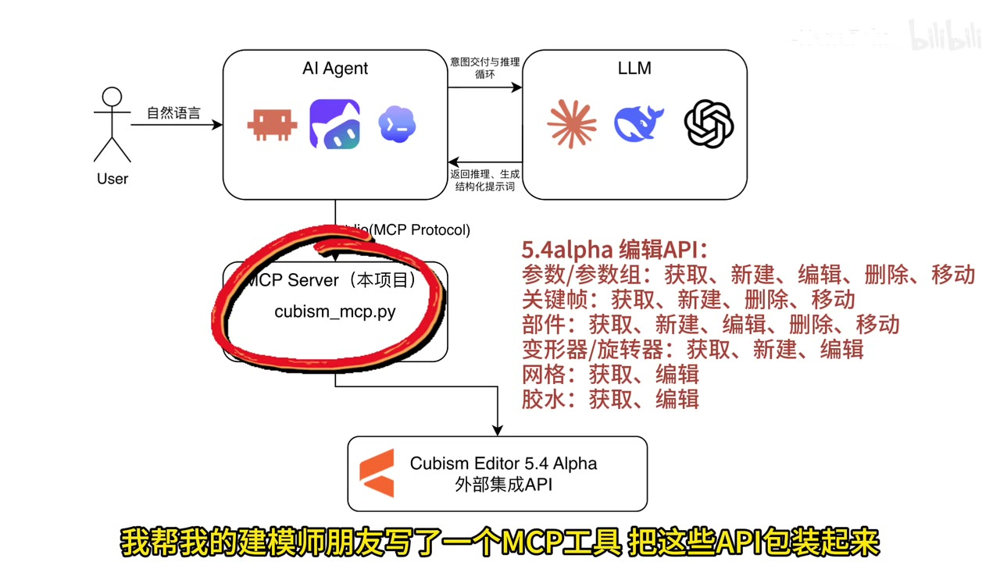
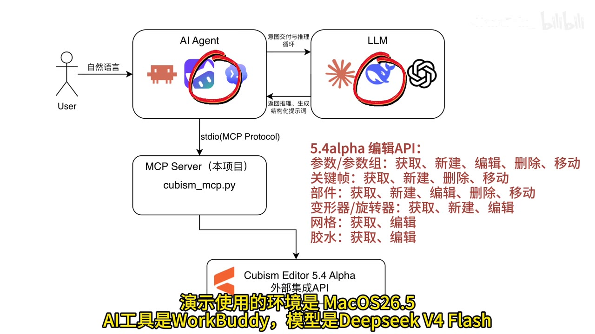
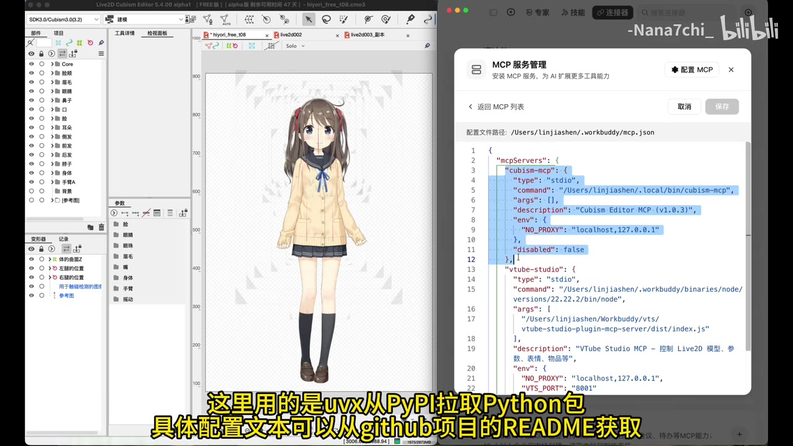
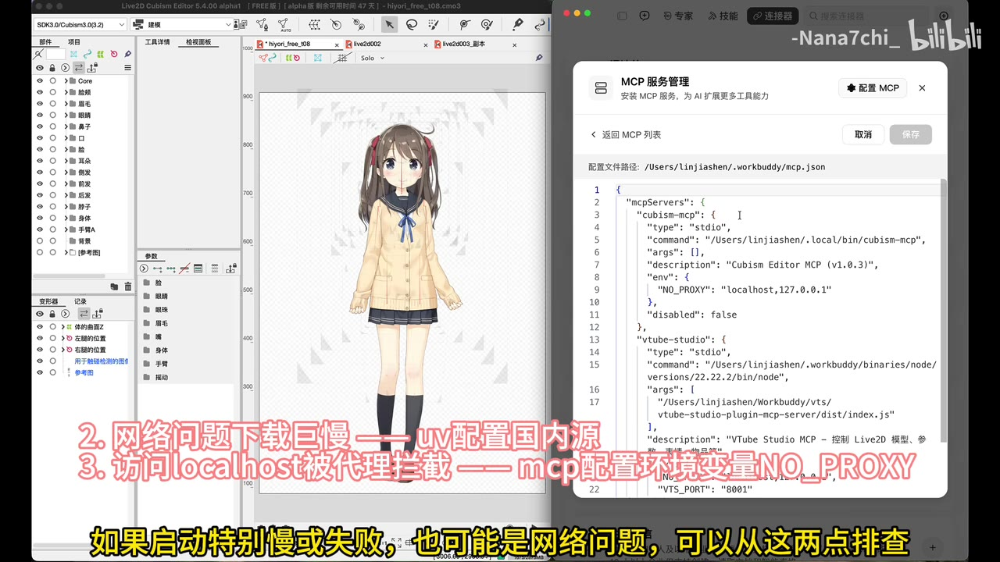

# live2d自己建模？5.4alpha外部编辑mcp

> 来源：[Bilibili 视频](https://www.bilibili.com/video/BV14WgZ6TEbf)<br>
> UP 主：-Nana7chi_ ｜时长：2 分 57 秒｜分区收藏集：AIcode  
> 视频描述已明确澄清：标题存在“标题党”成分，官方 API **尚未达到让 AI 独立完成 Live2D 建模**的程度。

## 小结

视频介绍了 Cubism Editor 5.4 Alpha 新增的外部编辑 API，以及作者基于这些 API 封装的 `CubismExternalEditMCP`／`cubism-mcp` MCP 工具。其核心作用是让支持 MCP 的 AI 客户端通过自然语言，调用 Cubism Editor 的外部集成 API，对既有模型中的参数、部件、变形器等对象执行部分编辑。

作者给出的定位不是“AI 自动建模”。目前更实际的用途是处理重复且规则明确的任务，例如批量新增、删除、修改或移动部件与参数，为对象标色、重命名变形器、创建呆毛的变形器、设置部件透明度等。视频中还明确说，官方当前可调用的编辑 API 数量仍较少。

演示环境为 **macOS 26.5 + WorkBuddy + DeepSeek V4 Flash**；连接方式使用 MCP 的 `stdio` 模式，视频口述通过 `uvx` 从 PyPI 拉取 Python 包。配置成功后，AI 客户端应显示 MCP 连接的绿灯状态及可用工具列表。

排障重点有两类：一是 Cubism Editor 的授权状态，授权失败时需检查授权后重试；二是网络与代理问题，启动缓慢或失败可能与下载网络有关。画面补充提示：访问 `localhost` 被代理拦截时，可在 MCP 环境变量中设置 `NO_PROXY=localhost,127.0.0.1`。

本视频反映的是 Cubism Editor **5.4 Alpha** 阶段能力，存在版本变化风险。作者也表示正式版后可能增加更多 API，并计划继续更新。因此，实际部署前应以项目 README、当前 Cubism 版本和 AI 客户端的 MCP 配置要求为准。

## 思维导图





## 目录

- [背景、能力边界与架构](#背景能力边界与架构-0000)
- [环境与 MCP 配置](#环境与-mcp-配置-0023)
- [连通性及编辑功能演示](#连通性及编辑功能演示-0057)
- [工作流价值与版本限制](#工作流价值与版本限制-0233)
- [关键帧索引](#关键帧索引)
- [字幕比对](#字幕比对)
- [评论分析](#评论分析)
- [处理记录](#处理记录)

## 背景、能力边界与架构 [00:00](https://www.bilibili.com/video/BV14WgZ6TEbf?t=0)

Cubism Editor 发布了 5.4 Alpha 版本，其外部调用 API 增加了一批编辑接口。视频口述重点列举了参数、部件和变形器的编辑能力；作者将这些 API 包装为 MCP 工具，以便接入支持 MCP 的 AI 工具，例如视频提到的 Claude Code、Codex 等。

从视频开场架构图可知，调用路径是：

1. 用户以自然语言向 AI Agent 提出任务；
2. AI Agent 与 LLM 进行意图交付、推理循环；
3. Agent 通过 `stdio (MCP Protocol)` 访问本项目的 MCP Server；
4. MCP Server 中的 `cubism_mcp.py` 再调用 Cubism Editor 5.4 Alpha 的外部集成 API；
5. 编辑结果回到 AI Agent，再由 Agent 向用户反馈。



> 图：该关键帧直观展示了“用户—AI Agent—LLM—MCP Server—Cubism Editor”的层级关系，并列出 5.4 Alpha API 的对象范围，是理解本工具并非直接让 LLM 操作编辑器界面的关键证据。

画面列出的接口范围如下。这里是**关键帧呈现的 API 清单**，不应外推为全部 Cubism 功能均可通过 MCP 操作：

| 对象 | 画面列出的操作 |
| --- | --- |
| 参数／参数组 | 获取、新建、编辑、删除、移动 |
| 关键帧 | 获取、新建、删除、移动 |
| 部件 | 获取、新建、编辑、删除、移动 |
| 变形器／旋转器 | 获取、新建、编辑 |
| 网格 | 获取、编辑 |
| 胶水 | 获取、编辑 |

视频描述中的边界说明尤其重要：官方 API 还没有到“自己建模”的程度。也就是说，AI 可以在 API 暴露的范围内协助执行结构化编辑，不等同于自动完成原画切分、网格设计、参数绑定、变形设计与整体物理调校等完整建模工作。

## 环境与 MCP 配置 [00:23](https://www.bilibili.com/video/BV14WgZ6TEbf?t=23)

### 演示条件

视频说明的演示组合为：

| 项目 | 视频给出的信息 |
| --- | --- |
| 操作系统 | macOS 26.5 |
| AI 工具 | WorkBuddy |
| 所用模型 | DeepSeek V4 Flash |
| 编辑器 | Cubism Editor 5.4 Alpha（画面显示为 5.4.00 alpha1） |
| MCP 启动方式 | `uvx` |
| 包来源 | PyPI（视频口述） |



> 图：关键帧同时保留了 MCP 调用链和演示环境字幕，可用于区分“视频实际演示配置”与一般性的 MCP 架构说明。

### 配置步骤

1. **准备项目与安装说明**  
   视频描述提供项目地址：  
   - GitHub：[nana7chi/CubismExternalEditMCP](https://github.com/nana7chi/CubismExternalEditMCP)  
   - Gitee 镜像：[linjiashen9/CubismExternalEditMCP](https://gitee.com/linjiashen9/CubismExternalEditMCP)

   作者还提供了可直接发送给 AI 助手的配置请求：根据项目 README 安装和配置 `cubism-mcp`；若尚未安装 `uv`，先安装 `uv`；GitHub 不可访问时改用 Gitee 镜像；完成后确认是否就绪。

2. **在 WorkBuddy 的连接器配置 MCP**  
   根据站内字幕，WorkBuddy 需要在“连接器配置 MCP”处添加服务。配置成功后，界面应出现**绿灯**，且能显示工具列表。

3. **使用 `uvx` 启动 MCP 服务**  
   视频口述为使用 `uvx` 从 PyPI 拉取 Python 包。画面中则展示了一个已安装命令的绝对路径形式，因此实际 `command` 可能随安装状态而不同：可为 `uvx`，也可能是本地安装后的 `cubism-mcp` 可执行文件路径。应以项目 README 与客户端的实际配置格式为准。

4. **为本地连接设置代理绕过规则**  
   画面中的服务配置包含：
   ```json
   "env": {
     "NO_PROXY": "localhost,127.0.0.1"
   }
   ```
   其用途是避免本地 `localhost` 请求被系统代理或网络代理错误接管。



> 图：左侧为 Cubism Editor 模型界面，右侧为 WorkBuddy 的 MCP 服务管理页；配置中可见 `stdio`、`cubism-mcp`、描述信息和 `NO_PROXY`，为“AI 客户端如何接入编辑器服务”提供了画面依据。

### 排障：授权、网络与代理

作者给出的排查顺序是：

- **授权失败**：检查 Cubism Editor 的授权状态，再重新尝试。
- **启动特别慢或失败**：排查网络问题；视频画面进一步提示，可考虑为 `uv` 配置国内源，以缓解下载过慢的情况。
- **访问本地服务异常**：检查是否有代理拦截 `localhost`，并确保 MCP 服务环境变量含有 `NO_PROXY=localhost,127.0.0.1`。



> 图：画面以醒目文字补充了两项网络层经验：下载缓慢时考虑 `uv` 配置国内源，以及被代理拦截本地地址时设置 `NO_PROXY`。这些内容补足了口述中“网络问题”的笼统提示。

> 注意：视频没有提供完整、可复制且经运行验证的 README 内容；因此不能仅凭视频画面推导所有字段、版本号或镜像地址。安装命令、包版本和客户端 JSON 格式均可能随项目更新变化。

## 连通性及编辑功能演示 [00:57](https://www.bilibili.com/video/BV14WgZ6TEbf?t=57)

### 1. 测试 MCP 连接 [00:57](https://www.bilibili.com/video/BV14WgZ6TEbf?t=57)

作者首先让 AI 测试 MCP 连接。这一步的目的不是编辑模型，而是确认 AI 客户端已能调用已注册的 Cubism 工具。结合前一节的绿灯和工具列表，建议将“服务可见”“工具可见”“实际请求成功”分开验证，避免仅因配置文件保存成功就误判连接已完全就绪。

### 2. 为部件、参数标色并重命名变形器 [01:28](https://www.bilibili.com/video/BV14WgZ6TEbf?t=88)

在连通性验证后，作者让 AI 对模型执行三类操作：

- 给部件标色；
- 给参数标色；
- 重命名变形器。

这类任务共同特征是目标明确、规则可描述、重复度高，适合作为 MCP 辅助编辑的典型场景。视频没有展示自然语言提示词全文、具体对象 ID、命名规则或每一项修改的逐条回执，因此不能据此断言其可无人工检查地批量应用到任意模型。

### 3. 为呆毛创建变形器 [01:49](https://www.bilibili.com/video/BV14WgZ6TEbf?t=109)

作者接着要求“给呆毛建个变形器”。这与开场 API 清单中“变形器／旋转器：获取、新建、编辑”相吻合，表明创建变形器属于演示覆盖的能力之一。

但作者随后说明自己不会建模，暂时不测试编辑变形器。这意味着视频只证明了其尝试／展示了变形器创建相关操作，**没有充分展示复杂变形器编辑效果、层级关系、绑定对象或形变质量**。实际生产中仍应由了解 Cubism 结构的建模师检查新建对象的位置、父子关系和命名。

### 4. 设置部件透明度 [02:18](https://www.bilibili.com/video/BV14WgZ6TEbf?t=138)

最后的可见结果是设置部件透明度。作者说明，指定部位的透明度都被设置为零。该演示对应部件编辑能力，说明 MCP 可对满足接口条件的部件属性执行修改。

在工作流中，这类操作可用于批量隐藏部件、做状态切换前的初始值整理，或按照清单统一处理对象；但视频没有说明透明度修改是否可撤销、是否自动保存、是否影响导出文件，因此执行前仍应保存版本或通过 Cubism 的撤销与版本控制策略保护模型。

## 工作流价值与版本限制 [02:33](https://www.bilibili.com/video/BV14WgZ6TEbf?t=153)

作者认为 MCP 的主要优势是：能接入市面上“几乎所有成熟 AI 工具”。更准确地说，这一判断的前提是目标 AI 工具支持 MCP，且支持相应的传输方式、权限与工具调用机制。对于已经在使用兼容 AI 工具的用户，视频给出的最低接入思路是：准备 `uv` 环境并完成 MCP 配置。

作者还指出，Cubism MCP 可以与其他软件的 Skill／MCP 在同一 AI 工具中组合为工作流，视频口述举例包括 PS、Krita、ComfyUI、Blender、Godot、Unity 等。这里的含义是让一个 AI Agent 根据任务在不同软件工具之间调度；它并不表示这些软件已由本项目自动集成，也不意味着视频验证了所有组合。

### 适合采用的任务

- 已有 Cubism 模型的对象清单整理；
- 批量对参数、部件执行重复性的新增、删除、修改或移动；
- 批量标色、重命名；
- 创建 API 支持范围内的变形器；
- 按明确规则统一设置部件属性，例如透明度。

### 不应夸大的能力

- 不能据此宣称 AI 已能自动完成 Live2D 建模；
- 不宜把复杂的变形器设计和编辑效果视为已在视频中验证；
- 不应假定任意 AI 客户端、任意模型或任意 Cubism 版本均可直接兼容；
- API 仍处于 5.4 Alpha 相关阶段，正式版可能扩展，也可能调整接口与兼容性。

作者最后明确表示，官方现有编辑 API 仍比较少；正式版发布后可能会有更多能力，自己也会继续更新项目。该判断使得本文的配置与能力记录具有明显时效性。

## 关键帧索引

| 关键帧 | 对应内容 | 选用价值 |
| --- | --- | --- |
| `frames/frame-001.jpg` | MCP 架构与 5.4 Alpha 编辑 API 范围 | 直接说明工具调用链及接口覆盖边界。 |
| `frames/frame-002.jpg` | 演示操作系统、AI 工具和模型 | 为环境参数提供视觉佐证。 |
| `frames/frame-003.jpg` | WorkBuddy MCP 服务配置页 | 说明 `stdio`、服务描述、环境变量及编辑器并行运行状态。 |
| `frames/frame-004.jpg` | 网络与代理问题提示 | 补充下载慢、代理拦截 localhost 两项可操作的排障线索。 |

其余关键帧路径虽在素材清单中可用，但未提供可核验的画面内容描述；为避免将未核实画面强行归入某个功能，本笔记仅选择上述与正文证据关系明确的关键帧。

## 字幕比对

| 字幕来源 | 完整性 | 专有名词 | 时间轴 | 主要问题 |
| --- | --- | --- | --- | --- |
| Bilibili 站内字幕 | 覆盖 00:00:00.120 至 00:02:56.820，含开场、配置、演示和结尾 | 多处识别不准，如“Mark vs26.5”“work body”“DPCD4flash”“lead me”；结合画面校正为 macOS 26.5、WorkBuddy、DeepSeek V4 Flash、README | 分段细，且与视频完整时长基本一致 | 部分产品名、技术词存在音译或错字；个别软件名不可靠 |
| 本次 ASR 字幕 | 共 10 段，语音覆盖约 68.86 秒，占视频约 38.92%；首段从 00:00:26.860 才开始 | “Corecode”“DipSeq”“PiPi”“Pi防包”“授全”“Conf UI”“Bender”等错误较多 | 有时间戳，但开场约 26 秒内容被合并或漏检；演示静默区没有文本 | 长句过度合并，存在较大空档；不适合作为全文主时间轴 |

### 最终字幕选择与校正原则

本文以**站内 SRT**作为主时间轴依据：它提供了从 00:00 开始的连续分段，章节链接均按其起止时间换算为秒数。已检查本次 ASR：其语言识别为中文、置信度约 0.998，且诊断中**没有** `noAudioStream=true` 标记，说明源视频存在音轨；ASR 的问题是识别覆盖不足与专名失真，而不是无音轨或工具失败。

重要校正依据如下：

- `Mac OS 26.5`：站内字幕与 ASR 均有近似表达，关键帧字幕清晰显示为 **macOS 26.5**。
- `work body`／`WorkBuddy`：关键帧界面与字幕共同支持 **WorkBuddy**。
- `DPCD4flash`／`DipSeq D4Flash`：关键帧字幕显示为 **DeepSeek V4 Flash**。
- `UVX`：站内字幕写作“UVX”，关键帧与口述均指向 `uvx`。
- `PyPI`：站内字幕“拍pi”、ASR“PiPi”均为识别错误；按视频语境校正为 **PyPI**。
- `README`：站内字幕“lead me”、ASR“LeadMe”均不准确；视频描述链接明确指向项目 `README.md`。
- 软件串列：站内字幕中的“PS quit confiui / gold unity”等与 ASR 的“PSKritaConf UIBenderGoldenUnity”均不可靠。本文仅保留双方语义一致且作者口述所列的 PS、Krita、ComfyUI、Blender、Godot、Unity，并标为“举例”，不扩展为已验证集成。

## 评论分析

仅处理本次可获取的热评前三条；评论内容属于用户观点或补充信息，不等同于已验证事实。

1. **UP 主 -Nana7chi_（1 赞）**  
   评论补充了一段 MCP 配置示例，核心字段是 `type: "stdio"`、`command: "uvx"`、参数 `cubism-mcp`，以及 `NO_PROXY=localhost,127.0.0.1`。这与视频中的配置与排障思路一致，具有较高参考价值。  
   不过该评论原文中的 `args` 使用了中文方括号 `【】`，并非严格 JSON 语法；复制前应改为标准 JSON 数组写法，并以 README 为准：
   ```json
   {
     "mcpServers": {
       "cubism-mcp": {
         "type": "stdio",
         "command": "uvx",
         "args": ["cubism-mcp"],
         "description": "Cubism Editor MCP",
         "env": {
           "NO_PROXY": "localhost,127.0.0.1"
         }
       }
     }
   }
   ```

2. **hana1015花（0 赞）**  
   评论称“api没用，有sdk直接用unity”。这是对技术路线的偏好表达：若目标是 Unity 运行时集成，官方 SDK 的确是另一条路径；但视频讨论的是 **Cubism Editor 内的外部编辑自动化**，而不是 Unity 运行时渲染或控制。两者解决的问题不同，不能据此否定 MCP 在编辑阶段处理重复任务的价值。

3. **霍柴玉铉（1 赞）**  
   评论认为“官方API还是太少了”。该观点与作者在视频结尾的判断一致：现有编辑 API 覆盖有限，期待正式版增加能力。它是对当前限制的合理提醒，但没有提供具体缺失接口清单，因此不能进一步推断未支持的所有功能。

## 处理记录

- **Worker ID**：worker-mrj0wbly-5dc4e50c
- **模型**：gpt-5.6-terra
- **调用工具与素材**：基于任务提供的视频元数据、站内字幕 `p01-ai-zh.srt`、本次 ASR 结果与 SRT、关键帧清单及前四张可见关键帧、热评 JSON 进行整理；未对素材外网页内容作事实补充。
- **字幕选择**：采用站内字幕作为正文时间轴主依据；已核查本次 ASR。ASR 有音轨识别结果但覆盖约 38.92%，且专有名词错误较多，因此仅用于交叉核验，不用于确定章节时间。
- **关键帧选择依据**：选择 `frame-001` 至 `frame-004`，原因是其画面明确呈现架构、API 范围、演示环境、MCP 配置和网络排障；未对未提供画面描述的其余帧作推断。
- **缓存清理**：本任务仅接收并整理既有素材，未产生可报告的临时下载缓存；无额外缓存清理记录。
- **未解决问题**：未取得项目 README 的具体版本化内容，无法验证当前包版本、完整工具清单、各编辑接口参数、兼容的 Cubism 版本和所有 AI 客户端适配状态；这些信息应以项目仓库与正式版文档为准。
