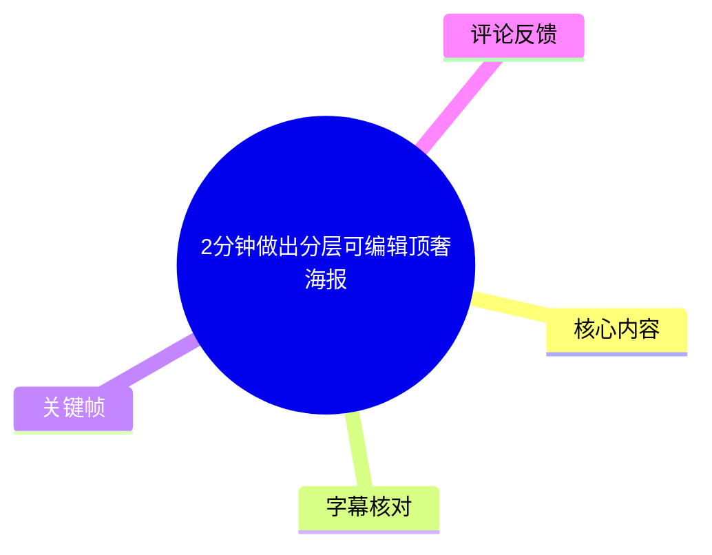
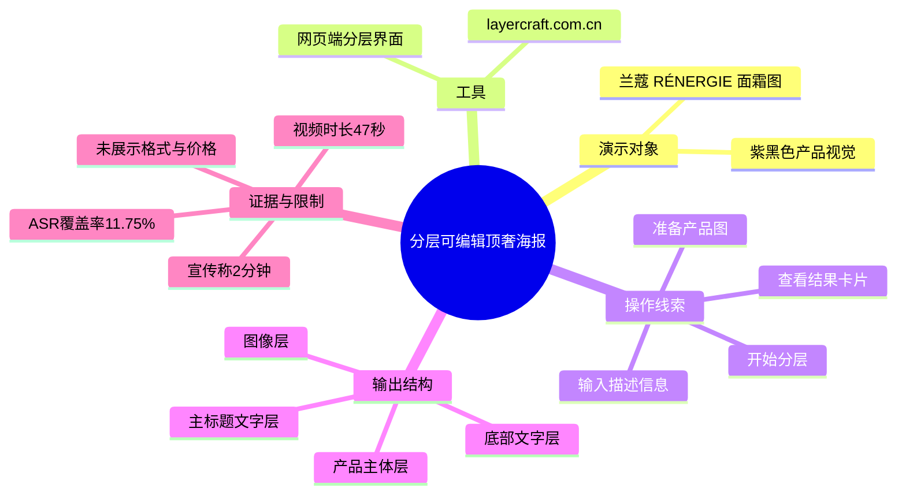
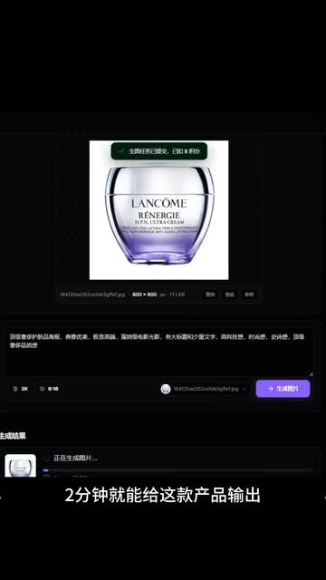
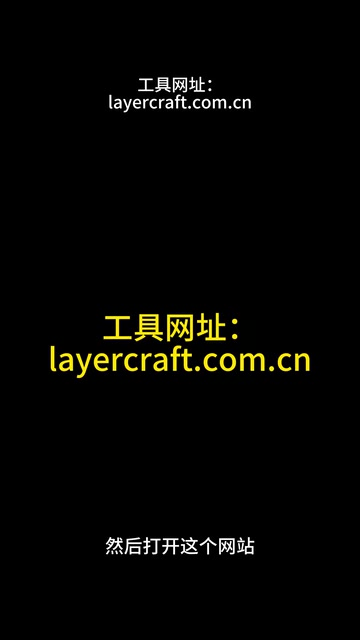
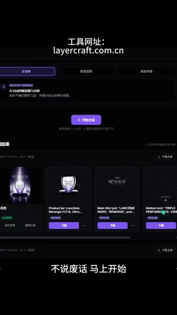
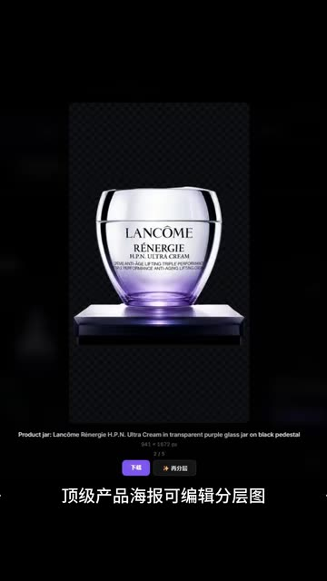

# 2分钟做出分层可编辑顶奢海报

> 来源：[Bilibili 视频](https://www.bilibili.com/video/BV1PgVF6CE1K) 
> UP 主：小圆圆有大宝贝｜发布时间：2026-05-26｜视频时长：47 秒｜画面规格：1440 × 2560（竖屏）

## 小结

这是一条展示 AI 海报分层工具的短视频。UP 主以一张兰蔻（LANCÔME）RÉNERGIE 面霜产品图为例，演示将产品海报拆分为可单独处理的图像、产品主体、主标题文字与底部文字等图层。

视频明确展示的工具网址为 `layercraft.com.cn`。从画面可见，操作路径是：上传/准备产品图片与文本描述，在网页内开始分层，随后查看生成的分层结果卡片，并可对单个图层进行下载或继续使用。

“2分钟”是视频标题和画面中的宣传性表达；当前素材对应的视频实际时长为 47 秒。视频没有展示完整计时过程、分层完成时长、账户门槛、收费标准、导出文件格式、图层在 Photoshop 等软件中的兼容性，因此不能据此确认“2分钟完成”是否适用于所有图片或所有使用环境。

本次 ASR 仅识别出约 5.49 秒语音，覆盖率为 11.75%，且将“顶奢”“分层”等词识别为“顶冰”“分财”。由于未提供可用的 Bilibili 站内字幕，正文以带时间戳的 ASR 为时间锚点，并结合关键帧中的可见界面文字与画面结构进行校正；无法从画面确认的操作细节均不作扩展。

适合需要快速制作产品视觉稿、希望将 AI 生成或产品海报拆成独立元素的平面设计、品牌电商设计与 AI 设计工具探索者参考。对于交付级商业设计，仍应自行测试文字识别准确度、边缘抠图质量、版权授权、导出格式与可编辑性。

## 思维导图

## 目录

- [演示目标与素材范围](#演示目标与素材范围-0001)
- [网页分层工具与入口](#网页分层工具与入口-0013)
- [结果：海报被拆成独立内容层](#结果海报被拆成独立内容层-0013)
- [可复用的操作步骤与检查项](#可复用的操作步骤与检查项-0013)
- [参数、限制与时效性](#参数限制与时效性-0013)
- [字幕比对](#字幕比对)
- [评论分析](#评论分析)
- [处理记录](#处理记录)

## 演示目标与素材范围 [00:01](https://www.bilibili.com/video/BV1PgVF6CE1K?t=1)

ASR 在 `00:00:01,550 → 00:00:06,300` 识别到：

> “两分钟就能给这款产品输出顶冰海报可编辑分”

结合标题“2分钟做出分层可编辑顶奢海报”、后续画面中的“顶级产品海报可编辑分层图”，可较有把握地校正其意图为：以产品素材生成/输出“顶奢（或顶级）海报”的可编辑分层结果。这里的“顶奢”属于标题定位，而不是对实际品质的可验证评级。

画面中的案例素材是一只标有 **LANCÔME RÉNERGIE** 的紫色面霜罐。首帧可见该图被放置在网页工具的编辑区域，上方显示图像尺寸为 **800 × 800**，文件大小显示约 **71.1 KB**。这两个数值是该演示素材在界面中的可见信息，不应外推为工具的上传限制。

> 图：关键帧展示了产品图片已被置入网页界面、图像信息显示为 800 × 800，以及下方存在文本输入/描述区域与紫色操作按钮。它说明该演示不是仅展示成品，而是从输入产品素材的网页工作流开始。

视频的展示重点不是从零设计完整海报，而是将已有产品海报视觉拆为便于后续编辑的组成部分。由于素材未展示实际导出后的文件目录或第三方编辑软件界面，所谓“可编辑”可确认到的是网页中呈现了分层结果，不能进一步断言其导出文件一定为 PSD、SVG 或其他特定格式。

## 网页分层工具与入口 [00:13](https://www.bilibili.com/video/BV1PgVF6CE1K?t=13)

视频在画面中反复给出工具网址：

**`layercraft.com.cn`**

视频简介也写有“攻击网站放在这里了 layercraft.com.cn”；其中“攻击网站”按原简介照录，画面语境和网址展示均指向工具网站入口，但不能仅凭该文字判断其是否为笔误。

ASR 在 `00:00:13,020 → 00:00:13,760` 识别为“财这个网站”。该短句缺少上下文，且“财”不符合画面。通过关键帧中连续、清晰出现的 “工具网址：layercraft.com.cn” 可校正其核心动作应为“打开这个网站”或近似表达；精确口语措辞无法从现有 ASR 确认。

> 图：画面以醒目的黄色文字给出 `layercraft.com.cn`，底部同时可见“然后打开这个网站”。该帧是确认工具入口与校正 ASR 短句的直接视觉依据。

进入工具后，画面显示一个深色网页界面：上部为功能/模式选择区域，中部存在“开始分层”按钮，下部为“结果”区域。由于关键帧分辨率和界面文字清晰度有限，除“开始分层”“结果”等可辨识词外，未将模糊的模式标签、计费信息或上传规则写入结论。

> 图：该帧同时包含网址、功能配置区域、“开始分层”按钮和下方结果卡片，是理解“输入—执行—输出”流程的核心画面证据。

## 结果：海报被拆成独立内容层 [00:13](https://www.bilibili.com/video/BV1PgVF6CE1K?t=13)

分层结果画面显示，原本由产品、背景、英文标题和底部文案构成的视觉稿被拆分为多个独立卡片。可从画面辨识的结果类型包括：

1. **整体图像/背景视觉**：保留紫黑色氛围、光效与产品海报构图。
2. **产品主体**：单独保留面霜罐与其底座。
3. **主标题文字**：画面中可见以 “LANCÔME RÉNERGIE” 为主体的文字内容卡片。
4. **底部文字**：单独呈现底部的英文文案/说明文字。

这说明工具的演示目标不是传统意义上仅做“人物/物品抠图”，而是尝试按海报语义结构分离视觉元素和文字元素。对于需要替换产品、修改标题、变更语言或重新排版的场景，这种分离具有潜在价值。

> 图：该帧展示面霜罐和底座从原海报中独立出来，透明棋盘格背景表明其以独立图层/透明背景预览形式呈现。它直观体现了“产品主体层”这一输出目标。

需要注意，预览图中的透明棋盘格通常表示透明区域，但视频未展示实际文件下载后是否仍保留 alpha 通道，也没有展示边缘放大检查。因此，不能从预览直接断定抠图边缘、半透明高光、玻璃材质细节和阴影都达到生产级精度。

## 可复用的操作步骤与检查项 [00:13](https://www.bilibili.com/video/BV1PgVF6CE1K?t=13)

以下步骤按视频可见的工作流整理；其中“检查项”是基于视频展示结果提出的验收建议，不是视频明示的功能承诺。

1. **准备产品图片**
   - 演示中使用方形产品图，界面可见素材信息为 `800 × 800`、约 `71.1 KB`。
   - 该数值仅代表案例图，不代表推荐尺寸、最大尺寸或大小限制。
   - 对于需要精细分层的海报，应优先使用产品边缘清楚、主体与背景反差较大的素材；这是基于分层任务的一般实践建议，视频未做对比测试。

2. **在工具网站中提供素材与描述**
   - 打开 `layercraft.com.cn`。
   - 从首帧可见，产品图下方有文本输入区域，右侧有紫色操作按钮。
   - 输入框中的具体提示词内容受清晰度限制无法可靠逐字转写，因此不应照抄模糊画面中的文字。

3. **启动分层**
   - 结果界面中央可见“开始分层”按钮。
   - 点击后，工具应进入生成/处理流程；首帧下部可见类似正在处理的状态区域。
   - 视频未展示排队时长、失败重试、取消任务或并发限制。

4. **在结果区逐层查看**
   - 在“结果”区域确认是否分别得到整体视觉、产品主体、主标题和底部文字等卡片。
   - 视频中每张卡片下方可见操作按钮，表明结果可被进一步操作；但按钮的完整文字、具体下载格式和授权规则未能可靠辨认。

5. **导出前进行人工验收**
   - 检查产品轮廓：瓶盖、罐体高光、底座边缘、阴影是否被误删或残留背景。
   - 检查文字：主标题与底部小字是否发生漏字、断笔、字符粘连或拆分不完整。
   - 检查层级：若后续要替换文案，应确认文字层不是已经栅格化为不可编辑像素。
   - 这些验收动作是保证商业使用质量的建议；视频本身没有展示验收界面或编辑器回导测试。

## 参数、限制与时效性 [00:13](https://www.bilibili.com/video/BV1PgVF6CE1K?t=13)

### 已在素材中出现的参数与事实

| 项目 | 可确认内容 | 证据来源 |
| --- | --- | --- |
| 视频时长 | 47 秒 | 视频元数据 |
| 视频画面 | 1440 × 2560，竖屏 | 视频元数据 |
| ASR 音频时长 | 46.72 秒 | ASR 诊断 |
| 案例图尺寸 | 800 × 800 | `frame-001.jpg` 可见界面信息 |
| 案例图大小 | 约 71.1 KB | `frame-001.jpg` 可见界面信息 |
| 工具入口 | `layercraft.com.cn` | `frame-003.jpg`、`frame-004.jpg` |
| 分层类别 | 至少可见整体图像、产品主体、主标题、底部文字 | `frame-003.jpg` |
| 标题宣称 | “2分钟做出分层可编辑顶奢海报” | 视频标题与画面文案 |

### 重要限制

- **“2分钟”未被过程验证**：视频时长不足一分钟，未展示从上传到导出完成的连续计时，也未说明该时长是否包含图片准备、注册、排队、下载和人工修图。
- **输出格式未公开**：素材没有明确显示 JPG、PNG、PSD、SVG、ZIP 或其他下载格式，不能把“分层”直接等同于 Photoshop 原生图层文件。
- **编辑能力未充分证明**：视频展示了独立结果卡片，但没有展示对文字内容重新输入、修改字体、移动元素或保存工程文件的过程。
- **案例单一**：仅展示了一个“单产品 + 深色背景 + 英文排版”的案例，不能据此推断复杂人物、多产品、中文长文案、细密发丝、镂空结构或透明材质的稳定效果。
- **品牌与版权风险**：案例画面含 LANCÔME 标识。视频没有说明该素材的授权状态；将品牌标识或他人素材用于商业投放前，应自行确认商标、图片和生成内容的使用权。
- **站点状态具有时效性**：网址、功能界面、处理速度、价格、登录条件和导出策略可能在视频发布后变更。本文仅记录本次采集素材中展示的状态，不构成对该网站当前可用性或服务能力的保证。

## 字幕比对

| 字幕来源 | 完整性 | 专有名词 | 时间轴 | 主要问题 |
| --- | --- | --- | --- | --- |
| Bilibili 站内字幕 | 未提供可用字幕 | 无法核验 | 无可用时间轴 | 本次素材未提供站内字幕文件或可用字幕文本 |
| 本次 ASR 字幕 | 较低：2 段、约 5.49 秒语音，覆盖率 11.75% | 较差：“顶奢”被识别为“顶冰”，“分层”疑似被截断；“打开”疑似识别为“财” | 可用：两段均有精确 SRT 起止时间 | 语句残缺、覆盖不足，无法单独支撑完整操作流程 |

本次 ASR 使用 `medium` 模型，识别语言为中文（语言置信度 `0.9780`），音频时长为 46.72 秒。诊断结果未标记 `noAudioStream=true`，因此可以确认源视频存在音轨；问题在于可识别语音内容少，而不是无音轨或工具读取失败。

最终字幕使用策略如下：

- **时间定位**：采用 ASR SRT 的真实分段时间，正文时间轴仅使用 `00:01` 和 `00:13` 两个有字幕锚点的位置。
- **语义校正**：将 ASR 中的“顶冰海报可编辑分”结合标题和画面校正为“顶奢/顶级产品海报可编辑分层图”的表达意图，但不虚构未识别到的完整原句。
- **工具名校正**：ASR 未可靠识别网址；依据画面中清晰、重复出现的文字，采用 `layercraft.com.cn`。
- **界面理解**：关于产品图、开始分层、结果卡片及可见的图层类别，依据关键帧进行多模态画面解读，不将其伪装成逐字字幕内容。

## 评论分析

本次仅获取到热评前三条，均为 0 点赞的简短互动评论，未包含工具使用细节、效果复现、价格信息或技术争议。因此，它们只能反映有限的早期互动氛围，不能作为工具能力的验证证据。

1. **动感蜡笔不新-**：“厉害呀～up[打call] 加油加油～可以蹲一个回关嘛……”
   - 观点：表达对 UP 主内容的赞许和鼓励。
   - 补充信息：无；主要是社交互动与回关请求。
   - 可信度与价值：不涉及实际体验、分层质量或网站可用性，不能用于验证视频主张。

2. **白鸢妤**：“支持一下up！”
   - 观点：表达支持。
   - 补充信息：无。
   - 可信度与价值：属于泛支持性评论，没有提供对工具、流程或输出文件的独立评价。

3. **YAKUSUKA**：“前排前排”
   - 观点：表明较早参与评论。
   - 补充信息：无。
   - 可信度与价值：没有技术内容，也没有形成争议或实测反馈。

## 处理记录

- Worker ID：`worker-mrj0www4-e8d79408`
- Agent 模型：`gpt-5.6-terra`
- ASR 模型：`medium`（CUDA、`float16`、自动语言识别为中文）
- 使用的素材工具链结果：已提供合并视频 `merged.mp4`、音频 `audio/audio.wav`、12 张关键帧、ASR SRT/分段 JSON、视频元数据和热评 JSON；未提供可用站内字幕。
- 字幕选择：站内字幕不可用；检查并采用本次 ASR 的真实 SRT 时间戳作为时间轴锚点。由于 ASR 仅两段且误识别明显，以关键帧可见文字对工具网址及“分层”语义进行有限校正。
- 关键帧选择依据：
  - `frames/frame-001.jpg`：显示案例产品、`800 × 800` 图像信息、文本输入区域和执行按钮。
  - `frames/frame-002.jpg`：显示产品主体从海报视觉中独立出来的透明背景预览。
  - `frames/frame-003.jpg`：显示网址、开始分层入口及结果卡片，是流程和输出类别的主要依据。
  - `frames/frame-004.jpg`：清晰显示 `layercraft.com.cn` 与“然后打开这个网站”，用于确认工具入口并校正 ASR。
- 缓存清理：未提供缓存清理执行记录；本整理未新增可报告的清理结果。
- 未解决问题：无法确认实际导出格式、登录/付费要求、任务耗时、文字图层是否可重新编辑、不同题材的分层稳定性，以及网站在整理时点之后的可用状态。
