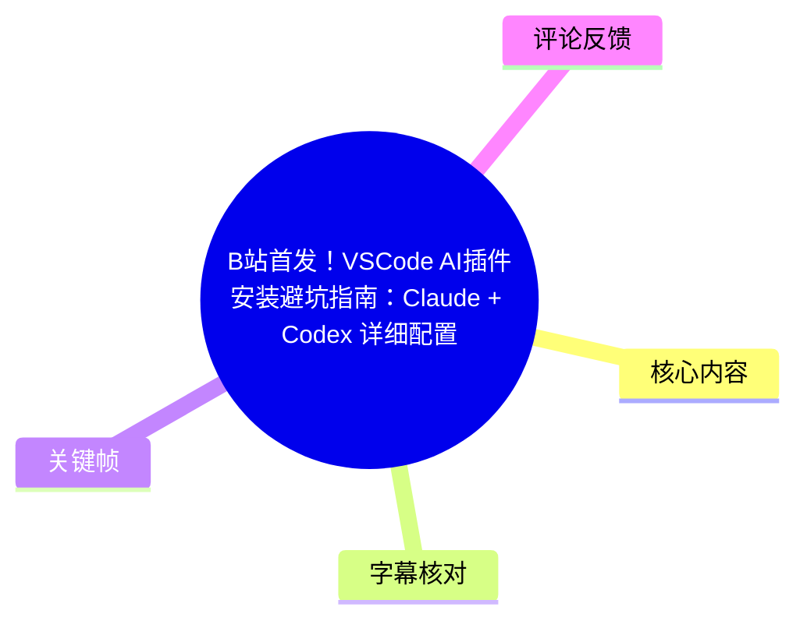
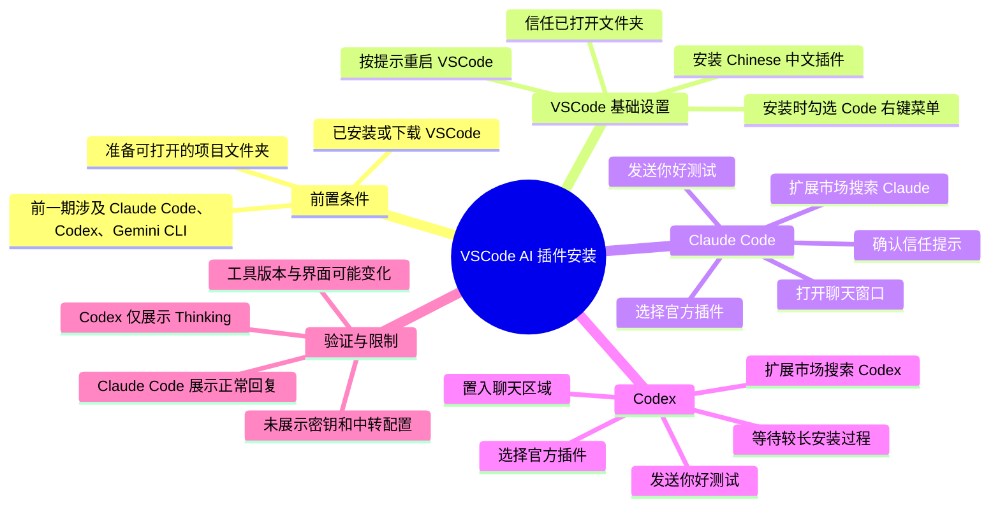
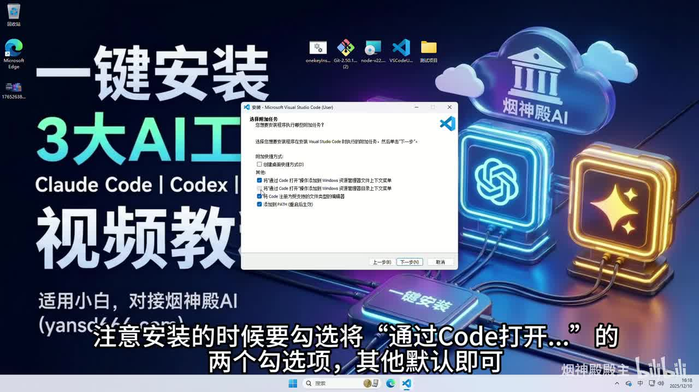
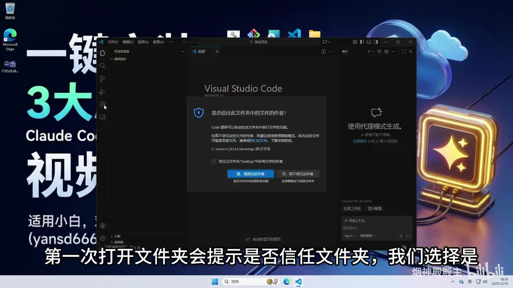
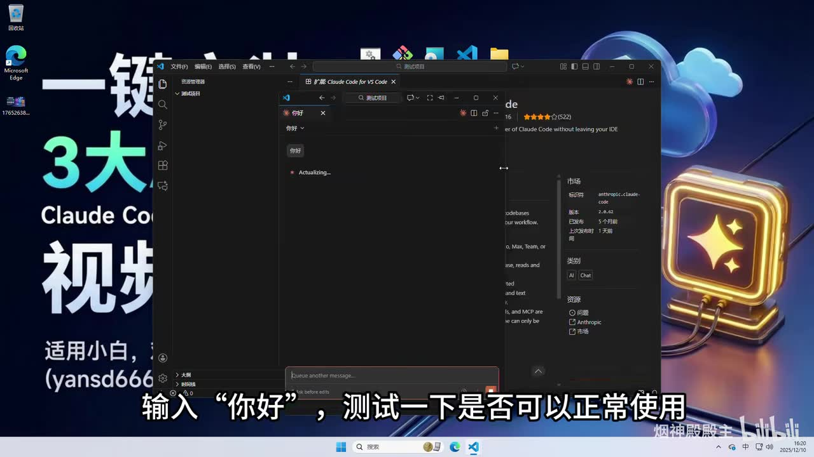
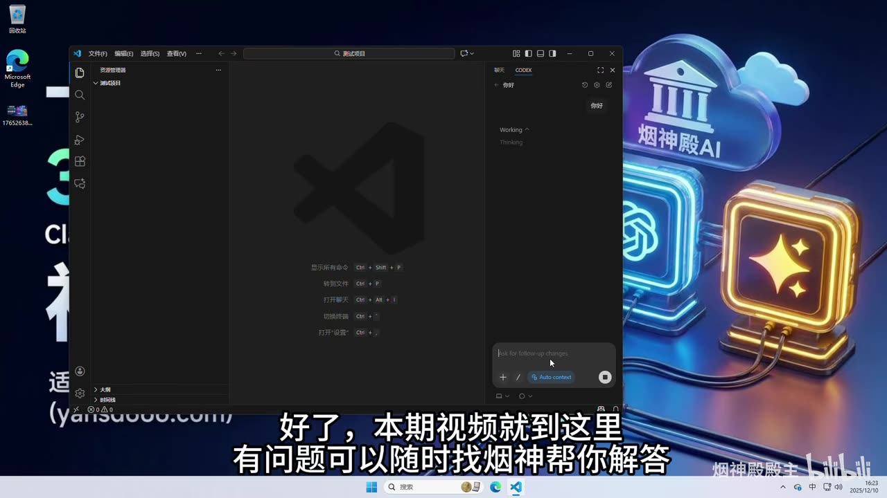

# B站首发！VSCode AI插件安装避坑指南：Claude + Codex 详细配置教程 (附演示)

> 来源：[Bilibili 视频](https://www.bilibili.com/video/BV1TYmgBtEX5) 
> UP 主：烟神殿殿主｜发布时间：2025-12-11｜时长：1 分 51 秒｜分辨率：1920×1080  
> 视频简介：烟神殿 AI 拥有“500+ 大模型 API 随便用！”  
> 数据抓取时视频统计：10,735 播放、180 收藏、39 投币、71 点赞、33 分享、7 条评论。

## 小结

这是一支面向 VSCode 新手的快速安装演示，重点是将 **Claude Code** 与 **Codex** 的官方 VSCode 扩展安装到本地编辑器中，并通过发送“你好”进行基础连通性测试。视频默认观众已经了解或已完成前一期介绍的 Claude Code、Codex 与 Gemini CLI 的安装前置。

最明确的避坑经验有两项：第一，安装 VSCode 时应勾选“通过 Code 打开”相关的两个 Windows 资源管理器右键菜单选项；第二，在扩展市场安装 Claude Code 和 Codex 时，要确认选择的是与演示一致的**官方插件**，避免因同名或相似插件导致安装对象错误。

操作顺序为：安装 VSCode → 安装中文语言插件并重启 → 打开项目文件夹并确认信任 → 安装 Claude Code → 打开其聊天窗口并测试 → 搜索安装 Codex → 将 Codex 界面置入/拖入 VSCode 聊天区域 → 再次发送测试消息。

视频展示了 Claude Code 的回复测试；Codex 部分则展示了“Working / Thinking”状态，但在画面结束前未展示实际回复。因此，视频只能证明其界面被打开并开始处理请求，**不能据此确认 Codex 已稳定完成响应、密钥配置无误或服务端连接完全正常**。

标题称为“详细配置教程”，但本片实际没有完整展示 API Key、账号登录、模型/中转地址、网络代理、权限策略或故障排查参数。评论中也出现了“Thinking 不回复”和“中转不来”的问题，说明扩展安装成功不等于后续调用链路已经可用。

## 思维导图

## 目录

- [背景、范围与时效性](#背景范围与时效性)
- [安装 VSCode 与中文界面](#安装-vscode-与中文界面)
- [打开项目并设置信任](#打开项目并设置信任)
- [安装及测试 Claude Code](#安装及测试-claude-code)
- [安装及测试 Codex](#安装及测试-codex)
- [完整操作清单与避坑点](#完整操作清单与避坑点)
- [结论、限制与排查边界](#结论限制与排查边界)
- [字幕比对](#字幕比对)
- [评论分析](#评论分析)
- [处理记录](#处理记录)

## 背景、范围与时效性 [00:00](https://www.bilibili.com/video/BV1TYmgBtEX5?t=0)

视频开头说明，UP 主上一期已介绍如何安装“Claude Code、Codex 和 Gemini CLI”；本期聚焦在 VSCode 内使用 Claude Code 与 Codex。由于本片只有 111 秒，属于安装路径演示，而不是从账号注册、密钥获取到项目级配置的完整文档。

视频画面运行于 Windows 桌面环境，且使用 VSCode 的扩展市场和工作区信任机制。因此，下文中关于资源管理器右键菜单、信任提示、重启提示的描述主要对应 Windows 版 VSCode；其他操作系统的菜单名称和位置可能不同。

工具、扩展发布者、认证方式以及 VSCode 聊天界面的布局都可能随版本更新变化。视频发布于 2025-12-11，而素材抓取于 2026-07-13；应将本片当作当时的界面与操作参考，安装前仍应核对扩展市场的发布者、权限和当前说明。

## 安装 VSCode 与中文界面 [00:08](https://www.bilibili.com/video/BV1TYmgBtEX5?t=8)

### 1. 安装阶段：保留“通过 Code 打开”的右键菜单入口

UP 主说明：若尚未安装 VSCode，先下载安装；安装器中应勾选“将通过 Code 打开……”相关的**两个勾选项**，其余项目可保持默认。结合关键帧可见，这两个选项是 Windows 文件资源管理器上下文菜单相关设置，分别面向文件与目录（文件夹）的“通过 Code 打开”功能。

视频口述估计安装过程约需 **2.5 分钟**，但该时长取决于电脑性能、下载速度和安装器版本；演示中对此过程进行了快进。

> 图：关键帧显示 VSCode 安装器的“选择附加任务”页面，画面中特别勾选了与“通过 Code 打开”相关的两个选项。它直接对应视频强调的安装避坑点：以后可在文件或文件夹的右键菜单中快速用 VSCode 打开目标。

### 2. 首次启动后安装中文插件

打开 VSCode 后，视频建议第一件事是安装中文插件。ASR 记录为“在插件搜索输入……点击入 Chinese”，缺少了完整搜索词；结合上下文可确定操作意图为在扩展市场搜索带有 **Chinese** 的中文语言扩展，并点击安装。

安装完成后，右下角会提示重启 VSCode。视频中的做法是点击重启，使界面语言切换生效。

> 注意：素材没有给出该中文插件的完整扩展 ID、发布者或精确名称。因此不能仅凭视频断言具体应安装哪一个同名扩展；实际操作应核对扩展页发布者与描述。

## 打开项目并设置信任 [00:33](https://www.bilibili.com/video/BV1TYmgBtEX5?t=33)

视频随后打开自己的项目文件夹，并用一个测试项目演示。首次打开文件夹时，VSCode 会弹出“是否信任此文件夹中的文件作者？”的工作区信任提示；UP 主在演示中选择“是，我信任此作者”。

> 图：关键帧完整呈现 VSCode 的工作区信任对话框，以及“是，我信任此作者”和“不，我不信任此作者”的选择。这张图说明视频不是无条件建议信任所有项目，而是在其自己的测试项目场景中选择信任。

### 工作区信任的适用边界

视频只演示“选择是”，没有解释安全含义。实际使用时，应仅对来源可确认的个人项目、团队仓库或受控测试目录授予信任；未知来源项目可能包含自动任务、脚本或扩展交互内容，不应因要安装 AI 插件而一律信任。

## 安装及测试 Claude Code [00:45](https://www.bilibili.com/video/BV1TYmgBtEX5?t=45)

### 1. 在扩展市场搜索并安装

视频要求在插件/扩展市场搜索“Claude”，安装 Claude Code 插件，并反复强调应选择**官方插件**、“一定要和我选的一样”。关键帧中的扩展详情页标题可见为 **“Claude Code for VS Code”**，右侧信息区显示发布者为 **Anthropic**；这为“官方插件”的判断提供了画面依据。

安装过程中出现信任确认时，视频选择“是”；随后等待约半分钟完成安装。这个“半分钟”是 UP 主的经验性等待时间，不是固定性能指标。

### 2. 打开聊天窗口并做最小测试

安装完成后，点击 VSCode 右上角的 Claude Code 图标，打开聊天窗口。视频说明聊天窗口可以单独拖出；演示中将其拖成独立浮动窗口。

在输入框发送“你好”，以此验证插件能否正常使用。视频判断标准是：**能够正常回复则“没什么问题”**。关键帧中可以看到聊天界面已经接收“你好”，并出现处理/回复过程。

> 图：关键帧同时显示 Claude Code 聊天窗口、扩展详情页及发布者 Anthropic 信息，并能看到输入“你好”的测试过程。它是确认“选择官方 Claude Code 扩展”和“通过聊天窗口验证基础响应”两项操作的核心证据。

### 本段未展示的配置内容

本段没有展示以下内容，因此无法从视频中恢复或复现：

- Claude Code 的登录页面、账号类型或授权流程；
- API Key 的输入位置与格式；
- 自定义 API Base URL、中转地址或代理设置；
- 模型选择、额度、计费和速率限制；
- 聊天窗口出现报错时的具体错误信息与解决办法。

## 安装及测试 Codex [01:15](https://www.bilibili.com/video/BV1TYmgBtEX5?t=75)

### 1. 搜索 Codex 并确认官方来源

接下来，视频在扩展搜索中输入“Codex”，安装 Codex 插件。UP 主再次强调要看清官方插件并与演示所选保持一致。与 Claude Code 相比，UP 主特别提示 Codex 的安装“可能比较久”，需要耐心等待；视频没有给出确定等待时长。

### 2. 将 Codex 放入聊天区域并发送测试消息

安装完成后，视频点击 VSCode 的聊天窗口，将 Codex 插件“拖到这个聊天窗口里面”，再输入“你好”测试。最后关键帧中，聊天面板顶部可见 “CODEX”，消息区可见“你好”，并显示：

- `Working`
- `Thinking`

> 图：关键帧展示 Codex 已被放入 VSCode 聊天区域，发送“你好”后界面处于 `Working / Thinking`。其价值在于精确界定视频实际验证到的状态：请求已提交并开始处理，但画面未展示最终文本回复。

### 验证结论应保持谨慎

ASR 口述中以“好了”结束，但该结论不能扩大解释为“Codex 已成功回复”。因为最终画面仍停留在 Thinking 状态，未出现响应内容。对于实际使用者，更可靠的验收标准应包括：

1. 插件安装完成且可在 VSCode 中打开；
2. 能够完成所需登录或密钥授权；
3. 提交消息后不长期停留在 Thinking；
4. 获得可见的正常回复，且没有鉴权、网络、额度或模型错误；
5. 如需编辑代码，再确认其在目标工作区内的读写和审批行为符合预期。

## 完整操作清单与避坑点 [00:08](https://www.bilibili.com/video/BV1TYmgBtEX5?t=8)

以下按视频实际顺序重组，未补充视频未展示的账号或密钥参数。

1. **安装 VSCode（未安装者）**
   - 下载并运行 VSCode 安装器。
   - 在附加任务中勾选两个“通过 Code 打开”相关选项。
   - 其余安装项按视频建议保持默认。
   - 视频经验值：安装约 2.5 分钟。

2. **切换中文界面**
   - 打开 VSCode。
   - 进入扩展市场，搜索含 `Chinese` 的中文插件。
   - 安装后按照右下角提示重启 VSCode。

3. **打开本地项目**
   - 打开自己的项目文件夹；视频使用测试项目演示。
   - 首次进入时出现工作区信任提示。
   - 仅在确认项目来源可信时，选择信任。

4. **安装 Claude Code**
   - 在扩展市场搜索 `Claude`。
   - 对照扩展名称、发布者等信息，选择视频所示官方 Claude Code 扩展。
   - 出现信任提示时，视频选择“是”。
   - 等待安装完成；视频口述约半分钟。

5. **测试 Claude Code**
   - 点击右上角 Claude Code 图标打开聊天窗口。
   - 可按需要将聊天窗口拖成独立窗口。
   - 发送“你好”。
   - 确认可收到正常回复。

6. **安装 Codex**
   - 在扩展市场搜索 `Codex`。
   - 仔细确认官方插件，避免安装同名/相似的非目标扩展。
   - 等待安装；视频提示该过程可能较久。

7. **测试 Codex**
   - 打开 VSCode 聊天窗口。
   - 按视频演示将 Codex 拖入聊天区域。
   - 输入“你好”并发送。
   - 不应仅以出现 `Thinking` 作为最终成功标准；应继续等待实际回复或检查报错。

### 视频明确强调的避坑点

| 场景 | 视频建议 | 可确认的效果或限制 |
| --- | --- | --- |
| VSCode 安装 | 勾选两个“通过 Code 打开”选项 | 便于从 Windows 资源管理器右键打开文件或文件夹。 |
| 中文化 | 安装 Chinese 中文插件并重启 | 可切换界面语言；未给出插件完整 ID。 |
| 首次打开项目 | 选择信任 | 视频在测试项目中这样操作；未知来源目录不应盲目信任。 |
| Claude Code 安装 | 选择官方插件 | 关键帧可见“Claude Code for VS Code”与 Anthropic 发布者信息。 |
| Codex 安装 | 看清官方插件、耐心等待 | 视频未给出 Codex 发布者或完整扩展 ID，需在当前扩展页自行核验。 |
| 联通测试 | 发送“你好” | Claude Code 展示了回复过程；Codex 最终画面只到 Thinking。 |

## 结论、限制与排查边界 [01:40](https://www.bilibili.com/video/BV1TYmgBtEX5?t=100)

本片最适合用于建立 VSCode 内 AI 编程插件的基础安装路径，尤其适合不熟悉扩展市场、工作区信任与聊天窗口入口的初学者。可迁移的原则是：**优先核验发布者、先做最小消息测试、不要将“装上了”误判为“服务已可用”。**

但视频没有提供可直接复制的配置项，例如 API Key、环境变量、代理端口、Base URL、模型名称、模型供应商、中转服务、订阅方案或网络要求。视频简介提及“500+ 大模型 API”，但没有在正片中展示该服务如何与 Claude Code 或 Codex 对接，亦未给出价格、兼容范围或安全说明；这些内容均不能依据本视频确认。

对于“输入消息后一直 Thinking”的情况，热评中已有用户提出类似问题。素材不足以定位原因，可能涉及但无法据视频验证的方向包括：登录/密钥授权未完成、网络连接异常、中转服务不可用、账户额度限制、模型服务端拥堵或扩展本身异常。排查时应优先查看扩展通知、输出日志、登录/授权状态与服务端返回的具体错误，而不是仅重复安装。

此外，视频未说明 Claude Code 与 Codex 能否同时启用、是否会共享聊天上下文、各自是否需要独立授权、是否会读取工作区文件，或在编辑代码时如何进行变更审批。涉及真实项目代码时，应先在测试目录验证权限范围与数据处理方式。

## 字幕比对 [00:00](https://www.bilibili.com/video/BV1TYmgBtEX5?t=0)

| 字幕来源 | 完整性 | 专有名词 | 时间轴 | 主要问题 |
| --- | --- | --- | --- | --- |
| Bilibili 站内字幕 | 未提供可用字幕 | 无法评估 | 无法评估 | 素材明确标注“未提供可用站内字幕”。 |
| 本次 ASR 字幕 | 覆盖全片主要口述流程 | 存在多处识别偏差 | 仅提供按顺序排列的文本，未提供逐句时间戳 | 将 VSCode、Claude Code、Codex 等专有名词识别为“Visgo”“Cloud Code”“VSCale”等；个别搜索词不完整。 |

本次任务已执行 ASR。由于没有可用的站内字幕，正文以**本次 ASR 为主**，再利用视频标题、关键帧中的扩展页面文字和上下文进行有限校正。

重要校正如下：

| ASR 识别结果 | 正文采用表述 | 校正依据 |
| --- | --- | --- |
| `Cloud Code` | Claude Code | 视频标题写明 Claude；关键帧可见 “Claude Code for VS Code”。 |
| `Visgo` / `Vsgo` | VSCode / Visual Studio Code | 视频标题与关键帧中的 Visual Studio Code 界面。 |
| `VSCale Codex` | VSCode 中使用 Claude Code 和 Codex | 上下文是“在 VSCode 中使用”，且后文分别安装 Claude Code 与 Codex。 |
| `插鍵` / `插键` | 插件 / 扩展 | 语义对应 VSCode 扩展市场。 |
| `安裱` | 安装 | 上下文为下载、安装与重启流程。 |

校正仅限能够被标题、画面或连续语义支持的术语；对于 ASR 未识别出的中文插件完整名称、Codex 扩展发布者、密钥步骤等，未进行猜测补写。

## 评论分析 [01:42](https://www.bilibili.com/video/BV1TYmgBtEX5?t=102)

以下仅处理本次可获取的热评前三条，共三条。评论代表个人使用反馈或需求，不等同于已验证的技术结论。

1. **用户 771717771（4 赞）**  
   评论称：在 VSCode 配置插件、输入密钥进入 Codex 后，向 GPT 发送消息一直处于 Thinking 而不回复，询问是否未连接成功。  
   - 这与视频末尾 Codex 停留在 `Working / Thinking` 的画面形成呼应，说明“安装后长期 Thinking”是至少一位观众实际遇到的现象。  
   - 评论补充了“输入密钥”这一视频正片未展示的步骤，但没有给出密钥类型、报错日志、网络环境或等待时长，无法据此确认根因是连接失败。  
   - 对观众的启示是：应以最终回复或明确错误信息作为验收条件，而非仅以聊天页面打开为准。

2. **用户 非常热爱自然（1 赞）**  
   评论称：“中转不来怎么办”。  
   - 该评论表明部分用户可能依赖“中转”链路访问服务，且存在配置或连接困难。  
   - 原视频没有展示中转地址、接入方式、兼容性要求或故障处理，因此无法从视频中给出具体配置答案。  
   - 该问题也提示读者：视频的“安装插件”范围与“让模型服务可通过中转稳定调用”是两个不同层级的问题。

3. **用户 morpeko77（0 赞）**  
   评论询问何时能出 PyCharm 配置教程。  
   - 这反映观众希望将相似工作流扩展到 JetBrains/PyCharm 生态。  
   - 但本视频全程以 VSCode 为对象，菜单、扩展安装机制、聊天集成方式均不能直接迁移为 PyCharm 步骤。  
   - 因此，该评论属于后续教程需求，不构成 PyCharm 已支持相同配置流程的证据。

## 评论分析

本次流程未获取到可用热评，因此不推断观众态度或额外结论。

## 处理记录

- Worker ID：`worker-mrj0www4-e8d79408`
- 模型：`gpt-5.6-terra`
- 调用工具与素材：任务提供的元数据、视频素材清单、ASR 字幕、4 张关键帧及热评数据；未提供可用的 Bilibili 站内字幕。
- 使用的应用工具：基于已提供的素材进行文本整理、关键帧对照与评论归纳；未获得可验证的外部浏览、命令执行或扩展市场实时查询记录，未将其编造为已执行操作。
- 字幕选择：站内字幕不可用；已执行本次 ASR，并以 ASR 为主体。对 Claude Code、VSCode、Codex 等由画面和标题可确认的术语作了校正；未能确认的信息保留不确定性。
- 关键帧选择依据：
  - `frames/frame-001.jpg`：直接展示 VSCode 安装器中“通过 Code 打开”相关勾选项，支撑安装避坑说明。
  - `frames/frame-002.jpg`：展示工作区信任提示，支撑项目打开与信任边界说明。
  - `frames/frame-003.jpg`：展示 Claude Code for VS Code、Anthropic 发布者信息及“你好”测试，支撑官方插件与连通性测试说明。
  - `frames/frame-004.jpg`：展示 Codex 的 `Working / Thinking` 状态，支撑“尚未看到最终回复”的限制判断。
- 缓存清理：素材清单未提供缓存清理执行回执；为避免编造，记录为**未获得可验证的缓存清理结果**。
- 未解决问题：
  - 视频未展示 Claude Code 和 Codex 的账号、密钥、中转、网络及模型配置。
  - Codex 测试最终是否成功回复无法由末帧确认。
  - 中文插件的精确扩展 ID、Codex 扩展的发布者与版本均未在可用素材中完整确认。
  - 热评提出的 Thinking 卡住与中转失败问题缺少日志，无法定位根因。
