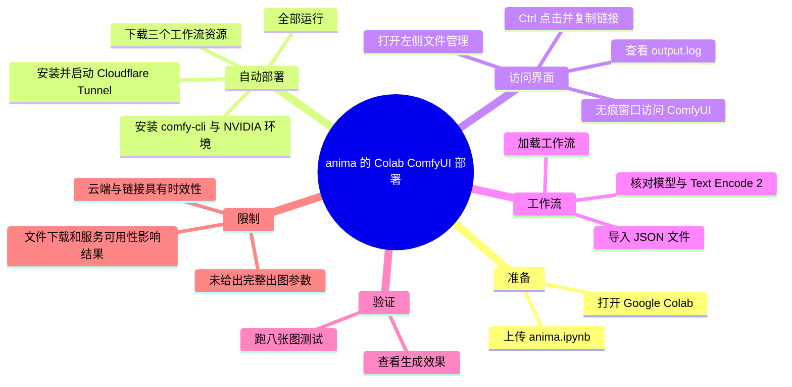
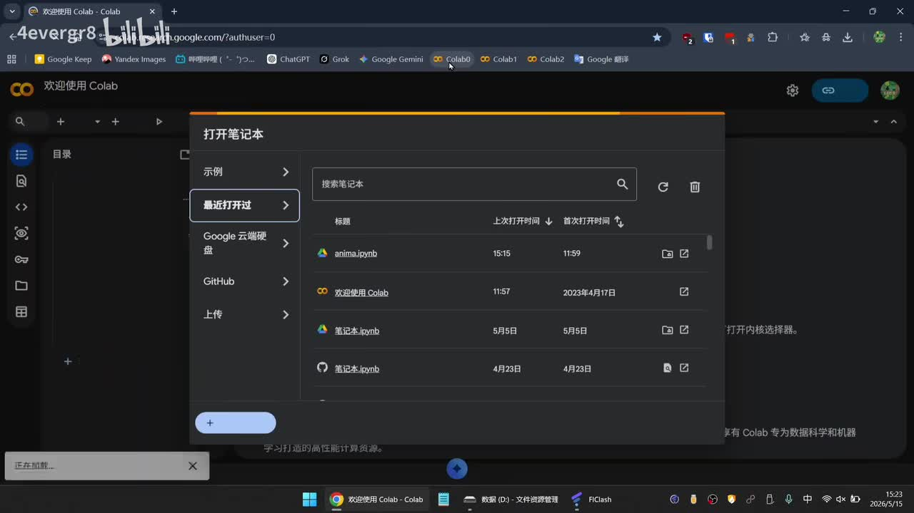
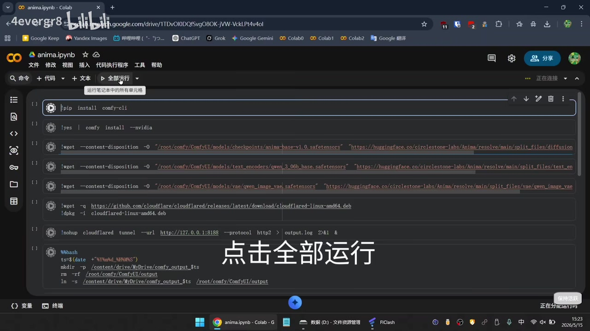
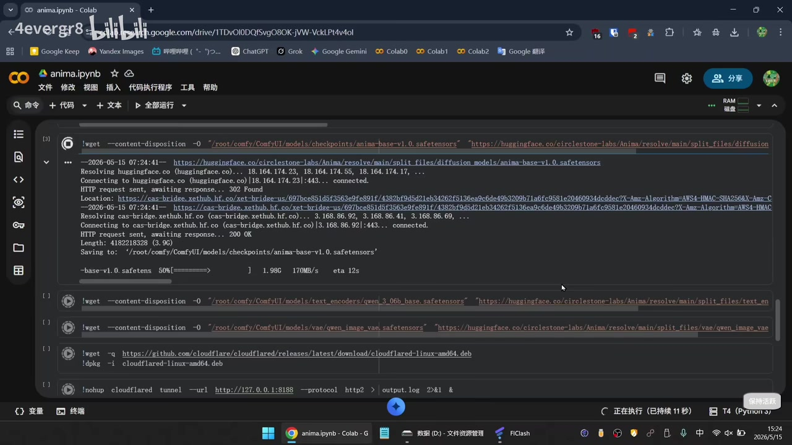

# 新模型anima，ComfyUI一键部署教程

> 来源：[Bilibili 视频](https://www.bilibili.com/video/BV1NJ5v67ESN)  
> UP 主：4evergr8｜视频时长：2 分 13 秒｜分辨率：1920×1080  
> 标签：绘画、云端、模型、AI 绘画、anima、经验分享  
> 时效提示：视频元数据发布时间为 2026-05-15；其中 Colab、ComfyUI CLI、Cloudflare Tunnel、Hugging Face 文件地址及模型文件命名均可能随服务或项目更新而变化。

## 小结

视频演示了一个通过 **Google Colab 部署 ComfyUI 并加载 anima 工作流**的短流程。核心思路是：上传 `anima.ipynb` 笔记本，在 Colab 内一次性运行安装、模型下载与隧道启动单元，再从 `output.log` 取得访问链接，最后在浏览器中导入 JSON 工作流并执行出图测试。

从画面可见，笔记本并非只安装 ComfyUI：它还通过 `comfy-cli` 安装 NVIDIA 环境所需版本，并下载至少三个资源文件，分别涉及 **anima 基础模型、文本编码器和 VAE**。因此，工作流能否正常加载，取决于这些文件是否完成下载、是否位于工作流期待的目录，以及云端运行环境能否持续可用。

视频中特别使用 Cloudflare Tunnel 将 Colab 内本地地址 `127.0.0.1:8188` 暴露为外部可访问链接。教程给出的操作是从日志中按住 `Ctrl` 点击链接、复制后在无痕窗口打开；这是作者演示的访问路径，不等同于所有网络环境都必须采用无痕窗口。

工作流导入后，作者指出其中的模型节点、`Text Encode 2` 等组件对应此前下载的三个文件，并执行“跑八张图”的测试。视频口述与站内字幕都没有展示具体提示词、采样器、分辨率、步数、种子、显存占用、单张耗时或最终图片保存路径，因此不能据此复现完整生成参数，也不能将评论中的效果评价视为严格性能结论。

本视频适合已有 Google 账号、能使用 Colab、并具备基础 ComfyUI 工作流操作能力的用户。它是部署路径演示，不是 anima 模型原理、授权范围、提示词写法或画质横评；实际操作前仍应自行核对模型来源、文件完整性、服务条款和计算资源限制。

## 思维导图

## 目录

- [部署目标、前置条件与时效性](#部署目标前置条件与时效性)
- [在 Colab 上传并运行笔记本](#在-colab-上传并运行笔记本)
- [通过日志取得 ComfyUI 访问地址](#通过日志取得-comfyui-访问地址)
- [导入 JSON 工作流与模型对应关系](#导入-json-工作流与模型对应关系)
- [执行八张图测试与结果边界](#执行八张图测试与结果边界)
- [完整操作步骤](#完整操作步骤)
- [限制、风险与可迁移经验](#限制风险与可迁移经验)
- [字幕比对](#字幕比对)
- [评论分析](#评论分析)
- [处理记录](#处理记录)

## 部署目标、前置条件与时效性 [00:00:00](https://www.bilibili.com/video/BV1NJ5v67ESN?t=0)

视频从打开 Google Colab 开始，目标是在其云端运行环境中启动 ComfyUI，并为 anima 工作流准备模型资源。画面显示作者使用浏览器打开 Colab 的“打开笔记本”窗口，随后从“上传”入口导入笔记本。

> 图：该帧确认教程的起点是 Google Colab，且作者实际使用的笔记本名称为 `anima.ipynb`；它有助于区分“上传工作流 JSON”和“上传 Colab 笔记本”这两个不同阶段。

### 前置条件与环境依赖

依据视频画面和字幕，完成该流程至少需要：

1. 可登录并能打开 Google Colab 的浏览器环境。
2. 本地持有作者所用的 `anima.ipynb` 笔记本文件。
3. 能在 Colab 中运行安装与下载命令的计算环境；画面中出现“连接”状态和 NVIDIA 安装参数，表明流程依赖可用的云端运行时。
4. 可访问模型下载源、GitHub 和 Cloudflare Tunnel 的网络条件。
5. 用于导入 ComfyUI 的 JSON 工作流文件。

视频没有交代笔记本和 JSON 工作流的下载来源、模型许可证、Colab 的运行时配置方法、免费/付费资源差异、磁盘配额或所需显存。因此这些都是部署前需要自行确认的外部条件，而非视频已验证的固定参数。

## 在 Colab 上传并运行笔记本 [00:00:09](https://www.bilibili.com/video/BV1NJ5v67ESN?t=9)

站内字幕将文件描述为“IPYNB 文件”；本次 ASR 将其识别成“IPY MB 文件”。结合关键帧中的文件名 `anima.ipynb`，此处应校正为 **上传 `.ipynb` 格式的 Colab/Jupyter 笔记本**。

### 上传与一键运行 [00:00:09](https://www.bilibili.com/video/BV1NJ5v67ESN?t=9)

作者在 Colab 的上传页执行笔记本上传，随后打开 `anima.ipynb`。在约 00:24 处，视频明确提示点击“全部运行”。

> 图：该帧展示“全部运行”的真实位置及笔记本单元结构，是确认该视频采取批量执行而非逐单元手动执行的重要依据。

关键帧可辨识出的笔记本操作包括：

- `!pip install comfy-cli`
- `!yes | comfy install --nvidia`
- 下载 anima 基础模型至 ComfyUI 的 `models/checkpoints` 路径；
- 下载文本编码器至 `models/text_encoders` 路径；
- 下载 VAE 至 `models/vae` 路径；
- 下载并安装 `cloudflared`；
- 用 `cloudflared tunnel` 将 `http://127.0.0.1:8188` 通过 HTTP/2 暴露，并把输出重定向到 `output.log`。

从截图中可读到的三个资源文件名为：

| 用途 | 画面中可见的文件名 | 目标目录 |
| --- | --- | --- |
| 基础模型 | `anima-base-v1.0.safetensors` | `/root/comfy/ComfyUI/models/checkpoints/` |
| 文本编码器 | `qwen_3_06b_base.safetensors` | `/root/comfy/ComfyUI/models/text_encoders/` |
| VAE | `qwen_image_vae.safetensors` | `/root/comfy/ComfyUI/models/vae/` |

> 文件名按关键帧可见文本整理。视频没有提供文件校验值、精确文件体积要求或下载失败后的重试处理，不应假定下载完成即代表文件无误。

### 等待下载与执行完成 [00:00:29](https://www.bilibili.com/video/BV1NJ5v67ESN?t=29)

作者在这里说明“先加速一下”，即视频对等待过程做了快进。关键帧显示 `anima-base-v1.0.safetensors` 正在下载，终端行中可见其保存目标位于 checkpoints 目录，且下载进度处于中途。

> 图：该帧的价值在于表明“一键部署”仍包含真实的安装和大文件下载等待，不是瞬时完成；也直接佐证了基础模型、文本编码器、VAE 及隧道组件的依赖关系。

作者在约 00:38 提示运行到“最后一个”；站内字幕随后说明应打开左侧文件管理。此处 ASR 把“运行到最后一个快写”误识别为“运行了最后一个快写”，但二者结合画面与站内字幕可理解为：等待笔记本执行到最后一个相关单元后，转到文件管理器寻找日志。

## 通过日志取得 ComfyUI 访问地址 [00:00:44](https://www.bilibili.com/video/BV1NJ5v67ESN?t=44)

视频给出的访问步骤如下：

1. 在 Colab 左侧打开文件管理。
2. 双击 `output.log`，在右侧查看日志。
3. 按住 `Ctrl` 后点击日志中的链接，在新窗口打开。
4. 复制链接后，在浏览器无痕窗口打开。
5. 当页面加载完成，即进入 ComfyUI 界面。

站内字幕在 00:48—00:56 对该段拆分较细，ASR 将“链接”误写成“铁接”、将“无痕窗口”误写成“无痕窗户”，但动作顺序一致。最终应以站内字幕的分段和关键术语为准。

### 关于 `output.log` 与隧道地址

关键帧中的笔记本命令可见，Cloudflare Tunnel 的输出被写入 `output.log`。因此该文件在本教程中不是 ComfyUI 的普通生成日志，而是获取外部访问地址的关键入口。视频没有展示日志内的具体 URL，也没有说明 URL 的有效期、访问认证、失败码或如何关闭隧道。

在约 01:02—01:05，作者明确说明“可以看到进入了 ComfyUI 的界面”。由于本次提供的关键帧未包含该界面本体，本文只记录其作为视频陈述，不补充未显示的 ComfyUI 页面配置。

## 导入 JSON 工作流与模型对应关系 [00:01:17](https://www.bilibili.com/video/BV1NJ5v67ESN?t=77)

进入 ComfyUI 后，作者操作为“上传 JSON 文件，加载工作流”。站内字幕写为“JASON 文件”，ASR 写为“Jason 文件”；结合 ComfyUI 工作流通常使用的格式以及字幕语境，此处校正为 **JSON 文件**，并非名为 Jason 的特定文件。

### 工作流与三个下载文件的关系 [00:01:27](https://www.bilibili.com/video/BV1NJ5v67ESN?t=87)

作者说明：工作流里的模型、`Text Encode 2` 等节点，对应此前下载的三个文件。站内字幕将模型名转写为“VV1”，ASR 为“VVE”；这两个写法均无法可靠确认具体节点/模型名。关键帧能明确确认的，是笔记本下载了基础模型、文本编码器与 VAE 三类文件，而非“VV1”或“VVE”的精确拼写。

因此，实际排障应按资源类型核对：

| 工作流所需资源类型 | 视频中对应的已下载文件 | 应核对的事项 |
| --- | --- | --- |
| Checkpoint / 基础模型 | `anima-base-v1.0.safetensors` | 是否在 `models/checkpoints` 下、节点下拉列表能否选到 |
| Text Encoder | `qwen_3_06b_base.safetensors` | 是否在 `models/text_encoders` 下、文本编码节点是否匹配 |
| VAE | `qwen_image_vae.safetensors` | 是否在 `models/vae` 下、VAE 加载节点是否能解析 |

视频未展示 JSON 工作流的节点图、节点版本、缺失节点报错、提示词内容及各节点连接关系。若导入后出现红色缺失节点或模型下拉框为空，不能仅凭本视频判断原因；可能涉及文件路径、文件名、下载不完整、ComfyUI/自定义节点版本不匹配等，但视频未逐项验证。

## 执行八张图测试与结果边界 [00:01:42](https://www.bilibili.com/video/BV1NJ5v67ESN?t=102)

作者表示“先跑八张图测试一下”，随后在约 01:53 说“直接看效果”。这是视频对部署成功后的功能性验证：工作流可被执行，并尝试批量生成 8 张图片。

需要严格区分以下事实：

- **视频明确陈述**：作者运行了八张图测试，并展示效果。
- **可由字幕确认**：测试数量是八张。
- **视频未提供的信息**：八张图的实际分辨率、批次参数、采样器、迭代步数、CFG、种子、提示词、负面提示词、单张耗时、GPU 型号、显存占用、输出目录和完整成图细节。
- **不能据此得出的结论**：无法根据该视频量化 anima 的画质、稳定性、人物一致性、是否“完全不串”、与其他模型的优劣，或在其他设备上的速度。

视频总时长为 133 秒，但带语音的 ASR 最后一句结束于约 114.32 秒；后续约 19 秒没有可用口述内容。提供的字幕也止于“直接看效果”，因此本文不对末尾画面作超出素材的推断。

## 完整操作步骤 [00:00:00](https://www.bilibili.com/video/BV1NJ5v67ESN?t=0)

以下按视频实际顺序整理，并将站内字幕、ASR 与关键帧可以相互印证的部分合并。没有出现在素材中的命令参数和页面设置不作补写。

1. **打开 Google Colab**（00:00:00—00:00:02）。  
   在 Colab 的“打开笔记本”窗口准备导入文件。

2. **上传 `anima.ipynb`**（00:00:09—00:00:11）。  
   从上传入口选择 `.ipynb` 笔记本。不要把此文件与稍后导入 ComfyUI 的 JSON 工作流混为一谈。

3. **在笔记本中点击“全部运行”**（00:00:24—00:00:26）。  
   画面显示该操作会串行执行 ComfyUI 安装、模型下载、Cloudflare 安装与隧道启动相关单元。

4. **等待执行，视频在此处快进**（00:00:29—00:00:31）。  
   期间可见基础模型正在下载。必须等待最后涉及启动/隧道的单元完成，视频没有给出固定等待时长。

5. **打开左侧文件管理器并查看 `output.log`**（00:00:40—00:00:48）。  
   双击该日志文件，使其显示在右侧区域。

6. **打开日志中的外部访问链接**（00:00:48—00:00:56）。  
   按住 `Ctrl` 点击链接，在新窗口打开；再复制链接并在无痕窗口访问，这是作者演示的做法。

7. **确认进入 ComfyUI**（00:01:02—00:01:05）。  
   若无法进入，视频未提供诊断流程；应优先检查最后一个单元、`output.log` 是否生成及其中是否存在可访问地址。

8. **上传 JSON 文件并加载工作流**（00:01:17—00:01:20）。  
   导入的是工作流 JSON，而不是前述 `.ipynb`。

9. **核对工作流资源**（00:01:27—00:01:33）。  
   模型、文本编码器和 VAE 应对应笔记本已下载的三个资源文件。视频没有展示手动指定路径的操作。

10. **运行八张图进行测试**（00:01:42—00:01:45）。  
    该测试仅证实作者在视频中尝试了八图输出；生成参数没有公开。

11. **查看效果**（00:01:53—00:01:54）。  
    视频没有在可用字幕中提供对效果的量化评价或横向对比。

## 限制、风险与可迁移经验 [00:01:42](https://www.bilibili.com/video/BV1NJ5v67ESN?t=102)

### 视频覆盖到的经验

- 将环境安装、依赖下载、模型放置和外部访问通道写进同一 Colab 笔记本，能把手动部署步骤压缩为“上传后全部运行”。
- ComfyUI 工作流依赖的不只是 checkpoint；视频至少还准备了独立文本编码器与 VAE。导入工作流前先确保三类资源就位，有助于减少模型找不到的问题。
- 对于云端临时环境，将本地服务输出写入 `output.log`，再通过日志取得公网入口，是视频采用的连接方式。
- 先做小规模批次测试（本例为 8 张）可作为工作流可运行性的初步检查，但不等同于性能或质量评测。

### 未展示或不可验证的部分

1. **资源来源与授权**：画面可见 Hugging Face 相关下载地址，但视频没有讲解模型许可证、使用边界、是否需登录或访问令牌。
2. **参数缺失**：没有给出生成参数及工作流 JSON 内容，无法做到结果级复现。
3. **硬件与配额缺失**：画面右下角可见 Colab 运行时信息，但视频没有系统说明 GPU 规格、显存需求、磁盘占用或 Colab 额度。
4. **网络风险**：模型下载、GitHub 下载、Cloudflare Tunnel 都依赖外部服务；网络受限、下载中断或服务策略变化均可能导致流程失败。
5. **链接风险**：隧道链接通常与当前运行会话有关；视频没有说明其长期有效性、认证设置或重启后的恢复方法。
6. **版本风险**：`comfy-cli`、ComfyUI、Cloudflare 和模型仓库均有更新可能。笔记本在视频发布日可用，不代表后续仍能无修改运行。
7. **安全与隐私**：将本地服务通过隧道公开访问会产生外部入口。视频没有展示访问控制设置，实际使用时应审慎处理链接传播与敏感内容。

## 字幕比对 [00:00:00](https://www.bilibili.com/video/BV1NJ5v67ESN?t=0)

| 字幕来源 | 完整性 | 专有名词 | 时间轴 | 主要问题 |
| --- | --- | --- | --- | --- |
| Bilibili 站内字幕 | 覆盖 00:00:00.080—00:01:54.640 的主要口述步骤，共 21 段 | `COLAB`、`output log`、`CTRL` 较清晰；将 `.ipynb`、JSON、ComfyUI 和节点名存在误转写 | 时间分段细，适合作为操作定位主依据 | “项圈ABANB”“come for ui”“JASON”“VV1”等表述不准确 |
| 本次 ASR（medium） | 覆盖 11 段、约 35.22 秒语音；诊断语音覆盖率 26.64%，最后语音在 00:01:54.320 | 能较好识别 Colab、Output Log、Control；将 `.ipynb`、JSON、ComfyUI、链接等误识别 | 有真实起止时间戳；与站内字幕的关键操作时点高度接近 | 句子合并较多，如将 00:44—00:55 连成一段；存在“铁接”“无痕窗户”等识别错误 |

### 最终字幕选择与校正

本文采用 **站内字幕的细粒度时间轴** 作为章节链接优先依据，并以本次 ASR 的时间段复核语音覆盖和步骤顺序；对于专有名词，以关键帧中可见界面和文件名进行校正。

重要校正如下：

| 原始转写 | 采用写法 | 校正依据 |
| --- | --- | --- |
| “项圈ABANB” / “IPY MB” | `.ipynb` 笔记本文件 | 关键帧显示 `anima.ipynb` |
| “come for ui” / “Comfu UI” | ComfyUI | 视频标题、界面语境及笔记本命令 |
| “JASON” / “Jason” | JSON 工作流文件 | ComfyUI 工作流导入语境 |
| “铁接” | 链接 | 站内字幕及上下文动作 |
| “无痕窗户” | 无痕窗口 | 站内字幕 |
| “VV1” / “VVE” | 不强行确定具体模型节点名 | 两套字幕均未提供可靠拼写；仅确认其对应三个已下载资源 |

ASR 诊断未标记 `noAudioStream=true`，且音频识别到中文语音，因此源视频具有可用音轨；不存在“无音轨而改用画面/站内字幕”的情形。

## 评论分析 [00:01:53](https://www.bilibili.com/video/BV1NJ5v67ESN?t=113)

本次仅获取到 2 条热评，少于“热评前三条”的上限；以下只分析可获取内容，不补足不存在的第三条。

1. **禾几子965117243｜37 赞**  
   评论：“效果非常好，完全不串。”  
   该评论表达了对生成效果及可能的主体/内容一致性的正面主观感受，但未提供提示词、样图、参数或复现条件。“完全不串”不是视频素材中可独立验证的技术指标，不能据此推导 anima 在所有任务上的稳定性。

2. **想笑就笑吧v｜7 赞**  
   评论：“还有colab的事。”  
   该评论以调侃方式指出教程仍涉及 Colab，反映出云端环境可能是观看者关注点或使用门槛。它没有提供具体技术补充，也没有否定视频流程本身。

## 评论分析

- 热评 1：效果非常好，完全不串。[doge_金箍]
- 热评 2：还有colab的事[doge]

以上内容是观众反馈摘录，只用于补充理解视频反响，不作为正文事实依据。

## 处理记录

- Worker ID：`worker-mrj0www4-e8d79408`
- 模型：`gpt-5.6-terra`
- 可用素材与工具产物：视频元数据、站内 SRT、ASR `medium` 的 `asr-result.json` 与 SRT、关键帧、热评 JSON。
- ASR 检查：已检查本次 ASR；识别语言为中文，语言置信度 `0.98779296875`，音频时长约 `132.19` 秒，语音覆盖率 `26.64%`，未标记 `noAudioStream=true`。
- 字幕选择：以站内 SRT 的细分时间轴为主，以 ASR 核对口述顺序；对 `.ipynb`、ComfyUI、JSON、链接和无痕窗口等术语结合关键帧修正。
- 关键帧选择依据：选用 `frame-001` 证明 Colab 与 `anima.ipynb`，`frame-003` 证明“全部运行”及笔记本单元，`frame-004` 证明模型下载、文件目录和 Cloudflare 依赖；其余未在正文插图，是因为所提供画面中上述三帧对操作链路的信息密度最高。
- 热评处理：仅分析实际可获取的 2 条热评，未编造第三条。
- 缓存清理：素材清单未提供缓存清理执行记录；本文不声称已执行清理。
- 未解决问题：笔记本与 JSON 的获取来源、完整工作流结构、实际生成参数、模型许可、所需资源规格、隧道 URL 内容及最终出图细节均未在给定素材中完整呈现。
