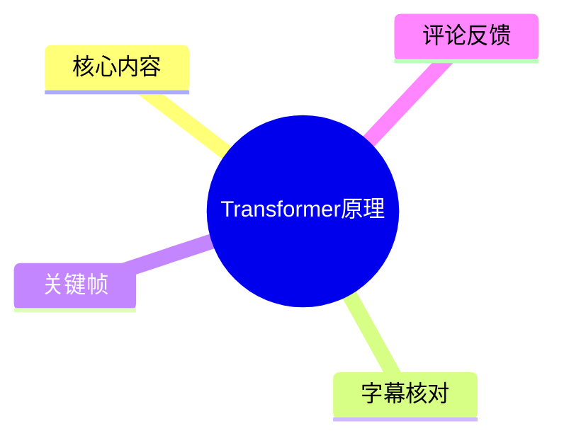
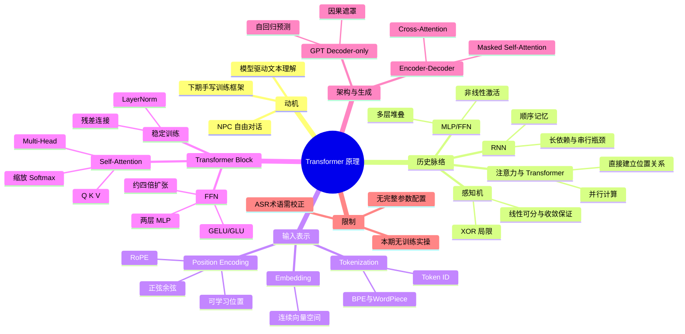
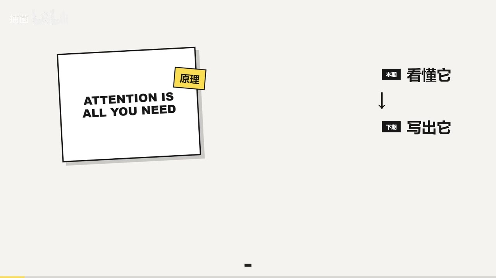
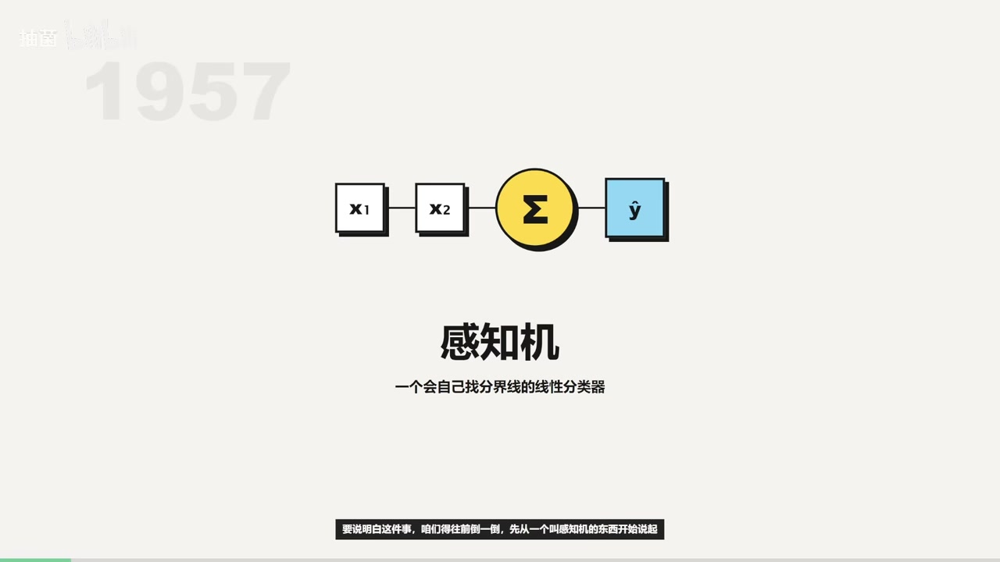
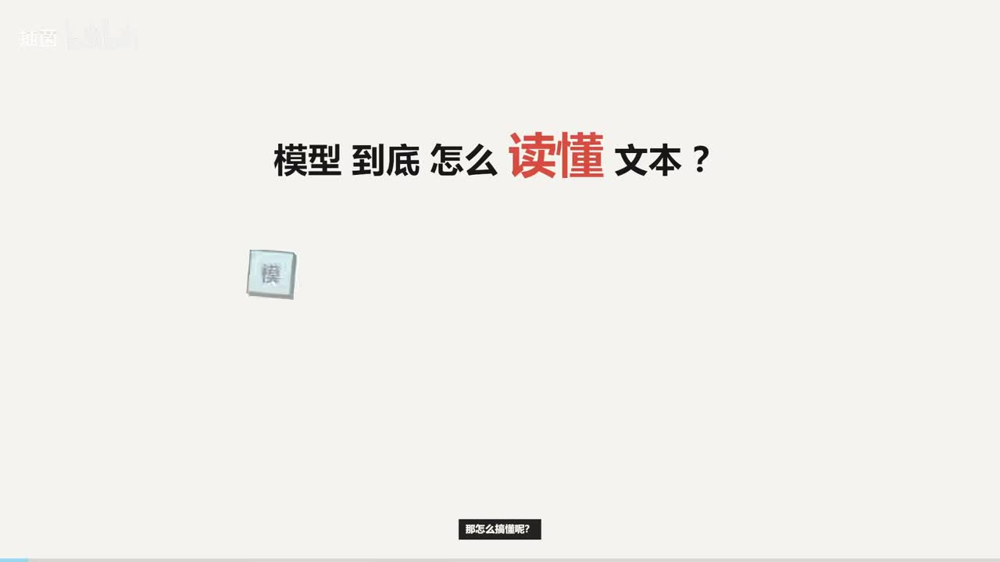

# Transformer原理

> 来源：[Bilibili 视频](https://www.bilibili.com/video/BV1qFTG6jEKp)<br>
> UP 主：抽菌｜合集：AIcode｜视频时长：23 分 43 秒<br>
> 视频简介提供项目地址：[TerricSH/SmallLLM](https://github.com/TerricSH/SmallLLM.git)。UP 主说明代码会随系列更新，进度可能快于视频。

## 小结

本期是系列的“原理篇”：UP 主从“希望游戏 NPC 不再只说写死台词、而能与玩家自由互动”的需求出发，解释训练语言模型前必须理解的 Transformer 基础。定位上，它不是代码实战，而是为下一期“按论文手写小型 Transformer 并训练”建立概念框架。

视频先回顾模型结构的演变：感知机能解决线性可分的二分类问题，却无法处理 XOR 等非线性问题；多层感知机（MLP/FFN）通过层叠和非线性激活函数增强表达能力，但其固定特征向量式处理不天然保留文本顺序。RNN 引入序列记忆，却受制于远距离信息衰减和串行计算；注意力机制缓解长距离依赖后，Transformer 进一步抛弃循环式处理，借助位置编码与自注意力实现全序列并行建模。

Transformer 的主线可概括为：**文本先分词得到 Token ID，ID 经 Embedding 变为连续向量，与位置编码相加；随后通过多个 Transformer Block，在自注意力中跨位置收集上下文信息、在 FFN 中逐位置进行非线性加工，并依赖残差连接和 LayerNorm 稳定深层训练；最终由线性层和 Softmax 输出下一个 Token 的概率分布。**

本期对注意力的解释强调 Q、K、V 的分工：Q 表示当前位置“要找什么”，K 表示各位置“可提供什么线索”，V 是位置携带的内容。Q 与全部 K 的匹配分数经缩放、Softmax 归一化后，作为 V 的加权系数；多头注意力则让多个 Head 并行学习不同的关系模式，如局部搭配、长距离依赖、句法结构或主题关联。

视频还区分了原始 Transformer 的 Encoder–Decoder 架构和 GPT 常用的 Decoder-only 架构。前者的解码器同时使用 Masked Self-Attention 与 Cross-Attention；后者移除 Encoder 和 Cross-Attention，仅保留带因果遮罩的自注意力与 FFN，通过“预测下一个 Token”的自回归方式持续生成文本。

适合读者：希望理解大语言模型工作链路、准备手写 Transformer、或需要将模型接入游戏 NPC 对话系统的初学者。需要注意：视频以概念讲解为主，没有提供本期可复现的训练超参数、数据集、代码片段或实验指标；ASR 对术语、人名与个别结构名存在明显识别误差，阅读时应以正文校正后的术语为准。

## 思维导图





## 目录

- [创作动机与课程定位](#创作动机与课程定位)
- [从感知机到 Transformer 的历史脉络](#从感知机到-transformer-的历史脉络)
- [Token、Embedding 与位置编码](#tokenembedding-与位置编码)
- [Transformer Block：自注意力、FFN 与训练稳定性](#transformer-block自注意力ffn-与训练稳定性)
- [原始 Transformer 与 GPT 的 Decoder-only 路线](#原始-transformer-与-gpt-的-decoder-only-路线)
- [实现前的步骤、参数与边界](#实现前的步骤参数与边界)
- [结论与时效性](#结论与时效性)
- [字幕比对](#字幕比对)
- [评论分析](#评论分析)
- [处理记录](#处理记录)

## 创作动机与课程定位 [00:00](https://www.bilibili.com/video/BV1qFTG6jEKp?t=0)

UP 主以游戏开发场景作为切入点：上一期制作了一个 Agent 辅助工具，已在写游戏时减少工作量；本期希望继续推进，让游戏内 NPC 不被写死的台词限制，而是能与玩家自由互动。视频的判断是：这类开放式对话不能只靠不断堆叠规则，需要由模型驱动。

因此，本期的核心问题被表述为“模型到底如何读懂文本”。UP 主计划依照 Transformer 论文，从头录制并训练一个小型语言模型；但因内容较多，先单独讲清原理，下一期再对照论文逐行写出框架代码。



> 图：画面明确写出“本期看懂它 → 下期写出它”，并展示论文标题 *Attention Is All You Need*。它能够确认本期是原理导读，而不是已完成训练与性能评测的实战视频。

视频还给出项目仓库 `SmallLLM`，但素材未包含仓库中的具体提交版本、运行命令、依赖环境或训练配置。因此，不能据此推断本期已经使用了何种数据集、GPU、学习率或模型规模。

## 从感知机到 Transformer 的历史脉络 [01:12](https://www.bilibili.com/video/BV1qFTG6jEKp?t=72)

### 感知机：线性分类与收敛前提 [01:24](https://www.bilibili.com/video/BV1qFTG6jEKp?t=84)

视频从感知机开始梳理。感知机被介绍为线性分类器：将输入特征加权求和、经过激活函数后输出分类结果。其重要性不仅在于结构简单，还在于当数据确实可被某个线性边界分开时，感知机学习过程具备收敛保证。



> 图：关键帧以 `x₁`、`x₂`、求和符号与预测输出 `ŷ` 直观呈现感知机的基本计算链路。它帮助读者区分“线性分类器”的起点与后续深层网络的复杂结构。

视频强调，当时从“人工写死规则”转向“让机器从数据中学习规则”很有吸引力；但收敛保证依赖严格前提：数据必须线性可分。一旦数据含噪，或者本身不再严格线性可分，权重与偏置可能在不同错误样本间反复修正，学习过程不再具有原先的收敛保证。

### XOR 与单层模型的表达边界 [03:05](https://www.bilibili.com/video/BV1qFTG6jEKp?t=185)

视频以 XOR（异或）问题说明单层感知机的表达局限：平面上两类样本交叉地分布在对角位置，无法由一条直线将两类完全分开。单层感知机只能拟合线性分界，因此面对这种非线性可分问题无能为力。

视频提到 1969 年的相关批评与证明，ASR 将人名识别为“Nisky 和 Pippert”；结合上下文，该处应为 **Marvin Minsky 与 Seymour Papert** 的《Perceptrons》。视频将其作为单层感知机局限被严格指出、AI 研究遭遇早期低潮的历史节点。这里应注意：视频是在做历史脉络概述，并未展开原始文献中的完整定理条件。

### MLP/FFN：多层与非线性激活 [04:20](https://www.bilibili.com/video/BV1qFTG6jEKp?t=260)

解决方向是多层感知机（MLP），视频也将其对应到 Transformer 内的前馈网络（FFN）。视频指出两个关键变化：

1. **多层堆叠**：提高网络的组合表达能力。
2. **非线性激活函数**：突破线性函数复合仍为线性的限制。

仅增加线性层没有意义，因为多个线性变换复合之后仍然是线性变换，最终仍只能划出直线。非线性激活会在函数形态中引入“弯折”，通过多层叠加可以构造更复杂的曲线，从而拟合 XOR 等非线性关系。视频将 MLP 的“表达能力提升”归因于这两个条件的配合，而不是单纯增加层数。

### RNN 的顺序意识与两个瓶颈 [06:02](https://www.bilibili.com/video/BV1qFTG6jEKp?t=362)

MLP 虽能增强表达能力，却将输入视作固定大小的特征向量，架构本身没有表示顺序的机制。文本场景尤其依赖词序，视频举出“狗咬人”与“人咬狗”作为例子：词汇相同但顺序不同，语义相反。

RNN 的思路是：处理当前词时，将之前读取的信息浓缩进隐藏状态，使模型不只看到当前词，也保有前序“记忆”。但视频指出两个问题：

- **远距离信息衰减**：句首信息若要影响很远位置，需逐步传递，传递过程中可能逐渐消失。
- **无法充分并行**：第 100 个位置的计算必须等待前 99 个位置完成；每一步只能处理一个位置，训练和推理受到串行依赖限制。

视频提到 LSTM 通过门控机制改善长距离记忆，但没有消除 RNN 的串行本质。

### 注意力到 Transformer：全序列并行 [08:18](https://www.bilibili.com/video/BV1qFTG6jEKp?t=498)

视频将注意力机制描述为：解码器每生成一步，都可直接回看输入中与当前生成最相关的部分，而不必只依赖不断传递的单一隐藏状态。ASR 将 2014 年提出相关机制的作者误识别为“Gordonner”；按上下文应理解为视频所指的早期神经机器翻译注意力工作，但素材未提供论文题目与完整引文。

随后视频给出 Transformer 的关键转变：既然注意力有效，就不再让注意力仅作为 RNN 的附属组件，而是以它作为核心。Transformer 不按词逐个循环处理，而是：

- 给每个 Token 叠加位置标记；
- 将整句序列同时输入模型；
- 让任意两个位置可通过注意力直接建立关系；
- 不再依赖前一位置算完后才能计算下一位置，因此能够并行。



> 图：画面提出“模型到底怎么读懂文本？”。该关键帧适合放在从传统序列模型过渡到 Transformer 的位置，强调视频并非只介绍结构名词，而是在回答语言上下文如何被建模的问题。

## Token、Embedding 与位置编码 [10:05](https://www.bilibili.com/video/BV1qFTG6jEKp?t=605)

### Tokenization：文字先变成模型可计算的编号 [10:10](https://www.bilibili.com/video/BV1qFTG6jEKp?t=610)

视频将 Token（词元）解释为模型读取文本的最小单元。模型接收到文本时并不直接理解汉字或单词，而需要先将文本转换为可参与数值计算的形式。

视频给出的处理逻辑是：

1. 将一句文本切分为一个或多个 Token；
2. 根据词表将 Token 映射为 Token ID；
3. 将 ID 再映射为向量表示。

视频提到主流的子词切分思路包括 **BPE** 与 **WordPiece**：通过对海量文本进行统计，获得较高效的切分方式并生成词表。常见或高频组合可以作为完整单元保留，较少见的内容可以进一步拆为更小的部分。词表确定后，新的输入按同一规则切分。

限制是：视频没有给出实际 Tokenizer 的训练语料、词表大小、特殊 Token 设计、中文切分示例的精确结果，因而无法据此复现一个完全相同的分词器。

### Embedding：从离散 ID 到连续向量 [11:16](https://www.bilibili.com/video/BV1qFTG6jEKp?t=676)

Token ID 本身只是编号，例如 “3 号 Token” 与 “17 号 Token” 并不因数字大小而天然携带语义距离。Embedding 的工作，是为每个 Token ID 查找或学习一个连续向量，使模型能在向量空间中进行计算。

视频的直观解释是：

- Token ID 回答“这是谁”；
- Embedding 将其映射到连续向量空间；
- 在训练中，模型不断调整参数，使语义相关的 Token 逐渐形成有意义的几何关系。

这并不表示向量空间中的“距离”在任何模型、任何维度上都能直接解释为人类可读的语义相似度；视频只是用它帮助理解训练为何能将离散符号变成可学习表示。

### 位置编码：并行计算下保留词序 [12:16](https://www.bilibili.com/video/BV1qFTG6jEKp?t=736)

自注意力可以同时处理所有位置，但纯并行处理不会天然知道 Token 的先后顺序。因此，Transformer 需要将位置信息注入 Token 表示。视频介绍原始 Transformer 使用不同频率的正弦、余弦函数生成位置编码，并将其加入 Embedding。

视频给出两个选择正弦/余弦位置编码的理由：

1. 位置偏移可通过线性关系表达，模型可借此学习相对位置关系。
2. 这种数学形式具有稳定性，并被视频描述为能够向训练时未见过的更长序列外推。

视频同时提及后续的替代方案：

- 可学习的位置参数；
- RoPE（旋转位置编码）等相对位置方案。

它们实现不同，但目的相同：让模型在并行处理 Token 时仍能区分位置与顺序。视频未比较这些方案的性能、上下文长度上限或具体实现差异。

## Transformer Block：自注意力、FFN 与训练稳定性 [14:08](https://www.bilibili.com/video/BV1qFTG6jEKp?t=848)

### 总体数据流 [14:08](https://www.bilibili.com/video/BV1qFTG6jEKp?t=848)

视频将完整流程概括为：

```text
文本
→ 分词 / Token ID
→ Embedding
→ 加入位置编码
→ 多个 Transformer Block
   → 自注意力（跨位置交换信息）
   → FFN / MLP（逐位置非线性加工）
   → 残差连接与 LayerNorm（稳定训练）
→ 线性层
→ Softmax
→ 下一个 Token 的概率分布
```

其中，视频把 Self-Attention 视为解决 RNN 长距离遗忘的主要机制，把 FFN 视为对每个位置表示进行更强非线性变换的模块。

### Self-Attention：Q、K、V 与缩放 Softmax [15:03](https://www.bilibili.com/video/BV1qFTG6jEKp?t=903)

视频通过上下文歧义说明注意力的必要性：同一个 Token 处于不同语境时，含义可能不同；模型需要参考整句话的其他 Token，决定当前位置该如何理解。

每个 Token 的输入表示经三组可训练线性投影后得到 Q、K、V：

| 符号 | 视频中的直观含义 | 作用 |
| --- | --- | --- |
| Q（Query） | “我在找什么？” | 当前查询位置提出需求 |
| K（Key） | “我能提供什么线索？” | 与 Query 匹配以得到相关性分数 |
| V（Value） | “我实际携带的内容” | 按注意力权重被汇总的内容 |

视频特别说明，Q、K、V 的语义分工不是线性投影天然自带的，而是训练使不同投影矩阵逐渐学习到不同作用。

按视频口述，计算过程为：

1. 取当前位置的 Q；
2. 与所有位置的 K 进行匹配，分数越高表示当前查询更应关注该位置；
3. 用 `√d_k` 缩放分数以稳定训练；
4. 用 Softmax 将分数归一化为权重，权重之和为 1；
5. 使用权重对各位置 V 加权汇总，得到当前位置更新后的表示。

对应的标准形式可写为：

```text
Attention(Q, K, V) = Softmax(QKᵀ / √dₖ)V
```

本期讨论的是 **Self-Attention（自注意力）**：Q、K、V 都来自同一输入序列。它并不等于“只关注自己”，而是“当前位置提出查询，在自身所在的整段序列中查找并整合相关位置”。

### Multi-Head Attention：多组关系并行学习 [17:06](https://www.bilibili.com/video/BV1qFTG6jEKp?t=1026)

视频说明，模型不会只使用一组注意力，而是并行使用多个 Head。不同 Head 可以学习不同类型的关联，例如：

- 局部词语搭配；
- 长距离依赖；
- 句法结构；
- 主题关联。

多个 Head 的输出会拼接，再投影回原始维度。视频没有指定 Head 数、模型维度或每个 Head 的维度；因此“多头”在本期是结构概念，不是可直接套用的数值配置。

### FFN：逐位置的非线性加工 [17:42](https://www.bilibili.com/video/BV1qFTG6jEKp?t=1062)

注意力负责从其他位置收集信息，FFN 则负责在每个位置内对聚合后的信息进行加工。视频将 FFN 描述为逐位置执行的两层 MLP：

- 先将维度扩大到约原维度的 **4 倍**；
- 经过激活函数；
- 再压回原始维度。

视频提到 GELU 或 GLU 相比传统 ReLU 更平滑。这里的“约四倍”是视频给出的常见结构经验，并不意味着所有 Transformer 实现都固定使用四倍隐藏层；具体取值需依模型配置决定。

### 残差连接与 LayerNorm：深层训练稳定性 [18:27](https://www.bilibili.com/video/BV1qFTG6jEKp?t=1107)

多个 Block 叠深后，梯度在反向传播中可能越来越小，较前层难以更新。视频给出的稳定训练组件包括：

- **残差连接（Residual Connection）**：将模块输入直接加回模块输出。视频的表述可理解为 `x + F(x)`；即使 `F(x)` 很小，梯度也存在较直接的传递路径。
- **LayerNorm**：对每个位置的特征进行归一化，使均值接近 0、方差接近 1，再通过可学习参数 `γ` 与 `β` 进行缩放和平移，以稳定数值分布。

视频在此完成对一个 Transformer Block 的核心零件说明：注意力、FFN、残差连接与 LayerNorm。素材没有进一步说明采用 Pre-LN 还是 Post-LN、Dropout 配置、参数初始化、优化器或学习率调度。

## 原始 Transformer 与 GPT 的 Decoder-only 路线 [19:42](https://www.bilibili.com/video/BV1qFTG6jEKp?t=1182)

### Encoder–Decoder：翻译式输入输出 [19:42](https://www.bilibili.com/video/BV1qFTG6jEKp?t=1182)

视频指出，原始 Transformer 是 Encoder–Decoder 架构：

- **Encoder**：读取并编码输入序列；
- **Decoder**：生成输出序列，既参考已生成内容，也参考 Encoder 对输入的表示。

相比 Encoder，Decoder 有两项关键差异：

1. 自注意力使用 **Masked Self-Attention**；
2. 增加 **Cross-Attention**。

Masked Self-Attention 的作用是防止当前位置看到未来 Token。视频描述其实现思路为：将未来位置对应分数设为负无穷，经过 Softmax 后这些位置的权重自然为 0。这样生成第 `t` 个 Token 时，模型只能使用 `t` 之前（含当前计算位置可见范围内）的上下文。

Cross-Attention 中：

- Q 来自 Decoder 当前状态；
- K、V 来自 Encoder 输出。

因此，Decoder 能一边处理已经生成的目标序列，一边查询输入序列中相关的信息。

### GPT：仅保留解码器的自回归生成 [21:02](https://www.bilibili.com/video/BV1qFTG6jEKp?t=1262)

视频将 GPT 为代表的大语言模型概括为 Decoder-only 路线：移除 Encoder 后，Cross-Attention 也随之移除，主要保留 Masked Self-Attention 与 FFN。

提示词、问题以及已经生成的内容被放到同一条序列中，作为当前上下文。模型每次预测一个下一个 Token，把预测结果接到序列末尾，再继续预测下一个 Token。这就是视频所说的**自回归生成**。

可将其概括为：

```text
给定上文 x₁, x₂, ..., xₜ
→ 预测下一个 Token xₜ₊₁ 的概率分布
→ 选出 / 采样一个 Token 并追加到上下文
→ 重复直到满足停止条件
```

视频最后回扣全篇：从感知机到 GPT，Transformer 的核心发展脉络已经梳理完成；下一期计划依据本期原理从零搭建 Transformer 框架并进行训练。

## 实现前的步骤、参数与边界 [21:55](https://www.bilibili.com/video/BV1qFTG6jEKp?t=1315)

### 视频已经明确的实现顺序

如果按视频的讲解准备下一期实战，结构顺序应是：

1. **准备文本与分词器**：把文本按词表切为 Token，并映射为 Token ID。
2. **建立 Embedding**：将离散 ID 映射为连续向量。
3. **加入位置信息**：采用原始正余弦位置编码，或选择可学习位置参数、RoPE 等替代方案。
4. **实现 Transformer Block**：
   - 计算 Q、K、V；
   - 计算缩放点积注意力；
   - 实现多头拼接与输出投影；
   - 添加两层 FFN；
   - 加入残差连接和 LayerNorm。
5. **选择架构形式**：
   - 若做序列到序列任务，使用 Encoder–Decoder，并在 Decoder 中实现 Cross-Attention；
   - 若做 GPT 式语言模型，使用 Decoder-only 和因果遮罩。
6. **输出预测**：将最后一层隐藏状态经线性层与 Softmax 转成下一个 Token 的概率分布。
7. **按自回归方式生成**：逐个预测、追加、继续预测。

### 视频明确给出的参数或结构经验

| 项目 | 视频信息 | 使用限制 |
| --- | --- | --- |
| FFN 中间维度 | 约扩张至原维度的 4 倍后压回 | “约 4 倍”不是固定规则，未给出本项目实际值 |
| 注意力缩放 | 除以 `√dₖ` | 用于稳定注意力分数尺度 |
| 注意力归一化 | Softmax | 使注意力权重和为 1 |
| LayerNorm | 归一化后再由 `γ`、`β` 调整 | 未说明具体实现位置与 epsilon |
| Masked Attention | 未来位置分数设为负无穷 | 用于保证自回归生成不泄漏未来信息 |
| 激活函数 | 提到 GELU、GLU，相对 ReLU 更平滑 | 未指定最终采用哪一种 |
| 位置方案 | 正余弦、可学习位置、RoPE | 未给出实际项目的选择与比较 |

### 本期未提供、不可补造的信息

以下内容对训练复现至关重要，但未出现在给定视频素材中：

- 模型层数、`d_model`、Head 数、词表大小、最大序列长度；
- 训练数据来源、规模、清洗规则与许可证；
- batch size、学习率、优化器、权重衰减、训练步数与硬件；
- 损失曲线、验证集指标、生成示例和基线比较；
- 采样策略（贪心、温度、Top-k、Top-p 等）；
- 项目仓库中与本视频对应的具体 commit 或版本标签。

因此，这份笔记只能作为原理与结构实现清单，不能替代下一期代码及其最终配置。

## 结论与时效性 [23:20](https://www.bilibili.com/video/BV1qFTG6jEKp?t=1400)

视频最具迁移价值的不是某个单独公式，而是架构取舍的因果链：

- 单层感知机受限于线性边界；
- MLP 通过非线性提高表达能力；
- RNN 能处理顺序，却在远距离依赖和并行性上受限；
- 注意力让任意位置直接关联；
- Transformer 用位置编码补回顺序信息，并以自注意力支持并行；
- GPT 将这一机制用于 Decoder-only 的下一个 Token 预测与自回归生成。

对于游戏 NPC 场景，视频提出的方向是“使用模型实现自由对话”，但这只解决语言生成框架的一部分。素材没有讨论角色设定约束、知识检索、上下文窗口管理、内容安全、延迟、成本、记忆系统或评估方法，不能将“理解 Transformer”直接等同于“可上线的 NPC 对话系统”。

时效性方面，视频元数据抓取时间为 2026-07-13，项目仓库又被 UP 主明确说明会持续更新且可能快于视频。因此：

- 视频中的原理部分属于相对稳定的基础知识；
- 仓库代码、依赖版本和后续系列进度可能已发生变化；
- 观看或复现时应以仓库当前 README、提交记录及后续视频为准；
- 站内播放量、收藏、点赞等统计为抓取时快照，不应视为持续有效数据。

## 字幕比对

本次任务已执行 ASR；素材中**未提供可用的 Bilibili 站内字幕**，因此不存在可直接逐句对照的站内字幕文件。

| 字幕来源 | 完整性 | 专有名词 | 时间轴 | 主要问题 |
| --- | --- | --- | --- | --- |
| Bilibili 站内字幕 | 未提供，无法使用 | 无法核验 | 无可用字幕时间轴 | 无法与音频进行逐句比对 |
| 本次 ASR 字幕 | 覆盖了视频从开场到结尾的主要口述内容 | 较多误识别，尤其是英文术语、人名、结构名 | 提供文本内容，但给定素材未附逐句时间戳 | 中英文混杂处断句与术语错误较多，部分句子有缺字、同音替换或重复 |

### 最终字幕选择

正文采用**本次 ASR 的内容主线 + 关键帧文字 + 上下文术语校正**。由于没有站内字幕，不存在“站内字幕优先”的条件。以下是对理解影响较大的校正项：

| ASR 片段 | 正文采用的校正 | 校正依据 |
| --- | --- | --- |
| “Transformer價格上的” | Transformer 架构上的 / 基于 Transformer 的模型 | 上下文谈论主流模型架构，原识别不通顺 |
| “感知基” | 感知机 | 全段讨论 Perceptron |
| “Nisky 和 Pippert” | Minsky 与 Papert | 1969 年、感知机批评著作的上下文对应 |
| “Gordonner 等人” | 早期神经机器翻译注意力工作（作者名不据 ASR 定稿） | ASR 人名不可靠，素材不足以从画面确认作者拼写 |
| “RN / RMN” | RNN | 前后语义均指循环神经网络 |
| “野水到渠成” | 并行由此成为可能（按语义整理） | ASR 语音识别出现无意义词组 |
| “词源” | Token / 词元 | 视频上下文持续讲分词、Token ID 与词表 |
| “South Max” | Softmax | 标准注意力归一化函数 |
| “Doorhead / HAD” | Multi-Head / Head | 上下文谈多头注意力 |
| “前绘网络” | 前馈网络（FFN） | Transformer Block 标准组成 |
| “Master / Must Selfie Tension” | Masked Self-Attention | Decoder 因果遮罩语境 |
| “Chorus attention” | Cross-Attention | Q 来自 Decoder、K/V 来自 Encoder 的描述 |
| “robo” | RoPE | 视频在位置编码替代方案处提及 |

> 校正原则：只对能由关键帧、明确上下文和稳定技术术语支持的内容进行修正；对于无法从素材可靠确认的人名、论文细节和实现配置，不补充为视频已明确说出的事实。

## 评论分析

仅获取到 2 条热评，未达到“热评前三条”的数量；以下只分析可获取内容，不将评论视为可验证事实。

1. **存币到6级｜6 赞**  
   - 评论观点：“老家伙是要冲击百大了嘛，突然开始更新了起来。”  
   - 这是一条带调侃语气的观众反馈，主要感受到 UP 主更新频率提升，并表达对持续更新的期待。  
   - 它不补充 Transformer 技术内容，也不能据此确认 UP 主的实际更新计划、平台目标或更新频率变化。

2. **jujujuju00｜2 赞**  
   - 评论观点：建议去掉背景音乐。  
   - 这是对视频听感的直接反馈，可能意味着部分观众认为背景音乐影响信息接收。  
   - 评论未说明具体时间段、音量问题或其他观众的共识，属于单一用户体验，不应推导为视频整体音频质量的客观结论。

3. **第三条热评**  
   - 未获取到。给定评论素材的 `items` 中仅有两条内容，因此不补造第三条评论或其观点。

## 处理记录

- **Worker ID**：worker-mrj0wbly-5dc4e50c
- **模型**：gpt-5.6-terra
- **调用工具与素材**：使用任务提供的 Bilibili 元数据、视频素材清单、ASR 字幕、关键帧列表、热评 JSON 与封面信息；未提供站内字幕文件。
- **字幕选择**：已执行本次 ASR；因站内字幕未提供可用版本，采用 ASR 为主体，并以关键帧与上下文校正可明确判断的术语。对无法可靠恢复的专名不作确定性扩写。
- **关键帧选择依据**：
  - `frames/frame-002.jpg`：提出“模型到底怎么读懂文本”，适合说明视频的问题意识；
  - `frames/frame-003.jpg`：展示 *Attention Is All You Need* 以及“本期看懂它、下期写出它”，用于确认系列定位与后续安排；
  - `frames/frame-004.jpg`：展示感知机的输入—求和—输出链路，用于支撑历史脉络起点。
- **未选用关键帧**：其余帧虽在素材清单中列出，但给定可见帧内容不足以确认其具体画面与对应知识点，故不强行引用，避免图文错配。
- **缓存清理**：素材清单未提供缓存目录、删除日志或清理结果；未能验证缓存清理状态，记录为“未提供可核验信息”。
- **未解决问题**：
  - ASR 未附逐句时间戳，正文时间轴为依据内容段落与总时长整理的定位链接，适合跳转复看，不应视为逐字级字幕时间码；
  - 无站内字幕，无法进行站内字幕与 ASR 的逐句准确率比较；
  - 无下一期视频、仓库具体版本或训练日志，无法验证后续代码实现是否与本期讲解完全一致。
