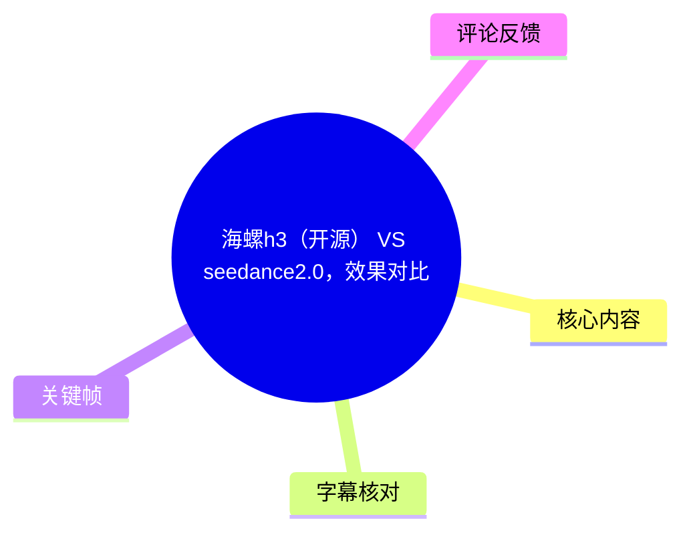
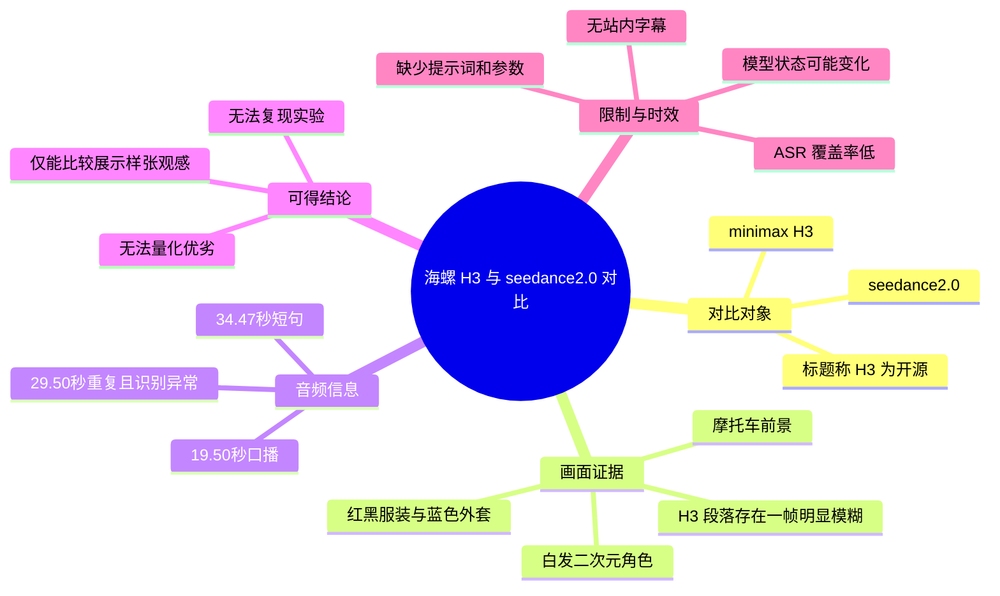
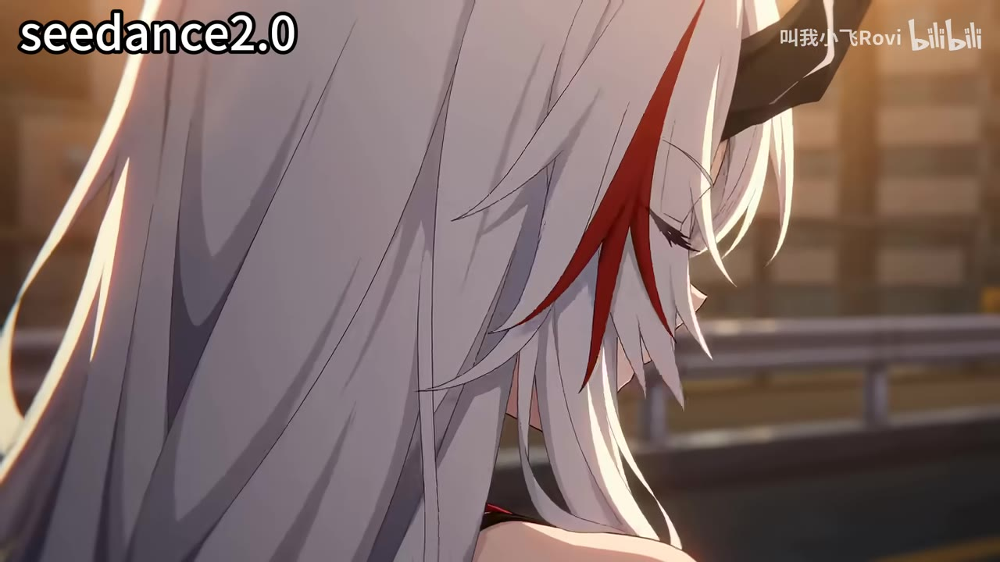
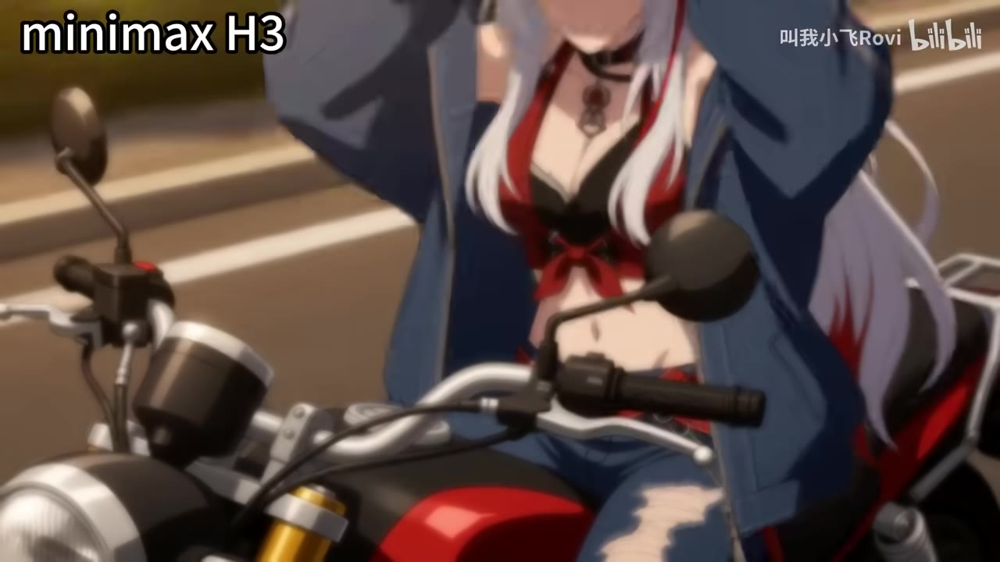

# 海螺h3（开源） VS seedance2.0，效果对比

> 来源：[Bilibili 视频](https://www.bilibili.com/video/BV169M965EZk) 
> UP 主：叫我小飞Rovi｜时长：37 秒｜分辨率：1920×1080｜合集：AIcode

## 小结

视频以同类二次元角色与摩托车画面为素材，对比展示了标记为 **seedance2.0** 与 **minimax H3** 的生成结果。画面左上角直接标注了模型名：前段为 `seedance2.0`，后段为 `minimax H3`。标题将后者称作“海螺 H3（开源）”。

从关键帧可见，seedance2.0 段落展示了白发角色、红黑服装、蓝色外套及摩托车等元素；minimax H3 段落也呈现相近的角色和车辆构图。H3 段落中有一帧出现较明显的失焦/模糊效果，另一帧则能较清楚地看到人物手部、衣物和车辆把手。视频主要是结果展示，**没有公开提示词、输入图、采样设置、分辨率、帧率、生成时长、硬件或评测指标**，因此不能据此得出严格的模型能力排名。

音频中的有效人声很少。本次 ASR 仅在 19.50–21.42 秒、29.50–31.58 秒和 34.47–35.71 秒识别到三小段语音；其中两句重复且第二句存在乱码、错词。可较稳妥确认的口播内容是“指挥官是在玩捏脸游戏吗”，其余语句不宜强行校正或扩写。

该视频适合希望快速观察两组二次元视频画面观感、尤其关注“开源模型是否够用”的读者。它不适合作为可复现实验、成本比较或模型版本评测的唯一依据。视频发布与抓取信息均对应 2026-08-04 附近；生成式视频模型的版本、开放状态、价格和可用性都可能随后变化。

## 思维导图

## 目录

- [视频范围与对比依据](#视频范围与对比依据)
- [seedance2.0 画面展示](#seedance20-画面展示)
- [minimax H3 画面展示](#minimax-h3-画面展示)
- [口播与可确认信息](#口播与可确认信息)
- [复现条件、参数缺口与观看方法](#复现条件参数缺口与观看方法)
- [结论、限制与时效性](#结论限制与时效性)
- [字幕比对](#字幕比对)
- [评论分析](#评论分析)
- [处理记录](#处理记录)

## 视频范围与对比依据 [00:00](https://www.bilibili.com/video/BV169M965EZk?t=0)

这是一支 37 秒的短对比视频。视频标题为“海螺h3（开源） VS seedance2.0，效果对比”，标签包含“对比”“AI”“seedance2.0”“minimax h3”“海螺”以及“战双帕弥什”等。画面中使用的是二次元角色与摩托车场景，具有明显的游戏/动画风格。

可直接从素材确认的对比依据如下：

1. **模型标识来自画面文字**：关键帧中可见 `seedance2.0` 和 `minimax H3` 标注。
2. **测试内容具有视觉上的相似性**：两段都出现白发女性角色、红黑色内搭、蓝色外套和摩托车，因而可作为相近场景下的直观观感展示。
3. **无法确认输入条件完全相同**：视频没有展示提示词、参考图、首尾帧、随机种子、模型版本号或生成参数；所以“视觉相似”不能等同于“相同输入下的严格盲测”。
4. **“开源”属性仅按视频标题记录**：素材未展示代码仓库、模型权重地址、许可证或部署说明，不能从本视频进一步核验其开源范围。

## seedance2.0 画面展示 [00:19](https://www.bilibili.com/video/BV169M965EZk?t=19)

画面左上角标注为 `seedance2.0`。在所给关键帧中，该段以人物中近景和头发特写为主：白发角色身穿红黑配色服装，蓝色外套与摩托车部件位于前景或画面下部；背景呈暖色、室内/车库式的模糊光影。

> 图：画面左上角的 `seedance2.0` 标签明确了该段归属。此帧同时保留人物服饰、头发、摩托车和暖色背景，可用来观察角色设计元素在同一镜头中的组织方式。

> 图：该局部帧聚焦头发、红色发饰和侧脸区域。它的价值在于便于观察细发丝、边缘轮廓与景深背景的视觉呈现；但单帧不能反映视频生成中最关键的连续运动稳定性。

本段在 ASR 首个可用口播时间附近出现一句较清晰的中文台词：

> “指挥官是在玩捏脸游戏吗”

这句话是角色/情境化台词，并非模型参数、性能结论或测试方法说明。

## minimax H3 画面展示 [00:29](https://www.bilibili.com/video/BV169M965EZk?t=29)

画面左上角标注为 `minimax H3`。与前段相似，这一段同样呈现白发角色坐在摩托车上的画面，便于观众直接对照人物、服装和车辆元素的表现。

> 图：画面左上角标有 `minimax H3`。人物上半身、摩托车把手和背景均出现较强模糊/失焦观感，因此此帧适合用来指出该展示片段中存在的视觉状态变化；但不能仅凭这一帧断言这是模型缺陷，也可能是镜头语言或运动过程中的景深效果。

> 图：同样带有 `minimax H3` 标签。该帧中人物双手、蓝色外套拉链、红黑服装、摩托车把手及后座结构更易辨识，可与上一帧共同观察同一段落内清晰度和构图的变化。

从画面可做出的谨慎描述是：

- H3 段落保留了人物、服饰配色、摩托车及暖色背景等核心元素；
- 所给画面中既有较模糊的一帧，也有相对清楚的一帧；
- 素材没有给出逐帧运动、原始输出文件或失败样本比例，不能量化其一致性、物理合理性、提示词遵循度或人物身份稳定性；
- 视频也未提供 seedance2.0 与 H3 的生成耗时、成本或本地部署性能，不能进行效率比较。

## 口播与可确认信息 [00:34](https://www.bilibili.com/video/BV169M965EZk?t=34)

本次 ASR 对 36.288 秒音轨识别出 3 个片段，总计 5.24 秒人声，语音覆盖率为 **14.44%**。时间轴和文本如下：

| 时间 | ASR 原文 | 可靠性说明 |
| --- | --- | --- |
| [00:19.500–00:21.420](https://www.bilibili.com/video/BV169M965EZk?t=19) | 指挥官是在玩捏脸游戏吗 | 文句完整，语义可理解。 |
| [00:29.500–00:31.580](https://www.bilibili.com/video/BV169M965EZk?t=29) | 指�y官是玩捻脸游脸吗 | 含乱码“�y”和“游脸”等识别异常；与前句相近，但不将其擅自改写为正式字幕。 |
| [00:34.470–00:35.710](https://www.bilibili.com/video/BV169M965EZk?t=34) | 其实也要玩 | 片段短，缺乏足够上下文，无法判断其完整语义。 |

ASR 在 21.42–29.50 秒之间存在 **8.08 秒**的大间隔，说明此区间没有被识别出可用人声或语音信号较弱。诊断没有标记 `noAudioStream=true`：源素材存在音轨，问题是有效语音量较少，而不是“视频没有音轨”。

## 复现条件、参数缺口与观看方法 [00:19](https://www.bilibili.com/video/BV169M965EZk?t=19)

视频展示的是结果，不是操作教程；素材中没有实际的命令、工作流、节点配置或参数表。因此无法整理出可执行的生成步骤。对于希望复核这类模型对比的观看者，应区分视频已给出的内容与缺失条件。

### 视频实际提供的条件

- 对比名称：seedance2.0 与 minimax H3；
- 输出场景：二次元白发角色、红黑服饰、蓝色外套、摩托车和暖色背景；
- 展示方式：用模型名称叠字区分片段；
- 视频尺寸：1920×1080；
- 总时长：37 秒。

### 未提供、因而不能补写的关键参数

| 类别 | 视频是否提供 | 对结果比较的重要性 |
| --- | --- | --- |
| 具体模型版本与发布日期 | 未提供 | 同名模型不同版本可能差异很大。 |
| 提示词与负面提示词 | 未提供 | 决定角色、车辆、镜头和动作需求。 |
| 输入图、参考图或角色 LoRA | 未提供 | 影响角色身份、服装和画风一致性。 |
| 随机种子与采样策略 | 未提供 | 影响复现与单次样本代表性。 |
| 输出分辨率、帧率和片段长度 | 未提供 | 影响清晰度、运动连续性和成本。 |
| 生成次数与样本筛选规则 | 未提供 | 影响“最佳样本”是否具有代表性。 |
| 显卡、显存、推理时间与部署方式 | 未提供 | 无法验证消费级显卡可运行性或性能。 |
| 许可证与权重获取方式 | 未提供 | 无法仅凭标题确认“开源”的具体边界。 |
| 价格、积分消耗或 API 成本 | 未提供 | 无法完成性价比结论。 |

### 如需自行做公平对比，建议的最小记录步骤

以下是对比实验应补齐的记录框架，不是视频中已经执行的流程：

1. 固定同一份文本提示词、负面提示词、参考素材和目标时长。
2. 统一输出尺寸、帧率、镜头数量和是否允许后处理。
3. 分别记录每个模型的准确版本、调用日期、许可状态、价格和生成耗时。
4. 每个模型至少生成多条样本，明确是否挑选最佳结果。
5. 从角色一致性、手部与物体结构、运动连贯性、镜头控制、文字/细节稳定性、失败率及成本等维度分别评价。
6. 保留原始输出与参数，避免只用截帧替代动态质量判断。

## 结论、限制与时效性 [00:34](https://www.bilibili.com/video/BV169M965EZk?t=34)

视频最有价值的信息是提供了带模型标签的短画面对照：观众可以直观看到两段在相似二次元摩托车场景中的人物、服装、车辆和景深表现。H3 段落的所给关键帧显示出从较模糊到较清楚的画面状态变化，但这一现象的成因不能仅从单帧确定。

需要避免把视频外信息混入结论：

- 视频**没有**给出“谁更强”的明确口播结论；
- 视频**没有**给出任何可复现的生成参数；
- 视频标题称 H3“开源”，但素材内没有许可证、仓库或权重链接；
- 视频没有展示长镜头、快速动作、复杂遮挡或多角色场景，不能泛化到所有视频生成任务；
- 静态关键帧只能辅助判断构图与局部细节，不能替代对完整视频运动质量的观看；
- 模型名称、开放程度、价格与功能均有时效性，应以实际使用当日的官方文档和平台页面为准。

## 字幕比对 [00:19](https://www.bilibili.com/video/BV169M965EZk?t=19)

| 字幕来源 | 完整性 | 专有名词 | 时间轴 | 主要问题 |
| --- | --- | --- | --- | --- |
| Bilibili 站内字幕 | 不可用 | 无法评估 | 无法评估 | 素材明确说明“未提供可用站内字幕”。 |
| 本次 ASR 字幕 | 较低：仅覆盖约 14.44% 音轨 | “指挥官”“捏脸游戏”基本可读；第二段有乱码 | 可用：3 段均有毫秒级起止时间 | 第二段出现 `指�y官`、`游脸` 等错误；末句上下文不足；存在 8.08 秒识别间隔。 |

最终采用策略：

1. **时间定位以本次 ASR 的原始 SRT 时间戳为准**，因此正文中的 19 秒、29 秒、34 秒链接均直接对应识别片段起点。
2. **字幕文本保留 ASR 原文**。对第二段不进行无依据的文本修复，仅说明它与第一段语义相似但质量异常。
3. **模型名以关键帧画面叠字校验**：`seedance2.0` 与 `minimax H3` 均由可见画面文字确认，而非由 ASR 推断。
4. 本次 ASR 诊断未标记 `noAudioStream=true`；音轨存在，且诊断无 warnings。低覆盖率应理解为视频中有效口播较少或识别条件有限，而不是工具失败。

## 评论分析 [00:34](https://www.bilibili.com/video/BV169M965EZk?t=34)

以下仅处理可获取的热评前三条。评论反映的是用户立场与使用感受，不等同于经本视频验证的事实。

1. **叫我小飞Rovi（48 赞）**  
   评论认为 H3 在“开源领域”具备明显优势，承认质量“不如 sd2”，但强调免费与开源价值；同时批评其所称的“sd2.5”提升有限、价格较高。  
   - 补充价值：提出了“绝对画质”之外的开源、免费和成本维度。  
   - 可信度边界：评论没有给出价格表、版本、样本、测试设置或许可证链接；关于 sd2.5 的评价不能作为已核验结论。

2. **天之劫火（36 赞）**  
   评论称：“你问输了赢了，我说够用了”。  
   - 补充价值：代表实用主义判断，即对部分用户而言“是否满足需求”比是否战胜闭源/高端模型更重要。  
   - 可信度边界：没有说明“够用”对应哪些任务、画质阈值、硬件和成本条件，无法外推到所有工作流。

3. **冰霜暗翼（69 赞）**  
   评论认可消费级显卡上可运行的视频模型，认为 H3 可能“打不过 sd2.0”，但开源和本地部署能够减少对平台服务的依赖；还提及 MiniMax 的 LLM 产品。  
   - 补充价值：提出本地部署、自主性和消费级硬件可用性这些实际选择维度。  
   - 可信度边界：视频没有展示显卡型号、显存占用、推理速度或本地部署流程；“消费级显卡可跑”是评论者观点，不可从本素材独立证实。

## 评论分析

- 热评 1：总体来说，在开源领域完全是断崖式领先，甚至可以给字节上上压力[doge]虽然质量确实比不过 sd2，但人家开源啊，免费啊！你再看看 sd2.5，对比 2.0 提升微乎其微不说，那价格，死贵死贵的[辣眼睛]
- 热评 2：你问输了赢了，我说够用了
- 热评 3：能在消费级显卡跑的视频模型我说实话已经可以了，确实不错。虽然说感觉打不过sd2.0但好歹是开源的，并且后续如果做本地部署也不需要去受字节那些叽里咕噜的东西的气。 没想到minimax还能整出这种花活，他家的llm我还以为要被斩杀了[doge]

以上内容是观众反馈摘录，只用于补充理解视频反响，不作为正文事实依据。

## 处理记录

- Worker ID：`worker-mrj0www4-e8d79408`
- 模型：`gpt-5.6-terra`
- 调用工具与素材产物：视频合并文件 `merged.mp4`、音频 `audio/audio.wav`、关键帧目录 `frames/`、ASR 结果 `asr/asr-result.json`、ASR SRT `asr/transcript.srt`、热评文件 `comments/comments.json`。
- ASR 模型与配置：`large-v3-turbo`；语言识别为中文（`zh`，置信度 `0.998046875`）；运行设备 `cuda`；计算类型 `int8_float16`；音频时长 `36.288` 秒。
- 字幕选择：站内字幕未提供可用内容；检查并采用本次 ASR 的原始时间轴定位。由于 ASR 覆盖率低且含乱码，正文仅将其作为有限的口播证据，不据此补写未识别内容。
- 关键帧选择依据：选用 `frame-001.jpg`、`frame-002.jpg` 作为带 `seedance2.0` 标记的整体与局部画面，选用 `frame-003.jpg`、`frame-004.jpg` 作为带 `minimax H3` 标记的模糊与较清晰画面；选择目标是同时保留模型归属文字和可观察的画面差异。
- 评论处理：只分析已提供的热评前三条，未将评论中的价格、性能、本地部署或版本评价认定为视频已证实事实。
- 缓存清理：素材未提供缓存清理执行记录，无法确认是否已清理；不将其表述为已完成。
- 未解决问题：缺少原始提示词、模型精确版本、输入条件、生成参数、完整动态输出、硬件要求、成本数据、许可证信息和可用站内字幕，无法形成严格、可复现的性能结论。
