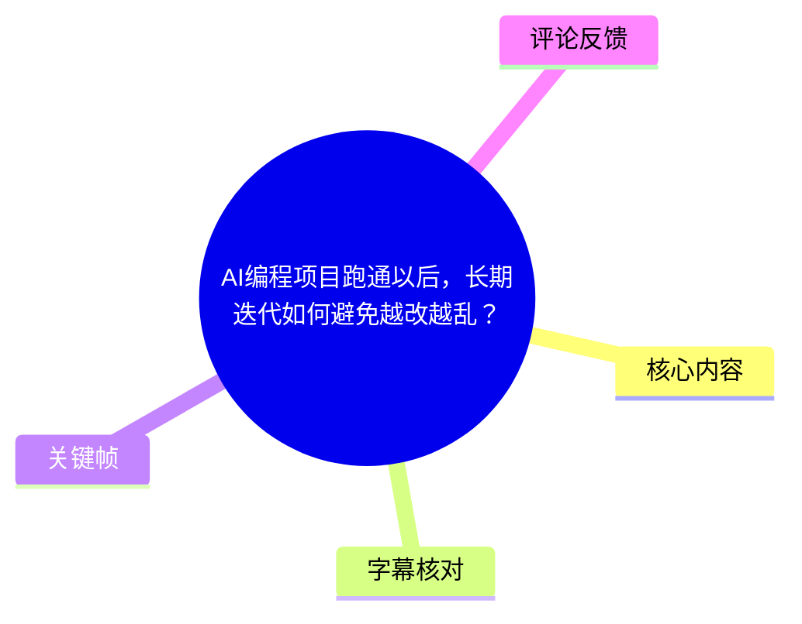
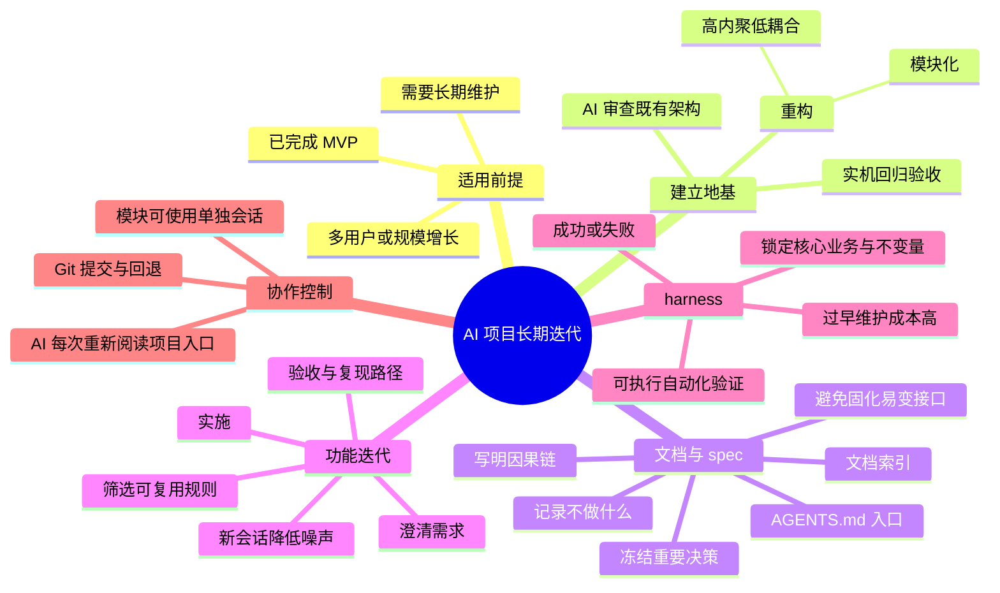
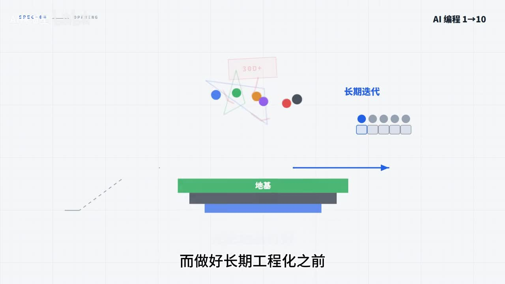
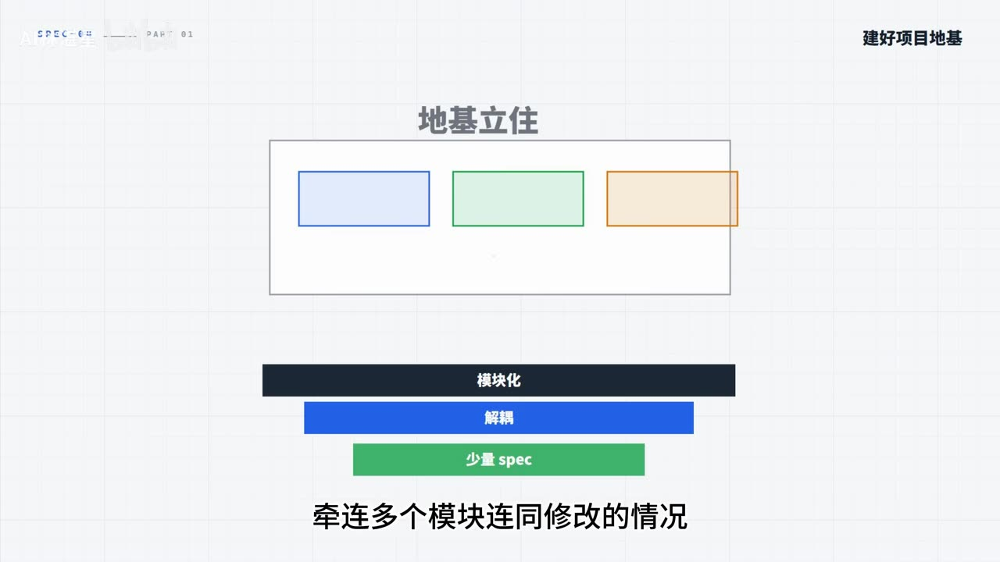
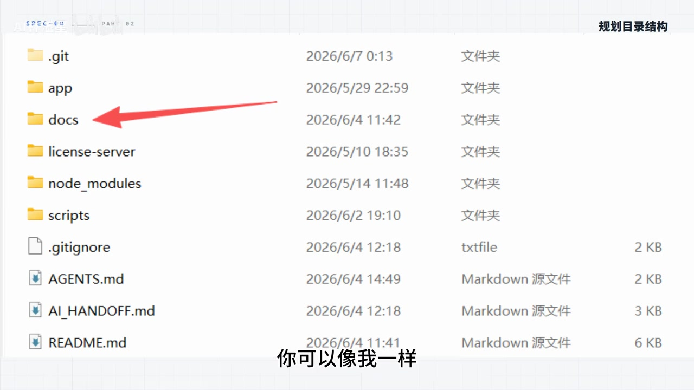
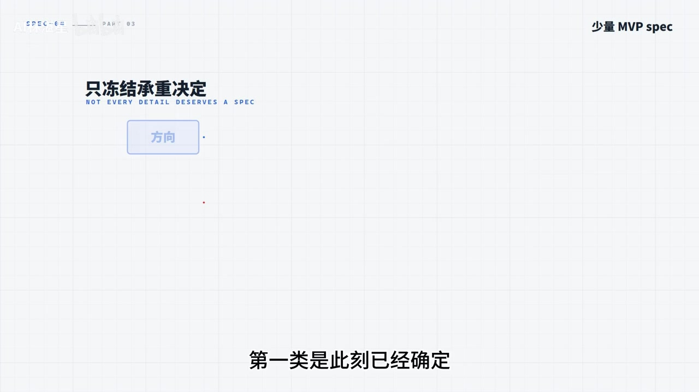

# AI编程项目跑通以后，长期迭代如何避免越改越乱？

> 来源：[Bilibili 视频](https://www.bilibili.com/video/BV1L2EE6bEeh)  
> UP 主：AI林湛星｜发布于：2026-06-09｜时长：09:37  
> 分区合集：AIcode｜标签：AI 编程、spec、harness、Codex、程序员

## 小结

这期视频讨论的不是如何快速做出 MVP，而是 **MVP 已跑通后，怎样让 AI 参与的项目能够持续迭代而不失控**。作者面向长期维护、多人使用或用户规模可能增长的项目，提出应尽早从“让 AI 直接写代码”转向“给 AI 建立工程化边界”。

核心路径是：先在 MVP 后进行一次重构，建立模块化、解耦和少量稳定规则构成的“地基”；随后以 `spec` 记录决策及其因果链，以 `harness` 将不应被随意改变的核心业务写成可执行的自动化验证；每次功能完成后先验收，再筛选值得沉淀的规则，而不是立刻追赶下一项需求。

视频特别强调：`spec` 是帮助 AI 理解项目历史与需求边界的自然语言契约，并不强制执行；`harness` 才是结果明确的可执行测试。两者不应机械地一一对应：过早、过多地维护 harness 会拖慢迭代；但核心业务、不变量和不希望 AI “偷偷改掉”的边界，应当进入 harness。

在协作方式上，作者建议通过新建会话降低上下文污染，并让 AI 从项目入口文档和文档索引重新了解项目。不过这不是绝对规则：若架构模块化足够好，可以围绕单一模块持续使用一个会话窗口；无论采用哪种方式，都应对每项需求或 Bug 修复及时提交 Git，以确保可回退。

本视频为工程经验与工作流建议，不涉及突发新闻，也没有给出特定 AI 编程工具、框架、测试库或命令的版本参数。其有效性依赖项目架构、模型能力与团队执行纪律；其中“AI 会跑偏”“概率模型”等属于作者对 AI 协作风险的判断，应结合实际项目验证。

## 思维导图





## 目录

- [适用场景：MVP 之后先补工程地基](#适用场景mvp-之后先补工程地基)
- [第一步：重构出模块化与解耦的地基](#第一步重构出模块化与解耦的地基)
- [第二步：目录、文档索引与少量 spec](#第二步目录文档索引与少量-spec)
- [第三步：新功能开发、验收与问题复现](#第三步新功能开发验收与问题复现)
- [第四步：从验收结果沉淀有因果链的 spec](#第四步从验收结果沉淀有因果链的-spec)
- [第五步：何时为规则增加 harness](#第五步何时为规则增加-harness)
- [会话、模块与 Git：控制上下文和回退风险](#会话模块与-git控制上下文和回退风险)
- [FAQ：是否每次新会话、是否每个 spec 都要 harness](#faq是否每次新会话是否每个-spec-都要-harness)
- [可执行工作流清单](#可执行工作流清单)
- [结论、限制与时效性](#结论限制与时效性)
- [字幕比对](#字幕比对)
- [评论分析](#评论分析)
- [处理记录](#处理记录)

## 适用场景：MVP 之后先补工程地基 [00:00](https://www.bilibili.com/video/BV1L2EE6bEeh?t=0)

作者先划定适用范围：

- **不必观看的情况**：项目仅供自己使用，且不准备长期维护，可以直接让 AI 放手实现。
- **需要工程化的情况**：项目准备长期迭代，或用户不止开发者一人，可能从少数用户扩展到数百、数千用户；目标是避免项目在数周后出现“越写越乱”、维护成本持续上升甚至崩溃的局面。
- **前置阶段**：项目已经通过 MVP 阶段，准备由“从 0 到 1 的可用原型”转向“从 1 到 10 的可持续演进”。

作者的判断是：长期工程化之前，最重要的是先打好项目“地基”。这里的地基并非单一技术组件，而是包括架构模块化、稳定决策文档、可执行约束，以及可回退的开发过程。



> 图：画面将“长期迭代”和用户增长置于“地基”之上，直观说明作者的主张：在扩大功能和用户规模前，先处理底层工程结构问题。

## 第一步：重构出模块化与解耦的地基 [00:30](https://www.bilibili.com/video/BV1L2EE6bEeh?t=30)

在已有 MVP 文档的基础上，作者建议先新开会话，让 AI 审查 MVP 项目架构。原因是 MVP 实现过程中，AI 经历讨论、自主决策、修复和开发后，为了快速达成目标，代码容易出现拼接、临时处理和职责混杂。

### 重构目标

作者要求 AI 重构时重点达到：

1. **模块化**：将不同职责拆分为相对独立的模块。
2. **功能与主架构解耦**：局部功能修改不应频繁牵连主架构。
3. **高内聚、低耦合**：这是作者明确使用的软件工程原则。目的不是追求抽象本身，而是减少后续修改某一功能时连带修改多个模块的概率。
4. **以 MVP 已有文档和少量 spec 为上下文**：让 AI 在新的对话中仍能理解项目和具体功能要求。



> 图：画面明确把“模块化”“解耦”“少量 spec”画为支撑项目地基的层次，并强调它们用于减少多模块被连带修改的风险。

### 为什么可在一个会话内完成这轮重构

作者认为 MVP 阶段的工程量通常尚不大，代码基数不会发生大规模变化；只要已有少量 spec，通常可支撑 AI 从重构开始持续工作到完成，不必过度担忧上下文污染。

但“重构完成”不等于地基已经验证完成。作者要求：

- 在真实设备或真实运行环境中演示；
- 回归检查 MVP 阶段已经验收的全部功能；
- 若发现问题，按“修复工作在新会话展开”的方式处理；
- 直到回归通过，再视为地基最终搭建完成。

这里的“实机演示”是作者提出的验收手段之一；素材没有提供具体平台、测试设备、命令或自动化回归工具。

## 第二步：目录、文档索引与少量 spec [01:48](https://www.bilibili.com/video/BV1L2EE6bEeh?t=108)

地基完成后，作者进入项目目录和文档治理。

### 目录组织：集中或分散均可，但需要 AI 可发现性

作者展示的个人项目根目录中包含 `.git`、`app`、`docs`、`scripts`、`AGENTS.md`、`AI_HANDOFF.md` 和 `README.md` 等内容，并将文档集中存放在 `docs` 目录。



> 图：画面展示 `docs` 与 `AGENTS.md` 位于项目根目录的组织方式，帮助理解“统一文档目录 + 入口索引”这一具体落地形态；这只是作者示例，而非唯一目录规范。

作者给出的两种文档组织方式都可行：

- 建立统一的文档目录，集中管理项目文档；
- 在各模块目录下自行维护对应模块文档。

作者认为，当前 AI 已具备读取代码的能力，因此模块文档和模块代码**不必强制放在同一目录**。但若选择集中式文档管理，则需要建立**文档索引**：

- 在根目录的 `AGENTS.md` 这类 Markdown 入口中写明项目文档索引；
- 让 AI 在需要时自行按索引阅读对应文档；
- 人在查阅和修改文档时，也不必逐层点开目录寻找模块资料。

### MVP 后优先保留“少量且稳定”的 spec

作者提出，目录规划后应先建立少量 spec，优先写两类不易变化的决策。

#### 1. 已确定、短期不会变化的方向性决定

示例：作者的 AI 桌宠项目以“数字生命永久陪伴”为项目初衷。作者将其归为软件方向的决策，认为这种为项目定调的内容应记录为决策类 spec。



> 图：画面写有“只冻结重要决定”，与正文的原则一致：spec 不应囊括所有实现细节，而应优先沉淀稳定、会持续影响项目的决策。

#### 2. 项目明确“不做什么”的决定

示例：作者的 AI 桌宠项目不做云数据同步。这是功能方向上的排除性决策，同样应以 spec 记录。作者将此类文件放在 ADR 目录中，并按顺序递增 ADR 文件名；同时明确说明，这只是其个人的目录命名方式。

### spec 应写什么，不应过度写什么

作者主张 spec 可以记录不同种类的决策，并应先写清楚**因果链**，即为什么做出该决定。这样 AI 在后续会话中更容易理解当前边界。

若开发者拥有明确的架构控制诉求，也可以在 spec 中补充更详细的接口、输入输出示例，以降低 AI 偏离预期的可能性。但作者总体上**不建议过早固化接口或变量**，原因是：

- 持续迭代后，早期接口可能无法满足新需求；
- 一旦文档没有随代码及时演进，就会形成技术上已过时的文档；
- 过期文档反而会误导后续 AI 和开发者。

## 第三步：新功能开发、验收与问题复现 [03:42](https://www.bilibili.com/video/BV1L2EE6bEeh?t=222)

作者将新功能开发拆为“建立干净上下文—确认需求—落地实现—验收反馈”的连续过程。

### 开发前：用新会话隔离历史噪声

沿用其 MVP 阶段的做法，开始一个新功能时先新建会话，以排除旧上下文中的干扰和噪声。随后：

1. 描述新需求；
2. 与 AI 多轮讨论；
3. 核验 AI 的反馈；
4. 直到确认 AI 已理解需求；
5. 再让 AI 开始实现。

作者补充：新功能开发相比 MVP 阶段更专精，因此 AI 已经理解需求后，**不需要再额外新开对话**，可以在当前会话直接落地。

### 开发后：必须验收，反馈必须包含复现路径

作者指出，AI 不一定一次就能实现所有需求点，因此功能完成后必须先验收。若发现问题，不能只告诉 AI：

- “这个功能有问题”；
- “网页打不开”；
- “崩溃了”。

这类描述在作者看来很致命，因为 AI 会根据代码自行猜测原因。更好的反馈应明确：

- 实际执行了什么操作；
- 操作的先后顺序；
- 在哪一步出现异常；
- 出现了什么现象。

可按如下结构组织反馈：

```text
复现步骤：
1. 在……页面执行……
2. 输入/选择……
3. 点击……
4. 出现……

预期结果：
……

实际结果：
……

影响范围：
……
```

作者的逻辑是：输入信息越模糊，AI 越会依赖猜测；一旦开始猜测，就可能出现“幻觉”式修复，给项目埋下后续维护隐患。不要因为急于得到结果，而积累由错误修复引发的连锁负反馈。

## 第四步：从验收结果沉淀有因果链的 spec [05:01](https://www.bilibili.com/video/BV1L2EE6bEeh?t=301)

作者强调，功能通过验收后，不应马上开始下一个需求，而应让 AI 回头审查本次功能中哪些内容属于：

- 决策；
- 约束；
- 边界；
- 后续维护必须遵守的规则。

AI 可以先列出一版候选 spec，但最终取舍必须由开发者自己完成。

### 什么不该写进 spec

作者明确排除：

- 一次性 Bug；
- 临时修复；
- 偶发问题。

这些内容若没有被确认会持续影响项目实现，不应直接升级为长期规则。

### 什么值得沉淀

应该写入 spec 的，是已经确认、已经验收、未来还会反复影响实现的项目规则。并且 spec 不应只写“应该怎么做”，更应写清：

> **为什么当时要这么做。**

原因是新会话中的 AI 不会天然继承项目历史。若缺少带因果链的决策记录，AI 后续维护时可能忽略旧决策、改动原本正确的代码，制造新的不确定性。

作者将大模型比作不会天然继承长期项目记忆的概率系统；因此，spec 的价值是降低后续维护中“抽到错误改法”的概率。验收通过不代表任务真正结束；真正结束是将可复用判断沉淀为项目资产。

## 第五步：何时为规则增加 harness [06:10](https://www.bilibili.com/video/BV1L2EE6bEeh?t=370)

### spec 与 harness 的角色差异

作者以 AI 桌宠举例：

- spec 规定：宠物饱腹度低于 **30** 时开始自主进食；
- 当饱腹度达到 **60** 时自动停止；
- spec 中还应说明这项设计背后的因果链。

这里的数值 **30 / 60** 是视频给出的具体业务示例，不应被泛化为其他项目的通用阈值。

作者指出，spec 本身只是自然语言契约，不会自动强制执行。因此，仅有 spec 不够；对关键规则还需 harness。

| 对象 | 作者在视频中的定位 | 作用 |
| --- | --- | --- |
| `spec` | 自然语言契约、项目知识与决策记录 | 让 AI 理解需求、约束和历史原因 |
| `harness` | 可执行脚本 / 自动化测试 | 验证业务代码是否实际遵守固定流程与规则 |

作者将 harness 描述为一个可执行脚本：运行后只有成功或失败两种结果。若某一业务逻辑已确定、未来不希望 AI 擅自改动，就应将其放进 harness。

### harness 的触发与人工介入

在项目维护和迭代中，只要 AI 修改了相关业务，运行 harness 就会得到通过或失败的结果。若失败，开发者需要人工判断失败属于哪种情况：

1. 历史决策本身需要重新评估；
2. AI 擅自改变了原有逻辑；
3. 新需求已经满足了推翻旧决策的条件。

### 写入 harness 的时机是关键限制

作者认为：

- **写得过早**：测试维护负担大，项目可能变得迟缓；
- **写得过晚或不写**：AI 可能改变核心业务，而开发者无法及时发现；
- **适合写入的内容**：已经稳定、核心、不可随时变动的业务边界和不变量；
- **不适合机械覆盖的内容**：每一条小 spec、持续变化中的细节、尚未稳定的实现方案。

作者还提出，harness 不必手写：每次新功能开发结束后，可以让 AI 产出 spec 和 harness；若 spec 很重要，开发者可以自行撰写或最终把关，而 harness 可以交给 AI 生成。视频没有演示具体测试代码、脚本语言、CI 配置或 AI 生成测试的审核方法，因此这些仍需在实践中补充。

## 会话、模块与 Git：控制上下文和回退风险 [07:19](https://www.bilibili.com/video/BV1L2EE6bEeh?t=439)

作者在项目迭代期通常会为每个新功能新开会话，目标是清除上下文污染。其理由是单轮对话越长，旧需求、修复争论、临时方案等噪声越多，AI 在当前会话中越容易偏离当前目标。

新会话启动后，作者建议先让 AI 阅读文档，尤其是项目入口 Markdown 与文档索引。这样 AI 的上下文尽量聚焦两类信息：

1. 这个项目是什么；
2. 当前有哪些功能、文档与 spec 决策。

作者用比喻说明：AI 每次都像项目“第一天入职”，而 spec 就是它的入职第一课。这个方法的要点不是让 AI 永久记忆，而是通过可发现的项目文档，每次重建必要上下文。

### 不必绝对“一需求一会话”

作者在答疑中修正了前述建议：并非每次需求、甚至每个小 Bug 都必须新开会话，取决于项目地基和架构质量。

如果项目模块化程度高、模块边界清楚，可以采用：

- 一个模块对应一个会话窗口；
- 在该窗口中处理该模块的新需求和 Bug 修复；
- 因为上下文始终围绕同一模块，噪声相对可控。

无论是否新开会话，作者都建议每个需求或 Bug 修复后进行一次 **Git 提交**。有 Git 记录时，即使当前窗口中 AI 的效果逐渐变差，也可以回退到稳定版本，并新建会话继续工作。

视频提到了 Git 的提交和回退价值，但没有给出分支策略、提交信息规范、合并流程或远端仓库协作方案。

## FAQ：是否每次新会话、是否每个 spec 都要 harness [08:07](https://www.bilibili.com/video/BV1L2EE6bEeh?t=487)

### Q1：每个需求都必须新开会话吗？

**不必须。** 取决于项目基础与模块化程度：

- 架构混乱、上下文已经混杂时：新开会话更有利于排除噪声；
- 架构良好、职责边界清晰时：可以按模块维持会话；
- 无论哪种方式：按需求或 Bug 提交 Git，保留回退能力。

### Q2：有 spec 就必须有 harness 吗？

**不必须。** 作者区分两者目标：

- spec 的目标是让 AI 理解需求；
- harness 的目标是强制以固定流程测试业务。

若每个 spec 都配置一个 harness，项目会因维护成本过高而变慢；小改动也可能需要付出大量测试维护时间。

### Q3：持续迭代中，什么时候需要 spec + harness？

当某条业务逻辑同时符合以下条件时，应考虑加入 harness：

- 它是核心业务；
- 它属于不变量或明确边界；
- 不希望 AI 在后续维护中随意、悄然改动；
- 即使 AI 理解了 spec，也不能接受其由于概率性输出而没有正确落实代码。

作者的结论是：**spec 用于理解，harness 用于锁住边界与不变量。**

## 可执行工作流清单 [00:30](https://www.bilibili.com/video/BV1L2EE6bEeh?t=30)

以下清单按视频建议重组，可作为 MVP 后进入长期迭代阶段的操作参考。

### 阶段 A：MVP 后的地基重建

- [ ] 收集 MVP 阶段的项目文档与既有少量 spec。
- [ ] 新开会话，让 AI 审查当前架构。
- [ ] 要求重构目标明确为：模块化、功能与主架构解耦、高内聚低耦合。
- [ ] 在重构完成后进行真实运行环境/实机回归。
- [ ] 若回归异常，在新会话中修复，再次验证。

### 阶段 B：建立项目知识入口

- [ ] 选择集中式或模块内文档管理方式。
- [ ] 若采用集中式 `docs`，建立文档索引。
- [ ] 在根目录 `AGENTS.md` 等入口文件中列出索引。
- [ ] 仅优先记录稳定的方向性决策和明确“不做什么”的决策。
- [ ] 对每条重要规则说明“为什么”，而非只写“怎么做”。
- [ ] 警惕过早将接口、变量等易变技术细节写死在文档中。

### 阶段 C：实现单个新功能

- [ ] 新建会话或进入对应模块的受控会话。
- [ ] 让 AI 先读取项目入口和必要文档。
- [ ] 通过多轮讨论确认需求已被正确理解。
- [ ] 在当前会话直接实施功能。
- [ ] 手动/实机验收。
- [ ] 若出错，提供完整复现路径、预期与实际结果，避免模糊反馈。
- [ ] 每项需求或 Bug 修复后提交 Git。

### 阶段 D：验收后的沉淀

- [ ] 让 AI 列出本次功能中可能的决策、边界和约束。
- [ ] 由人筛选候选 spec。
- [ ] 不将临时修复、一次性 Bug、偶发问题直接写入 spec。
- [ ] 对稳定的核心业务规则，决定是否新增 harness。
- [ ] 运行 harness；若失败，人工判断是旧决策变更、AI 误改还是新需求导致。

## 结论、限制与时效性 [09:20](https://www.bilibili.com/video/BV1L2EE6bEeh?t=560)

视频提供的核心方法不是“让 AI 记住一切”，而是将长期项目中需要反复遵守的知识分层：

1. **架构层**：通过模块化与解耦减少修改扩散；
2. **知识层**：通过文档索引与有因果链的 spec，让 AI 在新会话中理解项目；
3. **验证层**：通过 harness 把核心业务、不变量和不可随意修改的边界变成可执行验证；
4. **过程层**：用新会话控制上下文噪声，用 Git 保留回退能力，用验收和复现路径降低 AI 猜测式修复的风险。

需要保留以下限制：

- 视频的术语主要以作者工作流为准。`spec`、`harness`、`ADR` 在不同团队和工具链中可能有不同的文件格式、组织方式与实现范围。
- 作者展示了目录截图和业务阈值示例，但未给出完整代码、测试框架、CI 流程、覆盖率标准或性能指标，不能直接推导为通用工程规范。
- “AI 幻觉”“上下文污染”“概率模型”等表述说明了真实协作风险，但不同模型、上下文窗口、Agent 工具、代码库规模下的具体影响程度并未在视频中量化。
- `harness` 不能替代人工决策：测试失败时仍需判断是代码回归、历史规则错误，还是需求已改变。
- 视频发布于 2026-06-09。AI 编程模型能力、Agent 的上下文管理方式及自动测试能力可能持续变化；应以当前工具文档和项目实际风险为准。

## 字幕比对 [00:00](https://www.bilibili.com/video/BV1L2EE6bEeh?t=0)

| 字幕来源 | 完整性 | 专有名词 | 时间轴 | 主要问题 |
| --- | --- | --- | --- | --- |
| Bilibili 站内字幕 | 完整，覆盖 00:00.120—09:36.080 | 整体较可靠，可辨识 MVP、spec、ADR、harness、Git、AGENTS.md 等 | 分段细，覆盖全片，适合作为正文时间轴依据 | 个别词存在识别/转写误差，如“绘画”应结合语境理解为“会话”；部分英文术语大小写不统一 |
| 本次 ASR（medium） | 有效语音覆盖约 95.6%，24 段，末段至 09:36.080 | 多处明显误识别，如“绘画”“低级”“honey/harnest”“MVB”等 | 虽有时间戳，但首段从 00:25.160 开始，和站内字幕的完整开头不一致；不适合作为本篇主时间轴 | 专有名词和工程术语失真明显，且前段时间覆盖缺失/偏移，不宜直接引用原文 |

### 最终字幕选择与校正原则

本篇以**站内 SRT 字幕**作为时间轴和内容的主依据，原因是其从 00:00.120 起完整覆盖视频，时间颗粒度更细；同时逐段检查了本次 ASR，不将 ASR 结果忽略。

本次 ASR 的诊断显示：语言为中文，语音覆盖率约 **0.956**，首段语音时间为 **00:25.160**，末段为 **09:36.080**；素材未标记 `noAudioStream=true`，且提供了音频文件与 ASR 结果，因此并非无音轨视频。

结合站内字幕、ASR 上下文和关键帧，对以下词语作了语义校正：

- ASR 中多次出现的“绘画”按站内字幕与上下文统一为**会话 / 对话**；
- “低级”“DG”等统一理解为**地基**；
- “honey”“harnest”等统一为 **harness**；
- “SPECT”“spank”等统一为 **spec**；
- “Agents / harness markdown”等结合关键帧统一为根目录入口文件 **`AGENTS.md`**；
- “get”按站内字幕上下文统一为 **Git**；
- “保护度低于 30”按站内字幕和语义统一为桌宠的**饱腹度低于 30**。

## 评论分析 [09:34](https://www.bilibili.com/video/BV1L2EE6bEeh?t=574)

以下仅分析可获取的热评前三条；评论是个人经验或提问，不视为已验证事实。

### 1. S_Autumn（34 赞）

评论提出三项补充：

1. 更推荐用 **TDD 用例**承载最佳实践，并在测试中加入简短场景说明，而非单独写文档；
2. 认为持续迭代的关键在前期设计和认知拉齐，推荐使用“拷问式”的需求澄清方法；
3. 建议将 Bug 以 issue 形式统一管理并整体分析，避免 AI 连续使用临时 hotfix 导致兼容与降级逻辑堆积。

这与视频“spec + harness”的思路存在明显共识：关键规则需要可执行验证。但该评论进一步主张让测试用例承担更多 spec 职责，认为测试天然会被运行，因此比静态文档更不易过期或被忽略。

需要注意的是，测试覆盖不到的产品方向、排除性决策和非功能性取舍，仍可能需要文档表达；“TDD 用例可替代文档”的范围和效果并未在评论中验证。

### 2. Stayaw（13 赞）

评论将 AI 项目开发归纳为一条经验流程：

> 增长（MVP 快速铺功能）→ 验收 → 打断（Bug 修复、需求变更）→ 缝补（细节打磨）→ 反思 → 重构。

其补充重点包括：

- Agent 无状态启动时，需先让它熟悉项目、项目地图和文档；
- 需求应同时说明“要什么、不做什么、为什么”；
- 先分析再写代码；
- 避免补丁式开发；
- 及时重启或压缩上下文；
- 项目膨胀后，从单窗口过渡到多窗口并分离职责。

这些观点与视频的 `AGENTS.md`/文档索引、新会话控制上下文、spec 记录方向与排除项、MVP 后重构等建议高度一致。评论的“单窗口到多窗口演进”是对视频“可按模块保留会话”的进一步实践化描述，但仍是个人经验总结。

### 3. _炎汐_（7 赞）

该评论提出一个关键问题：如果 `AGENTS.md` 中索引了 docs，而 docs 中有大量 spec，是否会导致 AI 每次会话都加载全部 spec，从而干扰模型注意力？

这是对视频方案的重要边界追问。视频本身的表述是通过文档索引让 AI “按需阅读”，并非明确要求每次全量加载所有 spec。结合视频强调的“降低上下文噪声”，更一致的理解是：

- 入口文档应首先提供项目地图；
- 当前任务只读取相关模块、相关决策和必要约束；
- 不应把“建立索引”误解为“强制全量塞入上下文”。

但视频没有给出文档分层、检索规则、上下文预算或自动按需加载的技术实现，因此这一问题仍需根据实际 Agent 工具能力自行设计和验证。

## 评论分析

- 热评 1：1.spec记录，最佳实践的形式是TDD的用例，同时在用例内部加简单场景描述注释，而不是简单写文档记下来，AI做改动会天然跑测试，如果有问题会自动读到这个用例理解原有逻辑，标准的harness处理过程幻觉率极低。专门写文档可能出现描述不准确、描述过时、AI理解歧异同时有概率被上下文压缩导致丢失、注意力幻觉问题，而TDD用例是必然跑的，如果需求事实发生变更TDD用例必然也要随之调整过期、不准确描述等问题会大幅缩小 2. 可持续迭代的关键步骤在于前期设计和认知的拉齐，这个过程往往比后续编码更重要，mattpocock大佬的拷问skill 这个阶段非常好用 3. 让AI修BUG，如果不干预AI真的是饮鸩止渴的思路修，临时hotfix修多了你会发现你的代码一堆兼容、降级逻辑彻底救不回来，最佳实践应该类似搞成issue形式统一管理bug,做整体分析按照拉齐认知按照新需求的方式推进来修
- 热评 2：学习了，分享一些自己开发的经验，大致的流程就增长(mvp快速铺功能)，验收(人为测试发现边界问题)，打断(bug修复，需求变更)，缝补(细节打磨)，反思(和ai一起梳理好需求和约束)，重构(功能模块间的解藕，彻底梳理清楚数据模型，数据流，状态更新流)，agent最大的问题就是无状态启动，启动后要解决如下问题，1熟悉项目(知道是什么，准备好项目地图和文档，避免每次重新探索整个项目)，2熟悉你的需求(方向，要什么，不要什么，为什么，不需要一次性想清楚可以和ai反复讨论)，agent启动后依旧要关注的问题，0想清楚再动手(对agent来说也是一样的，先分析再写代码效果更好)1避免打补丁式开发(一个功能迭代数轮依旧不满意，不是agent能力问题，可能是这个功能历史包袱太重)2上下文管理(及时重启或者压缩上下文，避免agent注意力分散，影响能力)3从单窗口到多窗口演进(项目膨胀之后，从初期的单窗口过渡到多窗口，分离职责，处理不同的问题)[打call][打call]
- 热评 3：你好，想请教一个问题，按照我目前的理解，目前是在Agent.md中写docs的索引，然后docs里面都是spec，所以ai每次会话都会去读取所有的spec。但是有些需求可能不一定是简单几句话就能说清楚的，让ai在一开始就加载所有的spec到上下文中，这样设计是否会导致干扰模型注意力？

以上内容是观众反馈摘录，只用于补充理解视频反响，不作为正文事实依据。

## 处理记录

- Worker ID：`worker-mrj0www4-e8d79408`
- 模型：`gpt-5.6-terra`
- 使用素材与工具产物：Bilibili 元数据、站内字幕 `p01-ai-zh.srt`、本次 ASR 结果 `asr/asr-result.json` 与 `asr/transcript.srt`、关键帧目录 `frames/`、热评数据 `comments/comments.json`。
- 字幕选择：已检查站内字幕与本次 ASR。站内字幕覆盖从 00:00.120 至 09:36.080，且术语准确度较高，作为正文内容与时间轴主依据；ASR 用于交叉核对语义和覆盖诊断，不直接采用其存在误识别的术语文本。
- 音轨判断：ASR 结果未标记 `noAudioStream=true`，并提供音频及有效 ASR 分段；因此按“存在音轨”处理。
- 时间轴依据：正文时间点均依据站内 SRT 的真实起止时间换算为秒数，链接格式为 `https://www.bilibili.com/video/BV1L2EE6bEeh?t=<秒数>`。
- 关键帧选择依据：
  - `frame-001.jpg`：展示“长期迭代”建立在“地基”之上，用于说明问题背景；
  - `frame-002.jpg`：展示模块化、解耦、少量 spec 的地基构成；
  - `frame-003.jpg`：展示 `docs`、`AGENTS.md` 等目录组织示例；
  - `frame-004.jpg`：展示“只冻结重要决定”，对应 spec 的筛选原则。
- 评论范围：仅处理素材中可获取的热评前三条，未扩展至其他评论。
- 缓存清理：所提供素材未包含缓存清理执行记录；无法据此确认是否已清理，不作编造性声明。
- 未解决问题：视频未提供 harness 的具体实现、测试框架、CI 集成、文档按需检索机制及 Git 协作规范；这些内容不能从现有素材中补全。
