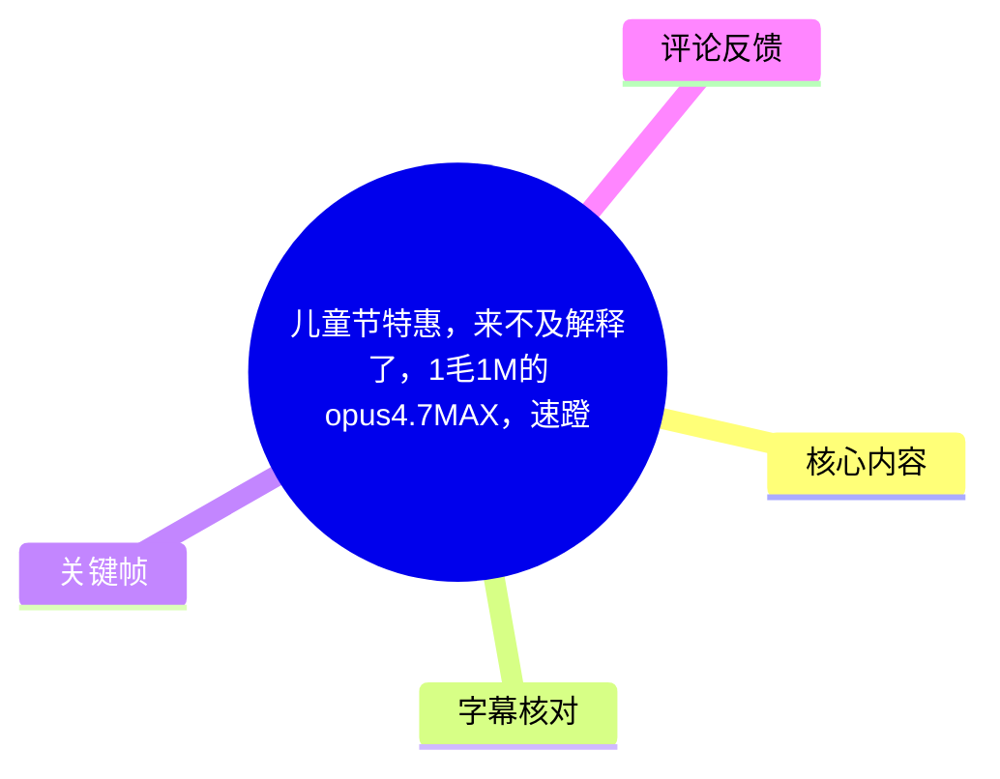
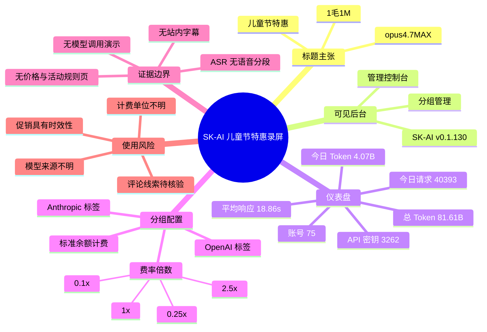
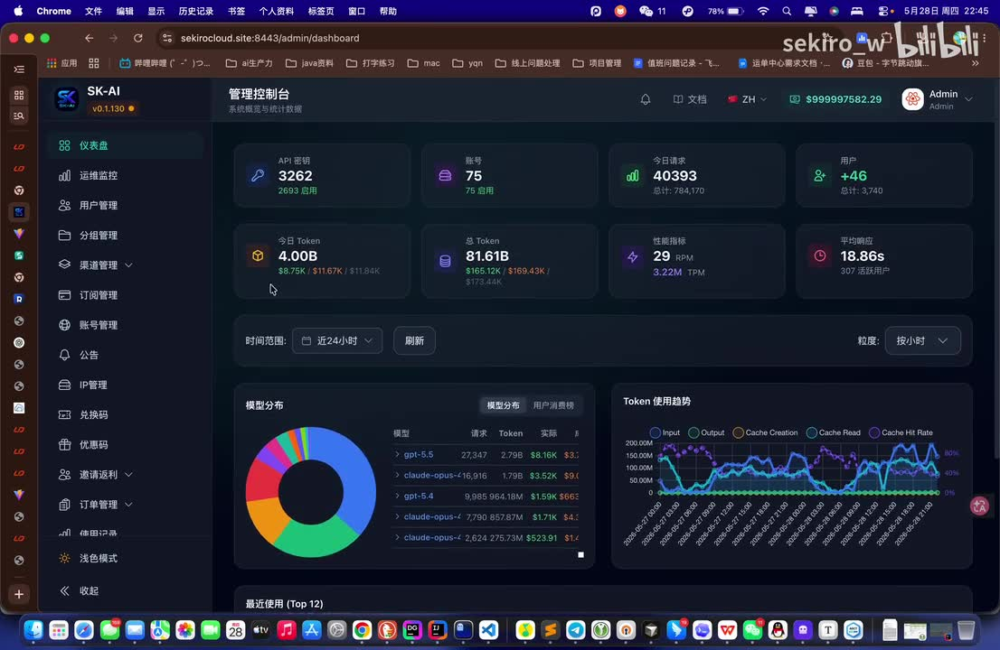
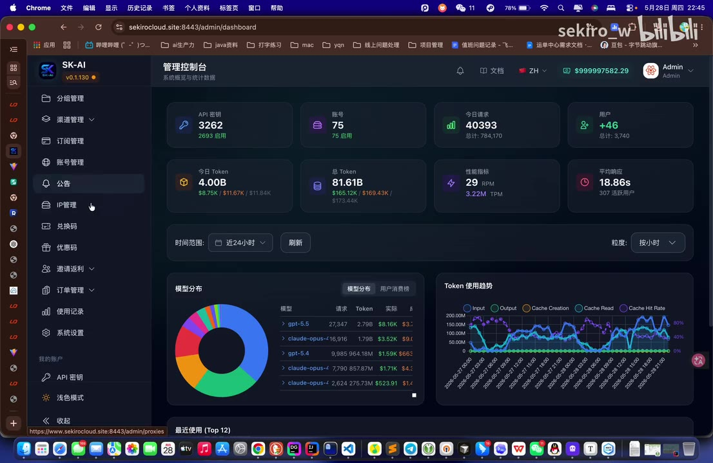
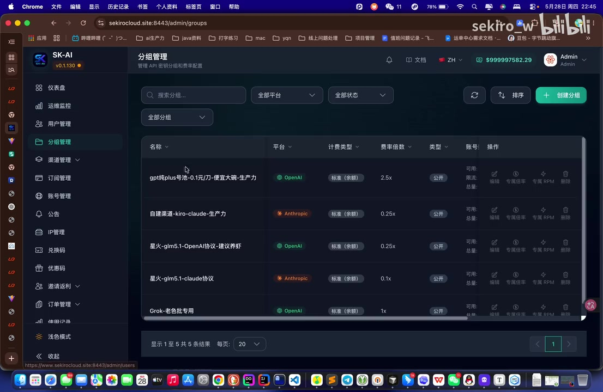

# 儿童节特惠，来不及解释了，1毛1M的opus4.7MAX，速蹬

> 来源：[Bilibili 视频](https://www.bilibili.com/video/BV1p6VW6gEbc)  
> UP 主：`sekiro_w`｜时长：39 秒｜收藏集：AIcode  
> 视频简介：`话不多说，蹬就完事了`  
> 发布时间：2026-05-28（由元数据 Unix 时间戳 `1779979878` 换算）

## 小结

视频是一段约 39 秒的管理后台录屏，标题以“儿童节特惠”为宣传语，声称存在“`1毛1M` 的 `opus4.7MAX`”优惠。录屏实际展示的主要内容是名为 **SK-AI v0.1.130** 的后台控制台及其“分组管理”页面，而非模型对话、接口请求、支付订单或优惠领取流程。

画面可确认该后台包含仪表盘、运维监控、用户管理、分组管理、渠道管理、订阅管理、账号管理、公告、IP 管理、兑换码、优惠码、邀请返利、订单管理、使用记录、系统设置等功能模块。仪表盘还呈现 API 密钥、账号、请求量、Token 用量、性能指标、平均响应时间及模型分布等聚合统计。

“分组管理”页面显示多个公开分组，并可见 `OpenAI`、`Anthropic` 平台标签、`标准（余额）`计费类型，以及 `0.1x`、`0.25x`、`1x`、`2.5x` 等费率倍数。视频未解释这些倍率的基准价格，也未证明其与标题中的“1毛1M”一一对应。

站内未提供可用字幕；本次 ASR 已检查音频，但识别结果为空，没有产生任何带时间戳的语音分段。诊断未标记 `noAudioStream=true`，因此只能如实说明：素材存在音频产物，但 ASR 未识别到可转写语音，不能将其表述为无音轨。本文据标题、元数据、关键帧和唯一可获取热评整理。

最重要的限制是：视频没有展示 `opus4.7MAX` 的正式模型标识、供应商、接口响应、Token 账单、价格页、优惠期限、领取条件、库存状态或支付流程。因此，“1毛1M”的具体计费口径及活动当前有效性均未被视频充分证实，属于强时效性的促销性主张，实际使用前应另行核验。

## 思维导图

## 目录

- [视频定位与时效性](#视频定位与时效性)
- [管理控制台与可见统计](#管理控制台与可见统计)
- [分组管理与费率配置](#分组管理与费率配置)
- [标题优惠主张的证据边界](#标题优惠主张的证据边界)
- [视频展示步骤与核验建议](#视频展示步骤与核验建议)
- [关键参数汇总](#关键参数汇总)
- [结论与限制](#结论与限制)
- [字幕比对](#字幕比对)
- [评论分析](#评论分析)
- [处理记录](#处理记录)

## [视频定位与时效性](https://www.bilibili.com/video/BV1p6VW6gEbc?t=0)

由于站内字幕缺失、本次 ASR 也没有输出任何可用的带时间戳分段，无法依据字幕起止时间为画面建立细粒度时间轴。以下各章节均链接至视频起点，避免按照文字或画面顺序臆测具体发生秒数。

视频标题为：

> 儿童节特惠，来不及解释了，1毛1M的opus4.7MAX，速蹬

标签包括 `claude`、`chatgpt`、`opus-4.7`、`ai`、`hermes`、`codex`、`opus`、`4.7`、`gpt`、`claduecode`。这些信息说明视频面向 AI 模型、兼容接口或聚合服务使用者，但标签和标题本身不能证明某个模型版本、价格或服务来源的真实性。

应区分三类证据：

1. **可直接确认的信息**：标题包含“1毛1M”“opus4.7MAX”；关键帧显示 SK-AI 后台及其运营、分组配置界面。
2. **画面内的后台状态**：录制时的 API 密钥数量、请求量、Token 量、分组费率和公开状态等。
3. **视频尚未证明的信息**：标题所称优惠的实际规则、适用范围、计费口径、模型上游、有效期、是否仍可领取及实际调用效果。

元数据时间对应 2026 年 5 月 28 日；关键帧顶部系统日期也显示“5月28日”。视频没有给出活动结束时间。促销类信息可能随库存、分组、渠道、价格策略或账户资格发生变化，不能把发布时的标题主张视为长期承诺。

## [管理控制台与可见统计](https://www.bilibili.com/video/BV1p6VW6gEbc?t=0)

录屏显示一个名为 **SK-AI** 的后台，左上角版本标记为 **v0.1.130**。当前首页标题为“管理控制台”，副标题为“系统概览与统计数据”。

> 图：该帧同时显示后台名称、版本号、顶部统计卡片、模型分布、Token 使用趋势和最近使用图表。它是确认视频主体为多用户 AI 服务管理后台的高信息密度证据；但画面并未直接证明标题所称优惠已生效。

关键帧中可直接辨认的汇总指标如下：

| 指标 | 画面显示 | 证据使用边界 |
| --- | ---: | --- |
| API 密钥 | 3262 | 下方可见“2693 启用”；统计范围未说明。 |
| 账号 | 75 | 下方可见“75 启用”。 |
| 今日请求 | 40393 | 下方显示总计 `784,170`；具体统计周期未说明。 |
| 用户 | `+46` | 下方显示总计 `3,740`；`+46` 的变化周期未标明。 |
| 今日 Token | 4.07B | 页面下方同时有金额字段，但字段含义未解释。 |
| 总 Token | 81.61B | 属于录屏时后台聚合数据，不代表单一模型。 |
| 性能指标 | 29.6B | 下方显示 `3.22M TPM`；无法据此推断具体模型吞吐能力。 |
| 平均响应 | 18.86s | 下方显示 `307 活跃用户`；平均值的样本范围与时间窗口未知。 |

仪表盘还展示以下图表：

- **模型分布**：环形图与模型列表，可辨认部分模型名称包括 `gpt-5.5`、`claude-opus-4` 等。由于文字较小、部分名称截断，本文不将其转写为完整模型清单。
- **Token 使用趋势**：图例包含 `Input`、`Output`、`Cache Creation`、`Cache Read` 和 `Cache Hit Rate`，表明后台在统计输入、输出及缓存相关指标。
- **最近使用（Top 12）**：以多个邮箱地址作为图例。考虑到画面中可能包含个人识别信息，本文不转录具体地址。

> 图：该帧补充展示左侧导航菜单。它说明该系统除仪表盘外，还涉及渠道、订阅、账号、订单、优惠码和使用记录等运营环节，帮助理解视频展示的是服务管理后台而不是普通聊天页面。

画面可见的功能入口包括：

- 仪表盘、运维监控、用户管理；
- 分组管理、渠道管理、订阅管理、账号管理；
- 公告、IP 管理、兑换码、优惠码、邀请返利；
- 订单管理、使用记录、系统设置；
- 我的账户、API 密钥与浅色模式切换。

这些入口只能说明界面具备相应模块，不能证明每个模块均已启用、可公开使用，或与标题中的模型优惠存在直接关系。

## [分组管理与费率配置](https://www.bilibili.com/video/BV1p6VW6gEbc?t=0)

视频画面进入“分组管理”页，页面说明为“管理 API 密钥分组和费率配置”。该页可见搜索框、平台筛选、状态筛选、分组筛选、刷新、排序及“创建分组”按钮。

> 图：该帧直接显示分组名称、平台、计费类型、费率倍数和类型等列，是本文记录多平台分组与费率配置的主要依据。列表反映的是录屏瞬时状态，不应视为当前公开可用的服务目录。

画面中可辨认的五条分组如下：

| 分组名称 | 平台标签 | 计费类型 | 费率倍数 | 类型 | 可确认范围 |
| --- | --- | --- | ---: | --- | --- |
| `gpt纯plus号池-0.1元/刀-便宜大碗-生产力` | OpenAI | 标准（余额） | 2.5x | 公开 | 分组名含“0.1元/刀”，但“刀”的单位、适用模型与实际价格未定义。 |
| `自建渠道-kiro-claude-生产力` | Anthropic | 标准（余额） | 0.25x | 公开 | 可确认后台以 Anthropic 为该组的平台标签。 |
| `星火-glm5.1-OpenAI协议-建议养虾` | OpenAI | 标准（余额） | 0.25x | 公开 | 名称出现“glm5.1”“OpenAI协议”，不足以确认实际模型上游。 |
| `星火-glm5.1-claude协议` | Anthropic | 标准（余额） | 0.1x | 公开 | 仅能确认页面显示相应标签与倍率。 |
| `Grok-老色批专用` | OpenAI | 标准（余额） | 1x | 公开 | 未展示具体额度、路由配置、模型限制或审核规则。 |

列表中每条分组右侧还可见操作区域，包括编辑、费率倍率、专属 RPM、删除等入口或文字。视频没有展示点击后的配置页，也没有展示某一用户、账号或 API Key 如何被分配至某个分组。

可从界面结构中谨慎得出的结论是：该后台似乎支持按分组组织 API 服务，分配不同平台标签、余额计费类型、费率倍数与公开状态，并提供针对特定分组的管理操作。该结论来自关键帧中的多模态界面理解，不等同于完整功能文档或已验证的服务能力。

## [标题优惠主张的证据边界](https://www.bilibili.com/video/BV1p6VW6gEbc?t=0)

标题中的核心商业表达是：

- `opus4.7MAX`
- `1毛1M`

当前素材能够确认的只是上述词语出现在视频标题中。关键帧没有显示对应的价格表、模型详情、订单页、接口文档、请求日志、账单明细、优惠券规则或活动公告。

因此，下列关键问题均无法仅由本视频回答：

1. `1M` 指 100 万输入 Token、100 万输出 Token、输入输出合计 Token，还是其他计费单位？
2. “1毛”是否明确等于人民币 0.1 元，是否包含税费、充值门槛、限购条件或优惠码要求？
3. `opus4.7MAX` 是官方模型名称、第三方路由名称、兼容接口别名，还是营销命名？
4. 分组页可见的 `0.1x`、`0.25x`、`1x`、`2.5x` 是否与标题价格有关？如有关，基准价格是什么？
5. 服务是否有 RPM、TPM、并发数、上下文窗口、模型可用区域、请求类型或账户等级限制？
6. “儿童节特惠”是否已结束，是否属于限量领取，是否仍对新用户开放？

视频中的后台画面与标题的促销主张之间没有建立直接的可验证链条。尤其是，仪表盘中的总 Token、总金额或响应时间属于后台聚合指标，不能换算为某个模型的单位价格，也不能反推“1毛1M”的真实性。

对于涉及 API Key、付款、个人信息或生产数据的第三方服务，应避免因“速蹬”“手慢无”等催促性措辞跳过验证。优先从正式价格页、服务条款、模型响应字段、账单记录和可信的官方公告中确认信息。

## [视频展示步骤与核验建议](https://www.bilibili.com/video/BV1p6VW6gEbc?t=0)

### 视频实际可确认的展示流程

从关键帧可确认的画面流程仅包含：

1. 打开 SK-AI 管理控制台；
2. 查看 API 密钥、账号、请求、用户、Token、性能与平均响应等统计卡片；
3. 查看模型分布、Token 使用趋势和最近使用趋势；
4. 浏览左侧的系统运营与配置模块；
5. 进入“分组管理”；
6. 查看分组的平台标签、计费类型、费率倍数与公开状态；
7. 显示筛选、刷新、排序和创建分组入口。

视频未展示以下可复现操作：

- 注册或登录服务；
- 获取活动资格；
- 输入或领取兑换码；
- 购买、充值或支付；
- 创建 API Key；
- 选择 `opus4.7MAX`；
- 发起模型请求；
- 查看模型返回与 Token 用量；
- 查看实际扣费账单。

### 建议补齐的核验步骤

以下是依据素材限制给出的验证清单，并非视频已经完成的教程步骤：

1. 在服务方的正式页面确认活动开始、结束时间及适用账户范围。
2. 明确 `1M` 的 Token 口径，分别确认输入、输出、缓存创建、缓存读取是否独立计费。
3. 在模型列表、接口文档或 API 响应中确认 `opus4.7MAX` 的实际 `model` 标识与上游来源。
4. 使用非生产环境和低金额测试请求，保留调用时间、模型字段、输入输出 Token 与账单记录。
5. 核验并发数、RPM、TPM、上下文长度、超时策略、内容规则与退款政策。
6. 首次试用时不要提交生产密钥、长期有效支付信息、客户数据或其他敏感内容。
7. 如果需要通过群组或“助理”领取，应先确认其是否为 UP 主公开认证的渠道，并阅读对应活动规则。

## [关键参数汇总](https://www.bilibili.com/video/BV1p6VW6gEbc?t=0)

| 类别 | 参数或信息 | 来源 | 可如何使用 |
| --- | --- | --- | --- |
| 视频时长 | 39 秒 | 元数据 | 可确认。 |
| 视频标题 | 儿童节特惠，来不及解释了，1毛1M的opus4.7MAX，速蹬 | 元数据 | 可确认标题含该宣传语。 |
| 后台名称 | SK-AI | 关键帧 | 可确认录屏左上角如此显示。 |
| 后台版本 | v0.1.130 | 关键帧 | 可确认录屏时如此显示。 |
| 宣称模型 | opus4.7MAX | 标题 | 仅确认被标题提及，未核验真实模型标识。 |
| 宣称价格 | 1毛1M | 标题 | 单位、条件、有效性均未说明。 |
| API 密钥 | 3262 | 仪表盘关键帧 | 聚合统计，范围不明。 |
| 账号 | 75 | 仪表盘关键帧 | 画面显示其中 75 启用。 |
| 今日请求 | 40393 | 仪表盘关键帧 | 统计日期与口径未展开。 |
| 今日 Token | 4.07B | 仪表盘关键帧 | 不能直接换算模型套餐成本。 |
| 总 Token | 81.61B | 仪表盘关键帧 | 录屏时后台总量，统计范围未知。 |
| 平均响应 | 18.86s | 仪表盘关键帧 | 不等于特定模型响应性能。 |
| 平台标签 | OpenAI、Anthropic | 分组管理关键帧 | 为后台字段，不能单独证明上游供应商。 |
| 可见费率倍数 | 0.1x、0.25x、1x、2.5x | 分组管理关键帧 | 基准价与换算规则不明。 |
| 可见计费类型 | 标准（余额） | 分组管理关键帧 | 可确认可见行如此标注。 |

## [结论与限制](https://www.bilibili.com/video/BV1p6VW6gEbc?t=0)

视频的实际信息价值在于展示一个名为 SK-AI 的 AI 服务运营后台：其界面包含多平台分组、余额计费、费率倍率、运营统计、账号与订单管理等功能。画面中可见 `OpenAI` 与 `Anthropic` 平台标签，也可见不同分组对应的倍率配置。

但视频不能作为“`opus4.7MAX` 以 `1毛1M` 稳定供应”的充分验证材料。模型真实名称、供应链、价格口径、输入输出差异、缓存费用、活动期限、限额、可用性和售后规则均未在视频中展示。

由于站内无字幕且 ASR 未识别到语音片段，本文不能基于真实字幕时间建立精确镜头段落，也没有把无法确认的画面内容强行归入特定秒数。涉及模型、价格和活动资格的内容应以视频标题视为发布者主张，并以可见后台画面作为有限辅助证据，而非完成的商业或技术验证。

## [字幕比对](https://www.bilibili.com/video/BV1p6VW6gEbc?t=0)

| 字幕来源 | 完整性 | 专有名词 | 时间轴 | 主要问题 |
| --- | --- | --- | --- | --- |
| Bilibili 站内字幕 | 未提供可用字幕 | 无法核验 | 无可用 SRT 分段 | 素材明确说明没有可用站内字幕。 |
| 本次 ASR 字幕 | 空 | 无可用识别文本 | ASR 支持时间戳，但实际为 0 个分段 | `medium` 模型未识别出任何语音片段。 |

本次 ASR 已完成检查，结果如下：

- 模型：`medium`
- 自动识别语言：英语（置信度 `0.541015625`）
- 音频时长：约 `38.45225` 秒
- 识别分段数：`0`
- 语音覆盖时长：`0` 秒
- 语音覆盖率：`0`
- 首段、末段语音时间：均为空
- 诊断提示：未识别到语音分段，建议确认源内容中是否存在可听语音并检查音轨。

诊断信息**未标记** `noAudioStream=true`。因此，不能称源视频没有音轨，也不能将空转写归因于工具失败；准确表述应为：本次 ASR 对提供的音频未识别出可用语音文本。

最终字幕选择为：**不采用站内字幕或 ASR 字幕文本**。正文基于元数据、标题、关键帧与评论内容整理。通过关键帧和多模态画面理解校正的关键文字包括：

- `SK-AI`
- `v0.1.130`
- `OpenAI`
- `Anthropic`
- `标准（余额）`
- `0.1x`、`0.25x`、`1x`、`2.5x`
- `4.07B`
- `81.61B`
- `18.86s`

## [评论分析](https://www.bilibili.com/video/BV1p6VW6gEbc?t=0)

可获取热评仅 1 条，不足前三条。因此仅分析该条，不补写未获得的评论。

### 热评 1：UP 主 `sekiro_w`

评论核心内容为“依旧手慢无”，并称没有领到的人可以“进群找小助理”。这与标题中的限时促销语气相呼应，表明发布者将活动描述为可能存在抢领或名额耗尽情况。

该评论后附有多行长字符串，但素材没有说明这些字符串的性质。它们可能是活动信息、兑换凭证、识别码或其他用途不明的数据。为避免扩散潜在敏感凭据，本文不转录这些字符串，也不建议直接使用、传播或输入至不明页面。

评论可提供的补充线索有限：

- 发布者自述存在“进群找小助理”的领取或协助渠道；
- 发布者以“手慢无”描述活动可能存在时效或名额限制。

但该评论不能独立验证：

- 优惠目前仍有效；
- 评论内字符串可以合法、安全使用；
- 所谓“小助理”是经平台或服务方认证的客服；
- 标题中的模型、价格和计费口径已经被完整披露；
- 任何领取方式适用于所有用户。

该评论点赞数为 0。评论属于发布者的补充陈述，不应替代正式公告、价格页、服务条款或账单验证。

## [处理记录](https://www.bilibili.com/video/BV1p6VW6gEbc?t=0)

- Worker ID：`worker-mrj0wbly-5dc4e50c`
- 生成模型：`gpt-5.6-terra`
- 使用工具与素材：
  - 视频元数据读取；
  - 关键帧抽取与多模态画面理解；
  - 热评读取；
  - ASR 结果检查；
  - 可用素材包括 `merged.mp4`、`audio/audio.wav`、`frames/`、`asr/asr-result.json`、`asr/transcript.srt`、`comments/comments.json`。
- ASR 模型与运行信息：`medium`，CUDA，`float16`；自动语言识别为英语，未产生语音分段。
- 字幕选择：站内无可用字幕；本次 ASR 为空；未采用任何字幕正文。正文依据标题、元数据、关键帧与唯一可获取热评。
- 时间轴依据：没有站内 SRT，也没有 ASR 的真实起止分段；为避免按文字顺序猜测画面位置，所有章节仅链接视频起点 `t=0`。
- 关键帧选择依据：
  - `frames/frame-002.jpg`：展示版本号、仪表盘统计卡片、模型分布与 Token 趋势，是统计信息的主要依据；
  - `frames/frame-003.jpg`：展示后台侧边栏模块，用于说明管理范围；
  - `frames/frame-004.jpg`：展示分组名称、平台、计费类型、倍率和公开状态，是费率配置描述的直接依据。
- 缓存清理：提供素材未包含缓存清理执行日志，无法确认是否已执行缓存清理；本文未虚构清理结果。
- 未解决问题：
  - 无法确认 `opus4.7MAX` 的真实模型标识、上游来源及能力边界；
  - 无法确认“1毛1M”的 Token 计费口径和价格适用范围；
  - 无法确认活动期限、库存、账户资格与支付规则；
  - 无法判断评论附带长字符串的用途与安全性；
  - 无法依靠空 ASR 建立精确的画面时间分段。

## 评论分析

- 热评 1：依旧手慢无[doge_金箍]，一代人有一代人的鸡蛋🥚要领！没领到的进群找小助理哦 d6151b668a36412cd4e38bda66c0b4cb 555018f0141a90b67040bb59bb27678a f6c247f35a832ad25e46b4b18cc777f8 bb1f095d9ad6d36f4c8a3495736065e0 cfa3dd055dc9aec410f41672cfca04ff 2d74c97d9440171926ae7a85bca3e532 9b5fbdbe893d9c554ba2f863ba811631 69dd1b4018c53a0c246860a41290b7b4 31d10d9cbc0133afe4abce16001bb150 3e0428f660c881d72446b2b1fec9df97

以上内容是观众反馈摘录，只用于补充理解视频反响，不作为正文事实依据。
