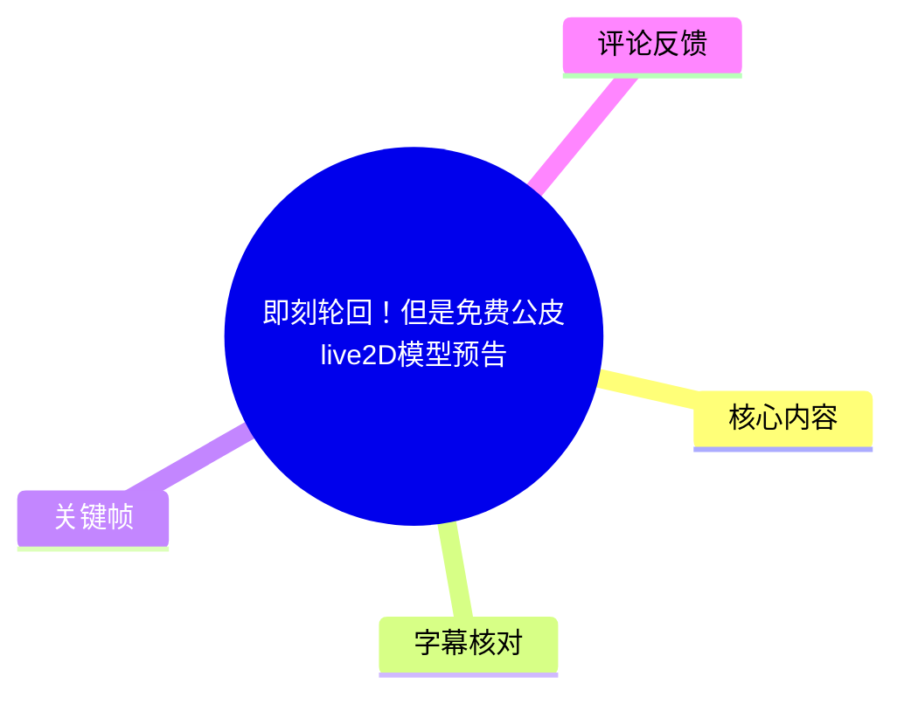
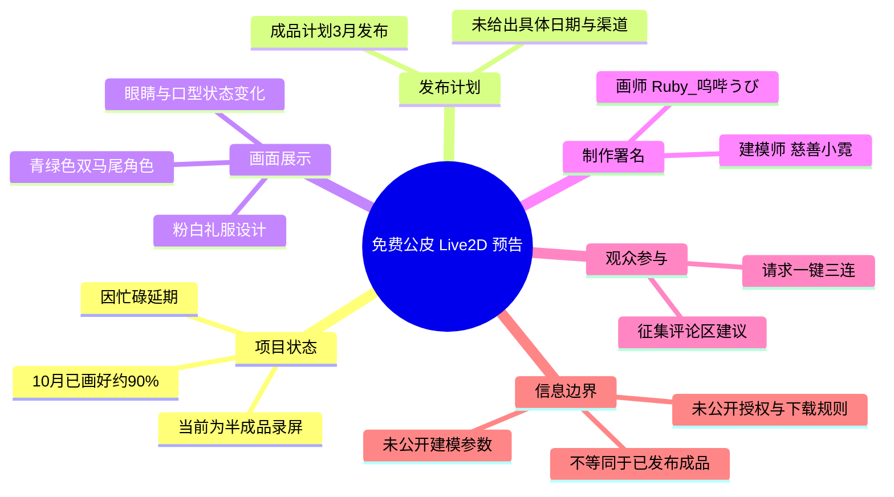
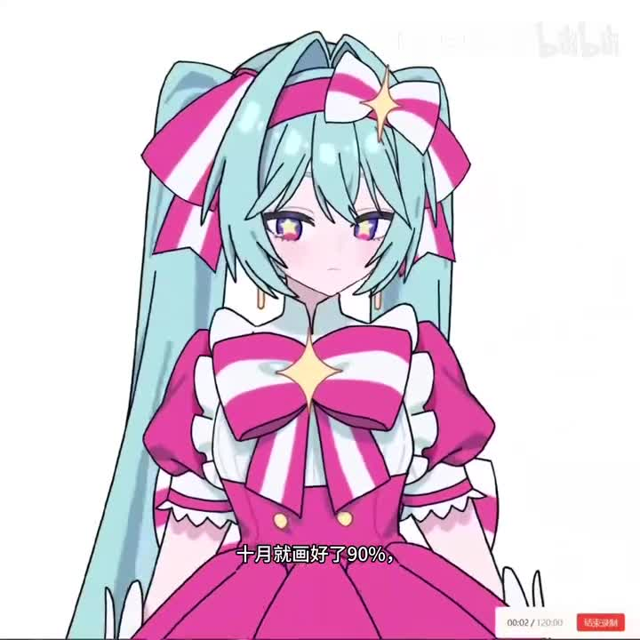
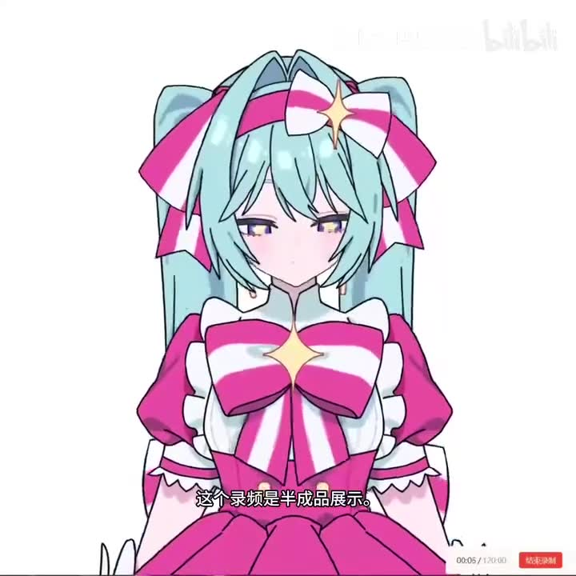
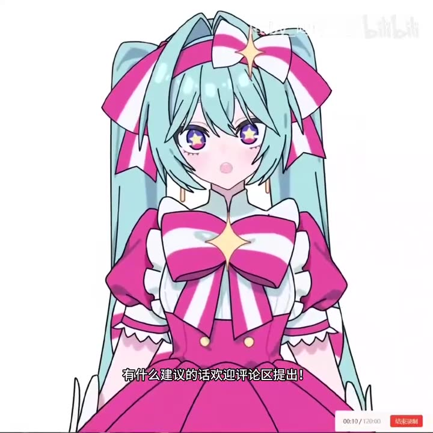

# 即刻轮回！但是免费公皮live2D模型预告

> 来源：[Bilibili 视频](https://www.bilibili.com/video/BV1J7fnBBE5f) 
> UP 主：Ruby_呜哔うび｜视频时长：54 秒｜画面规格：1280 × 1280 
> 简介署名：画师 @Ruby_呜哔うび；建模师 @慈善小霓

## 小结

这是一支约 54 秒的免费公皮 Live2D 模型预告。视频以角色正面录屏为主体，展示了一个青绿色双马尾、粉白礼服风格的二维角色在不同表情或口型状态下的画面效果；标题与标签将其关联至 Live2D、初音未来（`初音ミク` / `miku`）及《いますぐ輪廻》。

视频中最明确的进度信息来自 0:00—0:12.4 的口播：创作者称该项目在“10 月”已经画好约 **90%**，但因忙碌延后；当前录屏是**半成品展示**，成品计划于“3 月发布”。视频简介同样写明“成品3月发布”，但没有给出具体日期、年份、发布渠道、下载方式、授权条款或使用范围。

对于希望关注免费公皮模型进度的观众，本片能确认项目仍处于预告/半成品阶段，也能识别其基本视觉设计与动态展示方向；但它不是 Live2D 教程，没有公开参数、建模拆分、物理配置、表情热键、导入流程或授权协议。因此，不能据此推断模型已经可下载、可商用或可自由二创。

从画面看，角色在短时间内出现眼睛、嘴部与神态变化，能作为“已有动态录屏”的直观证据；但素材未提供逐帧动作说明，不能仅凭截图判断其所有可动部位、面捕兼容性或模型完成比例。视频时效性较强：其“3 月发布”承诺是发布时的计划，后续是否如期发布须以 UP 主后续公告为准。

## 思维导图

## 目录

- [项目背景与已确认信息](#项目背景与已确认信息)
- [半成品展示与画面观察](#半成品展示与画面观察)
- [发布计划、参与方式与制作署名](#发布计划参与方式与制作署名)
- [可执行的关注步骤](#可执行的关注步骤)
- [技术信息、限制与时效性](#技术信息限制与时效性)
- [关键帧索引](#关键帧索引)
- [字幕比对](#字幕比对)
- [评论分析](#评论分析)
- [处理记录](#处理记录)

## 项目背景与已确认信息 [00:00](https://www.bilibili.com/video/BV1J7fnBBE5f?t=0)

视频标题明确将内容定位为“免费公皮 live2D 模型预告”，标签包含“模型展示”“公皮”“Live2D”，并附有“初音ミク”“miku”“いますぐ輪廻”等关联标签。这里可以确认的是：作品以免费公皮模型预告的形式发布，并以 Live2D 模型展示为主题。

口播在唯一一段可识别语音中说明了制作进度与延迟原因：

> “10月就画好了90%，因为太忙了，一直咕咕到现在，成品3月发，这个录屏是半成品展示，如果喜欢请一键三连，有什么建议的话，欢迎评论区提出。”

其中“90%”是创作者对于绘制进度的自述，并不自动等同于整个 Live2D 项目完成度达到 90%。绘制、立绘拆分、绑定、物理参数、表情设置、测试与发布整理可能是不同阶段；本视频没有分别披露这些环节的完成比例。

视频简介提供了可交叉验证的制作署名：

- **画师**：@Ruby_呜哔うび
- **建模师**：@慈善小霓
- **发布计划**：成品 3 月发布
- **反馈渠道**：欢迎提出建议

> 图：关键帧显示角色的正面主视觉、青绿色双马尾与粉白色蝴蝶结礼服，同时保留了“10月就画好了90%”的画面字幕。它是确认项目视觉方向和创作者进度陈述的直接画面依据。

## 半成品展示与画面观察 [00:00](https://www.bilibili.com/video/BV1J7fnBBE5f?t=0)

本片是角色正面居中展示，背景以白色为主。角色具有以下可直接观察到的设计特征：

- 青绿色长双马尾；
- 头部佩戴粉白相间的大蝴蝶结，中央饰有星形装饰；
- 上身为粉、白、青色搭配的礼服式服装；
- 胸前有大蝴蝶结与星形装饰；
- 眼部呈紫色系，并在后续画面中可见星形高光效果；
- 画面中可观察到不同的眼神、张口与闭口状态。

> 图：此帧的底部字幕写有“这个录屏是半成品展示”。它将画面演示的性质限定为未完成版本，避免把展示效果误当作最终交付状态。

> 图：此帧呈现更明显的眼部效果与口型状态变化，且字幕为“有什么建议的话欢迎评论区提出！”。其价值在于同时说明视频既展示动态状态，也明确把观众反馈作为后续调整的输入。

### 关于 Live2D 技术信息的边界

标题和标签可证明该内容以 Live2D 模型为主题，画面也显示角色存在状态变化；但视频没有展示或说明以下技术细节：

| 项目 | 视频是否给出 | 可得结论 |
| --- | --- | --- |
| Cubism 编辑器版本 | 未给出 | 无法判断制作环境与版本兼容性 |
| 模型画布尺寸、纹理尺寸 | 未给出 | 无法估算资源规格 |
| 参数列表与参数范围 | 未给出 | 无法确认头部、身体、眼睛、嘴部等参数设计 |
| 物理演算配置 | 未给出 | 无法判断发丝、服装或饰品的物理效果 |
| 表情数量与快捷键 | 未给出 | 仅能观察到部分状态变化，不能统计总量 |
| 面捕软件兼容性 | 未给出 | 无法确认 VTube Studio 等工具的适配情况 |
| 模型文件格式 | 未给出 | 无法确认会提供 `.moc3`、贴图、配置或其他文件 |
| 下载地址与发布日期 | 未给出 | 仅知道计划于“3月”发布 |
| 版权、署名、商用与二创规则 | 未给出 | 不应默认任何使用权限 |

因此，画面可被理解为“模型动态呈现的预览”，而不是完整的技术规格演示或使用说明。

## 发布计划、参与方式与制作署名 [00:00](https://www.bilibili.com/video/BV1J7fnBBE5f?t=0)

创作者给出的项目时间信息有两层：

1. **过去进度**：在“10 月”绘制已达到约 90%；
2. **后续计划**：成品“3 月发”。

需要注意，素材没有说明“10 月”和“3 月”各自对应的年份，也没有给出具体日程。因此，最严谨的表述是：**视频发布时的计划为于某个“3 月”发布成品**。不能扩展为某年某月某日必定上线。

视频提出了两种观众参与方式：

1. 若喜欢展示效果，可“一键三连”；
2. 可在评论区提出具体建议。

这一征集方式说明创作者仍愿意接收反馈，但没有承诺所有建议都会被采纳，也没有给出需求收集截止日期、反馈格式或版本迭代安排。

制作归属方面，简介明确区分了画师和建模师。该信息有助于在后续发布、反馈与署名讨论中区分视觉原画与 Live2D 建模工作，但简介未进一步解释双方的分工范围、素材授权归属或发布管理责任。

> 图：此帧进一步保留了角色正面动态状态。由于视频没有参数面板或拆分图，它只能用于理解成品的视觉预期，不能据此反推具体绑定方式或性能参数。

## 可执行的关注步骤 [00:00](https://www.bilibili.com/video/BV1J7fnBBE5f?t=0)

视频本身没有提供下载或安装步骤；基于创作者明确给出的反馈和发布线索，观众可以采取以下不超出素材范围的行动：

1. **确认当前版本定位**  
   将视频视为半成品录屏，而非最终发布包或可直接使用的模型。

2. **记录已公开的创作信息**  
   关注 UP 主 Ruby_呜哔うび的后续动态；若需要了解建模相关后续信息，可留意简介署名的建模师慈善小霓。

3. **提出可验证、可执行的建议**  
   在评论区可围绕已展示内容提出意见，例如服装细节辨识度、表情观感、眼部高光、口型自然度等。视频只说“欢迎建议”，未指定需求模板。

4. **等待正式发布信息**  
   在出现正式动态前，不应假定模型已经开放下载，也不应转发未经证实的下载地址、授权规则或发布日期。

5. **正式发布后再核对关键条件**  
   若后续有成品发布，应优先核实下载来源、使用授权、署名要求、禁止行为、可否商用、模型文件与软件兼容性。这些是“免费”模型实际使用时不可省略的信息，但本视频尚未提供。

## 技术信息、限制与时效性 [00:00](https://www.bilibili.com/video/BV1J7fnBBE5f?t=0)

### 可确认事实

- 视频时长为 54 秒；ASR 实际音频时长诊断为约 53.36 秒。
- 视频题材是免费公皮 Live2D 模型预告。
- 创作者称录屏为半成品展示。
- 创作者称绘制曾在“10 月”完成约 90%。
- 创作者计划于“3 月”发布成品。
- 简介署名画师为 Ruby_呜哔うび、建模师为慈善小霓。
- 视频征集评论区建议。

### 不可由素材确认的内容

- 成品是否已经在计划时间内发布；
- 模型是否可商用、是否允许二改、是否允许再分发；
- “免费”的具体范围，是否需要署名或满足其他条件；
- 可用软件、设备、面捕协议和模型文件格式；
- 模型完整参数、物理效果、表情数量与性能负载；
- 角色是否为官方初音未来形象、衍生设计，或仅具有相关标签与视觉联想；
- 后续发布平台、下载地址及版本更新策略。

### 时效性提示

提供的元数据显示视频发布时间为 2026-02-22，但任务素材抓取时间为 2026-07-21。视频中“成品3月发”属于发布当时的未来计划，至抓取时点可能已发生变化。当前素材没有提供后续动态或正式发布页，故本文不对实际发布结果作判断。

此外，视频元数据的互动数据为抓取时快照：播放约 13.3 万、点赞约 3.23 万、收藏约 1.05 万、评论 739。此类数据会持续变化，不应视为固定指标。

## 关键帧索引

| 关键帧 | 画面内容 | 正文使用价值 |
| --- | --- | --- |
|  | 角色正面主视觉，字幕为“10月就画好了90%” | 对应创作者关于绘制进度的自述，并展示基础造型 |
|  | 角色正面展示，字幕为“这个录屏是半成品展示” | 明确区分预览录屏与最终成品 |
|  | 星形瞳孔高光、张口状态，字幕征集建议 | 观察局部表情状态变化及互动诉求 |
|  | 角色正面张口状态与服装全貌 | 用于说明展示仅能支持视觉观察，不能推导技术参数 |

## 字幕比对

| 字幕来源 | 完整性 | 专有名词 | 时间轴 | 主要问题 |
| --- | --- | --- | --- | --- |
| Bilibili 站内字幕 | 未提供可用字幕 | 无从核验 | 无从核验 | 本次素材中没有站内字幕文件，不能作为正文依据 |
| 本次 ASR 字幕 | 覆盖 0:00—0:12.4 的一段连续口播；其余约 41 秒无识别文本 | 未识别出 Live2D、角色名、作者名等专有名词 | 有真实时间轴：`00:00:00,000 --> 00:00:12,400` | 将口播合并为单段，未细分句子；“10月”“90%”“3月”等信息依赖语音识别，已与画面字幕及简介交叉核对 |

### 最终字幕选择与校正

本次没有可用站内字幕，因此正文以**本次 ASR 的唯一带时间戳分段**作为语音内容依据，章节时间轴均锚定至该段的起点 0:00。ASR 诊断显示：

- 识别语言：中文；
- 语言置信度：0.98095703125；
- 音频时长：53.3594375 秒；
- 识别语音时长：12.4 秒；
- 语音覆盖率：23.24%；
- 未标记 `noAudioStream=true`，即源视频存在音轨，本次 ASR 并非因无音轨而失效。

经关键帧与简介交叉校正后，保留以下表述：

- “10月就画好了90%”：画面关键帧也能看到对应字幕；
- “这个录屏是半成品展示”：画面关键帧存在对应字幕；
- “有什么建议的话欢迎评论区提出”：画面关键帧存在对应字幕；
- “成品3月发”：ASR 语音与视频简介“成品3月发布”一致。

“公皮”“Live2D”“初音ミク”“いますぐ輪廻”等词来自标题、标签或元数据，而不是 ASR 口播；正文已将其与口播信息明确区分。

## 评论分析

以下仅处理可获取的热评前三条，评论属于用户表达或补充线索，不等同于已验证的项目事实。

1. **啥子不算傻｜1552 赞｜“可爱！”**  
   - 观点：对角色外观作出正面情感评价。  
   - 补充信息：无。  
   - 可信度与边界：这是纯主观审美反馈，说明角色设计获得较高共鸣，但不能证明模型质量、完成度或发布安排。

2. **慈善小霓｜902 赞｜“建模报道！请大家期待喵”**  
   - 观点：评论者表示自己是建模相关参与者，并邀请观众期待。  
   - 补充信息：该用户名与视频简介中的“建模师：@慈善小霓”一致。  
   - 可信度与边界：用户名与简介署名能够相互印证其身份关联，但评论没有补充发布日期、制作参数或使用规则，不能将其解读为成品已发布的声明。

3. **FnKta｜522 赞｜“老师的展示片段在X（推特）上被channel老师转帖了”**  
   - 观点：称展示片段曾被 X（原 Twitter）上的某位“channel老师”转帖。  
   - 补充信息：可能反映作品获得站外传播。  
   - 可信度与边界：本任务未提供对应 X 链接、转帖账号或截图，无法独立核验；因此只能记录为评论者的说法，不能作为已证实的传播事实。

## 处理记录

- Worker ID：`worker-mrj0wbly-5dc4e50c`
- 整理模型：`gpt-5.6-terra`
- ASR 模型：`medium`，运行设备 `cuda`，计算类型 `float16`，自动语言识别为中文。
- 使用的素材工具产物：视频元数据、音频文件、ASR 结果与 SRT 时间轴、关键帧目录、热评抓取结果、视频简介与标签。
- 字幕选择：未提供可用 Bilibili 站内字幕；已检查本次 ASR，采用其 `00:00:00,000 --> 00:00:12,400` 的真实时间轴，并以关键帧画面字幕和简介对进度、半成品、3 月发布及征集建议等内容进行交叉核对。
- 关键帧选择依据：选择 `frame-001` 至 `frame-004`，因为它们分别直观呈现“90%进度”“半成品展示”“评论区征集建议”及角色张口/眼部状态变化；未将视觉帧外推为未展示的参数或功能。
- 缓存清理：素材未提供缓存清理执行日志，无法确认是否已清理；本文不虚构清理结果。
- 未解决问题：未获得正式发布页、下载链接、授权协议、模型技术参数、具体发布日期、后续版本信息与站外转帖链接；以上内容均待创作者后续公开信息确认。
