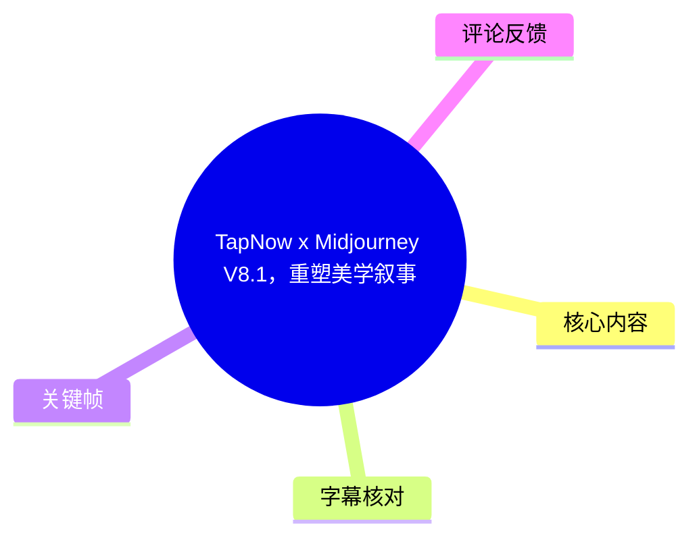
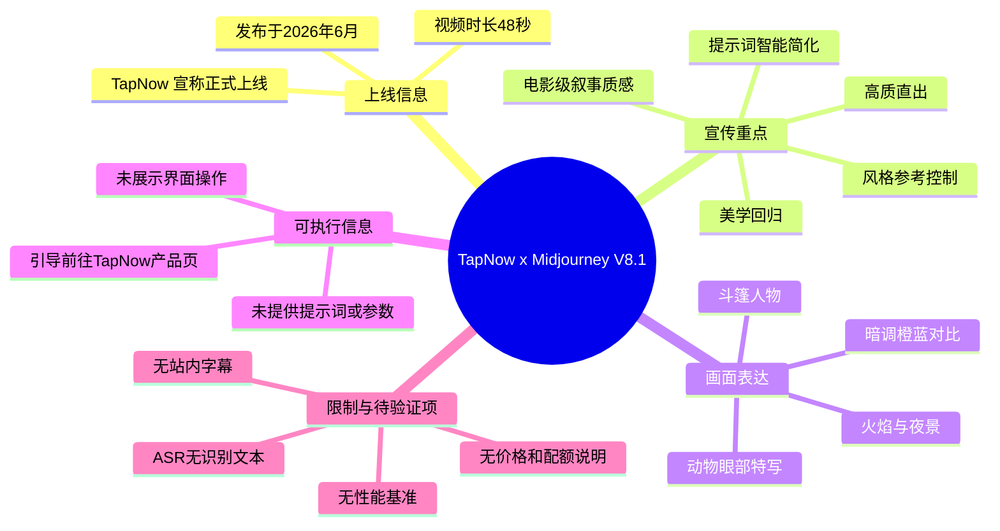
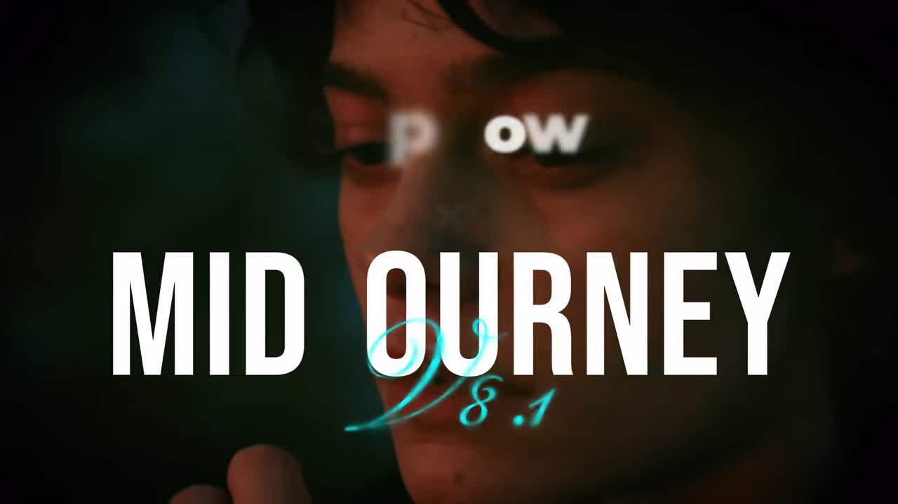
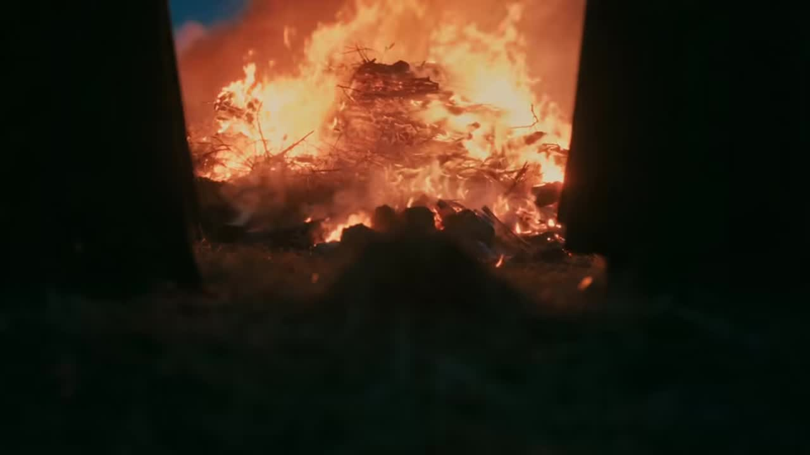
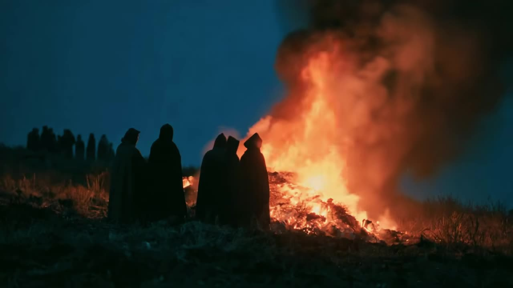
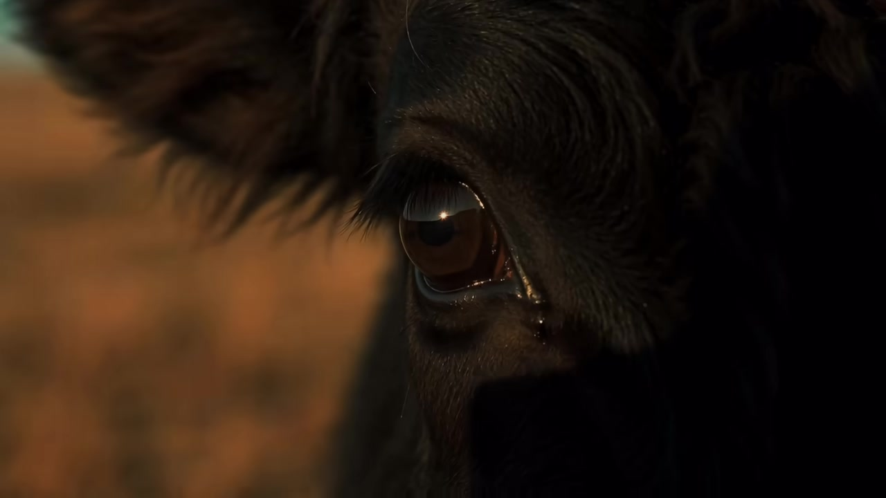

# TapNow x Midjourney V8.1，重塑美学叙事

> 来源：[Bilibili 视频](https://www.bilibili.com/video/BV1nwEw6sEve) 
> UP 主：TapNow｜时长：48 秒｜画面规格：3840 × 2160｜合集：AIcode  
> 本文将视频标题、简介、元数据、可获取关键帧与热评区分记录；没有将宣传文案或评论观点当作已独立验证的技术事实。

## 小结

这是一支 TapNow 发布的短宣传片，宣布其产品“正式上线 Midjourney V8.1 模型”。视频的表达重点不是界面教学或模型测评，而是以暗调、火焰、斗篷人物与动物眼部特写等连续电影感画面，传达“重塑美学叙事”“技术更新的终点，是美学的回归”的品牌主张。

根据视频简介，TapNow 将此次模型体验概括为四项：**画面更自然、带电影级叙事质感**；**原生高清大图与秒级响应**；**通过风格参考进行高效控制和灵感延续**；以及**提示词智能简化、对长指令的精准理解**。这些均为发布方的功能/性能宣称，素材中没有给出可复现提示词、生成耗时统计、分辨率数值、价格、配额或对照样张，因此不能据此确认实际效果与适用边界。

从画面证据看，短片确实围绕统一的低照度、橙蓝对比、火焰环境和戏剧化构图推进，能说明其希望展示的审美方向是“电影式氛围叙事”；但不能仅凭成片证明所有画面均由 Midjourney V8.1 单独生成，也无法确认是否经过后期、剪辑、调色或其他工具处理。

适合希望了解 TapNow 所宣传的 Midjourney V8.1 接入方向、关注 AI 图像生成审美控制与风格参考能力的创作者阅读。若目标是实际选型、评测模型一致性或复现视频效果，还需要前往 TapNow 产品页面核对当前可用性、功能入口、计费、区域限制及官方文档。

本视频发布于 2026 年 6 月，属于工具上线宣传信息，时效性较强。模型名称、接入状态、响应速度、图像规格、功能范围和商业政策均可能在发布后调整；视频本身没有提供版本变更日志或量化基准。

## 思维导图

## 目录

- [视频定位与时效边界](#视频定位与时效边界)
- [核心信息：TapNow 宣传的四项体验](#核心信息tapnow-宣传的四项体验)
- [视觉叙事：火焰、人物与凝视](#视觉叙事火焰人物与凝视)
- [可执行步骤与参数缺口](#可执行步骤与参数缺口)
- [结论与限制](#结论与限制)
- [字幕比对](#字幕比对)
- [评论分析](#评论分析)
- [处理记录](#处理记录)

## [视频定位与时效边界](https://www.bilibili.com/video/BV1nwEw6sEve?t=0)

视频标题为“TapNow x Midjourney V8.1，重塑美学叙事”，UP 主为 TapNow。简介明确称“TapNow 正式上线 Midjourney V8.1 模型”，并将此次更新定位为减少复杂参数堆砌、转而“打磨质感”的创作体验。

由于站内未提供可用字幕、此次 ASR 也没有产生任何带时间戳的语音片段，素材中不存在可用于划分后续段落的真实字幕起止时间。因此，本文仅将视频起点 `00:00` 作为全片入口链接；**不按画面出现顺序臆测各镜头的精确秒数**。下文的“画面证据”按可获取关键帧说明，而非声称对应某个未经证实的镜头时间。

该视频分辨率为 3840 × 2160，时长 48 秒。高分辨率成片是视频文件规格，不能等同于简介所称的“原生高清大图”输出规格；后者没有给出具体像素尺寸或导出格式。

> 图：画面叠加了 “MIDJOURNEY V8.1” 标识，背景为人物面部的低照度特写。这是识别视频主题与版本名的直接画面依据，也建立了全片偏电影预告片式的视觉基调。

## [核心信息：TapNow 宣传的四项体验](https://www.bilibili.com/video/BV1nwEw6sEve?t=0)

以下信息来自视频简介，是发布方对其接入 Midjourney V8.1 后体验的陈述：

| 宣传维度 | 发布方表述 | 对创作流程的含义 | 素材未提供的验证信息 |
| --- | --- | --- | --- |
| 美学回归 | “画面更自然，自带电影级叙事质感” | 强调画面氛围、自然度与叙事感，而非仅强调参数复杂度。 | 无前后版本对比、无同提示词样张、无“自然”或“电影级”的评价标准。 |
| 高质直出 | “原生高清大图，秒级响应极高效率” | 宣传直接获得高质量大图与较快生成反馈，理论上可缩短反复试错时间。 | 无具体分辨率、生成队列条件、单张/批量耗时、网络条件、失败率或付费档位。 |
| 风格精准 | “风格参考高效控制，灵感完美延续” | 暗示产品支持以风格参考延续已有视觉方向，适用于系列图或统一项目调性。 | 无上传入口、参考图数量、权重、兼容格式、版权规则和控制效果示例。 |
| 智能优化 | “提示词智能简化，长指令精准理解” | 暗示系统会降低提示词组织门槛，或帮助处理较长的描述。 | 未解释是自动改写、压缩、翻译还是模型原生理解；无输入长度上限与改写前后案例。 |

需要特别区分：视频确实发布了上述功能宣称，但没有提供技术架构、模型版本号细节、API 参数、推理硬件或基准测试。因此，“秒级响应”“精准理解”“完美延续”应被视为营销表述，而不是已由本素材完成验证的客观性能结论。

## [视觉叙事：火焰、人物与凝视](https://www.bilibili.com/video/BV1nwEw6sEve?t=0)

可获取关键帧呈现出较一致的视觉语言：暗部占比高，以橙色火焰作为主光源，与冷蓝色夜景或暗绿色阴影形成对照；人物多以剪影、侧影或被遮蔽的局部出现。这种处理使主题从“模型功能说明”转化为一种带神秘感、危险感和仪式感的氛围展示。

> 图：画面从狭窄、近似门洞或遮挡物形成的取景框中观看燃烧物。它体现了短片以“框中框”、局部遮挡和强烈明暗对比制造叙事悬念的方式，有助于理解“电影级叙事质感”在本片中的视觉化表达。

> 图：多名斗篷人物以剪影形式站在火场前，背景为夜色与浓烟。这张画面展示了群像、环境光和色彩对比如何共同构成史诗/奇幻感；它是对宣传美学方向的案例，不是模型稳定性或人物一致性的量化证明。

> 图：动物眼部的极近特写保留了毛发、泪水反光与瞳孔高光等细节。该画面适合用来观察短片所追求的材质与情绪表达，但单一经过剪辑的画面不足以证明模型在所有动物、光照或构图条件下均能稳定达到同等质量。

从这些画面可提炼的创作经验是：若希望构建连续的“电影感”，可围绕同一组**光线逻辑**（如火光主导）、**色彩关系**（暖橙对冷蓝）、**镜头距离**（环境全景与细节特写交替）和**主体符号**（斗篷、火焰、凝视）组织素材。这里是根据画面做出的视觉分析，不代表视频展示了明确的生成工作流。

## [可执行步骤与参数缺口](https://www.bilibili.com/video/BV1nwEw6sEve?t=0)

视频简介给出的唯一明确行动指引，是前往 TapNow 产品页面体验 Midjourney V8.1：

1. 打开 TapNow：<https://app.tapnow.ai/home>。
2. 在当前产品界面中确认是否可见 Midjourney V8.1 的模型入口。
3. 若需要延续既有审美，优先检查是否提供简介所称的“风格参考”能力。
4. 使用同一创作意图分别测试简短提示词与长提示词，观察平台是否存在其宣称的提示词简化或长指令理解辅助。
5. 对实际生成结果记录模型名称、生成日期、提示词、参考图、分辨率、耗时、消耗额度与后处理步骤，再决定是否适合正式项目。

不过，上述第 2—5 步是为验证宣传主张而提出的审查流程，并非视频演示的操作步骤。视频中**未展示**以下关键内容：

- 未展示 TapNow 的登录、模型选择、输入框、风格参考上传或生成结果页面；
- 未给出可复制的提示词、负面提示词、风格代码、种子值、宽高比或批次数；
- 未公布“原生高清大图”的具体分辨率；
- 未给出“秒级响应”的测量条件与结果；
- 未说明免费额度、订阅费用、地区可用性、排队规则或商用授权；
- 未展示 Midjourney 官方服务与 TapNow 接入之间的具体关系、权限范围及功能差异。

因此，不能从本视频复现同类画面，也不能据此推断用户一定可以在所有账户、地区或套餐中使用该模型。实际操作应以打开产品页时的界面与最新条款为准。

## [结论与限制](https://www.bilibili.com/video/BV1nwEw6sEve?t=0)

这支 48 秒短片的核心价值在于传递产品定位：TapNow 希望将 Midjourney V8.1 的体验叙述为从“复杂参数”回到“美学质感、风格控制与高效率”的创作路径。视觉上，它通过火焰、暗调人物与动物细节，较集中地呈现了神秘、史诗、电影化的单一审美样本。

但它不是教程、评测或技术白皮书。视频未展示 UI、提示词、参数、工作流、性能基准和授权政策，无法支持“某项能力如何配置”“生成到底多快”“是否优于其他版本”之类的确定性结论。对有生产需求的用户，最值得验证的是：风格参考的控制粒度、长提示词实际处理方式、输出分辨率、额度消耗、生成延迟和商用条款。

时效方面，视频元数据显示其发布于 2026 年 6 月，抓取元数据时间为 2026 年 7 月 15 日。模型接入、服务入口和政策可能已经变动，本文不将发布时的宣传描述视作长期不变的产品承诺。

## 字幕比对

| 字幕来源 | 完整性 | 专有名词 | 时间轴 | 主要问题 |
| --- | --- | --- | --- | --- |
| Bilibili 站内字幕 | 未提供可用字幕。 | 无法核验。 | 无。 | 没有可用于转写、分段或校正术语的站内字幕文件。 |
| 本次 ASR 字幕 | 空。ASR 共识别到 0 个语音片段，语音覆盖时长为 0 秒。 | 无可供校正的识别结果。 | ASR 文件具备时间戳能力，但实际无分段。 | 自动语言检测为英语，置信度 0.541；诊断提示未识别到语音，建议核查可听语音或音轨。 |

本次 ASR 已实际检查：使用 `medium` 模型、自动语言识别、CUDA 与 `float16` 配置处理 48 秒音频 WAV，但输出为空。诊断中**没有** `noAudioStream=true` 标记，因此不能断言源视频没有音轨；只能如实记录为“本次识别没有检测到可转写的语音片段”。这可能意味着视频主要由音乐、音效、低可懂度人声或其他不利于识别的音频构成，也可能需要在有可用音轨时进一步复核。

最终没有采用任何字幕文本。本文对“Midjourney V8.1”“TapNow”等专有名称主要依据标题、视频简介和关键帧中的 `MIDJOURNEY V8.1` 文字；对画面内容依据关键帧进行多模态视觉描述。由于缺少有效字幕时间段，除 `00:00` 全片入口外，不虚构细分时间轴。

## 评论分析

仅处理本次可获取的热评前三条。评论属于用户意见或提问，并非官方说明或已验证事实。

1. **bili_132984（86 赞）**：“midjourney是不是快凉了，感觉现在没啥人用了，讨论的也少”。  
   - 观点：对 Midjourney 的社区热度与市场活跃度提出疑问。  
   - 补充价值：提示潜在用户除关注模型能力外，也会关注生态讨论度与工具可持续性。  
   - 可信度与边界：这是基于个人体感的判断，评论未提供活跃用户、营收、调用量或社区数据，不能据此得出 Midjourney “快凉了”的结论。

2. **殷墨淼淼淼（22 赞）**：“没看懂，但是貌似有韩国日本欧洲没中国的😡”。  
   - 观点：评论者对视频画面中所呈现的地域/文化元素感到困惑，并表达对“中国元素缺席”的不满。  
   - 补充价值：反映出受众会从视觉样张中关注文化表征与地域代表性。  
   - 可信度与边界：本素材未提供画面设定、国家清单或地域覆盖说明，不能确认视频是否有意展示韩国、日本、欧洲，也不能据此推断 TapNow 或 Midjourney 的地区服务政策。

3. **山人一主6（4 赞）**：“tap可以接入mj的灵感库嘛。那个才是mj的灵魂”。  
   - 观点：希望 TapNow 接入 Midjourney 的“灵感库”，并认为该功能具有重要价值。  
   - 补充价值：指出用户期待的不仅是模型调用，也包括灵感检索、参考与社区资产等配套体验。  
   - 可信度与边界：这是功能诉求而非功能已上线的证明。视频简介只提到“风格参考”，未提及“灵感库”，二者不能直接视为同一能力。

## 处理记录

- Worker ID：`worker-mrj0www4-e8d79408`
- 模型：`gpt-5.6-terra`
- 调用工具与素材：视频元数据、视频简介、关键帧、站内字幕检查结果、ASR 诊断与输出、热评数据。
- ASR 工具配置：`medium` 模型；请求语言为 `auto`；检测语言为英语（置信度 `0.541015625`）；设备为 `cuda`；计算类型为 `float16`；音频时长 48 秒。
- 字幕选择：站内字幕未提供可用文件；本次 ASR 输出为空、无可用分段；最终不采用字幕文本，以标题、简介和关键帧作为事实来源，并明确保留时间轴缺口。
- 关键帧选择依据：`frame-001.jpg` 用于确认片中 “MIDJOURNEY V8.1” 标识；`frame-002.jpg` 展示火焰与遮挡式构图；`frame-003.jpg` 展示斗篷群像、火场与橙蓝色彩关系；`frame-004.jpg` 展示动物眼部的局部材质与情绪细节。所选帧均直接服务于视频的“电影化美学叙事”主题。
- 时间轴依据：没有可用站内 SRT 段或 ASR 语音段，无法取得真实的章节起止时间；所有章节链接统一指向经视频边界确定的 `00:00`，未按文字或画面顺序猜测具体秒数。
- 热评范围：仅分析成功获取的热评前三条，共 3 条。
- 缓存清理：素材清单未提供缓存清理执行结果；不编造已清理状态。
- 未解决问题：无法从现有素材确认音轨中是否含可懂语音；无法验证 Midjourney V8.1 的实际接入状态、生成速度、输出尺寸、风格参考机制、提示词优化逻辑、计费方式及商用授权。
