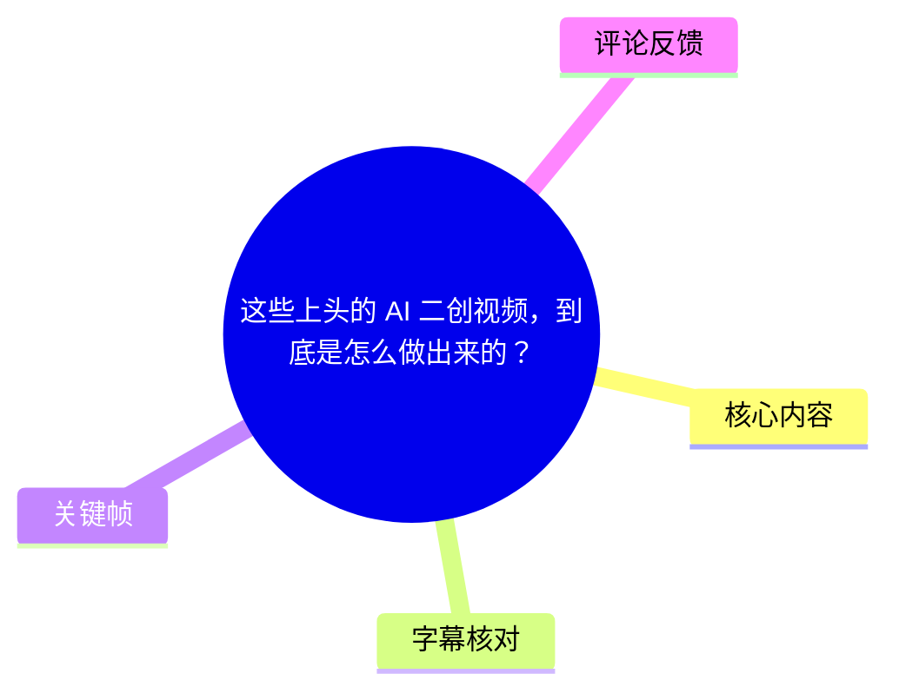
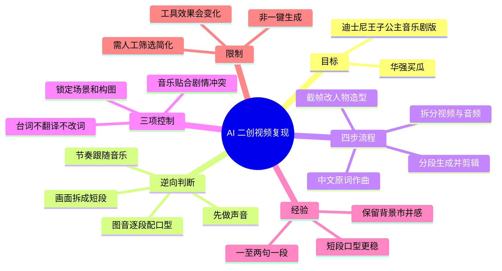
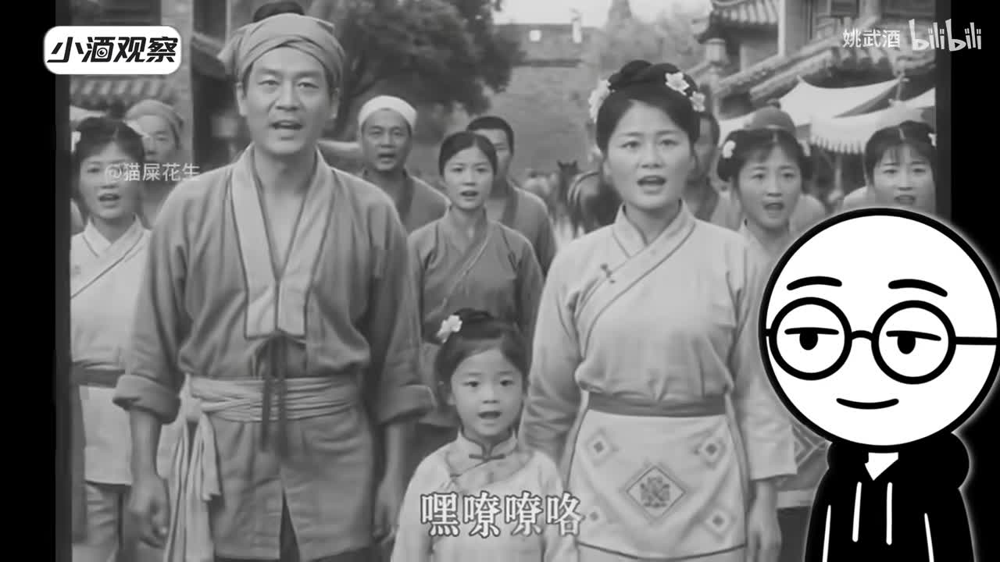
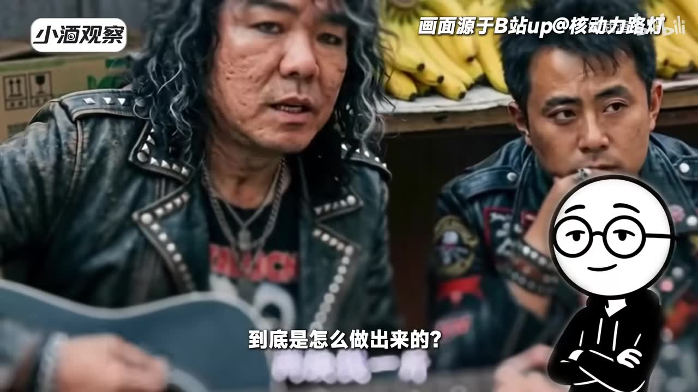
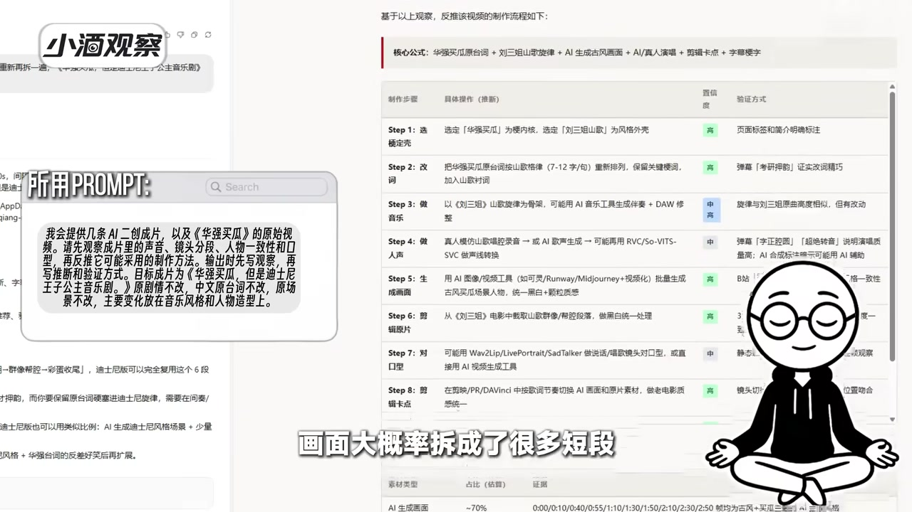

# 这些上头的 AI 二创视频，到底是怎么做出来的？

> 来源：[Bilibili 视频](https://www.bilibili.com/video/BV1kuKE66Eds)<br>
> UP 主：姚武酒｜发布时间：2026-07-17｜时长：03:17｜分辨率：2560×1440  
> 标签：人工智能、AI、编程、教程、TRAE、TRAE Work、内容创作、华强买瓜

## 小结

这是一支以“华强买瓜”二创为案例的 AI 视频制作复盘。作者先让 **TRAE Work** 对既有爆款 AI 二创成片进行逆向推演，再将其中可实际执行的部分简化为一套四步工作流，目标是把原片改造成“迪士尼王子公主音乐剧版”。

视频最核心的判断是：此类成片的节奏由音乐主导，因此应当**先完成音频，再处理画面与口型**；画面不是一次生成整条视频，而是依据原片剪辑点拆成很多短段，每段以一张稳定的关键画面为基础，匹配对应的短音频生成口型和表演。

作者强调三项控制原则：**中文原台词不改、不翻译；构图与场景不动；人物造型统一替换**。其中，中文歌词应提示模型“旋律贴合声调”，避免中文被唱得变调、产生明显违和；镜头则应锁定人物位置、镜头焦距/角度和瓜摊背景，仅改变服装、发型、妆造和表演状态。

可复用的实操框架是：拆分原视频与原音频 → 按角色和原顺序整理台词并生成歌曲 → 依原片镜头切分音频 → 截取关键帧并改造人物 → 图音逐段生成口型与表演 → 回到时间线拼接、补字幕。作者认为，“结果倒推 + 分段可控”比试图一键生成完整二创视频更可操作。

这支视频是创作者个人的一次工作流验证，而非对所有 AI 视频工具稳定性、成本、版权边界或成功率的量化测试。TRAE Work 在视频中承担的是“分析、推演和辅助拆解”角色，最终的落地方案仍经过作者筛选与简化。工具能力、模型表现及平台功能均可能随时间变化。

## 思维导图





## 目录

- [案例目标与逆向拆解](#案例目标与逆向拆解)
- [从成片反推的制作判断](#从成片反推的制作判断)
- [四步工作流：声音、画面、口型与剪辑](#四步工作流声音画面口型与剪辑)
- [三项关键控制原则](#三项关键控制原则)
- [成片试听与作者复盘](#成片试听与作者复盘)
- [可复用经验、限制与时效性](#可复用经验限制与时效性)
- [字幕比对](#字幕比对)
- [评论分析](#评论分析)
- [处理记录](#处理记录)

## 案例目标与逆向拆解 [00:00:00](https://www.bilibili.com/video/BV1kuKE66Eds?t=0)

作者以短视频平台常见的 AI 二创为切入点：同一个“老梗”替换画风和世界观后，能够形成新的观看趣味。他提出的问题并不只是“这种视频好不好看”，而是其背后的声音、画面、口型和剪辑流程，能否被当前 AI 工具拆解并复现。

在 [00:00:16](https://www.bilibili.com/video/BV1kuKE66Eds?t=16) 至 [00:00:40](https://www.bilibili.com/video/BV1kuKE66Eds?t=40)，作者说明自己把若干成片交给 **TRAE Work** 进行逆向分析，并明确本次成片目标：

- 保留“华强买瓜”这一原始情境与台词线索；
- 将人物整体改造成迪士尼式王子、公主风格；
- 让结果呈现“音乐剧对唱”的戏剧性；
- 探索从结果反推到制作步骤的可行性。



> 图：该帧展示了作者在开场引用的二创样例之一：黑白年代风格的人物画面与解说角色同屏。它说明视频讨论的对象是“保留既有内容骨架、替换视听风格”的 AI 二创，而不是从零构思原创剧情。



> 图：该帧展示另一则示例，原有生活化场景被替换为摇滚化人物造型。它有助于理解作者后续“固定构图和场景，只换人物造型”的方法论。

## 从成片反推的制作判断 [00:00:40](https://www.bilibili.com/video/BV1kuKE66Eds?t=40)

TRAE Work 看过参考成片后，作者从其较长分析中压缩出以下判断。这些判断是后续工作流的依据，而不是视频给出的通用技术定律。

### 1. 成片节奏明显跟着音乐走

作者观察到，示例视频中的段落推进与镜头节奏围绕音乐展开。因此流程顺序应调整为：

1. 先处理台词和歌曲；
2. 再以已确定的音频长度、情绪和节拍安排画面；
3. 最后让人物口型对应各自音频片段。

这意味着音频不是后期附属素材，而是剪辑与表演生成的时间基准。

### 2. 画面很可能由多个短段构成

作者的反推是：人物和镜头在相邻片段之间相对稳定，说明成片大概率不是让模型长时间连续生成，而是拆成了许多短镜头。每一段先有一个稳定的关键画面，再以该图为视觉基础生成动态内容。

短段化的直接作用包括：

- 减少长时生成时人物、背景或镜头持续漂移的风险；
- 缩小每次修改的影响范围；
- 便于单独重做口型、表演或某个有问题的镜头；
- 让最终视频能准确回贴原片的剪辑结构。

### 3. 口型能跟上歌曲，说明音频已经预先切段

作者据口型同步效果推断，音频不是整段一次性驱动，而是先按照原片镜头或台词单位切开，再将每个音频短段分别交给口型/表演生成环节。这个判断最终成为工作流中“**一句或两句一段**”的具体操作要求。



> 图：画面中展示了 TRAE Work 的分析结果与步骤表，视频字幕强调“画面大概率拆成了很多短段”。该帧直观对应本节的逆向拆解：先从成片的节奏、镜头稳定性和口型同步现象推断生产方式。

## 四步工作流：声音、画面、口型与剪辑 [00:01:05](https://www.bilibili.com/video/BV1kuKE66Eds?t=65)

作者在 [01:05](https://www.bilibili.com/video/BV1kuKE66Eds?t=65) 至 [02:14](https://www.bilibili.com/video/BV1kuKE66Eds?t=134) 明确给出压缩后的四步流程。它的核心不是指定某一款图像、音乐或口型工具，而是规定各类工具之间的素材依赖关系和执行顺序。

### 第一步：拆出原始声音，整理台词与角色

先将原视频与原音频拆开，按原始剧情顺序整理台词，并标记每句台词对应的角色。视频明确说明：

- **不翻译台词；**
- **不改写中文原词；**
- 直接以中文原台词作为作曲和分角色演唱的输入。

这样做的目的，是最大程度保留原梗的语言节奏、语义辨识度与剧情结构。若把台词翻译为外语或大改措辞，即使视觉风格接近“迪士尼”，也可能失去“华强买瓜”作为中文网络梗的识别基础。

### 第二步：将中文原词生成王子公主音乐剧歌曲

作者要求歌曲具有迪士尼王子、公主对唱的音乐剧感，同时音乐冲突应顺着原剧情逐步上升。视频元数据中的经验补充指出，提示中应加入类似“**旋律贴合声调**”的约束，以降低中文歌词因旋律处理而变调、听感违和的问题。

视频实际表达的目标可以整理为：

| 要素 | 保留或改变方式 |
| --- | --- |
| 台词文本 | 保留中文原词，顺序不变 |
| 演唱角色 | 按人物分别演唱/对唱 |
| 音乐风格 | 王子、公主式童话音乐剧 |
| 戏剧推进 | 配合原剧情的冲突升级 |
| 中文声调 | 通过提示约束旋律贴合声调 |

这里的“模型只负责作曲和分角色演唱”是作者提出的职责划分：内容文本和叙事顺序由原片提供，模型负责在指定风格内音乐化呈现，而不是让模型重写故事。

### 第三步：按原片镜头切音频，并以关键帧改造人物

歌曲完成后，不能直接以一整段音频生成视频。作者的做法是依照原片镜头切分音频，建议按“一句或者两句一段”处理。视频给出的理由是：

- 片段更短，口型相对更稳定；
- 出问题时只需返工一个小段；
- 每段可以更精确对应一张关键画面和一个镜头；
- 方便最终按原片节奏拼接。

画面制作则从原片中截取关键画面开始。应保留的视觉要素包括：

- 人物站位；
- 瓜摊及周围环境；
- 镜头角度与构图；
- 原片场景的整体识别度。

需要变化的主要是人物的服装、发型、妆造和表演状态，使人物统一靠近童话王子、公主与音乐剧的审美方向。

### 第四步：图音逐段驱动口型，回时间线拼接

当关键帧稳定后，把“每张图”与“该图对应的短音频”配对，逐段生成口型与表演。最后将全部生成片段放回时间线，按原片结构拼接并补上字幕。

可将视频中呈现的操作链概括为：

```text
原视频
  ├─ 拆出原音频 → 按角色、顺序整理中文台词
  │                  ↓
  │             生成音乐剧歌曲
  │                  ↓
  │             按原片镜头切为短音频
  │
  └─ 截取每个镜头的关键画面
                     ↓
           保留构图与背景，替换人物造型
                     ↓
           关键帧 + 对应短音频
                     ↓
          分段生成口型、表演与动态画面
                     ↓
             时间线拼接 + 补字幕
```


> 图：该帧以靶心和飞镖的视觉隐喻表现“先确定目标、再定点落地”。它对应本视频的方法：不是盲目尝试生成，而是先逆向确定成片结构，再为每个小段指定明确的声音和画面目标。

## 三项关键控制原则 [00:01:29](https://www.bilibili.com/video/BV1kuKE66Eds?t=89)

作者在 [01:29](https://www.bilibili.com/video/BV1kuKE66Eds?t=89) 集中重申了三项最重要的约束，它们共同决定成片是否既有“新风格”，又仍然可被辨认为原梗。

### 中文台词一字不改

作者将文本控制权放在原片上：不翻译、不改词，按原角色和原顺序演唱。这一选择服务于两个目标：

1. 保持原剧情及其语言笑点；
2. 避免改词后与原片镜头、口型和叙事关系脱节。

需要注意的是，视频没有提供具体的作曲提示词全文、所用音乐生成模型、音色配置或生成次数，因此这些实现参数不能从本素材中进一步确定。

### 音乐必须有对唱冲突，并跟随原剧情上升

作者不是只要求“童话风配乐”，而是要求歌曲承接原剧情的冲突走势，形成王子、公主对唱的戏剧感。这说明音乐风格提示需要同时涵盖：

- 人物关系：男女/多角色的对唱感；
- 表演调性：音乐剧式、戏剧化；
- 叙事曲线：冲突感随原剧情推进；
- 语言适配：中文歌词与声调的可懂度。

### 锁住场景和构图，只改变人物

作者的判断是：如果连场景与构图都大幅改变，结果就“不像华强买瓜”。因此，视觉改造的边界应是“人物优先”，而非整张画面完全重绘。

视频简介还补充了更细的画面经验：应锁定镜头焦距和背景构图；必要时可单独调整瓜摊的饱和度，以保留市井感。后续若要优化人物与环境的光影统一性，可以尝试“全景空镜 + 局部重绘”的方案。该建议在视频中被列为后续优化方向，不代表已经在本案例中完整验证。

## 成片试听与作者复盘 [00:02:31](https://www.bilibili.com/video/BV1kuKE66Eds?t=151)

[02:31](https://www.bilibili.com/video/BV1kuKE66Eds?t=151) 至 [02:44](https://www.bilibili.com/video/BV1kuKE66Eds?t=164) 播放了最终成片中的一段唱词试听。ASR 识别到的台词为：

> “我操你这瓜皮子是金字做的还是瓜粒子是筋子做的？你瞧瞧现在哪有瓜呀，这都是大鹏的瓜。”

该段用于展示前述“中文原词 + 音乐剧化演唱 + 分段口型”的结果。由于本次 ASR 在该处仅提供语音转写，且没有逐词时间戳或关于具体生成模型的说明，不能据此断言每个字的口型精度、音高处理机制或模型名称。

在 [02:46](https://www.bilibili.com/video/BV1kuKE66Eds?t=166) 至结尾，作者给出的复盘是：

- 成片效果在作者主观评价中“非常好”；
- 最有价值的环节是 TRAE Work 先把成片倒着拆了一遍；
- TRAE Work 给出的是“推演”，不是直接可用的最终方案；
- 作者从推演中筛选出能落地的部分，并按实际情况简化；
- 经简化后，这套 workflow 才真正跑通；
- 作者认为，爆款 AI 视频的制作流程已可以被 AI 辅助拆解、推理。

这一结论应限定在作者的单案例实践中理解：它证明“将 AI 推演结果转化为人工可执行的分段流程”在该案例中有效，并不等同于任何爆款视频均可被无损逆向复刻。

## 可复用经验、限制与时效性 [00:02:46](https://www.bilibili.com/video/BV1kuKE66Eds?t=166)

### 可复用经验

1. **从结果倒推，不从空白提示词开始。**  
   先识别成片中的节奏依据、剪辑粒度、镜头稳定要素和口型对齐关系，再决定生成顺序。

2. **声音先行，画面围绕音频切分。**  
   对含演唱和口型的二创，先锁定可用音频更容易确定镜头时长和情绪。

3. **把长视频任务拆成可独立返工的短段。**  
   以一句或两句台词为单位切分，可降低口型与转场失稳时的重做成本。

4. **把“固定不变”和“允许变化”的元素写清楚。**  
   本案例固定的是场景、构图、人物位置和镜头关系；变化的是人物造型与表演风格。

5. **对中文演唱增加声调适配要求。**  
   视频元数据特别指出“旋律贴合声调”，这是避免中文歌词可懂度下降的重要约束。

### 技术与实践限制

- 视频没有公开具体使用的图像生成、视频生成、口型驱动、音乐生成或剪辑软件版本，因此不能将本流程视作某个固定软件的逐按钮教程。
- “短段更稳”是作者的实践经验，未给出不同片段长度的成功率、失败率或成本对比。
- 将原台词直接用于二创，仍可能涉及原视频、角色形象、音乐风格模仿及平台发布规则等版权与合规问题；视频未展开讨论，实际发布前需要自行核查。
- 即使固定关键帧，人物一致性、背景漂移、光影不统一和口型失配仍可能出现。作者提出“全景空镜 + 局部重绘”作为可能的优化方向，说明视觉统一性仍是待处理问题。
- 视频没有提供完整工程文件、提示词、音频切分表或失败样本，读者无法仅凭本片精确复现同一成片。

### 时效性

视频发布于 2026 年 7 月。TRAE Work 及相关 AI 音乐、图像、视频、口型工具的模型能力、可用地区、价格、接口、内容政策和输出质量都可能在发布后发生变化。本文记录的是该视频中作者描述的工作逻辑，而不是对当前任一工具能力的实时保证。

## 字幕比对

| 字幕来源 | 完整性 | 专有名词 | 时间轴 | 主要问题 |
| --- | --- | --- | --- | --- |
| Bilibili 站内字幕 `p01-ai-zh.srt` | 与本视频严重不匹配 | 出现“新疆和田”“水稻”“植物工厂”等，与视频主题无关 | 04.079 秒至 131.880 秒，时间码本身连续 | 字幕实际讲述沙漠植物工厂水稻，显然不是本视频语音内容，不能作为正文依据 |
| 本次 ASR 字幕 | 覆盖约 163.9 秒语音，覆盖率 83.34% | 可识别 AI、TRAE Work、华强买瓜、迪士尼王子公主等核心词，但存在误识别 | 00:00:00 至 03:16.460，具备真实分段时间 | 段落较长；02.22—16.82 秒及134.80—151.48 秒存在较大无语音/未识别间隙；“Trey Ward”“Tradework”等转写不统一 |

### 最终字幕选择与校正

正文时间轴以**本次 ASR 的 SRT 时间码**为准，因为其内容与视频主题和画面材料一致；站内字幕虽带有可用时间轴格式，但内容完全是另一条关于和田沙漠水稻的视频，不能采纳。

本次 ASR 诊断中**未标记 `noAudioStream=true`**，并确认音频时长为 196.673 秒、语言为中文、识别语言概率为 0.9990，因此源视频存在音轨。本次处理确实检查了 ASR，而非仅依赖站内字幕。

结合视频标题、描述和画面中的工具界面，对以下词语作了谨慎统一：

- ASR 的 “Trey Ward”“Tradework”统一记为 **TRAE Work**，依据任务元数据标签、视频描述及画面上下文；
- ASR 的“关键针”校正为 **关键帧**；
- ASR 的“台诗”“原台诞”校正为 **台词/原台词**；
- ASR 的“瓜皮子是金字”“瓜粒子是筋子”等唱词保留其识别结果，不擅自按网络梗常见版本改写，因为素材未提供该段人工校订字幕；
- 站内字幕中的水稻、和田、温室成本等内容与本视频无关，均未纳入知识正文。

## 评论分析

以下仅基于可获取的热评前三条，不将评论内容视为已验证事实。

1. **大陸長談_听溯（888 赞）：“虽然AI很方便，但是”**  
   这是一条未完成的评论，没有展开“但是”所指的具体问题，因此无法判断其是在担忧版权、成本、创作门槛、质量控制还是其他议题。它仅反映出部分观众对 AI 便利性之外的潜在代价保持保留态度。

2. **蛇景得大王（164 赞）：“国内算力全在买瓜上”**  
   评论以“买瓜”梗调侃国内 AI 创作内容的集中趋势，与本片用“华强买瓜”做示范案例相呼应。它不提供实际算力分配或产业数据，属于情绪化、玩梗式表达，不能据此推导国内算力资源的真实用途。

3. **激激发光（161 赞）：“sora算力都在牢大上，国内ai算力都在瓜上”**  
   该评论延续网络流行梗，将不同平台的高频 AI 二创题材进行对照。它表达的是观众对热门模因被反复生成的观察，而不是对 Sora 或国内 AI 算力使用情况的事实报告。

三条热评共同说明，观众对视频案例的接受主要建立在“华强买瓜”作为高辨识度网络梗的娱乐性上；但它们没有补充可验证的制作参数、工具评测或版权信息。

## 处理记录

- Worker ID：`worker-mrj0wbly-5dc4e50c`
- 模型：`gpt-5.6-terra`
- 调用工具与素材：视频元数据、关键帧集合、站内 SRT、ASR `medium` 识别结果与 SRT、热评 JSON；未提供可执行工具调用日志。
- 字幕选择：已检查站内字幕与本次 ASR。站内字幕内容错配，最终以内容匹配的本次 ASR 时间轴作为章节定位依据；对工具名和明显识别错字依据标题、描述、画面上下文做有限校正。
- 关键帧选择依据：选用 `frame-001.jpg`、`frame-002.jpg` 展示开场所述的风格化二创样例；选用 `frame-003.jpg` 对应“目标明确、定点落地”的方法隐喻；选用 `frame-004.jpg` 展示 TRAE Work 的逆向步骤分析界面。其余关键帧未在所给画面材料中呈现可可靠辨识的具体内容，未强行引用。
- 缓存清理：素材清单未提供缓存目录、清理命令或执行结果；无法核实是否执行缓存清理，故不作已清理声明。
- 未解决问题：
  - 未提供完整工程、提示词、模型名称、版本、费用与生成次数；
  - ASR 在两个大间隙内未识别到连续解说，无法仅凭文字材料还原该处全部画面/音乐细节；
  - 成片示范中唱词的人工校订文本未提供，本文未对 ASR 识别结果进行超出素材范围的改写。
