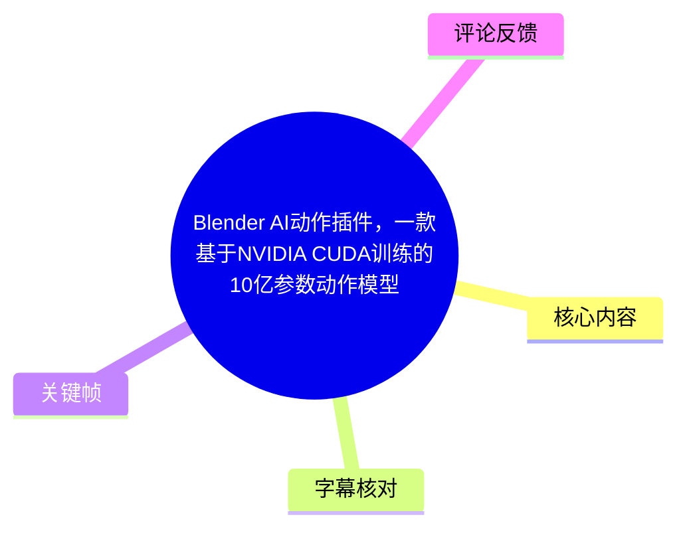
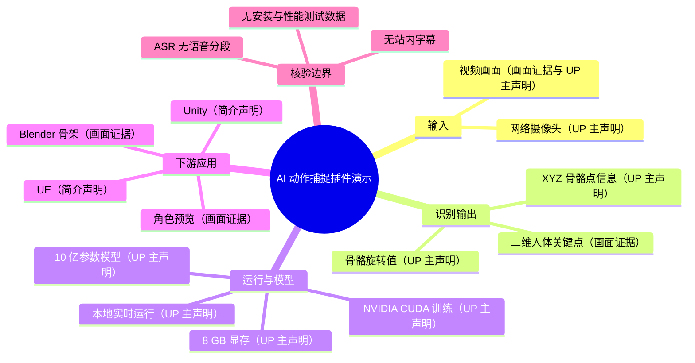
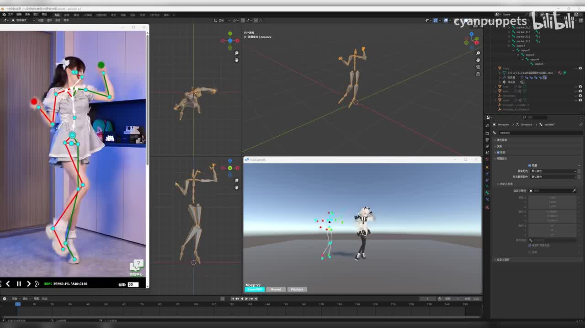
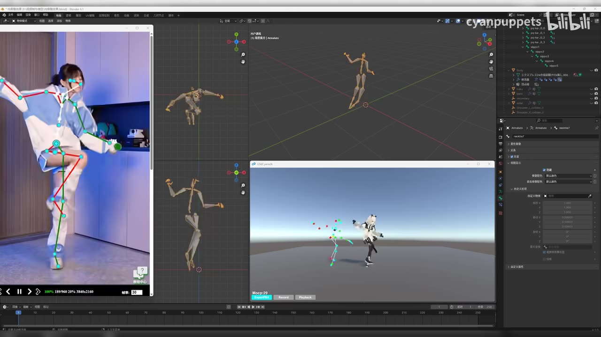
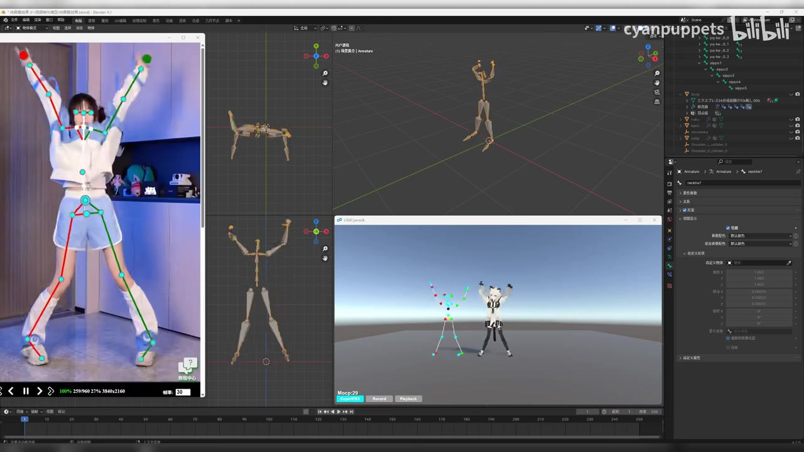

# Blender AI动作插件：单目视频动作转骨骼点并驱动 3D 角色

> 来源：[Bilibili 视频](https://www.bilibili.com/video/BV1vkk2BbEV6)<br>
> UP 主：cyanpuppets｜视频时长：33 秒｜分区/标签：AI 动捕、动作捕捉、Blender、UE、3D 动画、虚拟主播等  
> 本文将标题、简介中的能力描述标记为**UP 主声明**；关键帧可直接观察到的内容标记为**画面证据**。

## 小结

这是一个 33 秒的桌面演示视频，展示将人物视频中的动作识别为骨骼关键点，并在 Blender 与一个 3D 角色预览窗口中同步呈现的流程。画面左侧是带红绿骨架线与青色关节点的人体视频，中央/上方是 Blender 中的骨架（Armature）多视图，右下是 3D 角色和点状骨架的预览。

根据视频标题和简介，UP 主称该 Blender AI 动作插件使用一个“基于 NVIDIA CUDA 训练的 10 亿参数动作模型”，可在本地以 8 GB 显存实时运行；输入可为网络摄像头或视频画面，输出包括 XYZ 骨骼点信息与旋转值，并可传递到 Blender、Unity、UE 进行重定向。由于本次没有可用的站内字幕，且 ASR 未识别出语音，上述模型规模、显存门槛、训练方式、实时性及引擎兼容范围均只能作为作者声明记录，不能由视频语音或画面独立复核。

演示的核心价值在于将同一动作并列呈现为“原始人物画面—二维关键点—Blender 骨架—角色预览”四类表示，便于观察动作跟随关系。高抬腿、抬臂、双臂上举等姿态均有对应的骨架变化，说明视频重点是动作捕捉结果的可视化和重定向效果，而非安装、模型训练或参数配置教程。

适合 Blender 动画、虚拟形象、实时动捕、Unity/UE 重定向工作流的读者快速判断该类方案的输出形态。若计划实际部署，仍需向作者确认插件名称/下载方式、GPU 型号、驱动与 CUDA 版本、支持的骨架规范、帧率、延迟、导出格式、商业授权及 Unity/UE 的实际接入方式。

## 思维导图





## 目录

- [视频定位与信息边界](#视频定位与信息边界--全片-00000033)
- [画面中的动作捕捉链路](#画面中的动作捕捉链路--全片-00000033)
- [作者声明的模型、性能与输出参数](#作者声明的模型性能与输出参数--全片-00000033)
- [从演示可整理的使用步骤](#从演示可整理的使用步骤--全片-00000033)
- [适用条件、限制与时效性](#适用条件限制与时效性--全片-00000033)
- [字幕比对](#字幕比对)
- [评论分析](#评论分析)
- [处理记录](#处理记录)

## 视频定位与信息边界｜全片 [00:00–00:00:33](https://www.bilibili.com/video/BV1vkk2BbEV6?t=0)

本视频没有提供可用的站内字幕，本次 ASR 也没有生成任何带时间戳的语音分段，因此无法依据字幕将“模型参数”“工作流说明”等文字精确定位到某一秒。当前唯一可直接使用的时间范围是元数据给出的全片时长 33 秒，故本篇涉及演示内容的时间轴统一链接至视频起点，而不虚构具体段落秒数。

视频标题与简介提供的作者声明如下：

| 项目 | 内容 | 证据等级 |
| --- | --- | --- |
| 工具定位 | Blender AI 动作插件 | 标题与简介 |
| 模型训练表述 | 基于 NVIDIA CUDA 训练 | 标题 |
| 模型规模 | 10 亿参数动作模型 | 标题 |
| 本地硬件门槛 | 本地实时运行，8 GB 显存 | 标题 |
| 输入源 | 网络摄像头或视频画面 | 标题与简介 |
| 输出 | XYZ 骨骼点信息、旋转值 | 标题与简介 |
| 下游目标 | Blender、Unity、UE 重定向 | 简介 |
| 实拍演示内容 | 人物视频、人体关键点、Blender 骨架、角色预览同步变化 | 关键帧 |

其中，“NVIDIA CUDA 训练”是作者对训练环境/方式的表述，不等同于已确认的运行时依赖、CUDA 版本或硬件兼容列表；“8 GB 显存”也没有在画面中给出 GPU 型号、输入分辨率、帧率、并发数或延迟测量条件，不能直接外推到所有设备。

## 画面中的动作捕捉链路｜全片 [00:00–00:00:33](https://www.bilibili.com/video/BV1vkk2BbEV6?t=0)

### 1. 人物画面叠加二维关节检测结果

关键帧显示，左侧竖向视频窗口播放一名人物的动作，身体上覆盖了由线段和圆点组成的骨架。红、绿线段分别连接身体不同侧的肢体，青色圆点标出头部、肩部、肘部、手腕、躯干、髋部、膝部与脚部附近的位置。

这说明演示至少包含了基于视频帧的人体姿态关键点可视化。需要注意，画面展示的是二维叠加结果；标题所称的 XYZ 三维坐标并没有以数值表格或坐标读数形式展示，不能从截图单独验证其坐标单位、参考原点、深度精度或坐标轴朝向。



> 图：该帧将输入人物视频、叠加的关节连线、Blender 的多视图骨架和右下角色预览放在同一屏幕，是识别“视频输入—姿态估计—骨架驱动”关系的主要画面证据。人物抬起一侧手臂时，Blender 骨架也呈现相应的上肢姿态。

### 2. Blender 中的骨架多视图

画面中央区域为 Blender 工作区，可见多个视图中的金色骨架。不同视角同时显示骨架姿势，有助于检查仅凭单一视角难以判断的肢体前后关系和姿态形状。右侧还可见 Blender 的对象/属性区域，表明动作结果正在 Blender 环境中检查或编辑。

从画面能确认的是：骨架在 Blender 中以 Armature 形式可视化，并随左侧人物姿势变化。画面没有展示插件面板的完整名称、输入设备选择、骨架映射配置、录制按钮的操作过程，也没有显示导出文件或时间线关键帧数据，因此这些步骤不可补写为已演示功能。

### 3. 角色与点骨架的同步预览

右下角独立预览窗口中，点状骨架与一个二次元风格 3D 角色并列。随着人物做出抬腿、抬手、双臂上举等动作，角色姿势也发生相应变化。这个窗口体现的重点是：识别出的身体运动可被用于角色的动作呈现，而不只是输出一组关键点。



> 图：人物高抬腿时，左侧关键点骨架、Blender 中的骨架和右下角色都呈现明显的非对称腿部姿态。该帧比站立姿态更能观察动作传递在大幅关节变化下的可见效果。



> 图：双臂上举、双腿分开的姿态使左右肢体的关键点和骨骼连接更清晰。其价值在于直观展示输入姿态与下游骨架/角色姿态的对应，而非证明数值精度或实时帧率。

## 作者声明的模型、性能与输出参数｜全片 [00:00–00:00:33](https://www.bilibili.com/video/BV1vkk2BbEV6?t=0)

### 模型与计算资源

UP 主在标题中提出三项关键技术参数：

1. **“基于 NVIDIA CUDA 训练”**：指向 NVIDIA GPU/CUDA 生态下的模型训练描述。视频没有说明推理是否也必须使用 CUDA，也未给出 CUDA、PyTorch、ONNX Runtime、TensorRT 或显卡驱动版本。
2. **“10 亿参数动作模型”**：这是模型规模声明。未提供模型名称、架构、权重精度（FP32、FP16、INT8 等）、下载体积、训练数据来源或许可证。
3. **“本地实时运行 8 GB 显存”**：这是硬件和性能声明。没有出现实测 FPS、端到端延迟、显存曲线、CPU 占用、输入视频规格或运行显卡型号，因此“实时”的具体定义无法核验。

对于落地评估，8 GB 只能视为作者描述的参考门槛。实际显存占用通常还会受模型权重精度、预处理分辨率、视频解码、骨架重定向、Blender 场景复杂度和其他进程占用影响；这是通用工程风险提示，并非视频中给出的测试结论。

### 输入、输出与重定向目标

作者描述的链路可整理为：

```text
网络摄像头 / 视频画面
          ↓
人体动作模型
          ↓
XYZ 骨骼点信息 + 旋转值（作者声明）
          ↓
Blender / Unity / UE 的骨架重定向（作者声明）
          ↓
3D 骨架与角色动作预览
```

其中：

- **画面已展示**：视频输入、人体关节可视化、Blender 骨架、角色动作预览。
- **作者文字已声明但画面未直接展示**：网络摄像头输入、XYZ 数值、旋转值数值、Unity 接入、UE 接入。
- **尚不能确认**：输出协议、数据格式（例如 BVH、FBX、CSV、OSC、UDP、WebSocket 等）、坐标系转换、刷新频率、是否支持手指/面部、多人识别、动作录制及导出能力。

## 从演示可整理的使用步骤｜全片 [00:00–00:00:33](https://www.bilibili.com/video/BV1vkk2BbEV6?t=0)

视频没有展示明确的安装教学或操作按钮序列。以下是依据画面和作者简介可整理出的**概念性流程**，其中未在视频中实际演示的配置项均不应视为既定操作方法。

1. **准备人物输入**
   - 可使用视频画面；左侧窗口明确显示了预录人物视频。
   - 作者另称支持网络摄像头，但本段画面无法确认当前演示是否为摄像头实时输入。
   - 为提高身体关节可见性，应尽量让全身处于画面内；这是一项通用姿态估计实践建议。

2. **运行人体动作识别**
   - 画面结果表明系统会在人物图像上叠加关节位置及肢体连接线。
   - 作者称输出包含 XYZ 点位与旋转值，但视频未显示输出面板、字段命名或数据单位。

3. **将结果映射到 Blender 骨架**
   - 画面中 Blender 多视图显示金色骨架姿态与输入人物动作存在对应变化。
   - 实际使用时通常需要匹配源骨架与目标角色骨架的关节定义、朝向和初始姿态；但视频未展示具体映射表、T Pose/A Pose 校准或约束设置。

4. **预览角色动作**
   - 右下窗口可见角色跟随点状骨架变化。
   - 该演示能说明动作驱动效果，但不提供角色绑定质量、脚底锁定、抖动滤波或穿模修正的配置细节。

5. **扩展到 Unity 或 UE**
   - Unity、UE 是简介中列出的目标平台。
   - 视频未展示两个引擎的界面、插件、网络桥接或导入步骤；因此不可据此写出具体安装路径、蓝图节点、Animator 配置或协议参数。

## 适用条件、限制与时效性｜全片 [00:00–00:00:33](https://www.bilibili.com/video/BV1vkk2BbEV6?t=0)

### 可迁移经验

- 将“输入人物画面、关键点、原始骨架、角色”并排展示，是检查动捕链路是否连通的有效方式。
- 对抬腿、单侧抬臂、双臂上举等姿态进行观察，比只展示静态站姿更容易暴露肢体跟随问题。
- 对接 3D 角色时，关键点位置和骨骼旋转是不同层次的数据：前者偏向空间定位，后者更直接服务于关节驱动。视频标题声称二者都会输出，但未展示其数据格式。

### 视频未解决或未验证的问题

| 问题 | 当前状态 |
| --- | --- |
| 插件名称、获取渠道、价格与授权 | 未提供 |
| 模型名称、权重来源、开源状态 | 未提供 |
| 8 GB 显存对应的 GPU 型号和测试条件 | 未提供 |
| 实际 FPS、端到端延迟、稳定性 | 未提供 |
| 多人、遮挡、快速转身、出画后的表现 | 未提供 |
| 深度/XYZ 的精度与坐标系 | 未提供 |
| 脚滑、抖动、手指、面部、物理碰撞处理 | 未提供 |
| Unity、UE 的实际接入画面和操作 | 未提供 |

单目人体视频的深度和被遮挡关节通常存在歧义，画面中也没有针对转身、遮挡或剧烈快速动作的测试。因此，不能仅凭这个短演示推断其适用于高精度影视级动捕或所有实时直播场景；这属于基于任务性质的审慎判断，不是作者在视频中的否定结论。

### 时效性

视频元数据的发布时间为 **2025-11-12**。AI 动捕工具的模型权重、显存优化、平台支持、收费策略和安装兼容性可能随版本更新改变。本文保留的是该视频及其简介在抓取时所包含的信息，实际部署前应以作者后续发布的说明和插件当前版本为准。

## 字幕比对

| 字幕来源 | 完整性 | 专有名词 | 时间轴 | 主要问题 |
| --- | --- | --- | --- | --- |
| Bilibili 站内字幕 | 未提供可用字幕 | 无从核验 | 无 | 无法用作内容或时间定位依据 |
| 本次 ASR 字幕 | 为空，0 个语音分段 | 无从识别 | 无可用语音时间轴 | 自动语言识别为 `en`，置信度 `0.541015625`；诊断显示语音覆盖 0 秒，并提示未识别到语音 |

本次 ASR 使用 `medium` 模型，在 CUDA / float16 环境运行；音频时长为 **32.2525 秒**，但没有识别出任何语音片段。诊断数据**未标记** `noAudioStream=true`，因此不能将本视频判定为“源视频没有音轨”；只能如实记录为：已生成音频文件，但 ASR 未识别到可用语音内容。

最终没有采用任何字幕文本作为事实来源。正文依据以下材料交叉整理：

- 标题与简介：用于记录作者对模型规模、显存、输入输出及 Blender/Unity/UE 支持的声明；
- 关键帧：用于确认人物视频、二维关节叠加、Blender 骨架与角色预览的可见演示；
- 元数据：用于确认时长、发布时间、标签和互动数据。

由于没有可用语音字幕，无法通过字幕校正“插件名”“模型名”“骨架标准”“传输协议”等专有名词；这些信息在现有素材中均未出现。

## 评论分析

仅分析可获取的热评前三条；评论是用户观点或玩笑，不作为功能事实。

1. **溪溪宝贝777｜230 赞**  
   评论：“我是学生[doge]你懂的”。  
   该评论没有提供产品、模型或工作流信息，更像围绕获取门槛/价格的玩笑式表达。视频本身未公开定价、下载方式或授权条款，不能由此推断工具免费、可求资源或有学生优惠。

2. **命里有时终须无｜72 赞**  
   评论认为：“这个应该算在 ai 生成里，模型开源那就可以在 comfyui 里直接用了”。  
   这条评论提出了“模型开源”和“可在 ComfyUI 中使用”的假设，但视频标题和简介均未说明开源状态，也未提及 ComfyUI。因此该评论可反映观众对开放模型与节点式工作流的期待，不能视为已验证的兼容性信息。

3. **夜航罐头｜32 赞**  
   评论：“我有个大胆的想法[doge]”。  
   该评论未明确说明具体想法，没有可用于补充技术事实的内容。其语气显示观众可能联想到其他玩法或应用场景，但不能据此扩展视频的功能边界。

## 处理记录

- Worker ID：`worker-mrj0wbly-5dc4e50c`
- 模型：`gpt-5.6-terra`
- 素材处理工具与产物：已提供 `merged.mp4`、`audio/audio.wav`、12 张关键帧、ASR 结果、视频元数据与热评 JSON；ASR 模型为 `medium`，运行设备为 CUDA，计算类型为 float16。
- 字幕选择：站内字幕未提供可用内容；本次 ASR 已检查但输出为空，未采用字幕文本。时间轴仅使用元数据可确认的全片起点与 33 秒时长，不根据正文顺序虚构分段时间。
- 关键帧选择依据：选用 `frames/frame-001.jpg` 展示完整输入—骨架—角色同屏链路；选用 `frames/frame-003.jpg` 展示高抬腿等较大姿态变化；选用 `frames/frame-004.jpg` 展示双臂上举和左右肢体的同步关系。图片均用于说明可见动作映射，不用于推断未显示的数值参数。
- 评论处理：仅处理了可获取的热评前三条，未扩展到其他评论。
- 缓存清理：素材清单未提供缓存清理执行记录；本文不虚构已清理结果。
- 未解决问题：插件与模型名称、开源/授权状态、安装步骤、8 GB 显存的测试环境、实时性能指标、数据格式、Unity/UE 实际接入方式均无法从现有素材确认。
