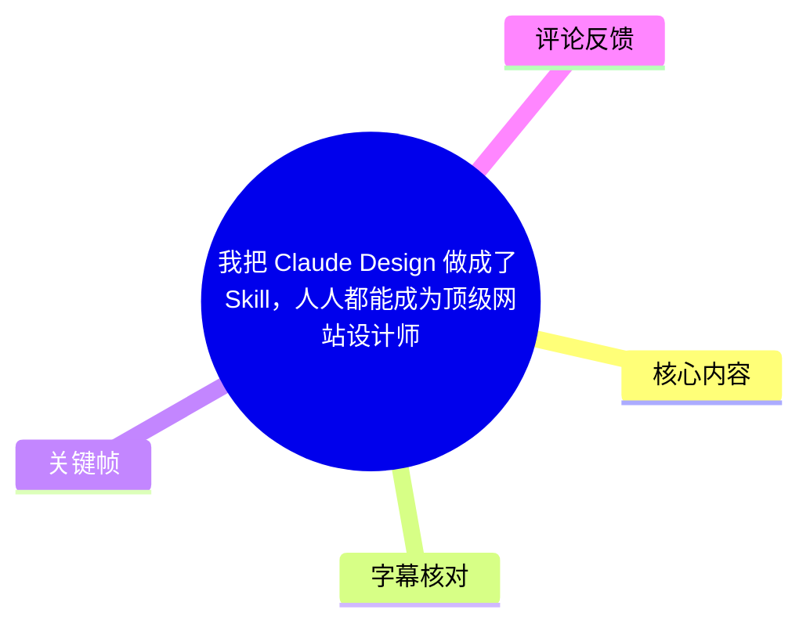
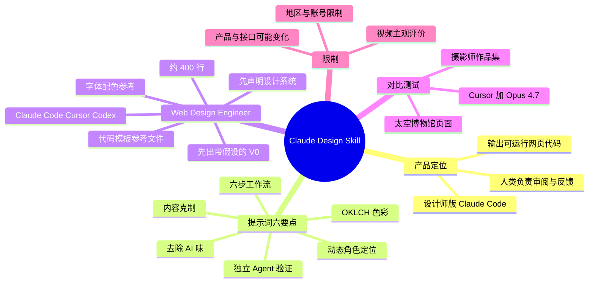
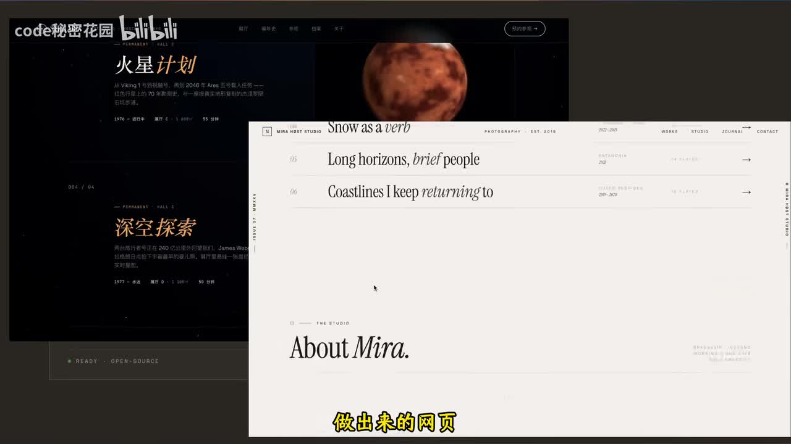
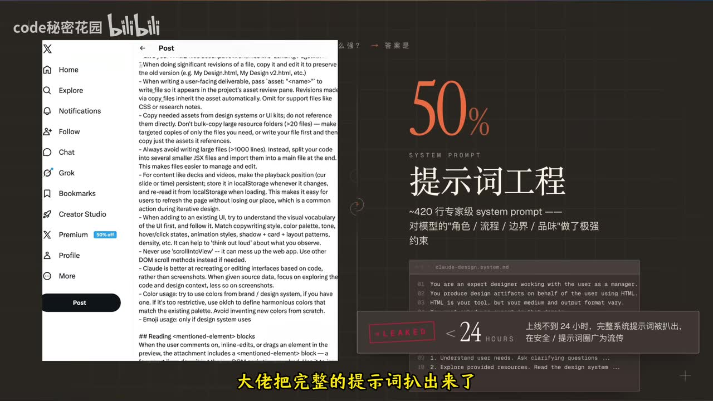
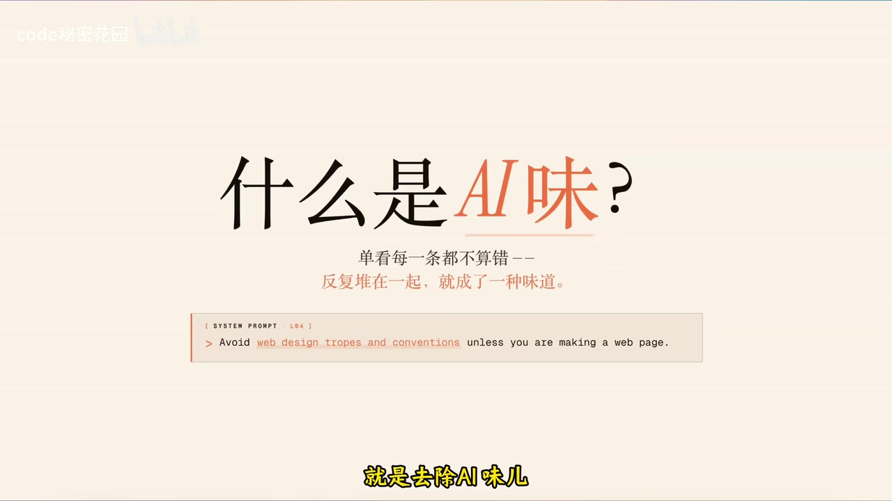

# 我把 Claude Design 做成了 Skill，人人都能成为顶级网站设计师

> 来源：[Bilibili 视频](https://www.bilibili.com/video/BV1MbosBfEoK)  
> UP 主：code秘密花园｜时长：12 分 58 秒｜标签：Claude Design、Skill、Agent、网站设计  
> 开源仓库：<https://github.com/ConardLi/web-design-skill/>

## 小结

视频围绕 Claude Design 的提示词设计展开。UP 主将其定位为“设计师版 Claude Code”：其重点不是让用户在画布中手工绘制，而是由 AI 直接生成可运行、可交互、可切换版本的网页代码，人主要负责审阅、判断与反馈。

作者认为 Claude Design 的效果来自两部分：模型能力与系统提示词。其中，视频重点拆解了提示词中可迁移的六类规则：动态角色定位、六步工作流、去除“AI 味”、OKLCH 色彩策略、内容克制原则，以及通过独立子 Agent 进行验证。

由于作者称 Anthropic 产品在中国大陆的使用门槛较高，且其个人曾有三个账号被封、产品又无法直接接入其工作流，作者将其认为具有通用价值的部分抽取为约 400 行的 `Web Design Engineer` Skill。视频称该 Skill 可用于 Claude Code、Cursor、Codex，并增加了设计系统预声明、快速输出带假设的 V0、字体与配色参考表、典型代码模板等约束。

两组对比测试均在 **Cursor + Claude Opus 4.7** 环境中进行：太空探索博物馆展览页和独立摄影师作品集页。作者的主观结论是：不使用 Skill 的结果已可用，但 Skill 能通过减少霓虹渐变、模板化卡片和泛化文案，使结果从“能用”向“精致、有风格”提升；其以“85 分到 95 分”形容差距。这是作者的评价，并非独立基准测试结论。

需要注意时效与限制：视频涉及的 Claude Design 产品能力、接口可用性、模型版本与地区访问状态均可能变化；“完整提示词泄露”“无 API”“Figma 股价受影响”等说法均为视频中的叙述，本文不将其扩展为已独立验证的事实。开源 Skill 的具体实现、许可证、维护状态仍应以仓库实时内容为准。

## 思维导图





## 目录

- [背景：Claude Design 的定位与作者方案](#背景claude-design-的定位与作者方案)
- [提示词六项核心设计原则](#提示词六项核心设计原则)
  - [动态角色定位](#动态角色定位)
  - [六步工作流与提问策略](#六步工作流与提问策略)
  - [去除 AI 味](#去除-ai-味)
  - [OKLCH 色彩系统](#oklch-色彩系统)
  - [内容克制与留白](#内容克制与留白)
  - [独立上下文验证](#独立上下文验证)
- [Web Design Engineer Skill 的提炼与使用步骤](#web-design-engineer-skill-的提炼与使用步骤)
- [两组对比测试与结果解读](#两组对比测试与结果解读)
- [开源项目、限制与时效性](#开源项目限制与时效性)
- [字幕比对](#字幕比对)
- [评论分析](#评论分析)
- [处理记录](#处理记录)

## 背景：Claude Design 的定位与作者方案

### [产品背景与核心观点（00:00:00）](https://www.bilibili.com/video/BV1MbosBfEoK?t=0)

视频开头称，Anthropic 发布了名为 **Claude Design** 的功能，并将它概括为“设计师版 Claude Code”。作者提到 Figma 股价下跌，并将此描述为 Anthropic 新功能影响其他公司预期的又一案例；这属于视频的新闻化引入，未在素材中提供独立数据或因果验证。

作者强调，不应将 Claude Design 简化理解为“AI 版 Figma”或传统画布工具：

| 传统设计工具逻辑 | 视频对 Claude Design 的描述 |
| --- | --- |
| 人在画布上操作 | AI 充当主要生成者 |
| AI 用于加速局部工作 | 人主要负责审阅、判断、反馈 |
| 常见产物可能是静态设计稿 | 产物是可实际运行的网页代码链接 |
| 用户亲自绘制/拼装 | 用户通过需求与反馈引导生成 |

视频称，Claude Design 页面左侧输入需求、右侧直接出现设计成果；其输出不是单张 UI 图片，而是可点击、可交互、可切换版本的真实网页代码。作者进一步将其能力概括为：一半来自 **Claude Opus 4.7** 模型能力，另一半来自精心编排的提示词。



> 图：画面并列展示深色太空主题网页与浅色摄影作品集网页，直观说明视频讨论的目标并非单一视觉风格，而是通过 Skill 生成不同领域的完整网页方案。

### [提示词被研究与拆解的缘由（00:01:17）](https://www.bilibili.com/video/BV1MbosBfEoK?t=77)

作者称 Claude Design 上线不到 24 小时，完整系统提示词已被安全领域人士提取出来；随后作者对其进行研究。画面以“提示词工程”“约 420 行专家级 system prompt”等信息呈现该提示词的复杂度。

视频将其系统提示词的价值归纳为：它不仅要求模型生成页面，还对模型的**角色、流程、边界与审美倾向**进行约束。



> 图：画面左侧展示一段英文提示词文本，右侧说明系统提示词对“角色、流程、边界、品味”作出强约束。这是理解后续六项原则与 Skill 来源的关键视觉证据。

## 提示词六项核心设计原则

### 动态角色定位 [00:01:42](https://www.bilibili.com/video/BV1MbosBfEoK?t=102)

作者首先拆解角色关系：提示词不是让模型扮演泛化的“AI 助手”，而是要求它作为**专家设计师**工作，用户则是其**产品经理**。

这一设定包含两层含义：

1. **让模型更有判断力**  
   作者认为，设计师角色应能做出相对果断的设计判断，而不只是被动执行指令。

2. **保留用户的最终决策权**  
   模型会在关键点回到用户处确认，因为用户作为“产品经理”仍掌握最终决策权。

更重要的是，角色不是静态的。作者举例说明：

| 任务 | 应切换的角色 |
| --- | --- |
| 制作动画 | 动效设计师（Motion Designer） |
| 制作原型 | UX 设计师 |
| 制作 PPT / Deck | Deck 设计师 |
| 常规网站实现 | Web 相关设计/开发角色 |

作者借此批评只写一句“你是前端开发者”的提示方式：它会使模型倾向于用网页实现的思维处理一切任务。视频给出的可迁移原则是：**角色定位应随任务动态切换，而非固定为单一技术职位。**


> 图：画面明确列出“动效设计师、UX 设计师、Deck 设计师”，并以“好的角色定位不是固定的，而是动态的”总结。这张图直接对应本节核心结论。

### 六步工作流与提问策略 [00:02:34](https://www.bilibili.com/video/BV1MbosBfEoK?t=154)

视频称 Claude Design 的提示词定义了六步流程：

1. **理解需求**
2. **探索资源**
3. **制定计划**
4. **搭建结构**
5. **完成验证**
6. **输出极简总结**

其中作者重点解释了两个执行细节。

#### 1. 何时提问，何时直接开始

许多 Agent 的极端表现是：

- 一开始连续抛出大量问题，阻塞执行；
- 或者完全不问，直接开始生成。

视频中的判断原则是：根据任务信息完整度和紧急程度决定。

- 用户只说“帮我做一个 PPT”时，模型可以先补充询问；
- 如果用户说明“10 分钟后就要用于全运会”，则应立即执行，避免不必要的澄清拖慢交付。

这不是“永远少问”或“永远多问”，而是将**澄清成本**与**任务时效**纳入判断。

#### 2. 总结只输出必要信息

作者称，提示词要求模型总结时仅包含：

- 关键注意事项；
- 后续动作。

不应重复复述已经完成的工作。其目的在于减少 Agent 输出中的套话、回顾性流水账和无效冗余。

### 去除 AI 味 [00:03:29](https://www.bilibili.com/video/BV1MbosBfEoK?t=209)

作者认为，“去除 AI 味”是整套提示词中最有价值的部分之一。视频所说的“AI 味”并非某一个元素本身错误，而是多个默认视觉套路叠加后形成的可识别模板感。

视频列举的典型问题包括：

- 紫、粉、蓝等高饱和渐变反复使用；
- 大圆角卡片；
- 用 Emoji 充当图标；
- 填入假数据或无意义数据；
- 左侧带彩色边框的圆角卡片；
- 泛滥、陈旧或“烂大街”的字体；
- 为填满空间而堆放图表、图标、模块。

作者的核心判断是：这些元素单看可能不差，但高频组合后会使用户“一眼看出是 AI 生成”。



> 图：画面写明“单看每一条都不算错，反复堆在一起，就成了一种味道”，并展示“避免网页设计陈词滥调”的提示词片段，准确解释了视频对 AI 味的定义。

可将视频中的“负向约束”整理为以下检查清单：

| 检查项 | 应避免的情况 |
| --- | --- |
| 渐变 | 将紫粉蓝霓虹渐变作为默认背景方案 |
| 卡片 | 大量大圆角、半透明、彩色侧边框卡片 |
| 图标 | 随意用 Emoji 替代专业图标系统 |
| 字体 | 使用高度泛化、缺乏语境的默认字体 |
| 数据 | 使用无法解释来源或不服务内容目标的数字、图表 |
| 布局 | 为了“不空”而不断增加栏目与组件 |
| 文案 | 使用泛化、营销腔浓厚、无品牌人格的 AI 文案 |

视频还提到，原提示词会列出不建议使用的字体、替代方案，以及一些小众但高质量的字体，但素材未提供具体字体名单，因此本文不补充猜测。

### OKLCH 色彩系统 [00:04:31](https://www.bilibili.com/video/BV1MbosBfEoK?t=271)

作者给出的色彩使用优先级为：

1. 优先使用**品牌色**；
2. 若品牌色不足，则使用基于 **OKLCH** 派生的颜色；
3. 不要凭空、随意编造新的颜色。

视频用 HSL 与 OKLCH 的对比解释其原因：

| 色彩空间 | 视频中的解释 |
| --- | --- |
| HSL | 感知并不均匀；相同亮度数值下，黄色可能比蓝色看起来亮得多 |
| OKLCH | 感知相对均匀；可保持亮度与色度相对稳定，仅调整色相角以得到更自然协调的颜色 |

作者的意思不是 HSL 不可使用，而是 AI 若随机以 HSL 数值配色，可能“数值没问题、观感不舒服”；而 OKLCH 更适合以较稳定的感知亮度与色度构建派生色。

**实践要点：**

- 不从随机色值开始，而从品牌色或明确主色开始；
- 先确定明度、色度层级，再生成不同色相；
- 让主色、文字色、背景色、边框色、状态色形成系统；
- 不应仅因“科技感”而默认加入高亮霓虹色。

### 内容克制与留白 [00:05:19](https://www.bilibili.com/video/BV1MbosBfEoK?t=319)

视频引用乔布斯的观点：“要用 1000 个 No 去换一个 Yes。”作者将其用于网页内容设计，指出 AI 很容易把页面空间全部塞满。

典型的 AI 落地页堆砌方式包括：Hero 区、功能区、评价数据、FAQ、联系方式等模块一次性全部加入。问题不在于这些模块绝对不能出现，而在于每个模块都显得普通、缺乏存在理由。

视频提出的内容原则是：

> 每一个元素都必须证明自己为什么应该在那里。

因此，在想新增模块时，应先判断：

- 页面是真的缺少信息，还是只是视觉上觉得“空”？
- 如果是“空”，是否可通过版式、层级、留白、文字尺度解决？
- 新模块是否服务核心转化、叙事或用户任务？
- 它是否能提供不可替代的信息？

作者认为，一个大胆的留白，可能比十个凑数板块更有表现力。此处的“留白”并不等于浪费空间，而是通过节奏与层级强化内容重点。

### 独立上下文验证 [00:06:02](https://www.bilibili.com/video/BV1MbosBfEoK?t=362)

视频第六点讨论验证：在开发完成后，应创建一个**独立子 Agent**，对当前页面进行全面检查。

作者将其与此前讨论的 Harness 实践联系起来：若让同一个 Agent 在同一上下文中检查自己的产物，它更可能沿用原有假设，并倾向认为“没有问题”；若换成新的上下文或独立 Agent，则更容易发现盲区。

可据此形成一个可执行的评审模式：

1. 主 Agent：分析、设计并实现页面；
2. 独立评审 Agent：不继承过多实现过程中的自我解释；
3. 评审范围至少覆盖：
   - 需求是否满足；
   - 文案与信息层级；
   - 视觉一致性；
   - 色彩与对比度；
   - 响应式与交互；
   - 无意义元素、模板感与“AI 味”；
4. 将问题反馈给主 Agent 或人工决策者；
5. 人工保留最终审美与业务判断权。

## Web Design Engineer Skill 的提炼与使用步骤

### [为何制作 Skill：地区使用限制与提示词迁移（00:06:29）](https://www.bilibili.com/video/BV1MbosBfEoK?t=389)

作者表示，Anthropic 产品在中国大陆使用困难，且其个人已有三个账号被封，因此已放弃官方渠道；视频还称 Claude Design 没有 API，无法直接接入自己的工作流。以上为作者在视频中的个人使用陈述，可能随地区、产品政策和时间变化。

作者基于已获得的提示词内容制作了名为 **Web Design Engineer** 的 Skill，意图是把依赖特定产品环境的描述剥离出去，只保留通用、有价值的设计约束。视频称其可直接用于：

- Claude Code；
- Cursor；
- Codex。

Skill 规模约为 **400 行**。这是一项视频中的近似描述，而非本文对仓库文件的重新统计。

### [Skill 结构与实际使用顺序（00:07:18）](https://www.bilibili.com/video/BV1MbosBfEoK?t=438)

根据视频，使用 Skill 时的关键步骤可整理如下。

#### 步骤 1：先声明设计系统，再写代码

作者要求模型在编码前先以自然语言明确说明将采用的设计系统，至少覆盖：

- 配色方案；
- 字体；
- 间距；
- 页面整体风格与信息层级。

这样做的目的，是在尚未生成大量代码前就暴露设计方向。如果方向错误，可以早期纠偏，避免拿到完整成品后再整体推翻。

**建议的产物格式：**

```text
设计方向：
- 品牌与情绪：
- 主色 / 中性色 / 状态色：
- 标题字体 / 正文字体：
- 栅格、边距、圆角与阴影策略：
- 动效原则：
- 内容层级：
- 明确避免的视觉套路：
```

上述格式是根据视频原则整理的实施模板，并非视频逐字展示的原始文本。

#### 步骤 2：优先输出带假设与占位符的 V0

作者主张尽早得到一个带有假设和占位符的最小版本，即粗糙的 **V0**，而不是等待一个耗时更长、视觉高度打磨的 V1。

其逻辑是：

- V0 便于快速确认方向；
- 若核心方向错了，精雕细琢的版本只会造成更大返工；
- 可以在 V0 中明确未确认项、占位数据和待补充资产。

**V0 应至少显式标注：**

- 设计假设；
- 需要用户确认的内容；
- 真实素材尚未提供的区域；
- 占位图片、占位数据或占位文案；
- 下一轮应优先修改的部分。

#### 步骤 3：添加更强的“去 AI 味”限制

作者称，他在 Claude Design 原有思想基础上补充了更多反模板化条目。实际执行时，可将其转换为明确约束：

```text
避免：
- 默认紫粉蓝霓虹渐变
- 仅由 Hero + 多张卡片构成的落地页模板
- Emoji 作为主要图标体系
- 无来源的指标、评分、图表
- 与品牌无关的营销式泛化文案
- 为填满页面而增加的模块
```

#### 步骤 4：调用字体、配色与代码模板参考

视频称 Skill 附带：

- 经作者验证的字体与配色参考对照表；
- `reference` 文件；
- 一些典型代码模板。

作者称这部分灵感来自 Claude Design 提示词中的组件相关内容。由于素材未给出具体文件路径、字体名称、色值、代码片段或目录结构，使用者应到开源仓库中核对实际内容。

#### 步骤 5：使用独立评审上下文进行验证

实现完成后，不应只让原实现 Agent 自检。应额外创建评审任务，重点检查需求符合度、设计系统一致性、可读性、无障碍与“AI 味”问题。

## 两组对比测试与结果解读

### [测试环境与太空博物馆展览页（00:08:43）](https://www.bilibili.com/video/BV1MbosBfEoK?t=523)

为保持对比公平，作者称所有测试均在：

- **Cursor**
- **Claude Opus 4.7**

环境中完成。

第一组任务是制作“太空探索博物馆的线上展览页”，作者提供了一组详细需求，再比较有无 Skill 的生成结果。

| 维度 | 不使用 Skill 的版本 | 使用 Skill 的版本 |
| --- | --- | --- |
| 氛围 | 深色背景、Canvas 星空、行星动画，有太空感 | 深沉色调，接近杂志印刷质感 |
| 色彩 | 青、紫、粉渐变 | 使用 OKLCH 定义整体色彩 |
| 字体 | 作者认为相对老套 | 标题与正文均更具特点 |
| 布局 | 标准 Hero + 卡片式落地页 | 非传统卡片式布局 |
| 动效 | 有发光、渐变等效果 | 作者认为更舒适、更有创意 |
| 作者评价 | 可用但视觉创意不足 | 更像经验丰富设计师的作品 |

视频对无 Skill 版本并非全盘否定：它有深色背景、Canvas 绘制星空和行星动画，能传达太空主题。作者的问题主要是其视觉语汇过于常见：青紫粉渐变、发光效果、标准 Hero 加卡片布局的组合显得模板化。

而 Skill 版本被作者描述为没有典型 AI 霓虹感，使用深沉、类似杂志印刷的色调，且标题与正文的字体更有特点；这些评价来自作者的主观视觉判断，视频未展示可量化的用户研究或设计评分流程。

### [独立摄影师作品集测试（00:10:15）](https://www.bilibili.com/video/BV1MbosBfEoK?t=615)

第二组测试只使用一个非常简短的提示：

> 帮我做一个独立摄影师的个人作品集网站。

作者刻意不补充更多需求，以测试模型在信息缺乏条件下的自主决策与提问策略。

#### 行为差异

- **使用 Skill 的版本**：先询问整体配色、色调倾向、核心元素等；
- **不使用 Skill 的版本**：直接开始执行。

这与前文“何时提问”的原则相呼应：当需求模糊且不存在明确紧急信号时，先澄清有助于降低方向错误的风险。

#### 成果差异

作者认为不使用 Skill 的摄影师网站存在以下问题：

- 深色背景；
- 霓虹发光；
- 半透明卡片；
- AI 感强的文案；
- 未表达摄影师应有的“慢、真、自由”气质。

使用 Skill 的版本则被描述为：

- 虚构了一位北欧摄影师；
- 从头构建一套完整视觉风格；
- 向下滚动时像翻阅高端摄影画册；
- 更容易让访客信任摄影师审美。

这里存在一个需要明确的边界：虚构摄影师、虚构身份与风格在演示设计方向时可作为概念样例，但若用于真实商业网站，应避免将虚构人物经历、作品归属或业务数据当成真实信息发布。

### [作者的最终结论（00:11:28）](https://www.bilibili.com/video/BV1MbosBfEoK?t=688)

作者总结称，不使用 Skill 的版本本身已很好，并评价 Opus 4.7 的裸跑结果甚至优于多数程序员手写代码；Skill 带来的差距约为“85 分到 95 分”：

- 从能用到好看；
- 从完整到精致；
- 从合格到有风格。

作者认为，这 10 分差距来自 Skill 中看似琐碎的规则：单条规则影响可能有限，但组合起来可形成质变。

应将这段结论理解为作者基于两组案例作出的经验性判断，而不是严格控制变量后的普适性能结论。实际结果仍会受模型版本、上下文长度、项目素材、设计需求、实现环境、人工反馈质量和评审标准影响。

## 开源项目、限制与时效性

### [Skill 与 easy-agent 项目（00:11:57）](https://www.bilibili.com/video/BV1MbosBfEoK?t=717)

作者称已将以下内容打包开源：

- Skill 完整文件；
- 作为参考的 Claude Design 原始提示词；
- 若干 Demo 网站。

视频描述对应仓库地址为：

<https://github.com/ConardLi/web-design-skill/>

视频末尾还推荐了作者正在制作的 **easy-agent** 开源项目。其目标是从零复刻一个类似 Claude Code 的本地 Agent；作者称完整跟随该项目的学习者将能够具备从零开发企业级 Agent 的能力，并理解 Claude Code 类产品的 Harness 如何工作。

### 限制、风险与适用边界

1. **产品状态具有时效性**  
   Claude Design、Claude Opus 4.7、Cursor、Codex 的功能、可用地区、价格、API 状态与产品命名均可能在视频发布后变化。不能将视频陈述视为永久有效。

2. **“泄露提示词”并非官方规范替代品**  
   视频称提示词已被提取。即使内容可获取，也应注意来源、授权、合规性与后续版本差异；不要默认其等同于官方公开文档。

3. **Skill 是设计约束，不是审美保证**  
   它可以减少常见默认套路，但无法替代真实品牌策略、摄影/插画资产、内容编辑、可访问性测试与人工设计判断。

4. **对比结果主要是案例展示**  
   视频未展示完整提示词、全部需求文本、生成耗时、代码质量指标、响应式测试、可访问性结果或用户测试，因此不能据此推导普遍性能提升幅度。

5. **不要把虚构内容用于真实业务发布**  
   演示中“北欧摄影师”等人设可作为设计概念，但真实网站必须核实人物、案例、数据、评价、版权素材及联系方式。

6. **“去 AI 味”不等于排斥视觉效果**  
   视频反对的是无语境地堆砌渐变、发光、卡片与假数据。若这些元素与品牌、内容和交互目标相符，仍可被有节制地使用。

## 字幕比对

| 字幕来源 | 完整性 | 专有名词 | 时间轴 | 主要问题 |
| --- | --- | --- | --- | --- |
| Bilibili 站内中文字幕 `p01-ai-zh.srt` | 覆盖完整，分段细，覆盖约 00:00:00–00:12:57 | 存在明显机器转写错误，如 `cloud design`、`cloud code`、`KLCH`、`OB 4.7` 等写法不稳定 | 精确到毫秒，可直接用于时间轴 | 中文词语误识别较多，如“社会哲学”“欢迎老师”“刘白”“题词”等 |
| Bilibili 站内英文字幕 `p01-ai-en.srt` | 覆盖完整，可辅助理解 | `Claude Design`、`Claude Code`、`OKLCH`、`Cursor`、`Opus 4.7` 等专名更稳定 | 与中文站内字幕一致，精确到毫秒 | 部分中文口语与技术细节被意译、缺字或错译 |
| 本次 ASR 字幕（medium，中文） | 诊断显示语音覆盖约 95.61%，识别时长 777.94 秒 | 专名误识别显著，如 `Figment`、`Cloud Ops 4.7`、`Claudie Zhan`、`Harnes` | 有时间戳，但首段从 00:00:26.570 开始，前段覆盖不完整；长段合并严重 | 文本错误较多、分段过长，不适合直接作为正文唯一依据 |

### 最终字幕选择

本文以 **Bilibili 站内中文字幕的毫秒级时间轴** 为主，结合站内英文字幕校正专有名词，并对照本次中文 ASR 检查内容覆盖与口语一致性。

本次 ASR 的 `language=zh`、`languageProbability=0.998046875`，且存在有效音频识别结果；诊断中**没有** `noAudioStream=true` 标记，因此本视频并非无音轨视频，ASR 不是工具失败，而是存在典型的专名和长段转写误差。

经字幕交叉校正后，正文统一采用以下写法：

| 校正项 | 采用写法 | 依据 |
| --- | --- | --- |
| 产品名 | Claude Design | 视频标题、元数据、英文字幕、中文语境 |
| 代码工具 | Claude Code | 元数据、英文字幕、作者口述语境 |
| 模型 | Claude Opus 4.7 | 英文字幕在测试环境处明确写为 Claude Opus 4.7 |
| 色彩空间 | OKLCH | 英文字幕与技术语境一致 |
| 编辑器 | Cursor | 视频字幕与元数据描述 |
| Agent 运行框架 | Harness | 英文字幕及上下文 |
| Skill 名称 | Web Design Engineer | 站内英文字幕与中文语境 |
| 项目名 | easy-agent | 视频末尾字幕与作者口述语境 |

关键帧用于补足字幕无法准确传达的视觉内容，例如动态角色定位、系统提示词页面、太空/摄影作品集的风格差异；但不据画面推断未被视频说明的具体代码或参数。

## 评论分析

仅处理可获取的热评前三条。评论是用户观点，不作为已验证事实。

### 1. Mr_徐：询问数字人声音来源

> “这个数字人声音是哪一款？好耳熟。感觉在财经类的内容听到的多。”  
> 点赞：90

该评论关注视频的旁白/数字人声音，而非 Skill 本身。它说明声音风格具有较强辨识度，并使观众联想到财经内容中常见的数字人配音。视频素材没有说明配音工具、音色型号或授权来源，因此无法据此确定具体产品。

### 2. Donjiovanie：“爆改clawd”

> “爆改clawd”  
> 点赞：82

该评论使用简短网络化表达，可能是在调侃或概括作者对 Claude 相关能力进行改造、封装为 Skill 的做法。由于文本极短，无法确定其是称赞、玩梗还是指向具体项目；可确认的只是它反映了观众将视频理解为“对 Claude 能力进行再封装”的内容。

### 3. 做视频真难：质疑 Claude 的不可替代性与地区可用性

> “所以，克劳德这东西真的有不可替代性吗？为什么都公开说不让大陆用。好像完全没什么反应一样啊”  
> 点赞：65

该评论提出两个问题：

1. Claude 是否具有不可替代性；
2. 中国大陆的访问或使用限制为何未引发更大反应。

这与视频中作者提到的地区使用困难、账号被封、无法接入工作流形成呼应。但视频并未进行不同模型的系统比较，也未提供地区政策的官方来源，因此不能从该视频或评论推出“Claude 不可替代”或相关限制的具体原因。评论更适合作为用户需求信号：用户关心模型替代方案、地区可用性和实际工作流接入成本。

## 处理记录

- Worker ID：`worker-mrj0wjed-b0c290ad`
- 模型：`gpt-5.6-terra`
- 调用工具与素材：视频元数据、站内多语种 SRT 字幕、ASR `asr-result.json` 与 SRT、12 张关键帧、热评 JSON。
- ASR 检查：已检查本次 ASR；识别模型为 `medium`，语言为中文，CUDA / float16，语音覆盖约 `95.61%`，未标记 `noAudioStream=true`。
- 字幕选择：以站内中文 SRT 的精确时间轴为主；使用站内英文 SRT 校正技术专名；ASR 用于核验实际中文语音与内容连续性，不直接采用其错误较多的专名拼写。
- 关键帧依据：
  - `frames/frame-001.jpg`：展示太空展览页与摄影师页面，适合说明生成结果的跨风格示例；
  - `frames/frame-002.jpg`：展示系统提示词与“提示词工程”信息，适合说明 Skill 的来源；
  - `frames/frame-003.jpg`：展示动效、UX、Deck 设计师角色，适合说明动态角色机制；
  - `frames/frame-004.jpg`：展示“什么是 AI 味”及相关提示词片段，适合说明反模板化约束。
- 时间轴依据：所有章节链接按站内 SRT 或 ASR 的真实起始时间换算为秒数生成，未按文字顺序猜测位置。
- 评论处理：仅分析可获取热评前三条，未扩展至其他评论。
- 缓存清理：本任务提供的素材为只读上下文，未创建可清理的临时缓存；无额外缓存残留可报告。
- 未解决问题：
  - 未提供 Skill 仓库内文件清单、许可证、实际代码和实时维护状态，无法在本文中验证；
  - 视频提及的产品访问限制、API 状态、提示词来源与市场影响均未附独立证据，已保留为视频陈述而非事实定论。
