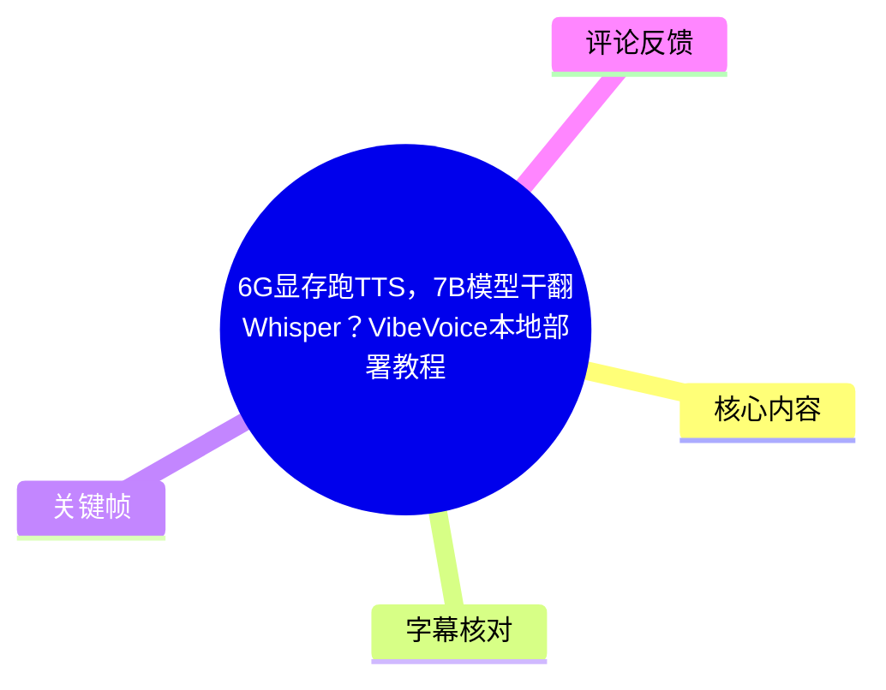
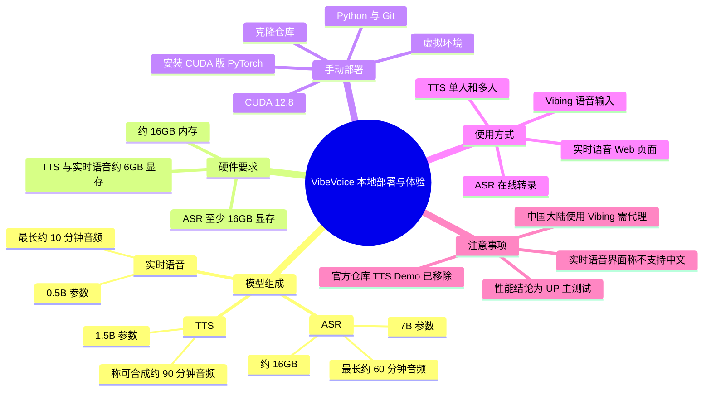
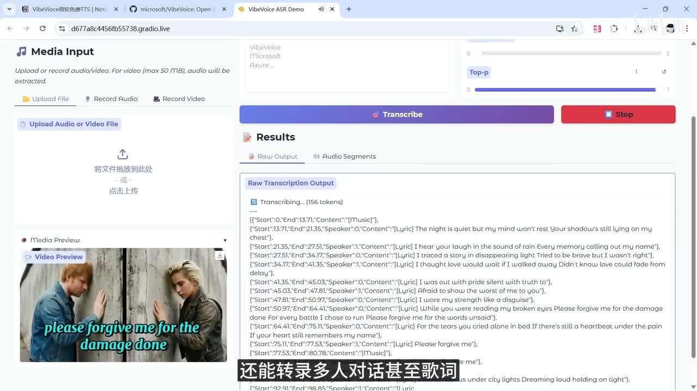
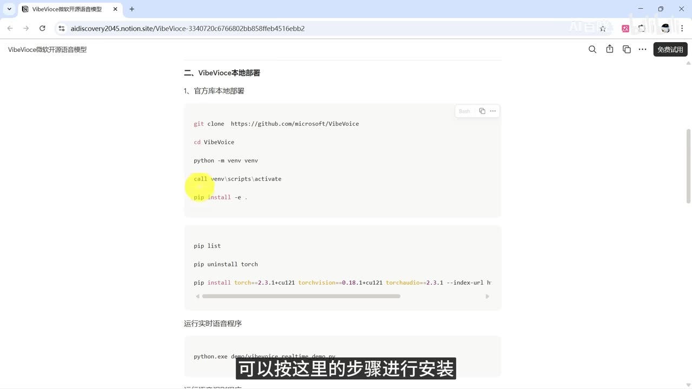
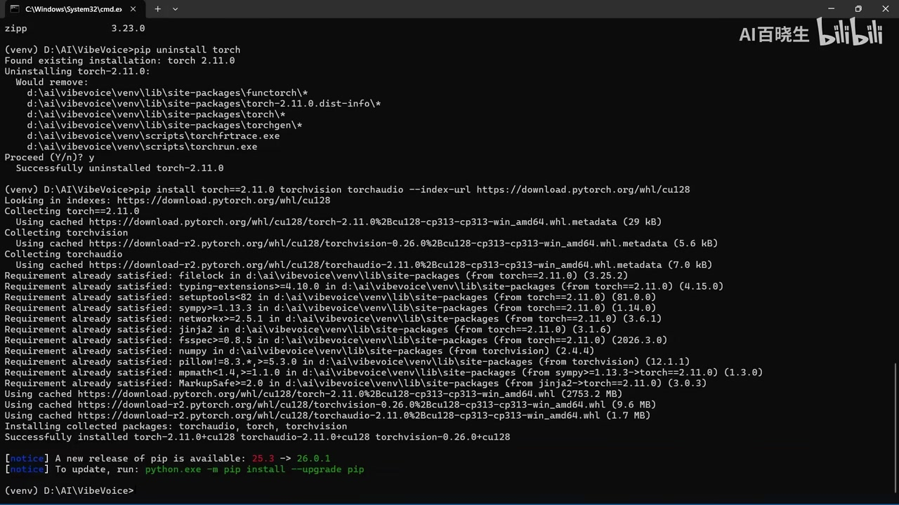
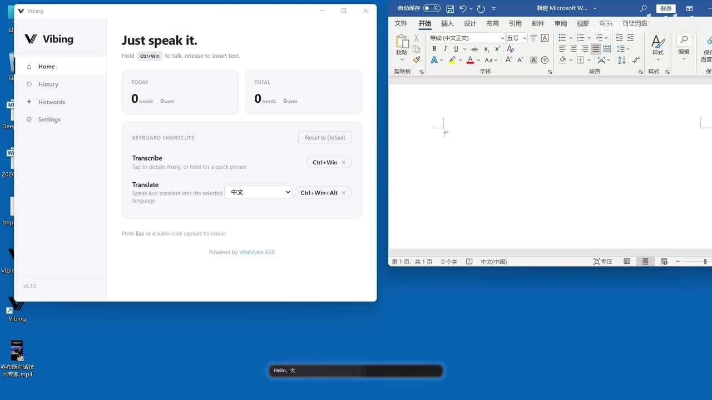

# 6G显存跑TTS，7B模型干翻Whisper？VibeVoice本地部署教程

> 来源：[Bilibili 视频](https://www.bilibili.com/video/BV1h29jBeEfH)<br>
> UP 主：AI百晓生｜时长：10 分 02 秒｜合集：AIcode  
> 视频简介提供了笔记链接、百度网盘整合包链接与提取码 `v8tu`。本文仅整理视频中出现的内容，不对外部链接、模型性能或兼容性作额外验证。

## 小结

视频介绍微软开源语音模型 **VibeVoice** 的三类能力：语音识别（ASR）、文本转语音（TTS）与实时语音生成。UP 主称，语音识别原始模型为 7B 参数、约 16GB，能够处理最长约 60 分钟的音频；TTS 模型为 1.5B 参数，称可一次合成长达约 90 分钟音频；实时语音模型为 0.5B 参数，称可连续生成最长约 10 分钟音频。

本地部署的硬件门槛需分模型看待：视频称运行 7B 语音识别模型至少需要 16GB 显存；1.5B TTS 与 0.5B 实时语音模型的本地部署需要约 **6GB 显存与 16GB 内存**。因此，“6G 显存”并不适用于 7B ASR，而是视频中 TTS/实时语音部分的实测或部署条件。

手动部署流程是：安装 Python、Git，以及 NVIDIA 显卡对应的 CUDA 12.8；克隆仓库；创建并激活虚拟环境；以开发模式安装依赖；检查默认安装的 CPU 版 PyTorch，并在需要 GPU 推理时改装 CUDA 版 PyTorch。视频画面展示了仓库地址、`venv` 建立方式及 PyTorch 的卸载/重装操作，但并未完整、清晰地给出所有版本组合命令，实际应以所用 Python、CUDA、GPU 与 PyTorch 官方兼容矩阵为准。

功能演示中，实时语音页面支持选择语言、CFG、推理步数等参数，但 UP 主明确称其当时的界面 **不支持中文**。TTS 页面支持单人/多人说话人设置、音色选择、种子及高级参数；生成时显存占用画面显示低于 6GB，并可边生成边播放。长文本测试以约两万多字文本为例，UP 主称一次合成约 60 分钟音频，并建议在长文本合成前，将逗号、句号之外的其他标点替换为空格，以改善深层（原 ASR 词，语义可能指长文本）效果。

视频还介绍了 VibeVoice ASR 在线体验与 Vibing 客户端。ASR 演示支持对话或歌曲识别、上传文件或直接录音，结果包含时间戳、说话人和内容，且可下载标准字幕文件。Vibing 被描述为类似语音输入法的客户端，提供 macOS 和 Windows 版本；视频称其当时免费，但在中国大陆使用需要代理。上述“免费”“客户端版本”“官方是否保留 TTS Demo”等都属于强时效信息，应在使用前重新确认。

## 思维导图





## 目录

- [模型能力、性能说法与硬件边界](#模型能力性能说法与硬件边界)
- [手动本地部署流程](#手动本地部署流程)
- [实时语音生成：参数与语言限制](#实时语音生成参数与语言限制)
- [TTS：音色、多人对话与长文本](#tts音色多人对话与长文本)
- [ASR 在线体验与 Whisper 对比](#asr在线体验与-whisper-对比)
- [Vibing 客户端与时效性](#vibing客户端与时效性)
- [结论与限制](#结论与限制)
- [字幕比对](#字幕比对)
- [评论分析](#评论分析)
- [处理记录](#处理记录)

## 模型能力、性能说法与硬件边界 [00:00:33](https://www.bilibili.com/video/BV1h29jBeEfH?t=33)

视频开场将 VibeVoice 描述为微软开源语音模型，并将其能力拆成三个模型或方向：

| 模块 | 视频中的参数/能力表述 | 本地资源说法 | 需要注意的边界 |
| --- | --- | --- | --- |
| 语音识别（ASR） | 原始模型 7B 参数、约 16GB；一次可处理最长约 60 分钟音频；可处理单人朗读、多人对话和歌词 | 至少 16GB 显存 | 视频后续明确说因其自身显存不足，未在本地整合包中放入 ASR。 |
| 文本转语音（TTS） | 1.5B 参数；称可一次合成长达约 90 分钟语音，语气连贯、无串音 | 约 6GB 显存、16GB 内存 | “90 分钟”“无串音”均是视频介绍/展示中的说法，并非本文复现实测。 |
| 实时语音生成 | 0.5B 参数；最长可连续生成约 10 分钟音频；称支持中、英、法、德、葡萄牙语等十几种语言 | 约 6GB 显存、16GB 内存 | 后续 Web Demo 操作段中，UP 主又称该实时语音界面“目前还不支持中文”，应以具体 Demo 与版本为准。 |

UP 主给出的速度对比是：其本地测试一段约 10 分钟音频时，VibeVoice 用时约 30 秒，而 Whisper 用时约 2 分钟；后文在线识别演示则称，同一段约 10 分钟录音中，Whisper 用时 120 秒，准确率“相当”。这构成了视频对速度和准确率的主要论据，但没有给出具体 GPU、Whisper 版本、模型规格、量化方式、音频语言、批处理参数及评价指标，不能将其外推为通用基准结论。



> 图：画面展示 VibeVoice ASR Demo 的媒体输入、转录按钮和原始转录结果区域，结果中可见结构化时间字段、说话人字段与歌词标识。这直接支撑视频关于“上传/录音、转录、时间线、说话人、歌词识别”的功能介绍。

## 手动本地部署流程 [00:01:16](https://www.bilibili.com/video/BV1h29jBeEfH?t=76)

### 前置条件

UP 主在部署段提出以下前置环境：

1. 安装 **Python** 与 **Git**。
2. 使用 NVIDIA 显卡时，先安装 **CUDA 12.8**。
3. 中国大陆网络环境安装前，可开启 VPN 的 TUN 模式，或在命令行配置代理。
4. 进入项目仓库并按步骤安装。

视频画面可辨认的基础命令结构如下；其中仓库、虚拟环境与开发安装命令来自展示画面，不能从素材中可靠恢复所有依赖版本和完整 CUDA 安装命令：

```bash
git clone https://github.com/microsoft/VibeVoice
cd VibeVoice

python -m venv venv
call venv\scripts\activate

pip install -e .
```



> 图：该画面展示了官方库本地部署笔记中的克隆仓库、进入目录、创建/激活虚拟环境及 `pip install -e .` 步骤，是整理手动安装流程的主要画面依据。

### 检查并切换到 CUDA 版 PyTorch

视频称，依赖安装后可以通过 `pip` 查看安装情况；默认装入的是 CPU 版 PyTorch。若要进行 GPU 推理，应先卸载默认 PyTorch，再安装带 CUDA 的版本。视频展示的终端操作包含：

```bash
pip uninstall torch
```

随后画面中可见以 PyTorch 官方 wheel 索引安装 CUDA 12.8 对应包的操作，且终端显示安装结果为 `torch-2.11.0+cu128`、`torchvision-0.26.0+cu128`、`torchaudio-2.11.0+cu128`。但视频中命令文本部分被画面裁切，且这些具体版本可能随仓库、CUDA 与发布时间改变，不能将其视作唯一固定版本。



> 图：终端先显示 `pip uninstall torch` 成功，再显示从 CUDA 12.8 wheel 索引安装 PyTorch 相关包。这说明视频强调的关键排障点是“避免只安装 CPU 版 PyTorch”，而不是建议盲目复制任意版本号。

### Demo 的位置与启动方式

视频称演示程序位于 `Demo` 目录：

- 实时语音 Demo：可通过对应脚本启动；
- ASR Demo：也有单独的运行命令；
- 首次运行会自动下载模型；待启动完成后，在浏览器输入终端显示的本地地址访问。

素材未提供可可靠辨识的完整启动脚本文件名及参数。因此，本文不补写未经视频清晰展示的命令。实际执行时应查看当前仓库的 README、`demo/` 目录文件名与启动提示。

### TTS Demo 的来源差异

UP 主特别提醒：由于官方担心 TTS 被滥用，**官方仓库中的 TTS 演示程序已被移除**。想在本地使用 TTS，需要到视频所指的早期社区版本网址安装；该版本的安装步骤被称为与上方官方版相同。

这意味着仓库来源是决定功能是否可用的关键条件：

- 官方仓库：视频称包含实时语音与 ASR Demo；
- 早期社区版本：视频称可提供 TTS Demo；
- UP 主整合包：可免去部分手动安装，但其模型包中未含 ASR。

整合包的使用步骤为：下载后先解压 VibeVoice，再解压 `Models`，并将整个 `Models` 文件夹移入相应位置。视频称其中包含 TTS 模型与实时语音模型；ASR 因 UP 主显存不足未放入。

## 实时语音生成：参数与语言限制 [00:03:57](https://www.bilibili.com/video/BV1h29jBeEfH?t=237)

UP 主使用整合包演示实时语音脚本：

1. 双击实时语音启动脚本。
2. 首次启动需等待数十秒，程序会在线下载部分模型参数。
3. 出现“程序启动完成”及访问地址后，在浏览器打开该地址。
4. 输入待合成文本。
5. 选择对应语言。
6. 调节参数或使用默认值，点击 `Start` 生成。

该段最重要的限制是：UP 主明确称其操作的实时语音界面**目前不支持中文**。尽管视频开头对模型多语言能力的概述包含中文，实际前端/当前版本是否支持中文输入输出必须分开判断，不能据开场概述直接认定该 Demo 可用中文。

### 参数含义

| 参数 | 视频说明 | 实际取舍 |
| --- | --- | --- |
| CFG | 表示合成随机性；数值越小，模型发挥自由度越大 | 自由度提高不等于一定更好，应以可懂度、稳定性和风格一致性试听判断。 |
| 推理步数 | 数值越大，音质越好，但生成越慢 | 在质量、延迟与显存占用之间平衡。 |
| 语言 | 需要在页面中选择 | 当前演示界面被说明不支持中文。 |

UP 主依次播放了韩语、西班牙语和较长法语文本效果，并主观评价长法语“很流畅”、在其机器上基本感觉不到卡顿。这是特定设备上的体验描述，不能据此保证其他语言、文本长度或硬件配置的实时性。

## TTS：音色、多人对话与长文本 [00:05:36](https://www.bilibili.com/video/BV1h29jBeEfH?t=336)

TTS 启动脚本的第一次运行同样较慢，需要等模型加载完成并显示访问地址，再通过浏览器打开页面。

### 基本生成流程

1. 在输入框填写需要生成的语音文本。
2. 设定说话人数。
3. 单人场景选择一个音色；多人对话则分别为每位说话人选择音色。
4. 配置高级参数。
5. 设置种子：视频说明 `-1` 代表随机。
6. 以默认参数或修改后的参数发起生成。
7. 生成完成后，在页面下方获得完整音频文件，可下载另存。

视频称每种语言有三种音色可选；高级参数中的 CFG 和推理步数，与实时语音页面的含义相同。

### 显存、流式播放与参考音色选项

UP 主在单人朗读生成时展示的界面显示：显存占用不足 6GB，并称其支持边生成边播放。该信息与视频所述 6GB 显存门槛一致，但仅反映该演示时的环境、模型与输入条件。

视频还说明了一个“不使用参考音色合成”的选项：

- **未勾选**：上方所选择的音色会参与生成。
- **勾选**：上方音色选择将不生效。

该开关的名称与具体实现以演示页面为准；视频只说明其对音色选择是否生效的影响，没有给出对音质、说话人一致性或推理资源影响的量化结果。

### 多人对话和长文本经验

多人场景中，操作重点不是只设定人数，还要给每位说话人配置音色。视频以两人对话文本演示了角色交替朗读。

对于长文本，UP 主以《天龙八部》的一段文字测试，称文本约两万多字、单次合成约 60 分钟音频。这里需要区分：

- 视频开头对 1.5B TTS 的概述是“可一次合成长达 90 分钟”；
- 后续实际演示案例是“约两万多字、一次合成 60 分钟音频”；
- 两者分别是模型能力介绍和单次展示结果，不应混为同一项严格上限测试。

长文本预处理建议是：**在合成前，将逗号、句号之外的其他标点替换为空格**。这是 UP 主基于演示提出的经验做法，适合在长篇文本中作为可对照测试的预处理方案；视频未展示其与原始标点文本之间的客观评测。

## ASR 在线体验与 Whisper 对比 [00:08:13](https://www.bilibili.com/video/BV1h29jBeEfH?t=493)

视频将 ASR 体验放在官网页面中演示，流程为：

1. 在网页中选择识别类型：**对话**或**歌曲**。
2. 选择从本地上传音频/视频文件，或直接录音。
3. 上传一段约 10 分钟的既有视频录音。
4. 点击转录。
5. 在结果区查看时间戳、说话人和转录内容。
6. 下载标准字幕文件。

视频称转录速度“非常快”，但界面演示没有提供 VibeVoice 的精确总耗时读数。对照部分称：对同一段录音，Whisper 的准确率“相当”，但 Whisper 转录耗时 120 秒。视频也称多人对话结果会显示说话人序列，并自动切分各人的说话片段；歌曲识别能够标出歌词、时间线及对唱者。

这些结论应理解为 UP 主的单样本、特定环境体验。尤其“7B 模型干翻 Whisper”是标题式提法，视频正文实际给出的结论更接近于：**其测试中两者准确率相当，而 VibeVoice 耗时更短**。没有展示 WER/CER、说话人分离指标、歌曲集、噪声集或可复现配置，因此不支持普遍优劣断言。

## Vibing 客户端与时效性 [00:09:09](https://www.bilibili.com/video/BV1h29jBeEfH?t=549)

视频最后介绍名为 **Vibing** 的客户端，称其是前几天发布的语音识别客户端，可类比为语音输入法：

- 项目页面可直接下载；
- 视频称当时提供 **macOS** 与 **Windows** 两个版本；
- 安装过程全部保持默认选项；
- 运行后，可通过快捷键说话，把语音自动输入到文本编辑环境；
- 视频口述的快捷键 ASR 误识别为“Country/County + Win”等，关键帧中的界面明确显示为：
  - 转录：`Ctrl + Win`
  - 翻译：`Ctrl + Win + Alt`
- 视频称速度很快、当时完全免费；
- 视频称在中国大陆使用需要代理。



> 图：画面左侧是 Vibing 的 Home 页面，明确显示“Hold Ctrl+Win to talk, release to insert text”；右侧 Word 文档用于展示语音转文字插入的目标位置。该画面用于校正 ASR 对快捷键名称的误识别，并说明其实际使用形态。

### 时效性提示

Vibing 的免费状态、下载平台、快捷键配置、网络可用性和中国大陆代理要求，都可能随客户端版本、服务端策略与地区网络变化。视频发布日期对应的状态不等于当前状态；使用前应优先检查项目页、应用内设置和官方说明。

## 结论与限制 [00:09:33](https://www.bilibili.com/video/BV1h29jBeEfH?t=573)

VibeVoice 的实用价值在于将 ASR、TTS 和实时语音生成放在同一项目生态内，并给出了不同规模模型的资源区间。对于显存约 6GB、希望本地尝试 TTS 或实时语音的用户，视频提供了从环境准备、PyTorch CUDA 切换到 Web Demo 访问的基本路径；对于 ASR 用户，应准备至少 16GB 显存，并注意 UP 主并未在其整合包中附带 ASR 模型。

可迁移的部署经验包括：

- 不要只看模型参数量，也要区分 ASR、TTS、实时语音各自的显存要求。
- 安装后应确认 PyTorch 是否为 CUDA 版本；CPU 版会导致无法按预期使用 GPU 推理。
- 首次启动可能在线下载模型，需预留时间并处理网络连通性。
- 长文本 TTS 应先做标点预处理，并用实际目标文本试听，而不是仅以短句效果判断。
- 多人 TTS 必须为不同角色正确设置音色。
- 性能对比必须记录设备、模型版本、音频集、语言、时长、解码/推理参数与评价标准，否则只能视为体验参考。

未被视频充分验证或存在明确限制的内容：

1. VibeVoice 与 Whisper 的“谁更强”没有统一的公开基准、完整配置及错误率指标支撑。
2. 视频中实时语音页面被称为不支持中文，与开场“模型支持中文”等多语种概述存在版本/入口层面的差异。
3. 官方仓库 TTS Demo 已移除的状况及社区版本可用性具有时效性。
4. 整合包不含 ASR，且第三方整合包的安全性、更新节奏、许可证与模型来源未在视频中展开。
5. 视频画面中使用的 CUDA 12.8/PyTorch 组合并非所有显卡、Python 版本都适用；热评中老显卡用户使用 CUDA 12.6 成功，仅是个人案例。
6. “完全免费”“大陆需代理”是视频发布时的状态描述，后续可能变化。

## 字幕比对

| 字幕来源 | 完整性 | 专有名词 | 时间轴 | 主要问题 |
| --- | --- | --- | --- | --- |
| Bilibili 站内字幕 | 未提供可用字幕，无法比对内容 | 无法评估 | 无法评估 | 素材明确标注“未提供可用站内字幕”。 |
| 本次 ASR 字幕 | 覆盖约 481.74 秒语音，语音覆盖率约 80.16%；共有 32 段 | 多处误识别 | 提供 SRT 起止时间，可用于章节定位；但首段时长异常 | 品牌、技术名词、快捷键及部分语义词识别错误；33.630–34.110 秒首段承载过长文本，时间粒度明显异常。 |

本次已检查 ASR 结果。ASR 使用 `medium` 模型，在 CUDA / float16 环境运行，识别语言为中文，语言概率约 0.9985；素材未标记 `noAudioStream=true`，且存在音频文件与有效时间戳，因此不存在“源视频没有音轨”的情况。

由于站内字幕不可用，正文以**本次 ASR 的 SRT 时间戳**为章节链接依据，并结合视频标题、元数据和关键帧修正明显错误。主要校正如下：

| ASR 原文或问题 | 正文采用 | 校正依据 |
| --- | --- | --- |
| “WipeVoice”“Wipevoice” | VibeVoice | 视频标题、仓库画面与 Vibing 画面均指向 VibeVoice。 |
| “Wisp” | Whisper | 视频标题中的“Whisper”及语义上下文。 |
| “Person” | Python | 部署前置工具语境与画面中的 `python -m venv`。 |
| “Petouch / PETouch” | PyTorch | 终端画面显示 `pip uninstall torch`、`torch`、`torchvision`、`torchaudio`。 |
| “Modos” | `Models` | 视频口述与整合包目录语境；原词存在 ASR 拼写偏差。 |
| “Country/County + Win” | `Ctrl + Win` | Vibing 关键帧清楚显示快捷键。 |
| “Macro” | macOS | 视频语境为桌面系统版本；ASR 将 macOS 误识别。 |
| “深层的效果” | 保留为“深层（原 ASR 词，语义待定）效果” | 音频转写无法可靠确定原词，未擅自改写为确定术语。 |

ASR 诊断还显示两个较大无语音/未分段区间：277.23–307.51 秒约 30.28 秒，以及 328.00–336.07 秒约 8.07 秒。结合后续字幕内容，这些区域主要对应生成音频的播放/展示，正文仅记录 ASR 可确认的语言效果评价，不虚构其中未转写的具体语音内容。

## 评论分析

以下仅分析可获取的热评前三条，评论内容均不作为已验证事实。

1. **“为毛没有PC版APP”（7 赞）**  
   评论质疑 ASR 是否真能强于 Whisper，并表示其测试中 Qwen3.5 ASR 仍不及较早的 Whisper。该观点与视频标题的强对比形成张力，也指出性能判断必须依赖测试条件。视频本身只展示 UP 主“准确率相当、速度更快”的体验，未提供可复现实验，故该评论提出的怀疑合理，但其个人测试同样未给出数据集、模型规格和配置，不能据此下定论。

2. **“爱多玩”（5 赞）**  
   评论认为目前开源 TTS 中 Qwen3 TTS 仍是第一。该评论提供了横向竞品视角，但属于主观排名，未给出音质、克隆能力、自然度、多语种、实时性、显存或许可条件等评测维度。视频也没有与 Qwen3 TTS 对比，因此不能由本视频验证或反驳该结论。

3. **“阿峰不坏”（3 赞）**  
   评论称其在 Titan XP 老显卡上成功运行，做法是将 PyTorch 重装为 CUDA 12.6 版本；并推测 VibeVoice 基于 Qwen2.5-TTS，询问能否 GPU 与 CPU 协同加速。前半部分是有价值的兼容性个案，印证“PyTorch 与 CUDA 匹配”是部署关键；但 Titan XP、CUDA 12.6 和视频演示的 CUDA 12.8 并不等价，需按设备能力选择。关于模型基础与 CPU+GPU 协同加速属于评论者推测/提问，视频未提供证据，不能视为项目事实。

## 处理记录

- Worker ID：`worker-mrj0wjed-b0c290ad`
- 模型：`gpt-5.6-terra`
- 调用工具与素材：视频元数据、ASR 结果 JSON、ASR SRT 时间轴字幕、12 张关键帧清单、热评 JSON。
- ASR 检查：已检查本次 ASR；识别模型为 `medium`，语言 `zh`，CUDA / float16，具有时间戳。未发现 `noAudioStream=true` 标记；源素材包含 `audio/audio.wav`，故按有音轨视频处理。
- 字幕选择：站内字幕未提供可用版本；采用本次 ASR SRT 的真实起止时间生成时间轴链接，并用标题、画面和上下文校正明显专有名词误识别。对无法确定的词不作确定性改写。
- 关键帧选择依据：
  - `frames/frame-001.jpg`：ASR Demo 的上传、转录与结构化输出，支撑识别能力说明；
  - `frames/frame-002.jpg`：Vibing 客户端界面，直接校正快捷键并展示语音输入使用方式；
  - `frames/frame-003.jpg`：本地部署笔记与基础命令，支撑安装步骤；
  - `frames/frame-004.jpg`：PyTorch 卸载与 CUDA 版安装终端记录，支撑 GPU 推理排障说明。
- 缓存清理：本次仅基于任务提供的既有素材进行整理；未执行额外下载、转码或缓存写入，因而无新增缓存需要清理。
- 未解决问题：
  - 未提供站内字幕，无法进行逐句交叉验证；
  - ASR 首段时间戳异常压缩，且存在若干专有名词误识别；
  - 无法从现有素材确认完整 Demo 启动命令、所有依赖版本与社区 TTS 版本来源；
  - 视频中的性能、免费状态、地区网络要求和仓库功能状态均可能已变化。
