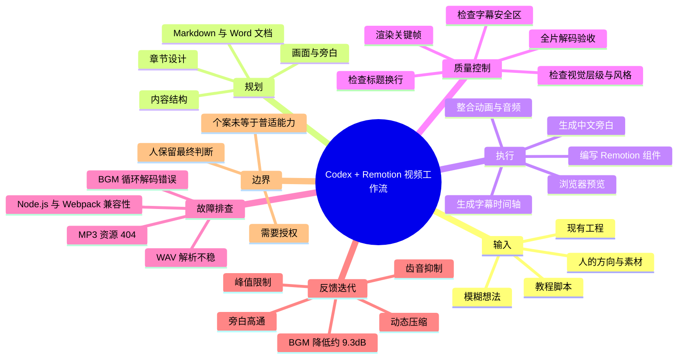
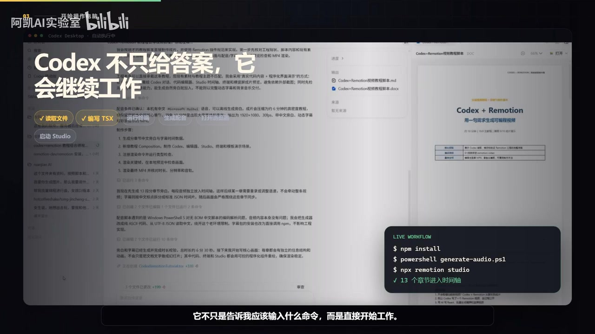

# 我只给 Codex 一个想法，它自己写代码、排错并做完了整条视频

> 来源：[Bilibili 视频](https://www.bilibili.com/video/BV1AsEq64Ere)  
> UP 主：阿凯AI实验室｜合集：AIcode｜视频时长：4 分 53 秒（元数据标注 293 秒）

## 小结

这是一条关于 **Codex 配合 Remotion 自动制作教程视频** 的流程复盘。UP 主称，自己最初只提出“按脚本制作一条 Codex + Remotion 教程视频”的方向，没有具体指定项目结构、动画写法、音频处理方式或渲染命令；随后由 Codex 承担读取脚本、拆解任务、编码、生成旁白与字幕、预览、渲染、排错和验收等工作。

视频最核心的观点不是“AI 能生成代码”，而是：在获得相应文件、终端、浏览器和工程操作授权的前提下，Agent 可以把创作任务组织成一个闭环——**先规划，再执行；遇错排查；完成后自测；收到反馈后继续修改**。人的职责转为提供方向、素材、审美反馈及最终判断。

流程中并非一次成功。视频明确列出 WAV 文件解析不稳定、转 MP3 后资源缓存与 404、背景音乐循环边界解码错误，以及 Node.js 与 Webpack 兼容性问题。针对这些问题，Codex 被描述为采取了统一音频格式、转换 BGM 编码、使用兼容 Node.js 22、清理缓存、短片验证后再全量渲染等措施。

第一次成片后，UP 主仅反馈“背景音乐偏大、AI 解说有一点爆音”。随后 Codex 将 BGM 下调约 **9.3 dB**，并为旁白增加高通、齿音抑制、动态压缩和峰值限制，再次渲染并检查解码与响度。视频最终声称交付物是包含中文旁白、动态字幕、背景音乐和 **13 个章节**的 H.264 视频，而非待人工收尾的代码片段。

适合希望用代码化视频工具制作内容、希望理解 AI Agent 工作方式的开发者与创作者阅读。需要注意的是，视频展示的是作者的单次工作流案例，未提供完整工程、命令日志、音频处理参数、实际耗时或对照测试；因此不能据此推导所有 Codex、Remotion 项目都能稳定自动完成同样的交付。

## 思维导图

## 目录

- [从想法到可执行脚本](#从想法到可执行脚本)
- [从脚本到 Remotion 工程](#从脚本到-remotion-工程)
- [关键帧预览与视觉质量检查](#关键帧预览与视觉质量检查)
- [故障排查、格式转换与环境兼容](#故障排查格式转换与环境兼容)
- [交付验收与声音反馈迭代](#交付验收与声音反馈迭代)
- [工作流结论、适用条件与限制](#工作流结论适用条件与限制)
- [关键参数与交付清单](#关键参数与交付清单)
- [字幕比对](#字幕比对)
- [评论分析](#评论分析)
- [处理记录](#处理记录)

## [从想法到可执行脚本](https://www.bilibili.com/video/BV1AsEq64Ere?t=18)

视频开头提出的情境是：UP 主没有打开剪辑软件，也没有手动写代码，只向 Codex 提出“按照脚本，做一个教程视频”的想法。ASR 在 0–16 秒称其为“6 分半视频”，但视频元数据为 293 秒，实际约 **4 分 53 秒**；这一时长表述应以元数据和音轨时长约 292 秒为准。

在实际制作之前，Codex 的第一步被描述为将“模糊想法”整理为可执行方案，而不是立即写代码。UP 主只说明要制作一条 Codex 加 Remotion 的教程，系统则整理并设计：

1. 内容结构；
2. 章节划分；
3. 各章节画面；
4. 旁白；
5. 节奏；
6. 文档输出。

视频称其同时生成了 Markdown 和 Word 两份文档。画面可见右侧结果区域列出 Markdown 原稿与 `.docx` 文件；但画面文字同时提及因环境缺少 LibreOffice，未完成标准 DOCX 图片渲染验收。因此，“生成 Word 文档”可视作视频已展示的输出，而文档的视觉渲染检查存在明确未完成项。

> 图：画面标题为“先把模糊想法变成可执行方案”，左侧展示脚本/规划页面，右侧展示生成结果及 Markdown、DOCX 文件。这一帧直接支持视频“先规划后制作”的叙述，也显示了文档交付与 DOCX 视觉验收之间的区别。

这一阶段可迁移的经验是：不要只给 Agent 一个笼统的“做视频”命令，而应要求它先产出可审阅的制作规格。对于视频项目，规格至少应显式覆盖章节、时长/节奏、旁白、视觉语言、素材来源、字幕策略、渲染规格和验收规则。原视频展示了规划输出，但没有公开具体脚本内容、章节明细或文档模板，因而无法复现其规划质量。

## [从脚本到 Remotion 工程](https://www.bilibili.com/video/BV1AsEq64Ere?t=45)

UP 主在将脚本交给 Codex 后，只补充了“按照你设计的脚本，帮我做成一个教程视频”。视频特别强调，UP 主没有指定：

- 项目如何创建；
- 动画怎样编写；
- 音频如何处理；
- 应使用什么渲染命令。

随后 Codex 的任务拆解包括：内容、画面、音频、字幕、预览、渲染和质量检查。画面将此呈现为“不是执行命令，而是规划工作流”，其中列出读取脚本、检查工程、设计画面、生成音频、预览检查、渲染验收六项。

> 图：左侧为用户请求，右侧为六个工作环节：读取脚本、检查工程、设计画面、生成音频、预览检查、渲染验收。它有助于理解视频所称的 Agent 能力边界：重点不是回答命令，而是围绕项目状态连续执行任务。

在 81–101 秒，视频列出的执行动作是：

1. 创建项目文件；
2. 编写 Remotion 组件；
3. 生成 **13 个章节**；
4. 调用系统中文语音制作旁白；
5. 生成字幕时间轴；
6. 将背景音乐、配音和动画放入同一工程；
7. 运行终端并启动浏览器；
8. 打开 Remotion Studio 查看实际画面。

> 图：画面标题为“Codex 不只给答案，它会继续工作”，背景中可见文档与 Codex 工作界面，右下角工作流框展示 `npm install`、音频生成脚本与 `npx remotion studio` 等字样。这一帧的价值在于将“读取文档—编写 TSX—启动 Studio”的连续过程可视化；画面中的命令属于演示素材，不足以作为完整可复现命令清单。

视频将这种方式与“普通聊天机器人”进行对比：后者给出应输入的命令；前者则在授权范围内直接操作工程。该对比是作者的工作流判断，不应理解为对所有聊天模型或 Agent 产品的通用性能结论。能否持续工作，取决于系统是否真的具备文件读写、命令执行、浏览器访问、软件运行权限，以及是否有适当的安全边界。

## [关键帧预览与视觉质量检查](https://www.bilibili.com/video/BV1AsEq64Ere?t=110)

视频主张：代码完成并不等于任务结束。Codex 在此阶段先渲染多个关键帧，再以真实输出图片检查视频视觉质量。检查项包括：

- 标题是否发生不自然换行；
- 字幕是否越过安全区；
- 信息层级是否清楚；
- 各章节的风格是否统一。

若发现标题排版不自然，流程会回到代码修改，再重新渲染确认。这是代码生成视频与传统时间线剪辑相通的一点：最终质量不能只通过源代码或预览逻辑判断，仍需检查编码后的视觉结果。

视频没有给出安全区的具体像素边距、字号、字体、关键帧抽样间隔或视觉评分规则。因此可将其理解为“人工/Agent 结合的视觉验收步骤”，不能将其误读为已经验证的自动化视觉 QA 标准。

实践上，若要将视频中做法落地，可以把关键帧检查固化为验收表：

| 检查维度 | 需要观察的问题 | 视频是否给出阈值 |
| --- | --- | --- |
| 标题排版 | 断行是否自然、是否被裁切 | 未给出 |
| 字幕安全区 | 是否贴边、溢出或被遮挡 | 未给出 |
| 信息层级 | 核心信息是否突出 | 未给出 |
| 章节一致性 | 字体、色彩、布局是否统一 | 未给出 |
| 画面输出 | 是否以实际渲染图而非仅编辑器状态检查 | 已明确提出 |

## [故障排查、格式转换与环境兼容](https://www.bilibili.com/video/BV1AsEq64Ere?t=141)

视频明确说明该过程不是一次成功。问题及对应处理如下表所示。表中“处理”均为视频叙述，不代表已取得可公开复核的命令日志。

| 时间段 | 问题 | 视频所述原因或表现 | 视频所述处理 |
| --- | --- | --- | --- |
| 02:23–02:32 | WAV 解析失败 | Remotion Studio 无法稳定解析语音 WAV | 将语音转为 MP3 |
| 02:23–02:32 | 音频资源问题 | 转 MP3 后出现资源缓存和 404 | 后续统一资源处理并清理缓存 |
| 02:32–02:40 | BGM 循环错误 | 循环边界出现解码错误 | 将背景音乐转换为 AAC |
| 02:32–02:40 | 环境兼容性 | 完整渲染时 Node.js 版本触发 Webpack 兼容问题 | 下载/使用兼容的 Node.js 22 |
| 02:51–03:05 | 全量渲染风险 | 不应直接在未验证状态下继续完整渲染 | 先渲染短片验证，再继续完整渲染 |

其中，音频相关处理的关键格式信息是：

- 语音：统一转换为**双声道 MP3**；
- 背景音乐：转换为 **AAC**；
- 环境：使用兼容的 **Node.js 22**；
- 验证策略：先渲染短片，再进行完整渲染；
- 工程卫生：清理缓存。

这里的经验不是“MP3 或 AAC 必然优于 WAV”，而是应让音频格式、Web 资源加载方式、浏览器预览和最终渲染链路保持兼容。具体项目还应验证采样率、码率、声道布局、资源路径、跨平台解码器行为及 Remotion/Node/Webpack 的版本组合；这些具体参数均未在视频中披露。

视频也将传统流程概括为：创作者自己搜索报错、转换格式、切换环境、反复重试；而 Codex 在案例中继续定位问题并验证。这里必须保留前提：自动排障可能会修改依赖、缓存、运行时版本与媒体文件，需要版本控制、输出备份和可审计的权限范围，避免 Agent 在生产环境中做不可逆变更。

## [交付验收与声音反馈迭代](https://www.bilibili.com/video/BV1AsEq64Ere?t=188)

渲染成功后，视频称 Codex 没有立即结束，而是逐项检查交付文件。作者列出的验收项包括：

- 视频分辨率是否为 **1080P**；
- 帧率是否为 **30 fps**；
- 音频是否为**双声道**；
- 整条时间轴是否可以完整解码。

最终交付被描述为：包含中文旁白、动态字幕、背景音乐和 13 个章节的 **H.264 视频**。这一定义很重要：作者将“可播放、可验收的成片”而不是“代码仓库”视作完成标准。

在第一版成片后，UP 主只提出两项审美/听感反馈：

1. 背景音乐太大；
2. AI 解说存在一点爆音。

Codex 随后将自然语言反馈转译为工程调整：

| 对象 | 调整 |
| --- | --- |
| 背景音乐 | 降低约 **9.3 dB** |
| 旁白 | 增加高通处理 |
| 旁白 | 增加齿音抑制 |
| 旁白 | 增加动态压缩 |
| 旁白 | 增加峰值限制 |
| 成片 | 重新完整渲染，并再次进行解码与响度检查 |

视频没有说明高通截止频率、压缩器阈值/比例、齿音处理频段、限制器 ceiling、响度目标（如 LUFS）或 BGM 原始/最终响度。因此，这些内容只能作为处理方向，不能直接作为音频工程参数复用。

## [工作流结论、适用条件与限制](https://www.bilibili.com/video/BV1AsEq64Ere?t=242)

UP 主将该案例概括为一个闭环：

> 规划 → 执行 → 排查 → 自测 → 接收反馈 → 修改与再验收

人并未退出流程，而是从逐步执行者转向：

- 提供创作方向；
- 提供脚本、素材或约束；
- 对产出提出审美反馈；
- 做最终判断与授权决策。

视频结尾进一步强调，原本在文件夹、终端、浏览器和剪辑流程之间来回切换的操作，可以在**授权范围内**交给 Codex。这一“授权范围”是视频最重要的限制条件之一：能否读写文件、安装依赖、下载运行时、启动浏览器、调用系统语音、使用网络资源，都直接决定 Agent 的实际能力和风险范围。

此外，还应区分视频明确展示的内容与未被证实的部分：

| 类别 | 可由视频内容支持 | 视频未提供或未充分验证 |
| --- | --- | --- |
| 流程 | 从规划到交付、排障、反馈迭代的叙述 | 每一步的完整日志与可复现项目 |
| 技术 | Remotion、中文语音、字幕、H.264、1080P、30 fps、音频格式转换 | 完整依赖版本、渲染命令、源码与配置 |
| 音频 | BGM 降约 9.3 dB；高通、齿音抑制、压缩、限制器 | 各处理器的精确参数及主观/客观测试 |
| 质量 | 关键帧检查、完整解码检查、响度检查 | 检查脚本、阈值、报告或对照样本 |
| 效率 | 作者认为行动成本降低 | 实际耗时、成本、失败率、人工干预次数对比 |

工具和版本迭代较快。视频的发布元数据对应 2026 年，Node.js、Webpack、Remotion、Codex 的能力与兼容关系都可能在之后发生变化。特别是 Node.js 22 在该案例中被描述为兼容性解决方案，并不等于对所有 Remotion 项目的普适推荐；升级前仍应以项目锁定依赖、官方兼容说明和本地测试为准。

## [关键参数与交付清单](https://www.bilibili.com/video/BV1AsEq64Ere?t=191)

以下仅整理视频中明确出现的参数与规格，不补充未出现的编码码率、采样率、响度阈值等信息。

| 项目 | 视频信息 |
| --- | --- |
| 视频源时长 | 293 秒，约 4 分 53 秒 |
| 章节数量 | 13 个 |
| 画面分辨率 | 1920 × 1080 / 1080P |
| 帧率 | 30 fps |
| 视频编码 | H.264 |
| 旁白 | 系统中文语音；后续统一为双声道 MP3 |
| 背景音乐 | 后续转换为 AAC |
| BGM 调整 | 降低约 9.3 dB |
| 旁白后处理 | 高通、齿音抑制、动态压缩、峰值限制 |
| 开发环境处理 | 使用兼容的 Node.js 22；涉及 Webpack 兼容问题 |
| 验收方式 | 关键帧检查、短片渲染验证、全片渲染、完整解码检查、响度检查 |
| 最终交付 | 含中文旁白、动态字幕、BGM、13 章节的 H.264 成片 |

## 字幕比对

站内未提供可用字幕，因此无法进行逐句对照。本次 ASR 有真实时间戳，覆盖音轨约 292.05 秒，识别语言为中文，语言置信度约 0.9897；诊断显示语音覆盖约 85.74%，共有 34 段，首段从 0 秒开始、末段至 291.08 秒。未检测到 `noAudioStream=true` 标记，且素材清单包含 `audio/audio.wav`，因此本视频存在音轨，本次整理以 ASR 时间轴为主要依据。

| 字幕来源 | 完整性 | 专有名词 | 时间轴 | 主要问题 |
| --- | --- | --- | --- | --- |
| Bilibili 站内字幕 | 未提供可用字幕 | 无法评估 | 无法评估 | 缺少可比对文本与时间轴 |
| 本次 ASR 字幕 | 较完整；34 段，覆盖约 85.74% 的时长 | Codex、Remotion、Node.js、Webpack、AAC、H.264 等大多可辨 | 完整，SRT 提供毫秒级起止时间 | 存在同音/识别错误，且开头“6 分半”与元数据时长矛盾 |

最终采用策略：

- **时间轴**：采用本次 ASR SRT 的起止时间，章节链接均由真实片段起点换算为秒数。
- **文本校正**：结合上下文与关键帧对明显 ASR 错词进行阅读层面的校正，但不改写为素材中未出现的事实。
- **时长校正**：ASR 的“这条 6 分半视频”保留为原视频口播内容，但正文时长使用元数据 293 秒与音频约 292 秒判断，即约 4 分 53 秒。

重要校正项如下：

| ASR 原文 | 整理采用 | 校正依据 |
| --- | --- | --- |
| 写代砍 | 写代码 | 上下文为编写 Remotion 组件 |
| 可执行脚板 | 可执行脚本/方案 | 上下文与画面均为脚本规划 |
| 渲软 | 渲染 | 任务拆解包含渲染与质量检查 |
| 关键针 | 关键帧 | 后文明确为真实图片检查 |
| Wave | WAV | 音频文件格式语境 |
| 双生道 | 双声道 | 音频声道语境 |
| 渲阳/完整渲然 | 渲染/完整渲染 | 上下文为导出与验收 |
| 尺音抑制 | 齿音抑制 | 音频处理术语 |
| 中端 | 终端 | 文件夹、终端、浏览器并列语境 |

## 评论分析

仅处理本次可获取的热评前三条。评论均为个人观点或互动内容，不能作为视频技术效果的独立验证。

1. **四季的绿叶**（点赞 1）：“我昨天才知道，现在的 code 类工具可以做视频了”  
   - 观点：评论者将视频视为“代码类工具可参与视频制作”的认知入口。  
   - 补充价值：反映此类代码驱动视频工作流对普通观众仍具有新鲜感。  
   - 可信度与边界：这是个人认知反馈，没有提供工具效果、成本或复现过程。

2. **BRS梦幻佼佼者**（点赞 0）：“发现宝藏UP！！作品超棒，可以互关吗……”  
   - 观点：对 UP 主及作品表达正面评价，并发出社交互动请求。  
   - 补充价值：说明该评论者认可作品呈现。  
   - 可信度与边界：没有涉及具体技术事实、工作流细节或验证材料，不能用于证明视频技术结论。

3. **GPT等AI订阅-可开票20**（点赞 0）：“感觉AI真正厉害的是让行动成本变低”  
   - 观点：将 AI 的价值概括为降低行动成本。  
   - 与视频关系：与视频“人提供方向、Agent 接管跨工具执行”的主旨一致。  
   - 可信度与边界：这是概念性评价；视频本身未给出耗时、费用、人工投入或失败率，故无法定量证明行动成本实际降低了多少。

## 处理记录

- Worker ID：`worker-mrj0wbly-5dc4e50c`
- 模型：`gpt-5.6-terra`
- 可用素材与工具产物：视频元数据、音频文件 `audio/audio.wav`、ASR 结果与 SRT、12 张关键帧、评论 JSON、站内字幕检查结果。
- ASR 处理信息：ASR 模型为 `medium`，设备为 CUDA，计算类型为 `float16`，自动识别语言为中文；ASR 结果有时间戳，未标记 `noAudioStream=true`。
- 字幕选择：站内字幕未提供可用内容；以本次 ASR SRT 作为时间轴主来源，并依据上下文、术语与关键帧校正明显识别错误。未将 ASR 中“6 分半”作为时长事实，时长以 293 秒元数据和约 292 秒音轨为准。
- 关键帧选择依据：
  - `frames/frame-002.jpg`：展示从模糊需求到 Markdown/DOCX 方案输出，支持“先规划”的叙述；
  - `frames/frame-003.jpg`：展示读取脚本、检查工程、设计画面、生成音频、预览检查、渲染验收的工作流拆解；
  - `frames/frame-004.jpg`：展示文档、工程执行与 Remotion Studio 工作链路，辅助理解“持续工作”而非单次问答。
- 关键帧使用限制：仅对提供画面中可直接观察的文字和界面作描述；未将画面中零散命令补全为未提供的完整可执行脚本。
- 评论处理：仅分析接口可获取的热评前三条，未扩展至其他评论。
- 缓存清理：素材仅表明视频中的 Codex 曾“清理缓存”作为排障动作；本次知识整理未提供实际缓存清理执行记录，因此不声明已完成本地缓存清理。
- 未解决问题：
  - 未提供完整 Remotion 工程、源代码、依赖锁文件与渲染日志，无法复现实验；
  - 未提供音频处理器的精确参数、响度目标和验收报告；
  - 无站内字幕，无法对 ASR 做官方字幕级逐句校验；
  - 元数据发布时间未标注时区，文中日期仅按 Unix 时间戳换算说明。
