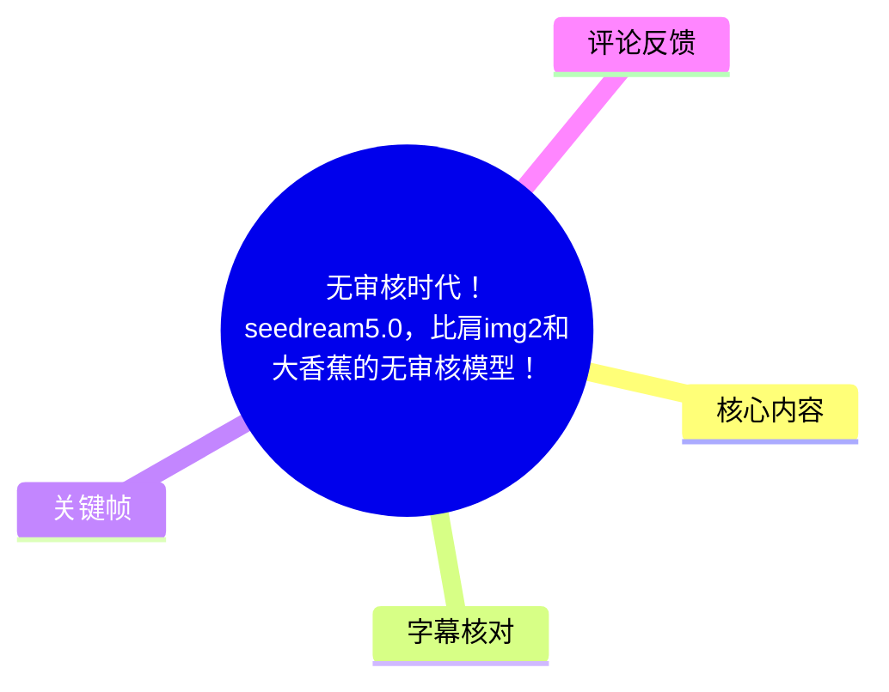
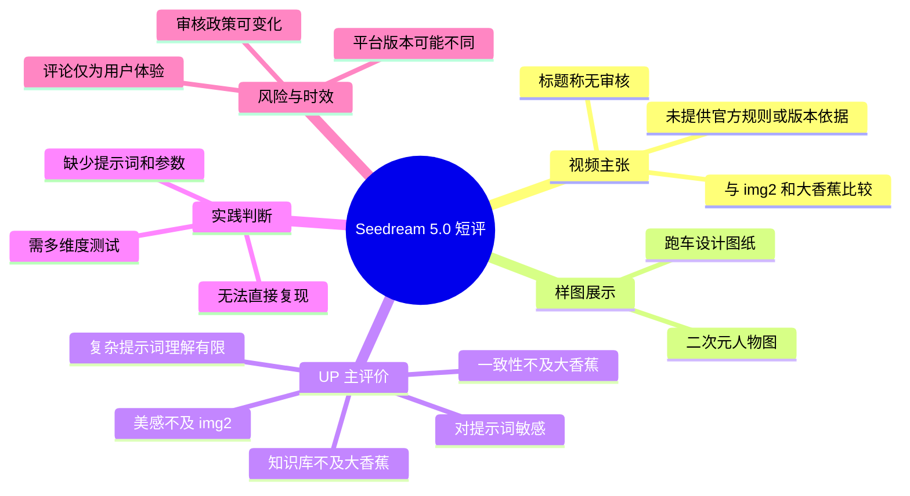
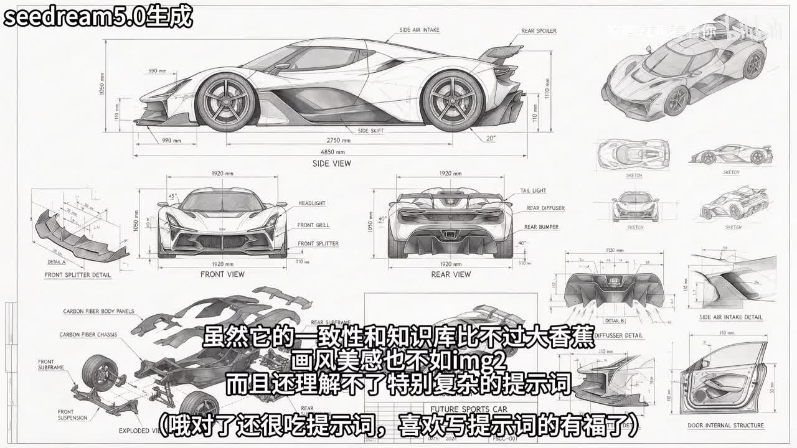

# 无审核时代！seedream5.0，比肩img2和大香蕉的无审核模型！

> 来源：[Bilibili 视频](https://www.bilibili.com/video/BV1ZpMH6LEws) 
> UP 主：吃着辣鸡看着你｜时长：50 秒｜画面规格：1920×1080 
> 数据抓取时间：2026-07-13 20:04:54（素材提供时间）

## 小结

视频以短评和样图展示的形式，讨论名为 **Seedream 5.0** 的图像生成模型。标题将其描述为“无审核模型”，并将其与“img2”“大香蕉”等模型并列；但这属于 UP 主的宣传性表述，素材中没有平台规则、模型公告、版本号、调用入口或审核策略文档，因此不能据此确认该模型确实“无审核”。

UP 主给出的核心评价存在明显的优劣并列：一方面，视频认为该模型能生成较复杂的汽车设计图纸式画面，并称其“还理解不了特别复杂的提示词”“很吃提示词”；另一方面，画面字幕明确表示，它的“一致性和知识库比不过大香蕉，画风美感也不如 img2”。这意味着视频并非给出全面领先的结论，而是强调其可能存在更宽松的内容边界与特定生成能力。

关键帧展示了两类结果：一张带尺寸标注、分解结构和多视角草图的跑车设计板，以及一张二次元人物图。前者可用于观察模型对工业设计图纸构图、文字/标注布局和多视角对象组织的表现；后者则是视频用来暗示内容边界的样例，但不能据此推断模型的实际审核规则、稳定性或可商用性。

对实际使用者而言，视频提供的可迁移经验是：**不要只以“审核宽松”判断模型价值，应同时用复杂提示词理解、主体一致性、知识性、画风质量和参考图复刻倾向来测试。** 不过，该视频没有展示具体提示词、参数、生成次数、失败样本、平台入口或版本信息，无法形成可复现的操作流程。

信息时效性较强。模型名称、可用平台、审核政策、是否为“满血版”、生成能力与内容限制都可能随版本和地区变化。评论中还出现“国内平台不是满血版吗”的猜测，但并无证据，应视为待验证的用户反馈，而非事实结论。

## 思维导图

## 目录

- [背景、新闻主张与时效性](#背景新闻主张与时效性)
- [样图与模型能力比较](#样图与模型能力比较)
- [可提取的测试方法与缺失步骤](#可提取的测试方法与缺失步骤)
- [参数、限制与结论](#参数限制与结论)
- [字幕比对](#字幕比对)
- [评论分析](#评论分析)
- [处理记录](#处理记录)

## 背景、新闻主张与时效性 [00:00](https://www.bilibili.com/video/BV1ZpMH6LEws?t=0)

视频标题为“无审核时代！seedream5.0，比肩img2和大香蕉的无审核模型！”，描述栏仅写有“谁都没有想到啊谁都没有想到 字节居然王朝了”。这里包含了对产品能力、内容审核状态及所属背景的强烈判断，但在提供素材范围内：

- 没有 Seedream 5.0 的官方发布链接、产品页或模型卡；
- 没有说明实际使用的是哪个网站、客户端、API 或聚合平台；
- 没有给出模型版本、地区、账号等级、付费状态和测试日期；
- 没有展示审核拦截与放行的对照测试；
- 没有给出“img2”“大香蕉”的准确产品名称或版本号。

因此，“无审核”“比肩”等措辞只能记录为视频标题和 UP 主立场，**不能升级为已验证的产品事实**。

视频时长仅 50 秒，内容重心是快速展示结果并给出主观横评，不是完整测评。该类结论受模型迭代、部署平台、内容政策和提示词差异影响较大；尤其“审核”通常是平台层、账户层、区域层和模型层共同作用的结果，不能仅凭单次样图外推。

## 样图与模型能力比较 [00:00](https://www.bilibili.com/video/BV1ZpMH6LEws?t=0)

### 跑车设计图纸样例：复杂布局与提示词依赖 [00:00](https://www.bilibili.com/video/BV1ZpMH6LEws?t=0)

> 图：画面左上标有“seedream5.0生成”，主体是跑车侧视、前视、后视、局部结构与爆炸图组合而成的设计板。它是素材中最适合观察复杂构图组织能力的关键帧；同时，图中大量英文标注是否准确、尺寸是否可信，不能仅凭画面外观认定。

该帧上的视频字幕写道：

> “虽然它的一致性和知识库比不过大香蕉，画风美感也不如 img2，而且还理解不了特别复杂的提示词……哦对了还很吃提示词，喜欢写提示词的有福了。”

可从中整理出 UP 主的比较维度：

| 比较维度 | 视频中的判断 | 可据此确认的范围 |
| --- | --- | --- |
| 一致性 | 不如“大香蕉” | 是 UP 主主观评价；未给出同提示词、多轮生成或角色/物体一致性对照。 |
| 知识库 | 不如“大香蕉” | 未定义“知识库”的具体测试方式，不能判断是知识问答、概念理解还是图像细节。 |
| 画风美感 | 不如“img2” | 属审美判断，未展示统一基准下的并排样本。 |
| 复杂提示词理解 | “理解不了特别复杂的提示词” | 可作为使用风险提示，但复杂度标准、具体失败提示词未公开。 |
| 提示词敏感性 | “很吃提示词” | 暗示输出较依赖提示词措辞；未提供写法、权重或参数。 |

这里的“跑车图纸”案例表明，模型至少能输出“工业设计板”式的整体视觉布局：中央大图、周边多视图、局部结构和密集标注共同出现。但这不等于图纸具备工程可制造性。特别是画面中英文文字、数值尺寸、部件名称和结构关系，均应由人工复核，不能直接用于设计、制造或技术决策。

### 二次元样图：内容边界主张不等于审核证明 [00:00](https://www.bilibili.com/video/BV1ZpMH6LEws?t=0)

> 图：该帧展示一名穿红色服饰的二次元人物，底部字幕称“有能力的小伙伴直接冲冲冲，过两天说不定玩不到满血的了”。它能说明视频将此类样图作为卖点展示，但不能单独证明模型“无审核”、可稳定生成何种内容，或当前仍可访问。

视频末尾的字幕包含“过两天说不定玩不到满血的了”这一说法。该说法反映 UP 主对服务可用性或能力可能变化的担忧，但素材未说明：

1. “满血”具体指完整模型版本、功能额度、审核强度还是平台部署版本；
2. 是否已有官方调整公告；
3. 变化发生的时间、地区和使用入口；
4. 当前是否仍可复现视频中的结果。

因此，若将视频用于选型，应把该样图视为**单一展示案例**，而不是内容政策或模型质量的保证。

## 可提取的测试方法与缺失步骤 [00:00](https://www.bilibili.com/video/BV1ZpMH6LEws?t=0)

视频没有提供可直接照做的网页操作、API 调用、提示词、负面提示词、采样参数、参考图设置或种子值。基于视频实际提到的评价维度，能够提取的是一套**验证框架**，而非视频原样的操作教程。

### 建议围绕视频主张进行对照测试

1. **固定测试主题**  
   选择同一类任务，例如多视角产品设计板、固定角色多场景、指定画风人物图。不同模型应使用尽可能等价的描述，避免以不同提示词直接比较。

2. **单独测试复杂提示词理解**  
   将描述拆分为主体、视角、材质、布局、文字要求、背景和限制条件；再逐步增加约束，观察从哪个复杂度开始发生遗漏、错位或冲突。  
   这对应视频中“理解不了特别复杂的提示词”的说法。

3. **测试主体一致性**  
   对同一角色、车辆或产品，改变镜头角度、动作、场景与光线，观察关键外观特征能否保持。  
   这对应视频中“一致性比不过大香蕉”的评价。

4. **检查知识性和文字可靠性**  
   对涉及结构、标注、品牌、比例尺、工程术语的图片，逐项核对文字拼写、数字、部件位置和逻辑关系。设计图外观完整不代表信息正确。

5. **记录审核与平台响应，而不是只看一次成功图**  
   如需验证内容边界，应记录提示词、输入类型、是否被拦截、返回原因、账户状态、地区、日期和平台版本。单张成功图不足以证明“无审核”。

6. **保留失败样本与生成批次**  
   视频只展示有限图片，且 ASR 中出现“一遍放几张图，剩下的真的放不出来了”之类片段，但语义不完整。实际测试应同时保留成功率、失败率、重试次数和异常结果，避免幸存者偏差。

### 视频未提供、因而无法补全的关键步骤

| 项目 | 素材是否提供 | 影响 |
| --- | --- | --- |
| 使用入口/平台名称 | 未提供 | 无法确认从哪里使用该模型。 |
| 登录、注册或付费条件 | 未提供 | 无法判断可访问性和成本。 |
| 原始提示词 | 未提供 | 无法复现样图，也无法验证“很吃提示词”。 |
| 参考图与图生图设置 | 未提供 | 无法判断图像是否依赖输入参考。 |
| 模型版本和日期 | 未提供 | 无法确认是否为当前版本或特定部署版本。 |
| 生成参数 | 未提供 | 无法比较分辨率、步数、比例、种子、批次数等条件。 |
| 对照样本 | 未提供 | 无法严谨支持其与 img2、“大香蕉”的横评。 |

## 参数、限制与结论 [00:00](https://www.bilibili.com/video/BV1ZpMH6LEws?t=0)

### 可确认的素材参数

| 项目 | 值 |
| --- | --- |
| 视频 BV 号 | BV1ZpMH6LEws |
| 视频时长 | 50 秒 |
| 视频分辨率 | 1920×1080 |
| 视频标签 | AI、二次元、人工智能、seedream、seedream5.0、img2、大香蕉、豆包、大模型、无审核 |
| 抓取时互动数据 | 播放 34,794；点赞 434；收藏 540；投币 47；分享 76；评论 103；弹幕 8 |

上述互动数据是抓取时快照，之后会变化，不应视为固定指标或质量证明。

### 主要限制

- **“无审核”未经验证**：视频没有展示系统政策、审核日志或足够的可复现实验。
- **比较对象不清晰**：素材没有定义“img2”“大香蕉”的正式名称、版本和运行环境。
- **缺乏统一测试条件**：没有同提示词、同参考图、同分辨率、同批次的横向对比。
- **样图数量有限**：仅有两张可用关键帧，不能代表模型整体成功率、稳定性或安全边界。
- **ASR 可读性有限**：语音识别文本较短且存在明显乱码、错词和断句问题，不能支撑精确逐字引用。
- **时间轴缺少精确标注**：提供的 ASR 没有词级/句级时间戳，关键帧也未提供采样秒数；本页时间轴统一链接到视频起点，以避免编造具体秒点。
- **版本与平台可能改变**：视频结尾自身就表达了能力可能下降或无法使用的担忧，信息具有强时效性。

### 结论

视频能够支持的谨慎结论是：UP 主展示了 Seedream 5.0 风格的两类生成样图，并主观认为它在提示词依赖、复杂指令理解、一致性、知识性和画风美感上存在取舍；其中，一致性/知识库被评价为不如“大香蕉”，画风美感被评价为不如 img2。

视频**不能**支持的结论是：Seedream 5.0 已被证明“无审核”、全面比肩或超越其他模型、可稳定生成特定内容，或当前仍能以相同能力使用。对于需要可靠生产、商业使用或涉及敏感内容边界的场景，应以当前平台规则、官方文档和自建对照测试为准。

## 字幕比对 [00:00](https://www.bilibili.com/video/BV1ZpMH6LEws?t=0)

| 字幕来源 | 完整性 | 专有名词 | 时间轴 | 主要问题 |
| --- | --- | --- | --- | --- |
| Bilibili 站内字幕 | 不可用 | 无法评估 | 无法评估 | 未提供可用站内字幕；素材警告显示字幕工具因缺少 JSON 资源 URL 退出。 |
| 本次 ASR 字幕 | 较低，仅有若干片段 | 较差，存在错词/乱码 | 未提供逐句时间戳 | 如“CJ母点�”“豆姐居然王朝了”“NVK”等片段无法可靠释义；部分句子断裂。 |

本次任务已经执行 ASR，但因站内字幕不可用且 ASR 质量有限，最终采用方式为：

- 以 **ASR 中可明确识别的语义** 作为辅助依据；
- 以 **关键帧内嵌字幕和画面文字** 优先校正；
- 对无法确认的词语不强行补写，不将推测写成事实。

重要校正与保留原则如下：

- 关键帧可直接读到“seedream5.0生成”，因此正文采用“Seedream 5.0”作为视频讨论对象。
- 关键帧字幕明确出现“大香蕉”和“img2”，因此保留这两个原始称呼，不擅自将其等同于某个具体产品。
- ASR 中的“NVK”与关键帧中的“img2”冲突，正文以画面可见字幕“img2”为准。
- ASR 中“一遍放几张图，剩下的真的放不出来了”“不到满血的了”等句子不完整，未据此扩展为具体功能限制。
- 描述栏中“字节居然王朝了”的表述语义不明，未将其解释为模型归属、官方发布或企业战略事实。

## 评论分析 [00:00](https://www.bilibili.com/video/BV1ZpMH6LEws?t=0)

以下仅分析可获取的热评前三条；评论是个人经验或观点，不构成模型能力、平台策略或内容审核状态的验证证据。

### 1. 永无出头之日的小艾（16 赞）

> “跟那些特化nsfw的模型比还是差远了，要搞颜色还是本地吧”

- **观点概括**：评论者认为，若目标是成人向内容生成，视频中的模型与专门针对 NSFW 训练的模型仍有较大差距，并建议在本地环境完成相关需求。
- **补充价值**：该评论提醒“审核宽松”与“特定内容生成效果好”不是同义概念；模型训练方向、部署方式和平台限制都会影响结果。
- **可信度与边界**：没有提供所用模型、提示词、设备、版本或结果样本，因此只能视为经验性看法。其涉及内容生成的建议也不应被理解为绕过平台规则的操作指引。

### 2. ゙五万（0 赞）

> “就一个问题，能做荤菜么[doge_金箍]”

- **观点概括**：评论以调侃方式追问该模型是否能生成成人向或敏感内容。
- **补充价值**：反映观众注意力集中在标题所称“无审核”的实际边界上。
- **可信度与边界**：该评论未提供测试结论，更没有证据证明任何能力或政策；它只是一个问题，不能作为审核状态的依据。

### 3. 璀璨ck（81 赞）

> “在updream里试了一下，感觉这个模型拉完了啊，画二次元图的审核确实比nanobanana宽松很多但和seedream4.5一样贼喜欢复制参考图里的部分，画风也贼诡异，是因为国内平台的不是满血版吗？”

- **观点概括**：评论者自称在 “updream” 测试，认为二次元图审核比 “nanobanana” 宽松；但也批评模型会复制参考图部分内容、画风异常，并猜测国内平台可能不是“满血版”。
- **补充价值**：提出了三个值得测试的维度：审核强度、参考图复刻倾向、平台部署版本差异。这与视频中“一致性”“画风”“满血”相关表述形成呼应。
- **可信度与边界**：评论没有给出平台链接、测试日期、输入参考图、提示词、版本或对照图；“审核更宽松”“复制参考图”“非满血版”均未获官方材料证实。尤其“不是满血版吗”本身是疑问句，应明确视为猜测。

## 处理记录 [00:00](https://www.bilibili.com/video/BV1ZpMH6LEws?t=0)

- **Worker ID**：worker-mrj0www4-e8d79408
- **模型**：gpt-5.6-terra
- **调用工具与素材**：基于任务提供的视频元数据、素材清单、ASR 输出、关键帧、热评数据和字幕工具警告进行整理；未提供可验证的外部官方模型文档。
- **使用的应用工具结果**：
  - 视频素材输出包含 `merged.mp4`、`audio/audio.wav`、`frames/`、`comments/comments.json`、`asr/`；
  - 已执行 ASR；
  - 站内字幕获取失败，警告为：`Missing JSON resource URL`。
- **字幕选择**：站内字幕不可用；采用本次 ASR 的可辨识片段，并以关键帧内嵌字幕纠正“img2”“大香蕉”“Seedream 5.0”等可见词。无法确认的 ASR 乱码和断句不作补全。
- **关键帧选择依据**：
  - `frames/frame-001.jpg`：含“seedream5.0生成”标识及跑车设计图纸，是分析复杂布局、文字标注风险和提示词理解评价的直接画面依据；
  - `frames/frame-002.jpg`：展示视频结尾的二次元样图及“满血”相关字幕，适合说明视频的内容边界宣传与时效性提醒。
- **缓存清理**：素材未提供缓存清理日志，无法确认是否执行清理；本记录不虚构清理结果。
- **未解决问题**：
  - Seedream 5.0 的正式发布主体、版本、入口和可用地区未在素材中确认；
  - “img2”“大香蕉”缺少正式产品名与版本信息；
  - “无审核”“满血版”“审核更宽松”等说法没有官方规则或可复现实验支撑；
  - ASR 没有精确时间戳，无法为各句话提供可靠秒级定位。

## 评论分析

本次流程未获取到可用热评，因此不推断观众态度或额外结论。
