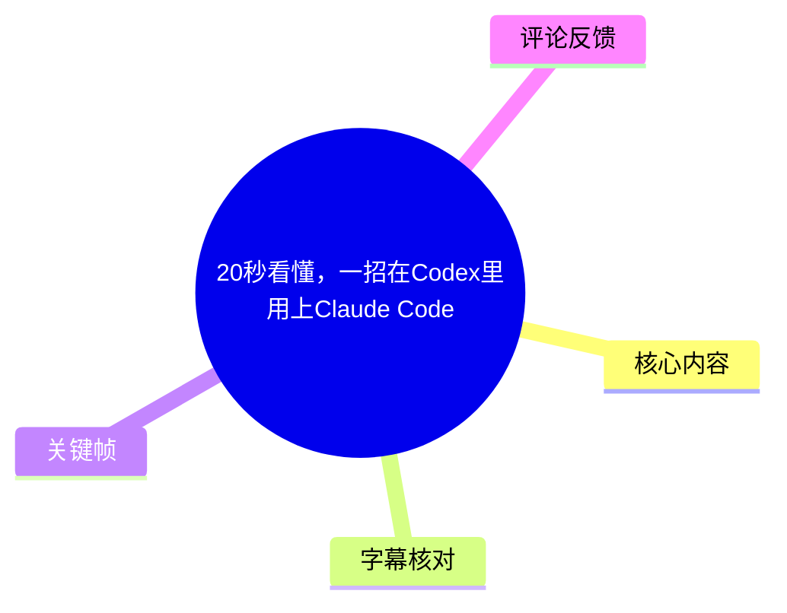
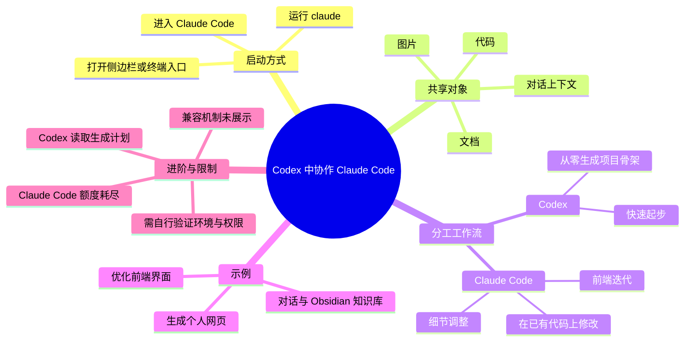
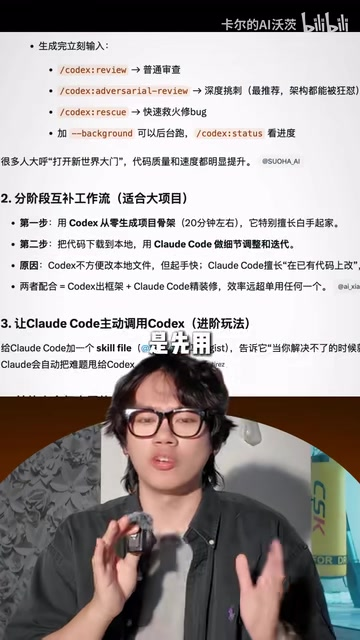
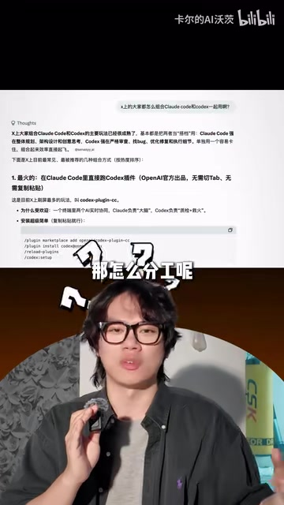

# 20秒看懂，一招在Codex里用上Claude Code

> 来源：[Bilibili 视频](https://www.bilibili.com/video/BV1LY7K6dEnd)<br>
> UP 主：卡尔的AI沃茨｜发布时间：2026-06-24｜视频时长：41 秒｜收藏数：2,061（抓取时）

## 小结

视频演示的是一种在 Codex 工作环境中启动 Claude Code 的协作方式：打开 Codex 的侧边栏／终端入口后，运行 `claude`，即可在同一项目上下文中使用 Claude Code。视频将其概括为“文档、图片、代码都是共享的”。

创作者给出的核心分工不是让两个工具做同一件事，而是采用“Codex 搭项目骨架、Claude Code 做细节调整与迭代”的串行工作流。示例中，Codex 先基于创作者与模型的既有对话及本地 Obsidian 知识库生成个人网页，再把数百行对话上下文交给 Claude Code 优化前端界面。

视频还提出可逆协作：当 Claude Code 的额度耗尽时，可转而让 Codex 读取 Claude Code 已生成的计划，再继续推进任务。这说明协作的关键载体是项目文件、素材、上下文或计划，而非必须固定由某一个 Agent 完成全部工作。

这是一条短视频，实际有声内容主要集中在 00:23.200—00:39.840；前段更多依赖画面文字和操作演示补充。视频没有展示完整安装过程、授权方式、环境依赖、实际命令输出或跨工具共享的底层机制，因此“可直接使用”的前提需要读者自行核验。

内容涉及 Codex、Claude Code、额度和本地知识库等会快速变化的产品能力；应将其视为视频发布时的工作流经验，而非长期不变的官方兼容性说明。

## 思维导图





## 目录

- [操作入口与视频主题](#操作入口与视频主题-0023)
- [协作分工：先搭骨架，再做迭代](#协作分工先搭骨架再做迭代-0023)
- [示例：个人网页生成与前端优化](#示例个人网页生成与前端优化-0025)
- [额度耗尽时的反向协作](#额度耗尽时的反向协作-0030)
- [可复用的实践步骤](#可复用的实践步骤)
- [关键参数、限制与时效性](#关键参数限制与时效性)
- [字幕比对](#字幕比对)
- [评论分析](#评论分析)
- [处理记录](#处理记录)

## 操作入口与视频主题 [00:23](https://www.bilibili.com/video/BV1LY7K6dEnd?t=23)

视频的标题是“20秒看懂，一招在Codex里用上Claude Code”，而成片总时长为 41 秒。画面先展示 Codex 界面中的“显示/隐藏侧边栏”控制，再展示终端中执行 Claude 的场景；随后以“Codex”“Claude code”对照形式说明：Claude Code 可以在 Codex 所处的项目工作环境中参与工作。


> 图：画面红框标出“显示/隐藏侧边栏”控件，并配有“在 Codex 上点开侧边栏”的画面文字。它用于校正 ASR 中误识别为“设备栏”的说法，说明操作入口应为侧边栏。


> 图：画面左侧为 Codex 对话界面，右侧为终端中输入 `claude` 后的 Claude Code 界面，且以醒目文字标示两者。这是理解“在 Codex 里用上 Claude Code”的最直接操作画面证据。

### 视频明确表达的共享范围

根据 ASR，创作者称“文档、图片、代码都是共享的”。这里应谨慎理解为：视频主张二者可以围绕同一项目材料协作，而非已证明两项产品在任意账户、任意目录、任意云端环境下都自动同步全部内容。

画面与字幕没有展示以下关键条件：

- Codex 与 Claude Code 的具体版本；
- Claude Code 的安装命令、登录与账户授权；
- 是否要求同一项目根目录、同一工作区或 Git 仓库；
- 文件共享是通过本地目录、Git、Agent 文件、上下文导入还是其他机制实现；
- Claude Code 是否能直接读取 Codex 的全部会话历史。

因此，`claude` 是视频中可见的核心命令，但并不足以单独构成可复现的完整配置教程。

## 协作分工：先搭骨架，再做迭代 [00:23](https://www.bilibili.com/video/BV1LY7K6dEnd?t=23)

创作者在后半段口述其常用工作流：先让 Codex 从零生成项目，再用 Claude Code 做细节调整和迭代。画面中引用的工作流材料进一步把它描述为“分阶段互补工作流”，适合较大的项目。



> 图：该画面列出“分阶段互补工作流（适合大项目）”：第一步由 Codex 从零生成项目骨架，第二步同步代码与素材后由 Claude Code 调整与迭代。它为口述内容提供了具体的分工结构。

### 角色划分

| 阶段 | 视频中的工具分工 | 视频给出的理由或结果 | 需要注意的边界 |
| --- | --- | --- | --- |
| 项目起步 | Codex 从零生成项目骨架 | 画面材料称其擅长“白手起家”、起步快 | “骨架”具体包含哪些目录、代码和测试，视频未展示 |
| 修改迭代 | Claude Code 做细节调整与迭代 | 画面材料称其擅长在已有代码上改 | 未展示 Claude Code 接收任务、修改文件和验证结果的完整过程 |
| 前端优化 | Claude Code 优化前端界面 | 创作者以个人网页为例说明 | 优化标准、改动内容及前后效果未给出 |
| 额度替代 | Claude Code 额度用尽时改由 Codex 接续 | Codex 读取 Claude Code 的生成计划 | 计划如何导出、保存、读取并执行，视频未演示 |

画面材料还给出一种评价：Codex“不方便改本地文件，但是手快”，Claude Code 擅长“在已有代码上改”。这属于视频引述/创作者经验，不应当作适用于所有版本与使用场景的客观结论。实际文件修改能力会受产品版本、CLI 权限、工作目录、沙箱策略和用户授权影响。

## 示例：个人网页生成与前端优化 [00:25](https://www.bilibili.com/video/BV1LY7K6dEnd?t=25)

创作者举了一个连续协作案例：

1. 让 Codex 根据自己与模型的平时对话，以及本地 Obsidian 知识库，制作一个个人网页。
2. 将数百行对话上下文同步给 Claude Code。
3. 由 Claude Code 优化前端界面。

该案例的价值在于展示了“生成”和“迭代”之间的交接：第一阶段不仅交付代码，也可能交付用于理解项目与用户偏好的上下文材料；第二阶段据此做界面优化。

### 示例中可确认与不可确认的信息

**可由 ASR 确认的内容：**

- 输入材料涉及创作者与模型的平时对话；
- 输入材料涉及创作者本地的 Obsidian 知识库；
- 产物是一个个人网页；
- 交接给 Claude Code 的内容包含“几百行的对话上下文”；
- 后续任务是优化前端界面。

**视频未展示、因此不能补充推断的内容：**

- Obsidian 知识库以何种格式被读取，例如 Markdown、插件接口或本地文件扫描；
- 对话上下文通过复制粘贴、文件、项目文档还是其他方式同步；
- 个人网页的技术栈、项目规模、生成耗时和最终可运行状态；
- Claude Code 实际修改了哪些组件、CSS、交互或视觉资源；
- 是否执行了测试、构建或人工验收。



> 图：画面展示关于 Codex 与 Claude Code 协作的文字材料，并出现“那怎么分工呢”的提问。它说明视频的重点不仅是启动 Claude Code，更是两个 Agent 在同一项目中的任务分配。

## 额度耗尽时的反向协作 [00:30](https://www.bilibili.com/video/BV1LY7K6dEnd?t=30)

视频最后提出进阶玩法：如果 Claude Code 的额度用完，可以反过来让 Codex 读取 Claude Code 的生成计划。这种思路可概括为“保留中间产物，使任务可切换执行者”。

### 可迁移的经验

当多个 Agent 协作时，应把下面内容沉淀为可读文件或明确的任务说明，而不是只留在某个聊天窗口中：

- 当前目标与验收标准；
- 已完成的改动；
- 待办事项及优先级；
- 项目结构和关键文件位置；
- 已知问题、报错与未验证假设；
- 下一步计划及执行顺序。

这样即使因为额度、会话中断或工具可用性变化而切换 Agent，后续工具仍可基于计划继续工作。

### 关于“Image2”的说明

创作者在结尾称视频中的配图由“Image2”制作。该名称为 ASR 转写，画面未提供足以确认其具体产品名称、版本或生成参数的证据。因此只能记录为创作者的口述，不宜将其扩展解释为某一确定图像模型或工具。

## 可复用的实践步骤

以下步骤严格基于视频的演示顺序与画面信息整理；其中未展示的部分标为“需自行确认”。

1. **在 Codex 中进入侧边栏／终端入口。**  
   画面标出了“显示/隐藏侧边栏”，并展示终端操作。不同 Codex 客户端的入口名称和位置可能不同。

2. **在终端中运行 Claude 命令。**

   ```bash
   claude
   ```

   视频画面显示的命令为 `claude`。运行它之前，需自行确认本机已安装并可调用 Claude Code CLI，且已完成其所需的登录、授权与环境配置。

3. **确保两个 Agent 围绕同一项目材料工作。**  
   视频将文档、图片、代码称为“共享”。实际执行时，建议将项目代码、需求说明、素材清单和计划文档放在可被当前工具访问的位置。

4. **先让 Codex 完成从零到一的起步。**  
   视频的示例是由 Codex 基于对话和本地 Obsidian 知识库创建个人网页；在其他项目中，可对应为创建初始目录、页面结构、基础功能或原型。

5. **将必要上下文交给 Claude Code。**  
   视频提到同步“几百行的对话上下文”。实践中应优先交接经过整理的需求、现状、约束、关键文件和待改内容，避免仅交接冗长且无结构的聊天记录。

6. **让 Claude Code 聚焦细节调整和迭代。**  
   视频示例为优化前端界面。为提高可验证性，应额外明确预期效果、目标文件、设计约束和验收方式；这些细节并未在视频中提供。

7. **遇到额度限制时保留计划并切换执行者。**  
   若 Claude Code 不可继续使用，按视频建议将其生成计划交给 Codex 读取和执行。前提是计划已显式保存，且 Codex 对相关项目文件具有访问权限。

## 关键参数、限制与时效性

### 视频出现的参数与量化信息

| 项目 | 数值或内容 | 来源与含义 |
| --- | --- | --- |
| 视频时长 | 41 秒 | 视频元数据 |
| ASR 有声覆盖 | 15.02 秒，占约 36.96% | ASR 诊断；语音主要集中在后段 |
| 首段识别语音 | 00:23.200 | ASR 时间戳 |
| 末段识别语音 | 00:39.840 | ASR 时间戳 |
| 上下文规模 | “几百行” | 创作者口述，未给出精确行数 |
| 画面材料中的项目骨架耗时 | “20分钟左右” | 画面引用材料的说法，不是本视频实测数据 |
| 可见命令 | `claude` | 关键帧中的终端画面 |

### 主要限制

- **教程不完整：**视频没有给出 Claude Code 的安装、版本、鉴权、订阅/额度要求和报错处理。
- **共享机制不明：**“文档、图片、代码共享”没有展示其技术实现，不能据此推断自动同步或跨平台互通。
- **效果未验证：**未展示网页生成结果、前端优化前后对比、代码 diff、测试结果或性能数据。
- **经验具有主观性：**“Codex 快”“Claude Code 更适合已有代码”等判断来自视频材料，不等于普适基准测试。
- **上下文存在成本：**同步数百行对话可能带来 token、额度、隐私和噪声问题；视频没有讨论筛选或脱敏策略。
- **命名存在歧义：**ASR 的“Cloud/Cloud Code”应由画面校正为 `Claude/Claude Code`；“Image2”未能确认具体工具。

### 时效性

视频发布时间为 2026-06-24。Codex、Claude Code 的 CLI 命令、工作区能力、订阅额度、模型策略和文件权限机制都可能在之后更新。复现前应优先查看相关产品的当前官方文档，并在非关键项目或独立分支中验证文件改动范围。

## 字幕比对

| 字幕来源 | 完整性 | 专有名词 | 时间轴 | 主要问题 |
| --- | --- | --- | --- | --- |
| Bilibili 站内字幕 | 未提供可用字幕，无法比对文本内容 | 无法评价 | 无可用时间轴 | 素材明确标注“未提供可用站内字幕” |
| 本次 ASR 字幕 | 识别到 3 段语音，共 15.02 秒；未覆盖前段主要画面信息 | 多处误识别 | 有可直接使用的 SRT 时间轴：23.200—25.660、25.660—28.360、29.980—39.840 | 长句未断句；“侧边栏/终端/Claude”等被识别错误；“Image2”无法确证 |

本次 ASR 已检查。ASR 诊断未标记 `noAudioStream=true`：源视频存在音轨，识别语言为中文，置信度为 0.9990；但语音覆盖仅约 36.96%，因此不能把未识别的前段内容视为无信息。

最终采用策略为：**以 ASR 的真实时间戳作为章节定位依据，以关键帧画面校正明显术语，并对画面无法确认的细节保留不确定性。**

重要校正如下：

| ASR 原文或近似转写 | 采用表述 | 校正依据 |
| --- | --- | --- |
| “设备栏” | “侧边栏” | `frame-001.jpg` 中可见“显示/隐藏侧边栏”，画面字幕也写“点开侧边栏” |
| “端输入Cloud” | “在终端中输入 `claude`” | `frame-002.jpg` 可见终端与 `claude` 命令 |
| “Cloud Code” | “Claude Code” | 视频标题、标签 `claudecode` 及画面文字一致 |
| “Code X” | “Codex” | 视频标题、画面标签及元数据一致 |
| “知识户” | “知识库” | 语义与创作者口述的本地 Obsidian 内容相符 |
| “Image2” | 保留为“Image2” | 仅有 ASR 口述，缺少可确认具体产品的画面或字幕证据 |

## 评论分析

以下仅分析可获取热评前三条。评论反映用户经验或感受，不构成对视频方案的独立验证。

1. **聪敏de埃丝特酱（94 赞）**  
   评论提出另一种分工：用 Claude CLI 做计划和起手，产出 `agents read` 或 Git 本地内容，再让 Codex App 读取并执行。  
   - **补充价值：**与视频“Codex 起步、Claude Code 迭代”的方向不同，展示了计划与执行角色可以互换。  
   - **可信度边界：**评论未说明 `agents read` 的准确名称、具体文件格式、版本条件或复现结果，不能直接作为操作命令使用。

2. **乀往昔丶（7 赞）**  
   评论称“最烦的是 tun 模式延迟有点高”。  
   - **补充价值：**提示实际使用中的响应延迟可能影响工作流体验。  
   - **可信度边界：**“tun 模式”所指工具、网络环境、地区、时间段和延迟指标均未说明，无法据此判断是普遍问题还是个例。

3. **Miaonster（6 赞）**  
   评论以“难道他真的是天才”表达对该技巧的调侃式赞赏。  
   - **补充价值：**说明部分观众认为这种组合方式有启发性。  
   - **可信度边界：**没有提供可验证的技术细节、反例或使用反馈，属于情绪表达。

## 处理记录

- Worker ID：worker-mrj0wjed-b0c290ad
- 模型：gpt-5.6-terra
- 可用素材与工具产物：视频元数据、12 张关键帧、ASR 诊断、ASR SRT、热评 JSON；未提供可用站内字幕。
- 字幕选择：检查后确认站内字幕缺失；采用本次 ASR 的 3 段 SRT 时间戳作为所有时间轴链接依据，并使用关键帧校正术语。
- ASR 状态：存在音轨，未出现 `noAudioStream=true`；ASR 语言为中文，语音覆盖 15.02 秒。
- 关键帧选择依据：`frame-001.jpg` 用于确认侧边栏入口；`frame-002.jpg` 用于确认终端中的 `claude` 与 Claude Code；`frame-003.jpg` 用于说明视频讨论分工；`frame-004.jpg` 用于提取画面展示的分阶段协作结构。其余帧未在素材说明中提供额外可核验信息，未强行引用。
- 评论范围：仅处理接口可获取的热评前三条，按点赞与提供顺序记录；未扩展至其他评论。
- 缓存清理：本任务仅基于已提供的素材清单进行整理，未产生可报告的额外下载缓存；未提供缓存清理执行日志。
- 未解决问题：Claude Code 的安装与授权方法、Codex 的具体产品形态、共享机制、额度规则、“Image2”具体指代、网页优化效果和画面材料出处均未由现有素材完整证实。
