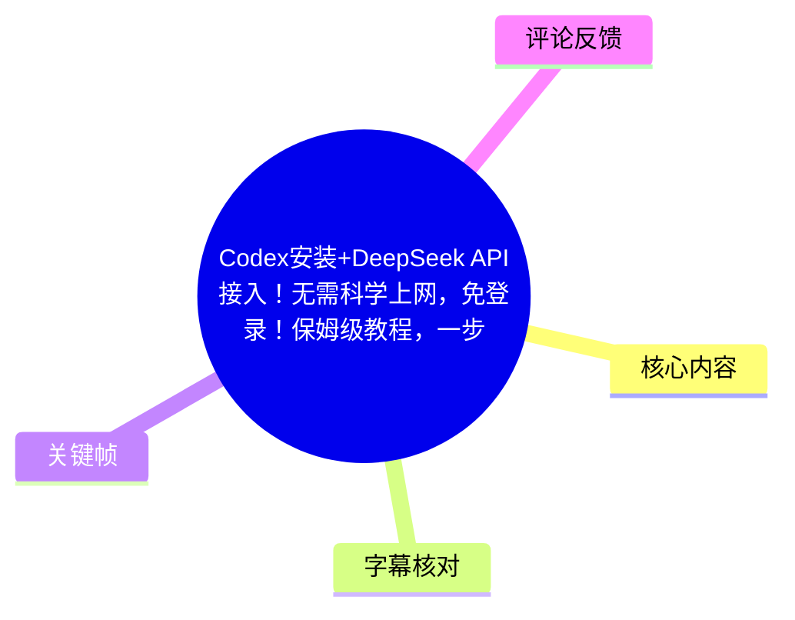
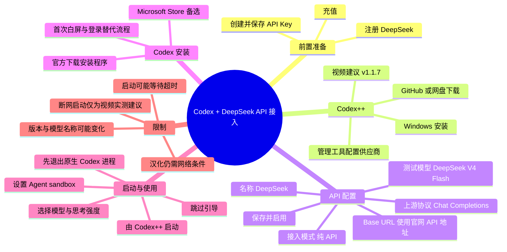
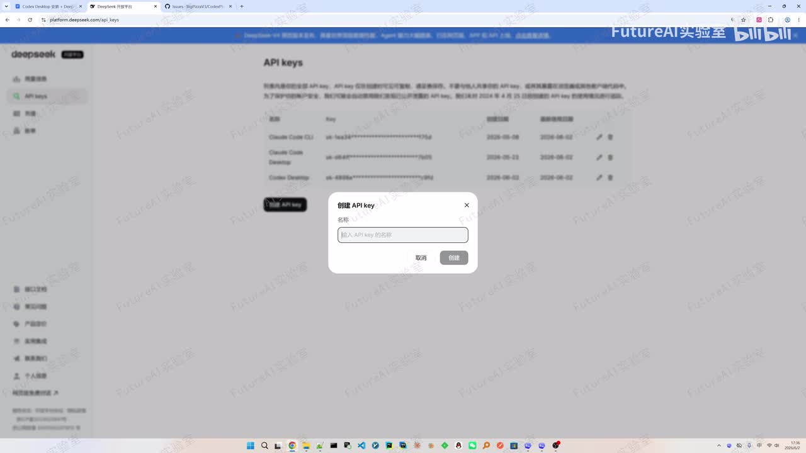
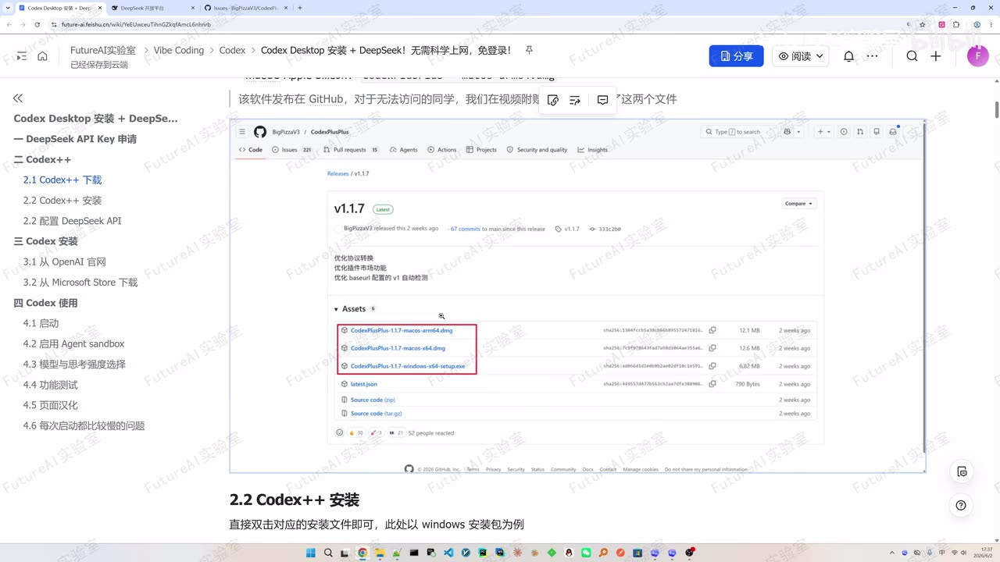
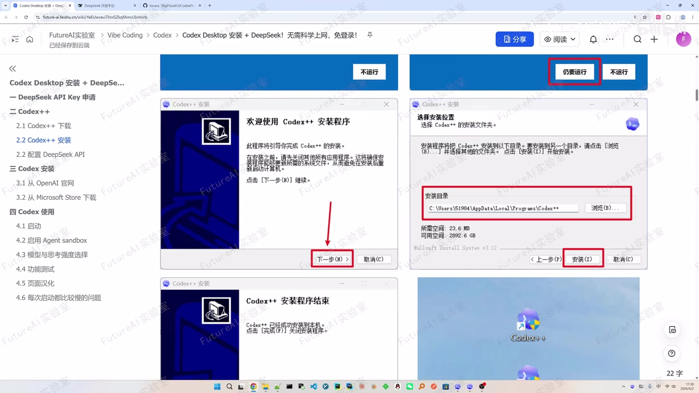
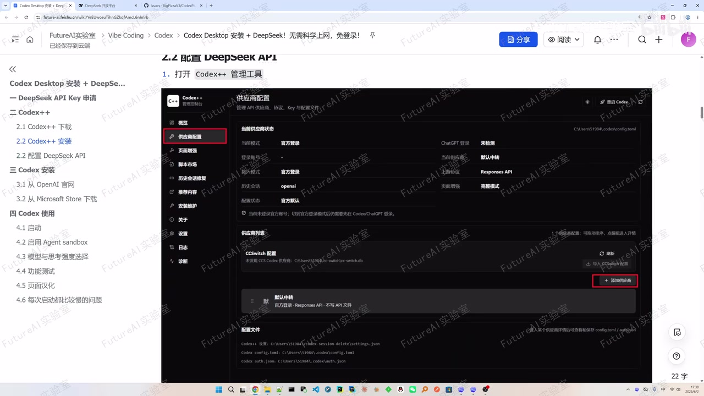

# Codex 安装与 DeepSeek API 接入：视频知识整理

> 来源：[Bilibili 视频](https://www.bilibili.com/video/BV1ZiVB6uEyW)  
> UP 主：FutureAI实验室｜视频时长：10 分 51 秒｜分辨率：3840×2160  
> 视频说明：UP 主称配套文档与软件可在评论区获取；本整理只记录素材中实际出现的操作与说法。

## 小结

视频演示了一条通过 **Codex++** 为 Codex 桌面端接入 DeepSeek API 的流程：先在 DeepSeek 平台创建 API Key，再安装 Codex++、配置第三方供应商，随后安装 Codex 桌面端并通过 Codex++ 启动。

其关键思路是：Codex++ 被视频称为 Codex 的“外部增强工具”，负责供应商配置和启动增强；在其管理工具中新增 DeepSeek 供应商，设置纯 API 接入、测试模型、Base URL、API Key 与 `Chat Completions` 上游协议后启用。视频建议使用 Codex++ `v1.1.7`，但这是发布者的当时建议，不应视为长期固定版本要求。

视频声称在使用与跳过初始流程时“不需要科学上网”，但同时明确指出：Codex 启动时仍可能尝试连接 OpenAI 服务器，从而在网络受限环境出现白屏、加载或超时；语言切换/汉化则被视频明确标为**仍需要可访问相关网络**，且视频未找到无需科学上网的替代方案。因此，“无需科学上网”并非覆盖全部场景。

面向 Windows 的安装细节包括：运行 Codex++ 的 `setup.exe`，在系统风险提示中选择“更多信息”后继续运行；安装 Codex 时可以从官方渠道下载安装程序，也可经 Microsoft Store 安装。首次安装可能出现白屏、登录替代页或后续引导，视频给出跳过与重启等应对方式。

视频内实测结论是：成功配置后，Codex 对话页应显示 DeepSeek，默认显示为视频所称的 `DeepSeek V4 Flash`，并可选择 Pro；简单对话和让应用在桌面创建文件的功能均被演示者称为可用。由于服务端模型名、Codex++ 界面与 API 兼容性会随版本变化，实际应以当前软件与 DeepSeek 官方文档为准。

## 思维导图

## 目录

- [目标、前置条件与 API Key 申请](#目标前置条件与-api-key-申请)
- [下载并安装 Codex++](#下载并安装-codex)
- [配置 DeepSeek API 供应商](#配置-deepseek-api-供应商)
- [安装 Codex 桌面端](#安装-codex-桌面端)
- [通过 Codex++ 启动及处理加载问题](#通过-codex-启动及处理加载问题)
- [首次使用、模型选择与功能测试](#首次使用模型选择与功能测试)
- [语言切换、限制与时效性](#语言切换限制与时效性)
- [字幕比对](#字幕比对)
- [评论分析](#评论分析)
- [处理记录](#处理记录)

## 目标、前置条件与 API Key 申请 [00:00:00](https://www.bilibili.com/video/BV1ZiVB6uEyW?t=0)

视频开场说明主题是安装 Codex 桌面版并接入 DeepSeek API。站内字幕从 `00:00:00` 开始；本次 ASR 首个语音段却从 `00:00:29.080` 开始，且把开场与后续内容异常拼接，因此本节时间轴和具体内容优先采用站内字幕。

视频所述的第一步是到 DeepSeek 官网：

1. 注册账号；
2. 完成视频所称的相关充值；
3. 进入 API Key 页面创建 Key；
4. API Key 名称可自行填写，示例为 `codex`；
5. 创建完成后立即复制保存该 Key，后续供应商配置要使用。

API Key 属于敏感凭据。视频只说明“复制下来”，未展开安全管理；实际操作时不应把 Key 贴入公开聊天、截图、代码仓库或共享文档。

> 图：画面展示 DeepSeek API Keys 页面及“创建 API key”弹窗，直观确认本步骤是在服务商控制台创建密钥，而不是在 Codex 内创建。该帧也显示已有密钥列表，因此更应避免泄露或复用截图中的任何真实 Key。

## 下载并安装 Codex++ [00:00:37](https://www.bilibili.com/video/BV1ZiVB6uEyW?t=37)

### 下载来源与版本建议 [00:00:59](https://www.bilibili.com/video/BV1ZiVB6uEyW?t=59)

视频将 Codex++ 描述为 Codex 的外部增强工具，并称借助它可以更方便地在国内使用 Codex。其下载信息如下：

- 软件发布在 GitHub 仓库；
- 仓库提供 Windows 与 macOS 版本；
- 应按操作系统选择对应安装包；
- 视频建议使用 `v1.1.7`；
- 若 GitHub 访问有困难，UP 主称视频附带资料提供了相关文件，可从网盘获取。

画面中配套文档的发布页列出 macOS ARM、macOS x64 与 Windows x64 的安装包，印证视频确实在讲多平台发行包；但视频实际安装演示以 Windows 为例。

> 图：关键帧显示配套文档中的 GitHub Releases 截图、`v1.1.7` 版本号以及被框选的 macOS/Windows 安装包。这是“版本建议”和“按系统下载”的画面依据；不代表该版本在当前仍是最新版本。

### Windows 安装步骤 [00:01:47](https://www.bilibili.com/video/BV1ZiVB6uEyW?t=107)

视频以 Windows 安装包为例，顺序为：

1. 双击下载到的 `setup.exe`。
2. 若 Windows 出现风险提示，选择“更多信息”。
3. 点击“仍要运行”继续。
4. 在安装向导中选择安装位置。
5. 点击安装，等待完成。
6. 安装后桌面会出现两个入口：
   - **Codex++**：用于启动 Codex，并进行视频所称的增强；
   - **Codex++ 管理工具**：用于供应商/API 等配置。

系统风险提示仅说明 Windows 对该安装程序有安全警示或来源校验限制，不等同于程序必然安全。视频没有提供校验和、签名验证或源码审计步骤；应从可信来源下载，并自行核验发布者与文件来源。

> 图：该帧把“仍要运行”、安装目录、安装按钮和安装完成后的桌面图标置于同一组操作说明中，适合用于核对 Windows 安装流程。图中路径仅是演示环境示例，不应机械照抄。

## 配置 DeepSeek API 供应商 [00:02:29](https://www.bilibili.com/video/BV1ZiVB6uEyW?t=149)

### 进入供应商配置 [00:02:55](https://www.bilibili.com/video/BV1ZiVB6uEyW?t=175)

先打开 Codex++ 应用本体；视频表示主题切换不影响本教程。随后打开 **Codex++ 管理工具**，按以下路径进入：

1. 点击左侧的“供应商配置”；
2. 点击“添加供应商”；
3. 在新增供应商页面填写接入信息。

> 图：画面清楚框选“供应商配置”菜单与“添加供应商”按钮，是理解此处配置入口最直接的依据。页面同时展示配置文件路径等信息，但视频未要求手动编辑这些文件。

### 视频给出的填写项 [00:03:19](https://www.bilibili.com/video/BV1ZiVB6uEyW?t=199)

视频口述的配置字段可整理如下。字段标签和专有名词经站内字幕、ASR 上下文以及画面文档交叉校正；其中具体接口地址没有在所给文字素材中完整显示，故不补写未出现的 URL。

| 配置项 | 视频所述填写方式 | 说明 |
| --- | --- | --- |
| 名称 | `DeepSeek` | 仅作为供应商显示名称。 |
| 接入模式 | 纯 API | 站内字幕明确为“纯API”；ASR 将其误识别为“成API”。 |
| 测试模型 | 视频称 `DeepSeek V4 Flash` | ASR 同样近似识别为该名称，但拼写不稳定；应以当前 Codex++ 可识别模型和 DeepSeek 文档为准。 |
| Base URL | DeepSeek 官网的 Base URL API | 视频未在可用字幕中给出可逐字核对的 URL，不在本文臆造。 |
| Key | 第一阶段创建的 API Key | 需粘贴到 Key 字段，注意保密。 |
| 上游协议 | `Chat Completions` | 站内字幕如此标注；ASR 误识别为“ChestCompletion”。 |

填写完成后，点击“保存”，再“返回列表”。如果是首次配置，供应商回到列表后可能未启用；点击“使用”，状态会变为“使用中”，右上角也会出现“使用中”提示。视频将此状态视为配置完成的标志。

### 关键经验与排查 [00:04:07](https://www.bilibili.com/video/BV1ZiVB6uEyW?t=247)

- **保存不等于启用**：首次配置后，应检查是否已点击“使用”并变为“使用中”。
- **模型不显示时先检查供应商状态**：视频后续建议彻底退出后重新由 Codex++ 启动；热评还补充新版可能需要在左侧“设置”修改配置，详见评论分析。该补充未经视频正文验证。
- **不要依赖错误转写的英文词**：本次 ASR 对 `API`、`Base URL`、`Chat Completions`、`DeepSeek` 等字段均有明显误识别，配置应以界面实际字段和官方 API 文档为准。

## 安装 Codex 桌面端 [00:04:36](https://www.bilibili.com/video/BV1ZiVB6uEyW?t=276)

### 两种安装来源 [00:04:36](https://www.bilibili.com/video/BV1ZiVB6uEyW?t=276)

视频列出两种 Codex 安装方法：

1. **通过 OpenAI 官方页面下载**  
   对 Windows，下载到的是 `.exe` 安装程序。双击后会出现下载框，视频解释这是安装引导程序，仍需下载其他资源。
2. **通过 Microsoft Store 安装**  
   在 Windows 中搜索 Microsoft/Windows Store，再搜索 Codex 并点击安装。视频没有详细演示，只称整体流程可能与前者相近。

视频称第一种下载方式可直接访问、不需要科学上网，但也在后文说明启动及语言切换仍可能涉及受限网络请求。因此应将这一表述限定为**视频录制时对下载入口的经验**，不能推导为所有资源下载、登录、启动和更新均完全不受网络条件影响。

### 首次安装可能出现的页面 [00:05:00](https://www.bilibili.com/video/BV1ZiVB6uEyW?t=300)

视频描述的首次安装现象与处理方式：

- 安装结束后可能先出现白屏；
- 视频推测原因是应用尝试连接 OpenAI 官网，等待超时后会继续；
- 视频称首次安装未出现某个替代登录页面，但卸载重装等再次安装时“可能”出现；
- 若出现该页面，选择 **`Sign in another way`**；
- 接下来的 API Key 输入框可“随便输入一个”，再点 **`Continue`**；
- 视频实测等待约一分钟以内，应用会进入下一个页面；
- 出现该页面后直接关闭，并退出右下角 Codex 托盘图标。

这里的“随便输入一个 Key”是视频针对其特定绕过流程的经验，并不等于任何版本的 Codex 都接受虚假密钥，更不意味着应在真实 API 配置中填写无效凭据。真正调用 DeepSeek 所需的 Key 仍在 Codex++ 供应商配置中填写。

## 通过 Codex++ 启动及处理加载问题 [00:06:37](https://www.bilibili.com/video/BV1ZiVB6uEyW?t=397)

### 正确启动入口 [00:06:37](https://www.bilibili.com/video/BV1ZiVB6uEyW?t=397)

视频强调，不要直接按常规方式启动原生 Codex，而要使用 Codex++ 启动。可选方式：

- 双击安装后桌面的 **Codex++** 图标；
- 在开始菜单找到 **Codex++**（注意是带 `++` 的应用，不是原生 Codex）；
- 在 Codex++ 管理工具中使用“重启 Codex”等入口。

启动前的前提条件是：退出所有 Codex 应用窗口，并在任务管理器中结束残留的 Codex 相关进程，然后再启动 Codex++。

### 加载时间、原因与应对 [00:07:26](https://www.bilibili.com/video/BV1ZiVB6uEyW?t=446)

视频说明，未使用科学上网时，启动后可能停留在加载页，演示者估计一般在 **两分钟以内**。其给出的解释是：

- Codex 启动时会尝试连接 OpenAI 服务器；
- 网络受限时，部分域名请求被阻断；
- 请求反复等待并最终超时；
- 多次重试失败后才进入下一页面。

视频给出两种处理方向：

1. 使用科学上网；
2. 启动时断开网络。视频称其测试后“可能有用”；长时间无响应时，可断网后重新打开。

这不是经过通用验证的故障排除标准，只是视频作者的实测经验。断网启动可能影响安装、更新、认证、同步或其他功能，应根据实际软件版本和网络环境谨慎尝试。

### 跳过引导与白屏 [00:08:21](https://www.bilibili.com/video/BV1ZiVB6uEyW?t=501)

加载后，视频称会自动跳转到一个可点击 **`Skip`** 的页面：

1. 点击 `Skip`；
2. 若页面卡住或没有变化，退出 Codex 后重进，或多尝试几次；
3. 点击后还可能再次白屏，视频认为原因和此前联网等待相近；
4. 等待后应能进入 Codex 主界面。

视频称该过程最终可以在不科学上网的条件下完成，但这应理解为其录制环境下的结果，而不是兼容性承诺。

## 首次使用、模型选择与功能测试 [00:08:58](https://www.bilibili.com/video/BV1ZiVB6uEyW?t=538)

### 创建 Agent sandbox [00:08:58](https://www.bilibili.com/video/BV1ZiVB6uEyW?t=538)

首次进入 Codex 后，视频称界面可能提示设置 **Agent sandbox**（ASR 错识别为 `Admin Sandbox`）。操作是：

1. 点击 `Setup`；
2. 等待“创建中”；
3. 显示创建成功后即可。

视频明确表示该步骤不需要网络。其素材没有解释 sandbox 的目录位置、权限范围、隔离能力或失败处理，实际授予 Codex 文件与命令权限时，仍应确认软件界面的权限提示与本地安全策略。

### 模型与思考强度 [00:09:22](https://www.bilibili.com/video/BV1ZiVB6uEyW?t=562)

在 Codex 对话界面中，视频指出有两类选择：

- **思考/推理强度**选项；
- **模型**选择项。

若 DeepSeek 供应商已配置成功，视频称模型栏会显示 DeepSeek，默认是视频称为 `DeepSeek V4 Flash` 的模型，也可选择 Pro。若没有显示：

1. 完全退出应用；
2. 再通过 Codex++ 启动；
3. 重新检查。

这里的“默认模型”“Pro”均是录制时界面的说法。模型提供情况、名称、计费和可用性取决于当时的 Codex++ 版本、DeepSeek 账户权益、API 配额及服务端兼容状态。

### 视频中的功能测试 [00:09:51](https://www.bilibili.com/video/BV1ZiVB6uEyW?t=591)

演示者表示已测试：

- 简单对话；
- 要求应用在桌面创建文件。

其结论是以上功能“都可以”。这代表视频作者在其设备环境中的测试结果；视频未提供具体提示词、生成文件内容、权限授权过程、响应耗时、Token 消耗、错误日志或可复现实验数据，不能据此推断所有机器均可无差别运行。

## 语言切换、限制与时效性 [00:10:16](https://www.bilibili.com/video/BV1ZiVB6uEyW?t=616)

### 汉化路径与网络条件 [00:10:16](https://www.bilibili.com/video/BV1ZiVB6uEyW?t=616)

视频称当时没有找到不需要科学上网的汉化方案。需要满足可访问网络条件后：

1. 进入视频口述为“File Settings”的设置入口；
2. 进入 `General`；
3. 在 `Language` 相关位置切换为中文或其他语言；
4. 点击重启。

站内字幕明确此操作“需要可以上网，否则不会生效”。因此，视频标题中的“无需科学上网”至少不适用于语言包下载/语言切换这一环节。

### 限制、风险与时效性

- **版本时效性**：视频推荐 Codex++ `v1.1.7`，评论则讨论“最新版”界面变化。软件版本、菜单名称、配置字段和模型列表很可能变化。
- **模型名称不确定性**：站内字幕把测试模型写作“deep sick v4flash”，ASR 写作“DeepSeq with Flash”等。本文使用视频意图最接近的 `DeepSeek V4 Flash` 进行转述，但不确认它是当前官方准确模型标识。
- **Base URL 未完整呈现**：素材只说明使用 DeepSeek 官网 API 的 Base URL，未给出可核对完整地址；本文不补造 URL。
- **网络限制并未完全消失**：视频自身已列出启动超时、白屏和语言切换需网络等例外。
- **安全与成本**：视频提到充值和 API Key，却没有交代价格、余额阈值、速率限制、数据处理条款或密钥轮换。使用前应自行核对服务商的实时计费、隐私与权限规则。
- **第三方工具风险**：Codex++ 是视频使用的外部增强工具。视频未给出软件签名、开源审计、许可证或供应链安全信息；安装前应核验项目来源和文件完整性。
- **发布信息异常提示**：所提供元数据的 `pubdate` 与抓取时间存在未来时间戳语境，无法据此可靠换算并确认自然语言发布日期；故本文不将其作为已核实的发布时间。

## 字幕比对

| 字幕来源 | 完整性 | 专有名词 | 时间轴 | 主要问题 |
| --- | --- | --- | --- | --- |
| Bilibili 站内字幕 | 覆盖 `00:00:00—00:10:48`，与视频全长基本对应 | 多处英文/产品名有音译或错拼，如 `deep sick`、`cortex`、`Chat competition` | 分段细，起止时间可直接使用 | 个别词语与界面英文不一致，开场后存在短暂停顿 |
| 本次 ASR（medium） | 诊断显示语音覆盖约 598.69 秒、覆盖率 0.921；首段在 `00:00:29.080` | 专有名词错误更明显，如 `IPR`、`OpenR`、`DipStick`、`Scape`、`Admin Sandbox` | 有时间戳，但首个长段异常压缩并遗漏前 29 秒 | 多段文本过长，语义拼接严重，英文技术词误识别率较高 |

### 最终字幕选择

本视频**存在音轨**：ASR 诊断提供了中文识别结果、时长与分段，且没有 `noAudioStream=true` 标记。因此不属于“源视频没有音轨”的情况。

正文时间轴优先采用站内 SRT 的真实分段时间；叙事内容以站内字幕为主，并对照本次 ASR 做检查。以下术语依据站内字幕、ASR 上下文和提供的关键帧画面进行校正：

- `codex/cortex/Code X` → **Codex**
- `Codex++/cortex++/CodeX加价` → **Codex++**
- `deep sick/deepseq/DipStick` → **DeepSeek**
- `IPR/epr` → **API**
- `APRK/API-K` → **API Key**
- `Bath UIL` → **Base URL**
- `ChestCompletion/Chat competition` → **Chat Completions**
- `Scape` → **Skip**
- `Admin Sandbox` → **Agent sandbox**
- `OpenR/OpenRTX/Open UA` → 依据站内字幕语义统一表述为 **OpenAI**，但素材未给出服务器域名。

## 评论分析

仅处理到可获取热评中的前两条；素材虽请求 `limit: 3`，但实际返回 2 条，故不存在可分析的第三条。

1. **无赏烟火（88 赞）**  
   - 观点：新版 Codex++ 配置时有“更多选项”，其中测试模型填写 `deepseek-v4-flash` 即可。  
   - 价值：补充了视频版本之外的界面变化线索，尤其可能帮助遇到模型测试字段位置变化的用户。  
   - 可信度与边界：这是用户经验，未附截图、版本号或官方文档链接；且模型字符串与视频口述的 `DeepSeek V4 Flash` 存在连字符和大小写差异，不能直接当成通用、已验证配置。

2. **真真不振振（80 赞）**  
   - 观点：下载新版 Codex++ 后，还需要在左侧“设置”修改配置，否则 Codex 不会显示 DeepSeek。  
   - 价值：为“供应商已添加但模型未显示”的问题提供了一个排查方向。  
   - 可信度与边界：评论没有给出具体设置名称、截图或复现条件。它与视频“完全退出后通过 Codex++ 重启”的排查建议可互补，但不应替代查看当前版本的配置说明。

## 处理记录

- **Worker ID**：`worker-mrj0wjed-b0c290ad`
- **模型**：`gpt-5.6-terra`
- **ASR 模型与参数**：`medium`，语言 `zh`，CUDA，`float16`；识别语言概率 `0.99853515625`。
- **使用素材/工具结果**：Bilibili 元数据、站内字幕 `p01-ai-zh.srt`、本次 ASR 结果 `asr-result.json` 与 `transcript.srt`、关键帧列表、热评数据。
- **字幕选择**：站内字幕为主，用于章节时间轴；已检查本次 ASR，并以其作交叉验证与错误识别诊断。源视频有音轨，未触发 `noAudioStream=true` 情况。
- **关键帧选择依据**：
  - `frames/frame-001.jpg`：展示 DeepSeek 创建 API Key；
  - `frames/frame-002.jpg`：展示 Codex++ `v1.1.7` 发布包与平台选择；
  - `frames/frame-003.jpg`：展示 Windows 安装、风险提示与安装目录；
  - `frames/frame-004.jpg`：展示供应商配置与添加供应商入口。
- **缓存清理**：提供的素材未包含缓存清理执行日志；无法确认或声称已执行缓存清理。
- **未解决问题**：
  - 视频未在文字素材中给出完整 Base URL；
  - `DeepSeek V4 Flash` 的当前官方精确模型 ID 未由素材验证；
  - Codex++ 的当前维护状态、签名、许可证与版本兼容性未验证；
  - 热评仅返回 2 条，无法分析第三条。
