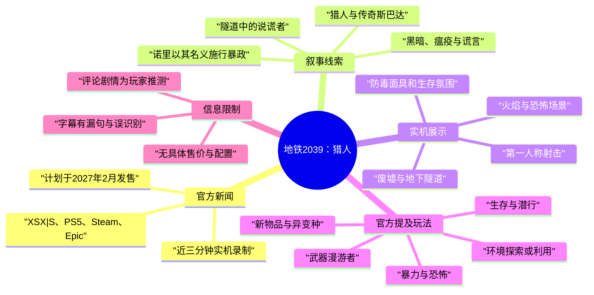
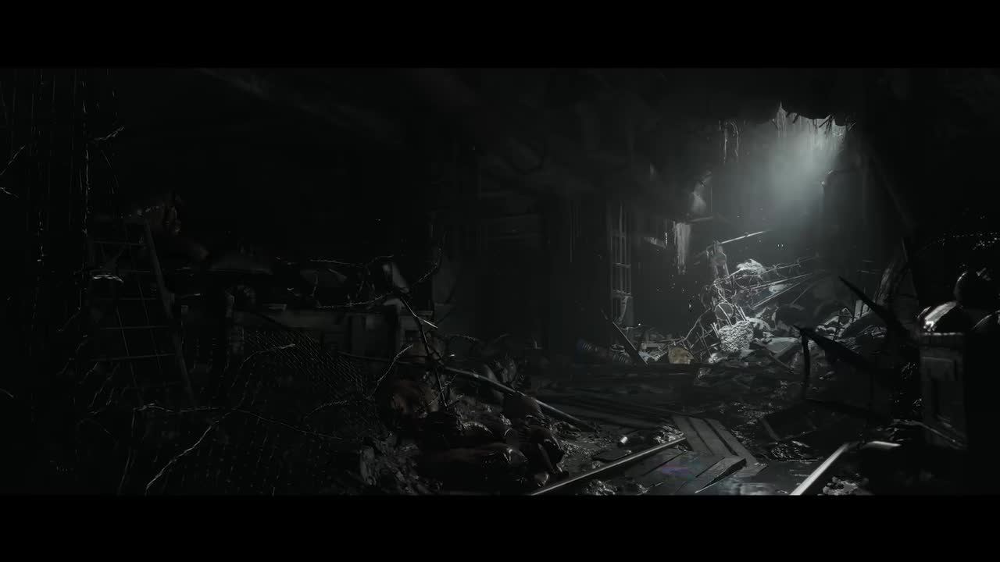
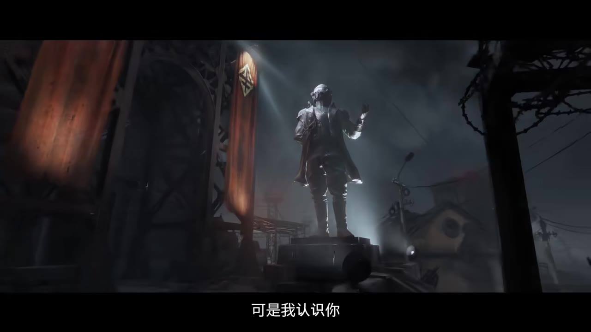
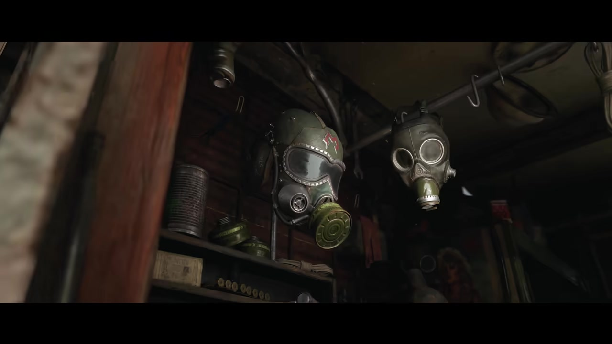
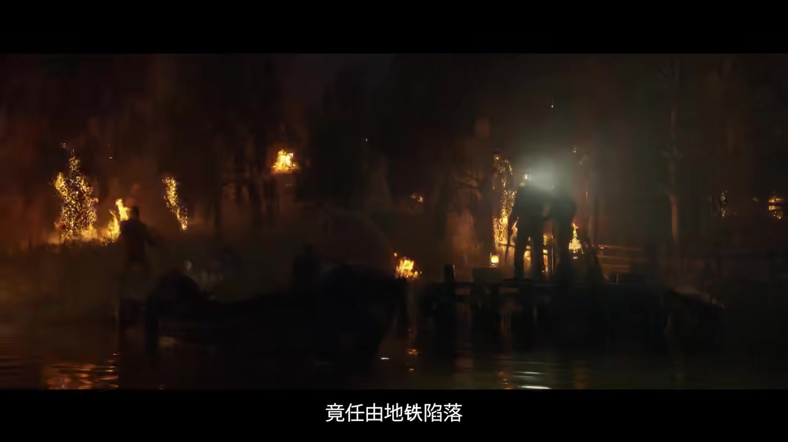

# 《地铁2039》实机演示首曝 | 猎人》

> 来源：[Bilibili 视频](https://www.bilibili.com/video/BV15pEK64EHX) 
> UP 主：地铁2039｜视频时长：02:42｜分辨率：1920×1080｜发布信息：2026-06-08

## 小结

这是一支以“猎人”（Hunter）为核心的《地铁2039》实机展示预告。视频通过旁白、环境镜头和战斗片段，塑造出一名曾被称为传奇斯巴达、如今却被谎言和黑暗吞噬的人物；叙事重点是其身份、过去的信念与当前暴政之间的冲突。

最重要的官方新闻是：UP 主在视频简介中明确表示，这支近三分钟的影片内容均取自实机录制；《地铁2039》计划于 **2027 年 2 月** 发售，登陆 **Xbox Series S|X、PlayStation 5、Steam 与 Epic Games Store**。这是当前素材中唯一明确的发售窗口与平台信息，应以“计划/宣布”为准，不应延伸为已确定的具体日期、价格或配置要求。

从展示与简介可确认，游戏延续第一人称射击、生存、潜行、暴力和恐怖元素，并出现荒野、受辐射影响的莫斯科街道、地铁车站及隧道等场景。简介还提及武器“漫游者”、新物品、异变种，以及探索或利用环境的新方式；但视频素材未提供操作键位、数值参数、关卡流程、难度设定或系统细则。

适合希望快速了解本作首支完整实机预告、剧情线索与发售情报的《地铁》系列玩家阅读。需要特别注意：视频站内字幕和本次 ASR 都存在不完整或识别偏差，人物姓名、组织关系与主角身份只能按画面、官方简介和字幕能够支持的程度记录，不能把评论区的剧情推测视为官方确认。

## 思维导图

## 目录

- [视频定位、时效与已知参数](#视频定位时效与已知参数)
- [开场：隧道中的说谎者](#开场隧道中的说谎者-000003)
- [猎人、斯巴达与被挪用的名义](#猎人斯巴达与被挪用的名义-000030)
- [实机展示的环境、生存与战斗元素](#实机展示的环境生存与战斗元素-000104)
- [结尾冲突：猎人化为灰烬](#结尾冲突猎人化为灰烬-000159)
- [观看与信息核验方法](#观看与信息核验方法-000003)
- [结论、限制与时效性](#结论限制与时效性)
- [字幕比对](#字幕比对)
- [评论分析](#评论分析)
- [处理记录](#处理记录)

## 视频定位、时效与已知参数

本片标题为“《地铁2039》实机演示首曝 | 猎人”，总时长 **162 秒**；素材元数据给出的画面规格为 **1920×1080**。官方简介将其定位为首次公开的完整实机预告，并强调“近三分钟的内容均为实机录制”。

可直接核验的官方信息如下：

| 项目 | 已知内容 | 信息来源 |
| --- | --- | --- |
| 展示性质 | 完整实机预告，近三分钟内容均为实机录制 | 视频简介 |
| 发售窗口 | 计划于 2027 年 2 月 | 视频简介 |
| 平台 | Xbox Series S\|X、PlayStation 5、Steam、Epic Games Store | 视频简介 |
| 剧情焦点 | “猎人”；官方称其不仅是“元首”，也是“有史以来第一个斯巴达” | 视频简介 |
| 展示场景 | 荒野、辐射肆虐的莫斯科街道、车站、隧道深处 | 视频简介 |
| 已提及玩法元素 | 第一人称射击、自订镜头角度、生存、潜行、暴力、恐怖、武器漫游者、新物品、异变种、环境互动 | 视频简介 |

需要区分“官方公布”和“预告所能证明”的边界：简介确实公布了发售月份、平台及设计方向，但没有给出售价、预购版本、跨平台联机、是否支持中文、PC 配置、帧率目标、地图规模或具体战斗数值。因此这些信息目前均属未公开状态。

## 开场：隧道中的说谎者 [00:00:03](https://www.bilibili.com/video/BV15pEK64EHX?t=3)

站内中文字幕在 **00:00:03.020—00:00:06.640** 给出开场句：“这些隧道里藏着个说谎者。”本次英语 ASR 对应识别为 “There is a liar in these tunnels.”，时间为 **00:00:02.900—00:00:05.640**，两者语义高度一致，说明“隧道”“说谎者”是可靠的核心叙事起点。

随后字幕在 **00:00:11.980—00:00:25.640** 将对象称为“猎人”，同时强调“这并非你的真名”“你的名字……这位猎人”。由于其中若干句被刻意断开，且没有完整展示名字，不能据此补写或猜测该人物的本名。

> 图：关键帧呈现堆满瓦砾的黑暗地下空间，远处光源照亮狭窄通路。它直观对应“隧道”与压迫性生存环境，也说明预告并非只使用人物对话，而是以可探索的废墟空间承载叙事氛围。

开场的画面语言与字幕共同建立两层矛盾：

1. **身份矛盾**：角色被称作“猎人”，但旁白否认这就是其真实姓名。
2. **道德矛盾**：旁白没有把“猎人”作为单纯英雄来描述，而是以“说谎者”定性，为后文“谎言已成猎人”的指控埋下伏笔。

## 猎人、斯巴达与被挪用的名义 [00:00:30](https://www.bilibili.com/video/BV15pEK64EHX?t=30)

站内字幕在 **00:00:30.760—00:00:33.400** 表示“你是传奇”，并在 **00:00:35.020—00:00:48.720** 连续追问：“你曾坚守信念”“但斯巴达勇士们去了何处”“为守护地铁”“从你手中”。这些句子在语法上存在剪辑式断裂，但主题清楚：旁白将“传奇”“斯巴达勇士”“守护地铁”与被指控对象关联起来。

官方简介为理解这一段提供了较明确的背景：视频标题“猎人”之所以成立，是因为“一切都与他息息相关”；并称该角色“不只是‘元首’，更是猎人，是有史以来第一个斯巴达”。简介还指出，该人物身穿装饰华丽的“新帝国军服”，这一视觉设计被官方解释为对经典斯巴达服装的法西斯主义扭曲诠释。

> 图：关键帧中可见人物雕像、旗帜与阴冷环境。它为官方所述“巨型雕像”“形象随处可见”提供视觉对应，也帮助理解“猎人”不仅是一个人名或称谓，还具有被宣传和塑造的政治象征意义。

在 **00:00:50.500—00:01:14.150**，站内中文字幕的连续内容为：

> “你承诺为同胞带来光明未来。如今诺里以你的名义施行暴政。你誓言要击溃敌人直面他们，勇往直前引领地铁走向光明。”

可据此整理出预告明确建立的因果关系：

- 被称为“猎人”的人物曾承诺光明未来；
- “诺里”（Noori/Nori，站内多语字幕拼写不一致）正在以该人物的名义实施暴政；
- 旁白以其过去的誓言反衬当前局面；
- “地铁”在文本中既是世界/共同体的指代，也是需要被“引向光明”的对象。

但“诺里”的身份、与猎人的具体关系、斯巴达勇士的去向，以及玩家最终控制的角色，均未在本段素材中得到完整说明。尤其不宜仅根据“以你的名义”推断猎人对政权拥有何种实际控制程度。

## 实机展示的环境、生存与战斗元素 [00:01:04](https://www.bilibili.com/video/BV15pEK64EHX?t=64)

从 **00:01:04.939—00:01:14.150** 的字幕“击溃敌人”“直面他们”“引领地铁走向光明”起，预告已将人物道德控诉与对抗主题绑定。视频简介进一步说明，完整游戏将结合第一人称射击与可自订镜头角度，并回归系列的生存、潜行、暴力和恐怖元素。

### 已展示或被官方明确提及的内容

| 类别 | 画面/简介可支持的信息 | 不应过度推断的部分 |
| --- | --- | --- |
| 场景 | 地下隧道、车站、荒野、受辐射影响的莫斯科街道 | 各区域是否无缝相连、具体地图尺寸 |
| 生存氛围 | 黑暗空间、废墟、火焰、疑似防护装备与危险环境 | 氧气、弹药、辐射等具体资源系统数值 |
| 战斗 | 官方提及第一人称射击；简介称首次展示“武器漫游者”猛烈开火 | 武器属性、弹药类型、升级树、敌人 AI 规则 |
| 恐怖 | 怪异环境、黑暗与火焰视觉；官方明确提及恐怖元素及异变种 | 每类异变种的名称、能力和出现条件 |
| 探索 | 官方称有探索或利用环境的新方式 | 解谜机制、破坏系统、是否存在开放世界循环 |
| 镜头 | 官方提及第一人称射击与自订镜头角度 | 是否支持完整第三人称游玩、镜头切换规则 |

> 图：关键帧展示两具防毒面具及置物架上的物资，强化了末世、污染与生存准备的视觉语境。它可用于理解官方所称的“生存挑战”，但画面本身不足以证明防毒面具存在耐久、滤芯消耗等具体系统。

就玩家可借鉴的“观察实机预告方法”而言，应优先看三类证据：

1. **HUD 与交互提示**：若画面没有清晰可读的数值、菜单或操作提示，就不能凭系列惯例补全系统。
2. **连续动作链**：预告中短镜头可说明存在某种战斗或环境场景，却不足以证明一项机制能否自由反复使用。
3. **官方文字说明**：本片的玩法信息主要来自简介；其中“新物品”“环境的新利用方式”是方向性披露，而非完整功能说明书。

## 结尾冲突：猎人化为灰烬 [00:01:59](https://www.bilibili.com/video/BV15pEK64EHX?t=119)

预告后段的站内字幕从 **00:01:21.840** 开始进一步强化对猎人的审判：

- **00:01:21.840—00:01:24.120**：“但黑暗吞噬了你。”
- **00:01:29.210—00:01:35.370**：“看看瘟疫，正是你体内滋生的。”
- **00:01:37.560—00:01:51.020**：“每一步每一招，别再沉沦，在谎言中。”
- **00:01:59.100—00:02:10.350**：“你的谎言已成猎人，那传奇斯巴达已化为灰烬。”
- **00:02:12.480—00:02:20.620**：“我不会停手，直到导师与他同燃烈焰。”
- **00:02:27.740—00:02:28.620**：“醒来吧。”

“瘟疫”在字幕中被描述为“体内滋生”，但视频并未给出它是疾病、幻觉、实体角色、超自然现象还是政治隐喻的确定答案。将其直接等同于某一既有角色或事件，属于超出本素材的推断。

> 图：关键帧以地下空间、火焰与人物剪影构成末世恐怖场景，和结尾“烈焰”“化为灰烬”的字幕意象形成呼应。其价值在于呈现预告的情绪落点，但不能据此确认画中人物身份或事件结果。

结尾的“我不会停手”代表另一位说话者的行动意志，而“醒来吧”则可能是对猎人的呼唤、警告或命令；由于说话者未在字幕中标明，角色归属保持未知。可以确定的是，预告没有将猎人简单处理成外部敌人，而是在“传奇斯巴达”与“被谎言塑造的猎人”之间制造了身份崩塌。

## 观看与信息核验方法 [00:00:03](https://www.bilibili.com/video/BV15pEK64EHX?t=3)

本片并非教程，没有可复现的游戏内操作步骤、命令、配置或数值参数。对于这类“实机首曝”视频，更适合采用以下核验流程整理信息：

1. **先锁定官方硬信息**  
   优先记录发售窗口、平台、开发/发行陈述和明确的玩法关键词。本片可确认的是 2027 年 2 月及四个平台，不应扩展为具体发售日。

2. **再按时间轴读取叙事文本**  
   站内中文字幕虽有断句，但覆盖范围完整，适合用来定位“说谎者”“诺里”“瘟疫”“导师”等叙事关键词。

3. **用画面确认环境与氛围，而非补写机制**  
   防毒面具、废墟、雕像、火焰可以支持“末世生存”“政治宣传”“恐怖氛围”等描述；但它们不能单独证明装备数值、阵营归属或任务目标。

4. **将评论与官方内容分层**  
   评论可以提示玩家注意既有系列线索，却不能替代视频本身。尤其涉及“谁是主角”“精神错乱原因”“黑怪作用”等问题时，应明确标为社区推测。

5. **保留未确定项**  
   本片没有回答的内容，应直接写明“未公开/未能确认”。这比根据系列前作、剪辑节奏或热评自行补全剧情更可靠。

## 结论、限制与时效性

《地铁2039》“猎人”实机首曝的核心价值，在于同时给出了一组官方可核验消息：近三分钟实机录制、计划于 2027 年 2 月发售、登陆 Xbox Series S|X、PS5、Steam、Epic；同时以猎人/斯巴达/暴政/谎言为主题展开剧情铺垫。

预告传达的玩法方向是系列式的第一人称射击、生存、潜行、暴力与恐怖融合，并加入武器漫游者、新物品、异变种和环境利用方式。但这些都仍处于展示层面，未公开可操作规则、技术指标、性能模式或完整系统。

时效性方面，发售窗口与平台来自当前视频简介，后续可能因官方更新而变化。本文不把“2027 年 2 月”写成最终不可变更的日期，也不将预告的剪辑画面等同于最终成品表现。

此外，预告文本有刻意留白，且 ASR 覆盖率很低；“斯佩/斯巴达”“诺里”“导师”“瘟疫”相关的具体人物和事件关系应等待后续官方演示、开发者访谈或正式剧情材料确认。

## 字幕比对

| 字幕来源 | 完整性 | 专有名词 | 时间轴 | 主要问题 |
| --- | --- | --- | --- | --- |
| Bilibili 站内中文字幕 `p01-ai-zh.srt` | 高：覆盖 00:00:03—00:02:28 的主要旁白 | 可识别“猎人”“斯巴达”“诺里”“导师”等，但部分名称仍有歧义 | 高：提供毫秒级 SRT 分段 | 多个句子被拆断；00:00:29.200—00:00:30.760 标为“音乐”；“斯佩”未能明确对应人物或词义 |
| Bilibili 站内英文字幕 `p01-ai-en.srt` | 高：与中文版本覆盖范围基本一致 | 写作 `Noori`、`Speer`；“Spartan”与“Sparta”有混用风险 | 高：提供毫秒级 SRT 分段 | 存在语义不自然或疑似误译的句子，如 “Your lies have become the hunter” |
| 本次 ASR `medium` | 低：仅 5 段、10.73 秒语音，覆盖率 6.64% | 识别出 `liar`、`enemy` 等通用词；未可靠识别关键名称 | 有时间戳，但仅覆盖零散位置 | 丢失大量旁白；“Press tyranny in your name to”“Legendary sparks”等明显不通顺或与站内字幕不符 |

### 最终字幕选择

正文以 **Bilibili 站内中文字幕的时间轴** 为主，并参考站内英文字幕核对专有名词拼写和语义；本次 ASR 已按要求检查，但不作为主要文本依据。

本次 ASR 诊断中 **未标记 `noAudioStream=true`**，且识别到英语语音，说明源视频存在音轨；问题在于本次 ASR 实际识别覆盖不足，而不是无音轨或工具调用失败。

重要校正与保留原则：

- “这些隧道里藏着个说谎者”得到 ASR 的近似英文句 “There is a liar in these tunnels.” 支持。
- “诺里”对应英文字幕中的 `Noori`；本文采用中文站内字幕写法“诺里”，不进一步断定其身份。
- 中文字幕的“斯佩”与英文字幕的 `Speer` 对应，但上下文不足以证明它是完整人名、称谓还是字幕识别残缺，因此只如实记录为未解专有词。
- “传奇斯巴达已化为灰烬”是站内字幕可支持的叙事表达；本次 ASR 的 “Legendary sparks” 不可采用。
- 关键帧仅用于确认地下废墟、防毒装备、雕像宣传与火焰场景等可见事实，不用来补足未出现的台词或机制。

## 评论分析

以下仅分析当前可获取的热评前三条，评论均为观众观点，不构成官方剧情确认。

| 排名 | 评论与点赞 | 观点概括 | 可信度与边界 |
| --- | --- | --- | --- |
| 1 | `yomnitrix`，873 赞：“斯巴达:” | 以极短留言点出“斯巴达”这一预告关键概念，可能是对该身份线索的感叹。 | 没有补充事实或论证，不能据此推断人物关系。 |
| 2 | `草食山田凉`，690 赞 | 推测米勒上校带领游骑兵离开后，猎人领导斯巴达游骑兵；又因精神问题推动极权政治，玩家将扮演恢复清醒的猎人纠正错误。 | 这是较完整的系列剧情推演，但本视频和简介仅能支持“猎人、斯巴达、暴政、谎言”的主题，不能验证米勒、玩家身份、精神错乱成因或全部因果链。 |
| 3 | `shuttlecockFH`，557 赞 | 认为主角脑中存在“黑怪”，并推断黑怪会是本作的重要角色。 | 视频字幕没有出现“黑怪”一词，官方简介也未确认该角色；应视为玩家基于既有系列知识的猜测。 |

热评反映出观众普遍尝试将预告接入《地铁》系列既有世界观，尤其关注“斯巴达”“黑怪”与主角身份。但对首曝材料而言，更稳妥的结论仍是：预告确实围绕一位被称为猎人的传奇斯巴达展开，其与暴政、谎言和“瘟疫”存在关联；其余主线细节尚待官方确认。

## 处理记录

- Worker ID：`worker-mrj0wbly-5dc4e50c`
- 模型：`gpt-5.6-terra`
- 调用工具与素材：视频元数据、视频简介、关键帧清单与画面、Bilibili 站内多语种 SRT、`asr/transcript.srt`、`asr/asr-result.json`、热评数据。
- 字幕选择：已检查本次 ASR；由于其仅识别 5 段、语音覆盖率 6.64%，最终采用站内中文 SRT 作为正文时间轴基础，并以站内英文 SRT 辅助核对。
- 关键帧选择依据：选用 `frame-001` 至 `frame-004`，分别用于呈现地下废墟、人物宣传雕像、防毒面具与物资、火焰场景；这些画面直接支撑环境与氛围描述，未用于推断未展示的玩法规则或人物身份。
- 评论处理：仅使用可获取热评前三条，明确区分玩家猜测与官方信息。
- 缓存清理：未提供缓存清理执行日志；本记录不宣称已执行未被素材证实的清理操作。
- 未解决问题：`Speer/斯佩`的确切含义；诺里的身份；猎人与玩家角色的关系；“瘟疫”的性质；武器漫游者及环境互动的具体系统规则；最终发售日、售价、配置和性能信息。
