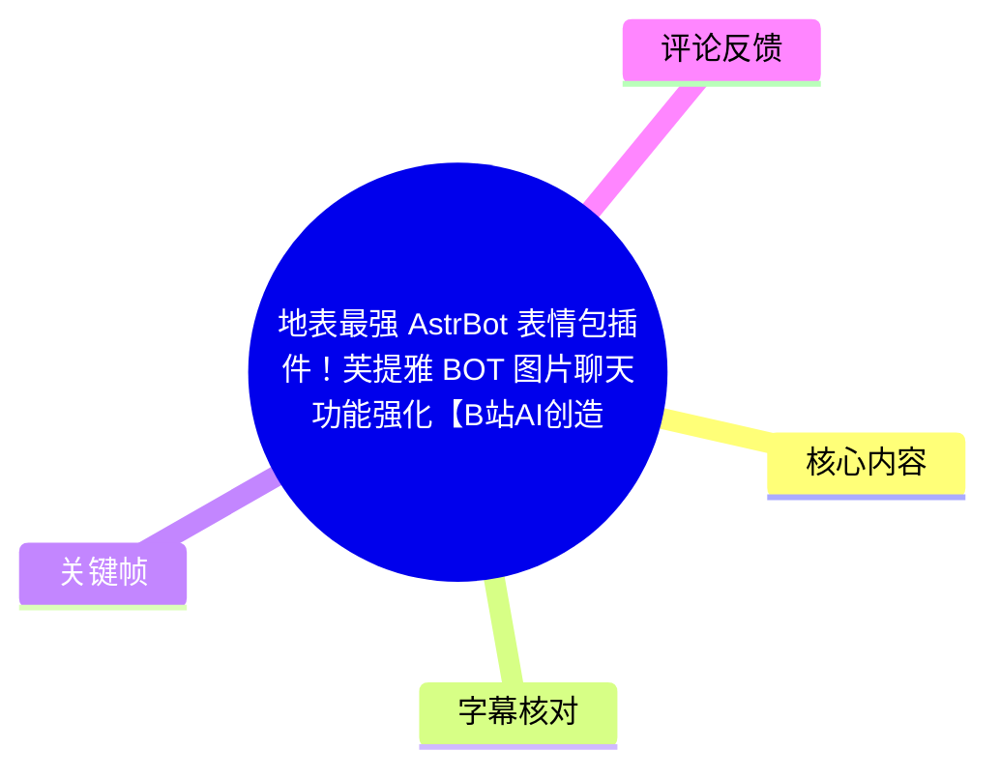
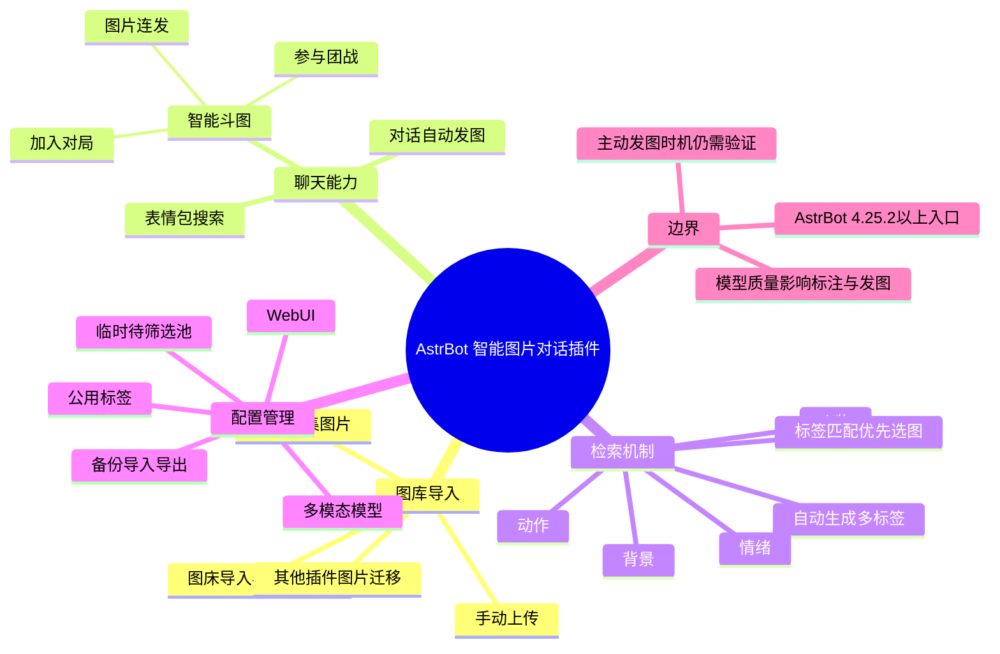
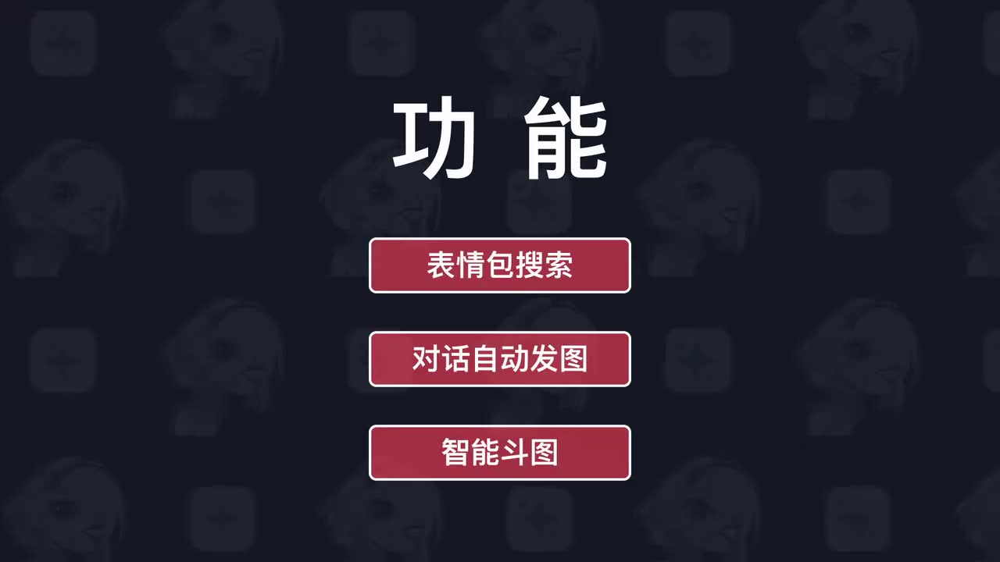
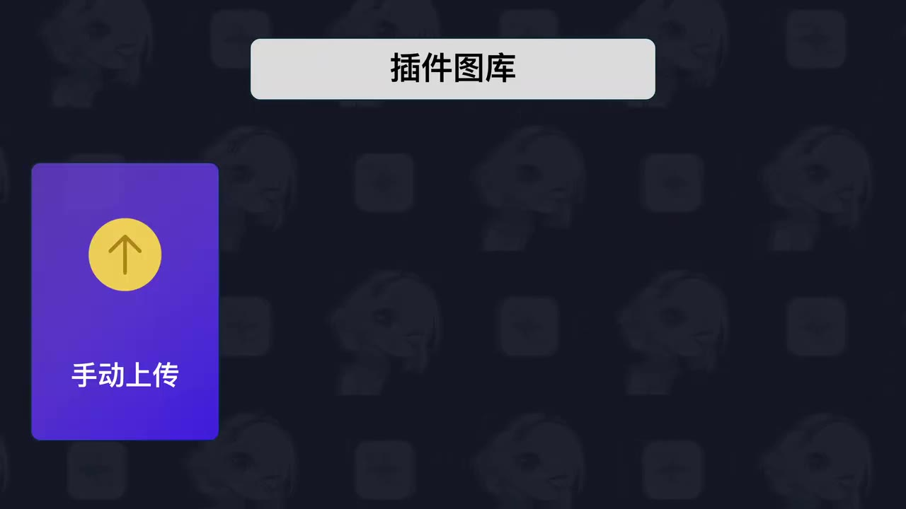

# 地表最强 AstrBot 表情包插件！芙提雅 BOT 图片聊天功能强化【B站AI创造公开赛】

> 来源：[Bilibili 视频](https://www.bilibili.com/video/BV1pHJn67Ein) 
> UP 主：CyanDust_青尘｜时长：4 分 31 秒｜合集：AIcode  
> 视频描述中提供的资源：GitHub 仓库 `QingchenWait/astrbot_plugin_smart_imagechat_hub`，以及青尘工作室第三方插件源说明页。

## 小结

视频介绍了一个面向 **AstrBot 聊天机器人**的“智能图片对话”插件。其定位是把表情包的收集、管理、自动标注、检索与群聊发图行为整合到同一套 WebUI 中，以增强机器人在聊天中发送图片的能力。

插件宣传的主体能力可归为两部分：一是图库侧，支持手动上传、从群聊收集图片、通过图床同步，以及从其他 AstrBot 表情包插件迁移图片；二是聊天侧，包括按用户需求搜索表情包、对话中主动发图、在群聊中进行“智能斗图”。

技术核心是**多标签检索系统**。视频将其与“单一分类标签 + 分类内随机抽图”的方式对比：插件会为每张图片生成角色／人物、动作、情绪、背景等多个标签；聊天时先分析当前对话接近哪些标签，再优先选择与这些标签匹配更多的本地图片。该机制的目标是保留图片的细节语义，而非只依赖一个大类。

实际配置需要进入插件 WebUI，并为自动标签流程选择具备多模态能力的大模型，设置生成哪些标签或自定义标签需求。视频称，当 AstrBot 客户端版本在 **4.25.2 以上**时，可通过插件卡片上的显示器图标直接进入 WebUI；这是视频中明确给出的版本门槛。

使用时应关注两个限制：视频未展示实际聊天效果的完整对比、模型成本或准确率指标，也没有证明“最强”这一宣传性标题；自动标注和主动发图均依赖所配置模型及图库质量。热评还指出，视频所述机制更侧重“选哪张图”，是否充分判断“当前是否适合发图”仍值得进一步验证。

信息具有时效性：插件功能、AstrBot 的 WebUI 入口、支持的图床类型、第三方插件源和仓库安装方式均可能随版本更新变化。本文仅整理该视频及其元数据所披露的信息，不将其视为当前版本的官方兼容性保证。

## 思维导图

## 目录

- [产品定位与能力概览](#产品定位与能力概览-000008)
- [三类聊天功能与四种图库导入方式](#三类聊天功能与四种图库导入方式-000038)
- [多标签检索：从分类随机图到语义匹配](#多标签检索从分类随机图到语义匹配-000108)
- [WebUI 配置与自动标签流程](#webui-配置与自动标签流程-000156)
- [图库管理、公用标签与聊天能力参数](#图库管理公用标签与聊天能力参数-000220)
- [收图审核、迁移、图床同步与运维功能](#收图审核迁移图床同步与运维功能-000309)
- [安装、获取与时效性](#安装获取与时效性-000357)
- [结论与限制](#结论与限制)
- [字幕比对](#字幕比对)
- [评论分析](#评论分析)
- [处理记录](#处理记录)

## [产品定位与能力概览（00:00:08）](https://www.bilibili.com/video/BV1pHJn67Ein?t=8)

视频开场将插件概括为“四种图库导入方式、三大表情包聊天功能、自动标注、多维标签”，并称它用于聊天机器人 AstrBot。ASR 多处将 AstrBot 错识别成“S-Port”“Asport”，但标题、标签、视频描述和仓库名均明确指向 AstrBot，因此本文统一使用 **AstrBot**。

作者将该插件称为“智能图片对话”插件，并将其定位为整合常见表情包聊天功能的工具。视频声称其语义匹配会更精准；这一点是作者的产品判断，视频没有提供检索准确率、召回率或与其他插件的量化对照。

> 图：关键帧以功能卡片形式列出“表情包搜索”“对话自动发图”“智能斗图”三项聊天能力，直接对应视频的能力分组，适合作为后续配置说明的总览。

## [三类聊天功能与四种图库导入方式（00:00:38）](https://www.bilibili.com/video/BV1pHJn67Ein?t=38)

### 聊天侧的三项能力

视频按使用情境说明了三类功能：

1. **表情包搜索**  
   用户可要求机器人寻找想要的表情包；插件会在自己的图库中找出符合用户需求的图片。

2. **对话中主动发送表情包**  
   机器人可根据回复内容，主动补充适合的表情包，以活跃聊天气氛。后续配置区可设置分析聊天内容所使用的大模型，以及机器人回复时携带图片的概率。

3. **智能斗图**  
   插件可分析群友发送的图片，再选择合适的表情包加入互动。视频随后将该能力拆为“加入对局、图片连发、参与团战”三种可选项。

### 图库导入与集中管理

视频列出四种主要图库来源：

| 导入方式 | 视频所述用途 | 注意点 |
| --- | --- | --- |
| 手动上传 | 直接把图片导入插件图库 | 适合明确挑选后的图片 |
| 群聊收集／“偷图” | 自动从指定群聊收集图片 | 需配合群范围设置与二次确认 |
| 图床导入 | 从图床导入图片并支持增量同步 | 图床类别和同步策略以实际版本为准 |
| 其他插件导入 | 一键迁移其他 AstrBot 表情包插件中的图片 | 可选择子文件夹，部分情况下可继承分类名 |

作者强调，插件意在把分散在不同位置、不同插件中的表情包集中到一个图库中管理。这里的“任何地方”是宣传性表达；视频实际明确展示或提及的来源仍以上表四类为准。

> 图：关键帧显示“插件图库”及“手动上传”卡片。它有助于区分“图库导入”与“聊天时检索发图”是两个连续但独立的环节。

## [多标签检索：从分类随机图到语义匹配（00:01:08）](https://www.bilibili.com/video/BV1pHJn67Ein?t=68)

视频将“多标签检索系统”定义为改善图片对话效果的核心机制。

### 视频给出的对比逻辑

传统单一标签／单一分类方案的流程被描述为：

1. 为表情包划分一个分类；
2. 大模型判断当前聊天内容属于哪个分类；
3. 从该分类中随机抽取一张图片。

作者认为，这种方式虽然可用，但容易忽略图片中更多细节含义。

相对地，多标签方案会为每张图片建立多个特征标签，视频举例包括：

- 人物；
- 动作；
- 情绪；
- 背景。

这些标签共同构成标签库。匹配时，大模型先分析当前对话最接近哪些标签；插件再在本地图库中检索，并让命中相似标签更多的图片优先发送。

> 图：关键帧明确标示“多标签检索系统”，是视频解释检索机制的视觉分界点。图片本身未展示具体标签数据或排序分数，因此不能据此推断其内部算法、向量模型或评分公式。

### 可迁移的实现思路

按视频所述，这是一条“**图像结构化 → 对话结构化 → 标签匹配 → 本地选图**”的链路。其实际效果至少受以下因素影响：

- 多模态模型能否为图片生成准确、细粒度且一致的标签；
- 用户的聊天语义能否被正确映射到同一套标签体系；
- 图库规模、图片重复度和标签质量；
- 检索时是否仅按标签数量排序，以及是否存在其他重排序规则。

后三点并未在视频中展开，因此不能将“标签命中更多优先”理解为完整的算法实现说明。

## [WebUI 配置与自动标签流程（00:01:56）](https://www.bilibili.com/video/BV1pHJn67Ein?t=116)

视频称，要使用插件完整功能，需要进入插件的 WebUI。

### 进入 WebUI 的前置版本

作者说明，AstrBot 引入 `PluginPage` 功能后，若**客户端版本在 4.25.2 以上**，可点击插件卡片上的“显示器”按钮一键进入 WebUI 管理页面。

该表述只说明视频录制时的入口条件；未说明低于该版本是否完全不能使用插件、是否存在替代入口，故不能延伸解读。

### 自动标签配置步骤

视频给出的操作顺序如下：

1. 进入 WebUI 首页，查看自动标签系统的进度条。
2. 点击“自动表情生成流程配置”（ASR 对按钮名识别不稳定；可确认其为自动标签生成流程配置入口）。
3. 选择一个**具备多模态能力**的大模型，用于生成图片标签。
4. 选择让模型生成哪些类别的标签，或自行填写生成需求。
5. 保存设置。
6. 通过各类导入渠道将图片上传到插件。
7. 插件调用大模型分析图片，并为图片附加相应标签。

这里最重要的参数不是某个固定模型名称，而是“模型必须具备多模态能力”。视频未给出推荐模型、接口格式、上下文长度、价格、并发限制、标签语言或失败重试策略，部署时仍需以插件仓库和实际模型文档为准。

## [图库管理、公用标签与聊天能力参数（00:02:20）](https://www.bilibili.com/video/BV1pHJn67Ein?t=140)

### 图像入库后的标签维护

图片入库后，视频称可在图库中：

- 点击图片查看自动生成的标签；
- 编辑标签内容；
- 使用“公用标签”降低重复输入成本。

公用标签的例子是：若存在许多同一人物的表情包，可将人物名加入公用标签列表。保存后，编辑单张图片标签时，该公用标签会以候选项出现，勾选即可完成标注。

这一设计适合图库中重复存在稳定实体、角色或系列素材的场景。它也意味着公用标签的命名一致性会影响检索效果；视频没有说明同义词归并、错别字校正或标签冲突处理机制。

### 聊天功能配置项

视频随后进入“插件能力配置区”，披露了如下可调项：

| 功能 | 可配置内容 |
| --- | --- |
| 为用户寻找表情包 | 触发找图的关键词；机器人回复文案 |
| 对话中主动发图 | 分析聊天内容所使用的大模型；机器人回复时携带图片的概率 |
| 智能斗图 | 可决定是否开启“加入对局、图片连发、参与团战”中的各项能力 |

“回复时带图的概率”是视频明确出现的行为控制参数。它可以调节主动发图的频率，但不等于判断发图是否合时宜；概率较高可能增加活跃度，也可能增加不合语境发送图片的风险。

## [收图审核、迁移、图床同步与运维功能（00:03:09）](https://www.bilibili.com/video/BV1pHJn67Ein?t=189)

### 群聊收图的二次确认机制

针对“偷图”或从群聊自动收集图片，视频称管理员可设置机器人从哪些群中收图。为避免不合适的图片直接进入正式图库，插件设置了二次确认：

1. 收集的图片先进入临时待筛选图片池；
2. 管理者确认后，图片才正式入库；
3. 正式入库的图片才会被打标签；
4. 只有完成入库与标注的图片才参与聊天检索。

这是一项重要的内容治理设计：它将“采集”与“可被机器人发送”分离。不过，视频没有说明审核权限、图片版权与隐私处理、过期图片清理、NSFW 识别或群成员授权机制。将群聊图片纳入机器人图库前，仍需自行遵守平台规则和群聊成员隐私预期。

### 从其他插件迁移

如果此前使用过其他 AstrBot 表情包插件，可使用“从其他插件导入”：

1. 点击导入按钮；
2. 页面列出已安装插件；
3. 选择其中任意子文件夹同步图片；
4. 若原插件按文件夹分类表情包，可勾选继承原插件分类名称的选项。

该流程降低了切换插件时重建图库的成本。视频未说明可兼容哪些具体插件格式、是否会复制文件还是建立引用、标签如何生成或冲突如何处理。

### 图床、备份与故障处理

视频称图床导入目前支持一个被 ASR 识别为“Cosplay R2”的来源／组合名称；由于没有可用站内字幕且画面素材未提供该处界面文字，无法据此可靠还原其准确产品名，故不擅自校正。可确认的是：**视频称图床可设置每天定时自动同步**。

此外，作者还提到以下运维或管理功能：

- 定时自动备份；
- 数据包导入与导出；
- 图库展示模式切换；
- 模型失效时的警告；
- 模型失效时的自动切换。

这些功能仅在口述中被列举，视频未提供可复现的具体配置字段、默认值、备份位置与恢复验证流程。

## [安装、获取与时效性（00:03:57）](https://www.bilibili.com/video/BV1pHJn67Ein?t=237)

作者称，该“智能图片对话”插件是其 AI 聊天机器人“芙提雅／Fritia Online”相关项目的一部分，并已在 GitHub 开源。ASR 将该名称识别为“Future Online”，但视频标题中的“芙提雅”与描述链接中的 `fritia_online_guide` 更能支持“Fritia Online”这一转写；英文正式名称仍建议以仓库页面为准。

视频给出的安装／获取路径有两种：

1. 在 AstrBot 客户端的插件页面，使用 **GitHub 链接**安装；
2. 使用仓库发布的**压缩包**进行安装。

如需获取作者团队更多功能，视频称可导入其第三方插件源，以获取最新插件开发进展。资源地址来自视频描述：

- GitHub：<https://github.com/QingchenWait/astrbot_plugin_smart_imagechat_hub>
- 插件源说明页：<https://qingchenwait.github.io/fritia_online_guide/plugin-source.html>

> 安装前应优先阅读仓库当前 README、发行版说明、依赖与权限声明。视频发布时点的“支持项”和安装页面可能已经变化。

## 结论与限制

视频呈现的是一套以“多模态自动标注 + 多标签本地检索”为中心的表情包聊天插件方案。对已有大量图片素材、希望将图片检索与群聊互动自动化的 AstrBot 使用者而言，它的核心价值在于统一图库入口、标签维护、迁移和聊天策略配置。

可直接复用的实践经验包括：

- 将图片采集、审核、入库、标注与聊天检索拆开管理；
- 用人物、动作、情绪、背景等多维特征替代单一分类；
- 为高频实体建立公用标签，保证标注一致性；
- 把主动发图概率、找图触发词和斗图能力设为可配置项，而非硬编码；
- 对群聊采集设置临时审核池，避免未经确认的图片参与检索。

但视频也存在明确的信息边界：

- “地表最强”“语义匹配更加精准”均为作者宣传或判断，未给出可验证的对照实验；
- 没有展示自动标签准确率、检索评分规则、模型成本、延迟或大图库性能；
- 主动发图功能的“时机判断”未被完整说明；
- 图床支持项中至少有一个名称被 ASR 模糊识别，不能作为精确兼容性清单；
- 客户端 `4.25.2` 以上的条件仅针对视频所述 WebUI 一键入口，应以当前 AstrBot 版本文档为准。

## 字幕比对

| 字幕来源 | 完整性 | 专有名词 | 时间轴 | 主要问题 |
| --- | --- | --- | --- | --- |
| Bilibili 站内字幕 | 未提供可用站内字幕，无法比较正文 | 无法核验 | 无可用分段 | 素材明确标注“未提供可用站内字幕” |
| 本次 ASR 字幕 | 较完整：13 段，语音覆盖约 255.38 秒／全片 270.144 秒，覆盖率约 94.53% | 存在多处误识别 | 可用：提供毫秒级 SRT 起止时间 | AstrBot 被识别为“S-Port／Asport”，插件、图片、标签等词有错字；部分产品名称不清晰 |

最终采用**本次 ASR 的时间轴**作为章节定位依据。站内字幕不可用，因此无法进行逐句优劣比较；但已按要求检查本次 ASR 的诊断结果：识别语言为中文，模型为 `medium`，`languageProbability` 为 `0.99951171875`，未标记 `noAudioStream=true`，说明源视频存在可供识别的音轨，且没有“无音轨”情形。

基于标题、视频描述、标签和关键帧／上下文进行的必要校正如下：

- `S-Port`、`Asport` → **AstrBot**：由视频标题、标签 `astrbot`、描述中的仓库名共同佐证。
- “表情箱聊天插键”等 → **表情包聊天插件**：按上下文语义修正。
- “自动表现生成流程” → **自动标签生成流程**：与后文“生成标签”“多标签检索”一致，但未强行补充界面准确按钮名。
- `Future Online` → **Fritia Online／芙提雅相关名称**：依据标题“芙提雅”与描述链接路径作保守校正，英文正式拼写仍以仓库为准。
- “Cosplay R2”保留为 ASR 不确定转写：缺乏站内字幕或可辨界面文字，不能据此断言为某个具体云存储服务。

## 评论分析

以下仅基于可获取的热评前三条，不将评论内容视为已验证事实。

1. **-东方若木-（47 赞）**  
   评论内容为鼓励表情“[尘白_鼓励]”。该评论表达正向支持，但没有提供功能补充、使用反馈或可分析的技术信息。

2. **Him666233（9 赞）**  
   观点是该插件像一个“极大融合体”，并提出一个具体改进建议：在决定发图前，检索最近和当前的对话内容，先判断当前氛围是否适合发图，再决定是否发送及发送哪张图，以避免气氛不对的尴尬。  
   该建议与视频实际展示的“按标签选图”“设置带图概率”形成互补：视频说明了图片选择和发送频率控制，但没有明确展示完整的“适不适合发图”判定链路。建议具有产品设计参考价值，但并非对插件当前能力缺失的实证结论。

3. **珝环（7 赞）**  
   评论称“小老师不赖”，并表示“单方面联动”。这是正面互动与社群表达，没有提供插件兼容性、部署方法或性能方面的可验证信息。

## 处理记录

- Worker ID：`worker-mrj0wbly-5dc4e50c`
- 模型：`gpt-5.6-terra`
- 使用素材与工具结果：视频元数据、关键帧列表、ASR 结果 JSON、ASR SRT 时间轴字幕、热评 JSON；ASR 模型为 `medium`，CUDA / `float16`。
- 字幕选择：站内字幕未提供可用版本；检查并采用本次 ASR 的 13 个带时间戳分段作为时间轴依据，同时基于元数据和上下文修正明显专有名词误识别。
- 关键帧选择依据：选用 `frame-002.jpg` 展示三类聊天功能、`frame-003.jpg` 展示图库手动上传入口、`frame-004.jpg` 标示多标签检索主题；均用于辅助理解视频已明确陈述的功能，不从画面外推未展示的技术细节。
- 缓存清理：素材清单未提供缓存清理执行记录；本文不虚构清理结果。
- 未解决问题：未获得可用站内字幕；未能从素材确认图床支持项中被 ASR 识别为“Cosplay R2”的准确名称；未验证仓库当前版本、实际安装过程、模型兼容性、性能数据及主动发图时机判断能力。
