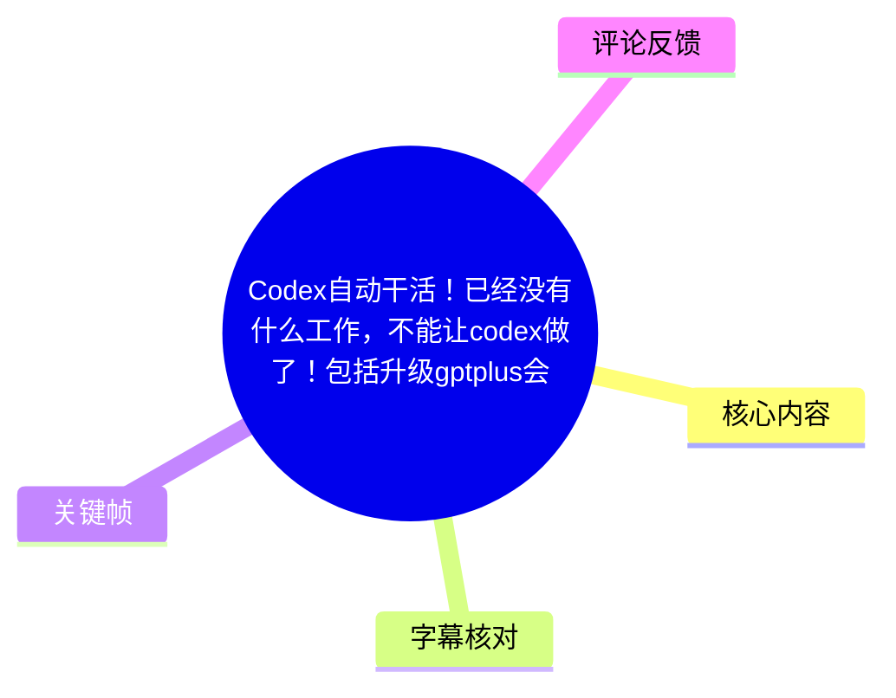
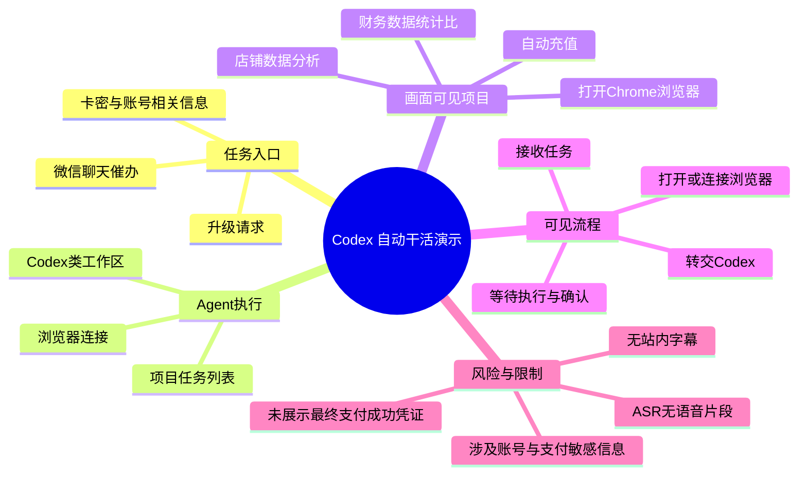
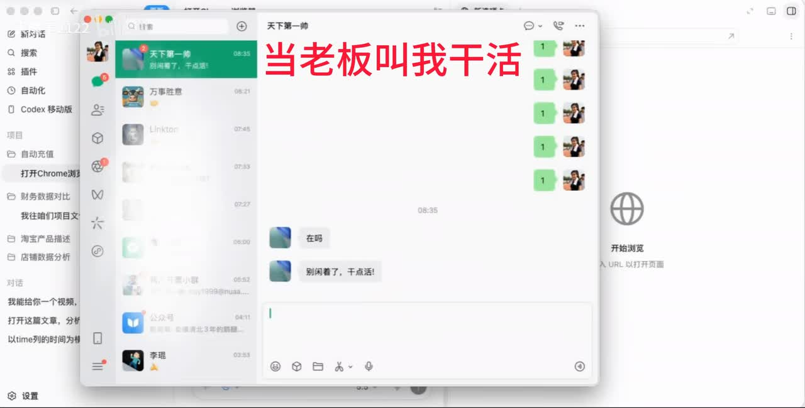
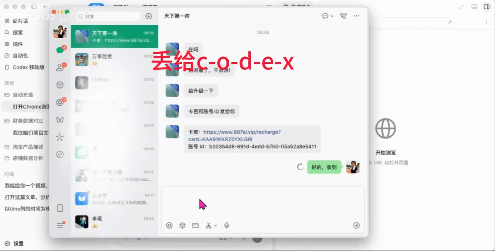
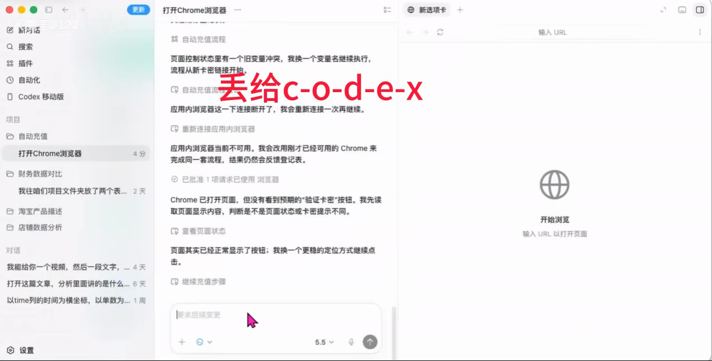
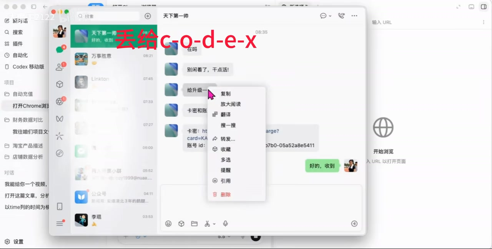

# Codex自动干活！已经没有什么工作，不能让codex做了！包括升级gptplus会员！

> 来源：[Bilibili 视频](https://www.bilibili.com/video/BV1LoEo6KEvJ) 
> UP 主：大魔王2122 ｜ 时长：52 秒 ｜ 分区收藏：AIcode  
> 注：发布时间由元数据 `pubdate=1781110404` 换算；该视频的元数据抓取时间为 2026-07-15，涉及 Codex、浏览器自动化及会员订阅的界面与能力均可能随产品更新而变化。

## 小结

视频以“老板在微信催办”为模拟工作场景，展示将任务交给 Codex 类 Agent 处理的工作流：在聊天窗口中接收“给升级一下”的指令及卡密/账号相关信息，再将任务转交给左侧项目区中的自动化任务，由 Agent 调用或连接 Chrome 浏览器继续执行。

画面能够确认的核心不是某个已完成的充值结果，而是**以聊天输入为任务入口、以 Codex/Agent 为执行主体、以浏览器为操作环境**的自动化演示。左侧项目列表中可见“自动充值”“打开Chrome浏览器”“财务数据统计比”“店铺数据分析”等项目名称，表达了作者对 Agent 可承担多类重复性电脑工作的判断。

视频标题与封面文案使用“已经没有什么工作，不能让 codex 做了”的夸张表达。就素材本身而言，不能据此推导 Codex 已可靠替代人工完成所有工作；尤其是涉及 GPT Plus 订阅、支付、卡密、账号和浏览器登录态的场景，仍应由用户确认授权范围、资金流向、账户归属和最终提交结果。

本视频没有提供可用的 Bilibili 站内字幕；本次 ASR 也未识别到任何语音片段。因此，以下整理以可见关键帧中的界面文字与流程关系为依据，并严格区分“画面可见”“标题/描述声称”与“无法由素材验证”的内容。由于缺少带时间戳的语音或站内 SRT，除视频起点外，无法建立可靠的逐段精确时间轴。

适合希望了解“AI Agent 如何从消息任务进入浏览器操作”的读者。若实际用于订阅升级或支付，不应把视频画面中的第三方链接、卡密或账号标识当作可直接复用的信息，更不应把敏感凭据发送给未经验证的自动化 Agent 或服务。

## 思维导图

## 目录

- [视频定位与可确认范围](#视频定位与可确认范围00:00)
- [任务从聊天窗口进入自动化工作区](#任务从聊天窗口进入自动化工作区00:00)
- [Codex 与 Chrome 浏览器的协作界面](#codex-与-chrome-浏览器的协作界面00:00)
- [可复用的自动化步骤与人工控制点](#可复用的自动化步骤与人工控制点00:00)
- [参数、限制与时效性](#参数限制与时效性00:00)
- [字幕比对](#字幕比对)
- [评论分析](#评论分析)
- [处理记录](#处理记录)

## [视频定位与可确认范围（00:00）](https://www.bilibili.com/video/BV1LoEo6KEvJ?t=0)

视频标题聚焦“Codex 自动干活”以及“升级 GPT Plus 会员”，元数据描述则集中列举 GPT Plus 订阅、充值、国内支付、支付失败等关键词。不过，标签和描述属于发布者提供的检索信息，**不能替代视频中可核验的操作证据**。

从提供的关键帧可以确认，作者演示的是一个桌面端工作区：

- 左侧为聊天、搜索、插件、自动化、Codex 移动版等入口；
- 中部存在项目/任务列表；
- 右侧为浏览器区域，初始状态显示“开始浏览”“输入 URL 以打开页面”；
- 场景中出现微信聊天窗口，消息内容包含催办、升级请求及疑似卡密/账号相关字段；
- 中部工作区可见与浏览器连接、页面状态、继续执行等有关的 Agent 运行记录。

但素材未展示可明确核验的以下结果：

1. GPT Plus 是否成功升级；
2. 使用的支付渠道、支付金额、币种或扣款结果；
3. 卡密来源是否合法、是否有效；
4. Agent 是否真正完成了不可逆提交；
5. 浏览器操作是否经过账户所有者的实时确认。

因此，本文将其定位为一段**自动化任务编排与浏览器操作界面的展示**，而不是可直接复现的 GPT Plus 订阅教程或支付成功证明。

## [任务从聊天窗口进入自动化工作区（00:00）](https://www.bilibili.com/video/BV1LoEo6KEvJ?t=0)

画面开头以微信对话模拟外部任务来源。红色叠字“当老板叫我干活”强调了“接收工作请求”的情境；随后叠字改为“丢给 c-o-d-e-x”，表达作者希望把重复性任务交由 Codex 类工具代办的思路。

聊天中的可读信息包括：

- 对方询问“在吗”；
- 接着催促“别闲着了，干点活！”；
- 后续提出“给升级一下”；
- 还出现“卡密和账号ID发给你”一类内容；
- 下方可见一段包含网址、卡密字段及账号 ID 字段的长消息。

这说明演示中的任务输入不仅是自然语言指令，还混合了可能用于后续操作的结构化或半结构化信息。但关键帧中包含敏感凭据形态的信息，本文不复述网址、卡号、卡密、账户 ID 或任何可用于访问/支付的字符串。

> 图：画面展示微信聊天窗口及“当老板叫我干活”的红色叠字，说明视频用即时消息作为自动化任务的来源。其价值在于界定了演示的起点：先出现人工请求，再考虑由 Agent 接手，而非 Agent 无上下文自行执行。

> 图：聊天窗口上方出现“丢给 c-o-d-e-x”字样，聊天中可见升级请求和疑似账号/卡密相关长消息。该图帮助理解作者的主张是将任务委托给 Agent；同时也提示此类信息属于高敏感数据，实际使用时必须避免明文扩散。

### 任务输入的经验边界

从画面可抽取的可迁移经验是：将任务交给 Agent 前，需要把目标、上下文和必要输入组织清楚。但对于涉及订阅和支付的任务，不能简单地把“卡密、账户 ID、链接”一次性丢给自动化工具。至少应拆分为：

1. **任务目标**：例如仅“打开官方订阅页面并检查当前套餐状态”；
2. **允许动作**：例如允许导航网页、填写非敏感信息，或仅允许生成操作建议；
3. **禁止动作**：未经确认不得提交订单、不得保存支付信息、不得导出或转发凭据；
4. **人工确认点**：在登录、输入付款信息、提交升级、确认扣款等节点暂停。

上述拆分是对高风险自动化的一般安全建议，并非视频明确展示的配置项。

## [Codex 与 Chrome 浏览器的协作界面（00:00）](https://www.bilibili.com/video/BV1LoEo6KEvJ?t=0)

后续画面转到包含项目列表、Agent 对话区和浏览器面板的工作台。左侧项目区中可见：

- 自动充值；
- 打开Chrome浏览器；
- 财务数据统计比；
- 我往自创项目文件夹放了两个表……；
- 淘宝产品描述；
- 店铺数据分析。

这些项目名称表明，该工作台被用于管理多种任务，既包括浏览器操作，也包括数据统计、文件整理和文本生成类工作。视频并未展示这些项目的完整配置、代码、提示词、权限模型或成功率，因此不能将项目名称理解为已验证的完整能力清单。

中部任务记录的可见文字揭示了浏览器操作中可能遇到的状态问题，包括：

- 页面控件状态或变量冲突；
- 流程从新卡密链接开始；
- 应用内浏览器连接断开后重新连接；
- 应用内浏览器当前不可用，改用已经可用的 Chrome 完成流程；
- Chrome 已打开页面，但未看到预期“验证卡密”按钮；
- 尝试重新读取页面状态、继续定位按钮。

右侧浏览器区域显示“开始浏览”“输入 URL 以打开页面”，表示浏览器可作为 Agent 的外部执行环境，但关键帧未展示具体访问的网站内容，也未展示任何完成页面。

> 图：左侧选中“打开Chrome浏览器”项目，中部显示有关浏览器连接、页面状态与继续执行的记录，右侧为浏览器空白起始页。该图的价值在于说明自动化并非始终一次成功：连接中断、页面状态不符和控件定位失败都可能需要重新判断。

### 可观察到的技术要点

| 要点 | 关键帧依据 | 可得出的结论 | 不可得出的结论 |
| --- | --- | --- | --- |
| 任务管理 | 左侧存在多个项目名称 | 工作区支持以项目形式组织不同任务 | 不知道每个项目的具体配置或执行引擎 |
| 浏览器协作 | 右侧显示浏览器区，中部提到 Chrome 与应用内浏览器 | Agent 工作流与浏览器操作存在衔接 | 不知道是否使用官方 Codex、扩展程序或第三方封装 |
| 连接恢复 | 中部可见重新连接、切换可用 Chrome 的文字 | 浏览器会话断开是流程中的现实故障点 | 不知道恢复机制是否稳定或是否保留登录态 |
| 页面验证 | 中部提及未看到预期按钮、重新读取页面状态 | Agent 需要根据页面实际状态调整步骤 | 不知道最终是否找到按钮、是否完成验证或支付 |

## [可复用的自动化步骤与人工控制点（00:00）](https://www.bilibili.com/video/BV1LoEo6KEvJ?t=0)

由于没有可用语音字幕和逐步操作录像文本，视频无法支持一份“照做即可完成订阅”的精确教程。根据关键帧，能够谨慎整理出的流程应当是下面这种**抽象工作流**：

1. **接收任务**  
   从聊天工具获得待办请求。视频使用了“升级一下”的对话作为示例。

2. **建立任务边界**  
   在转交 Agent 前，明确最终目标和禁止行为。对于支付类任务，应将“查询、导航、填表、提交”分离，不能默认允许全自动扣款。

3. **选择或新建项目**  
   在工作区中使用对应项目。画面可见“自动充值”“打开Chrome浏览器”等项目名，说明作者通过项目化方式承载不同类型任务。

4. **连接浏览器执行环境**  
   画面显示应用内浏览器和 Chrome 两种可能的浏览器环境。中部日志表明，连接异常时可能需要重新连接，或切换到已经可用的 Chrome。

5. **读取页面实际状态**  
   不能仅依赖预设步骤。关键帧中的记录显示，Agent 曾没有看到预期的“验证卡密”按钮，并改为重新读取页面状态和寻找更稳定的定位方法。

6. **在不可逆节点停下确认**  
   登录、输入卡密、输入付款方式、提交订单、确认升级均应要求账户所有者人工检查。视频素材没有展示这些环节的授权设计或确认弹窗，不能假定其已具备。

7. **核验最终结果并留存记录**  
   应以账户套餐页面、官方订单记录或支付凭据为准，而不是仅以 Agent 的文字回复或页面跳转为准。视频没有提供这样的最终核验画面。

> 图：画面仍保留微信中的升级请求与敏感长消息，鼠标右键打开了消息操作菜单，背景为浏览器/工作区。该图显示聊天内容可能需要被复制或引用到后续任务，但也强调了操作人员应避免把完整敏感信息复制到不受控的日志、提示词或第三方服务中。

### 浏览器自动化的常见失败点

视频画面实际提到或直接显示的失败征兆包括“连接断开”“浏览器不可用”“没有看到预期按钮”。将其转化为实践检查项时，可按以下顺序排查：

| 检查项 | 处理原则 |
| --- | --- |
| 浏览器是否已连接 | 先确认 Agent 所见窗口与用户实际浏览器一致，避免在错误的会话或账号中继续操作。 |
| 页面是否加载完成 | 页面元素缺失可能来自加载延迟、登录过期、地区限制、风控弹窗或页面版本变化。 |
| 预期控件是否存在 | 不应强行点击坐标；应先重新读取页面状态，确认文本、按钮或表单是否已变更。 |
| 登录身份是否正确 | 订阅与付款必须确认操作账户；不要让 Agent 在不明登录态下继续。 |
| 是否发生不可逆提交 | 提交前暂停并让人确认金额、套餐、周期、账户及付款方式。 |
| 是否具备官方凭证 | 以官方账单、套餐状态或支付平台记录核验，不以聊天回复替代。 |

## [参数、限制与时效性（00:00）](https://www.bilibili.com/video/BV1LoEo6KEvJ?t=0)

### 已知技术参数

| 项目 | 值 |
| --- | --- |
| 视频时长 | 52 秒（媒体分析时长约 51.107 秒） |
| 视频分辨率 | 2830 × 1440 |
| 页面数 | 1 |
| ASR 模型 | medium |
| ASR 设备与精度 | CUDA / float16 |
| ASR 自动识别语言 | 英语（置信度 0.541015625） |
| ASR 语音片段数 | 0 |
| ASR 语音覆盖时长 | 0 秒 |
| 可用站内字幕 | 未提供 |

ASR 将语言猜测为英语，但没有产生任何片段。这不能证明视频是英语内容，也不能证明画面没有声音；它只能说明**本次识别没有得到可用语音文本**。诊断提示建议检查音轨和识别条件，但给定诊断中没有 `noAudioStream=true` 标记，因此不能断言源视频“没有音轨”。

### 素材限制

1. **无可用的逐句字幕与时间戳。**  
   无法依据 ASR/SRT 为“聊天出现”“浏览器连接”“结果提交”等画面建立可靠的秒级发生时间，本文正文时间轴仅链接至真实视频起点 `t=0`，不伪造分段秒数。

2. **关键帧不足以证明操作结果。**  
   画面能说明任务委托与浏览器自动化界面，但未呈现清晰的订阅成功页、订单编号、金额、付款确认或账户权益变化。

3. **敏感信息不应复用。**  
   关键帧里可见疑似网址、卡密与账号 ID 形式的内容。即使这些信息来自演示，也不应在文档中转录、传播、尝试访问或用于实际支付。

4. **工具与页面变化很快。**  
   Codex 产品形态、浏览器连接机制、GPT Plus 订阅入口、支付支持范围、地区可用性和风控策略可能发生变化。视频上传时的界面不能作为当前操作规范。

5. **自动化不等于获得授权。**  
   Agent 能够操作浏览器，并不意味着其有权代替用户作出购买、订阅、付款、登录或数据披露决定。

## 字幕比对

| 字幕来源 | 完整性 | 专有名词 | 时间轴 | 主要问题 |
| --- | --- | --- | --- | --- |
| Bilibili 站内字幕 | 无可用字幕 | 无法核验 | 无 | 素材明确说明未提供可用站内字幕 |
| 本次 ASR 字幕 | 空，0 个片段 | 无法识别 Codex、GPT Plus 等词 | 无有效分段 | `medium` 模型自动判定英语，置信度 0.541015625，但语音覆盖为 0 秒、输出为空 |

### 最终字幕选择

未采用任何字幕文本作为正文事实来源。原因如下：

- 站内字幕未提供；
- 本次 ASR 虽完成检测，但没有识别出任何语音片段；
- ASR 诊断没有 `noAudioStream=true`，因此不能将空结果归因为“源视频没有音轨”，也不能把它表述成工具故障的确定结论；
- 正文仅依据视频元数据、可获取评论，以及关键帧中可见的界面文字和布局进行整理。

通过画面可较有把握校正的词语包括“Codex”“Chrome 浏览器”“自动充值”“打开Chrome浏览器”“财务数据统计比”“店铺数据分析”。其中，“Codex”来自视频标题、左侧“Codex 移动版”入口和红色叠字的共同支持；“GPT Plus 升级成功”则**无法**从关键帧得到验证。

## 评论分析

仅处理已获取的热评前三条。评论反映观众态度，不构成对视频技术能力、成本或订阅结果的证据。

1. **清凉雨倾｜66 赞**  
   > “自己干，把省下来的token费用买吃的[doge]”

   该评论以玩笑方式质疑 Agent 自动化的成本效益：若任务本身很简单，人工完成可能比消耗 Token 更划算。它补充了视频中未展开的经济性维度，即应比较人工时间、Token 消耗、出错返工成本和风险成本。评论没有提供具体价格、任务耗时或实际账单，不能据此得出成本结论。

2. **roberpi｜22 赞**  
   > “很好，token报销吗[doge]”

   评论继续聚焦 Token 成本由谁承担，反映出将 AI 用于工作任务时的预算归属问题。对于组织使用场景，确实应明确模型调用费用、浏览器环境费用、账号订阅费与异常重试费用的审批及报销机制；但视频本身没有给出任何 Token 用量或企业制度信息。

3. **周子白露｜18 赞**  
   > “温馨提示，干活不要太快，就算干完也要拖一拖再交差[吃瓜]”

   该评论讨论的是职场节奏，而非技术细节。它隐含了“自动化提升效率后如何呈现工作产出”的话题，但“故意拖延提交”并非可取的工作方法。更合理的做法是如实说明自动化完成的范围、保留复核时间，并以验证后的质量和交付结果为准。

## 处理记录

- Worker ID：`worker-mrj0www4-e8d79408`
- 模型：`gpt-5.6-terra`
- 可用素材与工具产物：
  - 视频元数据与媒体信息；
  - 关键帧目录：`frames/`；
  - ASR 输出：`asr/transcript.srt`、`asr/asr-transcript.txt`、`asr/asr-result.json`；
  - 热评数据：`comments/comments.json`；
  - 站内字幕目录检查结果：未提供可用站内字幕。
- 字幕检查与选择：
  - 已检查站内字幕状态：无可用字幕；
  - 已检查本次 ASR：语言识别为英语、置信度 `0.541015625`、片段数 `0`、语音覆盖 `0` 秒；
  - `asr-result.json` 提供的诊断未标记 `noAudioStream=true`，故未将视频定性为无音轨；
  - 最终未采用 ASR 文本，改以关键帧、多模态界面理解与元数据进行事实整理。
- 关键帧选择依据：
  - `frames/frame-001.jpg`：呈现微信催办情境，适合说明任务入口；
  - `frames/frame-002.jpg`：呈现“丢给 c-o-d-e-x”叠字及升级请求，适合说明任务委托；
  - `frames/frame-003.jpg`：呈现项目工作区、浏览器连接与页面状态记录，适合说明 Agent—浏览器协作及故障恢复；
  - `frames/frame-004.jpg`：呈现聊天消息操作菜单及敏感信息形态，适合提示凭据处理风险。
- 敏感信息处理：未转录关键帧中疑似网址、卡密、账号 ID 等内容；未把它们作为可执行步骤或验证材料。
- 时间轴处理：由于站内字幕缺失、ASR 无任何带时间戳的语音片段，无法按真实字幕段落标注主题发生秒数；正文涉及视频内容的章节统一链接至视频起点 `t=0`，避免依据文字顺序虚构分段时间。
- 评论范围：仅分析已获取的热评前三条，未扩展至其他评论。
- 缓存清理：素材清单未提供缓存清理执行记录；本文未声称已删除原始视频、音频、关键帧或 ASR 文件。
- 未解决问题：
  - 无法确认音轨中是否存在可识别语音，或 ASR 为何未输出片段；
  - 无法核实使用的是哪一版本/哪一产品形态的 Codex；
  - 无法核实 GPT Plus 是否成功升级、支付路径是否合法，或是否发生真实资金扣款；
  - 无法建立除 `t=0` 外的可靠内容级时间轴。
