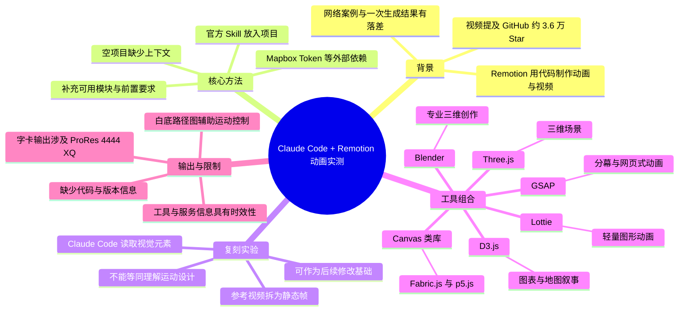
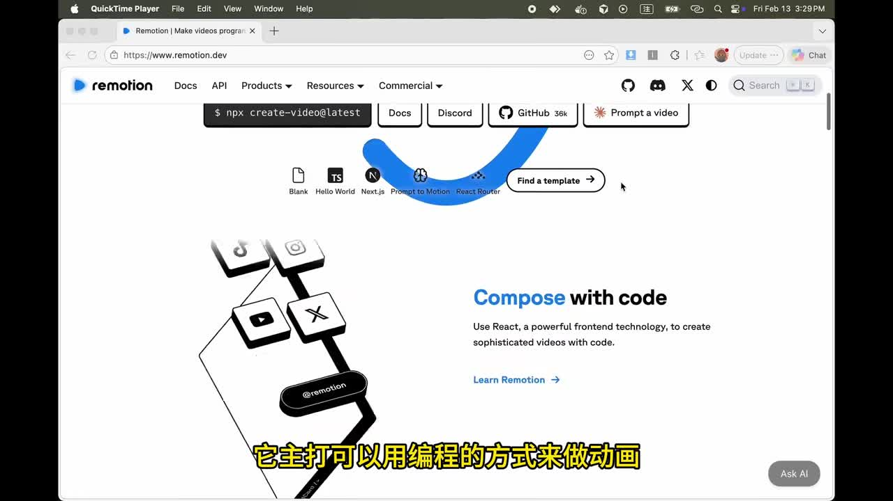
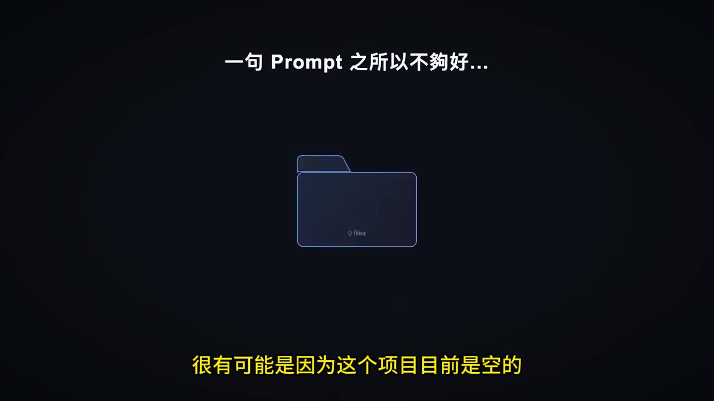
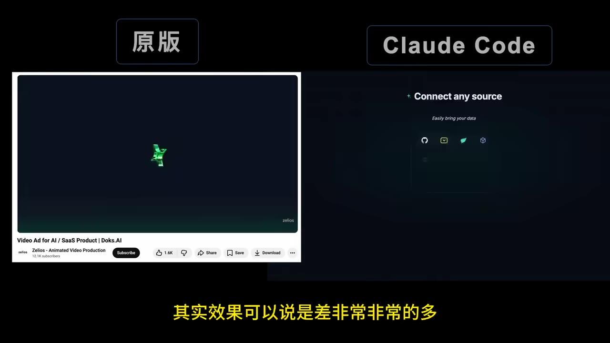

# 太夸张！只用 Claude Code + Remotion 做出大神级动画？我实测给你看

> 来源：[Bilibili 视频](https://www.bilibili.com/video/BV1XedfB8EJ7)  
> UP 主：芝士Dreamer｜时长：5 分 18 秒｜画面规格：1920×1080  
> 视频简介提及：Remotion 是开源项目，主打以代码制作动画、视频；视频口述其 GitHub 当时约有 3.6 万 Star。  
> 数据抓取快照：播放 36,877、点赞 1,108、收藏 3,514、投币 553、分享 385、评论 64；互动数据与 Star 数均会随时间变化。

## 小结

这支视频围绕 **Claude Code + Remotion** 的动画生产流程进行实测。作者要回答两个问题：如何实际使用这套组合制作动画，以及如何提升 AI 生成动画的“质感”。

视频的核心方法论是：**不要只依赖一句 Prompt 和空项目。** 作者认为，一次生成效果不佳的重要原因可能是项目内没有现成结构、模块与规则，AI 必须从零组织全部内容。其解决思路是先将官方提供的 **Skill** 放入项目，让 Claude Code 获得可用模块与工程前置要求；作者称再次生成后的结果有明显改善。

对于参考片复刻，作者尝试将 SaaS 产品营销视频拆成多张静态帧，再让 Claude Code 参考这些画面生成动画。实验表明，生成结果和原片差距很大。视频的解释是：模型可依据线条、色彩、文字等信息重排画面，但并不等同于理解原片的运动规律、节奏、转场与镜头意图。因此，参考帧更适合作为初稿或约束，而非一键复刻保证。

作者还将 Remotion 与不同代码动画/图形工具组合：GSAP 适合网页式分幕与投影片感动画；D3.js 用于数据图表、路线图等信息可视化；Lottie 用于较轻量的图形动画；Three.js 处理 3D 场景；Fabric.js、p5.js 等 Canvas 类库可用于绘制型视觉内容；Blender 则作为专业 3D 创作工具进入实验范围。

视频适合具备前端、React、代码生成或信息可视化需求的创作者参考。需要注意的是，现有素材未提供完整 Prompt、Skill 文件、项目代码、依赖版本、渲染命令、模型授权或性能数据，因此它是工作流与案例展示，不是可逐步无差异复现的完整技术文档。

## 思维导图

## 目录

- [背景：代码动画与实测目标](#背景代码动画与实测目标)
- [关键改进：从空项目到官方 Skill](#关键改进从空项目到官方-skill)
- [参考片复刻：静态帧不能替代运动理解](#参考片复刻静态帧不能替代运动理解)
- [组合工具实验](#组合工具实验)
  - [GSAP：网页式分幕动画](#gsap网页式分幕动画)
  - [D3.js：数据、地图与结构关系](#d3js数据地图与结构关系)
  - [Lottie、Three.js 与 Canvas 类库](#lottiethreejs-与-canvas-类库)
  - [Blender：3D 特效实验](#blender3d-特效实验)
- [操作经验、参数与已知限制](#操作经验参数与已知限制)
- [结论与时效性](#结论与时效性)
- [字幕比对](#字幕比对)
- [评论分析](#评论分析)
- [处理记录](#处理记录)

## 背景：代码动画与实测目标 [00:08](https://www.bilibili.com/video/BV1XedfB8EJ7?t=8)

视频介绍的核心工具是 **Remotion**。作者将其描述为可通过编程方式制作动画、视频的开源项目；视频简介提供了 Remotion 官网与 GitHub 链接，口述及官网画面均强调“用代码创作”。

作者的实测出发点来自网络教程、官网 Prompt 示例和“Claude Code 做出高级动画”的案例：这些内容容易给人“复制 Prompt 即可获得相近成果”的印象，但作者实际尝试后发现，自己的初始结果与案例成片存在较大差距。

因此，视频并非只展示工具能力，而是尝试拆解造成差距的原因，重点包括：

1. 项目是否为空、是否缺乏可复用结构；
2. AI 是否事先获得可调用模块和工程规则；
3. 静态参考帧是否足以复刻动态设计；
4. 不同类型的动画是否应匹配不同图形或动画库。

> 图：画面展示 Remotion 官网的 “Compose with code” 标语及“用编程的方式来做动画”的字幕。该关键帧直接确认视频讨论的是代码驱动的视频/动画工作流，而不是单纯的文生视频工具。

## 关键改进：从空项目到官方 Skill [00:40](https://www.bilibili.com/video/BV1XedfB8EJ7?t=40)

作者提出：一句 Prompt 之所以无法稳定获得好结果，可能是因为当前项目为空，AI 缺少已存在的内容与约束。

视频以“乐高搭高楼”比喻这一问题：如果只有一堆积木，AI 要从零拼出完整大楼较困难；若已具备窗户、柱子、天花板等部件，则更容易完成组合。放在工程语境中，视频所说的“已有内容”可指组件、模块、项目结构、样式规范或可调用能力，但素材没有公开具体目录及文件内容。

> 图：关键帧以标注“0 Files”的文件夹对应“一句 Prompt 之所以不够好”的说明。它可视化了作者的判断：空项目缺乏可复用资产和明确约束，AI 的生成空间更大，输出更难保持一致。

### 作者给出的操作顺序 [00:55](https://www.bilibili.com/video/BV1XedfB8EJ7?t=55)

1. 使用官方提供的现成 **Skill**。
2. 将 Skill 复制到自己的项目中。
3. 让 Claude Code 在生成前知道有哪些模块可使用。
4. 重新生成动画，并与此前结果比较。

作者称，加入 Skill 后，生成效果“好了很多”。这是作者的实测评价，视频没有给出量化指标、完整代码或前后生成配置，不能据此推断每个项目都能获得同等提升。

视频还展示了 Skill 对工程前置条件的提醒：某一地图样例需要申请 **Mapbox Token**。这说明 AI 生成动画不意味着免除外部服务配置；涉及地图、数据或第三方平台时，仍需人工处理账号、Token、权限和密钥安全。

> 图：画面中的字幕为“Skill 提醒我要去申请 Mapbox 的 Token”，背景展示地图视觉效果。该帧的价值在于说明 Skill 不只是生成代码的提示模板，也可能暴露实际运行所需的外部依赖。

## 参考片复刻：静态帧不能替代运动理解 [01:25](https://www.bilibili.com/video/BV1XedfB8EJ7?t=85)

作者进一步挑战影片开头展示的 SaaS 产品营销片复刻。其描述的实验流程是：

1. 选取一支参考视频；
2. 通过 Easy GIF 一类工具，把视频转换为一张张静态 frame；
3. 将这些图片交给 Claude Code；
4. 希望 Claude Code 读取逐帧画面并完成相似动作；
5. 将原版和 Claude Code 生成版本并排比较。

作者的结论是，两者效果差距“非常非常多”。视频认为，Claude Code 并没有真正理解这些图像中的动态运动，只是基于线条、颜色与文字等视觉信息进行读取和重新排版。

> 图：左侧标注“原版”，右侧标注“Claude Code”。两边的画面结构、对象呈现与视觉层次不同，是视频用于说明“喂入静态帧不等于精确复刻动画”的核心证据。

### 可迁移经验 [01:50](https://www.bilibili.com/video/BV1XedfB8EJ7?t=110)

- **静态帧是视觉参考，不是完整的动画规格。** 视频未展示模型对时间、镜头、缓动、转场或对象状态的精确理解。
- **初稿可以继续修改。** 作者明确表示，虽然初始效果不理想，但仍能在该基础上调整。
- **高质量案例不应被简化理解为“一句 Prompt”的产物。** 根据视频的分析，既有项目资产、Skill、设计规则、素材和多轮修改都可能影响结果；其中项目上下文和 Skill 是视频实际强调的因素。
- **工程化复刻需要更多明确约束。** 若目标是高还原度，应提供更细的时间节奏、对象层级、关键状态与素材资源；这是基于视频所呈现限制得出的实践性建议，不是视频公开的固定操作参数。

## 组合工具实验 [02:05](https://www.bilibili.com/video/BV1XedfB8EJ7?t=125)

参考片复刻不理想后，作者转向“用不同代码库控制不同类型画面”的思路。视频称，经过与 AI 讨论后整理了各类套件的优点及场景，并选取多个方向做实验。

可将视频中的组合关系理解为：

- **Remotion**：负责以代码组织动画和视频的基础工作流；
- **GSAP、D3.js、Lottie、Three.js、Canvas 类库、Blender**：分别提供特定动画、数据可视化、图形或 3D 表达能力。

视频展示的是样例和适用方向，不构成不同工具间的严格性能测试或质量排名。

### GSAP：网页式分幕动画 [02:12](https://www.bilibili.com/video/BV1XedfB8EJ7?t=132)

作者将 **GSAP** 介绍为前端网页中常用的动画套件之一，并提到网页可在滚动时触发动画，整体观感较流畅。

视频中的示例流程是：

1. 先请 Claude Code 生成一个首页；
2. 再请 Remotion 围绕该首页制作动画；
3. 得到如动画投影片般、一幕一幕展开的视觉效果。

作者的适用判断是：若要制作类似投影片展开的演示感动画，GSAP 是较合适的工具。ASR 对相关词语存在误识别，正文依据后文“像是有动画的投影片、一幕一幕展开”的描述作出谨慎校正。

### D3.js：数据、地图与结构关系 [02:42](https://www.bilibili.com/video/BV1XedfB8EJ7?t=162)

作者将 **D3.js** 用于数据图表、系统结构和地图叙事，并列举以下方向：

- 人口统计变化图；
- 系统架构图；
- 基于政府公开资料生成的捷运路线图；
- 过去 20 年台风入境动画图。

视频提到，人口统计数据可让 Claude Code 自行抓取；也可以将政府公开数据交给 AI，用于生成捷运路线图。作者建议到 D3.js 官网查看更多示例。

需要注意：视频未说明数据来源地址、更新日期、数据清洗、统计口径、抓取合法性和校验方法。因此，图表或地图中的数据正确性不能仅因由代码生成便得到保证。对于公开数据、爬取数据和历史统计，正式发布前仍应独立核验。

### Lottie、Three.js 与 Canvas 类库 [03:20](https://www.bilibili.com/video/BV1XedfB8EJ7?t=200)

#### Lottie：轻量图形动画 [03:20](https://www.bilibili.com/video/BV1XedfB8EJ7?t=200)

视频称 **Remotion + Lottie** 擅长制作较轻量的动画，并表示 Claude Code 操作起来相对简单。作者列举了两个需求示例：

- 便利商店结账、刷条码动画；
- 马年春节庆祝视频。

视频称这类需求可通过单个指令自动生成，并建议到 Lottie 官网上参考既有动画。素材没有提供具体 Prompt、动画文件来源或商用许可信息，因此不能据此假定所有 Lottie 素材均可自由商用。

#### Three.js：3D 场景动画 [03:50](https://www.bilibili.com/video/BV1XedfB8EJ7?t=230)

视频将 **Three.js** 定位为处理 3D 动画场景的工具，举例包括：

- 下载模型文件后，让 Three.js 读取模型，再由 Claude Code 生成塔防游戏动画；
- 让 Claude Code 读取文件后生成工厂流水线动画。

作者评价这些示例效果不错。视频未交代模型格式、贴图、材质、光照、相机、导入配置、资源许可或渲染性能。因此，实际使用时仍需关注模型资产是否可用、加载是否稳定，以及复杂场景是否满足本地渲染性能要求。

#### Canvas 类库：Fabric.js、p5.js 等 [04:08](https://www.bilibili.com/video/BV1XedfB8EJ7?t=248)

作者提到 Canvas 类套件包括 **Fabric.js、p5.js** 等，并认为其生成风格和前述方案没有特别直接的差异；一次生成的结果具有一定可用性，经过调整后可以使用。

这部分只是作者对样例的经验判断。视频未给出 Canvas 类库的代码、性能比较或可视化设计细节，不能把它延伸为“Canvas 与其他库质量相同”的普遍结论。工具应按画面目标、已有资源、团队技术栈与维护成本选择。

### Blender：3D 特效实验 [05:00](https://www.bilibili.com/video/BV1XedfB8EJ7?t=300)

作者介绍 **Blender** 是专业级 3D 创作软件，可用于 3D 动画，许多独立动画师和 YouTuber 使用。

视频中的实验是导入一台汽车模型，并尝试通过一种由 Claude Code 控制的方式生成结果。ASR 将该方式识别为“NCP”，但没有足够上下文、原始字幕或清晰画面可确认其具体术语，因此不对这一缩写作编造性扩写。

可确认的是：视频尝试将汽车模型接入 Claude Code 与 3D 动画流程。  
无法确认的是：模型格式、控制方式、Blender 设置、渲染链路、输出参数及最终质量评价。

## 操作经验、参数与已知限制 [04:25](https://www.bilibili.com/video/BV1XedfB8EJ7?t=265)

### 用白底轨迹图控制移动路径 [04:25](https://www.bilibili.com/video/BV1XedfB8EJ7?t=265)

作者给出一个控制运动轨迹的技巧：

1. 在白色图片上画出线条；
2. 让 Claude Code 读取图片；
3. 令对象依照相同轨迹运动。

该方法的意义在于，把语言不易准确描述的空间路径转换成直观的视觉约束。视频没有给出线宽、颜色、坐标系、速度曲线、路径采样或对应 Prompt，因此只能作为提示策略参考，而不是完整的动画控制规范。

### 字卡叠加的渲染设置 [04:38](https://www.bilibili.com/video/BV1XedfB8EJ7?t=278)

作者提到，若要生成字卡并叠加至原有视频，最终渲染时应选择下列设置：

| 设置项目 | 视频口述内容 |
| --- | --- |
| 编码/格式 | `ProRes 4444 XQ` |
| Picture | `PNG` |
| Format | 选择“最后一项” |
| 最后操作 | 按下生成 |

ASR 在这一段末尾识别出“效果会失效喔”，但其语义与渲染上下文不完整，无法判断原意是“效果会生效”、提醒特定效果失效，或 ASR 误识别。因此，不能将其作为确定的输出结论。

对于透明字卡、Alpha 通道或剪辑软件兼容性，仍应以当前 Remotion 版本、渲染器和后期软件的官方文档为准，并通过短片测试验证实际输出。

### 素材未提供、不能补写的事项

以下内容均未在现有真实素材中提供：

- Claude Code 的完整 Prompt、系统提示、迭代轮次；
- 官方 Skill 的具体文件、安装命令、版本与内容；
- Remotion、Node.js、GSAP、D3.js、Lottie、Three.js、Blender 的版本号；
- 项目目录、依赖清单、源代码及渲染命令；
- Mapbox Token 的申请步骤、权限范围及环境变量写法；
- Easy GIF 具体产品名称、导出帧率与图片参数；
- 生成耗时、成本、硬件配置、失败率；
- 数据来源、模型来源与资源商用授权。

## 结论与时效性 [05:12](https://www.bilibili.com/video/BV1XedfB8EJ7?t=312)

作者在结尾评价 Remotion “非常强大”，并推荐使用。综合视频实验，更稳妥的可迁移结论如下：

1. **先补齐项目上下文，再要求 AI 生成。** Skill、现有组件、设计规范、素材和外部服务配置都可以缩小生成任务的模糊空间。
2. **按表达目标选择工具组合。** 网页式分幕可考虑 GSAP；数据叙事可考虑 D3.js；轻量图形可考虑 Lottie；三维空间场景可考虑 Three.js 或 Blender；绘制型画面可探索 Canvas 类库。
3. **把 AI 输出视作可编辑初稿。** 尤其在参考片复刻中，静态帧只能提供视觉线索，仍需人工或多轮迭代处理节奏、镜头、对象关系与细节。
4. **把外部依赖和版权当作交付条件。** 地图样例可能需要 Token；数据图需要核验真实性；3D 项目需要管理模型资产和授权。

时效性方面，元数据抓取时间为 2026-07-13。视频中提到的 Remotion GitHub Star 数、官方 Skill、Claude Code 行为、第三方库 API、Mapbox 服务规则及渲染选项都可能变化。实际项目应查阅当前官方文档，不应以视频中的演示状态替代实时配置。

## 字幕比对 [00:00](https://www.bilibili.com/video/BV1XedfB8EJ7?t=0)

本任务**未提供可用的 Bilibili 站内字幕**；本次 **ASR 已执行**。正文以本次 ASR 为主要文本依据，并利用标题、视频简介、关键帧可见内容与上下文，对少数可明确判断的技术名词做了有限校正。

| 字幕来源 | 完整性 | 专有名词 | 时间轴 | 主要问题 |
| --- | --- | --- | --- | --- |
| Bilibili 站内字幕 | 未提供，无法使用 | 无法评估 | 无法评估 | 素材明确标注“未提供可用站内字幕” |
| 本次 ASR 字幕 | 覆盖全片主要段落 | 存在多处英文技术名词音近误识别 | 未提供逐句时间戳，只能按内容顺序定位 | 个别术语、缩写与收尾句语义不稳定 |

### 重要校正与保留

| ASR 识别结果 | 正文处理 | 依据 |
| --- | --- | --- |
| `ClawCore`、`ClawClaw`、`高寇` | 校正为 **Claude Code** | 标题、简介与上下文均明确指向 Claude Code |
| `G-SAP`、`G-SET` | 校正为 **GSAP** | 前端动画库名称与上下文匹配 |
| `loty` | 校正为 **Lottie** | 动画生态名称与上下文匹配 |
| `3.js` | 校正为 **Three.js** | JavaScript 3D 库名称与上下文匹配 |
| `SARS 的产品行销影片` | 谨慎校正为 **SaaS 产品营销视频** | 关键帧中的产品宣传片内容与语境 |
| `偷螢幕效果` | 谨慎处理为 **投影片式效果** | 后续口述为“像是有动画的投影片，一幕一幕展开” |
| `NCP` | 不作校正和扩写 | 缺少可靠证据确认原始术语 |
| `效果会失效喔` | 不作为确定参数结论 | 语义不完整，可能存在 ASR 误识别 |

最终字幕选择：**站内字幕不可用；采用本次 ASR 的内容顺序与主要信息。仅对可由标题、简介、关键帧和上下文确认的术语作校正；无法确认的内容明确保留不确定性。**

## 评论分析 [05:12](https://www.bilibili.com/video/BV1XedfB8EJ7?t=312)

仅分析可获取的热评前三条。评论反映个人体验与态度，不可视为已验证的技术事实。

1. **sserfの思维现场｜21 赞**  
   评论称，自己用纯 Remotion 生成的动画像“人机的 PPT”，效果差到一度怀疑是否安装了错误的 Remotion；看完视频后认为找到了优化方向。  
   - 观点：与视频“空项目、单句 Prompt 容易导致效果普通”的痛点高度一致。  
   - 补充价值：反映部分用户对初始生成质量不佳的主观体验。  
   - 可信度边界：没有给出其项目、版本、Prompt、素材或输出结果，不能据此判断 Remotion 本身质量，也无法证明其条件与视频实验相同。

2. **曾凯是狗｜14 赞**  
   评论认为视频是“真正的方法论实践者”，并表示已投币。  
   - 观点：认可作者从现象、失败案例到优化方向的实测型内容结构。  
   - 补充价值：显示“方法论 + 实践验证”的表达得到正向反馈。  
   - 可信度边界：这是一条态度评价，没有增加可复现的技术细节或独立事实。

3. **LVP订单流研学社｜7 赞**  
   评论询问：“你这个视频也是这个工具做的吗？”  
   - 观点：观众对视频自身是否由 Claude Code + Remotion 制作感到好奇。  
   - 补充价值：说明成片呈现可能让观众联想到该工具链的实际能力。  
   - 可信度边界：这是提问，不是事实陈述；现有素材没有作者回复，无法确认本视频是否使用相关工具制作。

## 处理记录 [00:00](https://www.bilibili.com/video/BV1XedfB8EJ7?t=0)

- Worker ID：`worker-mrj0www4-e8d79408`
- 模型：`gpt-5.6-terra`
- 工具与素材：依据已提供的视频元数据、视频简介、素材清单、ASR 字幕、关键帧路径及所给关键帧画面、热评前三条进行整理；未获得额外代码仓库、完整视频逐帧数据或可用站内字幕。
- 字幕选择：Bilibili 站内字幕未提供可用版本；本次 ASR 已执行，作为正文主要依据。对 Claude Code、GSAP、Lottie、Three.js、SaaS 等可确认术语进行了有限校正；对 `NCP` 等无法核验项未作扩写。
- 关键帧选择依据：
  - `frames/frame-001.jpg`：展示 Remotion 官网“Compose with code”，用于确认工具定位；
  - `frames/frame-002.jpg`：展示空项目“0 Files”，用于支撑“单句 Prompt 不够好”的原因分析；
  - `frames/frame-003.jpg`：展示 Mapbox Token 提示，用于说明 Skill 与外部依赖；
  - `frames/frame-004.jpg`：展示原版与 Claude Code 结果对比，用于说明参考帧复刻的局限。
- 时间轴依据：ASR 没有逐句时间戳；本文时间轴按视频总时长、ASR 内容顺序和关键帧内容进行导航性估计，不应视为逐字级精确定位。
- 缓存清理：素材中未提供缓存目录、清理命令或清理完成记录，无法核验缓存清理结果；未将“已清理”写为既成事实。
- 未解决问题：缺少完整 Prompt、Skill 内容、软件版本、源代码、渲染配置、Blender 控制术语、外部数据来源、模型授权信息，以及作者对第三条热评的回复。

## 评论分析

本次流程未获取到可用热评，因此不推断观众态度或额外结论。
