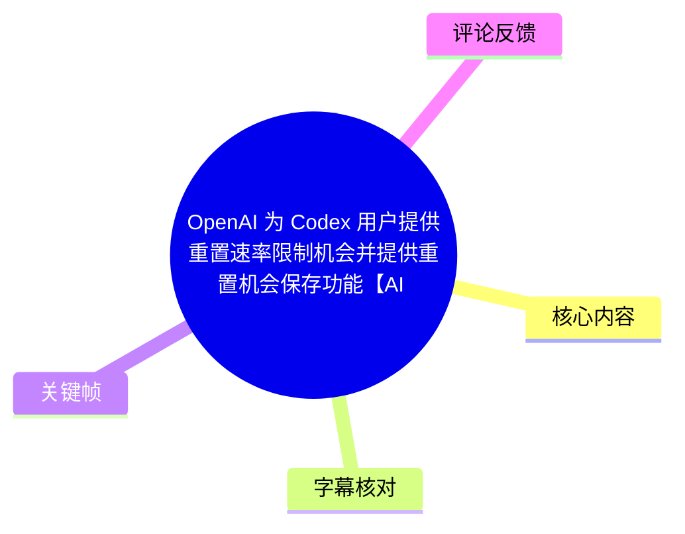
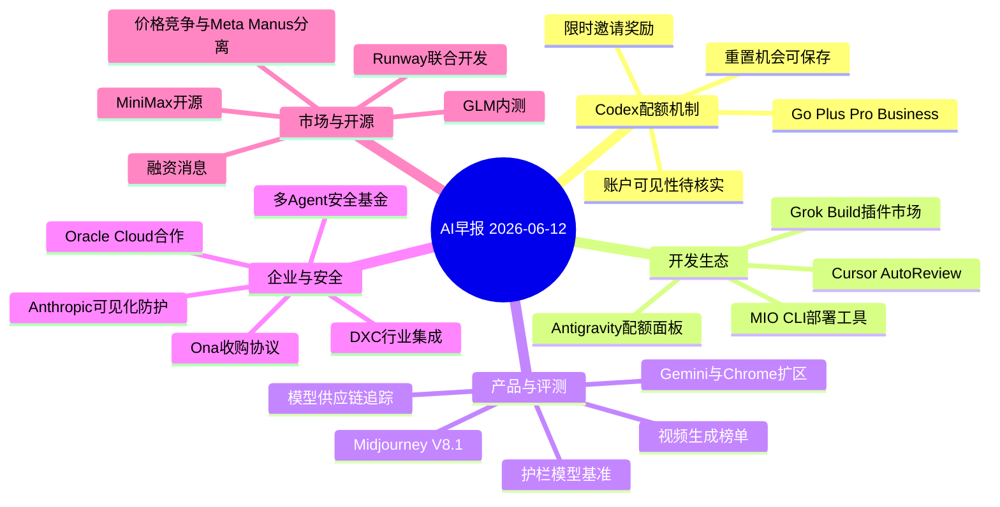
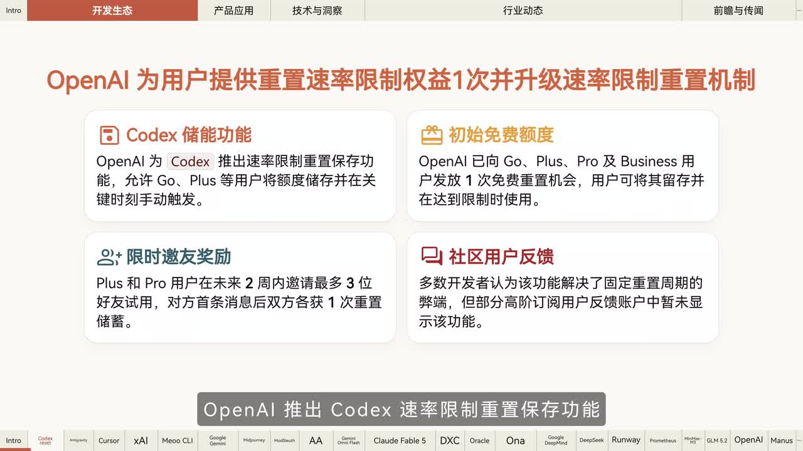
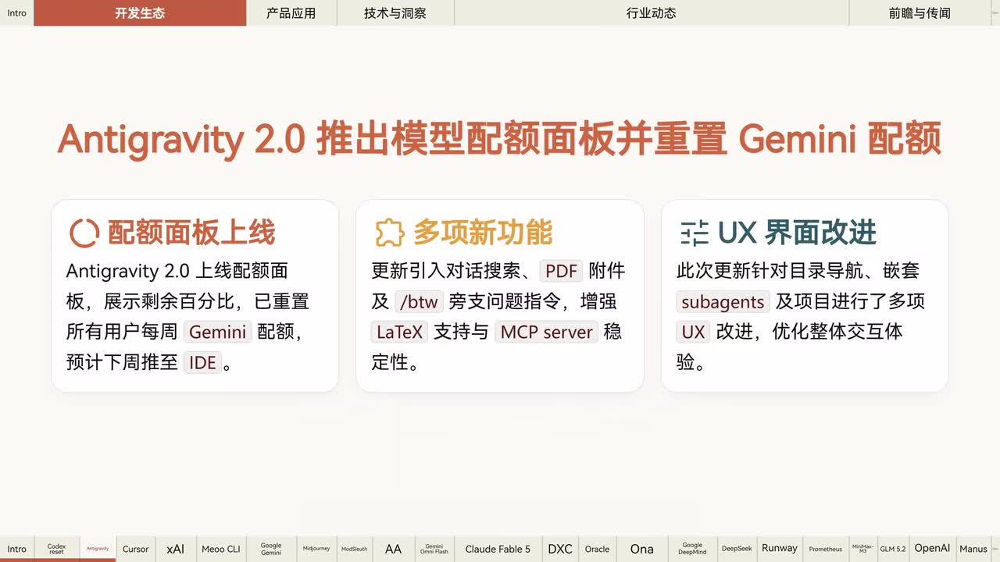
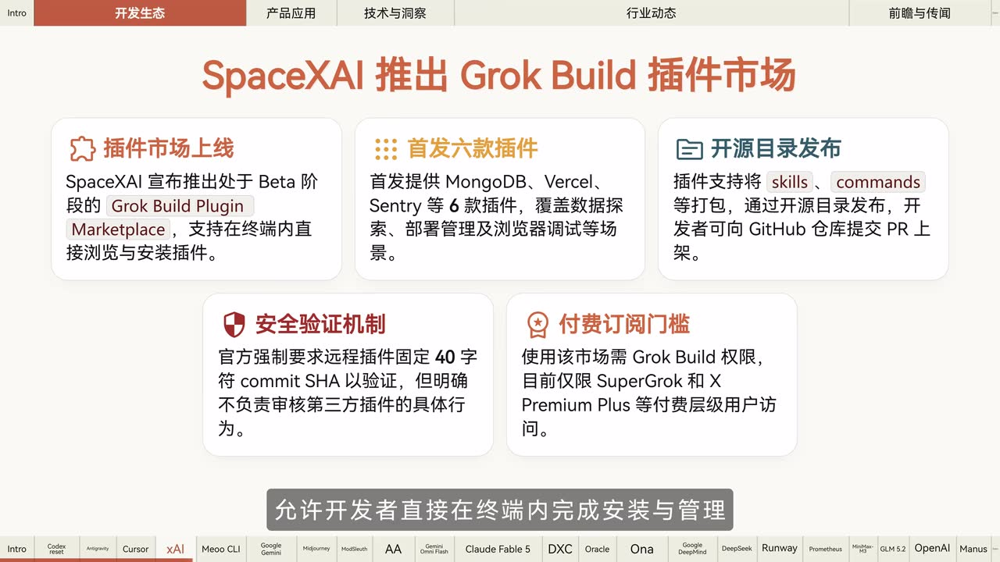
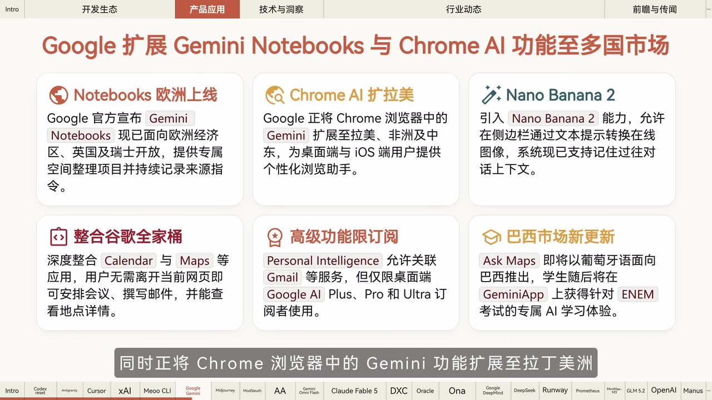

# OpenAI 为 Codex 用户提供重置速率限制机会并提供重置机会保存功能【AI 早报 2026-06-12】

> 来源：[Bilibili 视频](https://www.bilibili.com/video/BV1BnEk6eE7x)  
> UP 主：橘鸦Juya｜合集：AIcode｜时长：4 分 43 秒  
> 本文按视频播报时点整理。涉及“据报道”“据社区转述”“考虑中”“预计”“待批准”等内容，均不等同于已独立验证或当前仍有效的事实。

## 小结

本期是 2026 年 6 月 12 日的 AI 新闻速报，重点是 OpenAI 为 Codex 用户提供可保存的速率限制重置机会：Go、Plus、Pro、Business 用户可获一次免费重置，并在触及限额时手动使用；Plus、Pro 用户还可通过限时邀请好友积累额外重置储备。该设计将原本随周期恢复的配额，转化为可留作紧急任务使用的权益，但具体限额、失效时间、地区与账号可见性仍需以实际产品界面为准。

开发工具更新集中在配额可视化、Agent 风险控制、插件生态与云部署：Antigravity 2.0 计划提供模型配额面板并重置用户每周 Gemini 配额；Cursor 推出对本地 Agent 行为进行上下文风险审查的 AutoReview；Grok Build 上线 Beta 插件市场；阿里云 MIO 推出开源 MIO CLI，以衔接本地代码与云端后端服务。

产品与模型消息包括 Gemini Notebooks 的欧洲扩区、Chrome Gemini 在拉丁美洲、非洲和中东的扩展、Midjourney V8.1 替代 V7、AI2 的模型供应链追踪工具、护栏模型独立基准，以及 Arena.ai 所转述的视频生成模型榜单。视频对若干英文专名存在 ASR 误识别，本文仅在关键帧文字明确时校正，其他内容保留不确定性。

行业层面，视频涉及 Anthropic 将部分防护策略由静默处理改为可见拒绝或模型回退、Anthropic 与 DXC 的企业合作、OpenAI 与 Oracle 的云合作、OpenAI 收购 Ona 的协议、DeepMind 的多 Agent 安全研究基金，以及 Runway、MiniMax、GLM、Meta/Manus、模型价格竞争等消息。

适合关注 AI 编程产品、模型订阅配额、Agent 安全、企业云集成和生成式视频产业的读者。视频发布于 2026-06-12；其中“下周”“未来几周”“本周五”“Beta”“内测”“待监管批准”等均具有强时效性，不能直接视为当前产品状态。

## 思维导图

## 目录

- [阅读边界与时间性](#阅读边界与时间性)
- [Codex 重置机会与开发工具](#codex-重置机会与开发工具)
- [产品、模型与评测动态](#产品模型与评测动态)
- [安全、云合作与企业部署](#安全云合作与企业部署)
- [研究、资本、开源与市场消息](#研究资本开源与市场消息)
- [可执行关注清单](#可执行关注清单)
- [结论与限制](#结论与限制)
- [字幕比对](#字幕比对)
- [评论分析](#评论分析)
- [处理记录](#处理记录)

## 阅读边界与时间性 [00:00](https://www.bilibili.com/video/BV1BnEk6eE7x?t=0)

- 视频总时长为 283 秒。本次 ASR 有真实时间戳，覆盖 `00:00:00.340—00:04:42.200`，共 40 段；语音覆盖约 91.97%。
- ASR 诊断未标记 `noAudioStream=true`，且提供了音频文件与连续语音分段，说明源视频存在音轨；本次应以 ASR SRT 的起止时间作为章节跳转依据。
- 站内未提供可用字幕，因此无法进行站内字幕与 ASR 的逐句对照；正文采用“ASR 时间轴为准、关键帧可见文字补充或校正”的策略。
- 视频为新闻播报而非产品操作演示。除画面中明确可见的规则外，未提供具体接口、命令、价格、配额阈值、地区、版本号或服务条款时，本文不补写为确定事实。
- ASR 对英文实体与模型名存在误识别，例如 Grok、Midjourney、Claude、Lionsgate、Promedios 等。对不能由现有素材确认的名称，保留原转写或明确标注不确定性。

## Codex 重置机会与开发工具 [00:10](https://www.bilibili.com/video/BV1BnEk6eE7x?t=10)

### Codex：重置机会可保存，并可通过邀请增加储备 [00:10](https://www.bilibili.com/video/BV1BnEk6eE7x?t=10)

视频报道 OpenAI 为 Codex 推出速率限制重置保存功能。关键帧显示的信息包括：

1. **适用套餐**：Go、Plus、Pro、Business。
2. **初始权益**：符合条件的用户可获 **1 次免费重置机会**。
3. **保存与触发**：重置机会可以储存，用户在达到速率限制时手动使用。
4. **邀请奖励**：Plus、Pro 用户在未来 **2 周**内最多邀请 **3 位**好友试用；对方发送首条消息后，双方各获 **1 次重置储备**。
5. **可见性问题**：关键帧称部分高阶订阅用户反馈账户中暂未显示该功能。

> 图：该帧直接展示 Codex 储能功能、一次免费额度、两周内最多邀请 3 人的奖励条件，以及部分账户暂未显示功能的反馈。它为本期主新闻提供了比 ASR 更完整的套餐和资格边界。

**可迁移的使用经验：**

- 若该权益已出现在账户中，可将其视为应急配额，优先留给发布前修复、长链路编码任务或高优先级排障。
- 邀请奖励并非仅发送链接即可获得；按视频画面，需由受邀方完成“发送首条消息”这一触发条件。
- 视频没有说明单次重置恢复多少请求量、能否跨模型使用、储备是否过期、能否转让，不能据此推导可用 token 数量或收益。

### Antigravity 2.0：配额面板与 Gemini 配额重置 [00:23](https://www.bilibili.com/video/BV1BnEk6eE7x?t=23)

视频称 Antigravity 团队将推出模型配额使用面板，并重置所有用户的每周 Gemini 配额；该功能预计于“下周”进入 IDE 客户端。关键帧补充了以下功能：

- 配额面板显示剩余配额百分比；
- 新增对话搜索、PDF 附件与 `/btw` 旁支问题指令；
- 增强 LaTeX 支持与 MCP server 稳定性；
- 改进目录导航、嵌套 subagents 与项目相关 UX。

> 图：画面明确区分了“已重置所有用户每周 Gemini 配额”和“预计下周推至 IDE”的状态，并列出对话搜索、PDF、LaTeX、MCP server、subagents 等功能增量。

**限制：**“下周”是相对于视频发布日的描述；当前是否已上线、适用 IDE 版本、具体模型池和配额周期均未在视频中给出。

### Cursor AutoReview：对本地 Agent 操作进行风险审查 [00:33](https://www.bilibili.com/video/BV1BnEk6eE7x?t=33)

视频称 Cursor 发布 AutoReview 功能，通过“分类器 Agent”结合上下文审查操作风险，用于管控本地 Agent 的自主性；该功能面向新用户默认开启。

从播报可确认的机制是：在本地 Agent 执行相关操作时，引入结合任务上下文的风险分类环节。视频未披露其审查范围、准确率、误报率、是否可关闭、是否上传上下文或对哪些系统命令生效。

因此，AutoReview 可作为风险提示层，但不能替代沙箱、最小权限、代码审查、备份与人工确认。

### Grok Build 插件市场：终端安装、6 款首发插件与安全边界 [00:44](https://www.bilibili.com/video/BV1BnEk6eE7x?t=44)

视频画面称 SpaceXAI 推出 Beta 阶段的 **Grok Build Plugin Marketplace**，支持在终端内浏览、安装与管理插件。关键帧显示：

- 首发 **6 款插件**，举例包括 MongoDB、Vercel、Sentry，覆盖数据探索、部署管理、浏览器调试等场景；
- 插件可将 `skills`、`commands` 等打包，经开源目录发布；开发者可向 GitHub 仓库提交 PR 上架；
- 远程插件要求固定 **40 字符 commit SHA** 用于验证；
- 官方明确不负责审核第三方插件的具体行为；
- 该市场需要 Grok Build 权限，当时仅 SuperGrok、X Premium Plus 等付费层级用户可访问。

> 图：该帧同时呈现 Beta 状态、首发插件数量、开源目录发布机制、40 字符 commit SHA 要求、第三方插件免责边界与付费门槛，是理解该工具安全限制的关键画面。

**实践建议：**

1. 安装前核对插件发布仓库、固定 commit SHA、维护者身份与更新历史。
2. 审查插件对本地文件、网络、终端命令、环境变量和密钥的访问范围。
3. 不要将“固定 SHA 验证”误解为安全审计；它主要帮助锁定版本，不能证明插件行为无风险。
4. 先在隔离项目或低权限环境验证，再接触生产代码与凭据。

### MIO CLI：本地代码部署至云端 [00:55](https://www.bilibili.com/video/BV1BnEk6eE7x?t=55)

视频称阿里云旗下云端 AI 开发工具 MIO 推出开源命令行工具 **MIO CLI**，支持将本地生成的代码一键部署到云端，并直接接管数据库、文件存储等后端服务。

视频没有提供安装方式、代码仓库、许可证、认证流程、支持的语言或框架、数据库迁移策略、回滚机制、云资源计费与权限配置。因此，该段只能确认工具的产品定位，不能从素材中还原可执行部署命令。

## 产品、模型与评测动态 [01:10](https://www.bilibili.com/video/BV1BnEk6eE7x?t=70)

### Google：Gemini Notebooks 与 Chrome AI 功能扩区 [01:10](https://www.bilibili.com/video/BV1BnEk6eE7x?t=70)

视频称 Gemini Notebooks 已面向欧洲经济区、英国和瑞士开放；Chrome 浏览器中的 Gemini 功能正扩展至拉丁美洲、非洲和中东的桌面端及 iOS 用户。

关键帧进一步列出：

- Gemini Notebooks 提供专属项目空间，可持续记录来源指令；
- Chrome 侧边栏引入 Nano Banana 2，可用文本提示转换在线图像，并支持记住过去对话上下文；
- 可整合 Calendar、Maps 等服务，在当前网页内安排会议、撰写邮件及查看地点信息；
- Personal Intelligence 可关联 Gmail 等服务，但仅限桌面端 Google AI Plus、Pro、Ultra 订阅者；
- Ask Maps 将以葡萄牙语面向巴西推出；学生随后可在 Gemini App 使用面向 ENEM 考试的 AI 学习体验。

> 图：该帧把地区开放、终端范围、服务整合、订阅门槛与巴西市场更新放在一起，能够避免将局部开放误读为所有国家和账户均可使用。

### Midjourney、模型供应链工具与护栏评测 [01:24](https://www.bilibili.com/video/BV1BnEk6eE7x?t=84)

- **Midjourney**：视频称默认模型由 V7 更新至 V8.1。官方说法是新模型提升连贯性与稳定渲染能力，HD 模式下分辨率达到 V7 的 **4 倍**。视频未给出绝对像素、生成时间、价格或迁移方式。
- **AI2 工具**：ASR 将名称识别为“Moslos”，但可确认其功能为追踪大模型复杂供应链依赖，生成图谱以揭示隐藏的许可证继承与模型谱系。因工具英文名无法由现有素材可靠校正，本文不强行确定其正式名称。
- **Artificial Analysis 与 NVIDIA 报告**：视频称双方发布针对 AI 护栏和审核模型的独立基准测试报告，在 **3 个开放数据集**上衡量检测质量、延迟与内容拦截之间的权衡。素材未包含数据集名称、评分细节、模型排名或复现实验配置。

### Arena.ai 视频生成榜单 [01:57](https://www.bilibili.com/video/BV1BnEk6eE7x?t=117)

据视频转述的 Arena.ai 最新评测数据，Google 的“Gemini OmniFlash”模型登顶视频生成总榜，并在文生视频、图生视频两个项目中排名第一。

模型名、平台名与具体评测项目均可能受 ASR 转写影响；视频也未提供榜单截图、投票方法、样本数量、统计区间或完整排行。因此，该结论应限于“视频对评测结果的转述”，不能单独作为模型选型依据。

## 安全、云合作与企业部署 [02:08](https://www.bilibili.com/video/BV1BnEk6eE7x?t=128)

### Anthropic：从静默处理改为可见拒绝或回退 [02:08](https://www.bilibili.com/video/BV1BnEk6eE7x?t=128)

视频称 Anthropic 撤回了对“大模型开发相关请求”采取静默破坏的策略，承认这种不透明做法是错误权衡。自“本周起”，相关防护机制转为可见：

1. 系统会明确拒绝相关请求；或
2. 显示回退至较弱模型；
3. API 会返回具体原因。

ASR 将回退模型识别为“OPPA 4.8”，现有素材不足以确认正式模型名称。视频还明确指出，转为可见机制后，短期内可能增加无害请求的误报率。

对 API 或产品接入方而言，这意味着应处理拒绝原因、模型回退、重试策略、人工复核与任务降级，而不应将每次拒绝直接判定为用户存在恶意意图。

### Anthropic 与 DXC：受监管行业的多年联盟 [02:33](https://www.bilibili.com/video/BV1BnEk6eE7x?t=153)

视频称 Anthropic 与 DXC 达成多年全球联盟，DXC 将培训数万名认证工程师，并把 Claude 集成到银行等受监管行业的关键系统中。

该消息说明双方计划推进企业级人才培训与行业集成，但视频没有披露具体客户、部署国家、合规认证、数据驻留、责任边界、模型版本或上线时间。联盟宣布不等于具体银行系统已经完成部署。

### OpenAI 与 Oracle：通过 Oracle Cloud 提供模型与 Codex [02:44](https://www.bilibili.com/video/BV1BnEk6eE7x?t=164)

视频称 OpenAI 将在未来几周内通过 Oracle Cloud 提供 OpenAI 前沿模型和 Codex；企业客户可直接使用已有的 Oracle 云承诺额度支付。

可确认的限制是：

- 当时状态为“未来几周内”，并非已经全球全量可用；
- 结算方式指向既有 Oracle Cloud 承诺额度；
- 视频未说明模型清单、可用区、服务等级、数据处理规则、价格折算或技术接入方式。

### OpenAI 收购 Ona：面向长时任务与生产 Agent 的安全执行 [02:54](https://www.bilibili.com/video/BV1BnEk6eE7x?t=174)

视频称 OpenAI 已就收购 **Ona** 达成协议，其安全云执行技术预期帮助 Codex 处理耗时更长的任务，并帮助企业在生产环境中安全部署 Agent；交易仍待监管机构批准。

应区分以下状态：

- **协议状态**：已就收购达成协议；
- **预期作用**：增强长任务处理与生产环境 Agent 部署；
- **完成条件**：仍待监管批准。

视频未展示 Ona 的具体架构、隔离机制、权限模型、审计能力或整合时间表，因此不能推定该能力已被 Codex 用户实际使用。

## 研究、资本、开源与市场消息 [03:09](https://www.bilibili.com/video/BV1BnEk6eE7x?t=189)

### Google DeepMind：最高 1,000 万美元多 Agent 安全基金 [03:09](https://www.bilibili.com/video/BV1BnEk6eE7x?t=189)

视频称 Google DeepMind 联合多家机构启动最高 **1,000 万美元**的多 Agent 安全研究基金，面向全球学者征集提案，重点研究大规模 AI Agents 交互带来的不可预测集体行为与安全风险。

视频未说明单个项目资助额度、申报截止时间、评审流程、资助机构名单或研究成果的开放要求。

### 上下文管理与 Multi-Agent 产品探索片段 [03:26](https://www.bilibili.com/video/BV1BnEk6eE7x?t=206)

该段 ASR 仅可稳定识别出“探索上下文管理、multiagents 等前沿领域，将前沿模型能力转化为领先的 agent 产品”。主体名称在 ASR 中缺失或识别不可靠，关键帧也未覆盖这一条。

为避免编造，本文仅保留可确认信息：视频提到**上下文管理**与**多 Agent**是某项 Agent 产品探索的方向，无法据现有素材确认公司、产品名与完整背景。

### Lionsgate、Runway 与短篇内容联合开发 [03:34](https://www.bilibili.com/video/BV1BnEk6eE7x?t=214)

视频称“Linesgate”已入股 Runway，双方将启动联合开发计划，并首先利用 Runway 生成式模型与既有 IP 推出短篇内容。该公司名很可能存在 ASR 拼写误差，缺乏站内字幕或关键帧文字支持，故不将其强行改写为特定实体。

视频未说明投资规模、参与 IP、版权安排、生成内容审核方式或发行平台。

### Promedios 融资消息 [03:48](https://www.bilibili.com/video/BV1BnEk6eE7x?t=228)

视频称 Besos 旗下 AI 初创公司“Promedios”完成 **120 亿美元**融资，估值达 **410 亿美元**；公司聚焦物理任务模型，尚未发布产品。

该公司名、所属关系及英文实体均可能受 ASR 误识别，且素材未提供原始报道、融资公告或关键帧佐证。应将其视为视频转述的行业消息，不宜直接作为已经核实的财务事实。

### MiniMax 开源与 GLM 5.2 内测 [04:00](https://www.bilibili.com/video/BV1BnEk6eE7x?t=240)

- **MiniMax**：视频称其开源高性能 MSA kernel “Kudo”，并预计于本周五公开 MiniMax M3 模型权重。名称“MSA kernel Kudo”依 ASR 转写，视频未给出仓库、许可证、硬件要求、性能数据或确切发布日期。
- **GLM 5.2**：据社区转述的飞书群消息，GLM 5.2 已开启内测，但资格并非向所有 Max 用户开放。这属于社区二手信息，不能视为正式公开发布或统一资格规则。

### OpenAI 潜在降价与 Meta/Manus 分离 [04:17](https://www.bilibili.com/video/BV1BnEk6eE7x?t=257)

- 据《华尔街日报》援引知情人士的消息，OpenAI 正考虑大幅降低 AI 模型 token 价格，以争夺 Anthropic 用户，并预计竞争方可能采取类似降价措施。该内容属于“考虑中”的市场消息，视频没有提供降幅、模型范围、生效日期或定价单位。
- 据媒体报道，在相关监管部门撤销某收购案要求后，Meta 与 Manus 已完成运营分离，并切断数据共享与内部系统访问权限。ASR 未能可靠识别监管机构与具体案件名称，因此只能确认视频所转述的“运营分离”和“数据/系统权限切断”这一层信息。

## 可执行关注清单 [00:10](https://www.bilibili.com/video/BV1BnEk6eE7x?t=10)

以下是根据视频内容整理的核查顺序，不是视频提供的具体操作教程。

1. **检查 Codex 权益是否到账**：确认套餐资格、储备次数、重置入口、触发条件和失效时间，不因新闻而假定所有账号均可用。
2. **为重置机会设置任务优先级**：把可储存的重置机会留给业务关键或时间敏感任务；在使用前确认其究竟恢复哪一种限制。
3. **审查插件供应链**：对 Grok Build 或同类插件市场，核验固定 commit SHA、仓库来源、权限范围、网络访问和密钥处理；平台不审核第三方行为时尤其需要人工审查。
4. **为本地 Agent 设置纵深防护**：即便启用 AutoReview，也应保留沙箱、最小权限、命令确认、文件备份和人工复核。
5. **企业评估云端合作时核对正式条款**：对于 Oracle Cloud、Ona 等消息，重点确认可用区域、模型范围、承诺额度结算、数据治理、审计、隔离与 SLA。
6. **对时效性消息回查原始来源**：MiniMax 权重、GLM 内测、OpenAI 价格变化、Meta/Manus 关系变化等，应以使用当日的官方公告、代码仓库、合同或价格页为准。

## 结论与限制 [04:40](https://www.bilibili.com/video/BV1BnEk6eE7x?t=280)

本期最直接影响开发者体验的更新，是 Codex 将速率限制重置设计为可保存权益，并加入邀请获得额外储备的机制。它与 Antigravity 的配额面板、Cursor 的 Agent 风险审查、Grok Build 的插件分发、MIO CLI 的部署定位共同反映出 AI 编程工具的竞争重点，正从单一模型能力扩展到配额运营、执行安全、生态分发与企业接入。

视频中的关键限制同样重要：Codex 的详细配额规则并未给出；Antigravity、Oracle 等信息包含相对时间；Grok 插件市场明确存在第三方行为免责边界；Anthropic 的可见化防护可能提高误报；Ona 收购仍待监管批准；多条资本、价格与内测消息源自媒体或社区转述。

因此，应避免将“新闻宣布”直接理解为“当前所有用户可用”，将“达成协议”理解为“交易完成”，或将“评论和传闻”视为可验证的产品事实。

## 字幕比对 [00:00](https://www.bilibili.com/video/BV1BnEk6eE7x?t=0)

| 字幕来源 | 完整性 | 专有名词 | 时间轴 | 主要问题 |
| --- | --- | --- | --- | --- |
| Bilibili 站内字幕 | 未提供可用字幕 | 无法评估 | 无法使用 | 素材明确标注“未提供可用站内字幕” |
| 本次 ASR 字幕 | 较完整，共 40 段，语音覆盖约 91.97% | 多个英文公司、工具和模型名存在误识别 | 可用，含 `00:00:00.340—00:04:42.200` 的真实时间分段 | 部分名称音近转写；约 03:26 处新闻主体无法可靠识别 |

**最终字幕选择：**采用本次 ASR SRT 作为全部时间轴链接的依据。由于站内无可用字幕，无法进行逐句合并；正文对关键帧中清晰可见的文字优先校正，对无法确认的专有名词不作强行补全。

**通过关键帧确认或补足的信息：**

- Codex：Go、Plus、Pro、Business 套餐；一次免费重置；两周内最多邀请 3 人；受邀者首条消息后双方各获一次储备；部分高阶订阅账户暂未显示。
- Antigravity 2.0：剩余额度百分比面板、每周 Gemini 配额重置、预计推至 IDE，以及 PDF、`/btw`、LaTeX、MCP server、subagents 等更新。
- Grok Build：Beta 状态、6 款首发插件、开源目录和 GitHub PR 上架、40 字符 commit SHA、第三方插件免责边界、付费订阅门槛。
- Google：Gemini Notebooks 开放区域、Chrome Gemini 扩区、Nano Banana 2、Calendar/Maps 整合、Personal Intelligence 的桌面端订阅限制，以及巴西相关更新。

## 评论分析 [00:10](https://www.bilibili.com/video/BV1BnEk6eE7x?t=10)

以下仅分析可获取热评前三条；评论反映观众态度，不构成新闻事实或产品规则证据。

1. **racrefu（250 赞）**：“坏了，奥特曼这是真被 a 社干得闪红灯了[doge]”
   - 观点：以调侃方式将 OpenAI 增加重置权益理解为受到 Anthropic 等竞争压力的反应。
   - 补充价值：反映观众将配额权益与模型市场竞争联系起来。
   - 边界：评论没有提供数据或来源，不能证明 OpenAI 推出该机制的真实商业动机。

2. **STM_fan（152 赞）**：“什么叫你们家的额度重置是可以存着用的权益[微笑]”
   - 观点：关注“重置机会可储存”这一差异化设计。
   - 补充价值：准确抓住本期最具用户感知的机制变化。
   - 边界：没有补充储存上限、失效期或适用模型，具体规则仍需以账户页面和官方说明为准。

3. **叫我壮志凌云云云（102 赞）**：“[doge]接下来就会有出售重置额度的了。然后又有畜生会去举报。”
   - 观点：担心可储存权益可能导致转售或灰色交易。
   - 补充价值：提出额度转让、滥用与平台治理的潜在风险。
   - 边界：这只是预测。视频没有说明额度是否可转让、是否与账户绑定或平台反滥用机制，不能据此认定会出现交易市场。

## 处理记录 [00:00](https://www.bilibili.com/video/BV1BnEk6eE7x?t=0)

- **Worker ID**：worker-mrj0wbly-5dc4e50c
- **模型**：gpt-5.6-terra
- **使用工具与素材**：视频元数据、ASR 诊断、`asr/transcript.srt`、ASR 分段结果、关键帧、热评数据。
- **字幕选择**：已检查本次 ASR。诊断未标记 `noAudioStream=true`，且有连续音频识别结果；站内未提供可用字幕，故采用 ASR 时间戳作为章节链接依据，并以关键帧可见文字辅助校正。
- **关键帧依据**：选用 `frames/frame-001.jpg`、`frames/frame-002.jpg`、`frames/frame-003.jpg`、`frames/frame-004.jpg`。它们分别对 Codex 权益、Antigravity 配额面板、Grok Build 插件市场安全边界、Google 功能地区与订阅限制提供直接信息增益。
- **缓存清理**：未提供缓存清理执行日志；不虚构清理结果。
- **未解决问题**：无站内字幕可交叉验证；若干英文专名受 ASR 误识别影响；约 03:26 新闻主体缺失；融资、收购、监管与价格消息未附原始公告或报道全文，需另行核验。

## 评论分析

- 热评 1：坏了，奥特曼这是真被 a 社干得闪红灯了[doge]
- 热评 2：什么叫你们家的额度重置是可以存着用的权益[微笑]
- 热评 3：[doge]接下来就会有出售重置额度的了。然后又有畜生会去举报。

以上内容是观众反馈摘录，只用于补充理解视频反响，不作为正文事实依据。
