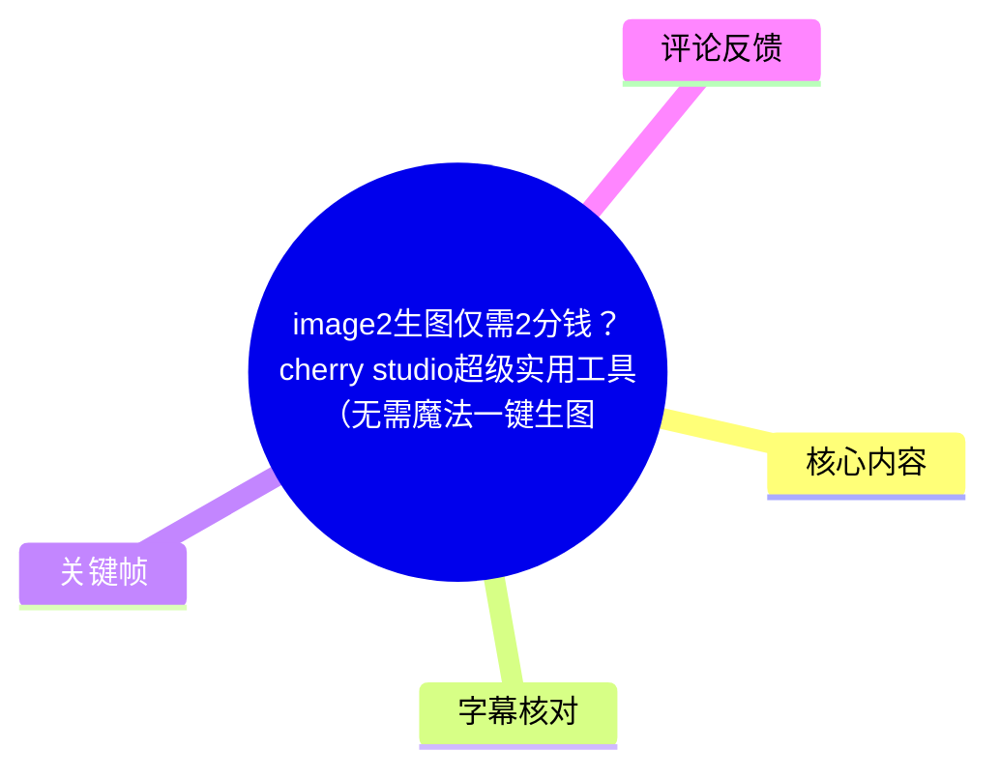
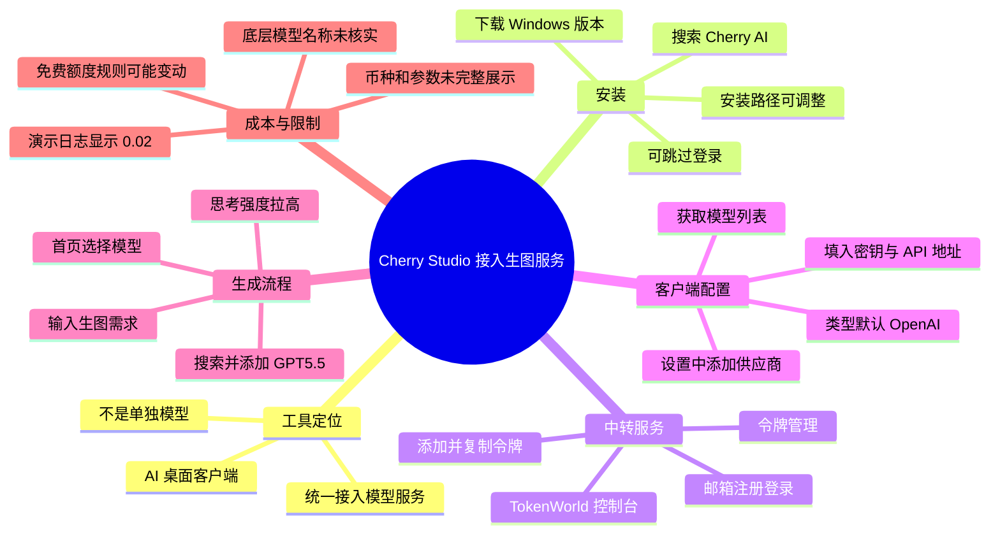
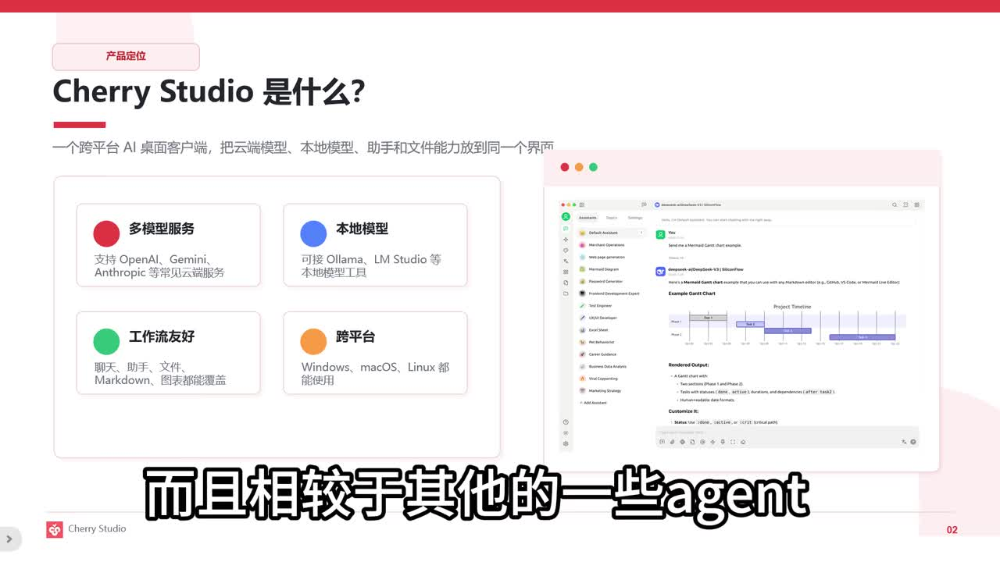
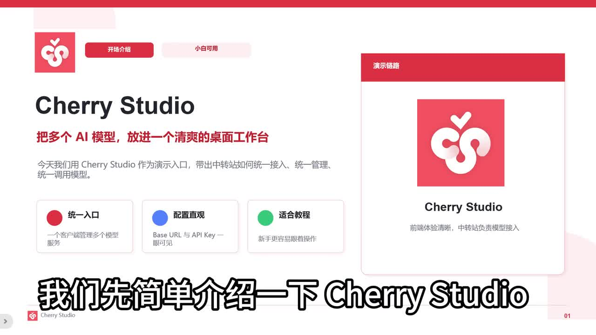
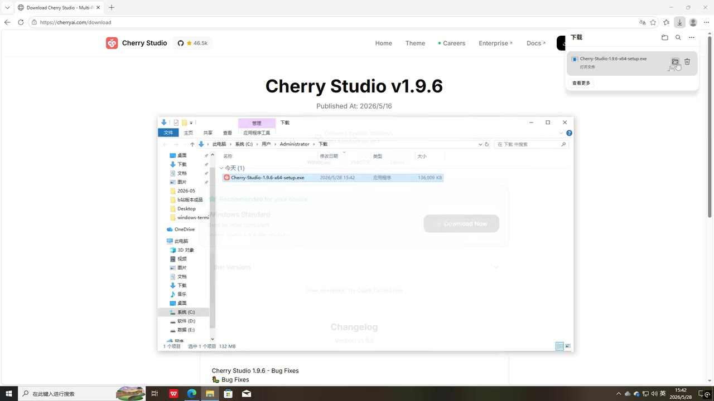

# image2生图仅需2分钱？cherry studio超级实用工具（无需魔法一键生图）

> 来源：[Bilibili 视频](https://www.bilibili.com/video/BV1aoVH6DE1h) 
> UP 主：nini喵2022｜时长：03:31｜分区合集：AIcode  
> 视频简介提供的网址：`cherryai.com`、`tokenworldai.com`

## 小结

视频演示了一条通过 **Cherry Studio 桌面客户端**接入第三方中转服务、再选择模型进行图片生成的操作链路。作者将 Cherry Studio 定位为 AI 桌面客户端，而非某个单独的大模型；其作用是统一接入并调用模型服务。

核心操作分为两部分：先从 `cherryai.com` 下载并安装 Windows 版 Cherry Studio，再到视频所称的 TokenWorld 中转站注册、创建令牌，并将令牌和 API 地址配置到 Cherry Studio 的“供应商”设置中。随后获取模型列表、添加视频中搜索到的“GPT5.5”模型，并在首页选择该模型生成图片。

价格是本视频最需要谨慎理解的信息。作者在中转站使用日志中展示“实际消耗 0.02”，并口述其“还不到三分钱”；若单位为人民币元，则 0.02 元通常相当于 2 分，但视频画面与字幕没有完整展示币种、计费单位、图片尺寸、生成张数、模型实际标识及附加参数。因此，“一张仅需两分钱”只能视为该作者当时演示的一次账单结果，不能作为稳定报价或成本承诺。

视频称虽然对话界面选的是“GPT5.5”，实际调用的是字幕中写作“GPT1”的模型；但该型号表述缺少完整、可核实的名称，且本次 ASR 将此处识别为“GP T1 秘制2”。因此，不能据此确认具体底层图像模型，更不能把它等同于公开产品名。

该教程适合希望在 Windows 上快速试用第三方 API 模型、理解“客户端—供应商—API Key—模型列表”接入关系的初学者。使用前应特别核验中转服务的域名、API Base URL、模型名称、数据与隐私条款、账单单位及余额规则；不要仅因视频中可用而直接将生产数据或长期密钥交给第三方服务。

## 思维导图

## 目录

- [工具定位与适用边界](#工具定位与适用边界)
- [下载安装 Cherry Studio](#下载安装-cherry-studio)
- [注册中转服务并创建令牌](#注册中转服务并创建令牌)
- [在 Cherry Studio 中配置供应商](#在-cherry-studio-中配置供应商)
- [添加模型并执行图片生成](#添加模型并执行图片生成)
- [成本展示、限制与时效性](#成本展示限制与时效性)
- [字幕比对](#字幕比对)
- [评论分析](#评论分析)
- [处理记录](#处理记录)

## 工具定位与适用边界 [00:00:06](https://www.bilibili.com/video/BV1aoVH6DE1h?t=6)

作者先说明 Cherry Studio 不是单独的模型，而是一个 AI 桌面客户端；视频将其描述为编程人员可用于测试模型能力的便携平台。作者推荐它的理由是使用方便，并认为相较于部分 Agent 类工具，它更接近于直接调用大模型，因此在某些场景可降低消耗。

关键帧中的演示页补充了视频的产品定位：其文字称其为“跨平台 AI 桌面客户端”，并列出多模型服务、本地模型、工作流友好和跨平台等能力。这些内容属于视频画面陈述，不代表本整理对软件当前功能范围的独立验证。

> 图：该画面以“Cherry Studio 是什么？”为题，展示“多模型服务”“本地模型”“工作流友好”“跨平台”等定位。它有助于区分“客户端/接入层”和“具体生成模型”这两个概念，避免把 Cherry Studio 误认为生图模型本身。

### 视频中明确的前置条件

- 使用 Windows 进行演示；作者实际下载的是 Windows 版本。
- 需要浏览器访问下载站及中转服务控制台。
- 需要可注册的邮箱，以便注册中转服务账号。
- 若要调用第三方模型，需要自行创建并保管 API 令牌。
- 视频未展示网络连通性、支付充值、账户实名认证、服务地区限制或 API 服务等级等前置条件，不能据此推定这些条件不存在。

> 图：开场页写明以 Cherry Studio 作为演示入口，并将流程概括为统一入口、配置直观、适合教程。它适合作为理解全片“客户端接第三方服务”主线的总览，而非具体参数依据。

## 下载安装 Cherry Studio [00:00:39](https://www.bilibili.com/video/BV1aoVH6DE1h?t=39)

作者的安装流程如下：

1. 打开浏览器。
2. 搜索“Cherry AI”。
3. 进入下载页面并点击下载。
4. 选择 Windows 版本。
5. 打开安装程序，按向导持续点击“下一步”。
6. 如不希望安装在 C 盘，可在安装过程中自行选择下载/安装路径。
7. 安装完成后，作者选择“跳过登录”。

视频称客户端内置免费版“千问模型”，但也强调：若要进行图片生成，仍需配置其他模型服务。该表述只说明作者演示环境中的状态；内置模型、免费额度和功能入口可能随客户端版本改变。

> 图：画面显示 Cherry Studio 下载页面及已下载的 Windows 安装程序，页面可见版本号“v1.9.6”和发布日期“2026/5/16”。该关键帧为视频演示时所见版本信息，能帮助复现者理解界面可能与其他版本不同。

### 安装阶段的经验与限制

- 作者提供的是图形界面安装方式，没有展示命令行安装、macOS 或 Linux 安装流程。
- “一路下一步”并不等于无需审查安装选项；安装位置、快捷方式及许可提示应由使用者自行确认。
- 视频简介写为 `cherryai.com`，下载画面的地址栏也显示 `https://cherryai.com/download`。这可作为视频内来源线索，但仍应在访问前确认域名和 HTTPS 证书。

## 注册中转服务并创建令牌 [00:01:20](https://www.bilibili.com/video/BV1aoVH6DE1h?t=80)

安装完成后，作者新开浏览器并输入字幕写作“token word app”的地址；视频简介给出 `tokenworldai.com`。进入控制台后，作者说明可使用邮箱注册账号，自己因已在上期视频注册过，所以没有完整演示注册流程。

创建密钥的步骤是：

1. 登录中转服务控制台。
2. 点击“令牌管理”。
3. 选择“添加令牌”。
4. 为令牌填写一个自定义名称。
5. 点击提交。
6. 令牌生成后复制，准备返回 Cherry Studio 使用。

### 密钥管理要点

视频只演示“复制并粘贴”操作，没有讨论安全管理。实际使用时应注意：

- API Key 属于敏感凭据，不应在截图、公开提示词、日志或代码仓库中泄露。
- 建议按用途创建可识别的令牌名，便于后续撤销和审计。
- 怀疑泄露时应立即在服务端吊销旧令牌并生成新令牌。
- 视频没有展示令牌权限范围、过期策略、额度上限或 IP 白名单；这些能力是否存在不可从视频推断。

## 在 Cherry Studio 中配置供应商 [00:02:02](https://www.bilibili.com/video/BV1aoVH6DE1h?t=122)

作者回到 Cherry Studio 后进行第三方服务接入，顺序为：

1. 点击右上角“设置”。
2. 在下方选择“添加供应商”。
3. 供应商名称可自行命名。
4. 类型保持或选择默认的 **OpenAI**。
5. 粘贴刚才复制的密钥。
6. 填写 API 地址。
7. 点击“获取模型列表”。

视频口述“API 地址实际就是网站的地址”，并演示从浏览器复制地址后粘贴到客户端。这里需要特别保留限制：视频没有展示完整 API 地址字段内容，也没有独立证明网页首页地址必然等同于 API Base URL。许多兼容 OpenAI 的服务需要专用 API 端点，而不是网站首页；应以服务商当前控制台、API 文档或连接测试结果为准。

### 配置字段整理

| 字段/动作 | 视频中的做法 | 可确认程度 | 注意事项 |
| --- | --- | --- | --- |
| 供应商名称 | 可自定义 | 视频明确展示 | 仅用于识别，不等同于模型厂商身份 |
| 类型 | 默认 OpenAI | 视频字幕明确 | 表示作者以 OpenAI 兼容方式配置；不表示底层服务由 OpenAI 官方提供 |
| API Key | 粘贴刚生成的令牌 | 视频明确展示 | 必须保密；不要截图外传 |
| API 地址 | 从网站复制后粘贴 | 视频口述与演示 | 未展示完整端点；应查服务商文档核对 |
| 获取模型列表 | 点击按钮获取 | 视频明确展示 | 获取成功与否取决于网络、密钥、端点和服务状态 |

## 添加模型并执行图片生成 [00:02:38](https://www.bilibili.com/video/BV1aoVH6DE1h?t=158)

在获取到模型列表后，作者在上方搜索“GPT5.5”，点击加号添加模型，关闭设置并回到首页；随后在模型选择位置选中刚添加的模型。

生成阶段的操作如下：

1. 在首页选择已添加的“GPT5.5”模型。
2. 将“思考强度”拉到最高。
3. 输入希望生成的图片内容。
4. 等待生成结果。
5. 到中转站“使用日志”查看实时消耗。

作者表示，虽然对话对象显示为“GPT5.5”，实际调用的是字幕写作“GPT1”的模型，且其生成效果“非常不错”。但视频未给出完整的模型 ID、请求参数、提示词原文、输出尺寸、图片数量、种子、是否启用编辑/重绘，以及“思考强度”对生图调用的实际影响机制。

因此，这一段可复现的是**界面操作路径**，而不能复现出确定的视觉结果或固定成本。

### 关于模型名的文本歧义

- 站内字幕：写作“GPT5.5”“GPT1”。
- 本次 ASR：写作“GPT5.5”“GP T1秘制2”，后半部分存在明显识别错误。
- 视频标题包含“image2生图”，但站内字幕没有将实际底层模型清晰标为“image2”。
- 结论：本素材不足以确认“GPT1”或“image2”分别对应何种正式 API 模型名称；应以服务控制台中的模型 ID 与官方文档为准。

## 成本展示、限制与时效性 [00:03:15](https://www.bilibili.com/video/BV1aoVH6DE1h?t=195)

作者最后进入中转站的“使用日志”查看费用，口述这张图片“实际消耗 0.02，还不到三分钱”。视频开头则以“生成一张图片仅需两分钱”作为卖点。

这一成本信息的可用边界如下：

| 项目 | 视频可确认的信息 | 未展示或无法确认的信息 |
| --- | --- | --- |
| 单次消耗 | 日志中被作者读作“0.02” | 币种、单位、税费、是否含请求附加费用 |
| 结果数量 | 作者称“这张图片” | 是否一次请求只返回一张图 |
| 生成模型 | 界面选中“GPT5.5”，作者称实际调用“GPT1” | 完整模型 ID、版本与计费规则 |
| 图像规格 | 未明确 | 分辨率、比例、质量档位、是否高清 |
| 提示词 | 作者输入了图片需求 | 提示词全文与负面提示词 |
| 计费时点 | 视频录制时的使用日志 | 当前价格、余额门槛、促销或套餐规则 |

### 时效性提醒

1. 视频元数据的发布时间为 2026-05-28；软件版本、模型清单、API 路径及价格均可能已变化。
2. 视频下载页画面显示 Cherry Studio `v1.9.6`；其他版本的菜单位置与配置字段可能不同。
3. 热评中，UP 主称中转站因被注册机批量获取免费 1 元额度，已将免费赠送额度调整为 **0.199 元**。该信息是评论中的服务状态补充，并非本整理能够独立验证的现行规则。
4. “无需魔法”是标题中的宣传性表述。视频本身只展示了作者环境中的访问与配置过程，未对不同地区、网络环境或服务可用性作保证。

## 字幕比对

| 字幕来源 | 完整性 | 专有名词 | 时间轴 | 主要问题 |
| --- | --- | --- | --- | --- |
| Bilibili 站内字幕 | 覆盖 00:00:00.080—00:03:30.240，内容分句完整 | Cherry Studio、OpenAI、GPT5.5、TokenWorld 等整体较可读 | 与视频完整时长基本一致，分段细 | “cloud code”“Open cloud”“GPT1”等名称未给出标准拼写或来源；“API 地址就是网站地址”缺少完整字段展示 |
| 本次 ASR 字幕 | 诊断显示语音覆盖约 74.88%，但首段从 00:00:25.900 开始，漏掉前约 26 秒的有效内容 | 多处误识别，如 Chery/Cherie、Token World、APD 纸、令墙、GP T1 秘制2 | 有时间戳，但首段与站内字幕相比整体明显后移且段落过长 | 繁简混用、切分粗糙、专名错误较多，不能单独作为操作依据 |

### 最终字幕选择

正文以 **Bilibili 站内 SRT** 作为主时间轴依据，因为其覆盖从开头到结尾的完整时段，且句级分段清晰；所有章节链接均按站内字幕的真实起止时间换算秒数生成。

本次 ASR 已完成检查：识别语言为中文，模型为 `medium`，音频时长约 210.26 秒，未标记 `noAudioStream=true`，说明源视频存在可识别音轨。由于 ASR 的首个语音段落从 25.9 秒开始、与站内字幕开头明显不一致，且专有名词误识别较多，未将其作为主字幕。

结合站内字幕、视频简介与关键帧，可作如下保守校正：

- “Chery Studio / Cherie Studio”统一记为 **Cherry Studio**。
- 视频简介给出 `cherryai.com` 与 `tokenworldai.com`；正文保留这两个字符串，不扩展为未展示的 API 路径。
- ASR 的“令墙”结合站内字幕校正为“令牌”。
- ASR 的“APD纸”结合站内字幕校正为“API 地址”。
- “GPT1”及相关表述无法从现有素材核实为正式模型名，故保持“字幕所写”并标注不确定性。

## 评论分析

本次可获取的热评前三条中仅返回 **1 条**，其余两条未提供，以下不补写或推测。

### 热评 1：免费额度调整

- 评论者：`nini喵2022`（UP 主）
- 点赞数：27
- 评论内容概括：中转站方面称，因注册机批量获取免费 1 元额度，免费赠送额度已调整为 **0.199 元**。
- 补充价值：该评论直接补充了视频之外的免费额度变化，说明教程录制后的试用门槛或规则可能已经调整。
- 可信度与边界：评论来自 UP 主，具有解释视频相关服务变动的参考价值；但它仍是转述的服务状态，未附官方公告、时间范围或适用账户条件，不能视为已独立验证的长期政策。
- 对实践的影响：计划按“免费 1 元额度”进行试用的用户，应先进入服务控制台确认当前赠送额度、充值规则与计费标准。

## 处理记录

- Worker ID：`worker-mrj0wjed-b0c290ad`
- 整理模型：`gpt-5.6-terra`
- 已使用素材与工具产物：视频元数据、站内字幕 `p01-ai-zh.srt`、本次 ASR 结果 `asr/asr-result.json` 与时间轴文本、关键帧目录、热评数据。
- ASR 信息：识别模型 `medium`，语言 `zh`，CUDA / `float16`；存在音轨，`noAudioStream` 未标记为 `true`。
- 字幕选择：以站内 SRT 为主时间轴；ASR 用于交叉检查覆盖、音轨状态及文本差异，未用于替换站内时间轴。
- 关键帧选择依据：选取 `frame-001`、`frame-002` 解释工具定位，选取 `frame-004` 支撑 Windows 下载与版本画面；未使用无法从已提供画面确认内容的关键帧，避免补充未经展示的信息。
- 评论处理范围：仅处理可获取热评前三条；本次实际仅获取到 1 条。
- 缓存清理：素材未提供缓存清理执行记录，无法确认是否已清理；本整理不虚构清理结果。
- 未解决问题：第三方服务的准确 API Base URL、正式模型 ID、当前可用性、支付与隐私条款、图片尺寸及实际计费单位均未在素材中完整展示，需以服务商当期文档和控制台为准。
