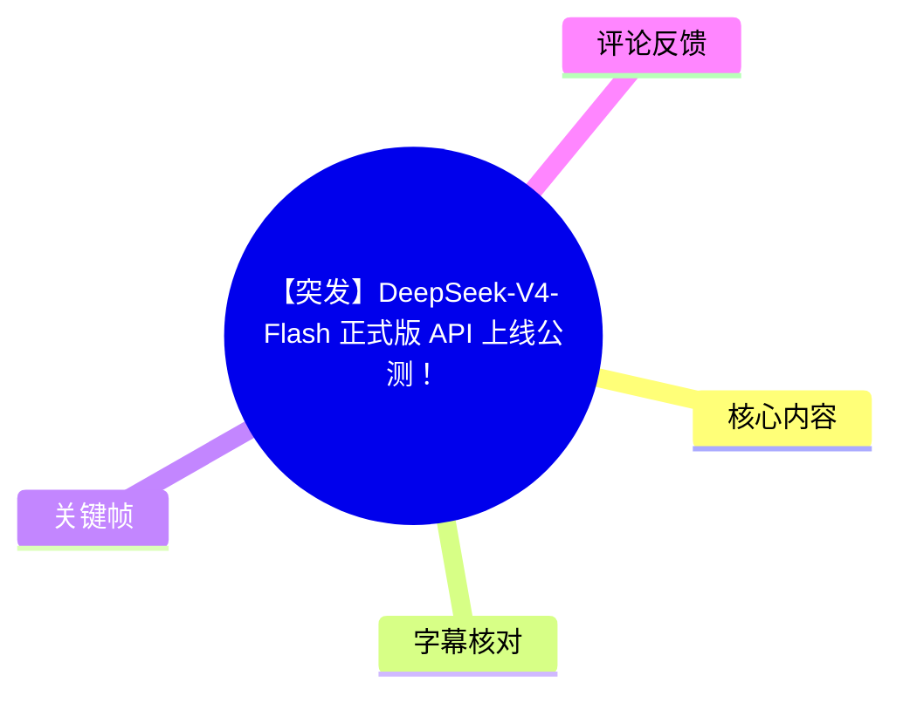
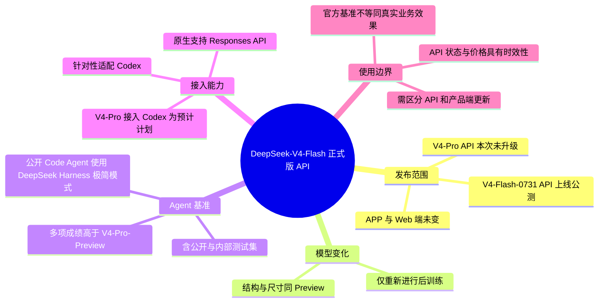
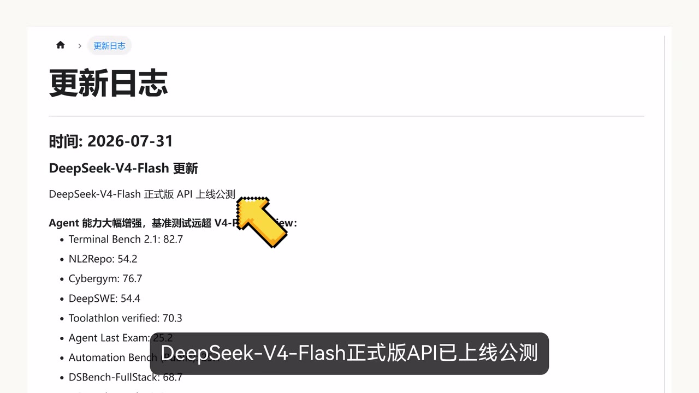
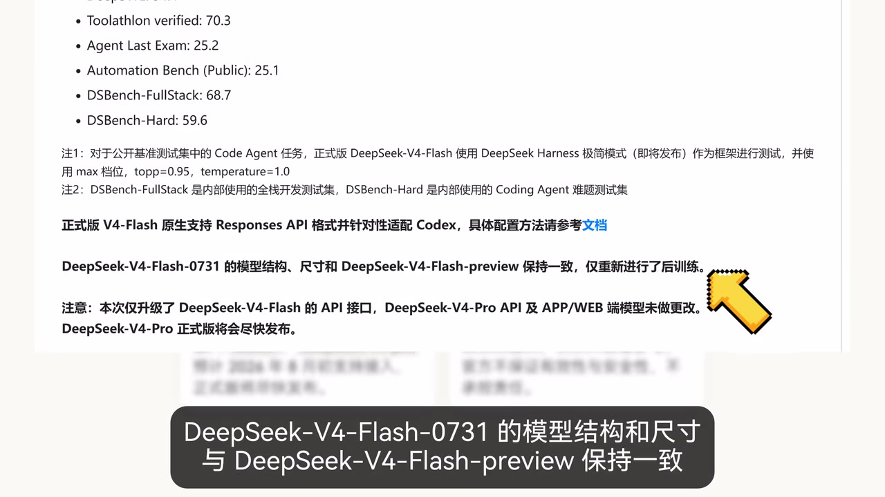
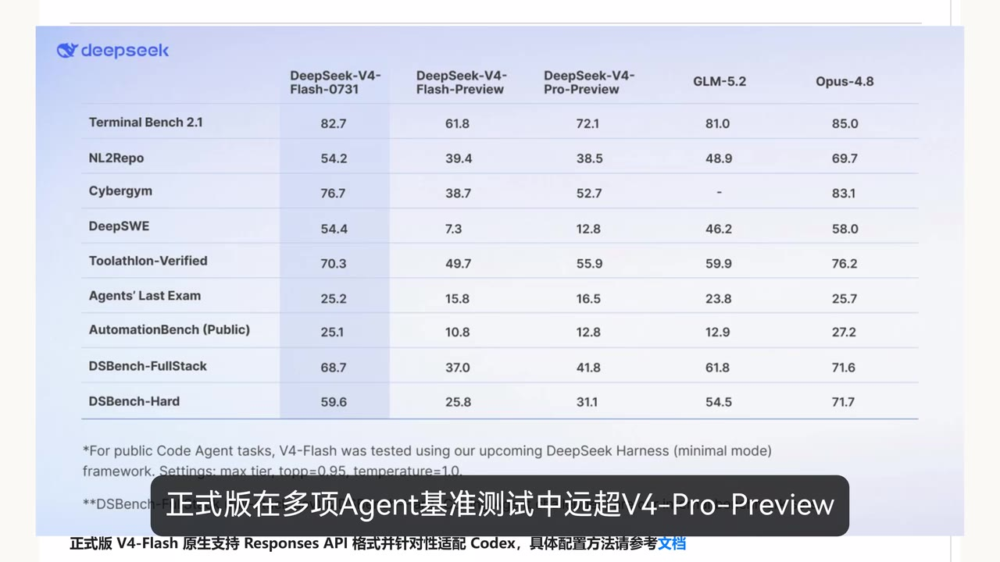
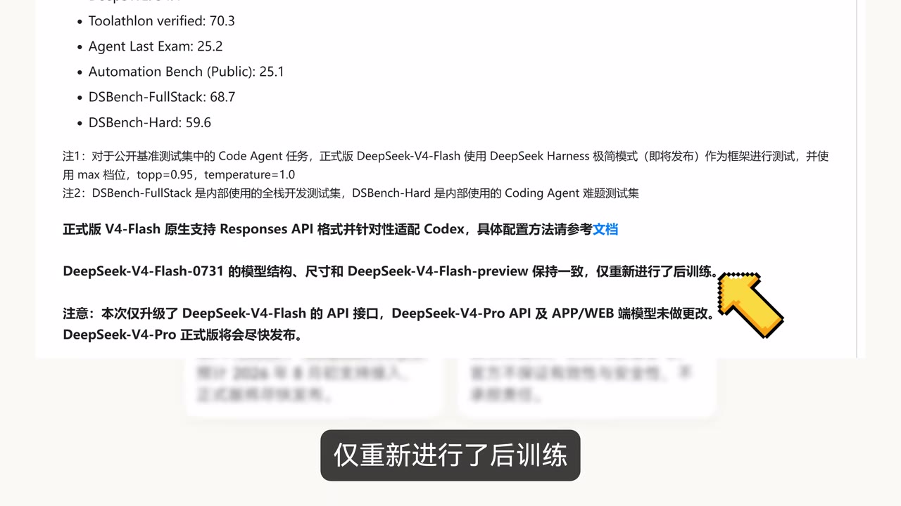

# 【突发】DeepSeek-V4-Flash 正式版 API 上线公测！

> 来源：[Bilibili 视频](https://www.bilibili.com/video/BV1gqGA6ZEuJ) 
> UP 主：橘鸦Juya｜视频时长：57 秒｜合集：AIcode  
> 视频简介提供的官方资料： [更新日志](https://api-docs.deepseek.com/zh-cn/updates) ｜[接入 Codex 指引](https://api-docs.deepseek.com/zh-cn/quick_start/agent_integrations/codex/)

## 小结

视频报道了 **DeepSeek-V4-Flash-0731 正式版 API 上线公测** 的消息。画面中的 DeepSeek 更新日志显示，此次更新的重点是 API 侧的 V4-Flash 正式版；视频明确提示，**APP、Web 端模型以及 DeepSeek-V4-Pro API 均未随本次更新改变**。

模型层面，DeepSeek-V4-Flash-0731 与 DeepSeek-V4-Flash-Preview 的**模型结构和尺寸保持一致**，本次“仅重新进行了后训练”。因此，这不是一次通过更换模型规模或基础结构实现的更新；视频给出的核心结论是，正式版在 Agent 能力相关的多个基准上较 V4-Pro-Preview 更高。

画面列出了 V4-Flash-0731 在 Terminal Bench 2.1、NL2Repo、Cybergym、DeepSWE、Toolathlon-Verified、Agents' Last Exam、AutomationBench（Public）、DSBench-FullStack、DSBench-Hard 等测试上的分数。对于公开 Code Agent 任务，官方采用即将发布的 **DeepSeek Harness 极简模式**测试，并明确给出 `max tier`、`top-p=0.95`、`temperature=1.0` 等测试设置。

开发接入方面，正式版原生支持 **Responses API** 格式，并针对性适配 **Codex**。视频还转述官方文档中的时间预期：DeepSeek-V4-Pro API 预计于 **2026 年 8 月初**支持接入 Codex，但这属于当时的计划信息，而不是本次已完成的功能。

需要注意时效性与边界：本视频为 2026-07-31 的快讯，基准成绩是官方展示数据；公开基准与内部基准的测试集、框架和参数并不完全相同，不能直接等同于所有真实项目中的稳定表现。实际可用模型名、价格、配额、Codex 接入状态与 API 行为均应以当前官方文档和控制台为准。

## 思维导图

## 目录

- [发布内容与适用范围](#发布内容与适用范围-000000)
- [模型版本关系：结构不变、后训练更新](#模型版本关系结构不变后训练更新-000023)
- [Agent 基准成绩与测试参数](#agent-基准成绩与测试参数-000023)
- [Responses API 与 Codex 接入信息](#responses-api-与-codex-接入信息-000045)
- [实践：接入前的核对步骤](#实践接入前的核对步骤-000045)
- [结论、限制与时效性](#结论限制与时效性-000045)
- [字幕比对](#字幕比对)
- [评论分析](#评论分析)
- [处理记录](#处理记录)

## 发布内容与适用范围 [00:00:00](https://www.bilibili.com/video/BV1gqGA6ZEuJ?t=0)

视频开场宣布：**DeepSeek-V4-Flash 正式版 API 已上线公测**。关键帧中的更新日志页面标注日期为 **2026-07-31**，标题为“DeepSeek-V4-Flash 更新”。

此次信息应严格按产品范围理解：

1. 已升级的是 **DeepSeek-V4-Flash 的 API 接口**。
2. **DeepSeek-V4-Pro API 未在本次更新中改动**。
3. **APP 与 Web 端模型未做更改**。
4. V4-Pro 正式版“将会尽快发布”是视频转述的后续信息，并非本次已经上线的项目。

> 图：关键帧展示 DeepSeek 更新日志中的“DeepSeek-V4-Flash 正式版 API 上线公测”公告及部分 Agent 基准条目。它直接界定了新闻主体是 API 公测，而不是全端模型同步切换。

## 模型版本关系：结构不变、后训练更新 [00:00:23](https://www.bilibili.com/video/BV1gqGA6ZEuJ?t=23)

视频与画面共同给出的版本关系是：

- 正式版型号：**DeepSeek-V4-Flash-0731**；
- 对比对象：**DeepSeek-V4-Flash-Preview**；
- 二者的**模型结构、尺寸保持一致**；
- 正式版仅“**重新进行了后训练**”。

“后训练”在此是公告中的描述。视频没有提供训练语料、训练轮次、偏好优化方法、上下文长度、价格、限流策略或推理参数变化等细节，因此不能据此进一步推断训练技术路线或性能提升的具体来源。

> 图：关键帧清晰呈现“模型结构、尺寸与 DeepSeek-V4-Flash-Preview 保持一致，仅重新进行了后训练”，以及“仅升级 API 接口、APP/WEB 端模型未做更改”的限制条件。这是避免把 API 发布误解为全产品更新的关键证据。

## Agent 基准成绩与测试参数 [00:00:23](https://www.bilibili.com/video/BV1gqGA6ZEuJ?t=23)

视频称正式版在多项 Agent 基准测试中超过 V4-Pro-Preview。画面表格并列了 DeepSeek-V4-Flash-0731、DeepSeek-V4-Flash-Preview、DeepSeek-V4-Pro-Preview、GLM-5.2 与 Opus-4.8；以下仅整理画面可读数值，不将其延伸为独立复测结论。

| 基准 | V4-Flash-0731 | V4-Flash-Preview | V4-Pro-Preview | GLM-5.2 | Opus-4.8 |
| --- | ---: | ---: | ---: | ---: | ---: |
| Terminal Bench 2.1 | 82.7 | 61.8 | 72.1 | 81.0 | 85.0 |
| NL2Repo | 54.2 | 39.4 | 38.5 | 48.9 | 69.7 |
| Cybergym | 76.7 | 38.7 | 52.7 | — | 83.1 |
| DeepSWE | 54.4 | 7.3 | 12.8 | 46.2 | 58.0 |
| Toolathlon-Verified | 70.3 | 49.7 | 55.9 | 59.9 | 76.2 |
| Agents' Last Exam | 25.2 | 15.8 | 16.5 | 23.8 | 25.7 |
| AutomationBench（Public） | 25.1 | 10.8 | 12.8 | 12.9 | 27.2 |
| DSBench-FullStack | 68.7 | 37.0 | 41.8 | 61.8 | 71.6 |
| DSBench-Hard | 59.6 | 25.8 | 31.1 | 54.5 | 71.7 |

视频画面补充了两类测试集的性质：

- **DSBench-FullStack**：内部使用的全栈开发测试集；
- **DSBench-Hard**：内部使用的 Coding Agent 难题测试集。

对外比较时应保留这个区分。内部测试集的构成、泄漏控制、评测流程及可复现性，在视频素材中均没有进一步披露；因此这些结果可以用于理解官方定位，但不宜直接视为第三方独立验证。

### 公开 Code Agent 测试设置

对于公开基准测试集中的 Code Agent 任务，画面注释说明：

- 使用即将发布的 **DeepSeek Harness 极简模式（minimal mode）**作为测试框架；
- `max tier`；
- `top-p=0.95`；
- `temperature=1.0`。

这意味着表中的公开 Code Agent 成绩不是脱离工具框架的“纯模型分数”。Agent 任务通常还会受工具调用循环、上下文管理、终止条件、提示词、运行环境与采样配置影响；如需横向选型，应尽可能在相同任务、相同工具链与相同预算下自行复测。

> 图：该关键帧完整展示九项 Agent 基准及五个模型列，并包含公开 Code Agent 任务的 Harness、`top-p=0.95`、`temperature=1.0` 注释，是理解“性能提升”具体所指和比较边界的核心画面。

## Responses API 与 Codex 接入信息 [00:00:45](https://www.bilibili.com/video/BV1gqGA6ZEuJ?t=45)

正式版 V4-Flash 的接口兼容性信息包括：

- **原生支持 Responses API 格式**；
- **针对性适配 Codex**；
- 具体配置方式可参考视频简介给出的 [Codex 接入文档](https://api-docs.deepseek.com/zh-cn/quick_start/agent_integrations/codex/)。

视频还提到，官方文档显示 **DeepSeek-V4-Pro API 预计 2026 年 8 月初支持接入 Codex**。其中“预计”是关键限定词：它描述的是当时的计划，不应写成 V4-Pro 已具备的功能，更不能外推为 APP/Web 端已接入。

由于视频没有演示请求体、认证头、模型 ID、基础 URL、账单价格、速率限制或 Codex 侧实际配置页面，本文不补写任何命令或参数。接入时应直接遵循当前版本官方文档。

> 图：关键帧同时呈现“原生支持 Responses API 格式并针对性适配 Codex”、版本后训练说明及“仅升级 API 接口”的提示，有助于将能力支持和发布范围放在同一上下文中理解。

## 实践：接入前的核对步骤 [00:00:45](https://www.bilibili.com/video/BV1gqGA6ZEuJ?t=45)

视频是资讯快报，未展示完整操作过程。基于视频明确给出的官方资料，可按以下顺序进行不超出素材范围的核对：

1. **确认目标端**：先区分要调用的是 API，还是期望 APP/Web 中模型变化。本次消息只确认 V4-Flash API 更新。
2. **查阅更新日志**：从视频简介中的官方更新日志确认当前可用型号、发布日期、公告是否有后续修订。
3. **按 Codex 文档配置**：若目标是 Codex 工作流，使用简介提供的官方 Codex 接入页，而非仅依据本视频的口播。
4. **确认接口风格**：对于需要 Responses API 格式的应用，验证当前 SDK、请求格式及模型支持状态。
5. **小规模验证 Agent 任务**：选择与实际业务相近的仓库、终端或工具调用任务，固定提示词、工具、预算和采样条件进行试跑。
6. **不要直接套用榜单结论**：表格中公开任务使用了 DeepSeek Harness 极简模式及指定采样参数；若自己的框架不同，结果可能不同。
7. **分别跟踪 V4-Flash 与 V4-Pro**：V4-Pro 的“尽快发布”及“预计 8 月初接入 Codex”均不构成本次 API 已升级的依据。

## 结论、限制与时效性 [00:00:45](https://www.bilibili.com/video/BV1gqGA6ZEuJ?t=45)

本视频最有价值的信息是一次清晰的产品边界更新：**V4-Flash-0731 正式版 API 公测上线，模型结构和尺寸不变、以重新后训练为主要变化，并扩展了 Responses API 与 Codex 适配能力。**

对需要构建 Coding Agent、终端 Agent 或工具调用工作流的开发者而言，视频提供了官方基准与接入方向；但真实项目选型仍需关注自身工具环境、任务难度、上下文长度、稳定性、成本、限流及权限设置。上述项目指标在本素材中没有提供。

还应特别区分以下事实层级：

- **视频/画面明确陈述**：V4-Flash API 公测、后训练、基准分数、Responses API 支持、Codex 适配、APP/Web 未变。
- **公告中的计划性信息**：V4-Pro 正式版将尽快发布；V4-Pro API 预计 2026 年 8 月初接入 Codex。
- **未被素材证明的内容**：价格变化、模型上下文窗口、是否开源、吞吐量、稳定性、正式版相对 Preview 的所有能力原因，以及本地/生产环境中的实际胜率。

视频发布时间处于 2026-07-31 左右，且内容涉及 API 公测与未来接入计划，具有强时效性。使用前必须访问当前官方更新日志和接入文档确认状态。

## 字幕比对

| 字幕来源 | 完整性 | 专有名词 | 时间轴 | 主要问题 |
| --- | --- | --- | --- | --- |
| Bilibili 站内字幕 | 未提供可用站内字幕，无法比对 | 无 | 无 | 素材明确标注未提供可用站内字幕 |
| 本次 ASR 字幕 | 高：3 段覆盖 0.3–56.5 秒，语音覆盖率 98.91% | 较差：多个 DeepSeek 版本与基准名识别错误 | 可用：含精确分段起止时间 | 将 V4/V4-Pro 等多处误识别为 V5、V6；“DeepSeek Harness”“DSBench-FullStack”“DSBench-Hard”等存在错拼或错词 |

本次 ASR 使用 `large-v3-turbo`，识别语言为中文，语言概率为 `0.9976`，诊断显示音频时长约 56.82 秒、无明显长空白段。诊断中**没有** `noAudioStream=true` 标记，说明该视频存在音轨；本次整理确实检查并使用了 ASR 的真实时间段。

最终采用策略为：**以 ASR 的 SRT 时间轴作为章节定位依据，以关键帧中的官方更新日志文字校正专有名词和事实内容**。站内字幕不可用，无法执行站内字幕与 ASR 的逐句交叉校验。

重要校正如下：

| ASR 中的识别结果 | 结合关键帧校正后 | 校正依据 |
| --- | --- | --- |
| DeepSeq / Deep Seek | DeepSeek | 视频标题与官方日志页品牌标识 |
| Deepseek V5 Flash 0731 / Deepseek V6 Flash | DeepSeek-V4-Flash-0731 | 关键帧的公告标题、表格列名与版本说明 |
| V4 Pro Preview 的混乱版本读法 | DeepSeek-V4-Pro-Preview | 基准表列名 |
| Deep-Seek Harness | DeepSeek Harness | 表格底部英文测试注释 |
| DSBench 4Stack | DSBench-FullStack | 更新日志中文注释与英文表格行名 |
| DSBencht Hard | DSBench-Hard | 更新日志中文注释与英文表格行名 |
| 支持介入 CodeX | 预计支持接入 Codex | 关键帧中的“预计”“接入 Codex”语义及视频口播上下文 |

## 评论分析

以下仅分析本次可获取的热评前三条；它们反映社区情绪或观点，不构成对模型、价格、公司行为或技术能力的可验证证据。

1. **为你而结的果实（440 赞）**  
   评论以时间线式戏仿梳理其对 DeepSeek V4 预览版、价格调整、正式版延期及 Flash-0731 发布的观察，核心表达是 AI 社区对厂商发布节奏和定价变化的强烈情绪化反应。该评论未提供可核验来源，且含大量夸张、讽刺性称呼；可将其视为用户舆情，不应作为“延期”“涨价”或公司经营信息的事实依据。

2. **卿年K（766 赞）**  
   评论将模型发布与“长鑫上市”等事件作调侃性关联。其内容没有给出出处，也与视频所展示的 API 更新、基准或 Codex 适配无直接技术论证关系。可信用途仅限于体现观众以财经或行业话题解读模型发布的玩笑式氛围。

3. **_AlBrP_（213 赞）**  
   评论认为观众观看该 UP 主内容的重要动机之一是关注 DeepSeek，并以“到 ds 就爆了”表达此类新闻的高关注度。这一观点与视频元数据中的较高互动量可以形成有限的现象层面呼应，但无法据此证明全部受众动机或热度成因。

## 处理记录

- Worker ID：`worker-mrj0wjed-b0c290ad`
- 模型：`gpt-5.6-terra`
- ASR 模型与参数：`large-v3-turbo`；语言 `zh`；设备 `cuda`；计算类型 `int8_float16`。
- 使用的素材工具产物：视频合并文件 `merged.mp4`、音频 `audio/audio.wav`、ASR SRT `asr/transcript.srt`、ASR 分段结果 `asr/asr-result.json`、关键帧目录 `frames/`、评论文件 `comments/comments.json`。
- 字幕检查与选择：站内字幕未提供可用版本；已检查本次 ASR，确认其具备 0.3–56.5 秒真实时间戳且存在音轨。正文以 ASR 时间段定位，以关键帧可见的官方日志内容纠正 ASR 专有名词错误。
- 关键帧选择依据：
  - `frames/frame-001.jpg`：公告日期、V4-Flash API 公测与部分基准信息；
  - `frames/frame-002.jpg`：结构/尺寸不变、仅后训练、仅升级 API 及 APP/Web 未变；
  - `frames/frame-003.jpg`：Responses API、Codex 适配与发布范围；
  - `frames/frame-004.jpg`：完整基准表和公开任务测试参数。
- 评论处理范围：仅使用可获取热评前三条，未扩展抓取或分析其他评论。
- 缓存清理：素材清单未提供缓存清理执行记录；本文不虚构已清理结果。
- 未解决问题：素材未包含 API 价格、上下文窗口、限流、完整请求示例、实际 Codex 配置页面或独立复现实验，故未对这些内容作出补充性断言。
