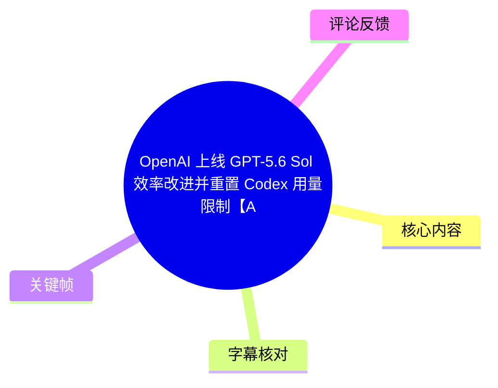
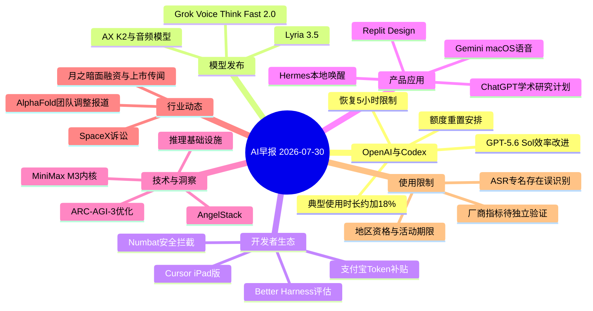
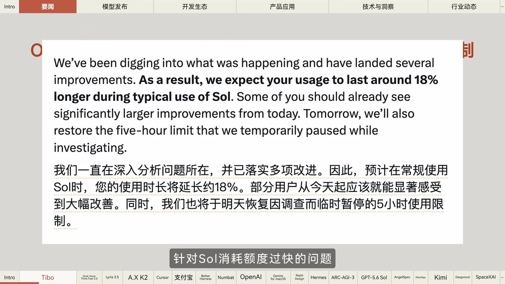
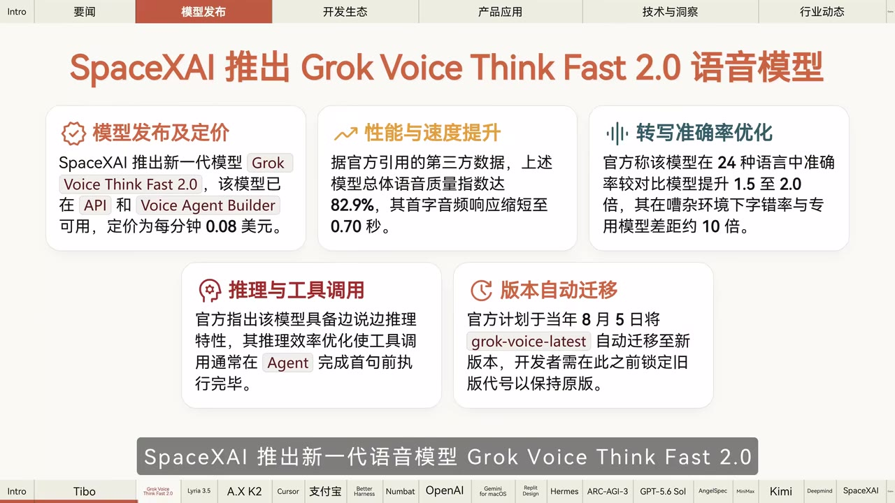
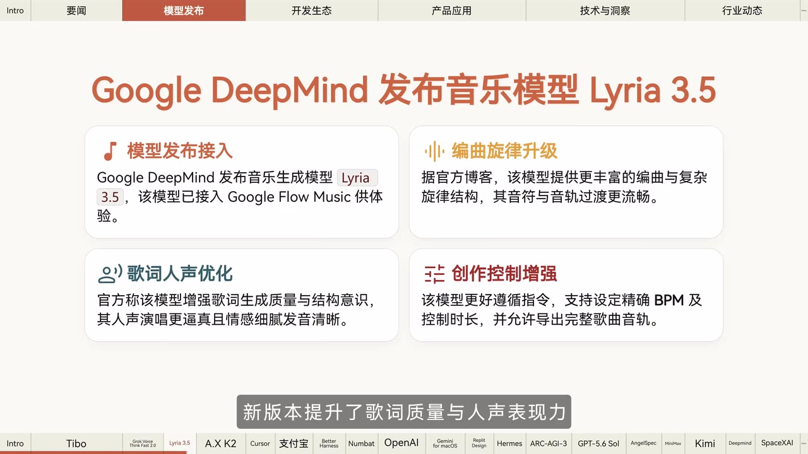

# OpenAI 上线 GPT-5.6 Sol 效率改进并重置 Codex 用量限制【AI 早报 2026-07-30】

> 来源：[Bilibili 视频](https://www.bilibili.com/video/BV1Qw3W6EE8i) 
> UP 主：橘鸦Juya｜视频时长：4 分 16 秒｜栏目：AI 早报 
> 原视频描述提供了相关链接与文字版入口：<https://mp.weixin.qq.com/s/vtrBO6RK41gmnWW9HeLdTw>

## 小结

这是一则以 2026 年 7 月 30 日为时间点的 AI 行业快讯，核心信息是 OpenAI 针对 **GPT-5.6 Sol** 的使用额度消耗问题进行了效率改进：视频转述其优化了工具等待与网页搜索场景，预计典型使用时长延长约 **18%**；同时将恢复此前临时暂停的 **5 小时使用限制**，并提及可能在当地时间 7 月 31 日再次执行额度重置。

新闻还集中覆盖了模型、开发工具、产品功能与产业动态：SpaceX AI 的 Grok Voice Think Fast 2.0、Google DeepMind 的音乐模型 Lyria 3.5、SKT 的 AX K2、Cursor iPad 版、支付宝 AI 支付激励、Agent 评估与安全工具，以及 OpenAI、腾讯、MiniMax 等围绕推理效率、推测解码和 GPU 内核的技术更新。

对开发者而言，最可操作的信息包括：Cursor 已扩展至 iPad 且提供 inbox 与完整 PR review；支付宝活动设置了截至 **8 月 21 日** 的参与窗口；Gemini for macOS 的语音功能先面向全球英语用户；Grok Voice 模型与 Lyria 3.5 则分别已进入对应的 API/产品入口。不同产品的地区、语言、账户等级和资格限制仍需以各官方页面为准。

视频中出现的多数数字属于新闻转述或厂商口径，不能直接视为独立复现实验结论。例如“ARC-AGI-3 得分 38.3%”“成本降低 20%”“端到端加速最高 2.4 倍”等，均需要关注测试设置、模型版本、硬件、任务分布与统计口径。视频并未给出完整测试方法。

这是高度时效性的日报内容：其中“明天恢复/重置”“8 月 5 日迁移”“8 月 21 日截止”“计划 2027 年扩展”等均是视频所述时间点下的安排，而非永久状态。尤其部分公司名、产品名在 ASR 中存在明显同音或英文识别误差，本文以画面可见文字和视频标题优先校正，并对无法可靠确认的名称保留审慎表述。

## 思维导图

## 目录

- [背景、范围与时效性](#背景范围与时效性)
- [OpenAI：Sol 效率、Codex 用量与基础设施](#openai-sol-效率codex-用量与基础设施)
- [模型发布：语音、音乐与开源大模型](#模型发布语音音乐与开源大模型)
- [开发者生态：移动端、补贴、评估与安全](#开发者生态移动端补贴评估与安全)
- [产品应用与研究支持](#产品应用与研究支持)
- [推理技术与开源基础设施](#推理技术与开源基础设施)
- [行业融资、组织与监管动态](#行业融资组织与监管动态)
- [可执行清单、限制与结论](#可执行清单限制与结论)
- [字幕比对](#字幕比对)
- [评论分析](#评论分析)
- [处理记录](#处理记录)

## [背景、范围与时效性](https://www.bilibili.com/video/BV1Qw3W6EE8i?t=0)

视频开场说明日期为 7 月 30 日，并按“模型发布、开发生态、产品应用、技术与洞察、行业动态”等板块播报。它是新闻汇总而不是单项产品教程：多数条目只给出发布、上线、性能或计划节点，未提供注册入口、完整 API 参数、价格表、基准代码或独立测评过程。

视频标题聚焦两点：

1. OpenAI 为 GPT-5.6 Sol 做效率改进；
2. Codex 相关用户的额度重置与使用限制调整。

其余内容则构成同日 AI 产品和行业消息的横向扫描。阅读和决策时应将视频中的“官方称”“据报道”“计划”等措辞分别理解为：厂商声明、媒体报道、尚未完成的未来安排，避免把它们混为已验证事实。

## [OpenAI：Sol 效率、Codex 用量与基础设施](https://www.bilibili.com/video/BV1Qw3W6EE8i?t=0)

### [Codex 额度重置、Sol 消耗改进与 5 小时限制](https://www.bilibili.com/video/BV1Qw3W6EE8i?t=0)

视频转述，Codex 负责人 **Tippo** 于北京时间 7 月 29 日中午宣布：为所有“ChatGPT Work”和 Codex 用户重置额度，并上线与 Sol 使用有关的效率改进。这里“ChatGPT Work”是 ASR 的原始识别结果，视频素材未提供可供复核的账户产品全称，因此不进一步扩写其订阅层级或资格范围。

改进针对的是 Sol “消耗额度过快”的问题，视频给出的改善路径是：

- 优化**工具等待**场景；
- 优化**网页搜索**场景；
- 预计典型使用时长延长约 **18%**；
- 部分用户可能从当日起已经感受到更明显改善；
- 此前为了调查问题而临时暂停的 **5 小时限制**将恢复。

随后，视频还称 Tippo 回复社区用户时暗示，当地时间 **7 月 31 日**会再次执行用量重置。该表述属于视频对公开回复的转述；重置时区、精确时刻、适用账户，以及是否覆盖后续新用户，均未在视频中展开。

> 图：画面展示一段英文公告及中文翻译，核心句为“典型使用 Sol 的时长预计延长约 18%”和“恢复临时暂停的五小时限制”。它直接支撑本节最重要的两个数字与限制条件，也说明这是一次用量效率修复而非单纯提高额度上限。

**对用户的实际含义：**

- 若使用受时间窗或额度限制，工具调用、网页搜索等高等待/高消耗工作流可能获得更长连续工作时间。
- “时长延长 18%”是典型使用预估，不等价于每个任务、每个账户或每一种工具组合都稳定增加 18%。
- 5 小时限制恢复意味着此前的临时宽松状态结束；应重新按限额窗口规划长任务、批量编码和多轮 Agent 工作。
- 若等待再次重置，需确认自己所在地区/账户实际显示的刷新时间，不能仅按视频里的“当地时间 7 月 31 日”换算。

### [GPT-5.6 Sol 的 ARC-AGI-3 指标与推理侧优化](https://www.bilibili.com/video/BV1Qw3W6EE8i?t=169)

视频后段继续转述 OpenAI 的两类技术信息。

第一类是 API 设置与基准表现：OpenAI 表示，保留“推理”和“压缩”两项 API 设置后，**GPT-5.6 Sol** 在 **ARC-AGI-3** 基准测试中的得分提升 3 倍至 **38.3%**，同时输出 token 减少 **6 倍**。视频没有给出原始分数、提示词、任务子集、推理预算、压缩机制定义及复现脚本，因此该数字只能按厂商发布口径记录。

第二类是生产推理基础设施：视频称 OpenAI 介绍了用 GPT-5.6 优化资深运行基础设施的过程，所采取的措施包括：

- 重写生产核心；
- 改进推测解码；
- 服务成本降低 **20%**；
- token 生成效率提升超过 **15%**；
- 优化已用于推理堆栈和 Agentic Harness。

这些信息反映的工程逻辑是：模型能力之外，推理服务的吞吐、延迟与成本也能通过系统重构和推测解码改进。视频没有说明成本的计价边界（如 GPU、存储、网络或整体服务成本），也没有解释“token 生成效率”的具体统计口径，因而不宜直接横向比较其他系统。

## [模型发布：语音、音乐与开源大模型](https://www.bilibili.com/video/BV1Qw3W6EE8i?t=24)

### [Grok Voice Think Fast 2.0：API、性能与迁移节点](https://www.bilibili.com/video/BV1Qw3W6EE8i?t=24)

视频称 SpaceX AI 推出新一代语音模型 **Grok Voice Think Fast 2.0**，并已在 API 与 Voice Agent Builder 中可用。ASR 将公司名和模型名识别为“SpaceX AI”“Grog”，但画面明确显示为 **SpaceXAI** 与 **Grok Voice Think Fast 2.0**，本文据画面校正拼写。

画面提供的具体信息包括：

| 维度 | 视频画面信息 |
| --- | --- |
| 可用入口 | API、Voice Agent Builder |
| 定价 | 每分钟 0.08 美元 |
| 总体语音质量指标 | 82.9%（画面称据官方引用的第三方数据） |
| 首字音频响应 | 缩短至 0.70 秒 |
| 多语言转写 | 画面称覆盖 24 种语言；准确率较对比模型提升 1.5～2.0 倍 |
| 噪声环境 | 画面称字错误率与专用模型差距约 10 倍 |
| Agent 调用 | 画面称具备边说边推理特性，工具调用通常可在 Agent 完成首句前执行完毕 |
| 版本迁移 | 计划于当年 8 月 5 日将 `grok-voice-latest` 自动迁移至新版；需提前锁定旧版代号以保持原版 |

> 图：画面以五个信息卡片列出模型入口、每分钟定价、响应速度、转写指标、工具调用能力及 8 月 5 日自动迁移安排。它将 ASR 中较模糊的“语音基准提升”补足为可核对的具体参数与迁移风险。

**迁移建议：**

1. 先检查生产环境是否调用 `grok-voice-latest`。
2. 若业务对语音效果、响应时延或工具调用行为敏感，在自动迁移日期前锁定当前所需的版本代号。
3. 用自身语言、背景噪声、打断对话、工具调用和成本样本做回归测试。
4. 以实际账单核对每分钟计费，避免只按展示定价估算全链路成本。

### [Lyria 3.5：音乐生成的可控性更新](https://www.bilibili.com/video/BV1Qw3W6EE8i?t=48)

视频称 Google DeepMind 发布音乐生成模型 **Lyria 3.5**，并接入 Google Flow Music 平台。画面与播报共同给出的提升方向包括：

- 歌词生成质量与结构意识增强；
- 人声演唱更逼真，情感细腻、发音清晰；
- 提供更丰富的编曲与复杂旋律结构；
- 音符与音轨过渡更流畅；
- 更好遵循指令；
- 支持设定精确 BPM 与控制时长；
- 允许导出完整歌曲音轨。

> 图：画面将 Lyria 3.5 的更新归纳为“模型发布接入、编曲旋律升级、歌词人声优化、创作控制增强”，其中精确 BPM、时长控制和完整音轨导出是对创作流程最具操作价值的信息。

对于音乐创作者，这意味着提示词之外的控制面更清晰：可将速度（BPM）、时长、旋律复杂度、歌词结构与人声预期拆开描述。但视频没有说明支持的最大时长、导出格式、版权条款、地区可用性和商业使用许可，发布前仍应查阅平台当前条款。

### [SKT AX K2 与音频语音模型](https://www.bilibili.com/video/BV1Qw3W6EE8i?t=48)

视频称 SKT 发布开源大语言模型 **AX K2**：

- 总参数量：**688B**；
- 激活参数量：**33B**；
- 训练方式：原生 FP8 训练；
- 同时推出：AX K2 ALM 音频语音模型；
- 权重计划后续发布。

其中“688B 总参数、33B 激活参数”表明视频描述的是总规模与单次激活规模不同的模型架构，但没有给出层数、专家数、上下文长度、许可协议、权重下载时间或硬件需求。因此目前只能把它视为发布信息，不能据此判断本地部署门槛或推理成本。

## [开发者生态：移动端、补贴、评估与安全](https://www.bilibili.com/video/BV1Qw3W6EE8i?t=72)

### [Cursor iPad 版与移动代码审查](https://www.bilibili.com/video/BV1Qw3W6EE8i?t=72)

视频称 Cursor 已上线 iPad，具备 iPhone 版全部功能，并提供更大空间与 agents 协作。iPhone 与 iPad 版同步新增：

- **inbox**：画面解释为帮助用户保持条理；
- **完整 PR review**：覆盖查看评论、检查与批准等流程。

> 图：画面明确展示 Cursor 的 iPad 发布、双端 inbox 和完整 PR review 三项信息。它说明更新不只是屏幕适配，还把移动端代码协作与审查流程纳入产品能力范围。

移动端适合处理通知、评论、审查、轻量修改和任务分流；视频未证明它能完全替代桌面端的本地运行环境、终端调试或复杂仓库操作。团队接入前还需自行验证设备管理、代码权限、审查策略和网络环境。

### [支付宝 AI 支付开发者激励计划](https://www.bilibili.com/video/BV1Qw3W6EE8i?t=72)

视频称支付宝升级 AI 支付开发者激励计划，提供最高 **5660 元 Token 专项补贴**。参与条件按视频转述为：在活动期内，个人开发者集成指定收款产品即可参与；活动截至 **8 月 21 日**。

这里至少有三个需要进一步确认的条件：

1. “最高 5660 元”通常不表示所有参与者都可获得全额补贴；
2. “指定收款产品”的具体名单、集成标准、审核规则与发放形式未在视频说明；
3. 视频未说明年份、地区、主体资质、Token 可使用的平台范围及是否可与其他活动叠加。

因此应将其作为带截止日的活动线索，实际接入前以活动规则页为准。

### [Better Harness 与 Numbat：Agent 的评估与动作拦截](https://www.bilibili.com/video/BV1Qw3W6EE8i?t=96)

视频提及两个面向 Agent 工程治理的开源项目：

- **Better Harness**：由 Coder 开源的 AI 编程 Agent 评估工具。视频称其从任务理解等五个维度审查 Agent 工作流，并生成带证据的报告与修复建议。
- **Numbat**：由 Perplexity 开源的跨 Agent 框架安全检测与响应层。视频称它支持安全团队监控 Agent 行为，并在危险动作执行前拦截。

两者定位不同：

| 工具 | 核心问题 | 视频所述能力 |
| --- | --- | --- |
| Better Harness | Agent 是否理解并正确完成任务 | 五维工作流审查、证据报告、修复建议 |
| Numbat | Agent 是否会执行危险动作 | 跨框架行为监控、危险动作前拦截 |

可迁移的实践顺序是：先用评估工具测量任务理解和流程质量，再给真实工具调用增加策略检查、人工审批与危险操作拦截。视频没有给出五个维度的具体名称，也未说明 Numbat 的策略语言、误报率或支持框架清单，不能据此推断生产可用性。

## [产品应用与研究支持](https://www.bilibili.com/video/BV1Qw3W6EE8i?t=120)

### [ChatGPT Academic Researchers 计划](https://www.bilibili.com/video/BV1Qw3W6EE8i?t=120)

视频称 OpenAI 推出 **ChatGPT for Academic Researchers** 计划，向科学家、数学家和工程师免费提供前沿模型使用权限：

- 首批面向 **1 万名研究人员**；
- 预计到 **2027 年**扩展至 **10 万人**。

视频没有给出申请入口、审核资质、可访问模型、使用限额、数据处理条件、国家/机构覆盖范围和学术成果要求。因此，符合身份类别不等于自动获得资格；研究人员应关注官方申请与数据合规说明，尤其不要在未确认数据政策前上传敏感研究数据。

### [Gemini for macOS、Replit Design 与 Hermes 本地唤醒](https://www.bilibili.com/video/BV1Qw3W6EE8i?t=120)

视频还播报了三类产品功能更新：

1. **Gemini for macOS**
   - 新增语音功能；
   - 用户长按 `Fn` 键即可进行智能听写；
   - 开启设置后，可结合屏幕上下文执行复杂任务；
   - 当时正面向全球英语用户推出。

   “全球英语用户”表明功能覆盖不等于所有语言都已可用；屏幕上下文能力还涉及屏幕读取授权与隐私边界，实际使用前需核验权限提示。

2. **Replit Design**
   - 已向所有用户开放；
   - 内置 Ambient Intelligence；
   - 支持一键应用品牌系统。

   视频没有定义 Ambient Intelligence 的具体实现或品牌系统覆盖的设计资产范围，不能据此推断其能自动满足完整设计规范或无障碍要求。

3. **Hermes Agent**
   - 推出本地语音唤醒；
   - 用户说出唤醒词即可免手启动新绘画；
   - 唤醒检测全程在本地进行；
   - 默认关闭。

   本地检测和默认关闭是视频明确提到的隐私与控制设计，但它并不自动说明后续绘画请求、日志或生成内容也全部本地处理；二者应分开理解。

## [推理技术与开源基础设施](https://www.bilibili.com/video/BV1Qw3W6EE8i?t=193)

### [AngelStack 与 MiniMax M3 GPU 内核](https://www.bilibili.com/video/BV1Qw3W6EE8i?t=193)

视频称腾讯混元团队开源 **AngelStack** 推测解码框架，支持训练与部署。官方称该框架在“混元 3A21B”（ASR 识别结果，具体型号无法从现有素材可靠校正）上可实现最高 **2.4 倍**端到端加速。

推测解码的基本思路是让草稿模型先提出多个 token 候选，再由目标模型并行验证，以期减少目标模型逐 token 解码的等待。实际加速会受到草稿命中率、批处理大小、模型配对、上下文长度、硬件与服务调度影响；“最高 2.4 倍”不能直接当作任何部署场景的预期值。

此外，视频称 **MiniMax 与 Fireworks AI** 联合开源两个面向 MiniMax M3“快吸收注意力”（ASR 专名不清，无法据现有素材校正）的 GPU 内核仓库。视频仅给出联合开源与目标方向，没有仓库地址、支持硬件、编译方式、许可证或性能数据，故不扩展为具体安装步骤。

## [行业融资、组织与监管动态](https://www.bilibili.com/video/BV1Qw3W6EE8i?t=217)

### [月之暗面融资与上市传闻](https://www.bilibili.com/video/BV1Qw3W6EE8i?t=217)

视频以“据报道”表述：月之暗面已完成 **35 亿美元**融资，投后估值达 **350 亿美元**；又称该公司正以 **500 亿美元**投前估值接触投资者，计划最快当年赴港上市。

这些均属于视频转述的媒体报道和融资/上市计划，不是视频内可独立验证的公告。融资金额、估值口径、交易完成状态与上市时间会随谈判和监管变化而变化，不能用于投资判断。

### [AlphaFold 团队调整报道](https://www.bilibili.com/video/BV1Qw3W6EE8i?t=217)

视频同样以“据报道”称 Google DeepMind 解散 AlphaFold 团队，近 **1%**研究员离职，多数人转入 Gemini 项目或 Isomorphic Labs。

该说法涉及组织调整，视频未说明消息来源、统计基数、“解散”是否指独立团队撤销还是重组，也没有提供官方回应。应把它作为待核实的组织动向，而不是确认的组织事实。

### [SpaceX AI 起诉明尼苏达州总检察长](https://www.bilibili.com/video/BV1Qw3W6EE8i?t=241)

视频称 SpaceX AI 在美国联邦法院起诉明尼苏达州总检察长，要求阻止限制 AI 裸化技术的新法生效。视频转述该公司认为法律范围过宽、未提供免责机制，并将迫使其限制 Grok Imagine 功能。

这一事项涉及生成式 AI、深度伪造/非自愿私密图像、内容平台责任与州级监管的交叉问题。视频没有提供案号、法条名称、法院裁定进展或起诉文件原文，因此只能记录为诉讼主张，不能将其概括为已经“胜诉”或法律已经失效。

## [可执行清单、限制与结论](https://www.bilibili.com/video/BV1Qw3W6EE8i?t=241)

### 面向不同读者的行动建议

| 读者 | 可关注动作 | 必须确认的限制 |
| --- | --- | --- |
| Codex / Sol 用户 | 观察工具、搜索场景的实际额度消耗；按 5 小时窗口规划工作 | 账户资格、重置时区、实际生效时间与用量面板 |
| 语音 Agent 开发者 | 对 Grok Voice Think Fast 2.0 做时延、识别和工具调用回归测试 | 迁移日期、版本锁定、语言表现、每分钟计费 |
| 音乐创作者 | 试用 Lyria 3.5 的 BPM、时长、歌词和人声控制 | 平台开放地区、导出格式、版权和商业使用条款 |
| AI 编程团队 | 在 iPad 端试用 PR review；引入 Agent 评估与动作拦截 | 代码权限、审批链、移动端能力边界、误报/漏报 |
| 学术研究者 | 关注 ChatGPT 研究计划的申请与资格说明 | 名额、数据政策、模型/额度、地区和机构要求 |
| 推理工程团队 | 调研推测解码框架与 GPU 内核项目 | 可复现基准、模型兼容性、硬件、许可和生产稳定性 |

### 关键限制

- **来源限制**：这是新闻播报，材料多为厂商公告或媒体报道的二次转述；视频并未展示完整原文、测试代码、法律文件或融资文件。
- **指标限制**：18% 时长提升、38.3% 基准得分、6 倍 token 减少、20% 成本降低、超过 15% token 效率提升、2.4 倍加速等均依赖各自口径，不能跨项目直接比较。
- **产品限制**：部分功能仅面向英语用户、特定用户或指定收款产品；活动和迁移均有明确日期，可能已发生变化。
- **专名限制**：本次 ASR 对英文专名有多处误识别，例如 Grok、Sol、Numbat、Hermes 等；对“混元 3A21B”“快吸收注意力”等无法依现有画面校正的部分，本文不作臆测性改写。
- **合规限制**：语音、屏幕上下文、Agent 工具调用与 AI 图像生成功能都可能涉及隐私、数据授权与内容安全义务，技术可用不等于可无条件上线。

## [字幕比对](https://www.bilibili.com/video/BV1Qw3W6EE8i?t=0)

| 字幕来源 | 完整性 | 专有名词 | 时间轴 | 主要问题 |
| --- | --- | --- | --- | --- |
| Bilibili 站内字幕 | 未提供可用站内字幕 | 无法评估 | 无法使用 | 素材明确标注“未提供可用站内字幕” |
| 本次 ASR 字幕 | 高：11 段，覆盖约 255.17 秒/255.93 秒，覆盖率 99.7% | 较弱：英文名称、公司名与部分术语有误识别 | 高：提供 00:00:00.300 至 00:04:15.470 的真实 SRT 分段 | 分段较长；存在 Sol/Soul、Grok/Grog、Numbat/Numbet、Hermes/Hermis 等识别问题 |

本次 ASR 使用模型 **large-v3-turbo**，识别语言为中文，语言置信度为 **0.9976**，带时间戳；诊断未标记 `noAudioStream=true`，且音频语音覆盖率为 99.7%，因此可以确认源视频存在音轨，本次 ASR 不是无音轨替代方案。

最终采用策略为：**以本次 ASR 的 SRT 时间段作为章节时间轴依据，以视频标题和关键帧可见文字校正明确的英文专名与数字。** 主要校正包括：

- `Soul` → **Sol**：以视频标题及关键帧中 “Sol” 为准；
- `Grog Voice ThinkFest 2.0` → **Grok Voice Think Fast 2.0**：以关键帧标题为准；
- `Numbet` → **Numbat**：按 ASR 上下文中的 Perplexity 开源安全层名称记录，但未见对应关键帧，仍保留文本校正风险；
- `Hermis` → **Hermes**：按 ASR 上下文记录；
- “ChatGPT Work”“混元 3A21B”“快吸收注意力”等缺乏足够画面或站内字幕交叉验证的内容，不作超出素材的确定性补全。

## [评论分析](https://www.bilibili.com/video/BV1Qw3W6EE8i?t=217)

仅处理可获取的热评前三条，不将评论视为已验证新闻。

1. **橘鸦Juya（227 赞）：“私密马赛，吃了英文不好的亏”**
   - 观点：UP 主以自嘲方式回应英文专名或英语信息处理上的困难。
   - 价值：与本视频 ASR 中大量英文产品名被误识别的情况相呼应，提醒读者对 Grok、Sol、Lyria 等名称保持核对意识。
   - 可信度：这是创作者的情绪化表达，不提供可验证的补充事实。

2. **江凌晓（152 赞）：“特大好消息：deepseek v4正式版将于明天发布，如果没发，这条消息将重发一遍”**
   - 观点：评论者声称 DeepSeek V4 正式版将于次日发布，并以玩笑方式弱化承诺。
   - 价值：反映观众对大模型新品发布的关注。
   - 可信度：该信息不在视频播报内容中，且评论明确带有戏谑表达；不能据此认定产品发布计划真实。

3. **皇皇天汉（39 赞）：“马斯克胜诉，Grok继续搞颜色”**
   - 观点：将视频末尾涉及 SpaceX AI/Grok Imagine 的诉讼概括为“胜诉”。
   - 价值：说明观众将监管诉讼与 Grok 图像功能直接关联。
   - 可信度与纠正：视频原话是“起诉”“要求阻止法律生效”，描述的是提起诉讼和公司主张，并未给出已经胜诉的裁定。该评论不应作为法律进展依据。

## [处理记录](https://www.bilibili.com/video/BV1Qw3W6EE8i?t=0)

- Worker ID：`worker-mrj0www4-e8d79408`
- 生成模型：`gpt-5.6-terra`
- 可用素材与工具结果：视频元数据、时长 255.93 秒的音频、`large-v3-turbo` ASR 结果、ASR SRT 时间轴、12 个关键帧路径清单、热评前三条数据。
- 字幕检查与选择：站内字幕不可用；已检查本次 ASR。采用 ASR SRT 的真实起止时间生成章节链接，并以关键帧和标题校正少量可确认的英文专名。
- 关键帧选择依据：
  - `frames/frame-001.jpg`：直接显示 Sol 典型使用时长约增加 18%与恢复 5 小时限制；
  - `frames/frame-002.jpg`：展示 Grok Voice Think Fast 2.0 的定价、指标与自动迁移日期；
  - `frames/frame-003.jpg`：展示 Lyria 3.5 的音乐生成控制项；
  - `frames/frame-004.jpg`：展示 Cursor iPad、inbox 与 PR review 的产品范围。
- 关键帧使用说明：上述图片均使用相对路径嵌入正文，且只用于支撑画面中可直接读取的事实；未根据未提供的其他帧臆测画面内容。
- 缓存清理：未提供缓存清理执行日志或结果，不能声称已完成清理。
- 未解决问题：缺少站内字幕、原始公告链接、完整基准设置、活动规则页、开源仓库地址及诉讼文件；若需作采购、部署、投资或法律判断，应回到各项目官方公告与一手文件复核。

## 评论分析

- 热评 1：私密马赛，吃了英文不好的亏
- 热评 2：特大好消息：deepseek v4正式版将于明天发布，如果没发，这条消息将重发一遍[doge][doge]
- 热评 3：马斯克胜诉，Grok继续搞颜色[doge_金箍]

以上内容是观众反馈摘录，只用于补充理解视频反响，不作为正文事实依据。
