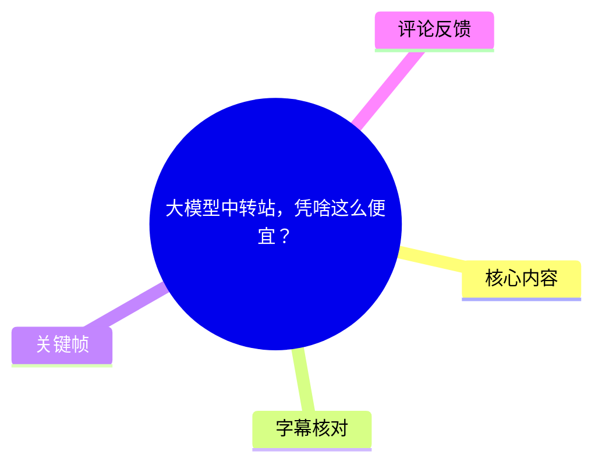
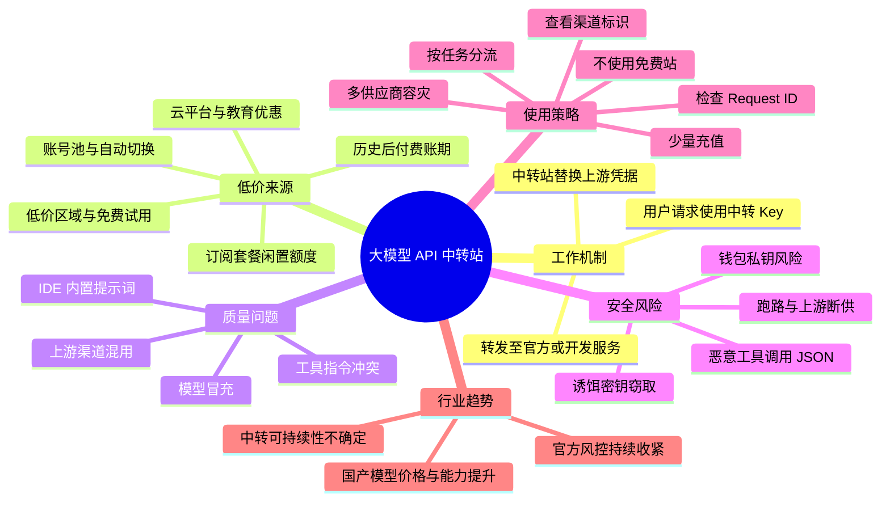
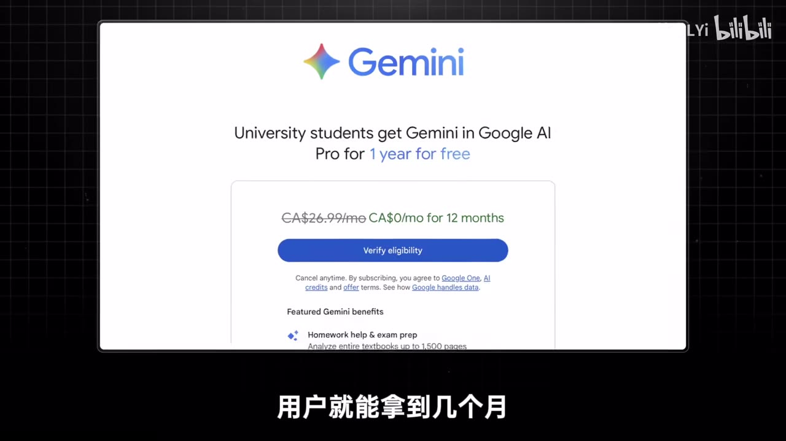
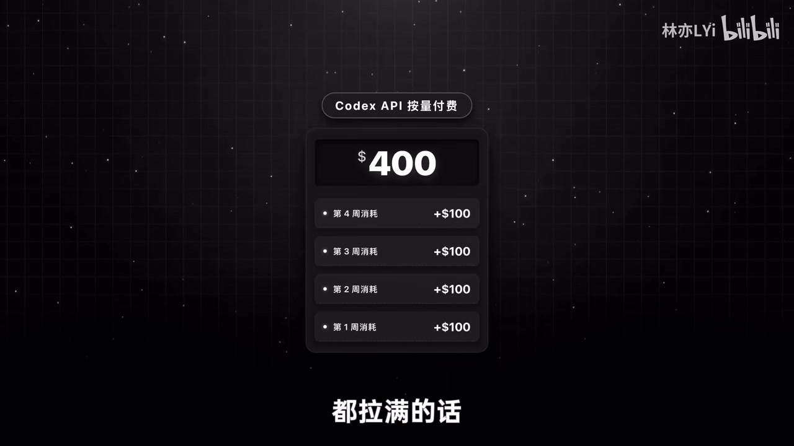

# 大模型中转站，凭啥这么便宜？

> 来源：[Bilibili 视频](https://www.bilibili.com/video/BV1DQ7k6JE4P) 
> UP 主：林亦LYi｜时长：15:48｜分辨率：3840×2160｜视频简介：`0.001折的GPT你敢用吗，大模型中转站到底掺了多少水？`

## 小结

视频围绕“大模型 API 中转站为什么能远低于官方价格”展开。其基本机制是：用户把请求发送给中转站，中转站使用自己的上游 Key 或订阅账号再转发给官方/开发服务；Token 本身不因转发而减少，低价主要取决于中转站获得上游算力的成本，而不是单纯的“中间商差价”。

作者将低价来源归纳为几类：早期后付费账期与云平台优惠、学生或创业扶持等权益、订阅套餐中的高额度但低实际使用率、低价区订阅，以及将开发工具或 Coding Plan 的接口逆向转接。视频同时强调，其中部分路径涉及违反平台规则、滥用优惠或规避身份/支付验证；这些内容应理解为对行业现象的描述与风险分析，而非可执行建议。

“便宜”不等于“接入了廉价模型”。视频认为，一些中转站会混用不同质量的上游渠道，尤其是经 IDE 或开发服务转出的模型接口，可能因内置系统提示词、工具函数冲突而导致模型在非编码任务中能力明显下降。更严重的风险包括模型冒充、渠道混用、接口多层嵌套、密钥泄露和恶意代码注入。

实际使用层面，作者给出的核心策略是**按场景分流、少量充值、观察渠道透明度与报错信息、定期核对 Token 统计、准备多家备份**。代码开发、稳定性要求较低的事务可考虑中转；模型评测、长周期开发及高敏感任务则更应使用官方渠道。任何中转都不应被视为官方模型的稳定替代品。

视频包含大量具有时效性的市场数据和平台策略，例如订阅额度、风控强度、价格、OpenRouter 调用占比及厂商政策。这些均是作者在视频制作期间的陈述，不应视为截至当前仍然有效的实时事实；具体平台条款、模型名称、区域价格和可用性需要以官方最新公告为准。

适合读者：需要理解 API 中转机制、评估低价模型渠道风险、搭建多供应商调用容错方案的开发者与 AI 工具用户。本文不推荐任何具体中转服务，也不复述可用于规避平台风控、支付或身份核验的操作细节。

## 思维导图

## 目录

- [问题背景与中转机制](#问题背景与中转机制)
- [低价从何而来：优惠、订阅与账号池](#低价从何而来优惠订阅与账号池)
- [降质、掺水与安全风险](#降质掺水与安全风险)
- [为什么仍有人使用中转](#为什么仍有人使用中转)
- [使用方法：如何降低风险](#使用方法如何降低风险)
- [行业趋势、结论与限制](#行业趋势结论与限制)
- [关键帧](#关键帧)
- [字幕比对](#字幕比对)
- [评论分析](#评论分析)
- [处理记录](#处理记录)

## 问题背景与中转机制 [00:00:48](https://www.bilibili.com/video/BV1DQ7k6JE4P?t=48)

视频开场提出市场现象：部分中转站宣称能以极低折扣提供 GPT、Claude 等模型调用，因此用户会质疑 Token 是否“保真”、模型是否降质、服务是否会跑路或窃取数据。作者称其团队花费数月测试了约七八家中转站，但视频不公开具体平台名单，只给出判断方法。

### 中转站在请求链路中的位置 [00:00:48](https://www.bilibili.com/video/BV1DQ7k6JE4P?t=48)

正常调用官方 API 时：

1. 客户端将请求发送至模型官方服务器。
2. 官方依据 API Key 识别账户、校验权限并计费。
3. 官方侧算力执行推理并返回结果。

中转模式则在用户与官方之间增加了一层服务：

1. 用户使用中转站发放的 Key，将请求发送给中转服务器。
2. 中转站将用户 Key 替换为其持有的上游凭据。
3. 中转站把请求继续转给官方 API、云服务或某类开发工具服务。
4. 上游返回结果后，由中转站转给用户。

作者的关键判断是：**中转本身不改变应处理的 Token 总量**；若完全按官方 API 成本采购并以极低价格出售，商业上难以成立。因此，需要从上游账号、订阅权益、优惠政策及渠道质量来解释低价。

## 低价从何而来：优惠、订阅与账号池 [01:36](https://www.bilibili.com/video/BV1DQ7k6JE4P?t=96)

### 历史上的后付费与云平台权益 [01:36](https://www.bilibili.com/video/BV1DQ7k6JE4P?t=96)

作者回顾称，早期部分模型服务采用后付费：用户先绑定支付方式使用，到月底再结算。该时间差曾被不良参与者利用，通过低余额或无余额支付方式大量消耗资源，之后弃用账号。随后平台提高了账号额度门槛，并逐步转向预付费，压缩了这类套利空间。

视频还提到，云厂商与模型厂商合作后，部分平台会提供试用额度、首月免费、教育优惠、初创企业与非营利组织扶持计划。作者认为，这些权益及其审核差异一度成为低价 API Key 的来源之一，但近一年平台风控趋严，相关渠道的稳定性下降。

> 视频描述了对优惠、教育身份和扶持计划的滥用现象。此类行为可能违反服务条款、身份规则及支付规则，本文不将其整理为操作方法。

> 图：画面展示 Gemini 面向大学生的免费一年权益页面。它有助于理解视频所说“教育优惠可形成上游成本差”的背景，但不能证明任何特定中转站实际使用了该权益，也不构成对资格滥用的认可。

### 订阅制额度是当前核心逻辑 [04:01](https://www.bilibili.com/video/BV1DQ7k6JE4P?t=241)

作者认为，当前较重要的低价基础来自“订阅制额度与按量 API 价格之间的差异”。视频以 OpenAI Plus 与 Codex 为例称：

- Plus 套餐价格：视频中称为 **20 美元/月**；
- 若将 Codex 每周额度充分使用，按标准 API 单价估算，一个月对应价值可达约 **400 美元**；
- 订阅制并不意味着每名用户都会跑满额度，且平台可动态调整额度上限；
- 中转方若聚合大量低使用率账号，就可能将闲置能力转售。

视频进一步以低价区订阅作推演：若单账号成本约 20 美元、可产生约 400 美元标准价额度，则名义成本为标准价的约 5%；若成本进一步减半，则可推演至约 2.5%。这些是作者基于“跑满额度”和“订阅成本”的估算，**并不是官方承诺的 API 折扣，也不能据此推导实际可持续价格**。

> 图：画面显示“Codex API 按量付费”累计至 400 美元的示意图。该图直观呈现视频的经济学论点：订阅价与高频、满额使用时的按量计费价值可能存在较大差距。

### 账号池、短寿命渠道与低价时段 [05:13](https://www.bilibili.com/video/BV1DQ7k6JE4P?t=313)

作者称，一些中转通过账号池自动切换上游：账号耗尽额度或被封后，系统切换到其他账号。视频还描述了依赖短寿命免费试用账号的“日跑号”现象，并解释为何某些服务会在下午、晚间或特定时段以更低价格出售：若上游账号即将失效，未用额度对运营方而言可能接近沉没成本。

这部分反映的并不是可靠供应链，而是高度依赖账号、政策和风控变化的供给。对用户而言，直接后果是：

- 某一模型或渠道可能突然不可用；
- 同一名称的模型实际质量可能随上游切换而变化；
- 低价并不自动代表使用了更便宜的国产模型；
- 价格与稳定性通常不能同时保证。

## 降质、掺水与安全风险 [06:34](https://www.bilibili.com/video/BV1DQ7k6JE4P?t=394)

### 开发工具接口的“模型还在，能力却变了” [07:22](https://www.bilibili.com/video/BV1DQ7k6JE4P?t=442)

视频指出，部分上游不是通用官方 API，而是集成模型的 AI 编程服务。即便底层模型名称相同，这类服务也常含有不可移除的系统提示词、工具调用约束和编辑器上下文，因此会带来明显限制：

- 系统提示词可能将模型设定为代码 Agent，使其不适合调研、写作等通用任务；
- 上游工具要求与调用端工具要求可能冲突，例如一端要求 `Edit` 函数、另一端要求 `Patch` 函数；
- 两组指令冲突时，模型可能表现为“能力下降”“不按预期执行”或无法完成任务。

因此，模型名称相同不意味着上下文、系统指令、工具能力和输出质量相同。作者把未明确标注上游、却将各种渠道混合并宣传为“官方满血”的情况称为“掺水”。

### Claude 相关渠道的成本与冒充风险 [08:10](https://www.bilibili.com/video/BV1DQ7k6JE4P?t=490)

作者认为，Claude 类模型的上游成本通常高于 OpenAI 类订阅渠道，因此更容易发生以较低规格模型冒充高规格模型、将编辑器逆向接口包装成官方通道等问题。视频中提到“用 Sonnet 冒充 Opus”等情形；这是作者对行业风险的描述，未提供可独立验证的具体服务名单或证据链。

判断重点不应是广告中的模型名，而应是：

- 上游渠道是否公开且与价格匹配；
- 输出能力是否稳定、符合目标任务；
- 返回的 Token 统计是否与请求实际内容合理一致；
- 是否出现异常多层中转或不透明的重写行为。

### 恶意代码与敏感信息泄露 [08:34](https://www.bilibili.com/video/BV1DQ7k6JE4P?t=514)

视频引用某团队调研结果称，在测试 **28 个付费中转站和 400 个免费中转站** 后：

| 视频转述的发现 | 数量 |
| --- | ---: |
| 在工具调用 JSON 中注入恶意代码的中转站 | 9 个 |
| 窃取作为诱饵埋入请求中的 AWS 密钥的中转站 | 17 个 |
| 从伪造对话记录中提取 ETH 钱包私钥并转移资产的中转站 | 1 个 |

上述统计由视频转述，素材未附调研原始报告、测试方法、样本名单与复现材料，因此不能在本文中视为已独立核验的事实；但它支持一个明确的安全结论：**不应把生产密钥、云凭据、私钥、真实客户数据或高敏感源代码提交给不受信任的中转服务。**

最小化暴露的做法包括：

- 使用权限最小化、可随时吊销、设置消费上限的独立测试 Key；
- 不在 Prompt、工具参数、代码仓库上下文中放入长期凭据；
- 在执行模型生成的脚本、JSON 工具调用、Shell 命令或基础设施配置前进行人工审核；
- 将敏感生产工作流固定在官方渠道或经过组织安全评估的供应商。

## 为什么仍有人使用中转 [09:22](https://www.bilibili.com/video/BV1DQ7k6JE4P?t=562)

视频并未将中转用户简单归为“贪便宜”。作者给出三类现实动因：

1. **成本压力**：外部 Coding 场景会快速消耗 Token，高频开发时数百美元额度也可能不足。
2. **官方访问门槛**：支付方式、地区与账号风控会阻碍一部分用户直接订阅或调用官方服务。
3. **接口统一性**：不同厂商 API 的请求格式、参数和认证方式不同；OneAPI、NewAPI 等面板可将多个模型统一到一套调用接口中。

视频引用市场预测称，全球大模型 API 市场规模在 2024 年达到 **485 亿美元**，预计 2030 年达到 **2496 亿美元**。该数字未附来源，且市场口径可能不同，应仅作为视频所述的行业背景数据，不宜用于严肃投资或市场决策。

作者也提到平台治理正在收紧：视频称 Anthropic 在 2025 年下半年封禁约 145 万个账号，在约 5.2 万份申诉中约 1700 件最终恢复；并称其在“今年初”限制第三方工具调用 Claude 订阅。这些均属时效性很强的陈述，模型政策、封禁数据与第三方集成规则应以 Anthropic 等官方当前公告为准。

## 使用方法：如何降低风险 [10:34](https://www.bilibili.com/video/BV1DQ7k6JE4P?t=634)

### 1. 先按任务分流，而不是追求“一站通吃” [10:59](https://www.bilibili.com/video/BV1DQ7k6JE4P?t=659)

作者的团队实践是：

| 任务类型 | 视频建议的倾向 |
| --- | --- |
| 代码开发、较稳妥的日常处理 | 可考虑中转 |
| 模型评测 | 更建议官方渠道 |
| 长周期开发任务 | 更建议官方渠道 |
| 对稳定性、可复现性要求高的任务 | 更建议官方渠道 |
| 涉及敏感数据、生产密钥、资产操作的任务 | 应避免不受信任中转 |

其原则是：不要把中转模型等同于官方模型，也不要预期中转能长期提供同等稳定性与质量。

### 2. 新手筛选规则：不免费、看透明度、少充值 [11:23](https://www.bilibili.com/video/BV1DQ7k6JE4P?t=683)

作者针对中转新手提出以下经验：

1. **不要优先尝试免费中转站。**  
   免费并不必然意味着恶意，但当服务没有明确收费来源时，用户应特别警惕其可能从数据、带宽、广告、账号滥用或其他不透明方式获利。

2. **优先考虑渠道标注较清楚的服务。**  
   视频举例称，若分组名称包含 Windsurf、Kiro、Trae 等开发服务名称，通常意味着接口可能来自对应开发服务，质量和适用范围会受影响；如标注 Max，可能意味着来自 Claude Max 类订阅；GPT 也可能按 Free、Plus、Pro 等区分稳定性与价格。  
   但“写出来”不等于“写的是真的”，透明标注只是相对更好的信号，不是可信保证。

3. **每次少量充值、按需追加。**  
   即使服务当前稳定，也可能因官方政策、上游变更、账号封禁或运营问题突然失效。小额、分批充值能限制单点损失。

> 图：画面将多个平台/渠道元素拼接，并配有“从一众中转站当中选出靠谱的那些”的字幕。它对应视频从原理转向实际筛选经验的段落，强调目标不是寻找“绝对安全站点”，而是比较透明度、稳定性和风险。

### 3. 从报错中的 Request ID 判断是否多层中转 [12:11](https://www.bilibili.com/video/BV1DQ7k6JE4P?t=731)

视频提出一个排查技巧：中转面板通常会在报错中携带请求标识符 `Request ID`，便于问题追踪。若一次错误信息中连续出现多个、甚至一串不同 Request ID，作者认为这可能意味着请求经过了“中转套中转”的多层链路。

作者还称其曾遇到“八层中转”的情况。多一层可能意味着：

- 额外加价；
- 延迟和故障点增加；
- 上游来源更难追溯；
- 模型重写、限流、降质或数据暴露的概率增加。

这是一项经验性启发，而非严格证明：多个 ID 也可能来自网关、重试、负载均衡或不同观测系统。应结合服务商文档、完整响应头、错误堆栈和实际链路说明综合判断。

### 4. 进阶：面板类型、Token 核验与多供应商容灾 [12:59](https://www.bilibili.com/video/BV1DQ7k6JE4P?t=779)

视频建议进阶用户关注以下措施：

- **评估面板结构**：作者称 Sub2API 面板更专注于 Coding Plan 账号对接，而 New API 系列面板常需要额外上游层；因此前者可能较少遭遇再倒卖，但其供应也可能更依赖某单一“羊毛渠道”，一旦上游变化恢复时间更长。此为视频的经验判断，不是对任何开源面板或服务的安全背书。
- **核验 Token 统计**：定期比较接口返回的 Token 数与实际请求上下文。若只提交极短内容，面板却显示异常高的提示词 Token，可能表示上游附加了大量 IDE/系统上下文，或存在未说明的请求加工。
- **多家服务轮换**：不要假定一个中转站能长期可用。可接入多个供应商，根据价格和偏好排序。
- **配置失败重试与切换**：有能力的用户可在自建 API 网关中管理多家上游，设置优先级和失败切换，将单一上游故障转化为可控的服务降级。

这些措施改善的是可用性和可观测性，**不能消除上游违规、数据泄露、服务跑路或模型冒充风险**。

## 行业趋势、结论与限制 [14:11](https://www.bilibili.com/video/BV1DQ7k6JE4P?t=851)

作者在结尾的观点较为平衡：中转站处于灰色地带，确实通过聚合账号、订阅权益与优惠渠道降低了用户接触前沿模型的成本，但其稳定性、安全性、合规性和模型质量均存在结构性问题。对于依赖不透明上游的服务而言，低价往往是以可持续性或风险转移为代价。

视频称，DeepSeek、Kimi、智谱等国产模型正在提升能力与价格竞争力；并引用 OpenRouter 调用数据称，中国模型 Token 消耗占比从 2024 年 10 月的 **1.2%**，在 2025 年 3 月 DeepSeek V3-0324 发布后突破 **10%**，到“今年 2 月”达到 **61%**。视频未提供 OpenRouter 原始报表链接，且“今年”相对视频发布时间，故该数据应仅作为作者对趋势的引述。

作者的长期判断是：当国产模型继续进步、官方 API 价格进一步下降、海外厂商堵住订阅与账号漏洞后，中转站的“狂欢”可能结束。但在此之前，中转仍可能是部分用户以较低门槛接触全球模型的渠道。

### 结论

- 中转服务的本质是代理、凭据替换和上游聚合；低价的关键在上游成本结构，而非 Token 凭空减少。
- 订阅额度、云平台权益与账号池可形成表面极低价格，但也带来断供、封号、质量漂移和合规风险。
- 相同模型名不代表同一能力：上游系统提示词、IDE 工具约束和模型冒充都会改变实际效果。
- 绝不能将不受信任中转视为安全的生产基础设施，更不能向其发送长期密钥、私钥或敏感业务数据。
- 最实用的策略是任务分流、少量充值、看渠道透明度、监控异常 Token 与报错、使用多上游容灾。
- 本视频中的价格、优惠、平台政策、封禁统计与市场份额均高度时效，需以各厂商及数据平台的最新公开信息复核。

## 关键帧 [00:00:00](https://www.bilibili.com/video/BV1DQ7k6JE4P?t=0)

| 关键帧 | 正文用途与价值 |
| --- | --- |
|  | 对应视频开场与筛选主题，画面以多个服务/渠道元素呈现“从中转站中筛选可靠对象”的问题意识。 |
|  | 对应后付费模式段落，画面字幕指出“时间差”可被利用，有助于理解作者对早期低价来源的解释。 |
|  | 对应教育福利和学生权益话题，展示合法优惠政策本身与被滥用风险之间的背景关系。 |
|  | 对应订阅额度与按量计费的成本差，是视频中“20 美元订阅对应约 400 美元按量价值”论述的视觉依据。 |

## 字幕比对 [00:00:00](https://www.bilibili.com/video/BV1DQ7k6JE4P?t=0)

| 字幕来源 | 完整性 | 专有名词 | 时间轴 | 主要问题 |
| --- | --- | --- | --- | --- |
| Bilibili 站内字幕 | 未提供可用字幕 | 无法评估 | 无法评估 | 素材明确标注“未提供可用站内字幕”。 |
| 本次 ASR 字幕 | 较完整：40 段，语音覆盖约 936.04 秒，占视频约 98.75% | 存在明显识别错误 | 完整，SRT 含精确起止时间 | 多处将“中转站”识别为“中软站/中轩站”，将 Claude、Anthropic、ChatGPT、DeepSeek、智谱等专名错写或混淆；部分数字、产品名和英语词错误。 |

### 最终字幕选择与校正原则

最终采用本次 ASR 的 SRT 时间轴作为章节定位依据。ASR 诊断显示：

- 语言：中文，置信度 `1`；
- 模型：`medium`；
- 时长：947.861 秒；
- `asrHasTimestamps=true`；
- 没有大段静音缺口；
- 未标记 `noAudioStream=true`，因此可确认源视频存在音轨，且本次 ASR 已实际覆盖音频内容。

由于没有站内字幕，无法进行逐句交叉验证。本文仅依据上下文、视频元数据、英文产品常识和所给关键帧，对明显术语进行保守规范化，包括：

| ASR 常见写法 | 本文采用写法 | 校正依据 |
| --- | --- | --- |
| 中软站、中轩站、中轰站 | 中转站 | 视频标题、标签及上下文一致。 |
| Cloud | Claude | 语境涉及 Anthropic、Opus、Sonnet、Claude Code。 |
| ChadGPT、XGPT | ChatGPT | OpenAI 产品语境。 |
| CodeX | Codex | 视频讨论 OpenAI 开发工具。 |
| Etheropic | Anthropic | 与 Claude 订阅、封禁和第三方工具政策语境一致。 |
| DeepSeq | DeepSeek | 结尾国产模型语境及常见品牌名。 |
| 质普 | 智谱 | 与 Kimi、DeepSeek 并列的国产模型语境。 |

未能从素材中可靠确认的个别产品名、统计数字来源和具体政策日期，均保持“视频称/作者称”的归因，不作额外事实补充。

## 评论分析 [00:00:00](https://www.bilibili.com/video/BV1DQ7k6JE4P?t=0)

仅处理可获取的热评前三条；评论为用户表达，不作为已验证事实。

1. **玩家珂珂｜1707 赞｜“转发”**  
   - 内容没有提供事实补充或技术观点。  
   - 反映该视频具备一定传播意愿，但不能据此判断视频论证的真实性或中转站风险的实际程度。

2. **番茄爆血管｜880 赞**  
   - 评论列举了 OpenCode、CodeBuddy、Qoder、Trae、商汤 API 等工具或服务，并称其有免费额度、积分、每日调用次数或可自定义 API；结论是“国内模型也够用”。  
   - 这与视频结尾“国产模型能力和价格竞争力增强”的方向一致，也提供了用户侧的替代思路：先考虑合法、公开的国内模型与开发工具，而非一味依赖不透明中转。  
   - 但评论中的每日额度、积分、模型版本和可用性均未附官方链接，且此类政策变化很快，不能据此直接作选型或成本测算。

3. **灩龗飝｜942 赞｜表情“[doge_金箍]”**  
   - 为表情互动，没有可分析的技术观点或补充信息。  
   - 高点赞仅表示互动热度，不构成对视频内容的证实或反驳。

## 评论分析

- 热评 1：转发
- 热评 2：1、opencode的套餐就挺香的，也有免费额度 2、国产的codebuddy（腾讯），新用户积分不少，每天可领150积分，近期我的首选[吃瓜]，可高度自定义模型接自己api 3、国产的qoder（阿里），每天免费调用200次qwen3.7max的次数，可自定义接入国内api。 4、国产的trae（字节），免费用，经常要排队，各种模型都有，可自定义接入国内api 5、商汤直接给的api，每天v4flash，500次 以上是我最近薅的羊毛，每天用不完的状态[吃瓜] 感觉国内的模型，也够用啊，交代清楚，也能完成任务。
- 热评 3：[doge_金箍]

以上内容是观众反馈摘录，只用于补充理解视频反响，不作为正文事实依据。

## 处理记录

- Worker ID：`worker-mrj0wbly-5dc4e50c`
- 模型：`gpt-5.6-terra`
- 使用素材与工具结果：视频元数据、关键帧 `frames/`、本次 ASR 的 `asr/transcript.srt` 与 `asr/asr-result.json`、热评 `comments/comments.json`。
- 字幕选择：站内字幕未提供可用版本；已检查本次 ASR，采用其带时间戳的 SRT 作为时间轴依据，并对明显专有名词进行上下文校正。
- 时间轴依据：所有正文时间链接均按 ASR SRT 的真实分段起始时间换算为秒数生成，未按文字顺序猜测位置。
- 关键帧选择依据：选取与“筛选中转站”“后付费时间差”“教育优惠”“订阅额度与按量成本差”直接对应的画面，用于支撑正文概念理解，而非作为对具体平台真实性的证明。
- 评论范围：仅分析可获取热评前三条，未扩展至其他评论。
- 缓存清理：素材清单未提供缓存清理执行结果；本文不虚构清理状态。
- 未解决问题：
  - 缺少站内字幕，无法对 ASR 逐句复核；
  - 视频引用的安全调研、封禁统计、市场规模与 OpenRouter 占比未附原始来源；
  - 订阅价格、模型额度、区域政策、第三方调用规则均可能已变化，需以官方实时规则复核。
