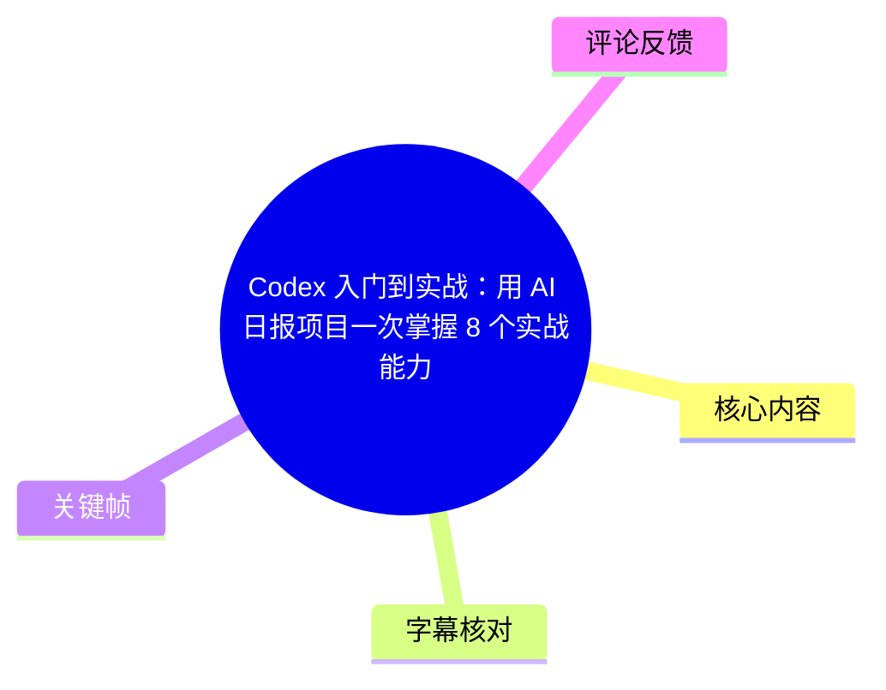
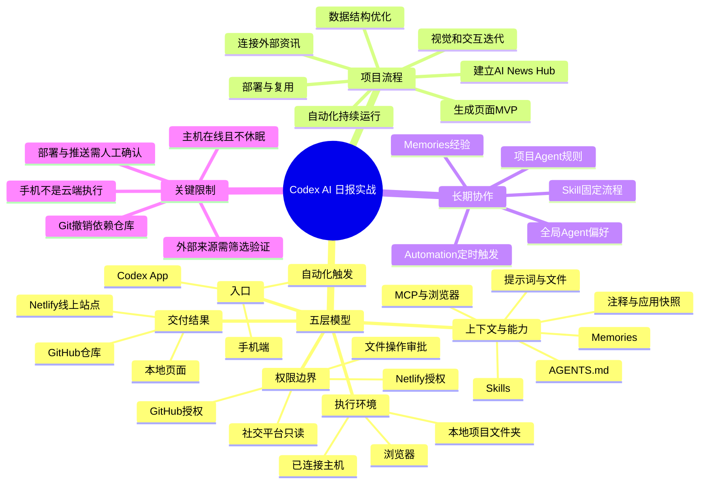
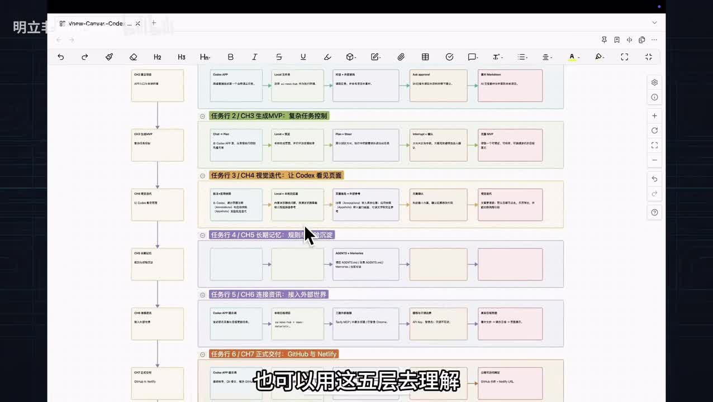
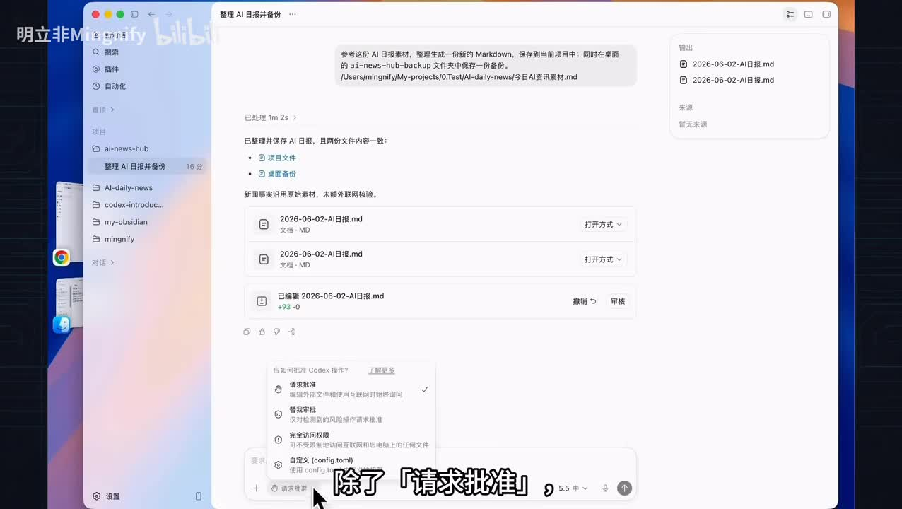
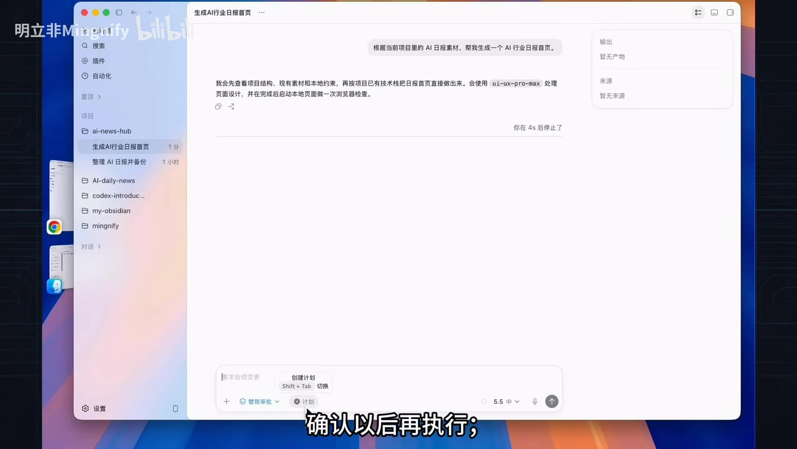
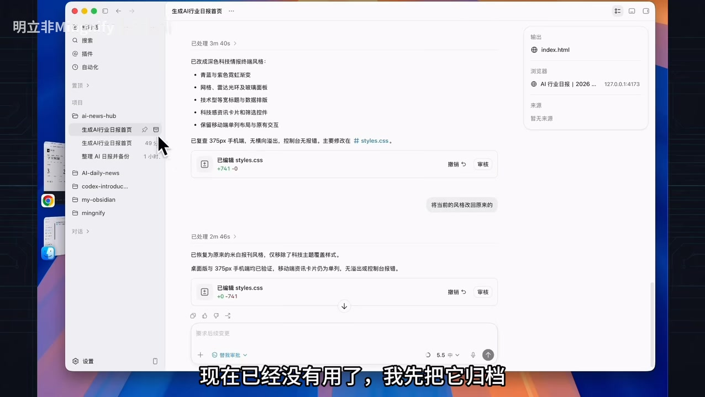

# Codex 入门到实战：用 AI 日报项目一次掌握 8 个实战能力

> 来源：[Bilibili 视频](https://www.bilibili.com/video/BV1kSjA6WEnQ)  
> UP 主：明立非Mingnify｜时长：28 分 09 秒｜合集：AIcode  
> 主题：以一个可持续更新、可部署、可自动化的 AI 日报项目，串联 Codex App 的项目创建、计划控制、视觉迭代、长期记忆、外部信息接入、GitHub/Netlify 交付、Skills 与自动化能力。

## 小结

这不是一份按按钮罗列的 Codex 教程，而是一套以真实项目推进为主线的 Agent 工作方法。视频从本地 `AI News Hub` 项目出发，先把已有 AI 日报素材整理为文件，再生成日报网站 MVP，随后逐层补上可视化修改、长期规则、外部资讯、代码交付与自动化运行能力。

视频提出理解 Codex 及其他 Agent 工具的“五层模型”：**入口、执行环境、上下文、权限边界、交付结果**。同一个功能是否有价值，取决于项目走到什么阶段、当前缺少哪一层能力，而非单纯是否“会点这个按钮”。

核心实践路线可概括为：**素材输入 → 页面生成 → 浏览器验证 → 外部资讯采集 → 素材与页面分层 → Git 提交与 GitHub 推送 → Netlify 部署 → 固化为 Skill → 定时自动化与移动端远程处理审批**。其中最重要的工程经验是将“素材文件”作为输入层，将页面数据作为输出层，避免把每日内容长期堆进 `App.js`。

视频强调 Agent 并非无限制自动执行：跨项目文件操作需要审批；浏览已登录社交平台时必须明确只读边界；推送 GitHub、授权 Netlify、线上部署前都应确认；手机远程控制依旧依赖本机在线、Codex App 运行且设备不休眠。

适合已经接触过 Codex、但难以把聊天式功能串成完整项目的人阅读。视频里的界面、权限模式、插件、MCP、Skills、Automation 与远程控制能力均具有明显产品时效性；具体名称、入口、支持范围和授权流程应以使用时的 Codex、GitHub、Netlify 及第三方服务实际界面为准。

## 思维导图





## 目录

- [项目目标与五层模型](#项目目标与五层模型)
- [建立项目：入口、权限与结果](#建立项目入口权限与结果)
- [生成 MVP：Plan、Steer、Fork 与状态管理](#生成-mvpplansteerfork-与状态管理)
- [视觉迭代：Annotations、Appshots 与上下文管理](#视觉迭代annotationsappshots-与上下文管理)
- [长期记忆：AGENTS 文件与 Memories](#长期记忆agents-文件与-memories)
- [连接资讯：MCP、内置浏览器与已登录 Chrome](#连接资讯mcp内置浏览器与已登录-chrome)
- [审核、Git 与 Netlify 正式交付](#审核git-与-netlify-正式交付)
- [将流程沉淀为 Skill](#将流程沉淀为-skill)
- [自动化、远程控制与 Locked use](#自动化远程控制与-locked-use)
- [完整复盘、限制与可迁移经验](#完整复盘限制与可迁移经验)
- [关键帧索引](#关键帧索引)
- [字幕比对](#字幕比对)
- [评论分析](#评论分析)
- [处理记录](#处理记录)

## 项目目标与五层模型 [00:00:00](https://www.bilibili.com/video/BV1kSjA6WEnQ?t=0)

视频要解决的不是“某个按钮怎么用”，而是面对一个完整项目时，如何决定第一步做什么、后面需要为 Agent 增加什么能力。作者用 AI 日报项目说明三件事：

1. 系统掌握 Codex App 的核心使用方式；
2. 通过五层模型理解 Agent 工具；
3. 跑通可复用的日报项目流程，便于替换为自己的信息源与页面风格。

成品目标不是静态网页：日报网站应获取最新资讯、按固定流程更新内容；创作者不在电脑前时，也能从手机查看进度并处理关键审批。演示过程中，作者称自己不直接写代码、不手动输入终端命令，而是以自然语言指挥 Codex 执行。

五层模型对应的实际含义如下：

| 层级 | 本视频中的实例 | 要回答的问题 |
| --- | --- | --- |
| 入口 | Codex App、手机端、Automation | 从哪里发起或继续任务？ |
| 执行环境 | 本地 `AI News Hub` 文件夹、浏览器、本机主机 | 任务在哪台机器、哪个项目、什么环境中运行？ |
| 上下文与能力 | 素材、提示词、页面注释、截图、Agent 文件、MCP、Skill | Agent 凭什么理解需求、调用什么能力？ |
| 权限边界 | 文件操作审批、GitHub/Netlify 授权、社交平台只读 | 什么操作需确认，什么不能自动做？ |
| 交付结果 | 本地文件、GitHub 仓库、线上网址、定时任务 | 最终可被验收和使用的产物是什么？ |

纵向上，作者将 AI 日报项目拆成多次升级：建立项目、生成 MVP、视觉迭代、记忆规则、连接外部资讯、交付上线、流程复用、持续运行。每一项能力都在项目实际出现需求时再加入。



> 图：关键帧展示了以横向“五层模型”和纵向任务章节组织的流程图。它的价值在于说明视频并非功能清单，而是把能力放入项目阶段、执行环境、权限和产出之间理解。

## 建立项目：入口、权限与结果 [01:14](https://www.bilibili.com/video/BV1kSjA6WEnQ?t=74)

### App 作为 Agent 工作台

[01:15](https://www.bilibili.com/video/BV1kSjA6WEnQ?t=75) 作者说明，Codex 可从 CLI、IDE、Cloud、手机端和 App 等多种入口使用；本期选择 App，因为它对普通用户更直观，也更容易观察任务从发起到执行、交付的完整过程。

相对于传统聊天工具“左侧历史对话、中间聊天区”的结构，视频中的 Codex App 还增加了：

- **左侧**：对话与项目；
- **中间**：自然语言任务输入及上下文补充；
- **右侧**：执行过程、生成文件、修改内容和审查结果。

因此，它不只是聊天窗口，而是连接项目文件、任务执行和结果核验的 Agent 工作台。

### 建立 `AI News Hub` 并测试跨目录操作

[02:23](https://www.bilibili.com/video/BV1kSjA6WEnQ?t=143) 演示步骤为：

1. 在桌面新建文件夹 `AI News Hub`；
2. 用 Codex 打开该文件夹，作为新项目；
3. 要求 Codex 参考 AI 日报素材，整理为一个新的 Markdown 文件；
4. 将文件保存在当前项目；
5. 同时在桌面 `AI News Hub Backup` 文件夹中保存备份。

这里的备份目录位于当前项目外，因此触发了审批请求。作者说明，当前使用的是“请求批准”模式，Codex 在执行项目外文件操作前会暂停并展示准备执行的动作，待用户确认后继续。



> 图：画面展示 Codex 中的项目、任务结果与权限选项。该关键帧直接对应“跨项目文件操作需要审批”的安全边界，避免将 Agent 的文件能力误解为默认可无限制访问。

### 权限策略与推荐选择

[03:14](https://www.bilibili.com/video/BV1kSjA6WEnQ?t=194) 视频展示了几种权限思路：

| 权限方式 | 视频中的描述 | 适用与风险 |
| --- | --- | --- |
| 请求批准 | 遇到需要授权的动作时先询问用户 | 新手或不熟悉项目时适用，安全性较高，但会打断流程 |
| 替我审批 | 先自动审查；一般操作可继续，关键情况再询问 | 作者更推荐在可信项目中使用，可减少频繁中断，同时保留必要边界 |
| 完全访问 | 限制最少 | 风险最高，应谨慎使用 |
| 自定义规则 | 可配置更具体权限规则 | 适合已经明确项目操作范围的用户 |

作者的经验建议是：刚开始使用时先选“请求批准”；熟悉并确认项目可信后，可考虑“替我审批”。这一建议是视频作者的操作偏好，并不意味着任何项目都应放宽权限。

任务完成后，用户可在右侧查看生成了哪些文件、修改了哪些内容和相关审查信息；也可用 Finder 或 VS Code 直接打开项目文件。至此，五层模型形成闭环：从 App 发起任务，项目在本地文件夹运行，通过提示词和资料输入上下文，跨项目资源操作需审批，结果以文件形式在右侧及本地可见。

## 生成 MVP：Plan、Steer、Fork 与状态管理 [04:51](https://www.bilibili.com/video/BV1kSjA6WEnQ?t=291)

### 先停止直接执行，再改用 Plan

[04:52](https://www.bilibili.com/video/BV1kSjA6WEnQ?t=292) 作者直接要求 Codex 根据素材生成 AI 行业日报首页。提交后，聊天模式立即开始读取文件和修改项目；但作者此时尚未确认页面方案，因此中途停止了任务。

随后介绍三种任务模式：

| 模式 | 行为 | 视频中的定位 |
| --- | --- | --- |
| Chat | 提交后直接执行 | 适合方向明确、可快速推进的任务 |
| Plan | 先输出方案，确认后再修改文件 | 适合先审查设计或改动路径 |
| Goal | 持续围绕较长、较复杂的目标工作，直至满足完成条件 | 适合复杂、持续型任务 |

本例切换到 **Plan**，要求 Codex 先理解项目并提出页面计划；当计划还在生成时，作者补充“移动端也要适配”。为了让新要求立即影响当前计划，选择 **Steer（引导）**，而非排队等待后续处理。



> 图：关键帧显示在输入区切换到“计划”模式、确认后执行的工作方式。它直观说明了 Chat 直接执行与 Plan 先审后做的差异，是控制 Agent 改动范围的关键操作。

### 浏览器验收与设计分叉

[06:06](https://www.bilibili.com/video/BV1kSjA6WEnQ?t=366) 页面生成后，可选择 Codex 的内置浏览器或其他浏览器打开；作者以 Chrome 预览并检查整体布局、资讯卡片和移动端适配是否满足计划。

若要试验另一种方案，可使用 **Fork（分叉）**：

1. 从当前对话分出新的路线；
2. 保留原始对话；
3. 在新路线中要求“换成更有科技感的风格”；
4. 完成后打开浏览器查看效果。

分叉的价值是让探索性改动不覆盖原路线。若之前提示词写得不准确，还可编辑旧提示词重新发起；但直接“撤销”修改需要 Git 仓库支持。本例项目尚未初始化 Git，因此无法使用撤销，只能再用对话要求 Codex 改回原风格。

### 对话、归档、额度与状态

[07:20](https://www.bilibili.com/video/BV1kSjA6WEnQ?t=440) 视频还演示了基本管理能力：

- 不再使用的探索性分叉对话可先归档，之后从归档区域删除；
- 设置中的剩余额度可查看当前使用情况，必要时可重置一次使用量；
- 可输入 `/status` 快速查看状态；
- 其他斜杠命令可调用更多常用功能。

此阶段可迁移的流程是：

1. 方向明确的小任务可从 Chat 开始；
2. 一旦发现方案未定，立即中断；
3. 改用 Plan 审查改动方案；
4. 用 Steer 将即时约束注入当前计划；
5. 用浏览器验证结果；
6. 用 Fork 保留探索分支；
7. 要恢复已改内容时，应尽早初始化 Git，而不要只依赖自然语言“改回去”。

## 视觉迭代：Annotations、Appshots 与上下文管理 [08:24](https://www.bilibili.com/video/BV1kSjA6WEnQ?t=504)

### 用页面注释锁定修改位置

[08:25](https://www.bilibili.com/video/BV1kSjA6WEnQ?t=505) 作者检查页面时发现“本期五条资讯”表述模糊，用户无法知道“五条”具体包含什么。此类有明确位置的小问题适合使用 **Annotations（注释）**：

1. 在网页中直接选中这句话；
2. 写下具体要求；
3. 示例要求为：改成“本期精选五条：一条头条、四条行业动态”；
4. 保持当前排版；
5. 移动端不要拆为三行；
6. 回到 Codex 对话，让其处理该注释；
7. 刷新页面确认修改生效。

这比仅靠文字描述更精确：页面选区既提供位置，也携带修改对象，降低“改错地方”的概率。

### 用应用快照导入交互参考

[09:06](https://www.bilibili.com/video/BV1kSjA6WEnQ?t=546) 页面日期最初只是不可点击文本，因此作者希望加入日期选择能力。操作过程：

1. 打开一个日期选择器参考页面；
2. 展示输入框、月份、年份与完整月历；
3. 同时按下左右两个 `Command` 键，通过 **Appshots（应用截图）** 将前台窗口带入 Codex；
4. 明确要求 Codex 只参考交互样式，不复制视觉样式；
5. Codex 给出最小可行方案；
6. 保留页头日期位置，点击后弹出月历；
7. 先只做 6 月 1 日与 6 月 2 日两期示例；
8. 只有已生成日报的日期可点击，其余日期禁用；
9. 确认执行并在页面中验证两日期切换。

视频对 Appshots 的定义不只是普通图片：它会将当前最前方应用窗口的可见画面，以及窗口内可读取的文字信息一起带入 Codex。因此它适合引用外部产品的交互结构，但不应替代对视觉版权、内容授权和实际交互可行性的判断。

### 上下文容量与任务边界

[10:15](https://www.bilibili.com/video/BV1kSjA6WEnQ?t=615) 视频将 Codex 上下文扩展为：

- 文字提示与项目文件；
- 页面注释；
- 外部应用窗口及其可读文字；
- 历史对话；
- IDE 背景信息与代码环境。

右下角可查看上下文余额。作者建议：

- 仍是同一任务、只是对话太长时，可用压缩命令压缩上下文；
- 已经变成新任务时，更推荐新开对话，确保任务边界清晰。

这里的关键经验是：**丰富上下文不等于无限堆叠上下文**。明确选区、可追溯参考和清晰任务边界，比把大量历史内容全部塞入一个对话更可控。

## 长期记忆：AGENTS 文件与 Memories [11:14](https://www.bilibili.com/video/BV1kSjA6WEnQ?t=674)

[11:17](https://www.bilibili.com/video/BV1kSjA6WEnQ?t=677) 视频将“Codex 如何记住规则和经验”拆为四类：

| 类型 | 来源与范围 | 视频中的作用 |
| --- | --- | --- |
| 项目 Agent 文件 | 用户手写；当前项目 | 定义项目规则 |
| 全局 Agent 文件 | 用户手写；跨项目通用偏好 | 定义个人身份、偏好与安全规则 |
| Memories | 系统从长期协作中沉淀 | 保存协作背景、习惯与项目经验 |
| 当前对话 | 单次任务的过程记录 | 保存这一次任务的即时上下文 |

作者的简化区分是：**Agent 是手写规则，Memory 是系统自动形成的记忆，对话是任务过程记录。**

### 项目规则：从项目说明书开始

[11:43](https://www.bilibili.com/video/BV1kSjA6WEnQ?t=703) 在 AI 日报项目经过多轮迭代后，作者归纳出一些规则，例如：

- 不使用框架；
- 移动端需要适配；
- 修改文件前先说明计划。

随后要求 Codex 基于当前项目创建 Agent 文件。视频将该文件比作“项目说明书”：之后 Codex 在该项目继续工作时，会优先参考其中规则。

作者建议项目初期最好就有一个简单版本的 Agent 文件，并在迭代中持续更新。本视频把它放到中段展示，是为了先跑完前面的真实操作，再解释规则的来源。

### 全局偏好与身份信息

[12:23](https://www.bilibili.com/video/BV1kSjA6WEnQ?t=743) 全局 Agent 文件管理用户通用偏好。视频中的全局文件已有安全规则，如“不能批量删除文件”，但尚未写入作者身份。

作者先在对话中问 Codex“我是谁？”此时 Codex 不真正知道身份，只能根据电脑用户名、项目路径等线索推测，例如回答 `mingnify`。之后作者将身份写进全局 Agent 文件，新开对话测试，Codex 才按规则回答“你是 mingnify，一位内容创作者”。

这说明模型从路径等环境线索做出的回答并非可靠身份事实；希望稳定生效的身份、写作偏好、安全底线应显式写入规则，而非依赖推测。

### Memories 的形成与删除关系

[12:57](https://www.bilibili.com/video/BV1kSjA6WEnQ?t=777) 作者通过询问“之前做过几次 Agent Daily News 项目、分别是什么时候”演示 Memories。Codex 返回两次项目经历的说明，界面底部还能看到引用的记忆。

视频称可在“设置—个性化”中开启记忆。启用后，Codex 会随协作逐渐积累背景、偏好与项目经验，使用越多，越可能贴近工作方式。

[13:39](https://www.bilibili.com/video/BV1kSjA6WEnQ?t=819) 对话与记忆的关系需特别注意：

- 对话是本次任务的原始过程；
- Memories 是经过一段时间从对话中总结出的结果；
- 已形成的记忆，不会因为删除原始对话而自动消失；
- 如果对话在尚未形成记忆前被删除，则可能无法再沉淀为记忆。

因此，记忆并不等同于“对话永久保存”，也不应把系统记忆当作无误的项目文档。关键、可审计、需要明确生效范围的规则，仍应写入项目或全局 Agent 文件。

## 连接资讯：MCP、内置浏览器与已登录 Chrome [14:32](https://www.bilibili.com/video/BV1kSjA6WEnQ?t=872)

### 先分离素材输入层和页面输出层

[14:33](https://www.bilibili.com/video/BV1kSjA6WEnQ?t=873) 到此页面虽可展示内容，但仍基于本地素材，是 Demo。真正日报需要持续接入外部信息。

作者先调整项目结构：日报页面是给用户看的最终结果，外部获取的信息不应直接塞进页面。因此先创建专门的**素材文件夹**与**素材文件**。这成为后续数据管线的基础：

```text
外部来源
  → 当天素材文件（输入层）
  → 筛选、摘要、结构化整理
  → 日报页面数据（输出层）
  → 页面渲染
```

### 三类资讯来源与操作边界

[15:03](https://www.bilibili.com/video/BV1kSjA6WEnQ?t=903) 视频展示了三类来源：

| 来源类别 | 接入方式 | 演示操作 | 数量/结果 |
| --- | --- | --- | --- |
| 公开新闻 | 在 Tavily 官网获取 API Key，并在终端配置 Tavily MCP | 先验证 MCP 可用，再搜索 6 月 15 日 AI 领域重要新闻 | 筛选 5 条写入 `2026-06-16` 的公开信息部分 |
| 公开网页趋势项目 | Codex 内置浏览器 | 打开 GitHub Trending，读取项目内容，筛选 AI、Agent、LLM、开发者工具相关项目 | 整理 5 条追加到素材文件 |
| 登录态信息流 | 已登录的 Chrome | 按账号和日期搜索 X 上的官方账号动态 | 未找到目标官方账号信息；写入 2 条可确认的官方或准官方开发者动态 |

这里的日期、来源和条目数均为视频演示场景中的数据，不能据此推断为当前实时资讯。

对于 X 上的信息，作者明确规定了权限边界：**只读，不点赞、不转发、不关注、不评论、不发帖**。这表明“能够访问已登录浏览器”不应自动扩展为“允许代替用户进行社交行为”。

### 从素材到日报，而不是来源堆叠

[17:06](https://www.bilibili.com/video/BV1kSjA6WEnQ?t=1026) 外部内容采集完成后，才进入真正日报生成。作者要求 Codex 基于素材文件完成筛选、摘要与整理，形成一条“今日头条”和多条行业动态，再更新页面中的日报数据。

演示生成后，6 月 15 日日报显示“本期精选 7 条”：**1 条头条、6 条行业动态**。作者特别强调：页面展示的不是三类来源的原始堆叠，而是经过筛选后的最终内容。

可复用的原则是：

1. 保留原始或初步整理素材，方便追溯来源；
2. 将页面内容视为二次编辑后的输出；
3. 允许素材数量多于最终展示条数；
4. 将采集、筛选、写作、渲染拆开，降低页面逻辑与事实来源混杂的风险；
5. 对外部资讯仍需人工核验，尤其是“官方”“准官方”、日期和事实归属判断。

## 审核、Git 与 Netlify 正式交付 [18:17](https://www.bilibili.com/video/BV1kSjA6WEnQ?t=1097)

### 上线前检查清单

[18:23](https://www.bilibili.com/video/BV1kSjA6WEnQ?t=1103) 正式交付前，作者让 Codex 检查：

- 页面能否正常打开；
- 日报内容能否正常展示；
- 日期切换是否正常；
- 移动端布局是否存在明显异常。

检查完成后，视频中确认页面可访问、核心功能可跑通。这里的“通过”只代表演示时的检查结果，不等同于覆盖所有浏览器、网络环境、可访问性、性能和安全测试。

### Git、GitHub 与结构优化

[18:45](https://www.bilibili.com/video/BV1kSjA6WEnQ?t=1125) 作者补充：真实项目中 Git 最好从项目开始就使用，并在重要节点提交；本视频为先展示 Codex 任务流程，才把 Git 集中放到交付环节。

执行前置条件是：

- 本机已配置 GitHub CLI，**或**
- 已完成 GitHub 授权。

视频中通过插件搜索 GitHub、点击连接并跳转浏览器授权。之后向 Codex 下达完整任务：

1. 检查当前项目 Git 状态；
2. 若未初始化，则初始化 Git；
3. 创建本地提交；
4. 若没有 GitHub 仓库，创建仓库；
5. 推送到远端。

Codex 先处理本地状态、初始化和稳定版本提交，再检查远端；如不存在远端，则经 GitHub CLI 创建新仓库并设为远程地址。仓库可选私有或公开，视频选择了**私有仓库**。

[20:00](https://www.bilibili.com/video/BV1kSjA6WEnQ?t=1200) 推送后，作者发现项目已有多期日报，但仓库中没有独立保存日报数据的目录。Codex 检查后指出，日报数据都写在 `App.js` 中：作为短期 MVP 可运行，但如果每天更新，JS 文件会越来越大，页面逻辑和内容数据混在一起，维护成本上升。

优化方案为：

```text
优化前：
App.js
  ├─ 页面逻辑
  └─ 多期日报内容数据

优化后：
data/ 或专用数据目录
  └─ 多期日报数据
App.js
  └─ 读取并渲染数据
```

作者完成重构后，在本地再次预览页面、检查日期切换和移动端布局；确认无误后再提交并推送 GitHub。该案例的经验是：MVP 可以快速验证，但当内容按日增长时，应及早将内容数据与渲染逻辑分离。

### Netlify 部署链路

[20:56](https://www.bilibili.com/video/BV1kSjA6WEnQ?t=1256) 作者询问项目已推送 GitHub 后如何部署至 Netlify。Codex 建议在 Netlify 中导入 GitHub 仓库，以便后续每次 GitHub 推送后自动重新部署。

视频中的部署步骤：

1. 打开 Netlify；
2. 选择导入仓库；
3. 连接 GitHub；
4. 授权 Netlify 访问仓库；
5. 选择 `AI News Hub`；
6. 按 Codex 给出的配置说明填写并开始部署；
7. 部署完成后访问 Netlify 提供的站点地址；
8. 确认页面可正常访问。

交付结果由“本地能打开的项目”升级为“有 GitHub 仓库、有线上访问地址的站点”。与此同时，权限边界也增加了 GitHub 和 Netlify 授权。作者提醒提交与部署均应确认清楚，不要盲目推送。

## 将流程沉淀为 Skill [22:23](https://www.bilibili.com/video/BV1kSjA6WEnQ?t=1343)

[22:24](https://www.bilibili.com/video/BV1kSjA6WEnQ?t=1344) 完整流程已跑通：采集资讯、整理素材、更新页面、检查、提交 GitHub、部署 Netlify。问题是第二天生成下一期日报时，是否还要重新描述整套流程？作者的答案是将其固化为 **Skill**。

操作方式：

1. 回到第六章“连接资讯”对应的对话；
2. 点击分支，从已验证的对话分出新路线；
3. 基于这段已跑通过真实流程的上下文；
4. 告诉 Codex：使用 **Skill Creator** 创建“AI 日报更新 Skill”；
5. 用新日期测试，例如生成 `2026-06-16` 的 AI 日报；
6. 明确本次测试需执行 Tavily 公开新闻、GitHub 趋势、X 三个采集阶段；
7. 明确测试阶段**不做页面检查、不做 Git 提交和推送**；
8. 观察素材文件生成、页面日报数据更新；
9. 再迭代 Skill，将已确认的 Git 提交与推送步骤加入；
10. 调用 Skill 完成提交、推送后，刷新 Netlify 线上站点确认更新。

[23:57](https://www.bilibili.com/video/BV1kSjA6WEnQ?t=1437) 视频进一步区分四个概念：

| 概念 | 视频中的定义 | 解决的问题 |
| --- | --- | --- |
| Agent 文件 | 项目规则，告诉 Codex 在项目中要做什么 | “应遵守什么规则？” |
| Memory | 来自过去协作的长期经验 | “我是谁、我通常如何工作？” |
| Skill | 固定流程，告诉它一件事按什么步骤做 | “这件事具体怎样做？” |
| Automation | 自动触发机制，决定何时直接运行流程 | “什么时候做？” |

Skill 可以自行创建，也可以使用已有或安装成熟的第三方 Skill；但视频重点是将自己已验证的 AI 日报流程整理成可复用 Skill。其前提是流程本身已被跑通和理解；不应把未经验证、权限范围不清的复杂操作直接打包后自动调用。

## 自动化、远程控制与 Locked use [24:49](https://www.bilibili.com/video/BV1kSjA6WEnQ?t=1489)

### 创建定时自动任务

[25:04](https://www.bilibili.com/video/BV1kSjA6WEnQ?t=1504) 视频将自动化定位为：把“手动发起”的项目升级为可持续运行、可远程查看和接管的 AI 助手，而不只是一个单独的“自动化按钮”。

进入自动化模块后，可见三种创建方式：

- 使用模板；
- 手动创建；
- 直接在聊天中让 Codex 创建。

作者选择最自然的聊天方式，输入“每天早上 9 点运行 AI 日报更新流程”。创建后，自动化模块中出现对应任务，后续可按该时间触发，用户主要负责检查结果。

### 手机远程控制不等于云端运行

[25:34](https://www.bilibili.com/video/BV1kSjA6WEnQ?t=1534) 自动化运行后，用户不在电脑前时，可通过手机端：

- 查看正在运行的任务；
- 查看日志；
- 补充指令；
- 在需要时处理审批；
- 从手机发起任务，让电脑上的 Codex 分析当前项目。

但视频明确限制：**手机端不是云端运行**。它仍依赖那台连接主机，因此：

1. 电脑必须在线；
2. Codex App 必须保持打开；
3. 设备最好不要进入睡眠。

也就是说，它解决的是“人不在电脑前”，而不是“电脑关机后仍能运行”。

### 桌面应用与锁屏操作

[26:14](https://www.bilibili.com/video/BV1kSjA6WEnQ?t=1574) 如果任务不在文件、网页或接口中，而需要打开各类桌面应用、读取内容、点击按钮、填写信息，则可使用视频所述的“电脑操控任意应用”能力。

若该电脑操作任务正在远程执行、但 Mac 已锁屏，视频说明 **Locked use（锁屏操作）** 是在用户允许后，让 Codex 临时继续操控桌面任务的机制。

作者最终强调：持续工作章节的重点不是让 Codex“失控自动干活”，而是在明确的：

- 时间；
- 主机；
- 执行环境；
- 权限边界；
- 人工审批与验收；

之内，让前面已沉淀的日报流程稳定持续运行。

## 完整复盘、限制与可迁移经验 [27:09](https://www.bilibili.com/video/BV1kSjA6WEnQ?t=1629)

[27:10](https://www.bilibili.com/video/BV1kSjA6WEnQ?t=1630) 视频最后回顾：它没有零散介绍功能，而是通过一个 AI 日报项目完成从建项目、生成页面、视觉迭代、长期记忆、连接真实资讯、正式交付、流程复用，到自动化和远程管理的完整工作流。

三项主要收获为：

1. **Codex App 的项目工作流**  
   会建立项目、发任务、控制方向、查看结果、连接工具、提交代码和部署网站。

2. **Agent 五层模型**  
   用入口、执行环境、上下文、权限边界、交付结果理解 Agent，而不只记住产品按钮。

3. **可迁移的 AI 日报方法**  
   可替换资讯来源、页面样式和交付渠道，构建自己的日报项目。

### 可迁移实践清单

```markdown
- [ ] 创建独立项目目录，并明确项目外目录的访问边界
- [ ] 先用少量本地素材生成 MVP
- [ ] 方案未明确时使用 Plan，而非让 Chat 直接大范围改文件
- [ ] 用 Steer 补充当前计划，用 Fork 隔离探索性改动
- [ ] 通过浏览器验收页面、日期切换与移动端布局
- [ ] 用 Annotation 定位页面改动，用 Appshots 引入外部交互参考
- [ ] 在项目初期写入并持续维护 AGENTS.md
- [ ] 分离原始素材、日报数据和页面渲染逻辑
- [ ] 外部资讯采集必须明确来源、日期、筛选规则与只读边界
- [ ] 从项目开始使用 Git，在关键节点提交
- [ ] GitHub 推送与 Netlify 部署前检查授权和目标仓库
- [ ] 仅将已跑通的流程制作成 Skill
- [ ] 自动化前确认主机在线、App 运行、睡眠策略与审批机制
```

### 重要限制与时效性

- **产品能力可能变化**：视频涉及 Codex App 的模式、插件、MCP、Skills、Automation、手机端、远程控制和 Locked use；其名称、入口、可用地区、订阅要求和权限策略均可能在视频发布后调整。
- **第三方服务需单独配置**：Tavily MCP 需要 API Key；GitHub 推送需要 GitHub CLI 或授权；Netlify 部署需要仓库访问授权。视频只展示路径，未提供可直接复制的完整配置文件或命令。
- **外部资讯不是自动可信**：即使由 MCP、内置浏览器或已登录 Chrome 获取，仍需核查来源、发布日期、账号身份及摘要准确性；演示中“官方或准官方”的判断只代表当时筛选结果。
- **Git 撤销有前提**：项目未初始化 Git 时，界面中的撤销能力不能直接使用。应尽早初始化仓库并在关键节点提交。
- **自动化依赖主机**：手机端和定时任务不代表任务已迁移到云端；主机离线、App 关闭或设备睡眠时，视频所述流程可能无法按预期运行。
- **权限不能因自动化而被忽略**：跨目录文件操作、社交平台行为、GitHub 推送、仓库公开性选择、Netlify 部署都可能造成不可逆影响，需保持审批和人工验收。
- **视频中的日期仅为演示数据**：`2026-06-15`、`2026-06-16` 等日报日期及条目数是视频演示上下文，不应视为当前新闻或实时状态。

## 关键帧索引

| 时间点 | 关键帧 | 用途与价值 |
| --- | --- | --- |
| [00:53](https://www.bilibili.com/video/BV1kSjA6WEnQ?t=53) |  | 展示五层模型与项目任务矩阵，是理解整套教程结构的总览。 |
| [02:52](https://www.bilibili.com/video/BV1kSjA6WEnQ?t=172) |  | 展示项目外文件操作、审批选项和任务结果，支撑权限边界说明。 |
| [05:34](https://www.bilibili.com/video/BV1kSjA6WEnQ?t=334) |  | 展示 Plan 模式下先确认方案再执行，是避免直接修改失控的核心操作。 |
| [07:20](https://www.bilibili.com/video/BV1kSjA6WEnQ?t=440) |  | 展示探索性分支完成后归档、删除和恢复风格的对话管理场景。 |

## 字幕比对

| 字幕来源 | 完整性 | 专有名词 | 时间轴 | 主要问题 |
| --- | --- | --- | --- | --- |
| Bilibili 站内字幕 `p01-ai-zh.srt` | 与本视频完全不匹配 | 大量内容为校招 Offer、工资、年终奖等，与 Codex 无关 | 有精确分段，但仅覆盖约 13 分 20 秒且内容错误 | 属于其他视频字幕，不能作为本视频事实依据 |
| 本次 ASR 字幕 | 覆盖 0–1688.06 秒；诊断语音覆盖率 94.32% | 存在音近误识别，如 `CodeX/Codecs/Codext`、`Tablet`、`Netnifi`、`全线边界` 等 | 有完整逐段时间戳，可用于章节链接 | 个别专有名词和术语转写不准，但上下文与视频标题、关键帧和章节结构一致 |

### 最终字幕选择与校正

本次整理以 **ASR 时间轴字幕** 为主，因为其内容与视频主题、元数据、章节导航及关键帧一致，且具备完整时间戳。ASR 诊断未标记 `noAudioStream=true`，源视频存在音轨；本次 ASR 使用 `medium` 模型、中文识别，未报告大段缺失。

站内字幕虽存在，但内容是“校招 Offer 薪资结构拆解”，与本视频完全无关，因此仅作为异常字幕来源记录，不参与正文事实提取和时间定位。

结合视频标题、简介、ASR 上下文和关键帧，对下列明显误识别进行了规范化表述：

| ASR 常见写法 | 正文采用写法 | 校正依据 |
| --- | --- | --- |
| CodeX / Codecs / Codext | Codex | 视频标题、项目主题与全程语境一致 |
| 五成 / 全线边界 | 五层 / 权限边界 | 作者在开场明确列出五层模型 |
| Tablet / Tablets | Tavily | 视频简介提及“外部资讯接入”；ASR 语境为新闻检索 API 与 MCP |
| Netnifi / NetanyFive | Netlify | 视频简介章节写明 GitHub 与 Netlify |
| Agent 文件 | `AGENTS.md` / Agent 文件 | 视频简介明确写有“AGENTS.md 与 Memories”；实际文件名以使用时工具约定为准 |
| 应用解图 | 应用截图（Appshots） | ASR 前后语境为将前台应用窗口及可读文字带入 Codex |
| 世界绝代 / 上下门 | 视觉迭代 / 上下文 | 前后章节内容分别为网页视觉修改与上下文能力扩展 |

## 评论分析

> 仅获取到 2 条热评，未获取到第 3 条，因此不补写或推断不存在的评论。

1. **夜熙寒霜**（2 赞）  
   评论希望 UP 主制作“Obsidian 的实战教程”。这反映该观众认可视频所采用的“完整项目实战”形式，并期待将同类 Agent 工作流迁移到知识管理工具。该评论是需求反馈，不构成 Obsidian 与 Codex 已完成集成或存在特定能力的事实证明。

2. **__镜流__**（2 赞）  
   评论内容是请求 `@MilkyAi` 详细总结视频，并要求“结论在前、总结在后、发到邮箱”。这说明观众对结构化总结和结果导向的知识整理有需求，但邮件发送、第三方账号能力或是否实际完成均未在评论中得到验证，不能据此视为视频功能或服务承诺。

## 处理记录

- Worker ID：`worker-mrj0www4-e8d79408`
- 模型：`gpt-5.6-terra`
- 调用工具与素材：视频元数据、关键帧、站内 SRT、ASR SRT、ASR 诊断结果、热评数据。
- 本次 ASR：`medium` 模型，`cuda`、`float16`；识别语言为中文，语言概率 `0.99951171875`；时长 `1688.5783125` 秒；ASR 具完整时间戳。
- 字幕选择：检查了站内字幕与本次 ASR。站内字幕内容与本视频不匹配，未采用；以本次 ASR 时间轴为正文时间定位依据，并按标题、简介、关键帧和上下文校正明显专名误识别。
- 关键帧选择依据：选取 `frame-001` 至 `frame-004`，分别对应五层模型总览、审批边界、计划模式与对话归档，均直接服务于正文中的方法解释，而非仅作装饰。
- 评论处理：仅分析可获取热评前 3 条；实际仅返回 2 条，已明确说明。
- 缓存清理：素材清单未提供缓存清理执行日志；无法确认是否已执行缓存清理，故不编造清理结果。
- 未解决问题：
  - 未提供逐帧时间戳与 `frame-005` 至 `frame-012` 的画面内容，未强行推定其对应场景；
  - ASR 对 Tavily、Netlify、Codex 等专有名词存在误识别，正文已按上下文规范化，但具体产品界面与配置仍应以当前官方文档为准；
  - 元数据发布时间为 Unix 时间戳换算日期，未额外验证发布地区时区。
