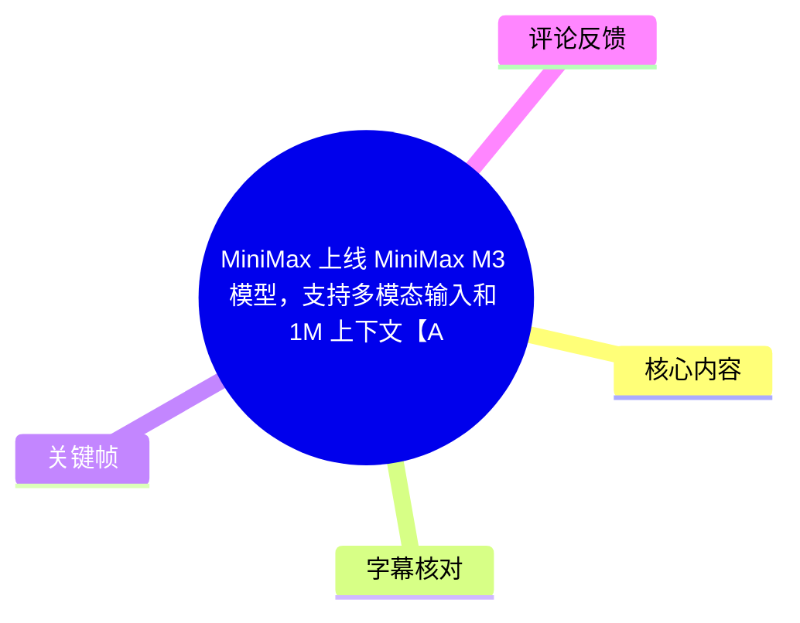
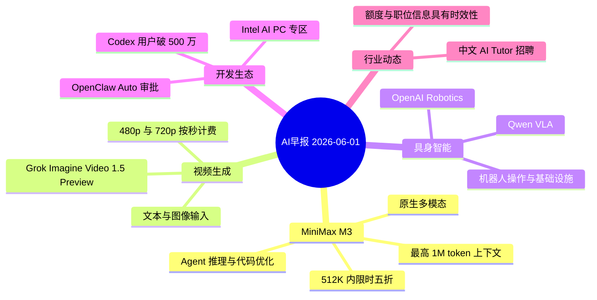
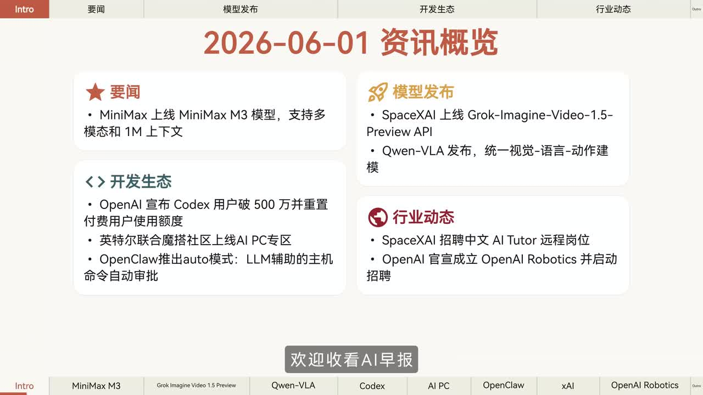
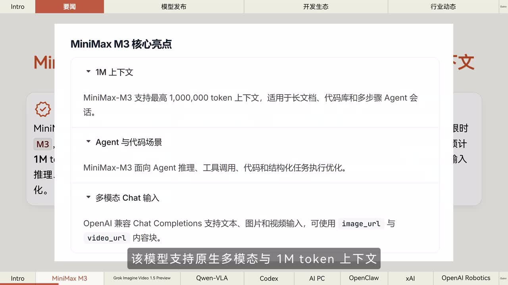
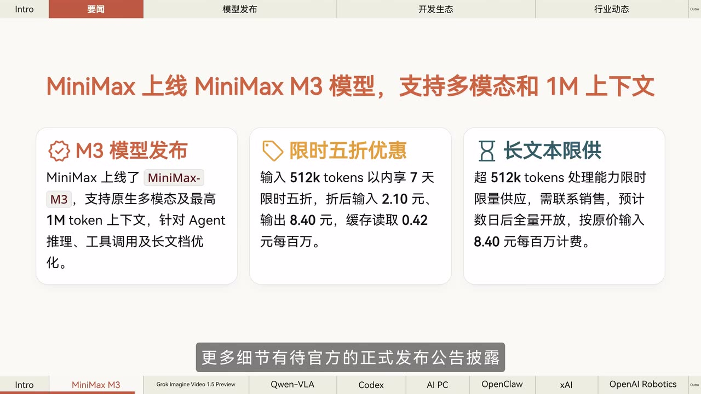
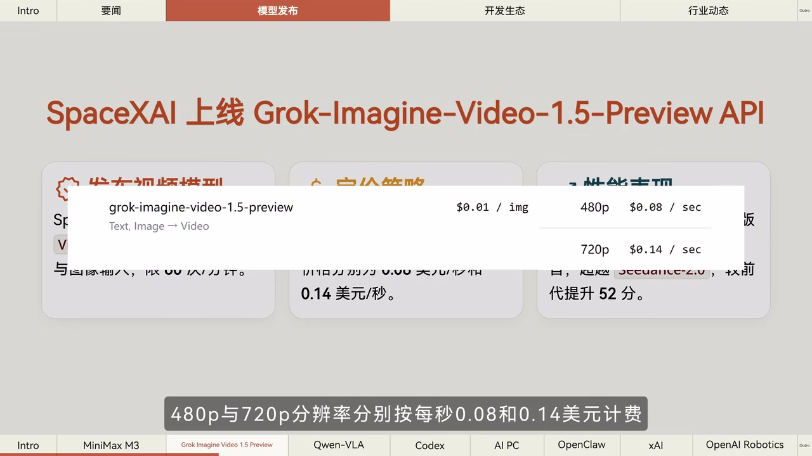

# MiniMax 上线 MiniMax M3 模型，支持多模态输入和 1M 上下文【AI 早报 2026-06-01】

> 来源：[Bilibili 视频](https://www.bilibili.com/video/BV1TwVR6qEd9)  
> UP 主：橘鸦Juya｜视频时长：02:22｜合集：AIcode  
> 信息日期：2026-06-01。视频为短资讯播报，所述模型能力、价格、排名、职位与限时活动均可能在发布后变动。

## 小结

本期 AI 早报围绕 2026 年 6 月 1 日前后的模型发布、开发者生态和行业招聘展开，核心新闻是 **MiniMax M3** 上线：视频画面与播报均指向其支持原生多模态输入、最高 **1M token** 上下文，并面向 Agent 推理、工具调用、代码及长文档场景优化。

MiniMax M3 的画面信息补充了较具体的商业参数：输入不超过 512K token 时有 7 天限时五折，折后输入、输出、缓存读取价格分别为 **2.10 元 / 8.40 元 / 0.42 元每百万 token**；超过 512K token 的处理能力则为限量供应，需要联系销售，画面称预计数日后全量开放，原价输入为 **8.40 元/百万 token**。因此，1M 上下文是能力上限，不等于所有用户能即时、无条件使用。

视频还提到 SpaceXAI 上线 `Grok-Imagine-Video-1.5-Preview` API：可由文本或图像生成视频，480p 与 720p 分别按 **0.08 美元/秒**、**0.14 美元/秒**计费；画面另显示图像价格为 **0.01 美元/张**。播报称其 720p 版本在 Image-to-Video Arena 排行第一，但这是资讯视频转述的平台数据，应以 Arena 当时页面为准。

其余资讯覆盖：千问团队发布 Qwen-VLA 视觉—语言—动作通用模型；Codex 用户突破 500 万且 ChatGPT 付费用户额度重置；Intel 与魔搭社区建设 AI PC 专区；OpenClaw 测试由独立 LLM 审查器驱动的主机命令审批模式；SpaceXAI 招聘中文 AI Tutor；OpenAI 将世界模拟研究项目演变为 OpenAI Robotics 并开始招聘。

适合关注长上下文模型成本、Agent/代码工作流、多模态视频生成、端侧 AI 与具身智能动态的开发者阅读。需要特别注意：本视频是新闻提要，未展示 API 调用实测、模型基准的完整方法、职位申请链接或产品条款原文，不能据此替代官方文档与实时价格页。

## 思维导图

## 目录

- [资讯范围、时间与阅读边界](#资讯范围时间与阅读边界)
- [MiniMax M3：1M 上下文、多模态与价格限制](#minimax-m3-1m-上下文多模态与价格限制)
- [Grok-Imagine-Video-1.5-Preview：视频生成接口与计费](#grok-imagine-video-15-preview视频生成接口与计费)
- [Qwen-VLA 与 Codex：具身模型和代码生态](#qwen-vla-与-codex具身模型和代码生态)
- [AI PC 与 OpenClaw：端侧部署及命令审批](#ai-pc-与-openclaw端侧部署及命令审批)
- [招聘与 OpenAI Robotics](#招聘与-openai-robotics)
- [信息使用步骤与核验清单](#信息使用步骤与核验清单)
- [结论与限制](#结论与限制)
- [字幕比对](#字幕比对)
- [评论分析](#评论分析)
- [处理记录](#处理记录)

## 资讯范围、时间与阅读边界 [00:00:02](https://www.bilibili.com/video/BV1TwVR6qEd9?t=2)

视频开场说明当日为 **6 月 1 日，周一**，随后以“要闻、模型发布、开发生态、行业动态”四类组织资讯。画面总览列出：

- **要闻**：MiniMax 上线 MiniMax M3，支持多模态与 1M 上下文。
- **模型发布**：SpaceXAI 上线 Grok-Imagine-Video-1.5-Preview API；Qwen-VLA 发布。
- **开发生态**：Codex 用户突破 500 万并重置付费用户额度；Intel AI PC 专区；OpenClaw 的 Auto 模式。
- **行业动态**：SpaceXAI 招聘中文 AI Tutor；OpenAI Robotics 成立并启动招聘。

> 图：该关键帧集中展示视频的四类资讯结构和全部主题，可用于确认本期并非只报道 MiniMax，而是一则包含模型、开发工具与招聘动态的日报。

视频没有给出新闻来源链接、发布日期逐条对照或官方公告截图。因此，本文将“视频播报”“画面呈现”和“可确认程度”区分开：凡是价格、限时活动、排行榜、招聘薪资等短期信息，均应以对应产品官网、平台榜单或招聘页面的实时内容复核。

## MiniMax M3：1M 上下文、多模态与价格限制 [00:00:02](https://www.bilibili.com/video/BV1TwVR6qEd9?t=2)

### 视频陈述的能力定位

播报称 MiniMax 上线新一代旗舰模型 **MiniMax M3**，具备以下定位：

1. **原生多模态**：视频画面具体写为 OpenAI 兼容的 Chat Completions 支持文本、图片和视频输入，可通过 `image_url`、`video_url` 内容块传入。
2. **最高 1,000,000 token 上下文**：适用于长文档、代码库和多步骤 Agent 会话。
3. **任务优化方向**：面向 Agent 推理、工具调用、代码和结构化任务执行优化。
4. **接入与活动**：播报称已上线 API 和 Token Plan，并在 OpenCode 中提供限时免费使用；但未给出 API 地址、模型标识、Token Plan 规则或免费额度，不能据此直接推断可用条件。

> 图：画面直接展示“1M 上下文”“Agent 与代码场景”“多模态 Chat 输入”三项能力，并给出 `image_url`、`video_url` 两个输入字段，是校正 ASR 中“eam token”等识别误差的关键依据。

### 价格、阈值与供应限制

视频画面给出的 MiniMax M3 商业信息如下：

| 项目 | 视频画面信息 | 使用时应注意的限制 |
| --- | --- | --- |
| 优惠范围 | 输入在 **512K token 以内**，享 7 天限时五折 | 活动起止时间、适用账户和币种应以官方计费页为准 |
| 折后输入价格 | **2.10 元/百万 token** | 仅画面所述的限时优惠条件下适用 |
| 折后输出价格 | **8.40 元/百万 token** | 未说明是否区分模型版本或调用区域 |
| 缓存读取价格 | **0.42 元/百万 token** | 需确认缓存命中定义及是否另有缓存写入费用 |
| 超长上下文 | 超过 **512K token** 的处理能力限量供应，需要联系销售 | 1M 上下文并非视频所示的常规、立即开放额度 |
| 超长上下文后续价格 | 画面称预计数日后全量开放，按原价输入 **8.40 元/百万 token** 计费 | “预计数日后”属于当时预测，发布后可能已失效 |

> 图：该页同时呈现 M3 的定位、512K token 内的 7 天五折价格，以及超过 512K token 的供应限制；它说明“支持 1M”与“可常规获得 1M 请求处理”需要分开理解。

### 对开发者的可迁移判断

若要评估该模型是否适合项目，不能只根据“1M token”做选择，而应依次核验：

- 工作流是否确实需要将整份长文档、代码库或多轮会话放进单次上下文；
- 常规请求是否会超过 512K token，从而触发供应或销售接入限制；
- 计算输入、输出与缓存读取 token 后的总成本，而不只看输入单价；
- 多模态输入是接收 URL、上传文件、还是另有文件大小、格式、时长与并发限制；
- Agent 工具调用、结构化输出和代码质量是否有可复现的官方评测或项目实测。

视频明确表示“更多细节有待官方正式发布公告披露”，这意味着模型架构、完整限额、上下文内不同模态的 token 计量规则、API 参数与基准结果均未在本视频中展开。

## Grok-Imagine-Video-1.5-Preview：视频生成接口与计费 [00:00:26](https://www.bilibili.com/video/BV1TwVR6qEd9?t=26)

视频播报称 **SpaceXAI** 发布视频生成模型 `Grok Imagine Video 1.5 Preview`，并已上线 API。这里的产品和组织名称按视频画面及 ASR 原样记录；视频未展示官方链接，故不对其命名关系作超出素材范围的推断。

### 输入、分辨率与价格

视频披露的参数为：

| 能力或参数 | 视频内容 |
| --- | --- |
| 生成方式 | 文本、图像 → 视频 |
| 图像价格 | **0.01 美元/张**（画面弹层） |
| 480p 视频 | **0.08 美元/秒** |
| 720p 视频 | **0.14 美元/秒** |
| 排名表述 | 播报称 720p 版本在 Image-to-Video Arena 排行榜位居第一 |

> 图：关键帧中的计费弹层明确标注 `480p $0.08 / sec`、`720p $0.14 / sec` 及 `$0.01 / img`，为视频中最具体、可用于成本估算的参数来源。

画面背景另出现“排行榜表现”卡片；可见文字指向其在 Image-to-Video Arena 的表现，并涉及与 `Seedance-2.0` 的分差内容，但画面局部被价格弹层遮挡。可可靠采用的是播报的“720p 位居第一”说法；不应据遮挡画面推导完整评分、样本量、榜单日期或测试协议。

### 成本估算方法

视频只给出按秒价格，未指定生成时长、重试、排队、输入图处理和附加服务规则。仅按画面单价计算：

- 生成一段时长为 `d` 秒的 480p 视频：成本约为 `0.08 × d` 美元；
- 生成一段时长为 `d` 秒的 720p 视频：成本约为 `0.14 × d` 美元；
- 若使用 `n` 张图像作为输入，且图像收费确如画面所示：额外图像成本约为 `0.01 × n` 美元。

这只是基于视频中列价的静态估算，不包含失败重试、不同生成模式、税费、汇率、最低消费或后续调价。排行榜第一也不等于在所有提示词、运动幅度、人物一致性、安全策略和成本维度上都最优。

## Qwen-VLA 与 Codex：具身模型和代码生态 [00:00:51](https://www.bilibili.com/video/BV1TwVR6qEd9?t=51)

### Qwen-VLA：视觉、语言与动作统一建模

播报称千问团队发布 **Qwen-VLA** 视觉—语言—动作通用模型。其任务范围包括：

- 机器人操作；
- 导航；
- 轨迹预测。

视频还称，该模型基于“千问 3.5 4B”构建，并可“统一处理”上述任务；但这段专有名词在 ASR 中被识别为“千问3.54b”，音频素材没有提供可独立核验的官方型号文本。因此，本文保留为“视频称基于千问 3.5 4B 构建”，并标记为**待官方公告核验的表述**，不将其扩展为精确模型版本、参数规模或训练方案。

视频转述官方称该模型在多项模拟及真实评测中超过专项微调模型。由于没有展示评测任务、成功率、对照模型、硬件平台、数据集或误差范围，这一结论应理解为官方主张，而非本文对性能的独立验证。

### Codex 用户数与额度重置

同一段播报提到：

- Codex 负责人姓名在 ASR 中识别为“Teebo”，该专名未由站内字幕或清晰画面交叉验证，本文不据此确认具体人名；
- 视频称 Codex 用户数突破 **500 万**；
- 为庆祝该节点，官方在北京时间 **5 月 31 日晚约 11 点半**，向所有 ChatGPT 付费订阅用户重置 Codex 使用额度。

这里的“所有付费订阅用户”“重置额度”都可能受到地区、套餐、账户状态和活动结束时间影响。对实际用户而言，正确的确认方式是查看自身 ChatGPT/Codex 账户的额度面板和官方更新说明，而不是仅根据新闻播报判断已获得额度。

## AI PC 与 OpenClaw：端侧部署及命令审批 [00:01:15](https://www.bilibili.com/video/BV1TwVR6qEd9?t=75)

### Intel AI PC 专区

视频称 Intel 近期联合魔搭社区上线 **Intel AI PC 专区**，面向开发者提供端侧 AI 开发支持，内容包括：

1. 针对 **酷睿 Ultra** 优化的模型库；
2. 智能体部署指南；
3. AI 计算工具。

该资讯强调的是端侧实践路径：从模型选择、设备适配到智能体部署。视频没有说明支持的具体酷睿 Ultra 代际、NPU/GPU 驱动版本、操作系统、模型量化格式或性能数据，因此不能由此推断任意 Intel 设备都具备相同能力。

### OpenClaw Auto 主机命令审批模式

视频称 OpenClaw 公开测试名为 **Auto** 的主机命令审批模式，其机制是：

1. 为命令引入独立的 **LLM 审查器**；
2. 自动放行被判定为低风险的命令；
3. 将高风险或含义模糊的请求退回人工；
4. 目标是在执行效率与安全之间折中。

这是一种“模型辅助审批”机制，不是对主机命令安全性的数学保证。LLM 审查器可能误判命令语义、忽略组合操作风险，或受到上下文注入影响。涉及删除、网络访问、密钥读取、权限提升、包安装、生产环境变更的命令，仍应保留最小权限、命令白名单、可审计日志、隔离执行环境与人工复核。

## 招聘与 OpenAI Robotics [00:01:39](https://www.bilibili.com/video/BV1TwVR6qEd9?t=99)

### 中文 AI Tutor 远程职位

视频称 SpaceXAI 开放 **AI Tutor Chinese** 远程职位，工作内容为多语言音频标注，用于训练 Grok 的语音交互能力。播报列出的条件与报酬为：

| 项目 | 视频陈述 |
| --- | --- |
| 岗位 | AI Tutor Chinese，远程 |
| 工作内容 | 多语言音频标注 |
| 语言要求 | 中文母语；英语 B2 水平 |
| 时薪 | **35—45 美元/小时** |

招聘信息变化很快，且视频未提供职位链接、用工地区、合同性质、筛选流程、付款方式和税务安排。上述金额只能视为播报时的职位信息，不构成申请保证或收入承诺。

### OpenAI Robotics

视频末尾称 OpenAI 首席执行官 Sam Altman 宣布，原先的世界模拟研究项目已演变为 **OpenAI Robotics**，并启动招聘。团队计划招聘：

- 全栈硬件系统工程师；
- 机器学习工程师。

视频给出的短期目标是研发可在物理世界协助人类的机器人，并优先支持熟练工人建设基础设施。这说明报道将其定位为“软件模型向真实世界机器人系统延伸”的组织动态；但视频没有提供机器人硬件形态、数据收集方式、具体产品时间表或已落地客户案例，不能据此推断 OpenAI 已发布可商用机器人产品。

## 信息使用步骤与核验清单 [00:00:02](https://www.bilibili.com/video/BV1TwVR6qEd9?t=2)

本视频没有演示安装、命令行调用或代码配置。因此，以下是根据视频所给资讯整理的**信息核验步骤**，不是视频已经展示的操作流程。

### 1. 核验 MiniMax M3 是否适合长上下文工作流

1. 查阅官方模型页和 API 文档，确认 M3 的正式模型名、可用区域、上下文长度及多模态输入格式。
2. 先测量真实任务的输入、输出与缓存命中 token，判断是否超过 512K token。
3. 将任务成本拆为输入、输出、缓存读取三部分，分别套用当期价目表。
4. 若任务超过 512K token，先确认是否仍处于限量供应、是否需要销售接入，以及超长上下文的实际单价。
5. 用自己的文档、代码库和工具调用链路进行小规模评测，验证长上下文下的检索、指令遵循与成本表现。

### 2. 核验视频生成成本与质量

1. 在产品定价页确认当前可用分辨率、按秒价格、图片输入费和最长时长。
2. 设定相同提示词、相同输入图与相同视频时长，对比 480p、720p 的可用性和单位成本。
3. 统计失败、重试及多轮挑选成本，而非只计算单次成功生成价格。
4. 对“榜单第一”查看 Arena 的榜单时间、评测样本与对手模型；排名应作为选型信号，而非唯一标准。

### 3. 将 Agent 命令审批放到安全边界内

1. 先列出可自动执行的低风险命令类型，例如只读查询、受限目录的非破坏性操作。
2. 对文件删除、权限变更、外网访问、密钥相关操作和生产变更设置强制人工审批。
3. 即使启用 LLM 审查器，也应保留命令日志、执行前后状态记录与撤销/恢复方案。
4. 在隔离环境验证审批策略，避免将公开测试功能直接接入高权限主机。

## 结论与限制 [00:02:03](https://www.bilibili.com/video/BV1TwVR6qEd9?t=123)

本期最具操作价值的信息，是 MiniMax M3 将“多模态输入 + 1M token 上下文 + Agent/代码定位”结合起来，同时明确展示了 **512K token** 这一实际价格与供给分界线。对需要处理大规模代码库和超长资料的团队而言，能力上限之外还必须考虑可得性、计费和实际效果。

Grok-Imagine-Video-1.5-Preview 的按秒价格为视频生成选型提供了初步成本锚点；但生成模型体验高度依赖任务类型，单一榜单排名和静态单价不能覆盖一致性、可控性、排队、失败率和安全限制。

Qwen-VLA、OpenClaw Auto、Intel AI PC 和 OpenAI Robotics 共同反映出本期资讯中的三个方向：视觉语言模型向动作与机器人扩展、Agent 获得更多端侧部署和主机执行能力、命令自动化开始引入专门的风险审查层。它们仍分别处于模型发布、公开测试、生态专区或组织招聘等不同阶段，成熟度不可混为一谈。

主要限制如下：

- 视频时长短，新闻多为结论性播报，缺少原始公告、实验设置与产品文档链接。
- 站内未提供可用字幕；ASR 虽覆盖完整，但部分英文专名和数字组合存在误识别。
- 关键帧只直接佐证了资讯总览、MiniMax M3 和 Grok 视频生成定价；Qwen-VLA、Codex、Intel、OpenClaw、招聘及 Robotics 的细节主要来自音频播报。
- 限时五折、免费使用、Codex 额度重置、榜单名次和招聘时薪都具有显著时效性，应在实际决策前重新核验。

## 字幕比对

| 字幕来源 | 完整性 | 专有名词 | 时间轴 | 主要问题 |
| --- | --- | --- | --- | --- |
| Bilibili 站内字幕 | 未提供可用站内字幕 | 无法评估 | 无法评估 | 素材明确标注“未提供可用站内字幕” |
| 本次 ASR 字幕 | 较完整，语音覆盖约 99.45%，从 00:00:00.270 至 00:02:21.350 | 存在若干误识别 | 有真实分段时间戳，共 7 段 | 英文品牌、模型名及数字连读易错；单段较长，多个新闻共用一个时间段 |

本次 ASR 使用 `medium` 模型，识别语言为中文，语言置信度约为 0.998；诊断显示有音轨，未标记 `noAudioStream=true`，不存在大段静音缺口。因此，本文以**本次 ASR 的真实时间段**作为时间轴依据，并用关键帧文字校正可见内容。

已进行的关键校正与保留原则：

| ASR 原文或问题 | 本文处理 | 依据 |
| --- | --- | --- |
| “eam token 上下文” | 校正为 **1M token 上下文** | 标题、资讯总览、MiniMax 页面和价格页面均清楚显示 1M |
| “上纤 API” | 按语境整理为“上线 API” | 播报语义及关键帧标题 |
| “千问3.54b” | 写作“视频称基于千问 3.5 4B 构建”，并标记待核验 | 音频连读不清，缺少可用站内字幕或对应清晰关键帧，不夸大为已证实事实 |
| “Teebo” | 不确认负责人姓名 | 缺乏画面或站内字幕交叉验证 |
| SpaceXAI / Grok 相关名称 | 依视频画面和播报原样记录，不延伸确认组织关系 | 素材内没有官方来源链接可供复核 |

## 评论分析

仅处理可获取的热评前三条；评论反映用户感受或观点，不作为新闻事实的证据。

1. **君的鸡汤4321**（205 赞）：“看力竭了[笑哭]”
   - 观点：表达对日报信息密度高、连续浏览带来疲劳感的轻松吐槽。
   - 可提取反馈：短时间内覆盖多条 AI 新闻，有利于快速扫读，但可能降低用户对重点信息、背景和可信度细节的吸收。
   - 可信度边界：纯主观感受，不涉及可核验的产品信息。

2. **SpXMerlin1D**（185 赞）：“虽然也不是第一次吐槽了，glm5.1，mimo v2.5（一开始）也这样，但，用了稀疏注意力，这价格不好吧？”
   - 观点：评论者将本期模型定价与 GLM 5.1、MiMo v2.5 的既有体验相比较，对采用稀疏注意力后仍呈现的价格表达不满。
   - 可提取反馈：用户不仅关注长上下文能力，也会将架构或效率主张与实际调用价格联系起来比较。
   - 可信度边界：视频没有说明 MiniMax M3 是否使用稀疏注意力，也没有提供与其他模型的同口径价格、吞吐或质量对比；该评论是观点，不足以证明定价高低。

3. **可口可樂爱好者**（184 赞）：“UP主天天发日报，有没有时间整一个月报，周报什么的。介绍一下各个领域AI发展的方向和进度处于什么阶段了？进行AI发展进度解读这种[吃瓜]”
   - 观点：希望在日报之外增加周报或月报，分析不同 AI 方向的发展阶段与进度。
   - 可提取反馈：用户需要的并不只是事件列表，还包括跨事件的脉络，例如长上下文、视频生成、端侧 AI、Agent 安全和机器人分别处于何种成熟阶段。
   - 可信度边界：这是内容形式建议，不补充任何可验证的技术或新闻事实。

## 处理记录

- Worker ID：`worker-mrj0wbly-5dc4e50c`
- 模型：`gpt-5.6-terra`
- 调用工具与模型信息：使用素材中提供的 ASR 结果；ASR 模型为 `medium`，运行于 CUDA，计算类型为 `float16`，自动识别语言为中文。
- 使用的素材工具输出：`asr/transcript.srt`、`asr/asr-result.json`、关键帧目录 `frames/`、热评文件 `comments/comments.json`、视频元数据。
- 字幕选择：站内字幕不可用；已检查本次 ASR，确认存在音轨且有时间戳。正文采用 ASR 的 7 个真实起止分段建立时间轴，并以关键帧校正可见文字。
- 关键帧选择依据：
  - `frames/frame-001.jpg`：展示整期资讯分类与议题范围；
  - `frames/frame-002.jpg`：展示 MiniMax M3 的 1M、Agent/代码、多模态 Chat 输入及字段；
  - `frames/frame-003.jpg`：展示 M3 的 512K 阈值、限时折扣与超长上下文供应限制；
  - `frames/frame-004.jpg`：展示 Grok 视频模型的图像、480p、720p 计费。
- 缓存清理：素材未提供缓存清理执行记录，无法确认是否已执行；本文不虚构清理结果。
- 未解决问题：
  - MiniMax M3 的完整 API 文档、正式模型标识、计费细则与超 512K token 的实际开放状态未在素材中提供；
  - Qwen-VLA 的底座模型精确写法、评测设置与数值未得到清晰画面或官方公告交叉验证；
  - Codex 负责人姓名、额度活动的完整适用条件未被可靠确认；
  - Grok 视频模型的官方产品页、榜单具体日期与完整评分未在素材中提供。
