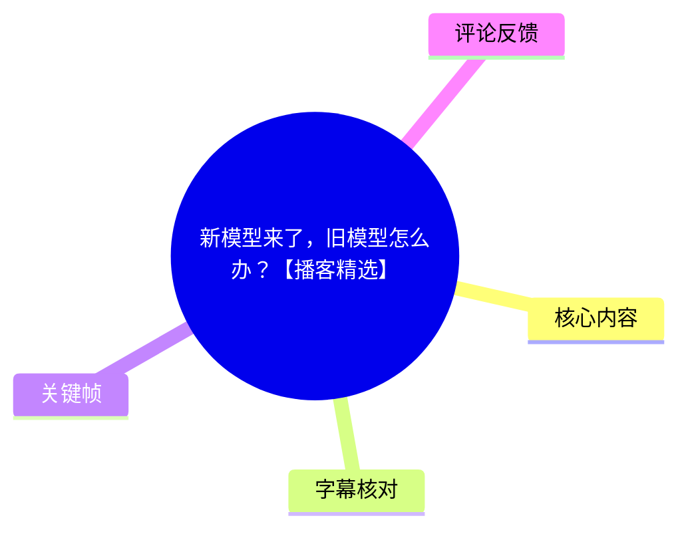
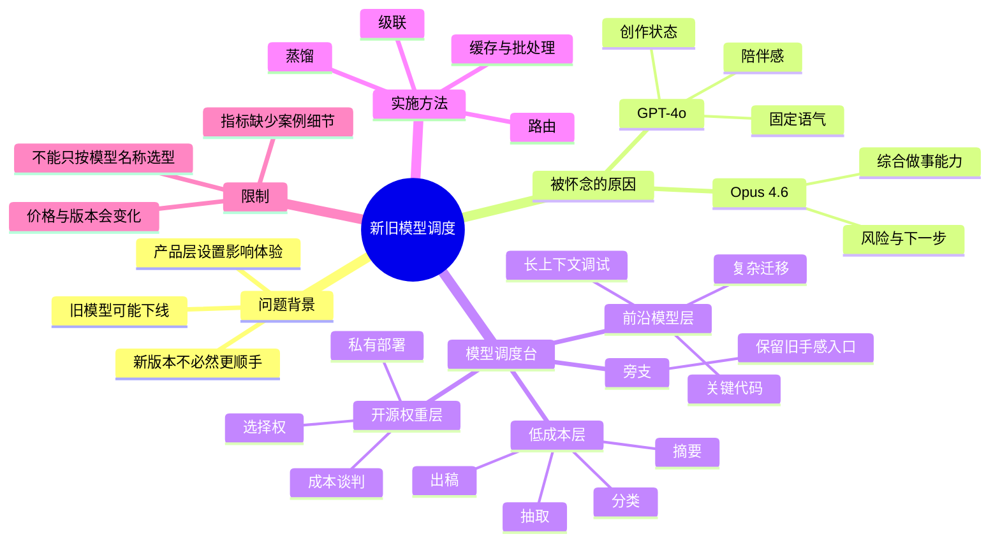
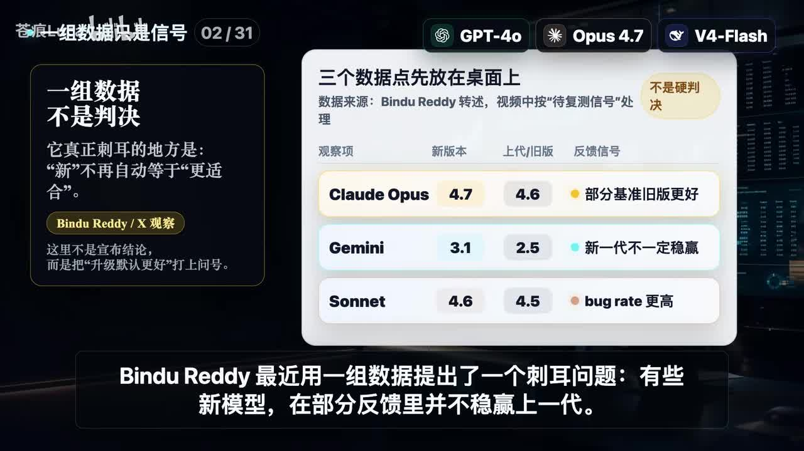
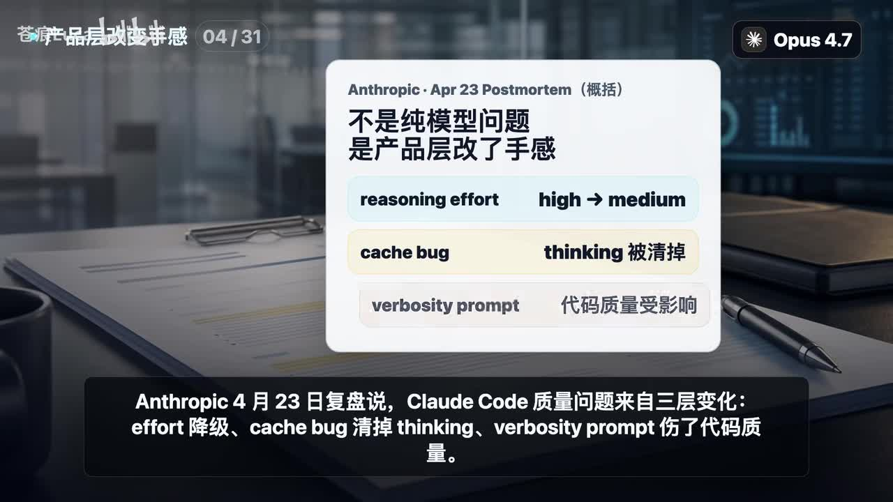
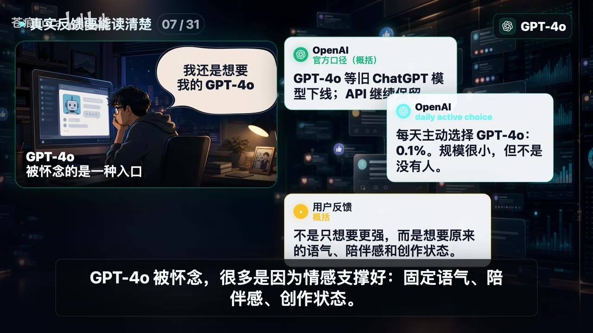

# 新模型来了，旧模型怎么办？【播客精选】

> 来源：[Bilibili 视频](https://www.bilibili.com/video/BV1AVLy6TE14)  
> UP 主：苍痕Luca｜视频时长：06:18｜合集：AIcode  
> **信息时效提示**：视频围绕 2026 年前后的模型、产品策略、定价与下线信息展开；模型版本、API 可用性、价格和性能指标均可能快速变化，使用前应回到相应官方文档核验。

## 小结

视频讨论的并非“新模型出现后旧模型是否应被淘汰”，而是一个更实际的工程与工作流问题：**应如何按任务特性，把新旧模型放到不同岗位上调度**。作者反对“默认升级必然更好”的假设，认为用户感到模型“变笨”或“不顺手”时，原因可能不在底层模型本身，而在产品层的推理强度、缓存行为、提示词策略、默认入口等变化。

作者以 GPT-4o 与 Claude/Opus 的不同被怀念方式说明：旧模型不一定因绝对能力最强而被保留。GPT-4o 被保留的理由偏向固定语气、陪伴感、记忆与创作状态；Opus 4.6 则被描述为在边界、风险与下一步安排上更全面的“做事能力”。因此，真正需要沉淀的不是单个网页入口，而是可嵌入工作流的能力与流程。

视频提出一个“**三层模型 + 一条旁支**”的调度框架：低成本模型承担摘要、分类、抽取、出稿等高频后台任务；开源权重模型用于保留部署与议价的选择权；前沿模型用于关键代码、复杂迁移、长上下文调试等高风险工作；GPT-4o 一类具备特定交互手感的模型则作为独立旁支保留，不应简单按单价比较。

落地方法包括三项：**路由**（先判难度，简单任务走低价模型）、**级联**（低价模型先做，有不确定性再升级）和**蒸馏**（以旗舰模型为教师，产出特定任务数据训练小模型）。作者还提到把路由、缓存、批处理、级联结合时，公开案例中成本可下降约 47%～80%，质量保留约 95%；但该数字在视频中未给出具体案例、任务集与测量方法，不能直接外推。

适合需要控制 AI 调用成本的个人用户、产品经理与工程团队阅读。核心行动建议是：遇到默认升级时，先识别“产品行为和入口是否改变”，再重新定义模型岗位，而非立即迁移全部任务或永久拒绝新模型。

## 思维导图





## 目录

- [问题：新模型为何不一定更好用？](#问题新模型为何不一定更好用)
- [旧模型被怀念的两种原因](#旧模型被怀念的两种原因)
- [模型调度台：三层加一条旁支](#模型调度台三层加一条旁支)
- [调度落地：路由、级联与蒸馏](#调度落地路由级联与蒸馏)
- [结论、参数与限制](#结论参数与限制)
- [字幕比对与采用原则](#字幕比对与采用原则)
- [评论分析](#评论分析)
- [处理记录](#处理记录)

## 问题：新模型为何不一定更好用？ [00:00](https://www.bilibili.com/video/BV1AVLy6TE14?t=0)

视频以“换了新手机，旧手机怎么办”的类比切入：当新 AI 模型发布时，人们是否也应直接扔掉旧模型？作者的答案是否定的——不少人在升级后反而怀念旧版本，这不应被简单归结为怀旧。

### “新”不自动等于“更适合” [00:06](https://www.bilibili.com/video/BV1AVLy6TE14?t=6)

作者引用视频中称为 Bindu Reddy 的一组反馈/数据，提出一个警示性问题：部分新模型在部分反馈中并未稳定胜过上一代。视频强调，这组数据不是用于宣布“新模型更差”的定论，而是用来挑战“默认升级必然更合适”的预设。

需要区分两类问题：

1. **底层能力变化**：模型权重、训练、推理能力本身发生变化。
2. **产品层变化**：即使模型未更换，推理强度、缓存、系统提示、输出风格等默认设置调整，也会让用户的实际体验改变。



> 图：画面将 Claude Opus、Gemini、Sonnet 的新旧版本反馈并列，并明确标注“不是硬判决”。它帮助理解视频的论点边界：作者讨论的是用户反馈信号与产品体验，而非宣称单一榜单足以判定模型强弱。

### 产品层改动会改变“手感” [00:31](https://www.bilibili.com/video/BV1AVLy6TE14?t=31)

作者援引 Anthropic 一份标注为 “Apr 23 Postmortem” 的复盘，将 Claude Code 质量问题归为三层变化：

| 视频列举的变化 | 视频中的影响描述 |
| --- | --- |
| reasoning effort 从 high 降至 medium | 推理投入下降，可能影响任务处理深度 |
| cache bug | 缓存问题导致 thinking 被清掉 |
| verbosity prompt | 输出冗长度相关提示影响代码质量 |

视频的关键判断是：**模型可能没换，但手感已经变了**。作者还以自己在 4 月底 AI 早报中出现不应出现的粗糙用词为个人体感例子，并称 Claude 4.7 的解释风格出现了“结构化坦白、实际链路、insight 总结”等变化，与其印象中的 Claude 4.6 风格不同。



> 图：画面将 `reasoning effort`、`cache bug`、`verbosity prompt` 分别对应到“推理强度、thinking、代码质量”的变化。这是理解“用户用到的是带产品设定的 Agent，而非纯模型”的关键视觉证据。

这里的经验是：当升级后效果下降时，排查顺序不应只问“模型是不是退步”，还应检查：

- 默认模型、推理档位和输出模式是否变更；
- 系统提示词或客户端提示是否调整；
- 缓存、上下文保留与会话记忆是否异常；
- 评估任务是否仍与旧模型时期的使用场景一致。

## 旧模型被怀念的两种原因 [01:15](https://www.bilibili.com/video/BV1AVLy6TE14?t=75)

### GPT-4o：被怀念的是特定入口与交互体验 [01:15](https://www.bilibili.com/video/BV1AVLy6TE14?t=75)

作者将这个现象扩大到 OpenAI：视频称 OpenAI 在 **2026 年 2 月 13 日**让 GPT-4o 等旧 ChatGPT 模型下线，但 API 继续保留；并称每日主动选择 GPT-4o 的用户比例为 0.1%。视频据此指出：比例虽小，但面对大用户基数，仍是一群不愿迁移的真实用户。

> 上述日期、下线范围、保留方式和比例均为视频转述的 OpenAI 信息；本素材未附对应公告正文，且产品政策具有高度时效性，应以 OpenAI 当期官方说明为准。

作者认为，许多人怀念 GPT-4o 的原因不完全是“它最强”，而是以下体验资产：

- 固定而熟悉的语气；
- 陪伴感与情绪支撑；
- 已形成习惯的创作状态；
- 用户对特定入口、记忆机制及互动节奏的依赖。



> 图：画面直接写出“GPT-4o 被怀念的是一种入口”，并列出旧 ChatGPT 模型下线、API 保留、0.1% 主动选择等视频信息。它说明“保留旧模型”的价值可以来自交互连续性，而非性价比或跑分。

### Opus 4.6：被怀念的是综合完成任务的能力 [01:39](https://www.bilibili.com/video/BV1AVLy6TE14?t=99)

视频要求不要把所有“怀念旧模型”的情绪混为一谈。作者将 Opus 4.6 的价值概括为更全面的做事能力：它能够同时带出任务边界、风险和下一步。换言之，用户依赖的不是参数表，而是一个已在实践中形成稳定预期的工作方式。

作者进一步指出一个现实限制：用户所怀念的“旧入口”可能随时被平台收回。因此，比起依赖某个固定网页或应用入口，更应把可复用的能力沉淀到工作流中，例如：

- 明确任务输入、输出与验收标准；
- 保存高质量提示模板、评审规则与样例；
- 为关键任务保留可切换的替代模型；
- 记录模型在特定任务上的质量、成本、延迟与失败模式。

## 模型调度台：三层加一条旁支 [02:33](https://www.bilibili.com/video/BV1AVLy6TE14?t=153)

作者提出“**三层外加一个旁支**”的模型分工图。其选型逻辑不是“哪个模型最新”，而是先判断任务属于低成本后台、需要保留控制权，还是高风险关键推理。

### 第一层：低成本模型处理高频后台任务 [02:33](https://www.bilibili.com/video/BV1AVLy6TE14?t=153)

低成本层适合长期、重复、吞吐导向的工作，包括：

- 摘要；
- 分类；
- 信息抽取；
- 初稿生成；
- 其他常驻后台任务。

视频以 DeepSeek 从 V3.1、V3.2 到 V4 Flash 的演进作为“持续压低成本”的路线示例，并给出其所称的 V4 Flash 官方价格：

| 模型/项目 | 输入价格 | 输出价格 | 单位 |
| --- | ---: | ---: | --- |
| DeepSeek V4 Flash | 0.14 美元 | 0.28 美元 | 每百万 Token |

视频还列举了其他低成本模型的价格口径：

| 视频中提及的模型 | 输入价格 | 输出价格 | 说明 |
| --- | ---: | ---: | --- |
| Gemini 3.1 Flashlight | 0.25 美元 | 1.50 美元 | 每百万 Token |
| Haiku 4.5 | ASR 可辨为“1” | ASR 可辨为“5” | 原始 ASR 对单位与小数信息不够可靠，未据此扩展解读 |

这些模型“未必最强”，但适用于不需要为每个请求支付顶配推理费用的工作。价格为视频时点的转述，且通常可能因区域、缓存、批处理、上下文长度或产品套餐不同而变化。

### 旁支：GPT-4o 不应与低成本模型按同一维度比较 [03:15](https://www.bilibili.com/video/BV1AVLy6TE14?t=195)

作者明确指出 GPT-4o 并不属于低成本层。它的保留理由是熟悉的手感、语气、记忆与情绪支撑，因此应作为独立旁支，而不是被放进同一张单价表中比较。

这意味着模型治理需要纳入非纯技术指标：

- 对话风格稳定性；
- 使用者迁移成本；
- 创作、陪伴或个人知识管理场景中的连续性；
- 团队既有提示词、评审习惯和协作方式。

### 第二层：开源权重用于保留选择权 [03:39](https://www.bilibili.com/video/BV1AVLy6TE14?t=219)

第二层的目标不是继续压低单价，而是**可控性**。视频以 DeepSeek V4 Pro 为例，称其 model card 中包含：

- SWE-bench Verified：80.6；
- MIT License。

作者特别提醒：这不等于普通电脑可以随意运行该模型；视频要表达的是，能力不再完全锁定在闭源平台入口中，团队由此拥有私有部署与成本谈判的空间。

因此，开源权重的主要价值可概括为：

1. **部署选择权**：可根据组织需求考虑私有化或自托管。
2. **供应商风险缓冲**：平台策略或产品入口变更时，保留替代路径。
3. **成本谈判空间**：可用替代方案降低单一供应商依赖。
4. **可控性**：在合规、数据边界、运维策略方面拥有更多配置空间。

限制同样明确：开源许可不代表零部署成本，也不代表性能、稳定性、推理硬件、服务运维和安全治理问题自动消失。

### 第三层：前沿模型用于高风险关键任务 [04:03](https://www.bilibili.com/video/BV1AVLy6TE14?t=243)

对于关键代码、复杂迁移、长上下文与调试等高风险任务，作者建议使用 Frontier Model，并举例 Claude Opus 4.7、GPT-5.5 Codex。其价值不在“便宜”，而在于减少返工和少走弯路。

可以将视频的三层与旁支整理如下：

| 位置 | 视频所举例子 | 适合的任务 | 首要价值 | 不应误解为 |
| --- | --- | --- | --- | --- |
| 低成本层 | DeepSeek V4 Flash、Gemini 3.1 Flashlight、Haiku 4.5 | 摘要、分类、抽取、初稿、后台 | 低成本与吞吐 | 万能主力模型 |
| 旧手感旁支 | GPT-4o | 需要特定语气、陪伴感、记忆或创作状态的任务 | 交互连续性 | 最低价选择 |
| 开源权重层 | DeepSeek V4 Pro | 有部署、数据控制或替代入口需求的任务 | 选择权与可控性 | 普通设备随便部署 |
| 前沿模型层 | Claude Opus 4.7、GPT-5.5 Codex | 关键代码、复杂迁移、长上下文、调试 | 降低高风险返工 | 所有请求默认使用 |

## 调度落地：路由、级联与蒸馏 [04:27](https://www.bilibili.com/video/BV1AVLy6TE14?t=267)

### 第一步：路由——按难度分发请求 [04:27](https://www.bilibili.com/video/BV1AVLy6TE14?t=267)

“路由”指在模型调用前先判断请求的难度与风险：

1. 简单请求进入低价模型；
2. 难题、关键任务再升级到更强模型；
3. 不为每个任务支付顶配模型成本。

视频没有给出具体分类器、阈值或代码实现，但其策略前提是：团队必须先定义“简单”和“困难”的任务边界，例如是否涉及生产代码修改、事实核验、敏感数据、高不可逆影响或长链路推理。

### 第二步：级联——先低价完成，不确定再升级 [04:27](https://www.bilibili.com/video/BV1AVLy6TE14?t=267)

视频中的“集连”结合上下文应为“**级联**”：先让便宜模型处理，若模型没有把握或不满足条件，再交给更强模型。作者使用“实习生先整理材料，关键判断再找主管”的比喻。

一个不超出视频含义的流程可表述为：

```text
接收请求
  ↓
低成本模型执行初步处理
  ↓
是否满足质量/置信度/规则要求？
  ├─ 是 → 输出结果
  └─ 否 → 升级至更强模型复核或重做
```

实际落地时，不能只依赖模型自报“有把握”。更可靠的升级条件应由业务规则定义，例如输出格式校验失败、检索证据不足、关键字段冲突、代码测试失败或人工抽检不通过。

### 第三步：蒸馏——将旗舰能力压缩到小模型任务中 [04:46](https://www.bilibili.com/video/BV1AVLy6TE14?t=286)

视频称第三招为“蒸馏”：让旗舰模型作为教师，为特定任务生成数据，再训练出更便宜的小模型。作者认为自动补全、智能回复等功能背后可采用这类能力压缩路线。

视频由此得出的结论是：旧模型不是“情怀库存”，而可能是成本结构、产品结构与任务结构的一部分。换言之，旧大模型、小模型与前沿模型不是简单替代关系，而是可以在同一系统中承担不同职责。

### 成本与质量：视频给出的量化表述 [05:10](https://www.bilibili.com/video/BV1AVLy6TE14?t=310)

作者称，将路由、缓存、批处理、级联组合后，公开案例中可实现：

| 指标 | 视频给出的范围 |
| --- | --- |
| 成本下降 | 47%～80% |
| 质量保留 | 约 95% |

这一结果应谨慎使用。视频未在字幕或画面素材中提供具体公开案例名称、数据集、基线模型、质量指标定义、流量结构和成本计算方式。因此它可作为“分层调度可能显著改善成本效率”的方向性信息，**不能被视为任何团队都能复现的承诺**。

## 结论、参数与限制 [05:34](https://www.bilibili.com/video/BV1AVLy6TE14?t=334)

视频最终回答“新模型来了，旧模型怎么办”：既不是把旧模型打包寄走，也不是永远拒绝新模型；更成熟的做法是把它们放上调度台重新分工。

作者给出的岗位分配可压缩为：

- 高频、低风险、成本敏感任务：使用 DeepSeek Flash、Haiku 等低成本模型；
- 需要保留特定旧手感的任务：将 GPT-4o 一类模型单独保留；
- 需要可控性、私有部署或供应商替代空间的任务：考察开源权重；
- 关键代码与复杂高风险任务：使用 Opus 或 GPT-5.5 Codex 等前沿模型。

### 可迁移的实践清单

1. **不要把“升级”当作终点**：更新后先做任务级回归测试。
2. **按任务而非按品牌选模型**：成本、质量、延迟、可控性与交互风格是不同维度。
3. **为旧模型定义明确岗位**：保留它的原因应可描述、可测试，而非纯粹依恋版本号。
4. **建立升级门槛**：只有新模型在目标任务上达到预设质量、成本与稳定性条件时才迁移。
5. **避免单一入口依赖**：将提示模板、质量规则、评估样例与替代路径沉淀在工作流中。
6. **定期复核价格与可用性**：视频中的模型版本、价格、下线策略和性能数据都有强时效性。

### 视频结论的适用边界

- 视频主要提供模型调度的框架和案例式论述，不是严格的模型评测报告。
- 关于模型价格、版本、基准分数、下线日期和 API 保留情况，均应以对应厂商当期官方文档为准。
- “质量保留约 95%”“成本下降 47%～80%”缺乏本素材内的复现细节。
- 不同团队的请求分布、上下文长度、模型调用方式、缓存命中率与人工审核成本不同，不能照搬同一分层比例。
- 如果任务涉及高风险决策、生产环境变更、法律医疗金融等专业结论，仅靠模型路由不能替代必要的人类复核与领域流程。

## 字幕比对与采用原则 [00:00](https://www.bilibili.com/video/BV1AVLy6TE14?t=0)

本次素材同时提供了 Bilibili 站内字幕与 ASR 结果，二者存在显著冲突，必须以内容匹配度和时间轴覆盖情况筛选。

| 字幕来源 | 完整性 | 专有名词 | 时间轴 | 主要问题 |
| --- | --- | --- | --- | --- |
| Bilibili 站内字幕 `p01-ai-zh.srt` | 不完整且与视频不符，仅覆盖约 00:00～02:45 的零散内容 | 与武侠/剧情台词相关，未覆盖 AI 主题 | 具备真实分段时间，但内容明显错配 | 出现“武功”“龙爪手”“杀人”等与本视频主题无关的文本，应视为错误字幕 |
| 本次 ASR `medium` | 高，21 段，语音覆盖率 97.73%，覆盖 00:00～06:15 | 多数模型名可辨，但存在音近字与拆词错误 | 具备完整可用时间戳 | 如 “Anthropeak”“Cloud”“Deepseq”“集连”“征流”等，需要结合画面与语境校正 |

### 最终字幕选择

正文以**本次 ASR 的时间戳**作为章节定位依据，因为其内容完整匹配 AI 模型调度主题；站内字幕虽有时间轴，但文本与视频主题、画面和 ASR 均不一致，未被采用为正文事实来源。

ASR 诊断显示：

- 语言：中文；
- 语言置信度：0.9990；
- 时长：377.13 秒；
- 语音覆盖率：97.73%；
- 首段语音：00:00；
- 末段语音：06:15；
- 未标记 `noAudioStream=true`。

因此，源视频**存在可识别音轨**；并非无音轨素材，也不是工具因无法获取音频而失败。

### 结合画面与上下文校正的主要术语

| ASR 原文/近似识别 | 正文采用写法 | 校正依据 |
| --- | --- | --- |
| BinduReady | Bindu Reddy | 画面文字与语境 |
| Anthropeak | Anthropic | 画面中的 “Anthropic · Apr 23 Postmortem” |
| Clock code | Claude Code | 视频主题与画面文字 |
| Cloud 4.7 / 4.6 | Claude 4.7 / 4.6 | 模型语境与画面中的 Opus 标识 |
| GP T、4 O | GPT-4o | 画面明确显示 GPT-4o |
| Deepseq / DeepSeed | DeepSeek | 视频上下文与描述中的 DeepSeek 官方文档来源 |
| Club Opus 4.7 | Claude Opus 4.7 | 模型名称语境 |
| 集连 | 级联 | 与“低价先做、不确定再升级”的机制匹配 |
| 征流 | 蒸馏 | 后文“旗舰模型当老师、生成数据、训练小模型”的定义匹配 |


> 图：画面以“不是少数人？把体感放到跨家现象里看”为标题，提出“其他模型也会这样吗？”。它为字幕选择提供了主题校验：画面内容与 ASR 的跨厂商比较段一致，而与站内武侠剧情字幕完全不符。

## 评论分析 [06:15](https://www.bilibili.com/video/BV1AVLy6TE14?t=375)

仅处理本次可获取的热评前三条；评论属于用户表达或推广信息，不作为已验证事实。

1. **账号已注销｜2 赞｜“有点东西！”**  
   - 观点：对视频内容表示正面认可。  
   - 补充信息：没有提出具体理由、反例或使用场景。  
   - 可信度判断：仅能反映该评论者的即时态度，不能证明视频中模型价格、性能或案例数据的准确性。

2. **一夜舟轻｜2 赞｜推荐 CloseRouter / crouter.cloud**  
   - 观点：以“放转转上”的玩笑回应旧模型处置问题，随后宣传其自建 AI 中转服务。  
   - 补充信息：评论者声称其产品源于公司不报销 AI 费用、员工却被要求用 AI 提效的痛点，并提到官方定价、IP 限制、境外信用卡等使用障碍。  
   - 风险与可信度：这是一则带链接和兑换码的自荐推广。服务能力、价格、隐私、安全性、合规性、模型来源及兑换码有效性均未在素材中验证，不应据此直接注册、充值或提交敏感数据。

3. **-清风道人-｜2 赞｜“一个值得关注的议题”**  
   - 观点：认可“新旧模型如何分工”是值得讨论的话题。  
   - 补充信息：未提供进一步论证。  
   - 可信度判断：可反映观众对议题的关注，但不构成技术或市场数据证据。

## 处理记录 [00:00](https://www.bilibili.com/video/BV1AVLy6TE14?t=0)

- Worker ID：`worker-mrj0www4-e8d79408`
- 生成模型：`gpt-5.6-terra`
- 素材处理工具/产物：已提供的视频合并文件、WAV 音频、关键帧、Bilibili 站内 SRT、ASR SRT、ASR JSON 分段结果及评论 JSON。
- ASR 使用信息：`medium` 模型，CUDA，`float16`；识别语言为中文，语音覆盖率 97.73%，带时间戳。
- 字幕选择：检查了站内字幕与本次 ASR。站内字幕内容为明显错配的武侠/剧情文本，未采用；正文采用本次 ASR 的时间轴，并以关键帧画面和上下文校正专有名词与“级联、蒸馏”等术语。
- 关键帧选择依据：
  - `frames/frame-001.jpg`：呈现“新版本不必然更适合”的反馈信号与非定论边界；
  - `frames/frame-002.jpg`：呈现产品层设置如何改变 Claude Code 体验；
  - `frames/frame-003.jpg`：呈现将个人体感放入跨厂商现象检验的问题意识；
  - `frames/frame-004.jpg`：呈现 GPT-4o 的入口、下线与用户怀念原因。
- 评论处理：仅分析可获取热评前三条，未将自荐链接、兑换码或产品宣传视为事实。
- 缓存清理：素材未提供缓存清理日志，无法确认是否已执行缓存清理；本记录不虚构清理结果。
- 未解决问题：
  - 视频提及的 Bindu Reddy 数据、成本下降 47%～80%与质量保留约 95%缺少本素材内的原始案例链接和方法细节；
  - 部分价格、版本号和产品下线信息具有时效性，需回查 OpenAI、Anthropic、DeepSeek 等当期官方页面；
  - ASR 对部分模型价格与英文专名存在识别误差，正文仅在画面与语境能够支持时作了校正。

## 评论分析

- 热评 1：有点东西！
- 热评 2：当然是放转转上[doge_金箍] https://crouter.cloud 自荐一下，我自己做的AI中转，初衷是因为公司不给报销AI费用，又逼着每一个人用AI提效。 我实在受不了官方昂贵的定价，以及各种ip限制，境外信用卡....这种给人送钱都没地方送的感觉让人讨厌。 于是就有了CloseRouter: https://crouter.cloud 送一个兑换卡密：RC-2CEB2032B4967010CB633D39
- 热评 3：一个值得关注的议题

以上内容是观众反馈摘录，只用于补充理解视频反响，不作为正文事实依据。
