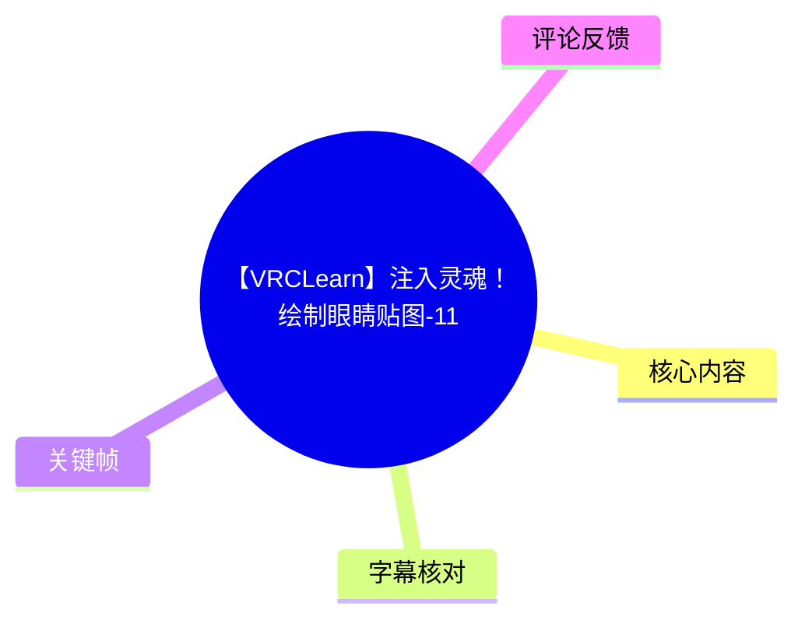
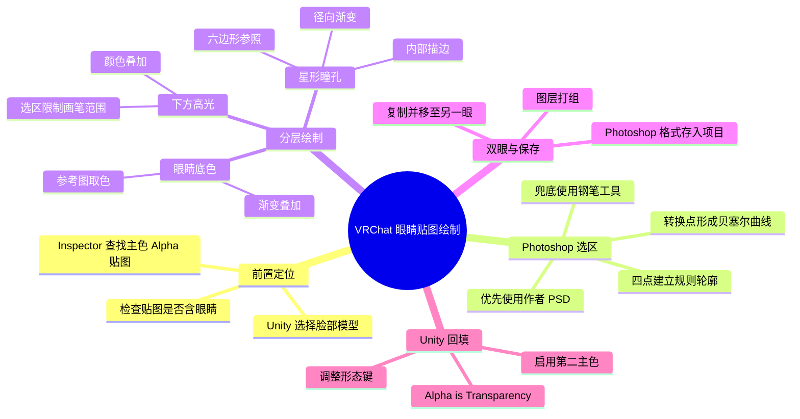
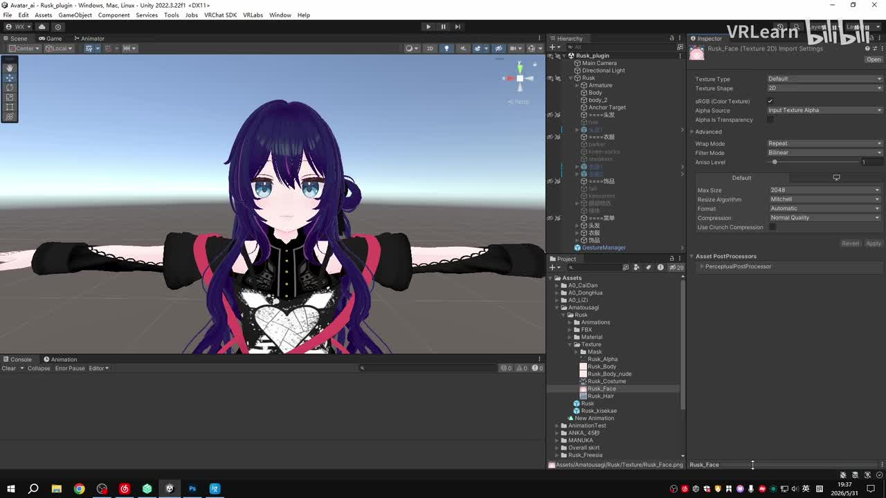
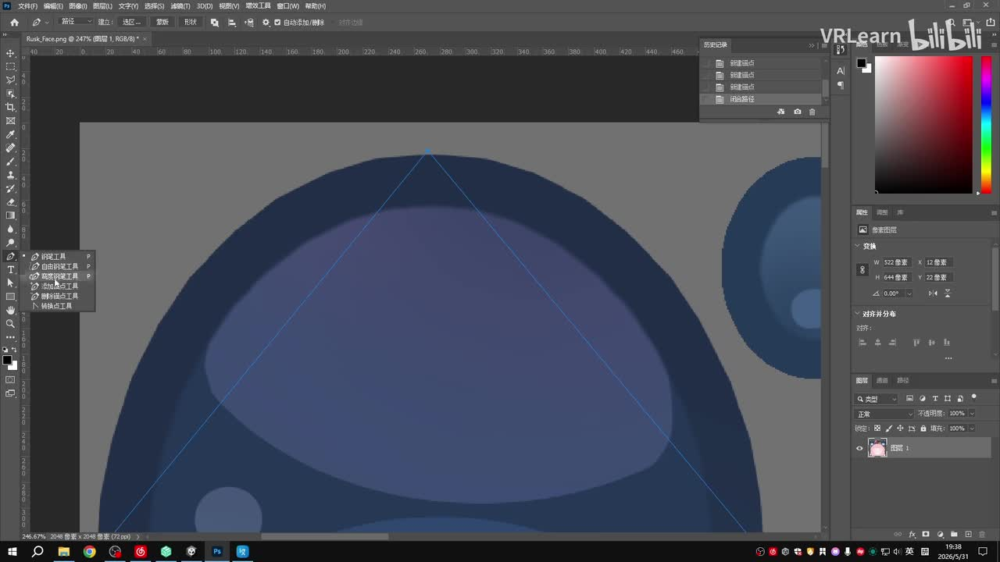
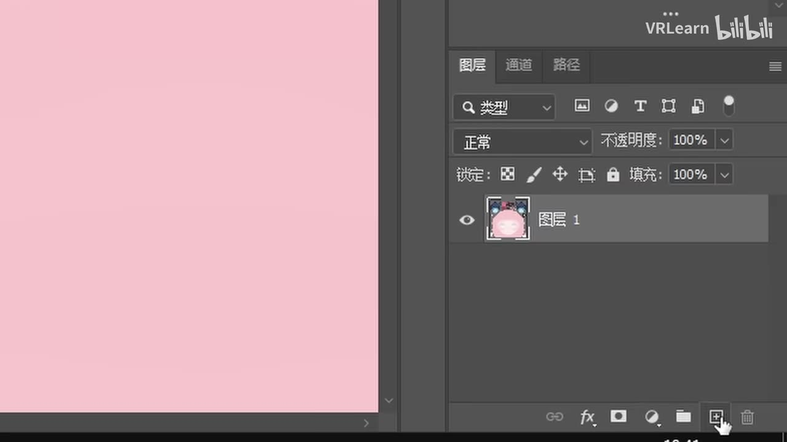
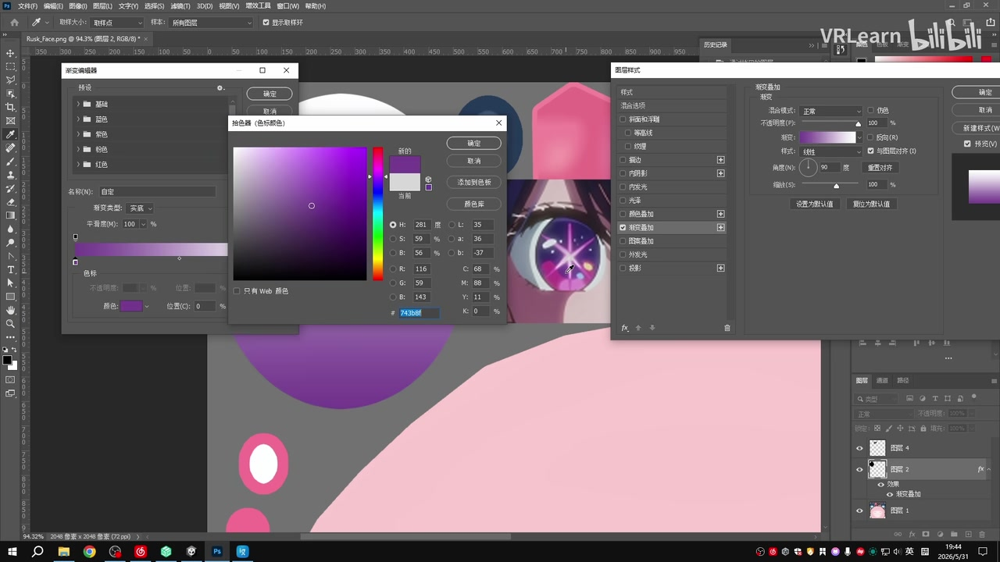

# 【VRCLearn】注入灵魂！绘制眼睛贴图-11

> 来源：[Bilibili 视频](https://www.bilibili.com/video/BV1GXV96CEwM) 
> UP 主：VRLearn｜视频时长：13 分 26 秒｜关联主题：VRChat 模型改造、Unity、Photoshop 眼睛贴图绘制  
> 视频简介注明：相关游戏为 VRChat，使用 Unity `2022.3.22f1`；学习文档为 `start.gamemode1.com`。

## 小结

本期是系列第 11 节，承接上期的角色挑染内容，目标是在 Photoshop 中为 VRChat 角色重绘一张眼睛贴图，并在 Unity 中挂回角色材质。教程围绕“从原始脸部贴图定位眼睛区域—以路径建立可控形状—分层绘制瞳色、高光和星形瞳孔—导入 Unity 验证”展开。

最关键的方法是把眼睛拆解为独立图层：眼睛底色使用路径选区加**渐变叠加**，下方高光使用独立图层加**颜色叠加**，星形瞳孔先以六边形为几何参照、再用多边形套索勾出，并以**径向渐变**与**内部描边**补足效果。这样不仅便于调整，也能将整个眼睛效果复制到另一侧眼球。

视频提供的是没有模型作者 PSD 源文件时的“兜底方案”：通过钢笔工具勾出眼睛轮廓，用转换点工具把直线路径改为贝塞尔曲线。因此，它适合已有 Unity 工程、能找到角色脸部材质和贴图、但缺少可编辑源文件的 VRChat 改模初学者。

操作中需格外注意图层顺序与绘制边界。上层会覆盖下层；若在已有图层样式的图层上直接作画，颜色可能被样式效果覆盖。新建细节图层后，还要通过 `Ctrl` 单击下方图层缩略图载入不透明区域选区，避免画笔越出眼睛范围。

导入 Unity 后，视频明确要求对贴图勾选 **Alpha is Transparency** 并点击 **Apply**，随后在脸部材质中启用“第二主色”并填入新贴图；最后应视模型实际情况调整形态键，关闭角色原本的瞳孔和高光，避免与新绘制内容重复。

本视频反映的是发布时所用的 Photoshop 与 Unity 工作流。Photoshop 的工具位置、快捷键行为，以及 VRChat Avatar、着色器和材质属性的命名均可能随软件版本、模型着色器或作者制作规范而变化；尤其“第二主色”不是 Unity 通用固定属性，而是该角色所用材质球的具体配置。

## 思维导图

## 目录

- [背景、目标与前置条件](#背景目标与前置条件)
- [定位原始脸部贴图](#定位原始脸部贴图-0013)
- [用路径建立眼睛选区](#用路径建立眼睛选区-0048)
- [绘制渐变眼睛底色](#绘制渐变眼睛底色-0237)
- [制作下方高光与边界限制](#制作下方高光与边界限制-0355)
- [制作星形瞳孔](#制作星形瞳孔-0656)
- [补绘高光、复制双眼与保存](#补绘高光复制双眼与保存-0953)
- [回到 Unity 配置贴图](#回到-unity-配置贴图-1201)
- [完整操作清单与快捷键](#完整操作清单与快捷键)
- [限制、适用范围与时效性](#限制适用范围与时效性)
- [字幕比对](#字幕比对)
- [评论分析](#评论分析)
- [处理记录](#处理记录)

## 背景、目标与前置条件

本节的明确目标是在原有角色脸部 UV 贴图上重新制作眼睛视觉效果，最终交由 Unity 中的角色脸部材质显示。视频没有讲解从零制作模型、展开 UV 或上传 VRChat 的具体流程，而是默认观众已有可打开的角色 Unity 项目及对应贴图。

前置条件包括：

- 使用 Photoshop 编辑纹理；
- 能在 Unity 的 Hierarchy、Inspector 与 Project 面板中找到模型和贴图；
- 已有一张用于观察颜色、星形和高光分布的参考图；
- 理解图层、路径、选区及图层样式的基本用途；
- 若模型作者提供 PSD，可直接在 PSD 中改；视频仅在无 PSD 或无法直接编辑时示范路径描边式的替代做法。
- 视频简介所述 Unity 版本为 `2022.3.22f1`。这可作为录制环境信息，但不代表其他 Unity 或 VRChat SDK 版本中所有界面、材质属性均完全一致。

## 定位原始脸部贴图 [00:13](https://www.bilibili.com/video/BV1GXV96CEwM?t=13)

1. 在 Unity 项目中选择人物的**脸部模型**。
2. 在 Inspector 中展开该对象关联的材质。
3. 找到纹理设置，展开“主色 Alpha”相关设置，单击该纹理贴图。
4. 确认打开的贴图中是否包含眼睛区域：**有眼睛即说明找对目标贴图**。
5. 对该贴图右键，选择 **Show in Explorer**，由资源位置直接打开文件，再导入 Photoshop。

> 图：关键帧展示 Unity 中选中角色脸部/贴图资源后的界面，Inspector 可见贴图导入设置区域。这张图用于理解本教程的起点：并非任意新建图片，而是先从角色实际使用的脸部贴图进入编辑流程。

视频将“贴图上是否存在眼睛”作为定位依据。这是实操上重要的核验步骤：角色可能存在身体、脸部、表情、睫毛或眼睛等多张纹理，只有与眼睛 UV 对应的贴图才适合后续编辑。

## 用路径建立眼睛选区 [00:48](https://www.bilibili.com/video/BV1GXV96CEwM?t=48)

若有模型作者提供的 PSD，视频建议直接在其原始 PSD 中修改；否则按以下兜底方式处理已有贴图：

1. 用 `Alt + 鼠标滚轮` 放大图像。
2. 按住 `空格` 并拖动鼠标左键平移画布。
3. 选择**钢笔工具**；如果工具栏当前位置不是钢笔图标，长按相应工具图标展开工具组后选择。
4. 沿单只眼睛轮廓建立路径。对于这种相对规则的形状，视频示例只放置 **4 个锚点**，不要求密集点选。
5. 再次长按钢笔工具，选择**转换点工具**。
6. 在已建立的路径点上按住鼠标左键并拖动，将原先的直线段转换为曲线，即贝塞尔曲线；继续调整两侧手柄，让路径包住眼睛边缘。
7. 若局部贴合不够，可使用**直接选择工具**微调锚点或控制手柄。
8. 在图层面板下方新建图层，进入“路径”标签，选中刚建立的路径，点击“路径转换为选区”按钮（虚线圆圈图标）。
9. 保持新建图层处于选中状态，用选区工具右键并选择填充，填充内容为**前景色**。

> 图：关键帧显示 Photoshop 中放大后的眼部区域及蓝色钢笔路径。它说明眼睛轮廓并非由大量手绘点构成，而是通过少量锚点与曲线手柄控制，这也是后续得到干净边缘的基础。

> 图：关键帧聚焦 Photoshop 图层面板下方的新建图层按钮。视频在路径转选区前先建立独立图层，确保眼睛底色不直接破坏原始贴图，也为后续图层样式和复制操作保留空间。

## 绘制渐变眼睛底色 [02:37](https://www.bilibili.com/video/BV1GXV96CEwM?t=157)

在新建图层中以路径选区填入前景色后，视频将参考图放到画布上，用其观察眼睛颜色构成。初始填充看起来是一块黑色区域，接下来通过图层样式把它变成渐变底色：

1. 右键眼睛底色图层，选择**混合选项**。
2. 勾选**渐变叠加**，进入渐变调色盘。
3. 选中颜色条左下侧的颜色控制点，点击颜色，并用拾色器从参考图提取相应颜色。
4. 对右侧颜色控制点重复取色与设置。
5. 完成后得到眼睛的渐变底色。

> 图：关键帧显示渐变编辑、取色器与图层样式窗口，右侧参考图可见。其价值在于明确视频不是给出固定 RGB 或十六进制颜色，而是要求根据参考图拾取左右渐变端点的色值。

这里的制作思路是“先获得正确的眼睛形状，再通过图层样式生成可编辑颜色”。相比直接在底图涂色，渐变颜色和方向可以在后续继续调整，且不需要反复重画选区。

## 制作下方高光与边界限制 [03:55](https://www.bilibili.com/video/BV1GXV96CEwM?t=235)

### 下方高光形状 [04:00](https://www.bilibili.com/video/BV1GXV96CEwM?t=240)

视频接着绘制眼睛底部的高光效果，仍采用“路径—选区—新图层—填充”的结构：

1. 使用钢笔工具画出下方高光的轮廓。
2. 通过转换点工具把路径调整为平滑曲线。
3. 若不想频繁在钢笔与转换点工具之间切换，可在钢笔工具状态下按住 `Alt`，快速对锚点进行转换。
4. 新建图层，转换路径为选区，填充前景色；填充快捷键为 `Alt + Delete`。
5. 检查图层顺序：位于上方的图层会覆盖下方图层。如果看不见新填充的颜色，应先排查是否被其他图层遮挡。
6. 根据参考图，该高光区域不需要渐变，因此在混合选项中只勾选**颜色叠加**，再用拾色器调整颜色。
7. 用画笔工具补充细节；画笔默认采用当前前景色，作画前需确认前景色正确。

### 限制画笔不越界 [05:46](https://www.bilibili.com/video/BV1GXV96CEwM?t=346)

视频强调，画笔细节需要建立在**新的图层**上。否则，直接画在已经附带图层样式的当前图层上，绘制颜色可能被该图层的颜色效果覆盖，难以得到预期结果。

新建图层带来的问题是画笔默认可以绘制整个画布。视频给出的限制方法是：

1. 保持当前用于画细节的新图层被选中。
2. 将鼠标放到下方已经包含眼睛形状的图层缩略图上。
3. 按住 `Ctrl`，当鼠标提示出现方框时单击左键。
4. 此时会载入下方图层不透明像素所对应的选区。
5. 再进行画笔绘制，笔触会被限制在眼睛的选区范围内。
6. 画笔的大小和边缘柔和度可从左上角的画笔控制区域调整。

这种方式本质上是利用下方眼睛图层的不透明区域作为选区来源；视频没有使用剪贴蒙版或图层蒙版，而是采用了 `Ctrl` 单击图层缩略图的选区工作流。

## 制作星形瞳孔 [06:56](https://www.bilibili.com/video/BV1GXV96CEwM?t=416)

### 以六边形建立参照 [07:07](https://www.bilibili.com/video/BV1GXV96CEwM?t=427)

视频观察参考图后判断，星形可借助一个六边形作为顶点参照物。具体步骤：

1. 找到**矩形工具**，长按后选择**多边形工具**。
2. 在任意位置单击鼠标左键。
3. 将边数设为 **6**；其余设置保持默认，点击确定。
4. 调整生成六边形的大小与方向，使其与眼部参考图中的星形结构相适应。
5. 选择**多边形套索工具**，以六边形的 6 个顶点为参照，勾出目标星形。
6. 完成星形选区后，隐藏六边形参照图层。
7. 新建图层并填充前景色，快捷键同样是 `Alt + Delete`。

这里的六边形并不是最终显示在眼睛中的图形，而是用于稳定星形顶点位置的辅助几何图层；最终星形由多边形套索选区填色得到。

### 星形的径向渐变和描边 [08:09](https://www.bilibili.com/video/BV1GXV96CEwM?t=489)

参考图中的星形带有由内向外的颜色变化，因此视频要求：

1. 为星形图层打开混合选项并勾选**渐变叠加**。
2. 将渐变样式改为**径向**。
3. 进入渐变调色盘，分别调整中间与外侧的颜色。
4. 继续观察参考图，发现内部还有描边效果，因此勾选**描边**。
5. 将描边位置设为**内部**，再调整描边的颜色与大小。

> 注：站内字幕明确写为“将样式改为径向”；本次 ASR 在同一处识别为“镜像”。结合站内字幕提供的完整语句，正文采用“径向”。这属于字幕间的关键差异，不能仅依 ASR 文本判断。

### 让星形覆盖眼睛 [09:05](https://www.bilibili.com/video/BV1GXV96CEwM?t=545)

视频指出参考图中的星形几乎占满整个眼睛，初次制作的星形可能偏小，因此需要进一步变换：

1. 使用 `Ctrl + T` 进入自由变换。
2. 按住 `Shift` 调整四个边，使星形放大到合适尺寸。
3. 若还要获得更完整的眼睛覆盖，继续按 `Ctrl + T`。
4. 右键选择**变形**，把星形调整到覆盖眼睛轮廓。

该过程并非给出固定的缩放比例或描边像素值，而是要求以当前模型的 UV、眼睛轮廓和参考图为准手动匹配。

## 补绘高光、复制双眼与保存 [09:53](https://www.bilibili.com/video/BV1GXV96CEwM?t=593)

### 最后高光 [09:53](https://www.bilibili.com/video/BV1GXV96CEwM?t=593)

最后的少量高光通过画笔工具逐步画入，并持续用拾色器从参考图取色。仍需新建独立图层。画笔大小的快捷键是键盘上 `P` 键右侧的两个方括号键：`[` 与 `]`。

完成细节后，参考图不再需要，可以隐藏或移除，避免其影响最终输出贴图。

### 打组、复制和对齐另一眼 [10:53](https://www.bilibili.com/video/BV1GXV96CEwM?t=653)

为将左/右眼效果保持一致，视频没有从头重绘另一只眼，而是复用已有图层：

1. 选中第一个绘制图层。
2. 按住 `Shift`，点击最开始的绘制图层，以快速选中本次绘制的所有图层。
3. 点击图层面板下方的文件夹图标，将这些图层打包为一组。
4. 将该组按住鼠标左键拖到“新建图层”按钮上，得到一个复制组。
5. 选中复制出的组，按住 `Shift` 平移到另一只眼球。
6. 若位置难以精确对齐，可使用小键盘方向键微调。

视频将“先打组、再整体复制”作为确保双眼材质结构一致的办法。这也便于后续统一修改颜色、图层效果或高光细节。

### 保存 [11:40](https://www.bilibili.com/video/BV1GXV96CEwM?t=700)

1. 隐藏原本的贴图图层。
2. 在菜单栏选择“文件—存储为”。
3. 选择 Photoshop 格式，保存到 Unity 项目目录下。

视频仅明确提到保存为 Photoshop 格式及保存到项目下，未展示具体文件扩展名、导出格式、分辨率、色彩空间或压缩参数。因此不能据此推断其最终使用了 PSD、PNG 或其他格式；实际项目应以 Unity 可识别的贴图文件和所用材质要求为准。

## 回到 Unity 配置贴图 [12:01](https://www.bilibili.com/video/BV1GXV96CEwM?t=721)

保存后返回 Unity，完成贴图导入与材质回填：

1. 在 Project 面板中选中制作后的贴图。
2. 勾选 **Alpha is Transparency**。
3. 点击 **Apply** 应用导入设置。
4. 选择角色的脸部。
5. 启用材质球的**第二主色**。
6. 将新制作的贴图放入对应纹理槽。
7. 调整角色的形态键，将角色原本的高光与瞳孔移除；视频强调这一项要根据实际模型情况决定。
8. 至此角色制作完成，后续只需上传。

> 图：该关键帧右侧 Inspector 可见 `Alpha is Transparency` 与 `Apply` 所在的贴图导入设置区域，对应视频的最后导入步骤。其作用是提醒该设置在视频流程中被明确要求，而非可忽略的装饰性选项。

“第二主色”是视频中的材质配置称呼，不能泛化为所有 Unity Standard Material 或所有 VRChat Shader 都必然存在的字段。若自己的材质没有对应选项，应先确认所使用的着色器、模型说明文档和纹理槽含义，而不是机械寻找同名按钮。

## 完整操作清单与快捷键

| 阶段 | 操作 | 视频给出的方式/参数 |
| --- | --- | --- |
| 定位贴图 | 在 Unity 查找眼睛贴图 | 脸部模型 → Inspector 材质 → 主色 Alpha 设置 → 单击纹理 |
| 打开源文件 | 从 Unity 进入文件位置 | 右键 `Show in Explorer` |
| 放大画布 | 在 Photoshop 观察 UV 细节 | `Alt + 鼠标滚轮` |
| 移动画布 | 放大后定位眼睛区域 | `空格 + 鼠标左键拖动` |
| 勾眼睛轮廓 | 建立初始路径 | 钢笔工具；规则眼睛示例使用 4 个点 |
| 曲线调整 | 将直线段改为曲线 | 转换点工具拖动锚点；术语为贝塞尔曲线 |
| 快速转换锚点 | 减少工具切换 | 钢笔工具状态下按住 `Alt` |
| 生成选区 | 将路径用于图层填充 | 路径面板 → 路径转换为选区（虚线圆圈图标） |
| 填充颜色 | 为底色、高光、星形填色 | 前景色填充；`Alt + Delete` |
| 眼睛底色 | 模拟眼睛基础颜色 | 图层样式 → 渐变叠加；从参考图拾色 |
| 下方高光 | 区分于底色的色块 | 独立图层 → 颜色叠加；不使用渐变 |
| 控制笔触范围 | 防止画出眼睛区域 | 当前图层选中 → `Ctrl` 单击下方图层缩略图载入选区 |
| 画笔调整 | 控制高光笔刷形态 | 左上角调大小、边缘柔和度；`[`、`]` 调画笔大小 |
| 星形参考 | 构造星形顶点结构 | 多边形工具，边数设为 `6` |
| 星形效果 | 制作瞳孔内部层次 | 渐变叠加设为径向；描边位置设为内部 |
| 调星形覆盖 | 扩大并贴合眼睛 | `Ctrl + T`；按 `Shift` 缩放；右键“变形” |
| 复制另一眼 | 保持双眼一致 | 图层打组 → 拖到新建图层按钮复制 → `Shift` 平移；小键盘方向键微调 |
| Unity 导入 | 使透明通道按视频设置处理 | 勾选 `Alpha is Transparency` → `Apply` |
| 材质回填 | 让新眼睛显示在角色上 | 启用第二主色，将贴图置入对应纹理槽 |
| 清理冲突效果 | 去除旧瞳孔/高光 | 按实际情况调整形态键 |

## 限制、适用范围与时效性

- **适用范围**：该流程面向具有眼部区域的脸部 UV 贴图，并依赖角色材质存在可承载新贴图的纹理槽。适合需要重绘静态眼睛外观的 VRChat 角色改模场景。
- **不涵盖内容**：视频未说明 UV 展开、贴图尺寸、PSD/导出文件的精确格式、色彩管理、透明通道具体用途、着色器选择、Avatar 上传界面操作，以及动画眼睛或表情切换逻辑。
- **模型差异**：不同模型的左右眼 UV 可能镜像、独立、旋转或不对称；因此“复制图层组并平移”不一定能在所有贴图上直接适用，需按当前 UV 布局调整。
- **材质差异**：视频中的“主色 Alpha”“第二主色”和形态键均来自演示模型及其材质体系。其他模型或 Shader 的槽位名称、透明处理和混合方式可能不同。
- **图层风险**：图层顺序不正确会造成内容被遮挡；在已应用颜色/渐变样式的图层直接作画，可能发生颜色被样式覆盖的问题。视频的规避策略是对不同视觉元素使用独立图层。
- **参数缺失**：除六边形边数 `6`、描边位置“内部”、渐变样式“径向”等外，视频未给出固定颜色值、渐变角度、描边粗细、画笔不透明度或变换比例；这些必须参照自己的素材调整。
- **时效性**：视频发布于 2026 年 6 月，录制环境标注 Unity `2022.3.22f1`。截至素材提供时，不能据此保证未来 Unity、VRChat SDK、Photoshop 版本或第三方 Shader 的 UI 与行为不变。

## 字幕比对

| 字幕来源 | 完整性 | 专有名词与快捷键 | 时间轴 | 主要问题 |
| --- | --- | --- | --- | --- |
| Bilibili 站内字幕 | 完整覆盖开场至结束，含主要操作间的停顿区段 | 较准确地保留 `Photoshop`、`Inspector`、`Show in Explorer`、`Alpha is Transparency`、`Ctrl + T`、`Alt + Delete` 等 | 提供逐段 `HH:MM:SS,mmm` 起止时间，可直接用作章节锚点 | 个别界面文字存在口语化表达，如“主色Alpha 设置”；未提供图层样式数值 |
| 本次 ASR 字幕 | 72 段，语音覆盖约 400 秒，占视频时长约 49.64%；开头至结尾均有识别 | 多处英文快捷键和工具名误识别，如 `Alt` 被写成 `Out`，纹理、前景色、图层等出现错字 | 具备时间戳；起止时间与站内字幕整体接近，但常有零点几秒偏移 | 将“渐变样式改为径向”误识别为“镜像”；“挑染”误识别为“调染”；多处词形错误影响操作准确性 |

### 最终字幕选择

正文以**站内时间轴字幕**作为主文本和章节时间轴依据，因为它在工具名称、快捷键、操作顺序与“径向渐变”等关键术语上更可靠；同时已按要求检查本次 ASR 结果。

本次 ASR 并未标记 `noAudioStream=true`，且识别诊断显示音频语言为中文，置信度约 `0.9966`，音频时长约 `805.85` 秒。因此源视频存在音轨，ASR 不是工具失败，而是存在常见的中文语音转写与英文快捷键误识别问题。

经站内字幕、ASR 对照与关键帧界面信息共同校正的重点包括：

- ASR 的 `Out` 校正为 `Alt`；
- ASR 的“调染”校正为站内字幕所示“挑染”；
- ASR 的“镜像”校正为站内字幕所示“径向”；
- ASR 中“纹里贴圖”“贴头上”“眼睏”等识别错误，按站内字幕统一为“纹理贴图”“贴图上”“眼睛”；
- 关键帧可直接确认 Photoshop 的路径、图层、新建图层和渐变叠加界面确实出现；Unity 关键帧可确认 `Alpha is Transparency` 选项存在于演示资源的 Inspector 中。

## 评论分析

以下仅分析可获取热评前三条，不将评论中的建议视作视频已验证的事实。

1. **晴空与艾叶｜18 赞**  
   评论建议把高光绘制到“第三主色”中，再为第三主色添加高光，认为这样能让高光更传神。该观点提供了一种可能的材质分层思路，与视频中将高光建立为独立图层的思想相近，但“第三主色”是否存在、如何实现高光、是否适合当前 Shader，均取决于具体模型材质；视频本身没有演示此方案。

2. **蜂神扇｜6 赞**  
   评论提出一种“古法流程”：先用硬边画笔画完高光，再复制一个高光图层，并对底层高光施加约 `5.6` 的高斯模糊，以形成自发光感。这是对视频画笔高光步骤的后处理补充，但模糊半径 `5.6` 的单位、画布分辨率和最终效果均未在评论中完整限定，也未在视频中验证，应作为可自行试验的经验而非固定参数。

3. **_锤锤｜4 赞**  
   评论表达对 UP 更新的兴奋，并未提供技术步骤、参数或争议信息。它仅能反映该系列对部分观众具有持续关注度，不能作为工作流有效性的证据。

## 处理记录

- Worker ID：`worker-mrj0wbly-5dc4e50c`
- 调用模型：`gpt-5.6-terra`
- 使用的素材工具产物：视频元数据、站内字幕 `p01-zh.srt`、本次 ASR 结果 `asr/asr-result.json` 与 `asr/transcript.srt`、12 张抽取关键帧、热评数据 `comments/comments.json`。
- 字幕选择：以站内 SRT 为主，因其文本质量和专有名词准确度更高；对本次 ASR 完成覆盖率、音轨状态、时间戳与关键术语核查，并在“径向/镜像”“Alt/Out”等冲突处采用站内字幕。
- 关键帧选择依据：
  - `frames/frame-001.jpg`：展示 Unity 的角色与贴图导入 Inspector，支持“定位资源”和“Alpha is Transparency”步骤；
  - `frames/frame-002.jpg`：展示放大眼睛 UV 后的钢笔路径，支持少量锚点与贝塞尔曲线的讲解；
  - `frames/frame-003.jpg`：展示图层面板及新建图层按钮，支持“路径转选区前先新建图层”的操作；
  - `frames/frame-004.jpg`：展示渐变叠加、取色器和参考图，支持“从参考图取色设置渐变”的核心步骤。
- 缓存清理：素材清单未提供缓存清理执行日志；本文不虚构清理状态。
- 未解决问题：
  - 未提供每个关键帧对应的精确抽帧秒数，只能按画面内容与字幕操作阶段对应使用；
  - 视频未公开模型贴图分辨率、最终保存扩展名、图层样式数值及使用的具体 Shader；
  - “第二主色”“第三主色”等名称是否适用于其他模型，需以实际材质球与模型作者文档为准。
