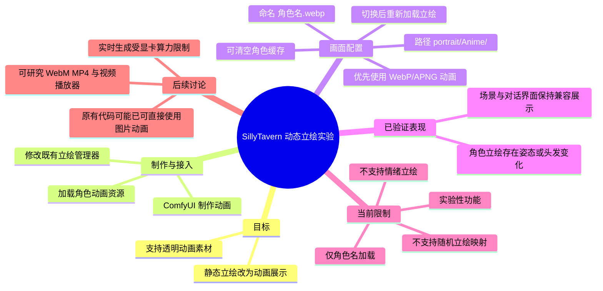
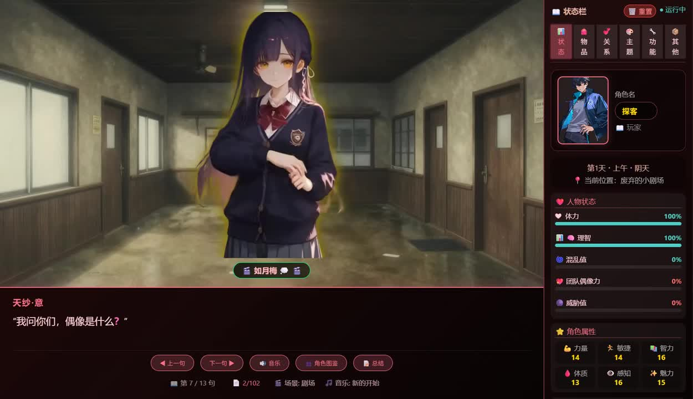
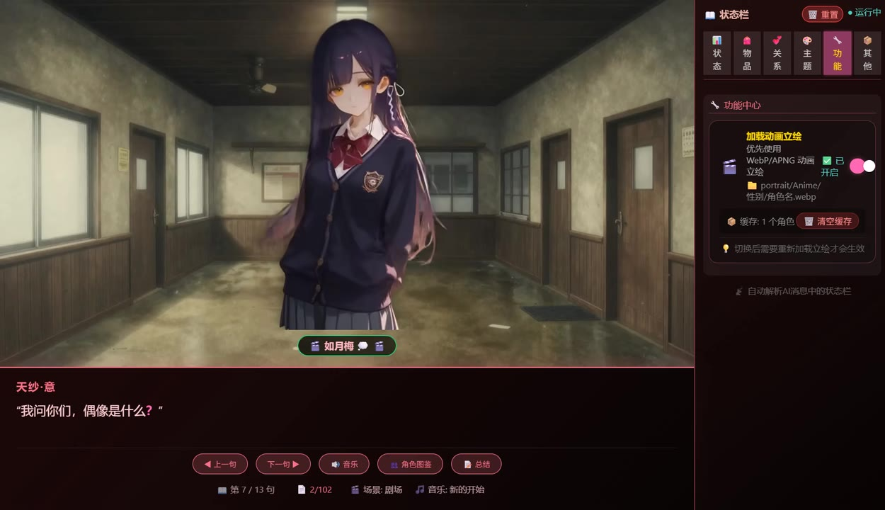
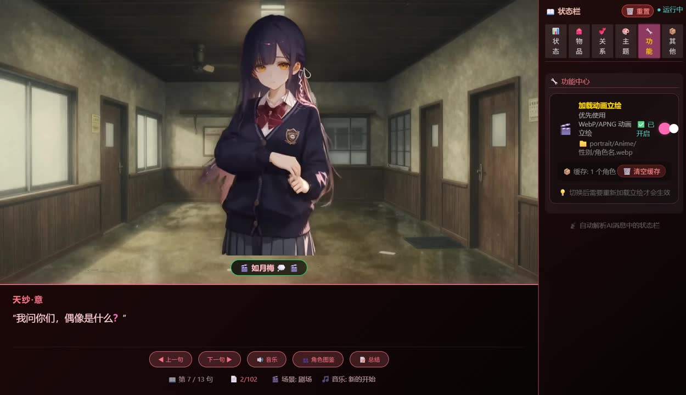

# 【酒馆SillyTarvern】会动的立绘喜欢吗？

> 来源：[Bilibili 视频](https://www.bilibili.com/video/BV1Lp7a6bEPD)<br>
> UP 主：技术探客｜视频时长：68 秒｜合集：AIcode  
> 发布日期按素材路径中的 `发布日-20260625` 整理；页面元数据中的时间戳对应未来日期环境，故不额外换算并避免产生冲突。

## 小结

这是一段展示 SillyTavern（标题中写作 “SillyTarvern”）动态立绘实验功能的短视频。UP 主用 ComfyUI 制作带透明通道的动画资源，并改造既有立绘管理器，使角色立绘不再只是静态图片，而能够加载并播放动画。

视频画面展示了一个校园走廊场景中的角色立绘：角色身体、头发或姿态在不同画面状态间发生变化。右侧“功能中心”提供“加载动画立绘”开关，并明确写有“优先使用 WebP/APNG 动画”。这表明该实验的核心不是实时生成视频，而是将预先生成的透明动画文件作为角色立绘资源加载。

实现条件在界面中可见：动画文件需放入 `portrait/Anime/` 目录，文件名使用“角色名.webp”的形式；切换功能后，提示需要重新加载立绘才会生效。界面还显示当前缓存为“1 个角色”，并提供“清空缓存”按钮，说明缓存状态会影响素材更新的可见结果。

功能限制同样需要重点保留：根据视频简介，当前仅支持按角色名加载动态立绘；不支持原有的随机立绘映射，也不支持既有情绪立绘功能。因此它是可演示、可使用的实验性能力，但不是对原立绘工作流的完全兼容替代。

视频没有提供可用的站内字幕；本次 ASR 也未识别出任何语音分段，无法据此建立可靠的逐句时间轴。本文因此以视频简介、画面中可辨认的界面文字、关键帧以及热评补充为依据；所有章节链接统一定位到视频起点，不能将其理解为精确的语义片段起止位置。

## 思维导图




## 目录

- [背景、证据范围与时效性](#背景证据范围与时效性)
- [动态立绘的展示结果](#动态立绘的展示结果)
- [界面配置、路径与缓存](#界面配置路径与缓存)
- [实现路线与实际操作顺序](#实现路线与实际操作顺序)
- [限制、兼容性与后续方向](#限制兼容性与后续方向)
- [字幕比对](#字幕比对)
- [评论分析](#评论分析)
- [处理记录](#处理记录)

## [背景、证据范围与时效性](https://www.bilibili.com/video/BV1Lp7a6bEPD?t=0)

视频简介说明，UP 主使用 **ComfyUI** 制作“支持透明动画的 Animated WebP 格式的视频”，随后“大幅修改现有的立绘管理器”，以实现加载动态立绘。这里的“真动态”是 UP 主对实现方式的强调：立绘本质上直接使用动画资源，而非通过单张立绘的随机替换来模拟动态效果。

需要区分以下三层信息：

1. **视频/简介直接陈述**：使用 ComfyUI 制作透明动画；修改立绘管理器；目前可加载动态立绘。
2. **界面画面可直接确认**：功能项优先使用 WebP/APNG 动画，存在动画文件目录、角色名文件命名提示、缓存信息和清空缓存操作。
3. **不能从素材确认的内容**：没有给出 ComfyUI 工作流、节点图、导出帧率、分辨率、单文件大小、浏览器兼容矩阵、源码改动位置，也没有给出完整安装包或仓库地址。因此这些内容不能补写为已知步骤或参数。

该视频发布时的功能状态是“实验性”。特别是热评中 UP 主随后提到曾回滚代码，意味着视频中的实现状态不应被视为当前版本仍然存在的稳定功能；实际部署前应以当时所用项目的最新代码与说明为准。

## [动态立绘的展示结果](https://www.bilibili.com/video/BV1Lp7a6bEPD?t=0)

画面主体是一个叙事/角色扮演界面：左侧为校园走廊背景，中间为校服角色立绘，下方为对话框，右侧为状态栏和功能面板。对话框显示角色名“天纱·意”，当前文本为“我问你们，偶像是什么？”。状态栏内可见角色名“探客”、日期与位置等游戏状态信息。

在不同关键帧中，角色的身体位置、手部姿态以及头发轮廓存在变化。例如，有的画面中角色双臂更靠前，另一些画面中姿态更偏侧身，长发末端的位置和形状也随之不同。这是动态资源在播放或不同动画帧被捕获的视觉证据；但由于没有逐帧时间标记，不能据此断言具体动作的持续时长、循环方式或帧率。



> 图：该帧用于说明动态立绘的实际使用场景——角色被叠加在走廊背景与文字对话界面上，而非单独在素材预览页播放。它有助于判断该功能面向角色扮演过程中的立绘展示。



> 图：该帧与前一展示状态相比，角色的姿态与发丝轮廓可见差异，是“动画而非单张静态立绘”的画面证据之一。由于关键帧未携带精确采样时刻，仅能确认存在视觉状态变化，不能量化动画参数。

从产品使用角度看，这种方案适合已经拥有角色透明动画素材、且希望在文字互动或跑团界面中增强角色表现力的使用者。它不等同于实时文生视频：动画内容应在加载前就已经制作完成。

## [界面配置、路径与缓存](https://www.bilibili.com/video/BV1Lp7a6bEPD?t=0)

右侧“功能中心”中展示了“加载动画立绘”卡片。画面可辨认的配置与提示如下：

| 项目 | 画面信息 | 含义与注意事项 |
| --- | --- | --- |
| 功能名称 | `加载动画立绘` | 用于启用动画立绘加载逻辑。 |
| 优先级 | `优先使用 WebP/APNG 动画` | 当该选项开启时，系统优先尝试动画格式资源；画面中开关处于开启状态。 |
| 素材目录 | `portrait/Anime/` | 动画立绘应放入该目录。素材未展示它相对于项目根目录的完整绝对路径。 |
| 文件命名 | `角色名.webp` | 画面以 WebP 为例提示按角色名命名；角色名是否区分大小写、是否支持别名，素材没有说明。 |
| 生效条件 | `切换后需要重新加载立绘才会生效` | 仅切换开关不一定即时刷新当前角色，需执行重新加载。 |
| 缓存 | `缓存：1 个角色` | 已加载资源会被缓存；画面提供“清空缓存”按钮。 |
| 自动解析 | `自动解析AI消息中的状态栏` | 该文本显示在卡片下方，但视频未进一步解释它与动态立绘选择之间的具体关联，不能推断为情绪或随机映射规则。 |



> 图：该帧集中展示了可操作的关键参数：WebP/APNG 优先级、`portrait/Anime/` 目录、`角色名.webp` 命名示例、缓存数量及“清空缓存”按钮，是本文配置整理的主要画面依据。

从截图可得到的最小可复现配置是：

```text
动画素材目录：portrait/Anime/
示例文件名：角色名.webp
功能选项：优先使用 WebP/APNG 动画 = 开启
刷新要求：切换后重新加载立绘
必要时：清空缓存后重新加载
```

这里的 `角色名.webp` 是界面示例，不能扩展解释为任意格式、任意子目录或通配符匹配。尽管选项文字同时列出 WebP/APNG，视频简介仅明确提到 Animated WebP；APNG 是否已被完整验证、优先级冲突时如何处理，素材不足以确认。

## [实现路线与实际操作顺序](https://www.bilibili.com/video/BV1Lp7a6bEPD?t=0)

依据视频简介与可见界面，能够严格整理出的流程如下。缺少的实现细节保留为未知，不以推测代替。

### 1. 制作带透明通道的动画资源

UP 主说明使用 ComfyUI 制作“支持透明动画的 Animated WebP 格式的视频”。因此素材目标不是常规无透明背景的视频文件，而是可作为角色立绘叠加到背景上的透明动画资源。

已知：

- 制作工具：ComfyUI；
- 主要格式：Animated WebP；
- 重要特征：支持透明动画。

未知：

- ComfyUI 节点、模型、提示词、控制图或工作流；
- 是否采用逐帧生成、视频生成或后处理合成；
- 动画分辨率、帧率、时长、压缩质量和透明通道编码方式。

### 2. 将动画素材放入指定目录并按角色名命名

界面提供的目录为 `portrait/Anime/`，命名示例为 `角色名.webp`。可据此执行以下文件准备：

```text
portrait/
└─ Anime/
   └─ 角色名.webp
```

这是画面能支持的目录结构表达，不代表项目完整文件树。实际角色名应与程序识别的角色名一致；视频只说明“目前只支持角色名加载”，没有给出字符规范、重名策略或映射规则。

### 3. 启用“优先使用 WebP/APNG 动画”

在功能中心中开启“优先使用 WebP/APNG 动画”。画面中的切换控件呈开启状态，并且功能卡片说明这一选项会优先尝试动画资源。


> 图：该帧保留了开启状态的动画立绘选项，并同时显示角色在主舞台中的表现。它说明配置面板和角色呈现位于同一工作流中，便于在切换后检查加载结果。

### 4. 重新加载立绘并处理缓存

界面明确提示“切换后需要重新加载立绘才会生效”。因此，正确顺序不是仅修改开关后等待，而是：

1. 放置或替换动画文件；
2. 开启动画优先加载；
3. 重新加载当前角色立绘；
4. 若仍显示旧资源，再按界面提供的入口清空缓存；
5. 再次加载并观察角色显示状态。

这是一套由画面提示支持的排障顺序。视频没有说明“清空缓存”是否会删除源文件、是否影响其他角色或是否需要重启页面，所以不能将其描述为无副作用操作。

## [限制、兼容性与后续方向](https://www.bilibili.com/video/BV1Lp7a6bEPD?t=0)

### 当前功能限制

视频简介给出了三项明确限制：

| 限制 | 具体影响 |
| --- | --- |
| 仅支持角色名加载 | 资源选择依赖角色名，未展示更复杂的条件或映射机制。 |
| 不支持随机立绘映射 | 原有随机选图/随机立绘工作流不能直接沿用。 |
| 不支持情绪立绘功能 | 不能根据角色状态或情绪自动切换不同动画立绘。 |

因此，当前实现更接近“**每个角色绑定一份默认动画立绘**”，而不是“按情绪、场景、随机权重动态选择多组动画”。这是根据已知限制得到的保守边界，不代表系统内部只能保存一个文件。

### 格式与播放器路线

视频画面将 WebP/APNG 作为动画图片优先项。热评中，UP 主又提出后续可研究：

- 直接播放 WebM；
- 使用 MP4；
- 引入视频播放器；
- 或沿用此前代码，因为 WebP 和 APNG 都是图片，可以直接使用。

这些是评论中提出的后续方向或事后反思，不是视频已完成、已测试的功能。尤其 WebM、MP4 与图片动画的资源加载、透明通道支持、浏览器解码、缓存策略和播放控制并不必然相同，不能把“研究方向”当作既有兼容性结论。

### 时效性与版本风险

UP 主置顶热评提到，自己研究实现后发现“原有代码完全支持这个功能”，并已“直接回滚代码”。这意味着：

- 视频展示的改造版本可能已不再是后续代码的实际状态；
- “需要大幅修改现有立绘管理器”是视频发布时的描述，不一定仍适用于之后版本；
- 使用者应先检查当前项目中对 WebP/APNG 的原生支持，再决定是否维护专门的动画加载分支。

对于资源成本，评论区还提出“预设图片或视频”可用硬盘存储替代部分实时生成算力。此观点合理地描述了预制素材与实时生成之间的资源取舍，但并非视频中的性能测试结论；没有实测显存、磁盘占用、加载延迟或 CPU/GPU 占用数据。

## [字幕比对](https://www.bilibili.com/video/BV1Lp7a6bEPD?t=0)

| 字幕来源 | 完整性 | 专有名词 | 时间轴 | 主要问题 |
| --- | --- | --- | --- | --- |
| Bilibili 站内字幕 | 未提供可用字幕 | 无法核验 | 无可用分段 | 素材清单明确说明未提供可用站内字幕。 |
| 本次 ASR 字幕 | 空 | 无输出 | 无时间分段 | ASR 结果 `segments` 为空，句子数、语音秒数与语音覆盖率均为 0；诊断提示未识别到语音片段。 |

本次 ASR 使用 `medium` 模型、自动语言识别，诊断语言为英语，置信度约为 `0.453857421875`，但最终没有输出任何识别文本或时间戳。该诊断**没有**标记 `noAudioStream=true`，因此不能断言源视频没有音轨；能够确认的仅是：从导出的音频中没有识别出可用语音分段。

最终未采用任何字幕文本。本文的术语校正与内容依据为：

- 视频标题与简介中的 `SillyTarvern`、ComfyUI、Animated WebP；
- 功能面板可见的 `WebP/APNG`、`portrait/Anime/`、`角色名.webp`、缓存与重新加载提示；
- 多张关键帧中角色立绘状态变化；
- 热评中关于回滚、WebM、MP4 和实时生成资源消耗的补充。

由于不存在真实的 ASR/SRT 起止时间，本文不能生成语义准确的段落级秒数链接；各章节均链接到 `t=0`，仅作为视频入口，不伪造时间位置。

## [评论分析](https://www.bilibili.com/video/BV1Lp7a6bEPD?t=0)

以下仅处理可获取的热评前三条，评论内容均作为评论者观点或后续说明，不替代视频内已验证事实。

### 1. UP 主：回滚专门改动，考虑复用原有图片加载能力

- 评论者：技术探客（UP 主）
- 获赞：12
- 核心内容：UP 主称研究完成后发现原有代码“完全支持这个功能”，因此回滚了改动；后续可能研究 WebM、MP4、视频播放器，或继续使用此前代码，因为 WebP 和 APNG 都属于图片，可直接使用。
- 补充价值：这是对视频简介中“大幅修改现有立绘管理器”的重要后续修正，提示读者优先验证已有代码的格式能力。
- 可信度边界：评论来自 UP 主，能代表其开发状态说明；但没有提供代码提交、版本号、测试过程或兼容清单，无法独立核验“完全支持”的具体范围。

### 2. 预制素材以存储空间换取实时生成算力

- 评论者：黑夜hear
- 获赞：3
- 核心内容：认为实时文生视频或文生图消耗算力和硬件配置；也可以使用预设图片或视频，用硬盘存储换取显卡算力。
- 补充价值：指出动态立绘方案的一个现实定位：预先制作并播放动画，通常不要求在对话过程中实时运行生成模型。
- 可信度边界：这是原则性的资源取舍判断，视频未提供任何性能数据，不能进一步推导具体的显存需求、磁盘容量或加载速度。

### 3. 对实时 TTS 与文生图联动的期待

- 评论者：rikki_love123
- 获赞：0
- 核心内容：希望加入实时 TTS 和文生图。
- 补充价值：反映观众期待从“预制动态立绘”走向语音、图像生成与角色交互的实时联动。
- 可信度边界：该评论是功能愿望，不表示视频已经具备实时 TTS、实时文生图或自动驱动立绘动画的能力。

## [处理记录](https://www.bilibili.com/video/BV1Lp7a6bEPD?t=0)

- Worker ID：`worker-mrj0wjed-b0c290ad`
- 模型：`gpt-5.6-terra`
- 素材与工具结果：使用任务提供的视频元数据、视频简介、关键帧清单、关键帧画面、站内字幕状态、ASR 诊断结果及热评 JSON；未获得可用的站内 SRT 或 ASR 文本。
- 字幕选择：站内字幕不可用；本次 ASR 已检查但输出为空，未采用。ASR 诊断未标记 `noAudioStream=true`，故记录为“未识别到语音分段”，不将其表述为无音轨或工具失败。
- 时间轴处理：ASR 没有任何带时间戳的语音片段，站内 SRT 也缺失；无法可靠定位语义段落。所有章节链接使用 `t=0` 作为视频入口，并已明确说明非精确片段定位。
- 关键帧选择依据：选用 `frames/frame-001.jpg`、`frames/frame-002.jpg`、`frames/frame-003.jpg`、`frames/frame-004.jpg`，原因分别为展示角色与对话场景、动画立绘配置面板、角色视觉状态变化，以及启用配置后的联合界面；不对关键帧未提供的采样时间进行猜测。
- 缓存清理：未执行素材目录、音频、帧图或评论缓存清理；任务提供的缓存清理执行结果为空，不能编造已清理状态。
- 未解决问题：ComfyUI 工作流、动画导出参数、APNG 实测支持情况、代码版本、回滚后的最终实现、WebM/MP4 支持情况、缓存失效规则及完整性能指标均未在素材中提供。

## 评论分析

- 热评 1：笑死，当费尽心思研究出这个后，发现原有代码完全支持这个功能，被自己蠢哭，直接回滚代码了。 接下来无非是研究直接播放WebM，或者搞个MP4，弄个视频播放器，要么就是直接沿用之前的代码，反正webp和Apng都是图片，可以直接用。
- 热评 2：可惜实时文生视频或者文生图片吃算力，吃配置，不太好搞，当然也可以利用预设图片或者视频，属于是用硬盘储存换显卡算力了
- 热评 3：有实时tts和文生图就好了

以上内容是观众反馈摘录，只用于补充理解视频反响，不作为正文事实依据。
