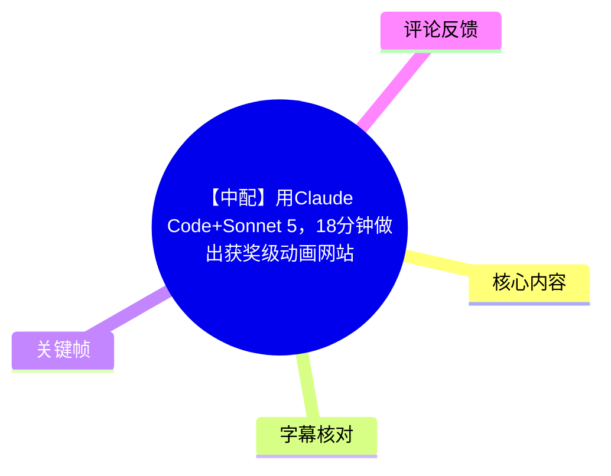
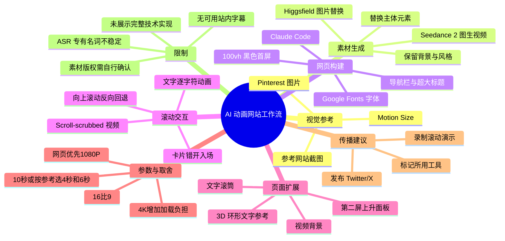
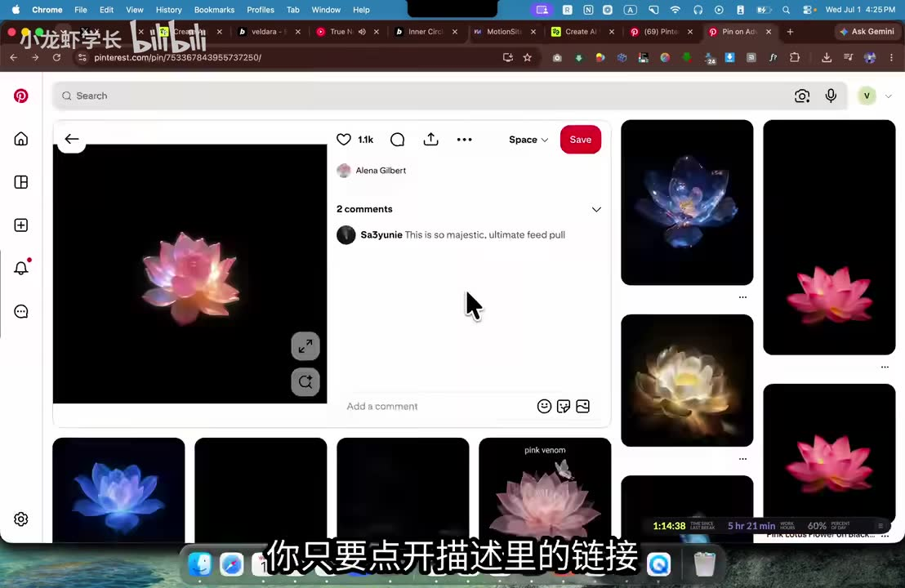
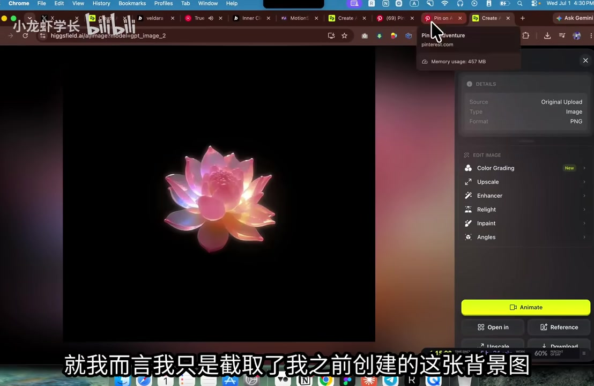
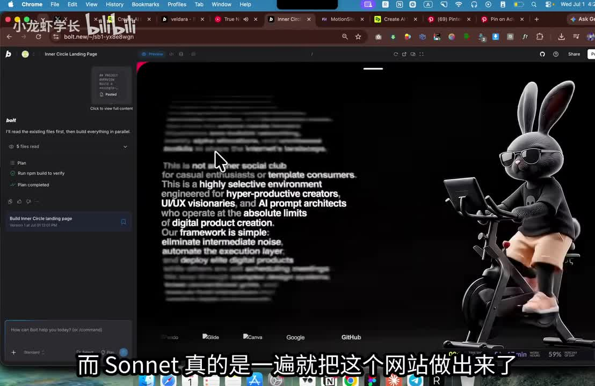
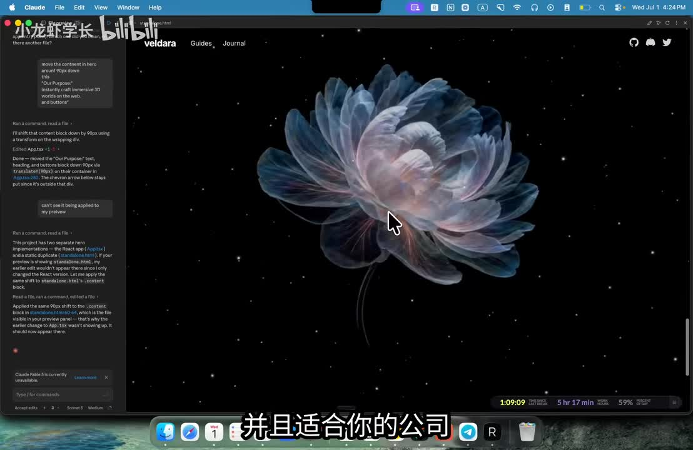

## 小结

视频演示了一套用 AI 快速制作高视觉冲击力动画网站的工作流：先从参考网站、Pinterest 图片或 Motion Size 资源中确定视觉方向，再通过 Higgsfield 进行主体替换式图片生成、以 Seedance 2 将图片转为短视频，最后让 Claude Code 按自然语言要求搭建并反复修改网页。

核心方法不是只靠“一句话生成获奖级网站”，而是把工作拆分为：**参考视觉 → 静态素材替换 → 图生视频 → 首屏结构与字体 → 滚动驱动文字/视频 → 第二屏及内容区 → 录屏发布**。作者会在每一轮结果出现后，继续补充文字宽度、字体、动画顺序、视频文件名和区块布局等约束。

视频展示的关键网页交互是 **scroll-scrubbed（滚动拖拽式）动画**：文字逐字符消失、卡片入场和背景视频的播放进度都由页面滚动位置控制；向上滚动时，效果可按滚动进度反向回退。该方案适合品牌展示页、作品集和叙事型落地页。

明确出现的生成参数包括：首个图生视频案例使用 `16:9`、`10 秒`、`1080P`；作者认为网页背景视频优先使用 1080P，较 4K 更有利于加载速度。后续猫替换兔子的示例则分别依照原始视频选择 `4 秒` 与 `6 秒`，说明时长需要与参考动作和页面节奏匹配，而非固定使用 10 秒。

视频适合具备基础网页制作概念、希望借助 AI 编程和生成式素材制作高完成度视觉原型的设计师、前端开发者和 AI 工具使用者。其限制是：未提供完整源代码、依赖版本、部署流程、视频编码策略、移动端性能数据或版权授权说明；标题中的“获奖级”是宣传性表达，素材未提供具体获奖信息。

## 思维导图





## 目录

- [视频定位、工具与时效性](#视频定位工具与时效性)
- [素材生成：参考图、图片替换与图生视频](#素材生成参考图图片替换与图生视频)
- [改造现有网站：替换品牌内容与视频](#改造现有网站替换品牌内容与视频)
- [从零创建首屏：布局、字体与滚动文字](#从零创建首屏布局字体与滚动文字)
- [让视频随滚动逐帧变化](#让视频随滚动逐帧变化)
- [第二屏、第三屏与视频背景](#第二屏第三屏与视频背景)
- [录屏发布与 TwitterX 增长建议](#录屏发布与-twitterx-增长建议)
- [可复用经验、限制与风险](#可复用经验限制与风险)
- [字幕比对](#字幕比对)
- [评论分析](#评论分析)
- [处理记录](#处理记录)

## [视频定位、工具与时效性](https://www.bilibili.com/video/BV1HqTj6qEPQ?t=0)

视频标题为“【中配】用Claude Code+Sonnet 5，18分钟做出获奖级动画网站”，UP 主为“小龙虾学长”，视频时长为 1134 秒，即 18 分 54 秒。视频描述称其覆盖带交互动画的 3D 网站生成、素材生成、动画制作和 UI 自定义；同时声明该视频为 AI 翻译配音，仅供学习交流参考。

作者口播称演示工具没有赞助，分享这些工具是因为自己在使用。该说法属于作者声明，素材本身不足以独立核验。

视频中可识别的工具及用途如下：

| 用途 | 视频中出现的名称 | 可确认用途 | 注意事项 |
| --- | --- | --- | --- |
| AI 编程与网页修改 | Claude、Claude Code、Sonnet 5 | 以自然语言创建、调整和预览网页 | ASR 将其多次识别为“Cloud”“Clawd”等，正文结合标题和界面校正为 Claude |
| 设计参考与提示词资源 | Motion Size / Motion Size.ai | 作者称可从资源中获取网站案例和提示词 | 热评指出域名拼写可能有误，应通过官方渠道交叉确认 |
| 图片灵感来源 | Pinterest | 查找符合主题的视觉参考与替换对象 | Pinterest 图片不自动等于可商用素材 |
| 图片生成/编辑 | Higgsfield | 以参考图保留风格、以另一张图替换主体 | ASR 有“Hexfield”“Hicks Field”等不稳定转写 |
| 图生视频 | Seedance 2 | 将参考视频和生成图组合生成动态素材 | 视频未说明版本、计费、许可证和导出编码 |
| 字体来源 | Google Fonts | 导入并应用字体至标题和 Logo | 视频未给出具体字体名 |
| 录屏工具 | Screen Studio、CleanShot | 录制网页滚动演示素材 | 仅为作者推荐，未进行产品对比 |

工具、模型名称、网站可用性、模型收费方式、生成速度及 Twitter/X 的传播机制均具有时效性。素材采集时间为 2026-07-13；实际复现时应以平台当前功能、价格和许可条款为准。

## [素材生成：参考图、图片替换与图生视频](https://www.bilibili.com/video/BV1HqTj6qEPQ?t=90)

作者将“生成素材”作为制作网页的第一环节。其思路不是从纯文字描述开始，而是先找到视觉锚点，再让图像模型基于已有风格进行替换。

### 1. 在 Pinterest 查找主题参考

作者先在 Pinterest 中寻找适合页面主题的图片。该图像主要承担以下作用：

- 确定主体形状、材质和颜色；
- 确定黑色背景、发光效果和构图；
- 作为后续静态图、动态视频和网页视觉的一致性来源。



> 图：画面显示 Pinterest 中的黑底发光花朵参考图。它说明作者会先通过现有视觉素材确定网站的美术方向；该图也是后续“保留风格、替换主体”操作的参照。使用网络图片前仍需确认原素材授权。

### 2. 使用两张图完成主体替换

作者在 Higgsfield 中准备两张图片：

1. 第一张：之前制作的背景图或原始构图，承担风格、背景和布局参考；
2. 第二张：从 Pinterest 找到的新图片，承担待替换的主体元素。

视频中的提示词意图是：将第一张图片中的花替换为第二张图里的花，同时替换与主体关联的下方元素。生成结果保留了黑色背景和整体风格，但主体换成了新的花朵视觉。



> 图：该帧展示 Higgsfield 页面中的粉色发光花朵、右侧编辑选项及 `Animate` 按钮。其价值在于直接对应“静态图生成完成后，继续转为动态素材”的操作衔接，也支持将 ASR 中的工具名称校正为 Higgsfield。

### 3. 在 Seedance 2 中把图片转换为视频

首个案例中，作者将原始参考视频和新生成的图片一同附加到 Seedance 2，并选择 `Animate`。口播明确提及的参数如下：

| 参数 | 首个案例设置 | 作者给出的理由 |
| --- | --- | --- |
| 画幅 | `16:9` | 适配网页中的宽屏视觉区域 |
| 时长 | `10 秒` | 用于演示生成对应的背景动态素材 |
| 分辨率 | `1080P` | 作者认为网页场景更利于速度和加载 |
| 4K | 可选但未选 | 作者认为网页用户不应等待过久加载视频 |

作者的判断是：4K 可用于其他视频需求；但网页中作为动态视觉素材时，1080P 通常是更合适的取舍。需要注意，视频没有提供码率、文件大小、预加载策略、CDN、转码格式或真实加载耗时，因此“1080P 更快”应理解为作者的经验判断，而非可直接套用的性能结论。

### 4. 猫替换兔子的重复案例

后续作者以兔子图像为原始参考，并在 Pinterest 找到毛茸茸的猫作为替换对象。提示词思路仍然相同：保留原始图像的背景、风格和整体外观，主要将兔子替换为猫。

图生视频时，作者先查看参考视频时长，再在 Seedance 2 中设置相应时长：

| 片段 | 参考视频时长 | 作者选择 | 目的 |
| --- | ---: | ---: | --- |
| 第一个猫替换案例 | 4 秒 | 4 秒 | 尽量维持原始动作片段节奏 |
| 后续第二段素材 | 6 秒 | 6 秒 | 与第二段参考视频长度对应 |

这说明视频时长不是固定参数：首例采用 10 秒，后两例分别采用 4 秒和 6 秒。视频没有展示如何处理视频循环、首尾帧衔接、负面提示词、多次生成筛选或素材压缩。

## [改造现有网站：替换品牌内容与视频](https://www.bilibili.com/video/BV1HqTj6qEPQ?t=270)

在从零搭建前，作者先展示如何将已有动画网站改造成新的公司主题页面。

其要求是将导航栏、名称、标题、按钮、三个板块和三张卡片等内容，改为视频剪辑机构、AI 视频剪辑相关的内容；同时尽量保持原网站现有的结构和文字量级。口播中出现了“电影感剪辑”“预约免费咨询或预约通话”等改写后的文案。

操作顺序可整理为：

1. 明确说明页面要改成的业务类型；
2. 列出需要替换的 UI 范围，而非仅说“改个主题”；
3. 要求保留导航、卡片数量、信息层级和整体布局；
4. 生成对应的新视觉视频；
5. 替换网页中的视频 URL；
6. 向下滚动检查首屏之外的内容是否同步更新。



> 图：画面展示一个黑底页面：左侧是大段动态文本，右侧为骑车的兔子视觉。它解释了作者所说的“保留页面结构、替换网站内容和视频素材”具体意味着什么——不仅修改文案，也替换中心视觉资产。



> 图：画面展示 Claude 工作界面及一个以发光花朵为中心的黑底网页。该帧表明替换后的网站不只是文字变更，还形成了新的中心视觉主题与品牌氛围。

这一阶段可迁移的提示词原则是：**同时指定“要变更什么”和“必须保留什么”**。例如，要求替换业务领域时，应同步写明导航栏、标题、按钮、卡片数量、文字长度和视频位置等约束，减少模型重构过度或遗漏内容的概率。

## [从零创建首屏：布局、字体与滚动文字](https://www.bilibili.com/video/BV1HqTj6qEPQ?t=380)

作者随后新建聊天和项目文件夹，命名为 `Animated 3D Website`，并从一个名为 “Inner Circle” 的黑色极简页面开始搭建。

视频没有展示终端命令、前端框架、依赖安装、文件结构或源码，因此以下内容是依据口播整理出的页面需求，而不是可直接运行的工程代码。

### 首屏布局需求

作者对 Claude 的首屏描述可归纳为：

```text
- 首屏高度：100vh
- 顶部：无额外内容
- 背景：纯黑色，不使用渐变
- 导航栏：左侧简短 Logo，右侧 4 个链接
- 大标题：INNER CIRCLE，全大写
- 标题位置：首屏底部上方约 40px
- 标题尺寸：填满首屏，并随视口尺寸变化
```

这里的重点是把视觉要求转为可验证的约束：`100vh`、纯黑背景、左侧 Logo、右侧四个链接、距底部约 40px、标题全大写及响应式缩放。相较于“做一个酷炫网站”，这类约束更容易让 AI 编程工具生成接近预期的初版。

### 字体调整

作者认为字体约占设计完成度的很大部分，并前往 Google Fonts 选择字体。他复制字体名称后，要求 Claude：

1. 从 Google Fonts 导入该字体；
2. 应用于主标题；
3. 同时应用于 Logo。

视频没有提供实际字体名称，因此无法据此指定某款字体。实际使用时还需要检查字体许可、字重加载、中文回退字体和网络加载性能。

### 文字拆分与滚动动画

作者要求将 `INNER CIRCLE` 拆成单个字符。用户滚动时，每个字符从左到右依次向下掉落、淡出，并带有轻微挤压效果。

最重要的设计条件是：

- 动画绑定滚动位置，而非独立时间轴；
- 向下滚动时推进动画；
- 向上滚动时按进度反向回退；
- 字符需要逐个响应，而不是整段文字一起变化。

视频未展示底层实现，因此无法确认其使用原生 CSS、JavaScript、GSAP、ScrollTimeline、Framer Motion 或其他库。可以确认的是，作者希望 AI 实现“字符切分 + 滚动进度映射 + 错开动画 + 透明度/位移/缩放变化”的组合效果。

## [让视频随滚动逐帧变化](https://www.bilibili.com/video/BV1HqTj6qEPQ?t=570)

作者下载生成好的猫视频，将其拖入网页项目文件夹，再复制视频文件名交给 Claude。

其要求可概括为：

> 使用静音视频元素；在每一帧动画中设置视频当前时间，使视频逐帧随滚动进度播放，并尽量避免不同设备上的卡顿。

这类方案与普通自动播放背景视频不同：

| 方式 | 播放控制来源 | 常见用途 | 视频中的目标 |
| --- | --- | --- | --- |
| 自动播放 | 视频自身时间轴 | 循环背景、宣传片 | 不是重点 |
| 滚动驱动播放 | 页面滚动进度 | 叙事型滚动页面 | 是 |
| 逐帧定位 | 代码持续设置视频当前时刻 | 让前进、倒退都与滚动同步 | 作者明确要求 |

作者接着添加首屏以下内容：

- 使用新字体的较小标题；
- 标题下的一句话普通描述；
- 主体上方、靠左、尺寸接近 Logo 的标语；
- 加快 `INNER CIRCLE` 文字消失速度。

后续又提出修正要求：

- 将文案改为“为少数人打造”；
- 缩窄文字区域，避免内容铺得太宽；
- 元素进入视口时从模糊、略微缩小状态，以错开延迟变为清晰和完整尺寸；
- 卡片及每一行内容按顺序播放入场动画；
- 向上滚动时，视频应按滚动进度回退。

### 视频未展开的性能问题

作者口播提出“不卡顿”的目标，但没有展示性能测试。真实项目中，至少需要自行验证：

1. 视频编码是否适合频繁跳转 `currentTime`；
2. 移动浏览器的视频预加载、内联播放和内存回收限制；
3. 滚动监听是否节流，避免高频重绘；
4. 是否为弱性能设备提供静态图或低清视频降级；
5. 是否支持 `prefers-reduced-motion`，降低不必要动态效果；
6. 是否包含视频替代内容、键盘导航和足够的文本可读性。

## [第二屏、第三屏与视频背景](https://www.bilibili.com/video/BV1HqTj6qEPQ?t=740)

作者继续创建第二个区域。热评中提供了一段与视频内容相符的英文提示词，其核心要求包括：

- 创建一个全屏面板；
- 面板由第一屏的滚动进度驱动，从视口底部向上升起；
- 面板顶部具有圆角；
- 背后预留稍后添加的、随滚动播放的视频背景；
- 左侧包含文字滚筒和滚动驱动的宣言文案；
- 文案使用关键词高亮、景深模糊和透明度变化。

可将其理解为第二屏的结构规格：

```text
第二屏：
- 全屏面板
- 自视口底部上升
- 由第一屏滚动进度控制
- 圆角顶部边缘
- 背后为 scroll-scrubbed 视频背景
- 左侧为文字滚筒与宣言文案
- 关键词高亮、模糊和透明度变化
```

作者还表示，对于 3D 环形文字等效果，可以截取参考图后直接交给 AI 重建相似结构。这是一种通过截图传达视觉要求的工作方法，不代表生成结果必然精确，也不代表可以忽略原设计、商标或素材的版权问题。

后续，作者将第二段生成视频重命名为类似 `Video 2.mp4` 的不重复文件名，拖入项目目录，再要求 Claude 使用与首屏相同的滚动属性接入视频。作者在预览时承认页面有些卡顿，并将其归因于 Claude 仍在处理；这说明视频中并未提供持续稳定的性能验证。

## [录屏发布与 Twitter/X 增长建议](https://www.bilibili.com/video/BV1HqTj6qEPQ?t=930)

页面完成后，作者讲解如何将成品制作成社交媒体展示内容。

建议流程如下：

1. 将网页展示区域调整为接近正方形的画幅；
2. 使用 Screen Studio 或 CleanShot 等工具录屏；
3. 隐藏浏览器、多余窗口等分散注意力的元素；
4. 录制一次由上至下的页面滚动；
5. 让观众看到每个 section、文字动画和视频变化；
6. 发布至 Twitter/X；
7. 说明使用了哪些工具，并在适合时标记工具方或作者。

作者称自己的 Twitter 账号从零关注者开始，在不到一年内增长至约 5.8 万关注者，并称有内容获得约 200 万、260 万和 300 万播放。这些数字均为作者口述，素材未提供账号链接或后台数据，不能视为已独立验证的增长案例。

作者的观点是：如果作品足够好，提及所用工具可能带来工具方转发，因为这相当于为工具提供曝光；若标记作者本人，也可能得到评论或转发。他同时强调质量门槛，认为普通新手作品未必会被转发。这是展示策略建议，不构成平台流量或账号增长承诺。

ASR 将作者建议标记的账号转写为 “Victor Audi”“Victor Adi”等多个版本，素材不足以确认具体账号拼写，因此不建议直接依据 ASR 搜索或标记。

## [可复用经验、限制与风险](https://www.bilibili.com/video/BV1HqTj6qEPQ?t=1050)

### 可复用的最小工作流

```text
1. 明确品牌主题和页面气质
2. 收集参考网站、参考图片或参考视频
3. 通过“保留风格 + 替换主体”生成静态图
4. 用图生视频工具生成动态素材
5. 按网页用途选择画幅、时长和分辨率
6. 创建 100vh 黑色首屏与基础导航
7. 先导入字体，建立明确排版层级
8. 将大标题拆分为字符并绑定滚动动画
9. 将静音视频播放进度绑定滚动位置
10. 新增内容区、卡片、上升面板和第二段视频
11. 录制完整滚动演示并发布至社交媒体
```

### 视频中可迁移的经验

- **先做视觉资产，再承载到网页。** 高级感不仅来自前端动画，也来自图片、视频、字体和构图的统一。
- **提示词应当可检查。** `100vh`、四个链接、纯黑背景、距底 40px、全大写标题、逐字符从左至右等描述，比笼统形容词更可执行。
- **生成后持续迭代。** 作者没有一次完成，而是不断补充字体、文案、宽度、动画速度、卡片顺序和视频文件名。
- **网页视频需优先考虑加载。** 作者选择 1080P 而非 4K，但实际决策仍取决于视频长度、编码、网络环境和设备性能。
- **滚动绑定适用于叙事页面。** 其价值在于动画前进和回退均与用户操作一致，适合作品集与品牌故事页面。

### 素材未覆盖或无法确认的部分

| 项目 | 素材状态 | 实际落地影响 |
| --- | --- | --- |
| 完整源代码 | 未提供 | 无法直接复刻项目结构和动画实现 |
| 前端框架与动画库 | 未说明 | 无法判断包体积、维护成本和兼容性 |
| 部署、域名与 CDN | 未说明 | 无法判断真实上线速度和缓存策略 |
| 视频压缩与格式 | 未说明 | 原始生成视频可能不适合直接上线 |
| 移动端测试 | 未展示 | “不卡顿”不能视为普遍成立 |
| 无障碍支持 | 未说明 | 需自行补充减弱动效、替代文本和键盘访问 |
| 图片及参考设计版权 | 未说明 | Pinterest 与参考网站素材不能默认商用 |
| “获奖级”依据 | 未提供获奖信息 | 只能视为标题中的风格性宣传 |
| Sonnet 5 确切可用性 | 标题和口播提及 | 需以当前平台实际模型列表为准 |

## [字幕比对](https://www.bilibili.com/video/BV1HqTj6qEPQ?t=1090)

本次任务已执行 ASR。站内字幕未提供可用资源；素材清单中还记录了字幕工具告警：

```text
subtitles: Tool process exited with code 1.
[video-tool] Missing JSON resource URL.
```

| 字幕来源 | 完整性 | 专有名词 | 时间轴 | 主要问题 |
| --- | --- | --- | --- | --- |
| Bilibili 站内字幕 | 不可用 | 无法评估 | 无法评估 | 未提供可用站内字幕，且获取过程缺少 JSON 资源 URL |
| 本次 ASR 字幕 | 覆盖开场至结尾的大部分口播 | 存在较多误识别 | 未提供逐句时间戳 | 中英文混杂、专有名词不稳、部分重复或断裂 |

最终正文采用**本次 ASR 字幕为主要依据**，并仅在标题、关键帧界面和上下文能够支持时进行有限校正；无法确认的信息保留不确定性，不补写未出现的内容。

| ASR 转写 | 正文处理 | 校正依据 |
| --- | --- | --- |
| `Cloud`、`Clawd` | 写作 Claude 或 Claude Code | 视频标题为 Claude Code，关键帧可见 Claude 界面 |
| `sonnet 5`、`Sonic Fab` | 采用标题中的 Sonnet 5，不确认 “Sonic Fab” | 标题与后者不一致，后者疑似误识别 |
| `Hexfield`、`Hicks Field` | 优先写作 Higgsfield | 关键帧浏览器地址可见 `higgsfield.ai` |
| `Cdance2`、`seed and store` | 写作 Seedance 2 | ASR 多处转写不稳定，但上下文一致 |
| `motion size.ai` | 写作 Motion Size / Motion Size.ai，并标注待核验 | 视频与热评对站点拼写存在分歧 |
| `Victor Audi / Victor Adi` | 不确认具体账号名称 | ASR 不稳定，缺少可验证主页链接 |

正文中的章节时间点依据口播内容顺序整理，用于定位相关片段；由于本次 ASR 未提供逐句时间码，不应视为逐字精确字幕时间轴。

## [评论分析](https://www.bilibili.com/video/BV1HqTj6qEPQ?t=1100)

以下仅分析本次可获取的热评前三条，不将评论内容直接视为已验证事实。

### 1. 本王今年八岁：Sonnet 5 并非唯一必要条件

> “所以提到的东西，只有sonnet5是多余的，换啥模型都能做到”

该评论认为成果不应全部归因于 Sonnet 5，换用其他模型也可能完成类似任务。这个观点指出视频成果实际上依赖多个环节：参考设计、图片生成、图生视频、网页生成和多轮提示词迭代。

其合理之处在于，视频确实展示了多工具协作，而非仅依赖单一模型；但评论未提供不同模型在质量、速度、代码可维护性和稳定性上的对照测试。因此，不能由此推导“任何模型都能以相同效果完成”。

### 2. 七彩虾条：Motion Size 域名可能存在拼写问题

> “输错motionsite.ai能打开（少了一个s），输入视频里的motionsites.ai反而打不开”

该评论提供了可能影响复现的域名线索：视频中提到的站点拼写可能与实际可访问域名不同。该信息对寻找资源网站有价值，但评论没有给出官方来源、跳转截图或域名归属信息。

因此，建议通过视频描述、创作者主页、官方社交账号或搜索结果交叉确认，避免因相似域名进入非官方或不安全网站。

### 3. 安安zev：补充第二屏英文提示词

该评论贴出一段英文提示词，主要描述“从视口底部升起的全屏圆角面板”“第一屏滚动进度驱动”“后方 scroll-scrubbed 视频背景”“左侧文字滚筒”“关键词高亮、景深模糊和透明度”等要求。

该评论的价值在于补充了视频第二屏设计意图的可复制文本。不过该内容属于评论者转录，且原句中存在不完整表达；使用时仍需结合自身的页面结构、视频文件路径、动画库和性能目标修改，不能假定原样粘贴即可稳定复现相同页面。

## [处理记录](https://www.bilibili.com/video/BV1HqTj6qEPQ?t=1134)

- Worker ID：`worker-mrj0wjed-b0c290ad`
- 模型：`gpt-5.6-terra`
- 视频：`BV1HqTj6qEPQ`
- 调用素材与工具结果：视频元数据、素材清单、已执行的 ASR 字幕、关键帧、可获取热评前三条。
- 字幕选择：站内字幕不可用；本次 ASR 已执行并作为正文主要文本依据。Claude、Higgsfield、Seedance 2 等名称仅在标题、关键帧或上下文支持时校正。
- 关键帧选择依据：
  - `frames/frame-001.jpg`：显示原始黑底网站、骑车兔子和内容布局，用于说明改造现成网站的对象；
  - `frames/frame-002.jpg`：显示 Claude 中的花朵主题预览，用于说明品牌视觉替换结果；
  - `frames/frame-003.jpg`：显示 Pinterest 的花朵参考图，用于说明视觉参考来源；
  - `frames/frame-004.jpg`：显示 Higgsfield 的生成图与 Animate 按钮，用于说明图像生成到图生视频的衔接。
- 未选用其余帧的原因：给定素材中未附带其余关键帧的可可靠画面说明；为避免编造，未对其内容作未经证实的描述。
- 缓存清理：未提供缓存目录、清理命令或执行结果，无法确认是否已清理；本记录不虚构缓存清理状态。
- 未解决问题：
  - 站内字幕资源 URL 缺失，无法进行逐句字幕对照；
  - ASR 无逐句时间码，正文时间轴为内容段落定位；
  - Motion Size 的准确域名存在视频与评论拼写分歧；
  - 网页完整源码、依赖版本、视频编码参数、部署流程及移动端性能数据均未提供。

## 评论分析

本次流程未获取到可用热评，因此不推断观众态度或额外结论。
