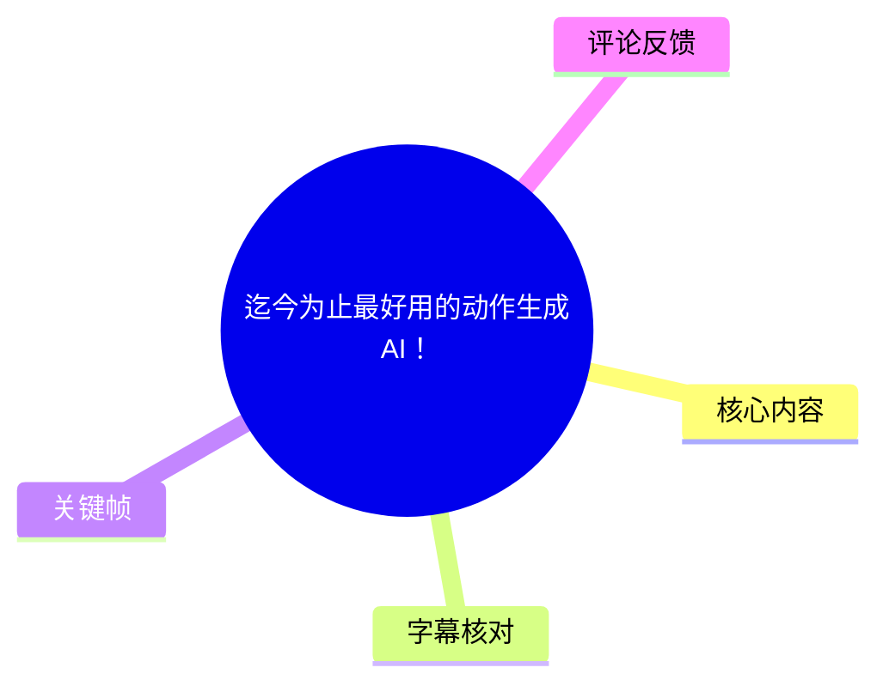
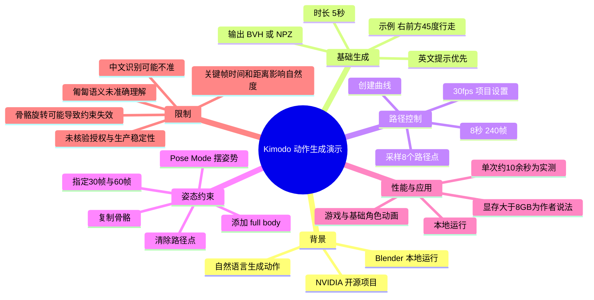
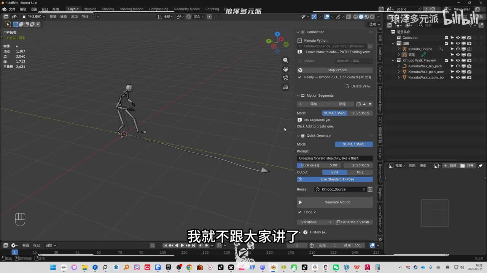
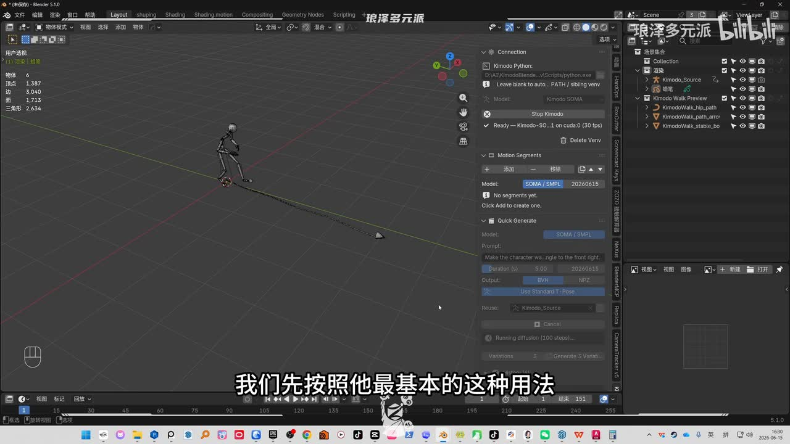
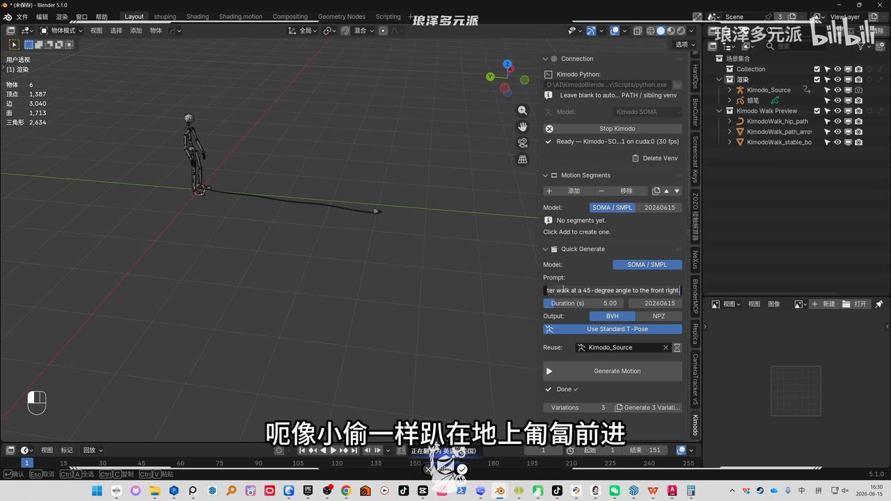
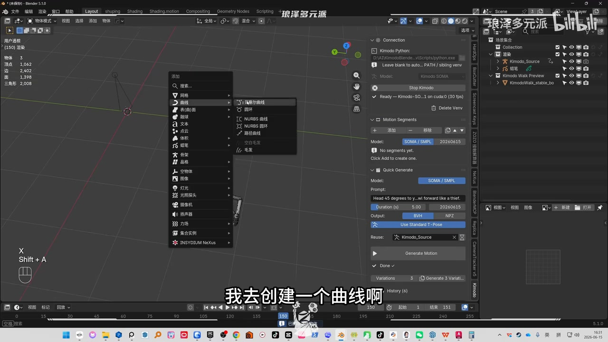

# 迄今为止最好用的动作生成AI！

> 来源：[Bilibili 视频](https://www.bilibili.com/video/BV1jJJG62EMQ) 
> UP 主：琅泽多元派｜发布时间：2026-06-15｜视频时长：8 分 38 秒｜合集：AIcode

## 小结

视频演示了一个在 Blender 中运行的 NVIDIA 开源动作生成项目。视频画面中的插件面板名称为 **Kimodo**，模型栏可见 **Kimodo-SOMA**；UP 主将其口述为“KIMOTO / KIMO”，ASR 对项目名称存在明显识别摇摆。因此，本文以画面中可辨识的 **Kimodo** 指代该工具，但不将其扩展解释为未经素材验证的正式项目全称。

其核心能力是：为已绑定骨骼的角色输入自然语言动作描述，设置生成时长后，在本地生成角色动画。视频先以“向右前方 45 度行走”测试基础文本生成，再尝试匍匐/潜行类描述；结果显示工具能得到“蹑手蹑脚”风格，但没有准确理解“匍匐前进”。这说明文本提示能够驱动基础动作意图，却不能保证复杂、具体动作被精确执行。

教程重点不只是“文生动作”，还展示了两种约束方式：其一是将角色沿 Blender 曲线路径移动，并采样多个路径点；其二是在指定帧设置 `full body` 姿态约束，使生成结果尽量经过人工摆定的姿势。前者适合运动轨迹控制，后者适合关键姿态控制，二者共同把纯随机生成转为可编辑的动画工作流。

视频中给出了若干实用参数：基础示例设置为 **5 秒**；路径示例设为 **8 秒、240 帧、8 个路径点**，由此可知该项目场景帧率设置为 **30 fps**。UP 主还观察到：5 秒动画通常约十余秒生成，后续重生成约十秒；本地运行条件被表述为显存 **大于 8 GB**。这些均是视频作者在其机器和测试条件下的经验，不应视为通用性能承诺或官方最低配置。

效果判断应保持克制。UP 主认为工具已可用于游戏或基础角色动画，并称适当微调后可达到其所认为的“可商用”程度；但视频也直接展示了约束失败、骨骼旋转导致第 60 帧异常，以及跳跃动作因关键帧时间或空间距离不合理而不自然的情况。热评进一步质疑其精度、动作风格理解与相对动捕/现有动作库的效率。故它更适合用于原型、群像角色、基础循环/位移动作和动画初稿，而非无需审核即可替代动画师或动捕的方案。

信息具有明显时效性：视频录制时 UP 主称自己安装后“玩了不到一天”，模型、插件、安装脚本、显存需求、兼容骨骼和授权边界均可能随项目更新而改变。视频未给出版本号、仓库地址、许可证、系统环境、显卡型号或完整安装流程，实际生产使用前仍需自行核验官方文档与许可。

## 思维导图

## 目录

- [背景、工具与时效性](#背景工具与时效性)
- [基础文本生成：提示词、时长与结果](#基础文本生成提示词时长与结果)
- [路径约束：曲线采样与帧分配](#路径约束曲线采样与帧分配)
- [姿态约束：用 full-body 控制关键帧](#姿态约束用-full-body-控制关键帧)
- [性能、用途与操作步骤](#性能用途与操作步骤)
- [限制、风险与可迁移经验](#限制风险与可迁移经验)
- [字幕比对](#字幕比对)
- [评论分析](#评论分析)
- [处理记录](#处理记录)

## 背景、工具与时效性 [00:00:00](https://www.bilibili.com/video/BV1jJJG62EMQ?t=0)

UP 主开场称，NVIDIA 刚发布了一个开源项目，可以依据自然语言描述生成一段动画；随后其第一时间测试，主观评价为“还挺好用”。这属于视频作者对工具来源、使用体验的陈述，素材未包含项目公告、源码仓库或官方文档，无法据此进一步核验发布日期、开源协议或功能边界。

画面显示该功能在 Blender 内以侧边面板形式工作，面板可见以下信息：

- 面板标题/标识：`Kimodo`；
- 模型栏：`Kimodo-SOMA`；
- 状态：`Ready — Kimodo-SO...1 on cuda:0 (30 fps)`；
- 生成分区：`Motion Segments` 与 `Quick Generate`；
- 输出格式选项：`BVH`、`NPZ`；
- 操作入口：`Generate Motion`；
- 画面右侧场景中可见 `Kimodo_Source`、`Kimodo Walk Preview` 等对象命名。

> 图：该帧提供了识别工具名称和界面能力的直接画面证据。尤其是 `Kimodo-SOMA`、`Duration (s)`、`BVH / NPZ` 与 `Generate Motion`，可用于校正 ASR 对项目名称和个别界面术语的误识别。

安装部分没有被完整教学。UP 主明确说网上已有安装教程，因此不展开；其个人安装方式是让 Codex 协助在电脑上安装该 NVIDIA 开源项目。这里的“让 Codex 安装”只是作者的使用经验，视频没有展示提示词、命令行输出、依赖安装、错误处理或是否一次成功，不能据此复现完整环境。

## 基础文本生成：提示词、时长与结果 [00:00:24](https://www.bilibili.com/video/BV1jJJG62EMQ?t=24)

### 基础测试：右前方 45 度行走 [00:00:24](https://www.bilibili.com/video/BV1jJJG62EMQ?t=24)

作者输入的意图是让角色“向右前方 45 度走”。画面中提示词框显示英文句子，且关键帧可辨识为类似：

> `Make the character walk at a 45-degree angle to the front right.`

视频的经验结论是：**尽量使用英文提示词**。作者称中文提示有时识别不准；这是其个人测试观察，并未做中英文对照实验，也没有给出准确率。

基础生成参数和观察如下：

| 项目 | 视频内容 |
| --- | --- |
| 动作意图 | 向右前方约 45 度行走 |
| 提示语言 | 建议英文 |
| 时长 | 5 秒 |
| 生成方式 | `Quick Generate` / 生成动作 |
| 结果 | 角色向斜前方行走，作者主观认为动作自然 |
| 生成耗时 | 作者称 5 秒动画约“十来秒钟”生成；未剪辑展示 |
| 播放方式 | 按空格播放 |

> 图：该帧将口述的“右前方 45 度行走”“英文提示”和“5 秒”与实际插件界面关联，是理解基础工作流的参数依据。

作者以“一个完全不会做动画的人”的视角，认为手工制作此类行走动画的学习成本很高，而工具降低了基础结果的获取门槛。这个判断强调的是**初稿生成效率**，并不意味着输出已符合角色表演、镜头节奏、物理接触或生产级质量要求。

### 复杂语义测试：潜行与匍匐 [00:01:33](https://www.bilibili.com/video/BV1jJJG62EMQ?t=93)

第二个测试意图为：向右前方 45 度走，并像“小偷一样”趴在地上匍匐/潜行前进。画面显示英文提示词，内容可见为近似“像小偷一样悄悄向前爬行”的描述。

> 图：该帧展示了复杂动作并非只靠一个方向词，而是同时包含方向、姿态和风格语义；它也对应后文“模型未完全理解匍匐”的失败案例。

作者的观察是：

1. 工具**没有准确理解“匍匐”**；
2. 但它抓住了“小偷”所关联的蹑手蹑脚、谨慎移动的感觉；
3. 作者因此将结果评价为“姑且算可以”。

这段测试说明提示词语义不会逐词、逐动作严格兑现。对制作流程而言，应将文生动作理解为候选动作生成，而不是精确动作脚本执行。对于低姿态爬行、接触地面、重心变化等动作，需要逐帧检查身体穿插、脚滑、手脚接触和动作连贯性。

## 路径约束：曲线采样与帧分配 [00:01:59](https://www.bilibili.com/video/BV1jJJG62EMQ?t=119)

### 建立 90 度转向曲线 [00:01:59](https://www.bilibili.com/video/BV1jJJG62EMQ?t=119)

基础文本生成之外，作者展示通过路径点约束角色行走方向。其操作是在 Blender 中创建一条曲线，并编辑成约 90 度转弯的路径；之后回到第 0 帧，选择该曲线，并在插件中将其作为路径点来源。

> 图：该帧直接呈现了路径控制所依赖的是 Blender 曲线对象，而不是仅靠提示词描述“沿路径行走”。这能帮助理解路径控制属于显式空间约束。

视频中的关键参数为：

| 参数 | 设置/含义 |
| --- | --- |
| 曲线形状 | 作者手动创建约 90 度转弯路线 |
| 路径点数量 | 8 个 |
| 动画时长 | 8 秒 |
| 帧数 | 240 帧 |
| 场景帧率 | 30 fps（作者称项目已设为 30） |
| 关系 | 8 秒 × 30 fps = 240 帧 |
| 默认匹配对象 | 作者解释为整个身体随路径点匹配 |

路径点采样的含义是：插件会在曲线上取出 8 个点，生成时角色依次向这些点移动，从而走完整条路线。作者也强调，不必在提示词中重复写“沿路径”；文本主要描述动作状态，例如“正常走路”或“跑起来”，而是否沿路径移动主要由面板下方的路径参数控制。

### 路径点与关键帧映射 [00:03:50](https://www.bilibili.com/video/BV1jJJG62EMQ?t=230)

作者展示，生成后路径点被赋予具体关键帧：第 1 帧到第一个点、第 35 帧到第二个点、第 69 帧到第三个点，之后继续前进。视频未完整列出全部 8 个点的帧号，因此不能据此推导精确、均匀的分配公式；可以确定的是，插件会把路径采样点与时间轴上的帧位置关联。

路径模式的结果并不总是准确。作者提到此前潜行/匍匐提示在路径条件下生成得有些“打拳”的感觉，但后半段开始爬起来，说明模型又部分捕捉到了匍匐意图。随后换成正常行走或跑步的基本状态进行测试，作者认为结果适合用于群像角色动画。

**适用判断：**

- 可以考虑用于人群、路人、远景角色等对单个角色表演精度要求较低的场景；
- 可用于在既定空间路径上快速得到行走/跑步初稿；
- 不应仅凭路径约束就认定脚部接触、转向、速度变化和角色碰撞都正确；
- 路径模式默认倾向整个身体匹配路径，实际角色朝向、骨骼根节点和绑定结构仍需检查。

## 姿态约束：用 `full body` 控制关键帧 [00:04:38](https://www.bilibili.com/video/BV1jJJG62EMQ?t=278)

### 清理路径模式并建立姿态 [00:04:38](https://www.bilibili.com/video/BV1jJJG62EMQ?t=278)

为了让某一帧处于更可控的姿势，而不是完全由 AI 决定，作者切换到姿态约束流程：

1. 清除路径点；
2. 删除路径模式生成的一组空物体；
3. 不再使用路径；
4. 复制骨骼；
5. 进入 `Pose Mode`（姿态模式）；
6. 删除骨骼原有全部关键帧；
7. 在目标状态下手动摆出一个姿势；
8. 在插件下方添加名为 `full body` 的约束。

这里的核心思想是：先用人工骨骼姿态建立一个控制目标，再将该目标纳入生成条件。视频没有说明 `full body` 是插件中的具体约束类型、对象名称还是按钮标签的完整定义，因此本文保留画面/口述中的英文名称，不擅自扩展其技术实现。

### 为姿态约束指定时间 [00:05:03](https://www.bilibili.com/video/BV1jJJG62EMQ?t=303)

添加 `full body` 后，作者称下方会出现约束项并自动拾取刚添加的对象；若拾取错误，可以手动指定对象。随后可在约束中填写帧数：

- 希望角色在某姿势/位置出现于第 **30 帧**，则设为 `30`；
- 希望再在第 **60 帧**到达另一个姿势/位置，则新增一项并设为 `60`；
- 作者提到该工具会依据对象名称自动填写部分信息，使用上较方便。

生成后的观察是：第 30 帧时，手部骨骼与全身骨骼和作者搭建的约束系统“完全重叠”；而第 60 帧发生问题。作者推测问题与骨骼旋转有关，并尝试如下修复：

1. 在**物体层级**对旋转进行归位；
2. 再进入**姿态模式**；
3. 将姿态旋转到 90 度；
4. 重新生成并观察结果。

该案例很重要：姿态约束不是“填帧号后必然准确”的保证。对象级变换与姿态级变换混用、骨骼朝向、根节点设定等都可能导致约束在某些帧失效或偏移。

## 性能、用途与操作步骤 [00:06:40](https://www.bilibili.com/video/BV1jJJG62EMQ?t=400)

### 作者演示的完整工作流

结合视频实际顺序，可将操作归纳为以下流程：

1. **完成安装并打开 Blender 项目**  
   视频未提供安装细节；作者个人使用 Codex 辅助安装。

2. **确认角色骨骼与插件可用**  
   在 Kimodo 面板中确认模型已就绪，并使用绑定角色/骨骼作为生成对象。

3. **选择基础生成或约束生成**
   - 基础生成：直接输入英文动作提示词并设定时长；
   - 路径生成：先在 Blender 中创建曲线，再采样路径点；
   - 姿态生成：先摆出人工姿势，再添加 `full body` 约束并设置目标帧。

4. **设置动作文本和时长**  
   基础示例是 5 秒；路径示例是 8 秒/240 帧。

5. **必要时选择输出格式**  
   画面中显示 `BVH` 和 `NPZ`，但视频没有解释二者在该插件中的具体导出差异、兼容范围或推荐选择。

6. **点击生成并播放审阅**  
   使用空格播放，至少检查行走方向、动作意图、地面接触、路径跟随和关键姿态。

7. **针对失败重设约束**  
   如第 60 帧出现问题，排查对象/姿态旋转；如跳跃不自然，调整关键帧间隔或空间距离。

8. **进行人工微调**  
   UP 主认为生成结果经少量微调可用。视频没有展示具体曲线编辑、IK/FK 修正、脚锁、重定向、清理脚滑或导出至游戏引擎的步骤。

### 本地性能与硬件说法 [00:06:40](https://www.bilibili.com/video/BV1jJJG62EMQ?t=400)

作者称工具在本地运行，显存“大于 8G”即可运行，并在自身环境中观察到点击生成后大约十秒即可完成。需要区分：

- **视频可确认的事实**：作者是在本地界面中操作；画面状态栏出现 `cuda:0`；作者口述显存大于 8 GB 和约十秒的生成观察。
- **无法由视频确认的事项**：显卡型号、显存实际占用、CPU/RAM、系统版本、Blender 版本、模型精度、动作长度与生成时间的比例、并发任务影响、不同骨骼复杂度下的稳定性。
- **因此不可外推的结论**：不能将“8 GB 显存”视为官方配置底线，也不能将“十秒”视为所有机器、所有动作长度的稳定速度。

### 跳跃案例与关键帧调参 [00:07:12](https://www.bilibili.com/video/BV1jJJG62EMQ?t=432)

作者随后测试跳跃：在姿态模式中摆出较夸张的四肢展开姿势，再点击生成。初始结果不够自然，作者归因于两个关键帧的：

- 时间设置不合理；
- 空间距离设置不合理。

将目标位置移得更远后重新生成，作者认为新结果更好：先走，再助跑，随后跳起。这个案例给出的可迁移经验是：

> 对有起跳、加速、落地等明确动力节奏的动作，关键帧不只是“姿势锚点”，还是时间和距离的联合约束。姿势正确但帧间时间过短/过长，或位移过近/过远，仍会使 AI 补间缺乏自然性。

作者将这种思路类比为一个名为 `Cascadier` 的 AI 动画插件/软件；视频仅给出名称和“同样基于 AI”的概括，未展示其功能、版本或严格比较，因此不能据此认定两者技术路线相同。

## 限制、风险与可迁移经验 [00:08:13](https://www.bilibili.com/video/BV1jJJG62EMQ?t=493)

### 视频已展示或明确说明的限制

1. **提示词语言限制**  
   作者称中文有时识别不准，建议用英文；但没有提供词表、提示模板或量化测试。

2. **复杂语义理解有限**  
   “匍匐前进”没有被准确执行，只得到类似潜行的动作气质。

3. **路径与动作语义可能互相干扰**  
   使用路径时，动作可能呈现不符合预期的“打拳感”；说明约束不会自动解决动作风格问题。

4. **姿态约束可能失败**  
   第 60 帧出现异常，作者怀疑与骨骼旋转有关，并需手动调整物体层级和姿态层级的旋转。

5. **自然度依赖人工控制**  
   跳跃例子表明，关键帧时间与位置距离必须合理；工具不能代替动画节奏设计。

6. **经验尚不充分**  
   作者明确说刚安装、使用未满一天，无法分享更多技巧。这也意味着视频不构成完整的生产验证报告。

7. **安装、许可证与商业使用未被核实**  
   视频没有给出项目链接、具体版本、开源协议、第三方模型条款、输出资产权属或商用授权依据。作者“可商用”的表述是个人质量判断，而非法律结论。

### 可迁移的使用原则

- **先把 AI 输出当作草稿，而非交付物。**  
  尤其是主角表演、近景镜头、接触丰富的动作，应进行动画师审阅和修正。

- **用英文表达可见动作意图。**  
  提示中可包含方向、移动方式、姿态风格，但要接受模型可能只抓住部分语义。

- **将空间控制从文本中拆出。**  
  当运动路线重要时，优先使用曲线和路径点；文本描述“走/跑”等基本状态即可。

- **将关键姿态显式化。**  
  当角色必须在特定帧到达特定形状时，使用手工姿态加 `full body` 约束，而非完全依赖生成。

- **检查变换层级。**  
  姿态控制失效时，排查对象级旋转、骨骼姿态旋转和根节点方向，不要只反复生成。

- **以“时间 + 距离 + 姿态”联合调试。**  
  跳跃、转身、加速等动作尤其需要合理的帧间隔与空间跨度。

### 最终适用范围判断

依据视频演示和热评提出的质疑，更稳妥的定位是：

| 场景 | 基于素材的建议 |
| --- | --- |
| 基础走、跑、位移动作 | 可作为快速生成初稿的候选方案 |
| 群像/路人角色 | 作者明确认为可用，适合先做批量尝试 |
| 游戏基础角色动画 | 作者个人认为已经够用；仍需自行验证引擎导入、重定向和授权 |
| 主角高精度表演 | 视频不足以证明可直接替代手工动画或动捕 |
| 风格化动作 | 热评认为理解能力有限；视频本身亦未测试，需谨慎 |
| 直接商业发布 | 不可仅凭视频判断；必须核验项目和模型许可、资产来源与质量责任 |

## 字幕比对

| 字幕来源 | 完整性 | 专有名词 | 时间轴 | 主要问题 |
| --- | --- | --- | --- | --- |
| Bilibili 站内字幕 | 未提供可用站内字幕，无法比对内容 | 无法评估 | 无可用时间轴 | 素材明确标注“未提供可用站内字幕” |
| 本次 ASR 字幕 | 较完整：31 段，语音覆盖约 485.45 秒，占视频约 93.79% | 存在明显误识别 | 可用：带毫秒级 SRT 起止时间 | 项目名、部分专业词和个别动作词有误识别；文本缺少正常断句 |

本次任务**已检查 ASR 结果**。ASR 诊断显示：

- 识别语言：中文，语言概率 `0.99853515625`；
- 模型：`medium`；
- 时长：`517.5728125` 秒；
- 第一段语音：0.21 秒；
- 最后一段语音：517.35 秒；
- 无大间隔警告；
- 诊断中**未标记** `noAudioStream=true`，因此不能称源视频无音轨。

由于没有可用站内字幕，正文采用**本次 ASR 的时间轴**作为章节定位依据，并用关键帧和语境校正关键名称。重要校正/保留如下：

| ASR 文本 | 正文处理 | 依据与说明 |
| --- | --- | --- |
| “KIMOTO”“KIMO”“项铺”等 | 统一谨慎写作“Kimodo（画面可见）” | 插件面板画面出现 `Kimodo`、`Kimodo-SOMA`；无法据素材确认其正式全称 |
| “识曲曲纤”“路徴”等 | 校正为“曲线”“路径”/“路径点” | 操作语境和 Blender 画面一致 |
| “关键针” | 校正为“关键帧” | 动画软件语境明确 |
| “full body” | 保留英文 `full body` | ASR 与视频口述一致；未擅自翻译为正式功能名 |
| “Cascadier” | 保留近似拼写 `Cascadier` | 仅来自口述，视频未展示其英文拼写或链接 |
| “显存大于 8G” | 写作“显存大于 8 GB（作者口述）” | 单位表达规范化，不改变原意 |

## 评论分析

以下仅分析本次可获取热评前三条；评论为用户观点或个人经验，不作为已验证事实。

### 1. 红烧肉盖饭（170 赞）

> “动画人天塌了这句话，我入行5年年年都能听到。你说你完全不会动画，那你怎么确定生成的动画自然没问题？？？”

评论主要质疑两点：

- “AI 将取代动画人”的表述在行业中反复出现，不能因为一次演示就得出颠覆性结论；
- 如果评价者不具备动画专业能力，就难以可靠判断动作是否真正自然、是否存在节奏、重心、接触和表演问题。

这与视频中的一个张力相呼应：UP 主承认自己“完全不会做动画”，同时又以主观观感判断“特别自然”。该评论并未否定工具的提效价值，但提醒观看者区分“第一眼顺滑”和“专业动画质量”。可信度上，它是合理的方法论质疑，但没有附带针对该工具的逐帧分析或对照样本。

### 2. 棉花糖组织（139 赞）

> 公司内部资产的绑定骨骼缩放、父子关系、武器骨等存在大量非标准问题；只有熟悉这些资产的动画师能做出相应动画，外部工具难以直接接手，形成“另类防 AI 取缔”。

该评论补充了视频没有讨论的**资产管线兼容性**问题：真实项目中的骨骼命名、缩放、层级、父子关系和武器挂点可能高度定制甚至混乱。即使 AI 能为标准人形骨架生成动作，也不必然能在自有资产上稳定工作。

这条观点与视频中第 60 帧因骨骼旋转导致约束问题的案例具有方向上的一致性：骨骼/变换结构确实会影响结果。然而，评论所描述的是其公司内部经验，不能据此断言所有工作室资产都不兼容，也不能认定复杂绑定必然“防 AI”。它提示的实际行动是：在采购或接入前，必须以自家角色、道具骨、约束链和导出流程做测试。

### 3. 爱鹦思糖（23 赞）

> 认为该类工具精度不如动捕，修正成本可能高于动捕；简单的非主角动作或许可用，但风格化动作难理解；公司已有动作库时，直接复用可能更高效。

该评论提出了替代方案比较框架：

- 对高精度需求，比较对象不应只是“纯手 K”，还应包括动捕；
- 对已有动作库的项目，复用成熟资产可能比生成后修动画更快；
- 对风格化、高辨识度动作，文本生成的理解和可控性可能不足；
- 对简单、非主角动作，AI 的优势可能更明显。

其中“修下来比动捕还费劲”“精度不如动捕”是评论者结论，素材中没有实验数据支持，不能当作普遍事实。但它与视频表现出的局限相吻合：复杂匍匐没有准确实现，关键帧配置不当会造成不自然跳跃，且作者仍建议生成后自行微调。对于实际决策，应以镜头类型、动作库成熟度、动捕条件、修正人力和授权成本进行项目级测试。

## 处理记录

- **Worker ID**：`worker-mrj0www4-e8d79408`
- **模型**：`gpt-5.6-terra`
- **调用工具与素材**：视频元数据、ASR 诊断与 SRT 时间轴、关键帧素材、热评 JSON；未提供可用 Bilibili 站内字幕。
- **本次 ASR 检查结果**：已检查。ASR 使用 `medium` 模型、中文识别、含时间戳；诊断未标记 `noAudioStream=true`，因此按存在音轨处理。
- **字幕选择**：站内字幕缺失，采用本次 ASR SRT 作为时间轴主来源；以画面中插件面板的 `Kimodo`、`Kimodo-SOMA`、`Duration`、`BVH/NPZ` 等可见文字校正 ASR 的项目名和术语误识别。
- **时间轴依据**：所有章节时间链接均根据 ASR SRT 真实起始时间换算为秒，不按文字顺序臆测位置。
- **关键帧选择依据**：
  - `frames/frame-001.jpg`：插件总体界面、模型、输出和生成入口；
  - `frames/frame-002.jpg`：基础英文提示与 5 秒时长；
  - `frames/frame-003.jpg`：复杂潜行/爬行提示的失败测试上下文；
  - `frames/frame-004.jpg`：Blender 曲线创建，是路径控制的视觉证据。
- **评论处理范围**：仅处理可获取热评前三条，未扩展或虚构其他评论。
- **缓存清理**：当前提供的素材中未包含可执行的缓存清理日志或结果；未将“已清理”作为事实记录。
- **未解决问题**：
  - 视频未给出 Kimodo 项目的正式仓库、版本号、许可证及完整安装步骤；
  - 未验证“显存大于 8 GB 可运行”、约十秒生成和“可商用”是否适用于其他硬件、版本或资产；
  - 未验证 `BVH`、`NPZ` 输出在该工具中的完整语义和兼容性；
  - ASR 对项目名称和少数术语存在误识别，本文仅依据画面可见文本作有限校正。
