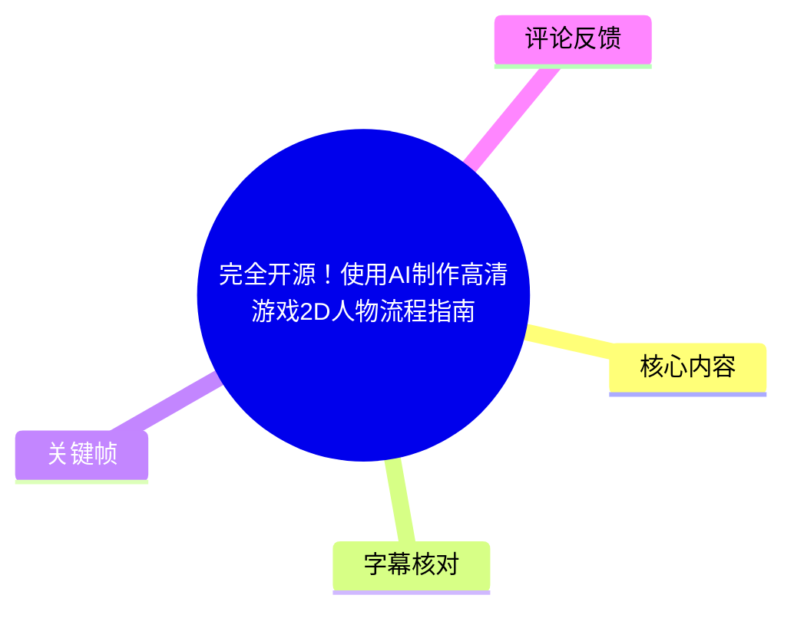
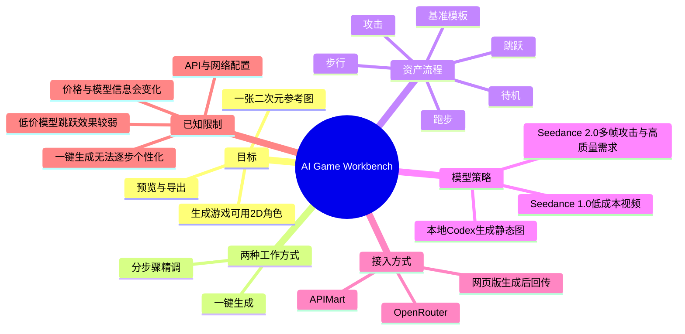
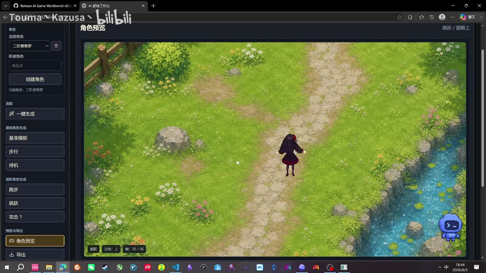
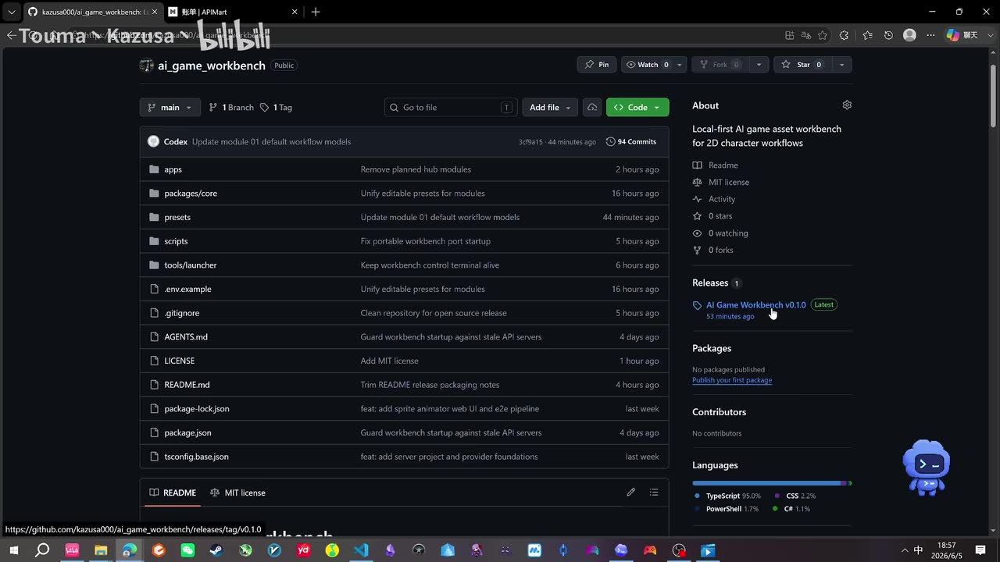
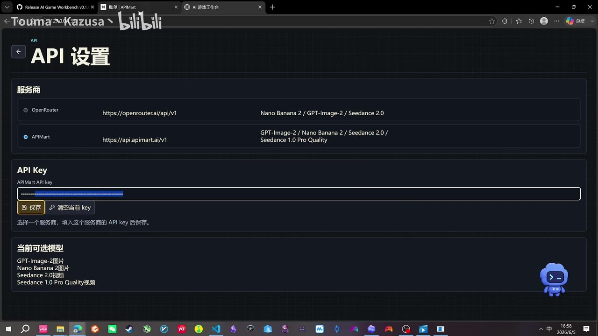
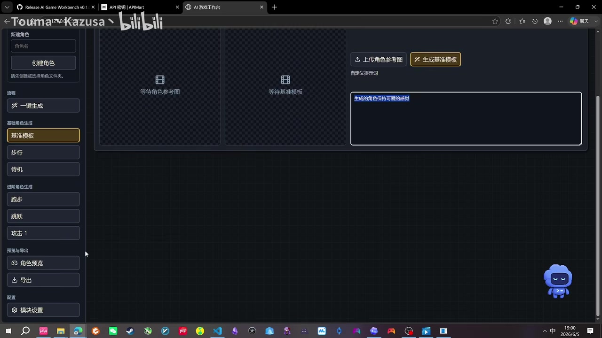

# 完全开源！使用AI制作高清游戏2D人物流程指南

> 来源：[Bilibili 视频](https://www.bilibili.com/video/BV1ro716kEEU) 
> UP 主：Touma丶Kazusa丶｜发布时间：2026-06-05｜视频时长：15:16｜合集：AIcode  
> 项目源码：`github.com/kazusa000/ai_game_workbench`  
> 解压即用包：`github.com/kazusa000/ai_game_workbench/releases/tag/v0.1.0`

## 小结

视频介绍并演示了开源项目 **AI Game Workbench**：从一张任意二次元人物参考图出发，生成可用于游戏的 2D 角色及其动画资产。工作台覆盖基准模板、步行、待机、跑步、跳跃、攻击等流程，并提供角色预览与导出入口。

本次相较 UP 主所说的上一期演示，已修复此前瑕疵并优化模型使用方案，因此决定开源。项目的核心价值不是单一模型，而是把“参考图—提示词—图像/视频生成—抽帧处理—游戏角色预览”串成可复用工作流；用户既可逐步骤精调，也可选择一键生成。

模型策略是视频最重要的经验：静态图或动画首帧优先可使用本地 Codex（视频称画质最高）；低成本的步行、待机、跑步、跳跃等视频任务可选 Seedance 1.0；需要同时利用首帧与中间帧的攻击动画，则必须使用 Seedance 2.0。UP 主明确展示了低价模型在跳跃效果上的不足。

工作流并不强制 API。视频给出 OpenRouter、APIMart 两种供应商入口，也说明可以把提示词和参考图复制到 Gemini 或 GPT 网页版生成，再将结果上传回工作台处理。因而“开源”指项目代码与流程开放，不等同于所有外部模型调用免费，也不意味着所有供应商、模型、价格长期可用。

适合有基础电脑操作能力、希望快速为独立游戏制作二次元 2D 角色资产的开发者。实际落地仍需要自行准备 API Key、处理生成失败、检查动作质量和角色风格；评论区已有用户反馈“基准模板/待机生成失败：fetch failed”，说明部署和网络/API 配置仍可能成为门槛。

视频中涉及的模型名称、供应商、价格及网页可用额度均是视频录制时的陈述，具有明显时效性。尤其是 API 中转服务、计费、模型能力和可用性可能随时变化，应以项目仓库与对应服务商的当前说明为准。

## 思维导图

## 目录

- [项目定位与成果预览](#项目定位与成果预览-000001)
- [获取、解压与启动工作台](#获取解压与启动工作台-000147)
- [API 设置、模型渠道与非 API 用法](#api-设置模型渠道与非-api-用法-000242)
- [分步制作：参考图、基准模板与步行](#分步制作参考图基准模板与步行-000434)
- [低成本动作制作：待机、跑步与跳跃](#低成本动作制作待机跑步与跳跃-000713)
- [攻击动画：中间帧与 Seedance 20 限制](#攻击动画中间帧与-seedance-20-限制-000943)
- [效果检查、角色预览与一键生成](#效果检查角色预览与一键生成-001043)
- [开源范围、后续方向与限制](#开源范围后续方向与限制-001342)
- [可复用操作清单](#可复用操作清单-000147)
- [参数、成本与限制汇总](#参数成本与限制汇总-000242)
- [字幕比对](#字幕比对)
- [评论分析](#评论分析)
- [处理记录](#处理记录)

## 项目定位与成果预览 [00:00:01](https://www.bilibili.com/video/BV1ro716kEEU?t=1)

UP 主说明，这个项目在上一支视频中已介绍过，但当时存在瑕疵，因此没有开源；本次修复问题并特别优化模型使用方式后，开放整个项目。

工作台的输入是“一张任意二次元人物图片”。视频强调参考图不必满足特别严格的条件，目标是产出一个能在游戏中使用的二次元小人角色。用户可通过自然语言和自定义提示词，对各步骤的动作形态、神态、风格及武器进行控制；例如步行的表现方式、待机、跑步与持剑等，都可在对应步骤调整。

流程提供两条路径：

1. **逐步骤生成**：对基准模板、动作首帧、视频生成、处理结果逐一调整，控制力更高。
2. **一键生成角色**：勾选跑步、攻击、跳跃等功能后统一生成，速度快，但不能逐步修改提示词或进行细粒度个性化。

视频最终展示的角色可在场景中移动，并具备动作预览能力。

> 图：该画面直接体现工作台不是单纯的文生图界面，而是将动作资产组织成角色，并在游戏场景中预览。它是理解“生成游戏可用 2D 角色”这一目标的关键视觉证据。

## 获取、解压与启动工作台 [00:01:47](https://www.bilibili.com/video/BV1ro716kEEU?t=107)

视频演示的获取路径是 GitHub 项目页中的 **AI Game Workbench**，然后进入 Release 下载。元数据中的视频简介给出了源码与解压即用包链接：

- 源码：`github.com/kazusa000/ai_game_workbench`
- Release：`github.com/kazusa000/ai_game_workbench/releases/tag/v0.1.0`

操作顺序如下：

1. 在项目 GitHub 页面找到发布版本并下载。
2. 将下载文件放到任意文件夹。
3. 解压压缩包。
4. 进入解压后的目录。
5. 点击其中的快捷方式直接启动。
6. 等待服务启动，再进入网页端进行后续设置。

视频未提供命令行安装、操作系统兼容性、依赖清单、端口号或启动脚本的文字细节，因此不能据此推断具体部署命令。其展示的是“解压即用”包的使用方式，而非从源码构建的完整步骤。

> 图：该关键帧证明视频操作以 GitHub 仓库和 Release 页面为入口，也与视频简介中给出的源码、解压即用包地址相互印证。

## API 设置、模型渠道与非 API 用法 [00:02:42](https://www.bilibili.com/video/BV1ro716kEEU?t=162)

服务启动后，视频先进入 **API 设置**。画面中展示了两个服务商选项：

- OpenRouter
- APIMart

视频称 API Key 会保存在网页端；这是 UP 主对该版本工作台行为的说明。录屏中还显示可选模型包括：

- GPT-Image-2
- Nano Banana 2
- Seedance 2.0
- Seedance 1.0 Pro Quality

UP 主建议使用 APIMart，给出的理由是 OpenRouter 按官方价计费、价格较高。视频中的价格表述应理解为录制时的个人经验，不宜视为当前报价：

| 项目 | 视频中的说法 | 需要注意的边界 |
| --- | --- | --- |
| GPT-Image-2，经 OpenRouter | 约 `0.2 美元/张` | 仅为 UP 主录制时举例，未展示官方计费页。 |
| GPT-Image-2，经 APIMart | 约 `0.01 美元/张` | UP 主明确称非广告，但这不是对服务稳定性、合法性或长期价格的保证。 |
| Nano Banana | 约 `0.03 美元` | ASR 专有名词存在识别误差，名称以界面“ Nano Banana 2 ”为参考。 |

使用 API 的操作是：在对应服务商处获取 API Key，复制到工作台输入框并保存。视频没有展示 Key 格式、权限范围、充值规则、余额不足时的行为或错误日志位置。

### 不使用 API 的替代办法 [00:03:51](https://www.bilibili.com/video/BV1ro716kEEU?t=231)

UP 主特别说明，API 只是为了让工作流更方便，并非必要条件。可采取以下替代路径：

1. 从工作台复制基准模板提示词、最终提示词与参考图。
2. 粘贴到 Gemini 或 GPT 网页版。
3. 在网页端生成图像。
4. 将生成后的图像上传回工作台，继续后续流程。

这种方式可能利用网页端提供的免费额度，但视频未保证额度存在、模型一致性或生成结果可复现。它的本质是把“模型生成”从工作台 API 调用中拆出去，再使用工作台的组织、处理和预览能力。

> 图：此画面用于核对视频中的服务商和模型名称，避免完全依赖 ASR 对英文专有名词的转写。

## 分步制作：参考图、基准模板与步行 [00:04:34](https://www.bilibili.com/video/BV1ro716kEEU?t=274)

### 1. 新建角色并上传角色参考图 [00:04:34](https://www.bilibili.com/video/BV1ro716kEEU?t=274)

进入工作台后，先创建角色文件夹/角色，再上传角色参考图。UP 主在演示中因没有先创建角色文件夹而无法上传，因此这里是明确的前置条件：

1. 新建角色。
2. 确认当前角色已建立。
3. 上传角色参考图。
4. 进入“基准模板”阶段。

该失误也说明工作台的素材归属依赖已创建的角色，而不是可直接对空项目上传。

> 图：该画面清楚显示角色创建、上传参考图、生成模板和自定义提示词四个关键入口，能解释上传失败为何与未创建角色有关。

### 2. 生成基准模板 [00:05:16](https://www.bilibili.com/video/BV1ro716kEEU?t=316)

基准模板由角色参考图生成。视频称这里有多个模型可选，并给出如下建议：

- 若本地有 **Codex**，优先选第一个选项，以调用本地 Codex 生成图片。
- UP 主主观评价本地 Codex 的图片质量最高。
- 后面的低价选项需要“一定抽卡”，即结果存在不稳定性、需要多次尝试的可能。

“Codex”在 ASR 中存在大小写和词形混乱；这里保留视频口述中的称呼，不能据此确认其具体产品版本、安装方式、接口协议或授权条件。

视频还提到，基准模板的提示词用于保留角色“可爱”的感觉。此类风格词会影响后续资产，不是无关紧要的装饰参数。

### 3. 生成步行动画素材 [00:05:56](https://www.bilibili.com/video/BV1ro716kEEU?t=356)

进入“步行”阶段后：

1. 设置步行使用的模型；演示中继续使用本地模型。
2. 保存设置。
3. 生成步行素材。
4. 如对步行节奏、性格、幅度有要求，在自定义提示词中追加要求。
5. 生成后上传/提交视频任务，等待后续处理。

UP 主没有为演示中的步行输入额外提示词，因此得到的是“比较普通”的步行输出。这是一个可迁移的经验：默认生成不是最终动作设计，节奏、幅度、角色性格应在动作阶段明确写入提示词。

## 低成本动作制作：待机、跑步与跳跃 [00:07:13](https://www.bilibili.com/video/BV1ro716kEEU?t=433)

### Seedance 1.0 的成本策略 [00:06:21](https://www.bilibili.com/video/BV1ro716kEEU?t=381)

视频把 Seedance 1.0 作为低成本视频生成方案，用于步行、跑步与跳跃等动作。UP 主口述的关键参数/成本如下：

| 参数或比较项 | 视频陈述 |
| --- | --- |
| 模型 | Seedance 1.0 |
| 单次调用成本 | 约 `8 美分` |
| 用途举例 | 一个角色的四向走路动画 |
| 视频长度 | 只需生成约 `2 秒` |
| 分辨率 | ASR 识别为“710p”，该值可能存在识别误差，无法仅凭素材确认具体标准分辨率 |
| 与 Seedance 2.0 对比 | 视频称 2.0 单次约 `0.6 美元`、约 `4 元人民币`，成本差距大 |

这里的“8 美分生成四向走路动画”是 UP 主的演示性说法，不能自动推导为每个角色、每次请求都固定为该价格。成本还会受供应商、计费规则、时长、分辨率、重试次数和模型版本影响。

### 待机、跑步的并行操作 [00:07:13](https://www.bilibili.com/video/BV1ro716kEEU?t=433)

提交步行视频任务后，工作台进入轮询等待。等待期间可并行推进其他资产：

1. 设置待机模型，演示中仍设为本地模型。
2. 生成待机。
3. 设置跑步首帧，演示中设为本地 Codex。
4. 生成跑步首帧。
5. 对已完成的待机和步行执行“一键处理”。
6. 选择跑步视频模型，演示选择 Seedance 1.0。
7. 提交跑步视频任务并等待。

这种并行排程可以减少等待时间：静态帧的生成、已完成视频的处理与尚在轮询的视频任务同时进行。不过视频没有给出队列管理、失败重试或任务取消的具体机制。

### 跳跃的构图前处理 [00:08:20](https://www.bilibili.com/video/BV1ro716kEEU?t=500)

跳跃不是直接使用原始人物图。UP 主先制作跳跃首帧，并强调要**缩放人物**，留出垂直运动空间。

原因是：如果人物在图中占得太高、脚部紧贴边缘，模型生成跳跃时缺少空间，可能出现脚部相撞、动作受限等问题。视频因此建议：

1. 制作跳跃首帧。
2. 缩小人物，使画面上下保留可跳跃空间。
3. 设置跳跃视频模型。
4. 使用 Seedance 1.0 可完成低成本跳跃。
5. 需要更好质量或更强指令遵循时，改用 Seedance 2.0。

这一经验可概括为：**视频生成前先为动作方向预留画幅，而非仅依赖提示词弥补构图问题。**

### 使用官方网页生成后回传 [00:08:49](https://www.bilibili.com/video/BV1ro716kEEU?t=529)

若用户拥有 Seedance 2.0 官方会员、每日积分或其他可用额度，可不通过工作台 API：

1. 复制跳跃首帧。
2. 复制工作台中的对应提示词。
3. 到 Seedance 官方页面生成视频。
4. 将生成的视频传回工作台。
5. 在工作台执行一键处理。

这再次表明工作台的流程可与外部生成渠道解耦，但前提是生成结果的格式与工作台上传/处理步骤兼容；视频未展示具体文件格式与限制。

## 攻击动画：中间帧与 Seedance 2.0 限制 [00:09:43](https://www.bilibili.com/video/BV1ro716kEEU?t=583)

攻击动画的流程与步行、跑步、跳跃不同。UP 主以“长剑刺击”为例，需要准备攻击的起始帧及中间帧，并对角色进行缩放，确保攻击动作有足够空间。

步骤为：

1. 准备攻击起始帧。
2. 准备攻击中间帧。
3. 对人物缩放，为挥砍/刺击预留空间。
4. 生成攻击中间帧。
5. 在界面中查看该视频任务的提示词。
6. 使用 Seedance 2.0 提交视频任务。
7. 等待生成完成后执行一键处理。
8. 抽帧为 24 帧并检查攻击效果。

### 为什么攻击必须用 Seedance 2.0？ [00:10:16](https://www.bilibili.com/video/BV1ro716kEEU?t=616)

视频给出的明确限制是：攻击动画不只上传首帧，还要上传中间帧；**Seedance 1.0 无法完成这一任务**，因此攻击必须使用 Seedance 2.0。

这是模型选择的功能性差异，而不是单纯的质量偏好：

| 动作类型 | 视频中的推荐/限制 | 原因 |
| --- | --- | --- |
| 步行、跑步、跳跃 | Seedance 1.0 可用 | 可降低成本，部分动作可接受其效果。 |
| 高质量或指令遵循要求更高的跳跃 | 可考虑 Seedance 2.0 | 视频称其质量和指令遵循更好。 |
| 攻击 | 必须 Seedance 2.0 | 任务需要首帧加中间帧，视频称 1.0 不支持。 |

在生成过程中，UP 主同时处理已完成的跑步与跳跃任务；当攻击视频完成后，认为 Seedance 2.0 的攻击结果“稳定”，并进行一键处理。

## 效果检查、角色预览与一键生成 [00:10:43](https://www.bilibili.com/video/BV1ro716kEEU?t=643)

### 检查处理结果 [00:10:43](https://www.bilibili.com/video/BV1ro716kEEU?t=643)

视频在待机、步行、跑步、跳跃、攻击逐项生成并处理后，对结果进行检查：

- 待机需调整尺寸，否则看起来过大。
- 跑步和跳跃在处理完成前不可用。
- 攻击处理完毕后，视频称抽成 **24 帧** 并检查效果。
- 最终角色能够攻击和跳跃。

### 低成本模型的具体问题 [00:11:32](https://www.bilibili.com/video/BV1ro716kEEU?t=692)

UP 主对跳跃效果的评价是：跳跃距离“有点问题”，使用便宜视频模型的结果不够好。若想提升效果，可使用 Seedance 2.0；但视频称单个视频约需 4 元人民币，因此 UP 主基于预算仍使用 Seedance 1.0，并承认效果较差一些。

这段演示提供了重要的取舍原则：

- **成本优先**：Seedance 1.0 可快速低价完成大部分动作，但不应假定所有动作均达到可直接商用的质量。
- **质量/指令遵循优先**：Seedance 2.0 更适合关键动作，代价是更高成本。
- **最终验收不可省略**：需在抽帧、角色预览和场景测试后确认动作问题，而不是只看视频生成成功状态。

### 一键生成角色 [00:12:28](https://www.bilibili.com/video/BV1ro716kEEU?t=748)

完成分步演示后，UP 主展示一键生成：

1. 新建角色。
2. 上传参考图。
3. 选择要生成的能力；演示中仅选择步行和待机。
4. 如有需要，也可勾选跑步、攻击、跳跃。
5. 点击“一键生成角色”。
6. 等待完整角色生成。

一键生成的优缺点非常明确：

| 维度 | 表现 |
| --- | --- |
| 优点 | 流程简短，适合不想逐步制作的用户。 |
| 缺点 | 不能对每一步提示词进行调整，个性化控制较弱。 |
| 视频中的时长经验 | UP 主称约半小时可以完成，但这不是性能承诺。 |
| 实例问题 | 演示忘记去掉“可爱”相关要求，导致角色风格过于可爱。 |

最后一个问题说明，一键生成并没有消除提示词设计的重要性：上游风格词会贯穿产物，若未在正确阶段移除，最终角色可能偏离预期。

> 图：该画面适合用于动作验收说明。视频的结论不是“生成完成即结束”，而是要在角色预览场景中确认角色的移动与动作表现。

## 开源范围、后续方向与限制 [00:13:42](https://www.bilibili.com/video/BV1ro716kEEU?t=822)

UP 主总结称，整个项目完全开源，用户可自行开发，或借鉴其中的提示词和参考图。视频再次强调，没有必要强制使用工作台中配置的 API；它主要提供流程整合。

UP 主邀请用户通过 issue、fork、私信或评论反馈问题。由于 ASR 对“issue”“fork”等英文词识别不稳定，采用上下文校正；视频原意是鼓励通过开源协作和社区渠道提出问题。

### 已提及但未展开演示的方向 [00:14:06](https://www.bilibili.com/video/BV1ro716kEEU?t=846)

视频提到另一个方向：可让待机、步行等做得更好，且“只需要用到渲染软件”；但 UP 主没有演示具体方案，也没有给出软件名称、配置、输出质量或与当前工作流的集成方式。UP 主认为已有不少人在做该方向，因此可能不会投入很多开发；感兴趣者可基于开源项目继续探索。

### 后续产品规划 [00:14:46](https://www.bilibili.com/video/BV1ro716kEEU?t=886)

UP 主表示自己也在做游戏，未来会把游戏开发中遇到的问题用 AI 寻找解决方式，再整合进 AI 游戏工作台。当前模块源于“如何快速制作 2D 角色”的实际需求；未来可能添加用于处理游戏制作问题的新模块。

这属于未来计划，而非已经交付的功能。当前视频能确认的是 2D 角色工作流及其现有动作模块，不能据此推断其他模块的上线时间或功能范围。

## 可复用操作清单 [00:01:47](https://www.bilibili.com/video/BV1ro716kEEU?t=107)

以下清单按视频的实际操作顺序整理，便于复现：

1. 从 GitHub Release 下载解压即用包，解压后通过快捷方式启动。
2. 等待服务启动，进入 API 设置。
3. 选择 OpenRouter 或 APIMart，并填写、保存 API Key；或准备采用外部网页端生成方案。
4. 新建角色文件夹/角色。
5. 上传二次元人物参考图。
6. 在“基准模板”中设置模型和风格提示词，生成基准模板。
7. 在“步行”中设置模型；如需特殊节奏、幅度、性格，写入自定义提示词。
8. 生成步行素材，提交视频任务。
9. 在轮询等待时并行生成待机与跑步首帧。
10. 对已完成的待机、步行进行一键处理；提交跑步视频任务。
11. 为跳跃制作经过缩放的首帧，确保人物上下留有动作空间；生成并提交跳跃视频。
12. 为攻击准备起始帧和中间帧；选择 Seedance 2.0，生成攻击视频。
13. 对跑步、跳跃、攻击结果依次一键处理。
14. 将攻击结果抽为 24 帧，检查待机尺寸、跳跃距离、攻击连贯性等问题。
15. 在角色预览中测试移动、跳跃、攻击。
16. 若追求快速产出，可改用“一键生成角色”；但仍要检查提示词是否残留不需要的风格要求。
17. 通过工作台导出入口输出资产；视频未展示导出格式、目录结构或游戏引擎导入步骤，需要以项目文档为准。

## 参数、成本与限制汇总 [00:02:42](https://www.bilibili.com/video/BV1ro716kEEU?t=162)

| 类别 | 视频中出现的信息 | 实践含义与限制 |
| --- | --- | --- |
| 输入 | 一张任意二次元人物参考图 | 视频未规定图片尺寸、透明背景、姿态或版权要求。 |
| 静态图模型 | 本地 Codex 被推荐为质量最高 | 属于 UP 主经验；未说明本地环境安装方法。 |
| 低成本视频模型 | Seedance 1.0 | 适合步行、跑步、跳跃等；跳跃效果可能欠佳。 |
| 高质量/多帧视频模型 | Seedance 2.0 | 指令遵循和质量更好；攻击的首帧+中间帧任务必须使用它。 |
| 跳跃构图 | 需缩小人物 | 为垂直动作预留画面空间，避免脚部碰撞或跳跃受限。 |
| 攻击构图 | 需准备中间帧并缩放人物 | 为攻击动作留空间；1.0 不支持该多帧输入任务。 |
| 抽帧 | 攻击演示处理为 24 帧 | 可作为视频中的处理实例，不能外推为全部动作固定帧数。 |
| API 渠道 | OpenRouter、APIMart | 录屏中出现；实际可用性、合规性、价格及模型列表均可能改变。 |
| 外部生成替代 | Gemini、GPT 网页版、Seedance 官方页面 | 可减少工作台 API 依赖，但不保证免费额度、格式兼容性或结果一致。 |
| 一键生成 | 可勾选动作统一生成 | 快但不可逐步调提示词；不适合需要精确动作控制的场景。 |
| 已知故障风险 | 生成可能失败；评论有 `fetch failed` 反馈 | 视频未给出日志位置和排障流程，需查项目 issue、浏览器网络请求及服务商配置。 |

## 字幕比对

| 字幕来源 | 完整性 | 专有名词 | 时间轴 | 主要问题 |
| --- | --- | --- | --- | --- |
| Bilibili 站内字幕 `p01-ai-zh.srt` | 不可用于本视频；仅覆盖约 00:00–05:35，且内容是手办开箱 | 与本视频完全不符，出现“69”“手办”“白河月爱”等内容 | 时间码本身完整，但对应另一段内容 | 标题、主题、人物和时长均与本视频不一致，属于错配字幕。 |
| 本次 ASR `medium` | 较完整；60 段，语音覆盖约 796.6 秒，占视频 87.04% | 英文模型/服务名存在多处误识别，如 `OpenRooter`、`APM Art`、`Seedowns/Seedwns`、`Code X` | 有真实时间戳；首段 00:00:01.390，末段 00:15:14.800 | 若干长段无断句；存在约 10–17 秒空档；部分价格、分辨率与专有名词需结合画面谨慎转写。 |

### 最终字幕选择与校正原则

本视频最终以**本次 ASR 时间轴字幕**作为正文时间定位依据。原因是站内字幕虽然有时间码，但内容明显是另一支手办开箱视频，不能用于本视频的事实提取或时间轴链接。

已检查 ASR 诊断：素材提供的 `asr-result.json` **未标记 `noAudioStream=true`**；相反，诊断确认音频时长约 915.18 秒、识别语言为中文、语言置信度约 0.9976。因此本视频有音轨，站内字幕错配不是“无音轨”造成的，正文未将其归因于工具失败。

结合关键帧和上下文进行的必要校正如下：

- `OpenRooter`：按 API 设置画面校正为 **OpenRouter**。
- `APM Art / APM 要`：按 API 设置画面校正为 **APIMart**。
- `Seedowns / Seedwns / Seedence`：正文统一写作 **Seedance**；界面显示为 Seedance 1.0、Seedance 2.0。
- `Code X`：正文保留为 **Codex**，但不进一步推断其具体模型版本或运行方式。
- `710p`：ASR 可能有误识别，素材不足以确认准确分辨率，因此仅标注为 ASR 识别结果，不把它写成确定参数。
- `easier / fog`：结合开源项目语境校正为 **issue / fork**，但不将其扩展为仓库已验证的协作规范。

## 评论分析

可获取热评少于三条：素材中仅返回 2 条，因此只分析这 2 条，不补造第三条。

### 1. `何世wow`：基准模板/待机生成失败，报错为 `fetch failed`

- 点赞数：6
- 评论内容：API 已填写，但基准模板/待机生成失败；没有日志和明确报错，不知道问题所在。
- 反映的问题：实际使用中，API Key 填写成功不等于请求一定成功。问题可能涉及网络、API 端点、服务商余额/权限、浏览器跨域、后端服务、模型可用性或工作台错误处理。
- 对视频的补充：视频重点演示正常流程，未展示失败后的日志位置、网络调试或重试策略；该评论指出产品可观测性和错误提示仍是关键体验缺口。
- 可信度边界：这是单个用户的故障反馈，未提供浏览器控制台、请求状态码、版本号或复现步骤，不能据此确定根因，也不能证明该问题普遍存在。

### 2. `Evanger`：希望支持 8 方向或像素小人 8 方向

- 点赞数：5
- 评论内容：询问是否考虑支持 8 方向，以及像素小人的 8 方向功能。
- 反映的需求：当前视频重点展示四向走路以及待机、跑步、跳跃、攻击等动作；对于俯视角 RPG、像素游戏或更精细方向控制，8 方向角色资产是实际需求。
- 对项目的启示：若要支持 8 方向，不仅要增加生成数量，还要处理方向一致性、动作循环衔接、武器朝向、像素风格一致性和导出命名规范。
- 可信度边界：这是功能建议，不代表项目当前已支持，也不代表 UP 主承诺开发。

## 处理记录

- Worker ID：`worker-mrj0www4-e8d79408`
- 模型：`gpt-5.6-terra`
- 调用工具与素材：视频元数据、关键帧、站内 SRT、ASR SRT、`asr-result.json` 诊断结果、热评 JSON。
- 使用的应用工具：素材采集流程已产出 `merged.mp4`、`audio/audio.wav`、`frames/`、`asr/`、`subtitles/` 与 `comments/`；本整理基于这些已提供产物完成，未执行额外外部检索。
- 字幕选择：检查了站内字幕与本次 ASR。站内字幕内容错配为手办开箱，弃用；采用有真实时间戳的本次 ASR 作为时间轴依据，并用关键帧校正少量英文专有名词。
- 音轨判断：ASR 结果未标记 `noAudioStream=true`，且有约 915 秒音频分析结果；因此按“有音轨”处理。
- 关键帧选择依据：  
  - `frames/frame-001.jpg`：展示角色预览、动作入口和场景测试，支撑项目最终产物说明。  
  - `frames/frame-002.jpg`：展示 GitHub 仓库与 Release，支撑获取路径说明。  
  - `frames/frame-003.jpg`：展示 OpenRouter、APIMart 与可选模型，支撑 API 设置和专有名词校正。  
  - `frames/frame-004.jpg`：展示角色创建、上传参考图、基准模板与提示词入口，支撑前置步骤与上传失败案例说明。  
- 缓存清理：未执行缓存清理；本次仅使用任务提供的既有素材清单，未生成需要额外删除的中间缓存。
- 未解决问题：  
  1. 视频未提供源码构建、端口、系统要求、导出格式和引擎导入步骤。  
  2. 站内字幕为什么错配无法从现有素材确定。  
  3. `fetch failed` 的具体根因、工作台日志位置与故障恢复策略未在视频中展示。  
  4. 视频中的模型价格、供应商能力及可用额度均需以当前官方/项目页面为准。
