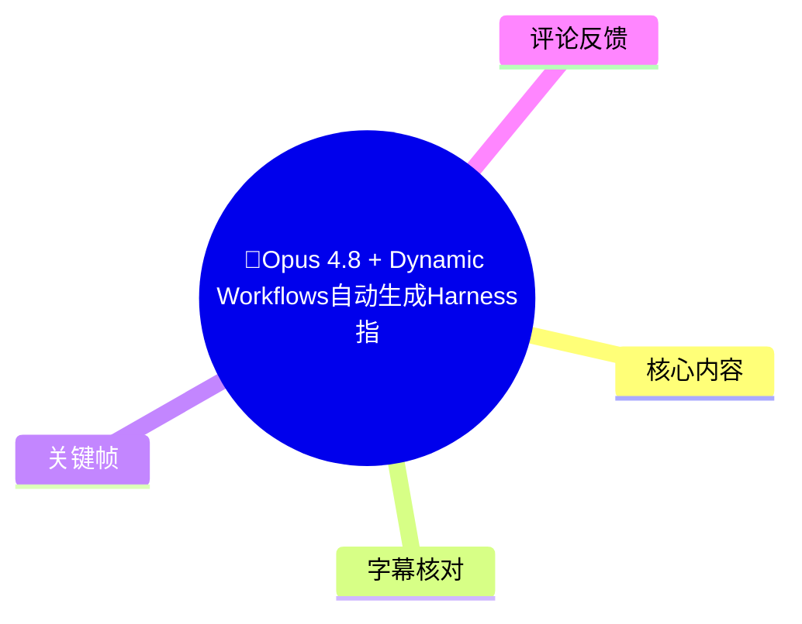
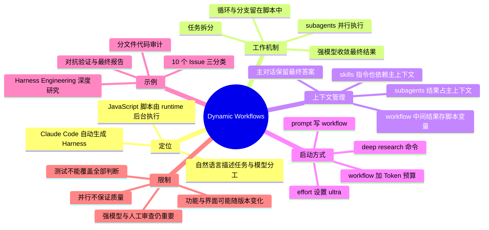
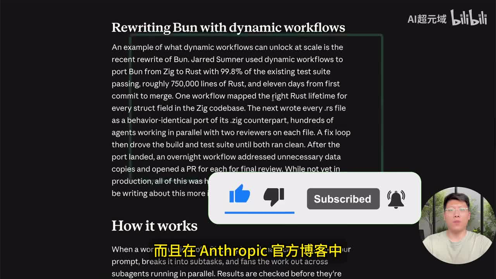
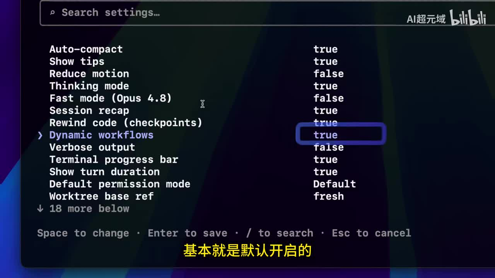
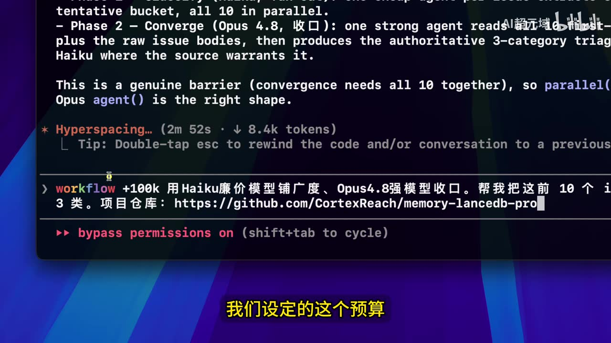
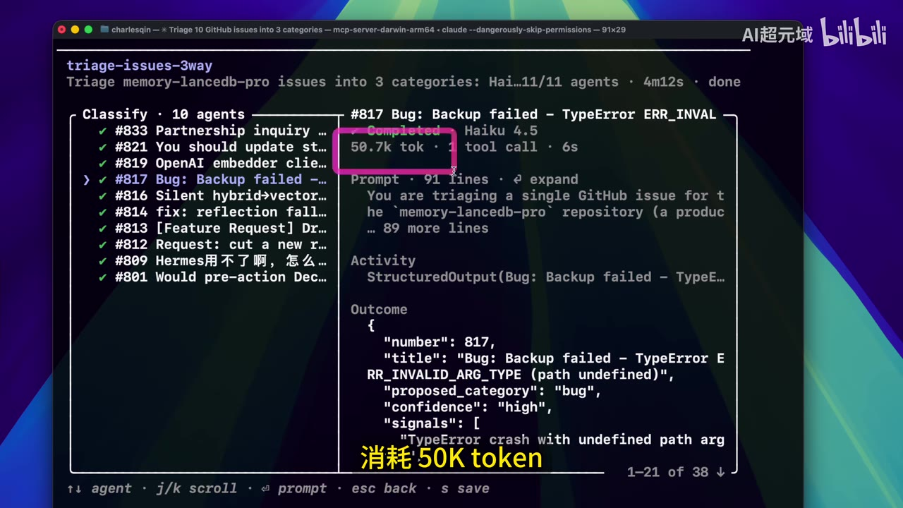

# 🚀Opus 4.8 + Dynamic Workflows自动生成Harness指挥上百个subagents并行工作，Claude Code开发效率倍增！

> 来源：[Bilibili 视频](https://www.bilibili.com/video/BV1MxVY6rELF)<br>
> UP 主：AI超元域｜时长：13 分 03 秒｜合集：AIcode  
> 主题：Claude Code 的 Dynamic Workflows（动态工作流）如何由自然语言任务自动生成 JavaScript 工作流脚本，在后台编排大量 subagents，并以廉价模型做并行广度处理、强模型做收敛与最终判断。

## 小结

视频介绍了 Anthropic/Claude Code 中被正式命名为 **Dynamic Workflows（动态工作流）** 的能力。UP 主的核心观点是：开发者不必手写复杂的 Harness（编排框架），而是可以直接用自然语言描述目标、阶段划分、模型分工和预算，由 Claude Code 自动生成并在运行时执行 JavaScript 工作流脚本。

该机制的关键不只是“多 Agent 并行”，而是将循环、分支、任务队列和中间结果放在后台脚本及变量中运行；Claude Code 主对话上下文理论上只接收最终结果。视频将此与普通 subagents、skills 对比，认为后两者的过程产物会持续占用主上下文，而 Dynamic Workflows 更适于大规模任务编排。

实操上，视频展示了三类入口：在提示词中显式写入 `workflow`、将 effort 调为 `ultra` 让系统按复杂度自主决定是否启用、以及通过内置 deep research 命令触发。最新界面中可在 `/config` 检查 `Dynamic workflows = true`，并通过 `/workflows` 查看阶段、Agent 状态、Token 消耗和输出。

视频给出的典型模型分工是：**Haiku 4.5 等低成本模型负责大规模并行、文件级排查或初筛；Opus 4.8 等强模型负责 converge（收敛）、综合与最终报告**。示例包括：将 10 个 GitHub Issues 分为三类、对 Harness Engineering 开展多阶段研究，以及按文件并行找 Bug、再进行多 Agent 对抗验证、最后由强模型汇总的代码审计。

需要区分演示结果与已独立验证的结论。视频转述官方案例：Bun 从 Zig 移植至 Rust，约 75 万行 Rust、现有测试套件 99.8% 通过、首次提交至合并约 11 天；这些数值在画面中可见，但本文未额外访问官方原文核验。视频所称“最多可编排上千 subagents”“单次最多并发 16 个”等，均按视频讲解记录，不应直接外推为所有账户、版本、套餐或运行环境的固定上限。

这套方法适合代码库级 Bug 排查、大规模迁移、框架替换、多来源交叉研究和多角度压测等单 Agent 难以一次完成、单一对话难以协调大量 Agent 的任务。它不等于质量自动得到保证：并行规模、测试覆盖、模型投票和最终收敛都不能替代对需求方向、架构决策、测试盲区及安全风险的人工审查。

## 思维导图





## 目录

- [新闻背景与官方案例](#新闻背景与官方案例)
- [新版启用方式与基础演示](#新版启用方式与基础演示)
- [核心原理：自动生成 Harness 与后台运行](#核心原理自动生成-harness-与后台运行)
- [Dynamic Workflows、subagents 与 skills 的区别](#dynamic-workflowssubagents-与-skills-的区别)
- [适用场景、规模与并发参数](#适用场景规模与并发参数)
- [启动入口与状态查看](#启动入口与状态查看)
- [深度研究工作流演示](#深度研究工作流演示)
- [代码审计工作流、停止与脚本复用](#代码审计工作流停止与脚本复用)
- [实践步骤与提示词结构](#实践步骤与提示词结构)
- [结论、限制与时效性](#结论限制与时效性)
- [字幕比对](#字幕比对)
- [评论分析](#评论分析)
- [处理记录](#处理记录)

## 新闻背景与官方案例 [00:02](https://www.bilibili.com/video/BV1MxVY6rELF?t=2)

视频开头称 Anthropic 发布了 **Claude Opus 4.8**，并在官方博客、官方文档中将此前演示过的 Claude Code Workflow 功能正式命名为 **Dynamic Workflows**。本视频基于该发布背景继续讲解其高级用法。

UP 主将其描述为 AI 编程进入新阶段的一项能力，原因在于它试图降低 Harness Engineering 的使用门槛：过去需要开发者自行设计任务图、调度规则、并发策略和收敛逻辑；现在可让 Claude Code 从自然语言任务说明中生成工作流脚本。

视频转述并展示了一段官方博客案例：

- 使用 Dynamic Workflows 将 **Bun 从 Zig 移植至 Rust**；
- 现有测试套件的通过率为 **99.8%**；
- 代码规模约 **75 万行 Rust**；
- 从首次提交到合并用时约 **11 天**；
- 画面文字还说明：一个工作流负责为 Zig 代码库中的每个 `struct` 字段映射合适的 Rust 生命周期；后续工作流编写对应 `.rs` 文件；数百个 Agent 并行工作，并对每个文件设置两位审查者；通过修复循环推进构建和测试套件至通过。



> 图：画面展示题为 “Rewriting Bun with dynamic workflows” 的英文官方案例文字，包含“99.8% 测试通过、约 750,000 行 Rust、11 天”等关键数值。这是视频中关于规模化成果的直接画面依据；但其仍属于视频转述的官方案例，未在本任务中独立复核原始链接与具体工程条件。

### 对案例的理解边界

案例反映的是工作流对任务拆解、并行执行、测试与修复循环的支持，不应简单理解为“只要启用 Workflow 就能在 11 天完成任意大型迁移”。实际完成度仍会受以下因素影响：

- 原项目与目标语言的复杂度；
- 测试套件质量、覆盖范围与可执行性；
- 任务的拆分准确度；
- 代码审查与最终验收标准；
- 模型版本、可用工具、账户限额、运行环境及人工介入程度。

## 新版启用方式与基础演示 [00:50](https://www.bilibili.com/video/BV1MxVY6rELF?t=50)

视频说明，早期版本中需要通过设置环境变量开启 Dynamic Workflows；在视频所示的 Claude Code 新版中，UP 主通过配置界面检查开关，认为该能力“基本默认开启”。

操作过程如下：

1. 输入 `/config` 并按 Enter。
2. 在配置列表中使用方向键找到 `Dynamic workflows`。
3. 检查对应值是否为 `true`。
4. 在提示输入区域键入 `workflow`；当该关键词显示为彩色时，视频将其视为已被 Claude Code 正确识别为工作流入口。



> 图：配置页清晰显示 `Dynamic workflows` 对应值为 `true`，并列出 Auto-compact、Thinking mode、Fast mode (Opus 4.8) 等其他选项。该画面直接支持“视频演示环境中该开关已启用”的表述，但不能据此断言所有用户版本均默认开启。

### Issue 分类示例：廉价模型并行，强模型收口

视频以一个开源项目仓库为例，让 Claude Code：

- 使用 **Haiku** 廉价模型扩大处理广度；
- 使用 **Opus 4.8** 强模型完成收敛；
- 将该仓库前 10 个 GitHub Issues 分成三类。

ASR 对模型名存在明显音译误识别，如“high-cool”“Obs”，但关键帧中的提示词和界面文字显示为 **Haiku** 与 **Opus 4.8**，本文据此校正。

视频还指出，旧版提示形式似乎是另一个类似 `ultra work` 的表达，而新版以 `workflow` 作为显式关键词；由于 ASR 对这部分英文命令识别不稳定，不能据此还原旧版命令的精确拼写。

### Token 预算示例

UP 主继续展示了带预算的提示写法：

```text
workflow +100k 用 Haiku 廉价模型铺广度、Opus 4.8 强模型收口。
帮我把这前 10 个 issue 分成 3 类。
项目仓库：<仓库 URL>
```

其中：

- `workflow`：明确要求启动工作流；
- `+100k`：视频演示中作为 Token 预算约束；
- “Haiku 铺广度、Opus 4.8 收口”：指定模型角色；
- 后续自然语言：定义任务对象与交付格式。



> 图：终端输入区可见 `workflow +100k`、Haiku 扩展广度、Opus 4.8 收口以及 GitHub 仓库地址。它说明视频中确实用自然语言指定了预算和模型分工；但“100k”具体对应输入、输出或总 Token 的计费/限制方式，应以当时 Claude Code 实际文档与界面为准。

## 核心原理：自动生成 Harness 与后台运行 [04:25](https://www.bilibili.com/video/BV1MxVY6rELF?t=265)

视频将 Dynamic Workflows 概括为：

> 由 Claude Code 编写的 JavaScript 脚本，交由 runtime 在后台独立运行。

其工作链路可按视频说明整理为：

1. 用户用自然语言描述目标、分工、预算或验证方式。
2. Claude Code 根据任务描述生成 JavaScript 工作流脚本。
3. runtime 在后台执行该脚本。
4. 脚本拆分任务，组织几十、数百，甚至视频口述所称“上千”的 subagents。
5. subagents 可并行执行，也可被安排进行对抗验证。
6. 工作流将关键结果返回 Claude Code，由其输出最终答案或报告。

视频强调的设计变化是：**把计划从对话中搬到代码中**。也就是说，原先由主对话反复决定“下一步该找哪个 Agent、读哪份结果、是否重试”的过程，改由生成出来的工作流脚本管理。

### Harness 的新形态

UP 主将传统 Harness 与该模式进行如下区分：

| 维度 | 传统 Harness | 视频所述 Dynamic Workflows |
| --- | --- | --- |
| 编写者 | 开发者手写 | Claude Code 根据任务生成 |
| 编排依据 | 人工定义任务图与调度逻辑 | 自然语言要求转化为脚本 |
| 运行形态 | 自建或手工维护流程 | runtime 后台运行 JavaScript 脚本 |
| 可复用方式 | 人工沉淀脚本/框架 | 可保存模型生成的 Workflow 脚本 |
| 人的角色 | 设计、编写、维护 | 描述任务、筛选、保存、复用 |

视频的判断是：这降低甚至“抹平”了 Harness 技术门槛。更严谨地说，它降低了**初始脚本编写与任务编排的门槛**，但不会消除需求定义、风险控制、质量标准、测试设计及生产环境责任等工程门槛。

## Dynamic Workflows、subagents 与 skills 的区别 [06:49](https://www.bilibili.com/video/BV1MxVY6rELF?t=409)

视频针对“skill 是否可以替代 workflow”的讨论给出明确立场：两者不等价，原因集中在**谁决定下一步**、**中间结果存在哪里**以及**主上下文如何增长**。

| 对象 | 视频中的本质描述 | 下一步由谁决定 | 结果如何影响主上下文 |
| --- | --- | --- | --- |
| subagents | Claude Code 派生出的 worker | Claude Code | 结果进入并占用 Claude Code 上下文 |
| skills | Claude Code 遵循的指令/提示规范 | Claude Code 按 prompt 决定 | 同样会占用 Claude Code 上下文 |
| Dynamic Workflows | runtime 执行的脚本 | 脚本 | 中间结果存入脚本变量，主上下文主要保留最终答案 |

视频认为，subagents 和 skills 在大规模、多轮任务下的共同问题是：过程结果不断回流至主对话上下文，导致上下文越跑越长。Dynamic Workflows 则把：

- 循环；
- 条件分支；
- 中间变量；
- 并行任务状态；
- 部分过程结果；

交给后台脚本处理，从而降低主对话的上下文占用。

### 需要保留的技术限定

“中间结果保存在脚本变量、主上下文只留最终答案”是视频对机制的概括，不应理解为系统永远不向模型提供任何中间信息。工作流能否可靠收敛，仍取决于脚本实际传递了哪些摘要、证据、结构化输出与验证结论。若脚本将错误摘要或有偏见的结果送入收敛阶段，最终输出仍可能继承问题。

## 适用场景、规模与并发参数 [06:01](https://www.bilibili.com/video/BV1MxVY6rELF?t=361)

视频建议在以下情况下使用 Dynamic Workflows：

1. **单 Agent 无法一次完成的任务**：任务范围大、依赖多或需要多轮验证。
2. **一个主对话难以协调大量 Agent 的任务**：需要批量分片、并行和统一汇总。
3. **代码库级 Bug 排查**：按模块或按文件同时检查。
4. **大规模迁移**：视频举例为改动超过 500 个文件。
5. **框架替换**：涉及大量调用点、兼容性与回归验证。
6. **交叉验证研究**：对多个来源进行相互验证。
7. **多角度压测或方案比较**：让不同 Agent 在不同假设下独立处理，再进行收敛。

视频称，这类工作流有机会把原本需要一个季度或数个季度的任务压缩至一天或数天。该说法是 UP 主的效率判断，不构成一般性工期承诺。

### 视频提及的并发规模

视频说明：

- 工作流可编排几十、数百，甚至“上千”个 subagents；
- 单个时刻最多有 **16 个 subagents 并行运行**；
- 在深度研究演示中，某一验证阶段编排了 **75 个 agents**，其中画面/讲解称当时并发运行 **10 个**，其他在队列中；
- Issue 分类演示总共使用 **11 个 agents**：10 个廉价模型 Agent + 1 个 Opus 4.8 Agent。

这些数值应视为视频演示版本及其运行环境中的观察或讲解参数，而不是通用服务规格。并发配额还可能受产品版本、账户权限、资源调度、模型可用性、任务结构和平台限制影响。

## 启动入口与状态查看 [08:02](https://www.bilibili.com/video/BV1MxVY6rELF?t=482)

视频介绍三种启动途径。

### 方式一：在提示词中显式使用 `workflow`

直接在输入中加入 `workflow`。视频以关键词在界面中“变彩色”作为能够正确调用 Dynamic Workflows 的视觉信号。

适合已经明确需要工作流的情况，尤其是要明确指定：

- 使用哪些模型；
- 哪些阶段并行；
- 是否进行对抗验证；
- 最终由哪个模型汇总；
- Token 预算上限。

### 方式二：设置 effort 为 `ultra`

视频说明可通过 `/effort` 将 effort 调整到 `ultra`，再自然语言描述任务。此时 Claude Code 会根据任务复杂度，智能判断是否使用 Workflow。

由于 ASR 将命令附近的英文识别为“ultra code/ultra work”等不稳定文本，本文仅保留视频最清楚表达的意图：**通过 `/effort` 选择 ultra 级别，让系统按复杂度决定是否启用 Workflow**；精确命令参数拼写需以实际客户端帮助信息为准。

### 方式三：使用内置 deep research 命令

视频还展示了 Claude Code 的 deep research 内置命令。输入后，界面出现 Dynamic Workflow，用户可在其后追加研究主题，例如 `Harness Engineering`。系统接着提供研究选项，演示中选择：

1. `AI agent 和 harness` 方向；
2. 第一个“全面、综合性研究”选项。

### 通过 `/workflows` 查看进度

工作流启动后，视频使用 `/workflows` 查看状态。界面可展示：

- 多个阶段；
- 当前正在执行的阶段；
- 每一阶段的 Agent 数；
- 单个 Agent 的完成状态；
- 所用模型；
- Token 消耗；
- 工具调用情况；
- prompt 内容；
- Agent 输出；
- 总耗时与总体 Token 使用情况。



> 图：状态页左侧列出 10 个分类 Agent，右侧展示所选 Agent 的模型、约 50.7k Token、工具调用、Prompt 与结构化输出。它有助于理解 `/workflows` 不只是显示“是否完成”，还可用于定位单个 Agent 的执行状态与产物。

## 深度研究工作流演示 [09:11](https://www.bilibili.com/video/BV1MxVY6rELF?t=551)

视频使用 deep research 演示对 Harness Engineering 的深度研究工作流。

### 演示流程

1. 调用 deep research。
2. 输入研究目标：Harness Engineering。
3. 在系统给出的选项中选择 `AI agent 和 harness`。
4. 选择全面综合性研究。
5. 系统提示 deep research workflow 在后台运行，并生成 **5 个阶段**。
6. 输入 `/workflows` 查看工作流状态。
7. 按 Enter 进入阶段详情；使用左方向键返回上一级。

### 视频展示的阶段规模

视频重点展示了中间几个阶段：

| 阶段 | 视频展示内容 |
| --- | --- |
| 第 2 阶段 | 启动 5 个 agents 并行研究 |
| 第 3 阶段 | 编排 26 个 agents，部分已较快完成 |
| 第 4 阶段 | 验证阶段，编排 75 个 agents；演示时并发 10 个，其余排队 |
| 结束 | 数分钟后输出关于 Harness Engineering 的深入研究报告 |

UP 主特别提到：在该深度研究例子中，因未手动指定模型，系统默认调用了 **Opus 4.8**。这体现了一个成本风险：如果不在提示中显式划分低成本与高性能模型的职责，大型研究任务可能默认采用更昂贵的模型。

## 代码审计工作流、停止与脚本复用 [10:48](https://www.bilibili.com/video/BV1MxVY6rELF?t=648)

视频后半段将 Dynamic Workflows 用于代码审计，并提供了较完整的任务编排要求：

```text
workflow：对指定项目仓库做代码审计。
使用便宜模型按文件并行找 Bug；
每条发现再派发 3 个便宜模型做对抗验证；
最后用强模型综合验证通过的结果并生成报告。
```

### 自动生成的三阶段

系统在演示中按要求生成三阶段：

1. **找 Bug**：按文件并行审计。
2. **验证**：对每条发现派生多个廉价模型进行对抗验证。
3. **合成最终报告**：由强模型对验证后的结果综合收口。

视频称前两个阶段使用 Haiku 4.5，最终阶段指定 Opus 模型；这表明模型分工被写入了生成的工作流脚本，而不只是停留在自然语言意图层。

### 停止与保存

视频给出两个快捷键：

| 操作 | 视频所示快捷键 | 作用 |
| --- | --- | --- |
| 停止工作流 | `X` | 中止正在运行的工作流 |
| 保存工作流 | `S` | 保存生成的 Dynamic Workflow 脚本 |

保存时，系统会展示保存路径及建议名称；按 Enter 确认后，即可在后续执行相同类型任务时复用该脚本，而无须每次重新生成。

### 已保存脚本的内容

视频打开保存后的脚本，说明它由 JavaScript 编写，并含有工作流必备元数据。脚本中的模型选择遵从原提示词：

- 第 1、2 阶段：Haiku；
- 第 3 阶段：Opus；
- 整体流程：找 Bug → 对抗验证 → 强模型综合验证。

这揭示了一个可迁移经验：首次让模型生成工作流后，真正值得沉淀的资产不仅是最后的报告，更包括已验证可用的脚本。后续可以复用、审阅并逐步人工强化其中的任务拆分、验证阈值、输出格式和失败处理逻辑。

## 实践步骤与提示词结构 [01:13](https://www.bilibili.com/video/BV1MxVY6rELF?t=73)

以下步骤依据视频内容整理，保留了视频已展示的操作与限制。

### 1. 确认功能状态

```text
/config
```

- 找到 `Dynamic workflows`；
- 确保值为 `true`；
- 若实际界面不存在该项或不可修改，说明你的 Claude Code 版本、权限或产品状态可能与视频不同，应查看本地帮助和官方文档。

### 2. 明确任务是否真的需要 Workflow

优先用于大范围、可分片、需要并行或验证闭环的任务。对于单文件小修改、目标非常明确的普通问题，直接使用单 Agent 可能更快、更便宜、也更容易审查。

可先检查任务是否具备这些条件：

- 能按文件、模块、Issue、数据来源等维度拆分；
- 每个子任务都有相对独立的输入与可验证输出；
- 可以定义汇总阶段；
- 能定义测试、交叉核验或人工抽检标准；
- 能承担相应 Token、时间与并发成本。

### 3. 在提示中写清模型分工和预算

视频的有效提示结构可抽象为：

```text
workflow +<预算>

目标：<需要完成的最终任务>
任务对象：<仓库、目录、Issue 列表或研究主题>

阶段 1：使用低成本模型，按 <分片规则> 并行完成 <初步任务>
阶段 2：对每个发现使用 <数量> 个低成本模型进行交叉/对抗验证
阶段 3：使用强模型综合以下内容：<证据、验证结论、优先级、最终交付格式>

输出要求：
- <表格/报告/代码补丁/风险清单>
- 明确不确定项与未验证项
- 给出证据位置、复现条件或测试结果
```

视频示例中，`+100k` 被作为预算控制手段。实际部署时，应确认该参数在当前版本中到底如何计量和执行，避免把它误解为严格的账单上限或绝对 Token 上限。

### 4. 使用 `/workflows` 审查运行而非只等待最终答案

执行中应重点查看：

- 当前阶段是否符合预期；
- Agent 数是否与任务规模匹配；
- 实际调用模型是否遵循成本策略；
- 单个 Agent 是否异常消耗 Token；
- 子任务的 prompt 是否发生了不合理偏移；
- 输出是否有重复、空结果或明显幻觉；
- 验证阶段是否真正使用了相对独立的证据或上下文。

### 5. 必要时停止，合格后保存

若发现拆分错误、成本异常、验证不足或目标理解偏移，可按视频所示 `X` 停止。对已经验证有效的流程，可按 `S` 保存脚本，之后再：

- 审查 JavaScript 工作流；
- 固化模型分工；
- 添加重试、超时、失败降级规则；
- 调整并行度与预算；
- 加入测试、静态检查、人工审批等硬约束；
- 作为团队可复用的 Harness 资产维护。

## 结论、限制与时效性 [12:25](https://www.bilibili.com/video/BV1MxVY6rELF?t=745)

Dynamic Workflows 的主要价值在于把“大规模任务编排”从主对话中移到可执行脚本中：用户通过自然语言声明目标、阶段和约束，系统生成脚本调度大量 Agent，并把中间过程与最终汇总分离。这尤其适合需要广泛扫描、分片执行、交叉验证和集中收敛的代码工程与研究任务。

但视频所呈现的是能力演示，不应被理解为“多 Agent 越多越可靠”：

1. **并行提升广度，不必然提升判断深度。** 多个 Agent 若共享相似提示、模型偏差或错误前提，可能产生一致却错误的结论。
2. **测试通过不覆盖所有质量问题。** 测试可以提供强约束，但需求方向错误、架构不合理、身份/权限模型问题、隐私安全问题等不一定能由现有测试发现。
3. **模型投票不等于独立验证。** 三个廉价模型的“对抗验证”是否有效，取决于是否有独立上下文、不同证据路径、明确判定标准及避免互相复制偏见的机制。
4. **强模型收敛同样需要输入质量。** 若前序阶段遗漏关键信息或汇总摘要失真，最终强模型无法自动恢复所有丢失证据。
5. **成本与资源不可忽略。** 大规模 Agent 编排会消耗 Token、工具调用次数、运行时间和并发配额。视频本身以“Haiku 做广度、Opus 做收口”说明了成本分层的必要性。
6. **功能具备时效性。** 视频基于其录制时的 Claude Code、Claude Opus 4.8 与 Dynamic Workflows 界面。命令名称、默认开关、支持模型、并发数量、预算语义、保存路径和权限策略均可能在后续版本中变更。
7. **生产环境需要人工责任链。** 对迁移、审计、修复、合并等高风险任务，仍应设置代码评审、可复现测试、权限隔离、回滚方案和人工签核。

## 字幕比对

| 字幕来源 | 完整性 | 专有名词 | 时间轴 | 主要问题 |
| --- | --- | --- | --- | --- |
| Bilibili 站内字幕 | 未提供可用字幕 | 无法评估 | 无法使用 | 素材记录显示字幕获取工具因 URL 无效退出，未获得站内 SRT |
| 本次 ASR 字幕 | 较完整：33 段，覆盖约 776.73 秒，语音覆盖率约 99.29% | 存在多处英文模型名、命令和术语误识别 | 完整，带 SRT 起止时间 | 如“CloudOps/Cloud Code”“high-cool/Haiku”“Obs/Opus”“asus/issues”等音译或错词；部分命令拼写不可靠 |

### 最终字幕选择与校正

最终以**本次 ASR 时间轴**作为章节定位依据。ASR 诊断显示：

- 识别语言：中文；
- 模型：`medium`；
- 音频时长：782.28 秒；
- 首段语音：00:00:02.450；
- 最后一段语音：00:12:59.180；
- 未标记 `noAudioStream=true`，因此该视频存在可用音轨；
- 未发现较大语音空档。

由于没有可用的站内字幕，无法做逐句双字幕对照。本文通过关键帧、画面中的英文 UI/提示词及上下文，对以下高影响术语进行了审慎校正：

| ASR 识别文本 | 本文采用写法 | 校正依据 |
| --- | --- | --- |
| CloudOps、Cloud Code 等混杂写法 | Claude Code | 视频主题、元数据、上下文 |
| Dynamics Workflow、Dinamic Workflow | Dynamic Workflows | 标题、画面英文标题与上下文 |
| high-cool / highcool 4.5 | Haiku / Haiku 4.5 | 关键帧中的模型名与提示词 |
| Obs / obs 4.8 | Opus / Opus 4.8 | 视频标题、关键帧和上下文 |
| asus | Issues | 视频任务是 GitHub Issue 分类，状态页列出 `#817` 等 Issue |
| JS 胶板 | JavaScript 脚本 | 上下文与后段脚本展示 |
| inter | Enter | 常见键盘术语与界面操作上下文 |

对于 ASR 无法可靠确定的历史命令拼写、`/effort` 后的精确参数文本，本文没有擅自补写为确定命令，仅保留视频能明确支持的操作意图。

## 评论分析

以下仅处理素材中可获取的热评前三条；评论反映的是观众观点，不作为已验证事实。

### 1. 尽染層林（38 赞）

该评论对视频的技术定位提出了最完整的补充和质疑：

- 认可 Dynamic Workflows 的上下文隔离设计有技术含量：中间结果留在脚本变量、主上下文只保留最终答案，有助于缓解大规模并行任务的上下文瓶颈。
- 承认自己此前对实现方式有误解：曾以为 JavaScript 脚本会作为模型输入执行，后理解为脚本由沙箱中的 runtime 运行。
- 认为 Bun 的 75 万行、11 天、99.8% 测试通过案例若属实，规模上超出单 Agent 或简单多 Agent 金字塔设计的效率。
- 同时指出：质量并非由 Workflow 自动保证，99.8% 测试通过是硬约束，但测试未必能覆盖方案方向错误、身份认同/权限问题等。
- 对“多廉价模型投票”的可靠性保持警惕，认为可能出现同一盲区下的一致同意；建议使用独立上下文中的强模型逐轮交叉验证，并增加振荡检测以防死循环。
- 将两类能力区分为：Workflow 偏“编排、分片、收口、广度”，converge 类机制偏“独立上下文、对抗性、振荡检测、深度”。

这条评论与视频并不完全冲突，反而强化了本文的限制结论：Dynamic Workflows 能扩大执行规模，但质量判断机制、独立性设计和硬约束仍需单独设计。

### 2. 黎明轰炸机（30 赞）

评论以玩笑形式提出成本担忧：“如果全部用 Opus 跑，是不是要卖车卖房？”

其实际指向是：在大规模并行任务中，若所有子任务都使用旗舰模型，成本可能迅速累积。视频恰好提供了对应的成本控制思路——让 Haiku 等低成本模型执行广度任务，Opus 4.8 只承担最终收敛和关键判断。

不过，视频没有给出具体价格、每个 Agent 的完整 Token 明细、账户套餐或真实账单，因此不能从该演示计算具体成本。实践中应先从小规模样本开始，观察 `/workflows` 中的 Token 消耗，再调整预算、分片粒度和模型分工。

### 3. chkqz（23 赞）

评论“只要学得足够慢，就不用学了。”是对 AI 工具快速迭代下学习焦虑的调侃，并未提供具体技术论据。

结合视频内容，它可以引出一个实际建议：不要只记忆某个版本的命令、界面位置或模型名称，更应掌握可迁移的原则——任务拆分、成本分层、上下文隔离、验证闭环、可复用脚本和人工验收。这样即使工具版本更新，方法论仍有价值。

## 处理记录

- Worker ID：`worker-mrj0wjed-b0c290ad`
- 整理模型：`gpt-5.6-terra`
- ASR 模型：`medium`，语言自动识别为中文，CUDA / `float16`
- 使用素材工具产物：视频元数据、音频 `audio/audio.wav`、ASR 结果 `asr/asr-result.json`、SRT 时间轴 `asr/transcript.srt`、关键帧目录 `frames/`、热评数据 `comments/comments.json`
- 字幕选择：未提供可用 Bilibili 站内字幕；已检查本次 ASR。ASR 有完整时间轴且未标记 `noAudioStream=true`，因此以 ASR SRT 的真实分段时间作为章节时间轴依据，并结合关键帧校正明显的专有名词误识别。
- 关键帧选择依据：
  - `frames/frame-001.jpg`：展示官方 Bun 迁移案例及 99.8%、75 万行、11 天等重要数字；
  - `frames/frame-002.jpg`：展示 `Dynamic workflows = true` 配置状态；
  - `frames/frame-003.jpg`：展示 `workflow +100k`、Haiku 与 Opus 4.8 分工；
  - `frames/frame-004.jpg`：展示工作流阶段、单 Agent 状态与约 50.7k Token 等运行可观测信息。
- 站内字幕获取情况：素材警告显示字幕工具因 `Invalid URL` 退出，故无站内 SRT 可供比对。
- 缓存清理：提供的任务素材未包含缓存清理执行日志；为避免编造，记录为**未提供可验证的清理结果**。
- 未解决问题：
  - 未独立访问 Anthropic 官方博客或文档验证 Bun 案例及功能规格；
  - 无法从素材确认所有命令与参数在当前 Claude Code 版本中的精确拼写；
  - 视频所称默认启用、并发上限、模型默认选择与预算语义均可能随产品版本、账户和环境变化。
