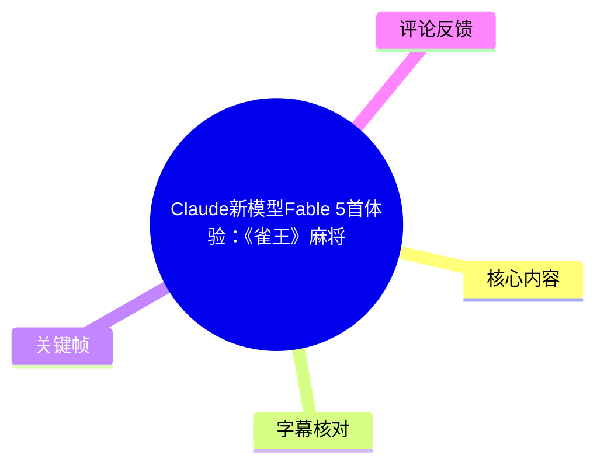
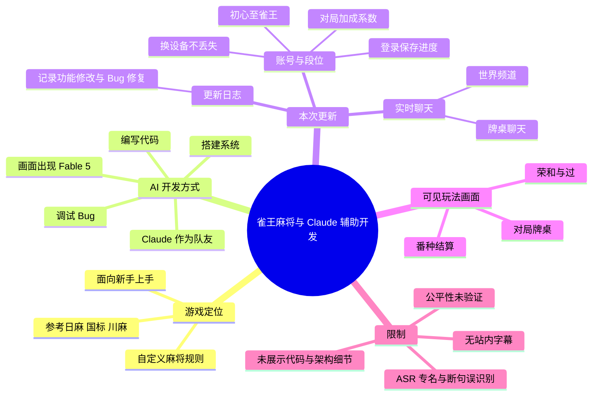
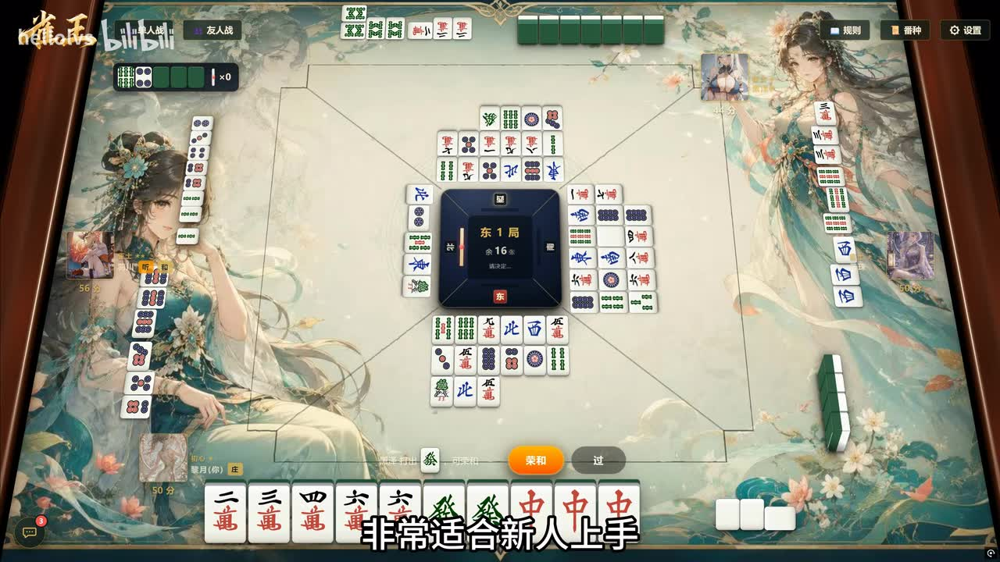
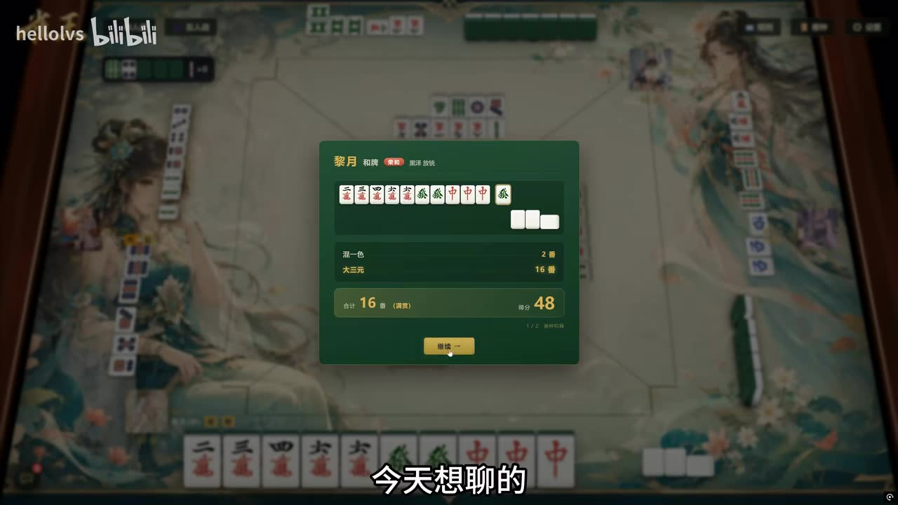
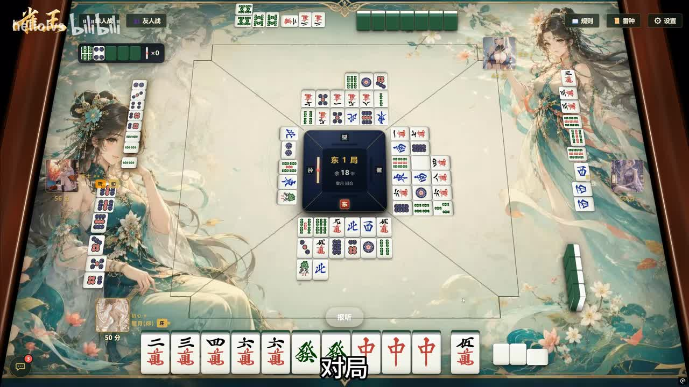
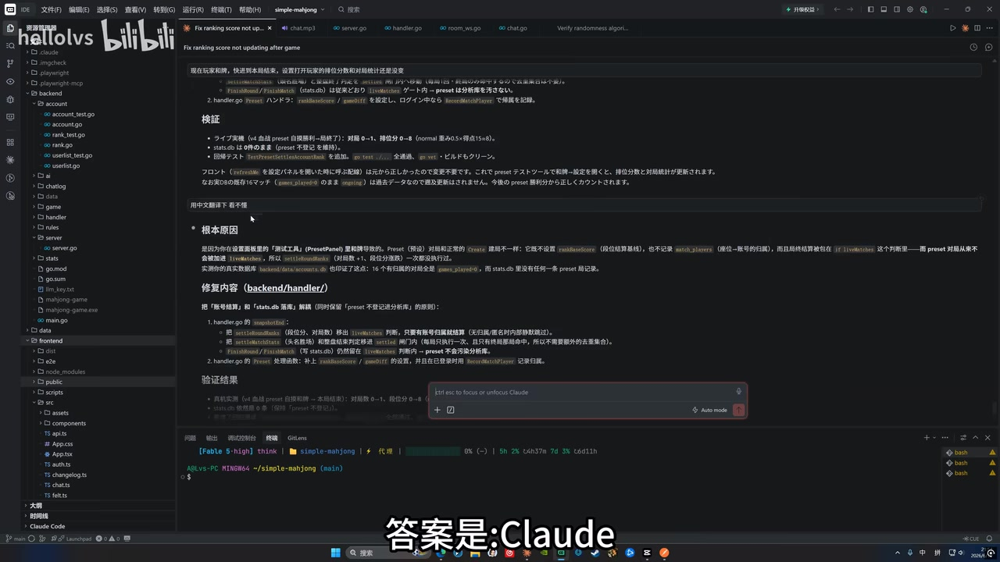

# Claude新模型Fable 5首体验：《雀王》麻将

> 来源：[Bilibili 视频](https://www.bilibili.com/video/BV1crER6zEzS) 
> UP 主：hellolvs｜时长：00:58｜分辨率：3840×2160｜合集：AIcode  
> 视频简介提供的游戏地址：[雀王麻将](https://www.hellolvs.cn/mahjong)（移动端建议全屏使用）。

## 小结

这是一支展示《雀王》麻将近期功能更新、并说明其 AI 辅助开发方式的短视频。UP 主称，这款麻将游戏具备“搓牌、立局、胡牌”等基础玩法，并采用自定义规则，定位是降低新手入门门槛，同时从日麻、国标麻将与川麻中“取长补短”。

视频最重要的信息是：UP 主将 Claude 作为开发协作者，称本轮工作使用了“Claude Fable 5”。根据画面中的 IDE 与 Claude 对话界面，AI 被用于代码编写、系统搭建与调试；但视频没有给出提示词、代码仓库、架构图、模型版本号、调用成本或量化的开发效率数据，因此不能将“提速不止一点点”理解为已被独立验证的性能结论。

本次更新包含三项明确功能：**账号与段位系统**、**更新日志**、**实时聊天系统**。其中账号登录后可保存进度，支持换设备继续使用；段位从“初心”到“雀王”，每局结算分数，并会按 AI 难度、是否真人对局设置不同加成系数。视频还展示了实际对局、可选“荣和/过”的操作，以及带番数与得分的结算界面。

内容适合关注 AI 编程落地、轻量级 Web 棋牌游戏开发、麻将产品机制设计的读者。若要实际判断发牌、公平性、规则完整度、服务器稳定性与账号数据安全，仍需进入游戏自行测试；视频和素材均未提供这些问题的技术证明。

时效性方面，视频发布于 2026 年 6 月，所述功能是当时的版本状态。游戏链接、规则、段位系数、聊天能力以及 Claude 产品名称和可用能力均可能随版本更新发生变化。

## 思维导图

## 目录

- [游戏定位与画面可见玩法](#游戏定位与画面可见玩法)
- [AI 参与开发的范围](#ai-参与开发的范围)
- [本轮更新：账号、段位、日志与聊天](#本轮更新账号段位日志与聊天)
- [体验步骤与可核验参数](#体验步骤与可核验参数)
- [结论、限制与时效性](#结论限制与时效性)
- [字幕比对](#字幕比对)
- [评论分析](#评论分析)
- [关键帧索引](#关键帧索引)
- [处理记录](#处理记录)

## 游戏定位与画面可见玩法 [00:00:28](https://www.bilibili.com/video/BV1crER6zEzS?t=28)

ASR 在 00:28:840 开始识别到旁白。UP 主将《雀王》描述为自己制作的麻将游戏，并称“搓牌、立局、胡牌该有的全都有”。由于 ASR 对若干麻将术语的转写不稳定，这里只将其作为对基础麻将对局流程的概括，不进一步推断具体规则实现。

UP 主的规则定位有三个层面：

1. **独特规则**：视频明确称其为“独特规则”，但未列出完整规则书、牌种构成、计分细则或与传统麻将规则的逐条差异。
2. **新手友好**：旁白称其“非常适合新人上手”。这属于作者的产品判断，视频未展示新手教学、引导流程或上手数据。
3. **多种规则取向的融合**：作者称会从日麻、国标与川麻中取长补短，但没有说明哪些规则被保留、修改或舍弃，不能据此将该游戏归类为任一标准麻将规则的完整实现。

> 图：画面展示四人麻将牌桌、玩家手牌、弃牌区域与右上角“规则”“番种”“设置”等入口。它说明视频不是停留在概念介绍，而是展示了可操作的对局界面；但单帧无法证明完整规则、联机质量或发牌随机性。

> 图：结算弹窗中可见“混一色”“大三元”等番种、合计 16 番及得分 48。该画面能佐证游戏提供了番种识别与结算呈现；它仅代表这一局的界面结果，不足以验证所有牌型与计分规则均正确。

### 可见操作：荣和与过

对局画面中，玩家在可响应牌局状态下可选择“荣和”或“过”。这至少反映出界面会在可执行决策时提供明确按钮，并通过结算弹窗展示和牌结果。画面还可见“听牌”提示与剩余牌数区域，但视频未解释这些提示的触发条件、是否可关闭，也没有演示流局、杠、立直或其他局面。

> 图：这张关键帧清楚呈现对局进行中弹出的“荣和/过”选择，适合用于说明玩家实际交互，而非仅说明游戏宣传文案。

## AI 参与开发的范围 [00:00:28](https://www.bilibili.com/video/BV1crER6zEzS?t=28)

旁白在同一 ASR 分段中转向开发过程：作者表示，本期不只讨论游戏是否好玩，还要说明“它到底是怎么被造出来的”；给出的答案是 Claude，并称使用了最新的“Claude Fable 5”。

需要谨慎处理模型名称：

- 视频标题写作“Claude新模型Fable 5”；
- 关键帧中的开发环境界面可辨识出 Claude 相关交互及 “Fable 5 high” 字样；
- 本次 ASR 将其误识别为“Cloud”“Cloud Fiber 5”。

因此，本文采用标题和画面较一致的写法 **Claude Fable 5**，但不擅自将其等同于任何外部已知的官方 Claude 型号，也不补充视频未提供的厂商信息或发布时间。

作者明确列出的 AI 协作范围是：

| 工作环节 | 视频中的陈述 | 可从素材确认的程度 |
| --- | --- | --- |
| 写代码 | AI 与作者一起完成 | 旁白明确陈述；画面可见 IDE |
| 搭系统 | AI 参与系统搭建 | 旁白明确陈述；未展示架构 |
| 调 Bug | AI 参与问题修复 | 旁白明确陈述；画面可见与开发问题相关的文本 |
| 提升开发速度 | “提速不止一点点” | 作者主观体验；没有工时、提交记录或对照数据 |

> 图：画面含开发环境、项目目录及 Claude 交互面板，底部可见与 “Fable 5” 有关的文字。它对“AI 直接参与开发工作流”提供了视觉上下文，但画面未公开完整代码、提示词或执行日志，不能据此复现项目。

### 可迁移的开发经验

从视频可提炼出的经验不是“有想法即可不需要技术”，而是将 AI 放进实际工程闭环：

1. 以一个已可运行的产品为对象，而不是只生成一次性演示代码。
2. 将需求拆分为代码、系统、调试等连续环节，让 AI 参与迭代。
3. 通过更新日志记录功能变化和 Bug 修复，保留可追溯的开发历史。
4. 对 AI 产出保持验证责任。尤其是涉及麻将规则、计分、匹配或账号数据时，生成代码并不等于规则正确、随机公平或服务可靠。

上述第 4 点是基于工程风险作出的分析，不是视频中展示的测试步骤。

## 本轮更新：账号、段位、日志与聊天 [00:00:29](https://www.bilibili.com/video/BV1crER6zEzS?t=29)

00:29:600—00:53:640 的 ASR 分段集中介绍近期更新。这里的时间轴来自 ASR SRT 原始分段，而非按文字位置估计。

### 1. 账号与段位系统

作者首先介绍“全新账号和段位系统”，明确内容包括：

- **一次登录，进度永久保存**；
- **更换手机或电脑时进度不丢失**；
- 段位从“初心”一路到“雀王”；
- 每局都会计算分数；
- AI 难度和真人对局对应不同的加成系数。

这组机制把游戏进度、跨设备身份与对局成长绑定在一起。值得注意的是，“永久保存”是视频中的产品宣称；素材未说明登录方式、服务端备份策略、数据导出/注销机制、隐私政策、离线状态与异常恢复逻辑。段位算法也只给出“存在不同加成系数”，未给出具体数值、计算公式、扣分规则或匹配机制。

### 2. 更新日志

第二项是更新日志。作者称，每次更新了什么、改了什么、修复哪些 Bug，都在这里记录；其个人判断是可能没有太多人会完整阅读，但仍把它当作开发历程记录。

这一功能的实际价值在于：

- 给玩家提供版本变化的查询入口；
- 让修复和改动具备历史记录；
- 为持续迭代的 AI 协作开发保留可回溯线索。

不过，视频没有展示更新日志页面内容，不能确认其发布日期、版本号格式、历史范围、是否支持搜索，或是否确实覆盖每一次修复。

### 3. 实时聊天系统

第三项为实时聊天。作者说明玩家可以：

- 在牌桌上聊天；
- 在世界频道发言、吐槽或邀人组牌；
- 通过持续对局与交流提升熟悉程度。

实时聊天增加了对局外的社交与组局能力，但视频没有介绍屏蔽、举报、敏感词过滤、未成年人保护、消息留存或房间权限等治理功能。对于公开频道，这些机制会直接影响实际使用体验与安全性，需以产品当前版本为准。

## 体验步骤与可核验参数 [00:00:55](https://www.bilibili.com/video/BV1crER6zEzS?t=55)

视频结尾在 00:55:550—00:57:590 表示：游戏链接在简介中，“打开就能玩”。结合视频简介，可按下列方式体验：

1. 打开简介提供的链接：<https://www.hellolvs.cn/mahjong>。
2. 在移动端使用时，按简介建议切换为全屏。
3. 若要体验跨设备进度与段位，需要先使用游戏当前可提供的登录机制；视频未说明登录入口与账号注册流程。
4. 进入对局后，可观察牌桌中的规则、番种与设置入口；在满足操作条件时，界面会给出如“荣和”“过”的选择。
5. 对局结束后，查看番种、番数与得分结算；再自行检查段位分数是否按 AI 难度或真人对局发生不同变化。
6. 若希望找人对局，可查看牌桌聊天或世界频道是否在当前版本可用。

### 视频中可直接确认的参数与事实

| 项目 | 内容 | 来源与边界 |
| --- | --- | --- |
| 视频时长 | 58 秒 | 元数据 |
| 画面分辨率 | 3840×2160 | 元数据 |
| 游戏链接 | `https://www.hellolvs.cn/mahjong` | 视频简介 |
| 移动端建议 | 全屏使用 | 视频简介 |
| 段位范围 | 初心至雀王 | ASR；“雀王”也与标题、游戏名称相符 |
| 计分影响因素 | AI 难度、真人对局存在不同加成系数 | ASR；系数数值未给出 |
| 可见结算样例 | 混一色、大三元；合计 16 番；得分 48 | 关键帧画面；仅为单局样例 |
| 可见功能入口 | 规则、番种、设置 | 关键帧画面 |

## 结论、限制与时效性

视频展示的是一个由作者持续迭代的麻将产品，以及 Claude 参与实际开发流程的案例。它最具参考价值的部分，在于把 AI 的用途从“生成一段代码”扩展到产品迭代闭环：代码编写、系统建设、问题修复与更新记录共同构成工作流。

但现有素材无法支持以下结论：

- 无法验证“独特规则”相对于日麻、国标或川麻的具体差异；
- 无法验证所有番种、计分、胡牌判定和发牌逻辑正确；
- 无法验证随机性、公平性、反作弊、多人同步、服务器负载或账号数据持久性；
- 无法量化 Claude 带来的时间节省、代码质量提升或成本变化；
- 无法确定“Claude Fable 5”在外部产品体系中的精确型号与能力边界；
- 无法确认实时聊天的内容治理和隐私保护能力。

实际体验时，建议把视频中的“永久保存”“不同加成系数”“实时聊天”等视为发布时的功能说明，再以链接内的当前版本、规则页面和实际结算结果进行复核。

## 字幕比对

| 字幕来源 | 完整性 | 专有名词 | 时间轴 | 主要问题 |
| --- | --- | --- | --- | --- |
| Bilibili 站内字幕 | 未提供可用字幕 | 无法评估 | 无法评估 | 素材明确标注未提供可用站内字幕 |
| 本次 ASR 字幕 | 覆盖约 26.84 秒语音，覆盖率约 46.53%；从 00:28:840 至 00:57:590 | 存在明显误识别 | 有真实 SRT 起止时间 | 长句被压入 3 个分段；“Claude”被识别为“Cloud”，“Fable 5”被识别为“Fiber 5”；部分麻将术语与标点不可靠 |

### 最终字幕选择与校正

本次没有可用站内字幕，因此采用 **本次 ASR 的 SRT 时间轴** 作为章节跳转依据，并结合视频标题、简介和关键帧做有限校正。

重要校正如下：

| ASR 转写 | 本文采用 | 校正依据 |
| --- | --- | --- |
| Cloud | Claude | 视频标题、IDE 关键帧中的 Claude 交互界面 |
| Cloud Fiber 5 | Claude Fable 5 | 视频标题为“Fable 5”；关键帧中可见相关字样 |
| 确王 | 雀王 | 标题《雀王》麻将、游戏名称与上下文一致 |
| 系绅排桌 | 牌桌 | 上下文为实时聊天的使用场景，关键帧为麻将桌面 |
| 湖牌 | 胡牌 | 麻将语境中的常用术语；ASR 误识别可能性高 |

ASR 诊断未标记 `noAudioStream=true`，且识别出了中文语音，因此不能将字幕不足归因于无音轨。其语言识别为中文，置信度约 0.9863；问题主要在于短视频旁白被压缩进极少分段，以及专有名词、术语和断句识别不稳定。

## 评论分析

以下仅基于可获取的热评前三条，不将评论内容视为已验证事实。

1. **zseqw123（682 赞）：“你做的”**  
   - 观点：以简短问句表达对游戏是否由 UP 主制作的惊讶或确认需求。  
   - 补充信息：无。  
   - 分析：视频旁白明确称“这是我做的麻将游戏”，因此这一评论反映的是观众对作品完成度或作者归属的关注，而不是对作者身份的独立证明。

2. **日皇大弟-精神科科长（216 赞）**：认为未来“脑子有想法才是最大生产力”，技术可能变得廉价。  
   - 观点：从 AI 编程体验延伸出“创意比技术更重要”的判断。  
   - 补充信息：无可验证的项目细节。  
   - 分析：视频确实展示了 AI 辅助开发能加速工作，但并不能推出“以后做什么都不需要技术”。游戏规则正确性、系统设计、质量测试、运维和治理仍需要工程判断；该评论应视为对 AI 生产力趋势的乐观观点。

3. **deictic（155 赞）：“发牌认真的吗”**  
   - 观点：对发牌结果或随机性提出质疑。  
   - 补充信息：没有给出具体对局、牌谱或复现步骤。  
   - 分析：这是与棋牌游戏最相关的风险提示之一。单条评论不能证明发牌存在问题，但视频也没有提供随机数来源、洗牌算法、牌谱审计或统计检验，因此发牌公平性仍是待实际测试的开放问题。

## 关键帧索引

| 关键帧 | 正文用途 | 画面价值 |
| --- | --- | --- |
|  | 对局交互说明 | 直接展示“荣和/过”这一玩家决策入口 |
|  | 游戏界面与玩法说明 | 可见四人牌局、手牌、弃牌区及规则/番种/设置入口 |
|  | 番种与计分说明 | 可见混一色、大三元、16 番与 48 分的单局结算样例 |
|  | AI 开发流程说明 | 将旁白中的 Claude 协作与实际开发环境画面关联起来 |

其余关键帧未在正文重复引用：现有四张已分别覆盖核心玩法、交互、结算和开发场景；素材未提供每张关键帧的精确抽帧时间，故不为关键帧虚构时间位置。

## 处理记录

- Worker ID：`worker-mrj0www4-e8d79408`
- 模型：`gpt-5.6-terra`
- 使用素材与工具结果：视频元数据、视频简介、关键帧 `frames/`、本次 ASR 结果 `asr/asr-result.json`、ASR SRT `asr/transcript.srt`、热评数据 `comments/comments.json`。
- 字幕检查：已检查站内字幕与本次 ASR。站内字幕未提供可用内容；本次 ASR 有音频识别结果、带时间戳，语言为中文，未出现 `noAudioStream=true` 标记。
- 字幕选择：以 ASR SRT 的真实起止时间作为时间轴；专有名词依据标题和关键帧作保守校正，不补写未出现的技术细节。
- 关键帧选择依据：优先选择能够直接支撑正文论点的画面，包括牌桌操作、结算信息和 IDE 中的 Claude 协作界面；未为素材未标注时间的帧推定时间点。
- 评论处理：仅处理可获取热评前三条，未扩展至其他评论。
- 缓存清理：提供的素材中未包含缓存清理执行日志，无法核验或宣称已清理；本记录未对原始素材状态作额外推断。
- 未解决问题：完整规则与计分公式、发牌随机性、账号数据策略、聊天治理、联机架构、Claude Fable 5 的精确外部产品信息及 AI 开发效率量化数据，均未在素材中披露。
