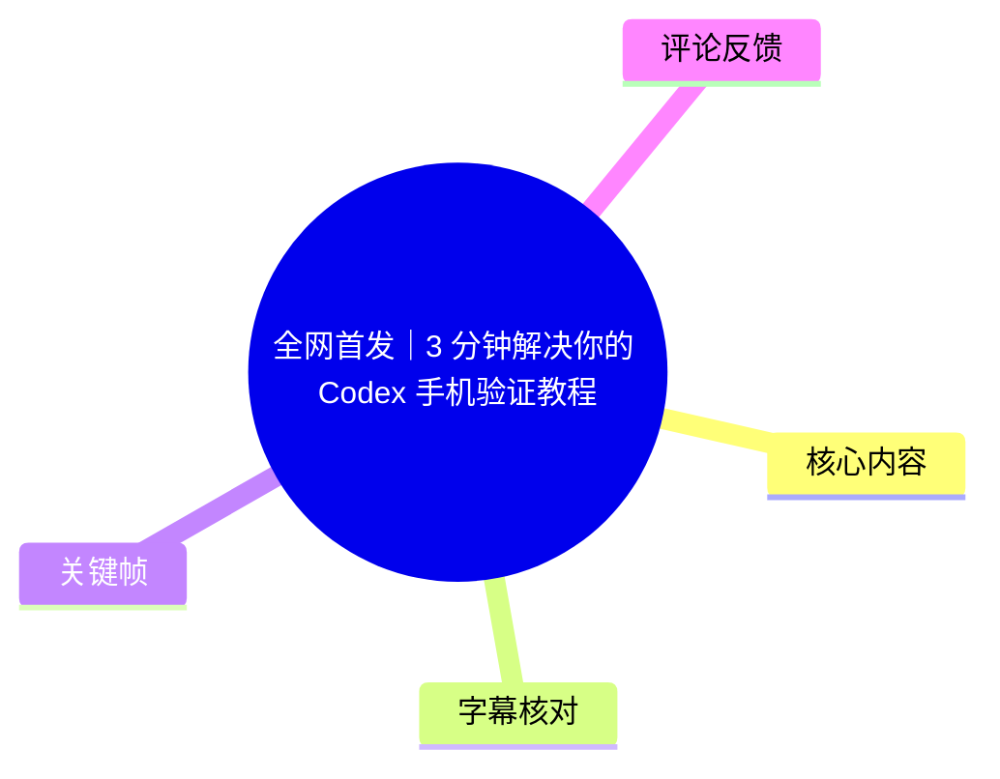
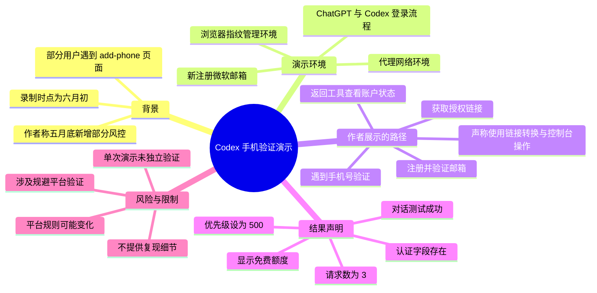
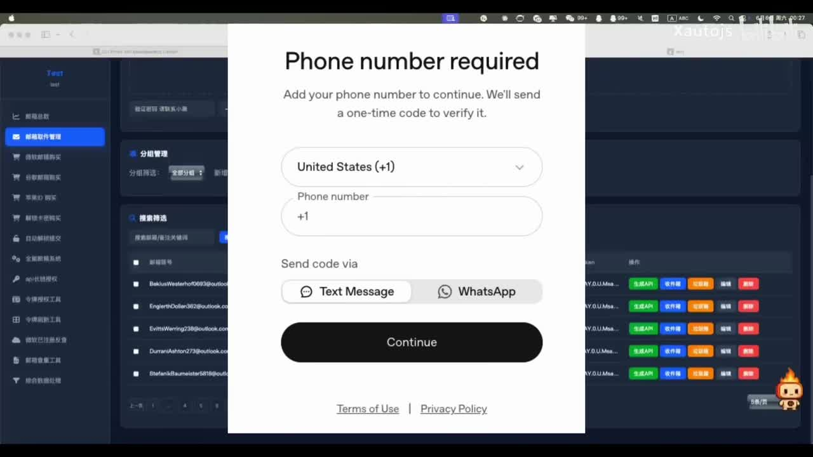
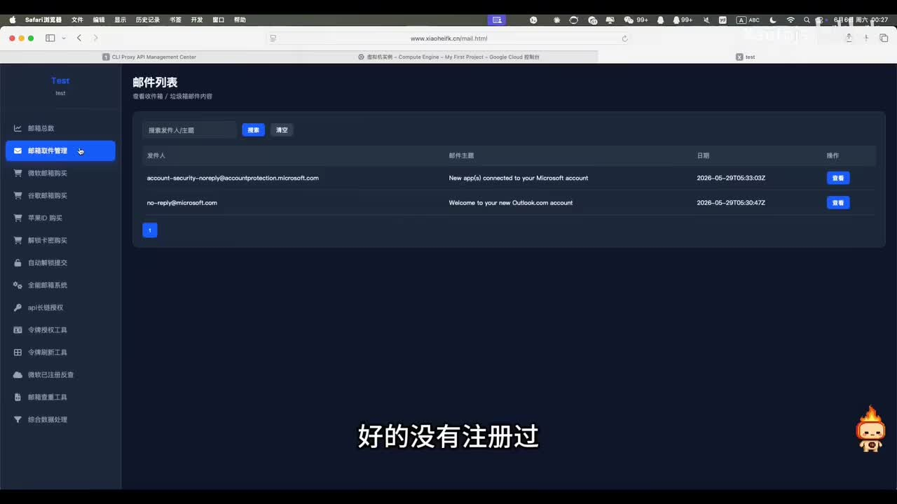
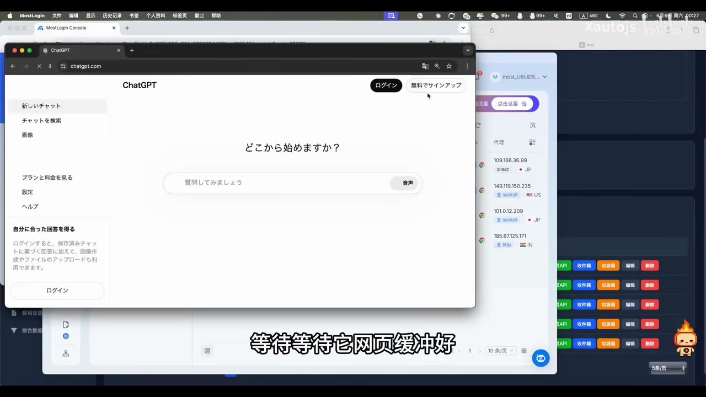
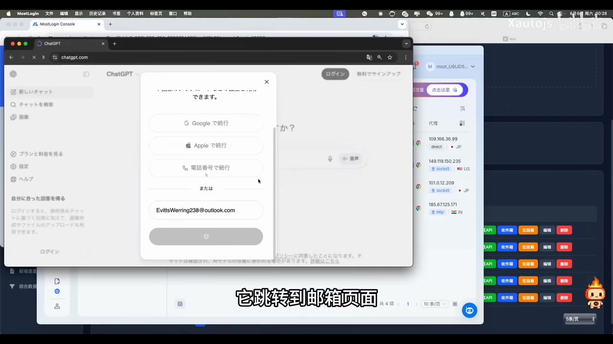

# 全网首发｜3 分钟解决你的 Codex 手机验证教程

> 来源：[Bilibili 视频](https://www.bilibili.com/video/BV1FsEH63Ecc)  
> UP 主：Xautojs｜时长：2 分 56 秒｜分辨率：1920×1080  
> 视频描述：关于 `add-phone` 手机验证

## 小结

视频展示了作者在 2026 年 6 月初录制的一次 Codex 登录与授权演示。作者称，OpenAI 在 5 月底增加了部分风控，部分用户在使用 Codex 时会遇到“需要添加手机号”的验证页；其演示目标是让一个新注册的邮箱账号完成 Codex 授权并发起对话。

演示流程涉及新建微软邮箱账号、在带有代理与浏览器指纹管理功能的环境中访问 ChatGPT、取得授权链接、使用作者所称的“转换脚本”、打开浏览器开发者工具控制台并执行粘贴内容，最终观察到验证页发生跳转。此类行为意在规避平台手机号验证和风控流程，可能违反 OpenAI 服务条款、账号安全政策或当地法律；本文仅记录视频事实与风险，不提供可复现的绕过指令、脚本内容或执行细节。

视频中可见的结果是：作者声称账户侧出现免费额度、认证字段（ASR 识别为 `access token` 与 `id token`）齐全，并将某个认证文件的优先级设置为 **500**。其后在 Codex 中发送“你好”“你是什么模型”等测试问题；作者返回其管理界面刷新后看到“消耗请求是 3”“额度减少 1%”，并据此判断调用成功。上述内容是作者在视频中的单次展示，不能视为对方法有效性、安全性、合规性或可长期使用性的独立验证。

站内字幕与本视频完全不匹配：内容为《英雄联盟》赛事解说，虽然有时间轴但不能用于本视频理解。此次 ASR 有真实音轨、中文识别概率约 0.998，且与画面主题一致，因此以 ASR 时间轴为主；但 ASR 存在大量专有名词误识别、长句合并问题，正文已仅在画面和上下文可支持的范围内校正。

该视频具有很强时效性。作者在片中明确称录制时为“6 月 6 日、周六凌晨 0:30”，而平台策略、注册条件、风控规则、Codex 接入方式与第三方工具功能均可能随时变更。尤其是涉及验证规避的做法，不应据此尝试或用于真实账户。

## 思维导图

## 目录

- [背景：作者称 Codex 出现手机号验证要求](#背景作者称-codex-出现手机号验证要求)
- [演示环境与新邮箱注册](#演示环境与新邮箱注册)
- [常规授权流程与验证拦截](#常规授权流程与验证拦截)
- [作者声称的跳转处理：仅作风险记录](#作者声称的跳转处理仅作风险记录)
- [授权状态、优先级与对话测试](#授权状态优先级与对话测试)
- [结果、参数与可验证边界](#结果参数与可验证边界)
- [结论与限制](#结论与限制)
- [字幕比对](#字幕比对)
- [评论分析](#评论分析)
- [处理记录](#处理记录)

## 背景：作者称 Codex 出现手机号验证要求 [00:00:22](https://www.bilibili.com/video/BV1FsEH63Ecc?t=22)

ASR 从 **00:00:22.920** 开始出现语音，前约 23 秒没有可用的 ASR 语音内容。作者称，当天是“6 月 6 号”；其对背景的表述是：OpenAI 在 5 月底增加了“某些风控”，因此“大部分用户”会弹出手机验证，才能继续使用 Codex。

需要区分以下三层信息：

1. **视频中的主张**：作者声称存在一项近期变化，使部分或多数用户遇到手机验证。
2. **画面可见事实**：关键帧确实显示英文页面“Phone number required”，并要求添加电话号码、选择国家区号、选择短信或 WhatsApp 接收验证码后继续。
3. **无法由素材独立确认的部分**：风控上线的准确日期、受影响用户比例、是否只影响 Codex、是否适用于所有地区或账号类型，均没有官方公告或额外证据佐证。

> 图：画面中央为“Phone number required”页面，文字说明为“Add your phone number to continue. We'll send a one-time code to verify it.”页面可选短信或 WhatsApp 验证。这是理解视频所称“手机验证”障碍的直接视觉证据，也说明其本质属于服务方的账号安全与访问控制环节。

## 演示环境与新邮箱注册 [00:00:22](https://www.bilibili.com/video/BV1FsEH63Ecc?t=22)

### 1. 作者选择未注册过 OpenAI 的微软邮箱 [00:00:22](https://www.bilibili.com/video/BV1FsEH63Ecc?t=22)

作者称其随机选择了一个“没有注册过 OpenAI”的微软邮箱，并通过收件箱确认未收到过注册邮件。画面中可见一个邮件管理后台，列表含 Microsoft 账户相关邮件；字幕也写有“好的没有注册过”。

> 图：后台页面标题为“邮件列表”，可见与 Microsoft 账户有关的邮件条目。它有助于理解作者为何将该邮箱描述为本次演示使用的账户；但仅凭画面不能独立证明该邮箱从未注册过 OpenAI。

### 2. 作者使用的环境要素 [00:00:25](https://www.bilibili.com/video/BV1FsEH63Ecc?t=25)

作者随后提到打开“指纹浏览器”（ASR 误识别为“指纹流感器”），并称已经设置代理；再新建无痕窗口进入 ChatGPT 页面。画面中可见：

- 一个带有多条代理节点列表的侧边窗口；
- ChatGPT 网页；
- 无痕/独立窗口式的浏览器使用方式；
- 作者输入微软邮箱、继续注册的过程。

这些环境要素与平台风控识别、账号注册和访问来源密切相关。视频没有展示代理来源、节点质量、浏览器配置项、指纹参数或所涉工具的合法授权情况，也没有提供可验证的配置说明。

> 图：前景是 ChatGPT 日文界面，右侧可见代理节点或连接信息，后方为账户管理类界面。该图的价值在于佐证视频确实将 ChatGPT 登录与代理/多环境管理同时使用；但不能据此推断这种组合能够通过任何平台的验证。

### 3. 邮件验证和注册完成 [00:00:41](https://www.bilibili.com/video/BV1FsEH63Ecc?t=41)

根据 ASR 时间轴，作者在 **00:00:41.660—00:00:58.470** 描述页面跳转到邮箱、查看收件箱、获取验证码，并返回页面提交。随后在 **00:01:00.400** 左右称账号注册完成，已回到 ChatGPT 首页。

> 图：ChatGPT 登录弹窗中已填写 Outlook 邮箱，界面提供 Google、Apple、电话号码等登录选项。它说明视频所示的是常规账号登录/注册入口，而不是 Codex 专用的独立注册页。

## 常规授权流程与验证拦截 [00:01:00](https://www.bilibili.com/video/BV1FsEH63Ecc?t=60)

作者称，按其“以前的逻辑”，需要通过片中称为“CPA”的界面或服务取得一个授权链接，再将该链接用于令牌授权。ASR 对该名称识别不稳定，素材未提供该工具的全称、来源、功能定义或官方文档，故不能将其扩展解释为某个确定产品。

在 **00:01:00.400—00:01:24.400** 段落中，作者展示的意图顺序为：

1. 在相关界面点击“开始 Codex 登录”；
2. 获取并复制一个授权链接；
3. 回到 ChatGPT/登录页面，以刚注册的微软邮箱登录；
4. 在授权过程中进入要求添加手机号的页面。

这里的关键技术概念是**授权链接与令牌授权**：视频把它们作为连接 Codex 使用端和 OpenAI 登录状态的媒介。不过，视频没有公开链接结构、OAuth 客户端信息、回调地址、令牌签发条件或权限范围；这些均不应猜测。

## 作者声称的跳转处理：仅作风险记录 [00:01:24](https://www.bilibili.com/video/BV1FsEH63Ecc?t=84)

> **安全与合规提示：** 本段内容涉及作者声称绕过或规避手机号验证的操作。手机号验证属于服务提供者的访问控制和反滥用机制。为避免协助绕过账号安全措施，以下仅保留对视频叙事、风险和结果的高层记录，不提供脚本、控制台内容、链接转换规则、粘贴内容或可执行步骤。

### 视频中发生了什么

在 **00:01:24.400—00:01:48.440**，作者表示自己打开了一个“转换脚本”，将先前的授权链接进行“转换”，随后返回手机号验证页，打开浏览器 **F12 开发者工具**的控制台并粘贴内容、回车，等待页面自动跳转。

作者将该过程称为用“神秘代码跳过手机验证”。画面及 ASR 能支持“作者进行了链接处理和浏览器控制台操作”这一描述，但不能验证：

- 脚本具体做了什么；
- 跳转是否真的绕过了平台验证，还是使用了预先存在的会话、授权状态或其他条件；
- 操作是否安全、是否会暴露令牌、Cookie、账户信息或设备指纹；
- 该流程是否具有可重复性，或是否在后续被服务方修复；
- 相关账户是否最终处于合规、可持续的正常状态。

### 为什么不宜将其视为正常解决方案

手机号验证通常服务于账号归属确认、反自动化注册、反滥用、异常登录检测与地区/服务资格限制。通过未验证的脚本、第三方服务或浏览器控制台注入内容处理此类页面，可能带来以下风险：

- **账号风险**：账户被限制、停用、强制复核或后续要求重新验证；
- **凭据风险**：授权链接、访问令牌、会话 Cookie 可能被第三方获取；
- **隐私风险**：邮箱、IP、浏览器信息、支付/订阅关联信息可能暴露；
- **合规风险**：可能违反服务条款或地区规定；
- **可用性风险**：即使短时展示成功，也不代表后续 API、Codex 或网页端仍能持续使用。

更稳妥的处理方向应是使用服务方允许的手机号、联系官方支持、确认账号地区/年龄/网络环境是否符合服务条件，或等待官方提供合规的验证替代方式。

## 授权状态、优先级与对话测试 [00:01:48](https://www.bilibili.com/video/BV1FsEH63Ecc?t=108)

### 1. 作者展示“验证成功”后的账户状态 [00:01:48](https://www.bilibili.com/video/BV1FsEH63Ecc?t=108)

在 **00:01:48.440—00:02:12.570**，作者称页面已不再要求手机验证，并返回前述“CPA”界面查看账户状态。其口述结果包括：

- 搜索刚才注册的微软邮箱；
- 刷新额度数据；
- 认为该账号是“免费账号”，且额度存在；
- 查看认证相关字段；
- ASR 识别出 `access token` 和 `id token`，作者称“该有的参数都有”。

这里应注意，令牌字段在身份认证体系中高度敏感。视频没有展示完整字段内容是正确的；任何人也不应在聊天、评论、截图、公共仓库或第三方工具中泄露此类信息。

### 2. 唯一明确出现的配置参数：优先级 500 [00:02:12](https://www.bilibili.com/video/BV1FsEH63Ecc?t=132)

作者称将“该认证文件的优先级设置成 **500**”，目的为“让对话请求优先走该文件”。视频没有给出该优先级参数的范围、默认值、排序规则、冲突处理机制，亦未说明这一设置属于 Codex、第三方中转工具还是作者的账户管理系统。

因此，可以准确记录的仅是：

| 项目 | 视频中的信息 | 不能确认的内容 |
| --- | --- | --- |
| 参数名称 | 认证文件的“优先级” | 正式字段名、配置文件位置 |
| 参数值 | `500` | 最大/最小取值、默认值 |
| 作者宣称的作用 | 让对话请求优先使用该认证文件 | 是否实际影响 OpenAI/Codex 的请求路由 |
| 参数所属系统 | 未明确，疑似作者使用的管理工具 | 工具名称、开发者、合规性与安全性 |

### 3. Codex 对话测试 [00:02:12](https://www.bilibili.com/video/BV1FsEH63Ecc?t=132)

作者回到 Codex，打开新窗口后进行对话测试：

1. 先发送“你好”；
2. 表示首次对话的首个 token 输出较慢；
3. 等待回复出现；
4. 继续发送“你是什么模型”。

这段演示最多证明作者录屏中的界面出现了回复，不能确认实际调用的底层模型、账户授权链路、回复是否来自目标服务，也不能证明请求没有经过第三方中转。

## 结果、参数与可验证边界 [00:02:36](https://www.bilibili.com/video/BV1FsEH63Ecc?t=156)

在 **00:02:36.630—00:02:54.480**，作者回到管理界面刷新，称刚才的请求“成功”，并给出两项数值性说法：

| 项目 | 作者口述/画面解释 | 证据边界 |
| --- | --- | --- |
| 消耗请求数 | `3` | 仅为作者所用界面显示及其解释，无法确认计数口径 |
| 额度变化 | “减少 1%” | 未展示额度总量、计费规则、刷新前后完整明细 |
| 账户类型 | “免费账号” | 未独立验证账户套餐、地区资格和可用期限 |
| 对话表现 | 首 token 较慢，后续有回复 | 不能据此识别模型、服务路径或长期稳定性 |
| 录制时间 | 作者称“6 月 6 日周六凌晨 0:30” | 是视频内声明，不等同于平台发布时间 |

作者最后结束视频并请求观众三连、评论。视频没有提供后续持续使用的记录，也没有展示官方确认、账号安全状态、异常申诉结果或跨账号复现实验。

## 结论与限制 [00:02:36](https://www.bilibili.com/video/BV1FsEH63Ecc?t=156)

### 可提取的经验

- Codex 的登录、授权与账号状态可能受邮箱验证、会话状态、风险控制、地区及平台政策共同影响。
- 授权链接、访问令牌和身份令牌都属于敏感认证数据，应避免分享、粘贴到未知脚本或交给不可信第三方。
- 单次“能对话”的演示不等于账号处于稳定、合法、可长期使用的状态；应检查服务方的官方账户页、订阅状态、使用条款和安全通知。
- 遇到手机号验证时，优先选择官方支持的验证路径，而不是使用未知脚本或试图改变验证流程。

### 关键限制与时效性

1. **时效性极强**：视频录制于作者所称的 2026 年 6 月初，服务方风控规则可能已经变化。
2. **缺少官方来源**：素材中没有 OpenAI 官方公告、文档或支持工单可用于验证作者的背景判断。
3. **流程不可审计**：所谓“转换脚本”及控制台内容未公开，也不应公开；因而无法审计其安全性与实际功能。
4. **第三方工具未说明**：视频中出现邮箱管理、浏览器指纹、代理、账户/令牌管理等界面，但工具名称、数据处理方式和授权范围均未充分说明。
5. **结果不可泛化**：作者仅展示一个账号、一次流程和一次短对话测试，缺乏对照组、失败案例与长期追踪。
6. **合规风险显著**：规避手机号验证可能违反平台规则；本文不认可、推荐或提供这类操作的复现路径。

## 字幕比对

| 字幕来源 | 完整性 | 专有名词 | 时间轴 | 主要问题 |
| --- | --- | --- | --- | --- |
| Bilibili 站内字幕 `p01-ai-zh.srt` | 覆盖约 00:00:11—00:02:49，但与视频主题无关 | 大量《英雄联盟》人物、英雄与赛事术语 | 有精确分段时间 | 内容为赛事解说，如 Faker、ONER、Keria、贾克斯等，与 Codex、OpenAI、邮箱注册完全不匹配，不能采用 |
| 本次 ASR 字幕 | 覆盖约 00:00:22.920—00:02:54.480；语音覆盖率 84.7% | OpenAI、Codex、ChatGPT、微软邮箱、F12、token 等识别存在误差 | 有真实分段时间，共 8 个长段 | 多句合并、网络/工具名称与英文术语误识别，例如“手机驾驶”“指纹流感器”“gpd”“cpa”等 |

### 最终字幕选择与校正原则

本次素材中的 `asr-result.json` **未标记 `noAudioStream=true`**，并提供时长约 175.10 秒的中文 ASR 结果；因此可确认源视频有音轨，不存在“无音轨而改用画面理解”的情况。

正文以本次 ASR 的起止时间作为时间轴依据，并结合关键帧和上下文做有限校正：

| ASR 原文或疑似误识别 | 正文采用的表述 | 校正依据 |
| --- | --- | --- |
| “open要官方” | OpenAI 官方 | 视频主题、标题、标签与上下文 |
| “手机驾驶” | 手机验证 | 关键帧中的 “Phone number required” 页面 |
| “指纹流感器” | 指纹浏览器/浏览器指纹管理环境 | 作者语义及画面中的多环境管理界面；具体产品名不确定 |
| “gpd” | ChatGPT | 关键帧显示 ChatGPT 页面 |
| “微亚邮箱” | 微软邮箱 | 画面显示 Outlook 邮箱，语境为 Microsoft 登录邮件 |
| “atr t”“id token” | `access token`、`id token`（仅作为作者展示的认证字段） | 常见认证术语与 ASR 音近结果 |
| “cpa” | 片中称为“CPA”的界面/服务 | 无法从素材确定全称，保留不确定性 |

站内字幕虽然具备时间戳，但其语义完全错误；本次 ASR 虽不够精细，却与画面和主题一致，故为主要依据。

## 评论分析

以下仅分析可获取的热评前三条。评论反映的是用户观点，不构成对视频内容的事实验证。

| 排名 | 评论与点赞 | 观点概括 | 可信度与讨论价值 |
| --- | --- | --- | --- |
| 1 | 逃离八角笼（7 赞）：“假的引流的” | 认为视频可能是虚假内容或用于引流 | 这是明确质疑，但未附截图、复现过程或具体反证，不能直接认定视频为假；其价值在于提醒观众审查第三方脚本、工具销售或导流风险 |
| 2 | 20刀可开票（5 赞）：“让我来吧[打call]” | 表达愿意参与或提供帮助，具体含义不明确 | 未提供技术信息、验证证据或风险说明，对判断教程真实性帮助有限 |
| 3 | 習慣獨荇（5 赞）：“是不是本地脚本完成了手机号绑定然后在视频故弄玄虚？” | 推测脚本可能实际完成了手机号绑定，质疑作者把过程包装成绕过验证 | 该评论提出一种可解释视频现象的假设，但同样没有证据。它提示一个关键未解问题：页面跳转并不必然等于真正绕过验证，可能存在预置状态、后台绑定或未展示的前置条件 |

综合评论可见，热评整体并未提供能够独立复现或证伪流程的技术证据，更多是对真实性和操作透明度的质疑。对这类涉及认证和风控的视频，应将质疑视为风险提示，而不是事实结论。

## 处理记录

- Worker ID：`worker-mrj0wbly-5dc4e50c`
- 模型：`gpt-5.6-terra`
- ASR 模型与运行信息：`medium`，语言 `zh`，语言概率 `0.99755859375`，CUDA / `float16`，音频时长约 `175.10` 秒。
- 使用的素材工具/产物：提供的元数据、站内 SRT、`asr/asr-result.json`、`asr/transcript.srt`、热评 JSON、关键帧目录及给出的关键帧画面。
- 字幕选择：已检查站内字幕与本次 ASR。站内字幕为无关的《英雄联盟》赛事解说，弃用；采用本次 ASR 时间轴，并以关键帧与上下文对少数术语做审慎校正。
- 音轨判断：ASR 结果未标记 `noAudioStream=true`，且提供连续语音段；按“源视频有音轨”处理。
- 关键帧选择依据：
  - `frames/frame-001.jpg`：直接展示“Phone number required”页面，支撑问题定义；
  - `frames/frame-002.jpg`：展示邮件列表，支撑作者关于微软邮箱检查的叙事；
  - `frames/frame-003.jpg`：展示 ChatGPT 与代理/多环境管理界面并置，说明演示环境；
  - `frames/frame-004.jpg`：展示 ChatGPT 登录窗口及 Outlook 邮箱输入，说明注册入口。
- 安全处理：对涉及绕过手机号验证、链接转换、控制台粘贴与脚本执行的内容进行了非操作化记录；未输出可复现步骤、脚本、命令、链接规则或注入内容。
- 缓存清理：提供的素材中未包含缓存清理执行记录，无法确认是否已清理；不作未发生事项的声明。
- 未解决问题：
  - “CPA”所指工具或服务全称不明；
  - 所谓转换脚本的来源、行为、安全性与合规性无法审计；
  - 作者展示的成功是否依赖未展示的预设条件无法确认；
  - 额度、请求数和模型调用路径均未获得独立验证。
